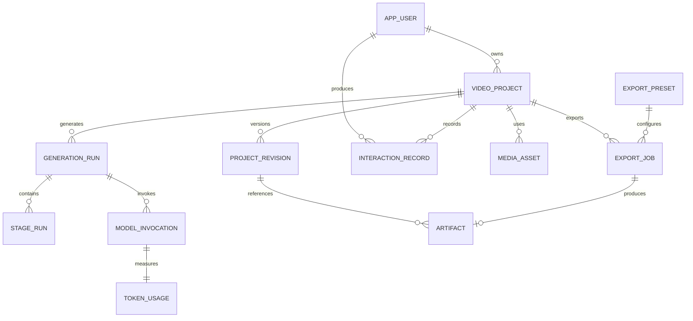

# GameNarrator — DeepSeek 项目上下文包

> 自动生成时间：2026-08-10 09:53:02 +08:00
> 文件数量：327。本文件由 scripts/export-deepseek-context.ps1 生成，请勿手工维护生成区。

## 给 DeepSeek 的强制工作规则

你正在维护一个真实可运行的 Java 21 / Spring Boot 3.2 项目。请先阅读本文件中的项目约束、目录清单和相关源码，再回答或修改。用户的新要求优先于旧文档，但不得擅自扩大范围。

1. 不要虚构不存在的类、接口、API、配置、依赖或测试结果；结论必须能由下方源码验证。
2. 修改应复用现有分层和命名，保持后端、前端、配置、数据库迁移、诊断和测试一致。
3. 平台、浏览器、模型、路径、模板和供应商能力必须配置化，不写死单个平台或本机环境。
4. 不得绕过网站认证、DRM、付费墙或浏览器凭据保护；媒体导入仅处理用户有权使用的内容。
5. 不输出整文件替换，除非用户明确要求；优先给出可应用的 unified diff，并列出受影响文件。
6. 不覆盖无关改动，不删除数据，不使用破坏性 Git 命令。数据库变更必须新增 Flyway 迁移，不能修改已执行迁移。
7. 外部进程必须处理并发输出、超时、中断、退出码、残留进程和安全路径；错误信息不得泄露 Cookie、Token 或完整命令中的秘密。
8. 前端轮询不得覆盖用户正在编辑的表单、重置视频播放位置或反复重建已打开的详情视图。
9. 任务重试应保留已完成阶段；取消应终止实际工作；缓存清理应限制在授权存储目录并可解释清理范围。
10. 修改完成后至少运行 `.\mvnw.cmd test`，报告真实的测试数量与失败原因；不能声称未执行的验证已通过。
11. 若参考 GitHub/Gitee 项目，只借鉴架构和可靠性做法，检查许可证与版本差异，不直接复制不兼容代码。
12. 回答使用简洁中文，先说结果，再说改动文件、验证结果、剩余风险和启动/迁移要求。

## 当前文件清单

- `pom.xml`（2625 bytes）
- `README.md`（4934 bytes）
- `.gitignore`（439 bytes）
- `docs/ANDROID_FEATURE_PARITY.md`（11143 bytes）
- `docs/ANDROID_MODELS.md`（1865 bytes）
- `docs/ARCHITECTURE.md`（2726 bytes）
- `docs/ASSET_LIBRARY_DESIGN.md`（1697 bytes）
- `docs/CLIP_COMPILATIONS.md`（702 bytes）
- `docs/DATABASE_DESIGN.md`（29509 bytes）
- `docs/FRONTEND_DEVELOPMENT.md`（1853 bytes）
- `docs/MANUAL_EDITOR_PARITY.md`（4286 bytes）
- `docs/OBSERVABILITY.md`（1109 bytes）
- `docs/PERFORMANCE_PORTABILITY_AUDIT.md`（10763 bytes）
- `docs/REQUIREMENTS.md`（23033 bytes）
- `docs/STYLE_TEMPLATE_STORE.md`（1190 bytes）
- `docs/VERSIONING.md`（687 bytes）
- `scripts/android-ai-rules.zh-CN.md`（1922 bytes）
- `scripts/android-device-export-check.ps1`（2090 bytes）
- `scripts/build-android-apk.ps1`（2200 bytes）
- `scripts/build-android-release-signed.ps1`（1784 bytes）
- `scripts/build-android-whisper-cli.ps1`（4242 bytes）
- `scripts/build-windows-demo-lite.ps1`（2907 bytes）
- `scripts/build-windows-release.ps1`（14349 bytes）
- `scripts/capture-android-pages.ps1`（8547 bytes）
- `scripts/export-android-ai-context.ps1`（3389 bytes）
- `scripts/export-deepseek-context.ps1`（5568 bytes）
- `scripts/fetch-onnx-models.ps1`（1942 bytes）
- `scripts/generate-app-icon.ps1`（1832 bytes）
- `scripts/install-android-fast.ps1`（1505 bytes）
- `scripts/install-models.ps1`（3340 bytes）
- `scripts/setup-media-importer.ps1`（1038 bytes）
- `scripts/setup-piper.ps1`（1322 bytes）
- `scripts/setup-vision-model.ps1`（931 bytes）
- `scripts/setup-whisper.ps1`（2003 bytes）
- `scripts/sync-remotes.ps1`（1785 bytes）
- `scripts/test-windows-clean-install.ps1`（4098 bytes）
- `scripts/verify-android-guardrails.ps1`（2565 bytes）
- `scripts/verify-before-push.ps1`（1116 bytes）
- `src/main/java/cn/longer233/gamenarrator/ai/AdaptiveAiChatClient.java`（14601 bytes）
- `src/main/java/cn/longer233/gamenarrator/ai/AiContentRejectedException.java`（187 bytes）
- `src/main/java/cn/longer233/gamenarrator/ai/AiSettingsController.java`（1967 bytes）
- `src/main/java/cn/longer233/gamenarrator/ai/AiSettingsService.java`（5376 bytes）
- `src/main/java/cn/longer233/gamenarrator/ai/AiUsageService.java`（3835 bytes）
- `src/main/java/cn/longer233/gamenarrator/asset/AiAssetTagger.java`（8162 bytes）
- `src/main/java/cn/longer233/gamenarrator/asset/AssetCatalogController.java`（12153 bytes）
- `src/main/java/cn/longer233/gamenarrator/asset/AssetCatalogService.java`（54454 bytes）
- `src/main/java/cn/longer233/gamenarrator/asset/AssetDerivativeRequest.java`（294 bytes）
- `src/main/java/cn/longer233/gamenarrator/asset/AssetDownloadService.java`（9244 bytes）
- `src/main/java/cn/longer233/gamenarrator/asset/AssetLibraryProperties.java`（5166 bytes）
- `src/main/java/cn/longer233/gamenarrator/asset/AssetReferenceRequest.java`（833 bytes）
- `src/main/java/cn/longer233/gamenarrator/asset/AssetSearchExpansion.java`（175 bytes）
- `src/main/java/cn/longer233/gamenarrator/asset/AssetSearchRequest.java`（653 bytes）
- `src/main/java/cn/longer233/gamenarrator/asset/AssetStateUpdateRequest.java`（120 bytes）
- `src/main/java/cn/longer233/gamenarrator/asset/AssetTagUpdateRequest.java`（145 bytes）
- `src/main/java/cn/longer233/gamenarrator/asset/AssetView.java`（742 bytes）
- `src/main/java/cn/longer233/gamenarrator/asset/BgeAssetSemanticSearch.java`（9343 bytes）
- `src/main/java/cn/longer233/gamenarrator/asset/BilibiliAssetClient.java`（10379 bytes）
- `src/main/java/cn/longer233/gamenarrator/asset/ChineseAssetQueryExpander.java`（8243 bytes）
- `src/main/java/cn/longer233/gamenarrator/asset/ImportedMediaAsset.java`（271 bytes）
- `src/main/java/cn/longer233/gamenarrator/asset/OpenverseAssetClient.java`（2682 bytes）
- `src/main/java/cn/longer233/gamenarrator/asset/PexelsAssetClient.java`（4927 bytes）
- `src/main/java/cn/longer233/gamenarrator/asset/PixabayAssetClient.java`（4502 bytes）
- `src/main/java/cn/longer233/gamenarrator/asset/PlatformAssetMetadataResolver.java`（3507 bytes）
- `src/main/java/cn/longer233/gamenarrator/asset/SafeRemoteHttpConnector.java`（2332 bytes）
- `src/main/java/cn/longer233/gamenarrator/asset/WikimediaAssetClient.java`（5250 bytes）
- `src/main/java/cn/longer233/gamenarrator/audio/AudioAnalysisService.java`（5357 bytes）
- `src/main/java/cn/longer233/gamenarrator/audio/ProceduralSoundEffectLibrary.java`（4912 bytes）
- `src/main/java/cn/longer233/gamenarrator/audio/SoundCue.java`（192 bytes）
- `src/main/java/cn/longer233/gamenarrator/common/ApiExceptionHandler.java`（7512 bytes）
- `src/main/java/cn/longer233/gamenarrator/common/AtomicArtifactWriter.java`（2074 bytes）
- `src/main/java/cn/longer233/gamenarrator/common/ExternalProcessRunner.java`（7919 bytes）
- `src/main/java/cn/longer233/gamenarrator/common/PhaseRetryExecutor.java`（3901 bytes）
- `src/main/java/cn/longer233/gamenarrator/common/RequestTraceFilter.java`（1908 bytes）
- `src/main/java/cn/longer233/gamenarrator/common/SecurePathGuard.java`（1894 bytes）
- `src/main/java/cn/longer233/gamenarrator/common/StorageCleanupService.java`（8500 bytes）
- `src/main/java/cn/longer233/gamenarrator/common/TaskProcessRegistry.java`（3454 bytes）
- `src/main/java/cn/longer233/gamenarrator/compilation/ClipCompilationController.java`（1836 bytes）
- `src/main/java/cn/longer233/gamenarrator/compilation/ClipCompilationService.java`（4099 bytes）
- `src/main/java/cn/longer233/gamenarrator/config/AsyncConfig.java`（1465 bytes）
- `src/main/java/cn/longer233/gamenarrator/config/ExternalProcessConfig.java`（670 bytes）
- `src/main/java/cn/longer233/gamenarrator/diagnostics/DiagnosticLogService.java`（4016 bytes）
- `src/main/java/cn/longer233/gamenarrator/diagnostics/DiagnosticsController.java`（2339 bytes）
- `src/main/java/cn/longer233/gamenarrator/diagnostics/StartupDiagnostics.java`（563 bytes）
- `src/main/java/cn/longer233/gamenarrator/diagnostics/SystemDiagnosticsService.java`（6625 bytes）
- `src/main/java/cn/longer233/gamenarrator/editor/EditorCommandRequest.java`（294 bytes）
- `src/main/java/cn/longer233/gamenarrator/editor/EditorTimelineController.java`（931 bytes）
- `src/main/java/cn/longer233/gamenarrator/editor/EditorTimelineService.java`（23612 bytes）
- `src/main/java/cn/longer233/gamenarrator/editor/ProjectRevisionController.java`（1043 bytes）
- `src/main/java/cn/longer233/gamenarrator/editor/ProjectRevisionService.java`（2940 bytes）
- `src/main/java/cn/longer233/gamenarrator/editor/ProjectRevisionView.java`（368 bytes）
- `src/main/java/cn/longer233/gamenarrator/editor/RenameRevisionRequest.java`（217 bytes）
- `src/main/java/cn/longer233/gamenarrator/effect/EffectController.java`（1399 bytes）
- `src/main/java/cn/longer233/gamenarrator/effect/EffectPlan.java`（196 bytes）
- `src/main/java/cn/longer233/gamenarrator/effect/EffectPreset.java`（438 bytes）
- `src/main/java/cn/longer233/gamenarrator/effect/EffectPresetCatalog.java`（12206 bytes）
- `src/main/java/cn/longer233/gamenarrator/effect/EffectRerenderWorker.java`（2292 bytes）
- `src/main/java/cn/longer233/gamenarrator/effect/EffectSettingsRequest.java`（536 bytes）
- `src/main/java/cn/longer233/gamenarrator/effect/SemanticEffectPlanner.java`（5208 bytes）
- `src/main/java/cn/longer233/gamenarrator/effect/TransitionType.java`（139 bytes）
- `src/main/java/cn/longer233/gamenarrator/effect/VisualEffectType.java`（386 bytes）
- `src/main/java/cn/longer233/gamenarrator/enhancement/EnhancementJobView.java`（148 bytes）
- `src/main/java/cn/longer233/gamenarrator/enhancement/TaskEnhancementController.java`（1808 bytes）
- `src/main/java/cn/longer233/gamenarrator/enhancement/TaskEnhancementService.java`（6099 bytes）
- `src/main/java/cn/longer233/gamenarrator/event/BossBattleKnowledgePack.java`（406 bytes）
- `src/main/java/cn/longer233/gamenarrator/event/ConfirmedEventScriptService.java`（3191 bytes）
- `src/main/java/cn/longer233/gamenarrator/event/GameEventEvidence.java`（192 bytes）
- `src/main/java/cn/longer233/gamenarrator/event/GameEventFact.java`（210 bytes）
- `src/main/java/cn/longer233/gamenarrator/event/GameEventTimelineController.java`（1295 bytes）
- `src/main/java/cn/longer233/gamenarrator/event/GameEventTimelineService.java`（9800 bytes）
- `src/main/java/cn/longer233/gamenarrator/event/GameEventView.java`（562 bytes）
- `src/main/java/cn/longer233/gamenarrator/event/UpdateGameEventRequest.java`（562 bytes）
- `src/main/java/cn/longer233/gamenarrator/export/CreateExportRequest.java`（471 bytes）
- `src/main/java/cn/longer233/gamenarrator/export/ExportController.java`（1876 bytes）
- `src/main/java/cn/longer233/gamenarrator/export/ExportJobView.java`（510 bytes）
- `src/main/java/cn/longer233/gamenarrator/export/ExportPresetView.java`（544 bytes）
- `src/main/java/cn/longer233/gamenarrator/export/ExportService.java`（7505 bytes）
- `src/main/java/cn/longer233/gamenarrator/export/ExportWorker.java`（12280 bytes）
- `src/main/java/cn/longer233/gamenarrator/export/FfmpegProgressParser.java`（1554 bytes）
- `src/main/java/cn/longer233/gamenarrator/GameNarratorApplication.java`（630 bytes）
- `src/main/java/cn/longer233/gamenarrator/highlight/HighlightClip.java`（722 bytes）
- `src/main/java/cn/longer233/gamenarrator/highlight/HighlightSelectionResult.java`（177 bytes）
- `src/main/java/cn/longer233/gamenarrator/highlight/RuleBasedHighlightSelector.java`（12826 bytes）
- `src/main/java/cn/longer233/gamenarrator/identity/CurrentUserContext.java`（201 bytes）
- `src/main/java/cn/longer233/gamenarrator/identity/LocalUserContext.java`（473 bytes）
- `src/main/java/cn/longer233/gamenarrator/importer/ContentOriginAssessment.java`（148 bytes）
- `src/main/java/cn/longer233/gamenarrator/importer/MediaDownloadJobService.java`（3029 bytes）
- `src/main/java/cn/longer233/gamenarrator/importer/MediaDownloadJobView.java`（219 bytes）
- `src/main/java/cn/longer233/gamenarrator/importer/MediaDownloadProgress.java`（206 bytes）
- `src/main/java/cn/longer233/gamenarrator/importer/MediaDownloadRequest.java`（1017 bytes）
- `src/main/java/cn/longer233/gamenarrator/importer/MediaDownloadResult.java`（710 bytes）
- `src/main/java/cn/longer233/gamenarrator/importer/MediaImportController.java`（17545 bytes）
- `src/main/java/cn/longer233/gamenarrator/importer/MediaImportProperties.java`（3295 bytes）
- `src/main/java/cn/longer233/gamenarrator/importer/MediaPreviewResult.java`（134 bytes）
- `src/main/java/cn/longer233/gamenarrator/importer/MediaResolveRequest.java`（510 bytes）
- `src/main/java/cn/longer233/gamenarrator/importer/MediaVariant.java`（309 bytes）
- `src/main/java/cn/longer233/gamenarrator/importer/PlatformContentClassifier.java`（4630 bytes）
- `src/main/java/cn/longer233/gamenarrator/importer/RemoteProjectImportRequest.java`（919 bytes）
- `src/main/java/cn/longer233/gamenarrator/importer/RemoteProjectImportService.java`（3711 bytes）
- `src/main/java/cn/longer233/gamenarrator/importer/RemoteThumbnailFetchPolicy.java`（3464 bytes）
- `src/main/java/cn/longer233/gamenarrator/importer/RemoteThumbnailService.java`（7640 bytes）
- `src/main/java/cn/longer233/gamenarrator/importer/ResolvedMedia.java`（934 bytes）
- `src/main/java/cn/longer233/gamenarrator/importer/YtDlpMediaImporter.java`（30642 bytes）
- `src/main/java/cn/longer233/gamenarrator/LocalOnlyServerBindingGuard.java`（1831 bytes）
- `src/main/java/cn/longer233/gamenarrator/media/FfmpegMediaPreprocessor.java`（8811 bytes）
- `src/main/java/cn/longer233/gamenarrator/media/FfmpegMediaProbe.java`（3405 bytes）
- `src/main/java/cn/longer233/gamenarrator/media/MediaMetadata.java`（233 bytes）
- `src/main/java/cn/longer233/gamenarrator/media/MediaPreparationResult.java`（211 bytes）
- `src/main/java/cn/longer233/gamenarrator/media/SceneFrame.java`（125 bytes）
- `src/main/java/cn/longer233/gamenarrator/observability/GameNarratorMetrics.java`（3490 bytes）
- `src/main/java/cn/longer233/gamenarrator/observability/InsufficientStorageException.java`（202 bytes）
- `src/main/java/cn/longer233/gamenarrator/observability/StorageCapacityGuard.java`（1973 bytes）
- `src/main/java/cn/longer233/gamenarrator/pipeline/EngineTaskContext.java`（1224 bytes）
- `src/main/java/cn/longer233/gamenarrator/pipeline/FailedVisionTaskRepair.java`（2063 bytes）
- `src/main/java/cn/longer233/gamenarrator/pipeline/PendingTaskRecovery.java`（2188 bytes）
- `src/main/java/cn/longer233/gamenarrator/pipeline/PipelineRunTracker.java`（5774 bytes）
- `src/main/java/cn/longer233/gamenarrator/pipeline/ProjectArtifactRegistry.java`（5450 bytes）
- `src/main/java/cn/longer233/gamenarrator/pipeline/TaskWorkflowStateService.java`（14872 bytes）
- `src/main/java/cn/longer233/gamenarrator/pipeline/VideoTaskEngine.java`（21345 bytes）
- `src/main/java/cn/longer233/gamenarrator/pipeline/WaitingTaskRetryScheduler.java`（2399 bytes）
- `src/main/java/cn/longer233/gamenarrator/render/FfmpegVideoRenderer.java`（22652 bytes）
- `src/main/java/cn/longer233/gamenarrator/render/RenderAssetResolver.java`（2211 bytes）
- `src/main/java/cn/longer233/gamenarrator/render/RenderAudioMixBuilder.java`（4473 bytes）
- `src/main/java/cn/longer233/gamenarrator/render/RenderPreviewService.java`（3182 bytes）
- `src/main/java/cn/longer233/gamenarrator/render/RenderResult.java`（133 bytes）
- `src/main/java/cn/longer233/gamenarrator/render/RenderVideoFilterBuilder.java`（7614 bytes）
- `src/main/java/cn/longer233/gamenarrator/script/AutoAssetAssignmentView.java`（246 bytes）
- `src/main/java/cn/longer233/gamenarrator/script/GeneratedScript.java`（245 bytes）
- `src/main/java/cn/longer233/gamenarrator/script/ManualScriptReviewRequest.java`（341 bytes）
- `src/main/java/cn/longer233/gamenarrator/script/MoveStoryboardSegmentRequest.java`（195 bytes）
- `src/main/java/cn/longer233/gamenarrator/script/OllamaScriptGenerator.java`（22390 bytes）
- `src/main/java/cn/longer233/gamenarrator/script/PlaceStoryboardAssetRequest.java`（307 bytes）
- `src/main/java/cn/longer233/gamenarrator/script/RegenerateScriptSegmentRequest.java`（174 bytes）
- `src/main/java/cn/longer233/gamenarrator/script/ScriptDocumentView.java`（264 bytes）
- `src/main/java/cn/longer233/gamenarrator/script/ScriptQualityReview.java`（318 bytes）
- `src/main/java/cn/longer233/gamenarrator/script/ScriptSegment.java`（233 bytes）
- `src/main/java/cn/longer233/gamenarrator/script/ScriptWorkspaceController.java`（5598 bytes）
- `src/main/java/cn/longer233/gamenarrator/script/ScriptWorkspaceService.java`（23794 bytes）
- `src/main/java/cn/longer233/gamenarrator/script/StoryboardAssetPlacementService.java`（13671 bytes）
- `src/main/java/cn/longer233/gamenarrator/script/StoryboardAssetPlacementView.java`（330 bytes）
- `src/main/java/cn/longer233/gamenarrator/script/StoryboardSegmentView.java`（305 bytes）
- `src/main/java/cn/longer233/gamenarrator/script/StoryboardView.java`（236 bytes）
- `src/main/java/cn/longer233/gamenarrator/script/UpdateScriptSegmentRequest.java`（319 bytes）
- `src/main/java/cn/longer233/gamenarrator/script/UpdateStoryboardAssetRequest.java`（380 bytes）
- `src/main/java/cn/longer233/gamenarrator/script/UpdateStoryboardSegmentRequest.java`（518 bytes）
- `src/main/java/cn/longer233/gamenarrator/storage/VideoStorage.java`（2534 bytes）
- `src/main/java/cn/longer233/gamenarrator/subtitle/AssSubtitleBuilder.java`（3839 bytes）
- `src/main/java/cn/longer233/gamenarrator/task/application/CreateVideoTaskCommand.java`（839 bytes）
- `src/main/java/cn/longer233/gamenarrator/task/application/ProjectHistoryService.java`（4076 bytes）
- `src/main/java/cn/longer233/gamenarrator/task/application/RenameTaskRequest.java`（222 bytes）
- `src/main/java/cn/longer233/gamenarrator/task/application/StageView.java`（767 bytes）
- `src/main/java/cn/longer233/gamenarrator/task/application/TaskNotFoundException.java`（239 bytes）
- `src/main/java/cn/longer233/gamenarrator/task/application/VideoTaskService.java`（11965 bytes）
- `src/main/java/cn/longer233/gamenarrator/task/application/VideoTaskView.java`（4287 bytes）
- `src/main/java/cn/longer233/gamenarrator/task/domain/CommentaryStyle.java`（128 bytes）
- `src/main/java/cn/longer233/gamenarrator/task/domain/EditingScope.java`（108 bytes）
- `src/main/java/cn/longer233/gamenarrator/task/domain/GameEvent.java`（692 bytes）
- `src/main/java/cn/longer233/gamenarrator/task/domain/ProcessingStage.java`（3196 bytes）
- `src/main/java/cn/longer233/gamenarrator/task/domain/ProcessingStageType.java`（277 bytes）
- `src/main/java/cn/longer233/gamenarrator/task/domain/StageStatus.java`（116 bytes）
- `src/main/java/cn/longer233/gamenarrator/task/domain/TaskStatus.java`（150 bytes）
- `src/main/java/cn/longer233/gamenarrator/task/domain/VideoTask.java`（22301 bytes）
- `src/main/java/cn/longer233/gamenarrator/task/repository/VideoTaskRepository.java`（548 bytes）
- `src/main/java/cn/longer233/gamenarrator/task/web/TaskEventStreamService.java`（1895 bytes）
- `src/main/java/cn/longer233/gamenarrator/task/web/VideoTaskController.java`（7603 bytes）
- `src/main/java/cn/longer233/gamenarrator/timeline/TimelinePlanner.java`（4735 bytes）
- `src/main/java/cn/longer233/gamenarrator/timeline/TimelinePlanningResult.java`（246 bytes）
- `src/main/java/cn/longer233/gamenarrator/timeline/TimelineSegment.java`（410 bytes）
- `src/main/java/cn/longer233/gamenarrator/timeline/TimelineValidator.java`（2600 bytes）
- `src/main/java/cn/longer233/gamenarrator/transcription/PlatformSubtitleReader.java`（1439 bytes）
- `src/main/java/cn/longer233/gamenarrator/transcription/SubtitleChunkAnalysisService.java`（4709 bytes）
- `src/main/java/cn/longer233/gamenarrator/transcription/TerminologyCorrector.java`（2256 bytes）
- `src/main/java/cn/longer233/gamenarrator/transcription/TranscriptionResult.java`（196 bytes）
- `src/main/java/cn/longer233/gamenarrator/transcription/WhisperCppTranscriber.java`（5595 bytes）
- `src/main/java/cn/longer233/gamenarrator/vision/FrameOcrService.java`（2499 bytes）
- `src/main/java/cn/longer233/gamenarrator/vision/FrameUnderstanding.java`（592 bytes）
- `src/main/java/cn/longer233/gamenarrator/vision/HighlightHint.java`（131 bytes）
- `src/main/java/cn/longer233/gamenarrator/vision/ImagePerceptualHash.java`（1256 bytes）
- `src/main/java/cn/longer233/gamenarrator/vision/OllamaVisionClient.java`（14553 bytes）
- `src/main/java/cn/longer233/gamenarrator/vision/VideoContentAnalysis.java`（293 bytes）
- `src/main/java/cn/longer233/gamenarrator/vision/VideoSegmentClipService.java`（3911 bytes）
- `src/main/java/cn/longer233/gamenarrator/vision/VideoSegmentSearchController.java`（3764 bytes）
- `src/main/java/cn/longer233/gamenarrator/vision/VideoSegmentSearchResult.java`（256 bytes）
- `src/main/java/cn/longer233/gamenarrator/vision/VideoSegmentSemanticIndex.java`（15114 bytes）
- `src/main/java/cn/longer233/gamenarrator/vision/VideoUnderstandingResult.java`（206 bytes）
- `src/main/java/cn/longer233/gamenarrator/voice/PiperProperties.java`（1758 bytes）
- `src/main/java/cn/longer233/gamenarrator/voice/PiperVoiceGenerator.java`（9894 bytes）
- `src/main/java/cn/longer233/gamenarrator/voice/SilentVoiceGenerator.java`（1970 bytes）
- `src/main/java/cn/longer233/gamenarrator/voice/VoiceGenerationResult.java`（156 bytes）
- `src/main/java/cn/longer233/gamenarrator/voice/VoiceGenerator.java`（595 bytes）
- `src/main/java/cn/longer233/gamenarrator/voice/VoiceOption.java`（137 bytes）
- `src/main/java/cn/longer233/gamenarrator/voice/VoiceRegenerationRequest.java`（419 bytes）
- `src/main/java/cn/longer233/gamenarrator/voice/VoiceSegment.java`（296 bytes）
- `src/main/resources/application.yml`（14337 bytes）
- `src/main/resources/application-lite.yml`（1055 bytes）
- `src/main/resources/application-release.yml`（1153 bytes）
- `src/main/resources/db/migration/V1__database_v2_foundation.sql`（17535 bytes）
- `src/main/resources/db/migration/V10__allow_storyboard_review_task_status.sql`（528 bytes）
- `src/main/resources/db/migration/V11__repair_bilibili_scraped_titles_and_tags.sql`（691 bytes）
- `src/main/resources/db/migration/V12__storyboard_asset_placement.sql`（812 bytes）
- `src/main/resources/db/migration/V13__remove_placeholder_asset_labels.sql`（575 bytes）
- `src/main/resources/db/migration/V14__optional_ai_pipeline.sql`（396 bytes）
- `src/main/resources/db/migration/V15__automatic_pipeline_mode.sql`（109 bytes）
- `src/main/resources/db/migration/V16__editing_scope.sql`（92 bytes）
- `src/main/resources/db/migration/V17__task_cancellation.sql`（246 bytes）
- `src/main/resources/db/migration/V18__full_pipeline_failures.sql`（117 bytes）
- `src/main/resources/db/migration/V19__task_glossary.sql`（71 bytes）
- `src/main/resources/db/migration/V2__backfill_legacy_project_history.sql`（2646 bytes）
- `src/main/resources/db/migration/V20__video_task_optimistic_lock.sql`（70 bytes）
- `src/main/resources/db/migration/V21__clip_compilations.sql`（890 bytes）
- `src/main/resources/db/migration/V22__project_revision_tree.sql`（163 bytes）
- `src/main/resources/db/migration/V23__explainable_game_event_timeline.sql`（1197 bytes）
- `src/main/resources/db/migration/V3__external_asset_catalog.sql`（2371 bytes）
- `src/main/resources/db/migration/V4__asset_library_organization.sql`（270 bytes）
- `src/main/resources/db/migration/V5__asset_semantic_embeddings.sql`（430 bytes）
- `src/main/resources/db/migration/V6__asset_chinese_localization.sql`（152 bytes）
- `src/main/resources/db/migration/V7__storyboard_review.sql`（207 bytes）
- `src/main/resources/db/migration/V8__video_segment_semantic_index.sql`（634 bytes）
- `src/main/resources/db/migration/V9__video_segment_image_hash.sql`（152 bytes）
- `src/main/resources/static/app.css`（65083 bytes）
- `src/main/resources/static/app.js`（107466 bytes）
- `src/main/resources/static/asset-library.js`（39551 bytes）
- `src/main/resources/static/diagnostics.js`（1673 bytes）
- `src/main/resources/static/export.js`（10391 bytes）
- `src/main/resources/static/extension-install.html`（3410 bytes）
- `src/main/resources/static/index.html`（23733 bytes）
- `src/main/resources/static/media-importer.css`（4474 bytes）
- `src/main/resources/static/media-importer.js`（24293 bytes）
- `src/main/resources/static/updates.js`（4417 bytes）
- `src/test/java/cn/longer233/gamenarrator/ai/AdaptiveAiChatClientTest.java`（1725 bytes）
- `src/test/java/cn/longer233/gamenarrator/ai/AiUsageServiceTest.java`（1164 bytes）
- `src/test/java/cn/longer233/gamenarrator/asset/AiAssetTaggerTest.java`（2432 bytes）
- `src/test/java/cn/longer233/gamenarrator/asset/AssetCatalogControllerThumbnailTest.java`（1712 bytes）
- `src/test/java/cn/longer233/gamenarrator/asset/AssetCatalogServiceTest.java`（828 bytes）
- `src/test/java/cn/longer233/gamenarrator/asset/AssetDownloadServiceTest.java`（1904 bytes）
- `src/test/java/cn/longer233/gamenarrator/asset/BgeAssetSemanticSearchRankingTest.java`（581 bytes）
- `src/test/java/cn/longer233/gamenarrator/asset/BilibiliAssetClientTest.java`（6341 bytes）
- `src/test/java/cn/longer233/gamenarrator/asset/ChineseAssetQueryExpanderTest.java`（1742 bytes）
- `src/test/java/cn/longer233/gamenarrator/asset/PlatformAssetMetadataResolverTest.java`（2962 bytes）
- `src/test/java/cn/longer233/gamenarrator/asset/SafeRemoteHttpConnectorTest.java`（834 bytes）
- `src/test/java/cn/longer233/gamenarrator/audio/AudioAnalysisServiceTest.java`（449 bytes）
- `src/test/java/cn/longer233/gamenarrator/audio/ProceduralSoundEffectLibraryTest.java`（1211 bytes）
- `src/test/java/cn/longer233/gamenarrator/common/AtomicArtifactWriterTest.java`（1040 bytes）
- `src/test/java/cn/longer233/gamenarrator/common/ExternalProcessRunnerTest.java`（1623 bytes）
- `src/test/java/cn/longer233/gamenarrator/common/ProcessSleeper.java`（229 bytes）
- `src/test/java/cn/longer233/gamenarrator/common/SecurePathGuardTest.java`（1373 bytes）
- `src/test/java/cn/longer233/gamenarrator/common/StorageCleanupServiceTest.java`（2694 bytes）
- `src/test/java/cn/longer233/gamenarrator/common/TaskProcessRegistryIntegrationTest.java`（1671 bytes）
- `src/test/java/cn/longer233/gamenarrator/config/AsyncConfigTest.java`（991 bytes）
- `src/test/java/cn/longer233/gamenarrator/diagnostics/DiagnosticLogServiceTest.java`（906 bytes）
- `src/test/java/cn/longer233/gamenarrator/effect/EffectPresetCatalogTest.java`（2318 bytes）
- `src/test/java/cn/longer233/gamenarrator/effect/SemanticEffectPlannerTest.java`（1359 bytes）
- `src/test/java/cn/longer233/gamenarrator/enhancement/TaskEnhancementServiceTest.java`（4256 bytes）
- `src/test/java/cn/longer233/gamenarrator/event/ConfirmedEventScriptServiceTest.java`（3697 bytes）
- `src/test/java/cn/longer233/gamenarrator/event/GameEventTimelineServiceTest.java`（3706 bytes）
- `src/test/java/cn/longer233/gamenarrator/export/FfmpegProgressParserTest.java`（1550 bytes）
- `src/test/java/cn/longer233/gamenarrator/highlight/RuleBasedHighlightSelectorTest.java`（5608 bytes）
- `src/test/java/cn/longer233/gamenarrator/identity/LocalUserContextTest.java`（396 bytes）
- `src/test/java/cn/longer233/gamenarrator/importer/MediaImportControllerSessionTest.java`（3224 bytes）
- `src/test/java/cn/longer233/gamenarrator/importer/RemoteThumbnailFetchPolicyTest.java`（1502 bytes）
- `src/test/java/cn/longer233/gamenarrator/importer/RemoteThumbnailServiceTest.java`（476 bytes）
- `src/test/java/cn/longer233/gamenarrator/importer/YtDlpMediaImporterTest.java`（1957 bytes）
- `src/test/java/cn/longer233/gamenarrator/LocalOnlyServerBindingGuardTest.java`（976 bytes）
- `src/test/java/cn/longer233/gamenarrator/media/FfmpegMediaProbeTest.java`（1064 bytes）
- `src/test/java/cn/longer233/gamenarrator/observability/PrometheusEndpointTest.java`（1491 bytes）
- `src/test/java/cn/longer233/gamenarrator/observability/StorageCapacityGuardTest.java`（1278 bytes）
- `src/test/java/cn/longer233/gamenarrator/pipeline/PendingTaskRecoveryTest.java`（3156 bytes）
- `src/test/java/cn/longer233/gamenarrator/pipeline/VideoPipelineEndToEndTest.java`（6606 bytes）
- `src/test/java/cn/longer233/gamenarrator/render/RenderAudioMixBuilderTest.java`（2564 bytes）
- `src/test/java/cn/longer233/gamenarrator/render/RenderPreviewServiceTest.java`（2115 bytes）
- `src/test/java/cn/longer233/gamenarrator/render/RenderVideoFilterBuilderTest.java`（2457 bytes）
- `src/test/java/cn/longer233/gamenarrator/script/ManualNarrationValidationTest.java`（1115 bytes）
- `src/test/java/cn/longer233/gamenarrator/script/OllamaScriptGeneratorTest.java`（3272 bytes）
- `src/test/java/cn/longer233/gamenarrator/script/ScriptWorkspaceServiceTest.java`（6442 bytes）
- `src/test/java/cn/longer233/gamenarrator/script/StoryboardAssetPlacementServiceTest.java`（918 bytes）
- `src/test/java/cn/longer233/gamenarrator/subtitle/AssSubtitleBuilderTest.java`（771 bytes）
- `src/test/java/cn/longer233/gamenarrator/task/DatabaseMigrationTest.java`（6107 bytes）
- `src/test/java/cn/longer233/gamenarrator/task/domain/VideoTaskTest.java`（4664 bytes）
- `src/test/java/cn/longer233/gamenarrator/task/TaskLifecycleIntegrationTest.java`（3749 bytes）
- `src/test/java/cn/longer233/gamenarrator/task/web/VideoTaskControllerTest.java`（16044 bytes）
- `src/test/java/cn/longer233/gamenarrator/timeline/TimelinePlannerTest.java`（2442 bytes）
- `src/test/java/cn/longer233/gamenarrator/timeline/TimelineValidatorTest.java`（1515 bytes）
- `src/test/java/cn/longer233/gamenarrator/transcription/PlatformSubtitleReaderTest.java`（953 bytes）
- `src/test/java/cn/longer233/gamenarrator/transcription/SubtitleChunkAnalysisServiceTest.java`（1373 bytes）
- `src/test/java/cn/longer233/gamenarrator/transcription/WhisperCppTranscriberTest.java`（774 bytes）
- `src/test/java/cn/longer233/gamenarrator/vision/ImagePerceptualHashTest.java`（1287 bytes）
- `src/test/java/cn/longer233/gamenarrator/vision/VideoSegmentClipServiceTest.java`（2242 bytes）
- `src/test/java/cn/longer233/gamenarrator/vision/VideoSegmentSemanticIndexRankingTest.java`（1713 bytes）

## 当前项目原文

### FILE: pom.xml

``xml
<?xml version="1.0" encoding="UTF-8"?>
<project xmlns="http://maven.apache.org/POM/4.0.0"
         xmlns:xsi="http://www.w3.org/2001/XMLSchema-instance"
         xsi:schemaLocation="http://maven.apache.org/POM/4.0.0 https://maven.apache.org/xsd/maven-4.0.0.xsd">
    <modelVersion>4.0.0</modelVersion>
    <parent>
        <groupId>org.springframework.boot</groupId>
        <artifactId>spring-boot-starter-parent</artifactId>
        <version>3.2.0</version>
        <relativePath/>
    </parent>

    <groupId>cn.longer233.graduation</groupId>
    <artifactId>game-narrator</artifactId>
    <version>2.1.4</version>
    <name>GameNarrator</name>
    <description>多模态游戏视频智能解说与自动剪辑系统</description>

    <properties>
        <java.version>21</java.version>
        <maven.compiler.parameters>true</maven.compiler.parameters>
        <project.build.sourceEncoding>UTF-8</project.build.sourceEncoding>
        <project.reporting.outputEncoding>UTF-8</project.reporting.outputEncoding>
    </properties>

    <dependencies>
        <dependency>
            <groupId>org.springframework.boot</groupId>
            <artifactId>spring-boot-starter-web</artifactId>
        </dependency>
        <dependency>
            <groupId>org.springframework.boot</groupId>
            <artifactId>spring-boot-starter-data-jpa</artifactId>
        </dependency>
        <dependency>
            <groupId>org.springframework.boot</groupId>
            <artifactId>spring-boot-starter-validation</artifactId>
        </dependency>
        <dependency>
            <groupId>org.springframework.boot</groupId>
            <artifactId>spring-boot-starter-actuator</artifactId>
        </dependency>
        <dependency>
            <groupId>io.micrometer</groupId>
            <artifactId>micrometer-registry-prometheus</artifactId>
        </dependency>
        <dependency>
            <groupId>com.h2database</groupId>
            <artifactId>h2</artifactId>
            <scope>runtime</scope>
        </dependency>
        <dependency>
            <groupId>org.flywaydb</groupId>
            <artifactId>flyway-core</artifactId>
        </dependency>
        <dependency>
            <groupId>org.springframework.boot</groupId>
            <artifactId>spring-boot-starter-test</artifactId>
            <scope>test</scope>
        </dependency>
    </dependencies>

    <build>
        <plugins>
            <plugin>
                <groupId>org.springframework.boot</groupId>
                <artifactId>spring-boot-maven-plugin</artifactId>
            </plugin>
        </plugins>
    </build>
</project>
``

### FILE: README.md

``text
# GameNarrator

多模态游戏视频智能解说与自动剪辑系统。项目使用 Java 21 与 Spring Boot 3.2 从零实现，
不复制其他业务项目的源码、页面、数据库迁移或静态素材。

完整产品范围、功能优先级和验收标准见 [产品需求文档](docs/REQUIREMENTS.md)。
多用户、Token 统计、轻量工程和按需导出方案见 [数据库设计](docs/DATABASE_DESIGN.md)。

## 已实现

- 游戏视频上传与本地安全存储
- 视频任务、九阶段处理流程和游戏事件领域模型
- H2 持久化与 REST API
- 动漫游戏风格的原创任务工作台
- 核心领域单元测试

## 版本演进规划

### 1.0：自动视频剪辑与特效生成

完成可正常使用的自动视频剪辑流程，支持素材分析、片段筛选、文案生成、
AI 配音、时间线编排和成片导出，并逐步覆盖市面上常见的视频特效、字幕、
转场、贴图、音效和画面包装能力。

### 2.0：可编辑的 AI 剧情与分镜工作台

支持用户手动修改 AI 生成的剧情、解说文案和剪辑决策，提供完整的分镜与
时间线展示页面。用户可以调整镜头顺序、片段起止时间、字幕、配音、特效和
剧情节奏，再由系统重新渲染成片。

### 3.0：AI 动画剧场与 Meme 创作

引入本地 AI 绘图和视觉生成能力，根据脚本创作动画剧场所需的角色、场景、
表情和过场画面；结合网络流行文化特征，生成与当前传播语境相符的 Meme、
梗图和视频包装素材。

### 4.0：多创作者风格与一键生成

建立可扩展的创作风格模板系统，支持多个 UP 主类型的节奏、文案、配音、
字幕、特效和镜头组织方式。在避免直接复制具体作品的前提下，提取可描述的
风格特征，并提供从原始素材到成片的一键生成能力。

### 5.0：AI 创意助手与智能素材规划

增加 AI 创意助手。用户输入游戏、动漫、生活片段或大致创作要求后，系统可
生成多套脚本方案供选择，并为选定方案给出所需画面、镜头类型、台词、音效、
特效和素材清单。对于游戏或动画类主题，系统还能在获得合法素材来源和使用
授权的前提下，自动检索、匹配和整理所需素材。

九阶段流程：

1. 素材入库
2. 镜头切分
3. 语音转写
4. 画面理解
5. 高光筛选
6. 解说文案
7. AI 配音
8. 时间线规划
9. 视频合成

## 本地模型建议

针对 RTX 4060 Laptop 8GB 与 16GB 内存，后续适配器优先选择：

- ASR：faster-whisper small / medium（独立 Python 推理服务）
- VLM：Qwen2.5-VL 3B 量化版
- LLM：Qwen2.5 7B Q4
- TTS：GPT-SoVITS 或 Bert-VITS2
- 视频处理：FFmpeg

Java 服务通过 HTTP 调用这些本地推理服务，避免在 JVM 内直接加载显存模型。

## 运行

项目包含 Maven Wrapper，不需要全局安装 Maven：

```powershell
.\mvnw.cmd test
.\mvnw.cmd spring-boot:run
```

首次启用本地语音转写时，在 PowerShell 中执行：

```powershell
.\scripts\setup-whisper.ps1
```

脚本会安装 whisper.cpp 和多语言 `base` 模型到 Git 忽略的 `tools/`、`models/`
目录。启动后访问 `/api/debug/health`，确认 `whisperAvailable` 为 `true`。

首次启用画面理解时执行：

```powershell
.\scripts\setup-vision-model.ps1
```

脚本会安装 Ollama 并下载 `qwen2.5vl:3b` 本地视觉模型。启动后确认健康检查中的
`visionModelAvailable` 为 `true`。

浏览器访问 `http://localhost:8081`。如果需要临时使用其他端口：

```powershell
$env:SERVER_PORT=8090
.\mvnw.cmd spring-boot:run
```

数据默认写入 `data/`，上传视频写入 `storage/`，两者均不提交到 Git。

## 调试错误

控制台与 `logs/game-narrator.log` 会输出每个请求的 `traceId`、耗时、上传文件元数据、
任务 ID 和完整异常堆栈。前端错误信息也会显示相同的追踪号。

需要临时增加日志时：

```powershell
$env:GAME_NARRATOR_LOG_LEVEL="TRACE"
$env:HIBERNATE_SQL_LOG_LEVEL="DEBUG"
.\mvnw.cmd spring-boot:run
```

定位某次错误：

```powershell
Select-String -Path .\logs\game-narrator.log -Pattern "trace=前端显示的追踪号"
```

运行后访问 `http://localhost:8081/api/debug/health`，可以检查 Java 版本、可用内存、
存储目录写权限和 FFmpeg 是否可调用。

如果 FFmpeg 没有加入 PATH，也可以显式指定：

```powershell
$env:FFMPEG_COMMAND="C:\path\to\ffmpeg.exe"
.\mvnw.cmd spring-boot:run
```

## 许可证

本项目采用 [MIT License](LICENSE)。

## 论文创新点建议

- 融合音频强度、视觉事件置信度和语义重要性的高光评分方法
- 针对游戏类别自适应的解说文案规划
- 解说语速、句子边界与高光片段时长的对齐算法
- 本地开源模型在消费级显卡上的速度、显存与质量对比实验
``

### FILE: .gitignore

``text
target/
.idea/
.reference/
frontend/node_modules/
frontend/.vite/
frontend/dist/
android-app/.gradle/
android-app/.gradle-dist/
android-app/local.properties
android-app/keystore/
keystore.properties
android-app/**/build/
launcher/bin/
launcher/obj/
dist/
release/cache/
release/staging/
release/staging-lite/
release/desktop-publish-check/
skill-build/
*.iml
data/
storage/*
!storage/.gitkeep
.env
*.log
logs/
tools/
models/
tools/yt-dlp/
``

### FILE: docs/ANDROID_FEATURE_PARITY.md

``text
# GameNarrator Android 功能同步矩阵

本文件以当前桌面本体源码、控制器、前端和迁移为验收基线。Android 必须完全独立运行；“入口存在”不等于功能完成。

| 本体能力 | Android 状态 | 验收要求 |
|---|---|---|
| 本体新粗野主义视觉、品牌与导航 | 已完成（模拟器截图） | 视觉、品牌与导航已按桌面本体实现；模拟器首页截图见 docs/android-home-screen.png，逐页对照与正式真机验收仍建议在真机上完成 |
| 源监视器与精确修剪 | 已完成 | 原片播放、片段定位、按真实帧率逐帧、触屏与 J/K/L、播放速度、入点/出点标记及历史持久化均已实现 |
| 创建任务、运行中、最近完成 | 已完成 | 创建任务表单（名称/内容类别/解说风格/剪辑范围/目标时长/创作要求/术语纠错词表/分镜后暂停/自动剪辑流程）已持久化并在首页任务卡展示；多项目、重命名、复制、软删除回收站、恢复、永久清理、状态恢复、导出取消/重试，以及一键自动流水线已实现：Whisper 离线转写缺失字幕 → GPT-2 生成缺失解说文案 → 离线 TTS 批量合成配音 → 自动导出；勾选“启动自动剪辑流程”后导入视频会自动启动该流水线，勾选“分镜后暂停”时在文案生成后等待检查；端侧模型未安装时明确提示并保留可完成部分 |
| 自由时间线、撤回/恢复、分割、连接、删除 | 已完成 | 缩放、拖拽、播放头和 50 步历史，片段左右边缘可直接拖拽调整入点/出点，以及 V1 主视频轨、V2 视频叠层轨、A1 纯音频轨多轨时间线（轨道分配、导出按轨合成、归档/分支保留轨道）均已实现 |
| 项目版本树与历史检出 | 已完成 | 100 个 SQLite 修订快照、检出、版本命名、从任意快照建立独立分支、项目归档导出、事务化恢复、版本差异对比与分支合并（只补缺失/覆盖同名）均已实现 |
| 分镜、字幕、解说、审阅 | 已完成 | 字幕/解说/特效提示编辑、项目级 SRT、按全局时间码真实烧录，以及与本体一致的逐分镜“通过/需修改”和 500 字备注已完成 |
| 文案质量评审 | 已完成 | 手机离线输出 0–100 分并检查空字段、重复、明显乱码、镜头可配音时长；端侧画面一致性检查已接入（MobileNet 提取分镜画面标签，与解说文案做本地启发式比对并标注需人工复核） |
| 分镜重新配音 | 已完成 | 读取设备实际安装的离线 TTS 音色，逐分镜保存音色、0.5–2.0 倍语速和音调；重新生成会替换旧解说轨 |
| 画面调整 | 基础完成 | 逐片段结构化保存亮度、对比度、饱和度、红蓝通道色温、色相、25–300% 缩放和旋转，并通过 Media3 GPU 效果真实导出；曲线调色已通过 FFmpeg 导出预设（电影感曲线）可用，调色轮（HSL 色相/饱和度/明度）已可用，LUT 待接入 |
| 关键帧 | 已完成 | 支持在播放头写入任意多个缩放、旋转、水平/垂直位置、透明度和 0–200% 音量关键帧，Media3 按帧/采样插值，音量可与基础增益及淡入淡出共同工作；关键帧曲线编辑器支持线性/缓入/缓出/缓入缓出并按曲线真实导出 |
| 多轨、音频波形、素材放置 | 已完成 | 图片/视频素材支持位置、缩放和真实 GPU 叠加；音频素材及视频片段原声支持 0-200% 音量、等功率淡入淡出、真实 PCM 峰值、持续过载/静音告警和安全音量建议，以及轨道静音与独奏 |
| 特效模板、动态字幕、转场 | 已完成 | 6 类提示、逐字动态字幕、片段边界淡入淡出、特效模板库（保存/应用/删除、应用时合并去重、JSON 导出/导入）和重叠交叉转场（Media3 合成器平滑 alpha 交叉淡化，支持多个转场并与视频素材叠加）均已接入真实 GPU 导出 |
| 导出预设、任务、下载结果 | 已完成 | 任务、进度、取消、重试、播放和共享已实现；720p/1080p/原画质、自定义参数、能力探测后的 HEVC、横竖屏平台画布真实接入 Media3，预设写入任务历史；整片与单镜头导出均已接线 MOV 封装、ProRes 422 与电影感曲线（内置 arm64 FFmpeg），真机验证（FfmpegDeviceTest）已通过 |
| 素材库、标签、派生与预览 | 已完成 | 本地导入、缩略图、名称/类型/标签检索、移除、引用关系、图片/视频/音频完整预览，以及从片段派生封面素材（自动加“派生/封面”标签）均已实现 |
| 公共素材搜索与素材站导航 | 基础完成 | Wikimedia Commons / Openverse 匿名搜索（图片/音频、许可与作者信息、来源页跳转、复制直链）与素材站导航已实现；素材库可按当前任务名一键推荐素材；首页导航已补齐 AI 设置、公共素材、素材站导航、使用引导、更新公告入口；下载入库仍需先确认权利，Pexels/Pixabay API Key 与 Bilibili 候选素材待配置 |
| 镜头文本/图像搜索与片段导出 | 已完成 | 镜头文本检索（名称/字幕/解说/特效提示）当前为关键词检索并明确标注，语义向量检索需另装 embedding 模型、未安装时不会宣称语义能力；镜头定位和独立片段导出已实现；图像相似度检索已接入 MobileNet 特征 + 余弦相似度（ImageSearchIndex），真机验证通过（ImageSearchDeviceTest：MobileNet 真实提取特征并正确检索匹配镜头） |
| 平台导入与下载任务 | 基础完成 | HTTP/HTTPS 媒体直链支持手机端进度、取消、原子落盘、类型和存储检查，并可建立项目（能力状态页标记为本地可用）；网页解析（og:video、video/source）与格式选择（MP4/MOV/WEBM/MKV/音频）已实现；Bilibili 登录助手支持“本机确认（B 站 App）”直接拉起已安装 App 完成确认并自动取回会话，也保留官方扫码登录与 cookies.txt 内存会话（read/cv、opus 提取，Cookie 自动带到直链解析与下载，仍仅内存、1 小时失效）；真实账号确认后的直链下载验证与真机逐页验收仍需用户操作 |
| 合集与片段排序 | 已完成 | 跨项目加入片段、SQLite 持久化、上下排序、移除以及生成独立剪辑项目均已实现 |
| 转写、画面理解、文案、配音 | 已完成（本地模型） | Android 系统中文 TTS 可生成真实 WAV 并自动进入分镜混音；系统语音识别（离线可用时动态标记为本地可用）与 ML Kit 端侧图像标签已接入 AI 设置页；Whisper 自动字幕已接入片段面板与一键自动流水线（FFmpeg 抽 WAV → 端侧转写 → 写分镜字幕）；GPT-2 分镜文案生成已接入片段面板与自动流水线；MobileNet 画面分类与图像相似度检索已接入；模型随 assets/models 打包，首启自动复制 |
| AI 设置、用量和模型检查 | 已完成 | 端侧引擎检查页只展示已安装可运行引擎，未安装能力明确标注；云端 AI 设置支持加密保存并“测试连接（真实请求所选服务商）”；离线 TTS 音色列表与项目/版本/导出/素材/数据库用量已实现 |
| 任务启动、取消、重试与阶段恢复 | 已完成 | 项目流水线六阶段（导入/修剪/分镜/配音素材/版本/渲染）持久化并可从当前阶段恢复；导出、下载与 TTS 支持真实停止，重试创建新任务且不覆盖终态；智能增强工具箱提供“自动匹配素材（按任务推荐开放素材）”与“自动规划特效并渲染（按内容类别写入特效提示后导出）” |
| 诊断、日志导出、存储清理 | 已完成 | 设备/CPU/内存/存储/媒体编码器诊断、无凭据报告复制与分享、安全缓存清理，以及最多 2000 条 / 1 MiB 的 JSONL 结构化运行日志查看/导出/清空均已实现 |
| 使用引导、更新公告 | 已完成 | 首次启动引导、可重开的完整操作引导和与 Android 实际版本一致的更新公告已实现 |
| 未来版本规划 | 已完成 | 设置页提供与本体一致的 1.0–5.0 路线图（自动剪辑、AI 剧情分镜工作台、AI 动画剧场/Meme、多创作者风格、AI 创意助手） |
| 签名发行、升级与真机兼容 | 基础完成 | 已提供本地测试密钥的 release 签名 APK 与一键构建脚本；生产正式签名密钥与 Android 真机端到端验证仍需用户提供 |

## 撤回/恢复覆盖矩阵

| 操作 | 状态 | 验证 |
|---|---|---|
| 删除片段 | 已有 | TimelineCommandsTest.deleteUndoRedo |
| 移动片段 | 已有 | TimelineCommandsTest.moveUndoRedo |
| 替换 | 已有 | TimelineCommandsTest.replaceUndoRedo |
| 分割 | 已有 | TimelineCommandsTest.splitUndoRedo |
| 字幕编辑 | 已有 | ProjectControllerTest 与 SnapshotProjectStateTest 覆盖分镜字幕和项目级精确字幕 |
| 音频修改 | 已有 | SnapshotProjectStateTest 与 ProjectControllerTest 覆盖音量、淡入淡出和轨道静音/独奏 |
| 特效修改 | 已有 | SnapshotProjectStateTest 与 ProjectControllerTest 覆盖关键帧、视觉参数和特效模板 |

规则保持：最多 50 步历史（CommandHistory.DEFAULT_LIMIT）；撤回/恢复只还原项目快照，不重建播放器或刷新整个交互页面。

## 导出链路测试覆盖

| 场景 | 测试证据 |
|---|---|
| 生命周期与终态保护 | ExportStateMachineTest 覆盖 prepare/run/complete/cancel/fail/reset 与终态不可覆盖 |
| 取消 | ExportManagerTest.cancelInvokesRunnerAndReachesCancelled 真实调用 runner.cancel 并进入 CANCELLED |
| 进度 | ExportManagerTest.reportsProgressFromRealRunner 通过 runner 轮询上报百分比 |
| 错误状态 | ExportManagerTest.runnerErrorFailsExport 与 abortMarksInterruptedFailure 覆盖 FAILED |
| 完成 | ExportManagerTest.runnerCompletionCompletesExport 覆盖 COMPLETED |
| 中断恢复 | ExportManagerTest.abortMarksInterruptedFailure 与 ExportRecoveryPolicyTest 只清理中断且应用自有目录输出 |
| 多片段时间线 | ExportTimelinePlanTest 验证 V1 主轨跨 V2/A1 片段仍按全局时间轴定位 |
| 设备端多片段导出 | DeviceExportSmokeTest.multiClipExportCompletesOnDevice 在 API 34 模拟器上真实执行双片段 Media3 Transformer 导出并校验输出文件 |
| 设备端取消 | DeviceExportSmokeTest.cancelStopsExportOnDevice 真实调用 Transformer.cancel，取消回调缺失时由 5 秒兜底进入 CANCELLED |

设备端测试通过 `connectedDebugAndroidTest` 运行：13 tests passed（0 skipped、0 failed）。

规则校验：`scripts/verify-android-guardrails.ps1` 可重复检查禁止宣称、云端/凭据模式与 50 步历史限制。

能力状态统一：`AiCapabilityState` 作为唯一可信状态源，区分可用/本地可用/需要云端/未实现/禁用；UI 不再直接依赖单一 boolean。

架构拆分：`MainActivityActions` 已拆为 Page/Edit/Export 三个 Actions；`TaskDialogController` 已拆为 Project/Timeline 两个对话框控制器，主类只保留装配与委托。
``

### FILE: docs/ANDROID_MODELS.md

``text
# Android 端侧模型部署

## 模型目录

设备端实际读取目录是应用的 `getExternalFilesDir("models")`：

```text
/storage/emulated/0/Android/data/cn.longer233.gamenarrator.mobile/files/models/
```

打包进 APK 时放在：

```text
android-app/app/src/main/assets/models/
```

首次启动会把 `assets/models/` 里的以下文件复制到设备模型目录：

- `whisper-*.bin`：Whisper.cpp 转写模型
- `whisper-cli` 或 `whisper-cli.exe`：whisper.cpp 可执行引擎（Android 真机请用 `whisper-cli`）
- `vision-*.onnx`：端侧画面语义理解模型
- `text-*.onnx`：端侧文案/分镜生成模型

## Whisper

下载 tiny 模型并直接推送到设备：

```powershell
.\scripts\install-models.ps1 -Device <serial> -Whisper
```

下载模型、推送到设备并同时复制进 `assets/models/`：

```powershell
.\scripts\install-models.ps1 -Whisper -Bundle
```

Android 版 `whisper-cli` 没有官方预编译产物，需要按设备 ABI 编译：

```powershell
.\scripts\build-android-whisper-cli.ps1 -Abi arm64-v8a
```

产物在 `dist\whisper-android\arm64-v8a\whisper-cli`，可用 `install-models.ps1 -EnginePath <路径>` 推送，或直接复制到 `assets/models/`。

## ONNX

`vision-*.onnx` 与 `text-*.onnx` 需要指定具体模型和输入输出约定，不能随便拿文件冒充可用。确认模型来源、许可证与输入输出后：

一键下载推荐模型（MobileNetV2 视觉 + GPT-2 量化文案）：

```powershell
.\scripts\fetch-onnx-models.ps1
```

只下载其中一个：

```powershell
.\scripts\fetch-onnx-models.ps1 -VisionOnly
.\scripts\fetch-onnx-models.ps1 -TextOnly
```

或手动部署：

```powershell
.\scripts\install-models.ps1 -Device <serial> -Vision -VisionPath <本地文件> -Text -TextPath <本地文件>
```

或直接放入 `assets/models/` 后重新构建 APK。
``

### FILE: docs/ARCHITECTURE.md

``text
# 系统架构

## 分层

- `task.domain`：视频任务、处理阶段、游戏事件等领域对象。
- `task.application`：任务用例、输入命令和输出视图。
- `task.repository`：JPA 持久化接口。
- `task.web`：REST API。
- `storage`：上传视频存储边界。
- `common`：统一异常响应。

## 产品入口

- Windows 安装版以 WinForms + WebView2 提供桌面应用窗口。启动器负责后端、可选本地模型、应用窗口和托盘的统一生命周期，不再自动打开默认浏览器。
- 桌面窗口只允许导航到当前随机本机端口；外部链接交给系统浏览器，避免把远程页面加载到拥有本机 API 访问能力的应用容器中。
- Web 页面保留为移动端/远程部署入口。页面中的相对 `/api` 始终指向提供页面的后端，不能收藏安装版的 `127.0.0.1` 地址作为跨设备云端入口。

## 模型服务边界

Spring Boot 负责业务状态、任务编排、实验记录和文件管理。ASR、VLM、LLM、TTS
以独立本地推理进程运行，通过标准 HTTP 适配器接入。这样既方便替换免费开源模型，
也避免 Python/CUDA 依赖污染 Java 主工程。

云端模型由统一自适应客户端接入：OpenAI 兼容协议覆盖 OpenAI、DashScope、DeepSeek、
OpenRouter、SiliconFlow、Kimi、智谱、火山方舟、千帆、混元、MiniMax、xAI、Mistral、
Groq、Together、Perplexity 和 Cerebras；Anthropic Messages 与 Google Gemini 使用原生
协议适配。每次响应只记录输入、输出、缓存 Token、模型和按用户配置单价计算的费用，
不记录提示词、图片或模型响应内容。每日费用写入 `data/config/ai-usage.json`，会话统计
仅保留在当前进程内。

## 下一阶段

1. 增加 FFmpeg 元数据读取与镜头切分执行器。
2. 定义 `InferenceAdapter` 接口及四类模型适配器。
3. 实现高光评分与候选片段去重。
4. 实现文案时间预算和配音对齐。
5. 使用异步任务线程池与 SSE 推送进度。
# 可解释事件层

高光筛选与文案生成之间新增独立的事件事实层：

1. `GameEventTimelineService` 读取视觉分析和高光清单，并按可配置知识包生成候选事件及证据。
2. 候选事件以 `AI_SUGGESTED` 状态写入 `game_events`，人工修正后保留，不被后续自动重建静默覆盖。
3. 分镜工作台通过事件 API 展示、修正和确认事件。
4. `OllamaScriptGenerator` 只接收已确认事件及中性的片段时间范围，避免未确认的 OCR、模型描述或高光标签被写成事实。
5. 用户触发事实约束重写后，后续配音、时间线和渲染产物按现有失效规则重新生成。
``

### FILE: docs/ASSET_LIBRARY_DESIGN.md

``text
# 素材库检索与标签设计

## 设计依据

本模块借鉴公开项目和官方接口的“元数据聚合”思路，但 Java 业务代码为本项目独立实现：

- Openverse 官方搜索模型：`q` 同时检索标题、描述和标签，因此中文请求先转换为紧凑英文检索词。
- Openverse 标签结构：保存标签名称、来源及机器标签置信度；本项目映射为 `SOURCE`、`PLATFORM`、`AI`、`QUERY`。
- Ollama 官方生成接口：本地模型使用 JSON 结构化结果生成英文检索词和中文标准标签。
- Freesound API：后续音效适配器保留平台标签和内容分析字段。

## 中文检索流程

```text
中文搜索词
→ 本地词典保底扩展
→ Ollama 生成英文检索词与中文标准标签
→ Openverse 检索标题、描述和原标签
→ 保存原始标签
→ AI 二次分类
→ 用户修正标签
```

Ollama 不可用时仍使用内置游戏/动漫剪辑词典，不会导致中文搜索完全失效。

## 标签优先级

```text
用户 REMOVE
> 用户 ADD
> 平台/素材库原始标签
> 搜索意图标签
> AI 推断标签
```

用户操作不删除原始数据，而是写入覆盖表。因此系统可以保留来源事实，同时在后续素材匹配中采用用户确认后的有效标签。

## 平台内容边界

对于 Bilibili、YouTube、抖音和 TikTok：

- 可登记用户本人拥有或已获授权的素材链接、标签与许可声明。
- 只通过平台官方 API 或明确允许的下载地址获取文件。
- 不通过解析页面、绕过签名或规避访问控制下载媒体。
- 未声明许可的引用默认只作为灵感和索引，不自动进入最终成片。
``

### FILE: docs/CLIP_COMPILATIONS.md

``text
# 切片合集与 V21 迁移

V21 新增 `clip_compilation` 和 `clip_compilation_item`。合集项通过 `task_id`、`clip_index` 引用已有项目切片，`position` 是持久化播放顺序。

接口：

- `POST /api/compilations` 创建合集。
- `POST /api/compilations/{id}/items` 加入项目切片。
- `PUT /api/compilations/{id}/order` 传入完整的 item ID 顺序并原子重排。
- `GET /api/compilations` 或 `GET /api/compilations/{id}` 查询。

删除视频任务或合集时，外键会级联删除关联项。需要回滚 V21 时，应先导出合集顺序，再删除 `clip_compilation_item`，最后删除 `clip_compilation`；不要修改已经执行过的 Flyway 文件。
``

### FILE: docs/DATABASE_DESIGN.md

``text
# GameNarrator 数据库设计

文档版本：2.0 草案  
更新时间：2026-07-28  
目标：支持多用户、完整输入输出留痕、参数版本、Token 统计、轻量工程保存和多规格按需导出。

## 1. 设计结论

当前 `video_tasks` 将任务、媒体信息、九阶段结果和最终视频路径集中在一张表中，适合单机原型，但不适合后续多用户、重复生成、Token 统计和多规格导出。

新版数据库采用以下原则：

1. 用户输入和系统输出按事件永久留痕，不被后续修改覆盖。
2. 任务配置使用不可变参数快照，能够还原任意一次生成。
3. 每次模型调用单独记录输入、输出、模型、Token、耗时和状态。
4. 数据库只保存元数据、文本、JSON 和文件索引，不保存大视频 BLOB。
5. 视频编辑结果优先保存为轻量工程包，不提前保存所有导出规格。
6. 导出是独立任务；用户选择格式后，由工程包和源素材重新渲染。
7. H2 继续用于本地开发，正式多用户版本迁移到 PostgreSQL。

## 2. 关键概念

### 2.1 项目与运行

- `project`：用户持续编辑的视频项目。
- `generation_run`：项目的一次完整或局部生成过程。
- `stage_run`：某次生成中的一个处理阶段执行记录。
- `project_revision`：用户参数、文案或时间线发生变化后形成的不可变版本。

项目可以存在多次生成。重新生成文案或配音时，不覆盖旧结果，而是创建新的运行和修订版本。

### 2.2 输入输出记录

所有用户输入和系统输出统一记录到 `interaction_record`：

- 用户表单参数。
- 用户上传文件。
- 用户修改后的文案和时间线。
- 模型提示词和模型响应。
- 系统生成摘要、错误和导出请求。

大体积文件不直接写入该表，只通过 `artifact_id` 引用文件索引。

### 2.3 轻量视频工程

系统不将每个生成版本都保存成 100 MB 以上的最终视频，而是保存：

- 源视频引用。
- 片段入点、出点和顺序。
- 字幕、文案和配音引用。
- 特效、转场和音效参数。
- 输出画布和时间基准。
- 所使用模型及参数版本。

这些内容组成 `project_revision.manifest_json`，并可额外打包成 `.gnproj` 文件。`.gnproj` 本质上是 ZIP 容器，包含清单 JSON 和必要的小型资源引用，不复制原始大视频。

网页预览只保留一个可清理的低码率代理视频；用户点击导出时才生成指定规格文件。

## 3. 总体关系



## 4. 表结构

### 4.1 `app_user` 用户

即使毕业设计首先以单用户运行，也必须创建默认本地用户，避免后续所有业务表再次迁移用户归属。

| 字段 | 类型 | 约束 | 说明 |
|---|---|---|---|
| id | UUID | PK | 用户 ID |
| username | VARCHAR(64) | UNIQUE, NOT NULL | 登录名或本地用户标识 |
| display_name | VARCHAR(100) | NOT NULL | 展示名称 |
| password_hash | VARCHAR(255) | NULL | 本地单用户模式可以为空 |
| role | VARCHAR(30) | NOT NULL | USER、ADMIN |
| status | VARCHAR(20) | NOT NULL | ACTIVE、DISABLED |
| created_at | TIMESTAMP | NOT NULL | 创建时间 |
| updated_at | TIMESTAMP | NOT NULL | 修改时间 |
| last_login_at | TIMESTAMP | NULL | 最近登录时间 |

默认数据：`local-user`。禁止将设备 ID、产品 ID 等硬件隐私作为用户主键。业务服务通过 `CurrentUserContext` 获取当前用户，不得再写入固定 UUID；当前单机实现为 `LocalUserContext`，未来可替换为已认证的请求上下文。

### 4.2 `video_project` 视频项目

只保存稳定的项目级信息，不再把所有阶段结果都堆积在该表。

| 字段 | 类型 | 约束 | 说明 |
|---|---|---|---|
| id | UUID | PK | 项目 ID |
| owner_id | UUID | FK app_user, NOT NULL | 所属用户 |
| name | VARCHAR(120) | NOT NULL | 项目名称 |
| description | VARCHAR(1000) | NULL | 项目描述 |
| game_category | VARCHAR(40) | NOT NULL | 内容类别 |
| commentary_style | VARCHAR(40) | NOT NULL | 通用创作风格 |
| status | VARCHAR(30) | NOT NULL | DRAFT、PROCESSING、READY、FAILED、ARCHIVED |
| current_revision_id | UUID | NULL | 当前工程修订版本 |
| latest_run_id | UUID | NULL | 最近生成运行 |
| created_at | TIMESTAMP | NOT NULL | 创建时间 |
| updated_at | TIMESTAMP | NOT NULL | 更新时间 |
| deleted_at | TIMESTAMP | NULL | 软删除时间 |
| version | BIGINT | NOT NULL | 乐观锁 |

索引：`(owner_id, updated_at DESC)`、`(owner_id, status)`。

### 4.3 `media_asset` 媒体素材

统一管理源视频、配音、图片、音效和字体。

| 字段 | 类型 | 约束 | 说明 |
|---|---|---|---|
| id | UUID | PK | 素材 ID |
| owner_id | UUID | FK, NOT NULL | 所属用户 |
| project_id | UUID | FK, NULL | 所属项目 |
| asset_type | VARCHAR(30) | NOT NULL | SOURCE_VIDEO、VOICE、IMAGE、SFX、FONT、PROXY |
| original_name | VARCHAR(255) | NULL | 原文件名 |
| storage_key | VARCHAR(500) | UNIQUE, NOT NULL | 相对存储键，不保存机器绝对路径 |
| sha256 | CHAR(64) | NOT NULL | 内容哈希，用于校验和去重 |
| mime_type | VARCHAR(100) | NOT NULL | MIME 类型 |
| size_bytes | BIGINT | NOT NULL | 文件大小 |
| duration_ms | BIGINT | NULL | 音视频时长 |
| width | INTEGER | NULL | 宽度 |
| height | INTEGER | NULL | 高度 |
| frame_rate | DECIMAL(10,4) | NULL | 帧率 |
| codec | VARCHAR(60) | NULL | 编码 |
| metadata_json | JSON/CLOB | NOT NULL | 其他媒体参数 |
| created_at | TIMESTAMP | NOT NULL | 创建时间 |
| deleted_at | TIMESTAMP | NULL | 软删除时间 |

文件通过 `storage_key` 相对于 `storage-root` 定位。API 不接受任意本地绝对路径。

### 4.4 `project_revision` 项目修订

保存能够还原成片的轻量工程状态。

| 字段 | 类型 | 约束 | 说明 |
|---|---|---|---|
| id | UUID | PK | 修订 ID |
| project_id | UUID | FK, NOT NULL | 项目 ID |
| revision_no | INTEGER | NOT NULL | 项目内递增版本号 |
| parent_revision_id | UUID | NULL | 来源版本 |
| created_by | UUID | FK app_user, NOT NULL | 创建者 |
| change_type | VARCHAR(40) | NOT NULL | INITIAL、AI_GENERATED、USER_EDIT、REGENERATED |
| change_summary | VARCHAR(500) | NULL | 修改摘要 |
| parameter_snapshot_json | JSON/CLOB | NOT NULL | 用户填写参数的完整快照 |
| manifest_json | JSON/CLOB | NOT NULL | 时间线、文案、字幕、配音、特效清单 |
| manifest_schema_version | INTEGER | NOT NULL | 工程格式版本 |
| manifest_sha256 | CHAR(64) | NOT NULL | 防止文件与数据库不一致 |
| created_at | TIMESTAMP | NOT NULL | 创建时间 |

唯一约束：`(project_id, revision_no)`。

`parameter_snapshot_json` 必须保留：

- 任务名称和创作要求。
- 游戏分类和解说风格。
- 目标时长。
- 所选模型、音色、语速和采样参数。
- 高光阈值、字幕模板、特效模板。
- 用户选择的其他所有表单字段。

### 4.5 `generation_run` 生成运行

| 字段 | 类型 | 约束 | 说明 |
|---|---|---|---|
| id | UUID | PK | 运行 ID |
| project_id | UUID | FK, NOT NULL | 项目 ID |
| user_id | UUID | FK, NOT NULL | 发起用户 |
| input_revision_id | UUID | FK, NOT NULL | 使用的参数版本 |
| output_revision_id | UUID | FK, NULL | 成功后生成的版本 |
| run_type | VARCHAR(30) | NOT NULL | FULL、SCRIPT_ONLY、VOICE_ONLY、TIMELINE_ONLY |
| status | VARCHAR(20) | NOT NULL | QUEUED、RUNNING、COMPLETED、FAILED、CANCELED |
| trigger_source | VARCHAR(20) | NOT NULL | USER、RECOVERY、SYSTEM |
| started_at | TIMESTAMP | NULL | 开始时间 |
| finished_at | TIMESTAMP | NULL | 完成时间 |
| elapsed_ms | BIGINT | NULL | 总耗时 |
| failure_code | VARCHAR(80) | NULL | 稳定错误码 |
| failure_message | VARCHAR(2000) | NULL | 用户可读错误 |
| trace_id | VARCHAR(80) | NULL | 日志追踪号 |
| created_at | TIMESTAMP | NOT NULL | 创建时间 |

索引：`(project_id, created_at DESC)`、`(user_id, created_at DESC)`、`(status, created_at)`。

### 4.6 `stage_run` 阶段执行

原 `processing_stages` 只保留当前状态，新表保留每次执行历史。

| 字段 | 类型 | 约束 | 说明 |
|---|---|---|---|
| id | UUID | PK | 阶段运行 ID |
| generation_run_id | UUID | FK, NOT NULL | 所属运行 |
| stage_type | VARCHAR(40) | NOT NULL | 九阶段类型 |
| attempt_no | INTEGER | NOT NULL | 重试次数 |
| status | VARCHAR(20) | NOT NULL | 状态 |
| progress | INTEGER | NOT NULL | 0–100 |
| input_snapshot_json | JSON/CLOB | NOT NULL | 阶段实际输入 |
| output_summary_json | JSON/CLOB | NULL | 输出摘要 |
| started_at | TIMESTAMP | NULL | 开始时间 |
| finished_at | TIMESTAMP | NULL | 完成时间 |
| elapsed_ms | BIGINT | NULL | 耗时 |
| error_code | VARCHAR(80) | NULL | 错误码 |
| error_message | VARCHAR(2000) | NULL | 错误信息 |

唯一约束：`(generation_run_id, stage_type, attempt_no)`。

### 4.7 `interaction_record` 输入输出留痕

这是满足“每个用户输入输出进行保留”的核心表，只追加，不原地覆盖。

| 字段 | 类型 | 约束 | 说明 |
|---|---|---|---|
| id | UUID | PK | 记录 ID |
| user_id | UUID | FK, NOT NULL | 用户 |
| project_id | UUID | FK, NULL | 项目 |
| generation_run_id | UUID | FK, NULL | 生成运行 |
| stage_run_id | UUID | FK, NULL | 具体阶段 |
| direction | VARCHAR(10) | NOT NULL | INPUT、OUTPUT |
| actor_type | VARCHAR(20) | NOT NULL | USER、SYSTEM、MODEL |
| interaction_type | VARCHAR(40) | NOT NULL | FORM、PROMPT、MODEL_RESPONSE、EDIT、ERROR、EXPORT_REQUEST |
| content_text | CLOB/TEXT | NULL | 可检索文本内容 |
| content_json | JSON/CLOB | NULL | 结构化内容 |
| artifact_id | UUID | FK artifact, NULL | 大文件引用 |
| content_sha256 | CHAR(64) | NOT NULL | 内容哈希 |
| contains_sensitive_data | BOOLEAN | NOT NULL | 是否包含敏感信息 |
| created_at | TIMESTAMP | NOT NULL | 发生时间 |

约束：`content_text`、`content_json`、`artifact_id` 至少一个非空。

保留模型提示词时不得包含图片 Base64，只记录模板、文本参数和图片素材 ID。

### 4.8 `model_invocation` 模型调用

每次 Ollama、Whisper 或 TTS 调用都应建记录。Token 只适用于能提供 Token 的模型；其他引擎保存对应计量单位。

| 字段 | 类型 | 约束 | 说明 |
|---|---|---|---|
| id | UUID | PK | 调用 ID |
| user_id | UUID | FK, NOT NULL | 计费/统计用户 |
| project_id | UUID | FK, NOT NULL | 项目 |
| generation_run_id | UUID | FK, NOT NULL | 运行 |
| stage_run_id | UUID | FK, NOT NULL | 阶段 |
| provider | VARCHAR(30) | NOT NULL | OLLAMA、WHISPER_CPP、PIPER |
| model_name | VARCHAR(120) | NOT NULL | 模型名 |
| model_digest | VARCHAR(128) | NULL | 模型版本或哈希 |
| operation | VARCHAR(40) | NOT NULL | VISION、CHAT、ASR、TTS |
| request_record_id | UUID | FK interaction_record | 输入记录 |
| response_record_id | UUID | FK interaction_record, NULL | 输出记录 |
| parameters_json | JSON/CLOB | NOT NULL | temperature、threads 等真实参数 |
| status | VARCHAR(20) | NOT NULL | RUNNING、SUCCEEDED、FAILED、CANCELED |
| started_at | TIMESTAMP | NOT NULL | 开始时间 |
| finished_at | TIMESTAMP | NULL | 结束时间 |
| elapsed_ms | BIGINT | NULL | 总耗时 |
| queue_ms | BIGINT | NULL | 排队耗时 |
| error_code | VARCHAR(80) | NULL | 错误码 |
| error_message | VARCHAR(2000) | NULL | 错误信息 |

### 4.9 `token_usage` Token 与资源统计

一条模型调用对应一条用量记录。使用 Ollama 时直接读取响应字段：

- `prompt_eval_count` → `input_tokens`
- `eval_count` → `output_tokens`
- 两者之和 → `total_tokens`
- `prompt_eval_duration`、`eval_duration` 用于速度实验

| 字段 | 类型 | 约束 | 说明 |
|---|---|---|---|
| id | UUID | PK | 用量 ID |
| invocation_id | UUID | UNIQUE FK, NOT NULL | 模型调用 |
| user_id | UUID | FK, NOT NULL | 用户，便于直接聚合 |
| project_id | UUID | FK, NOT NULL | 项目 |
| input_tokens | BIGINT | NOT NULL DEFAULT 0 | 输入 Token |
| output_tokens | BIGINT | NOT NULL DEFAULT 0 | 输出 Token |
| total_tokens | BIGINT | NOT NULL DEFAULT 0 | 总 Token |
| cached_tokens | BIGINT | NOT NULL DEFAULT 0 | 缓存 Token |
| image_count | INTEGER | NOT NULL DEFAULT 0 | VLM 图片数 |
| audio_seconds | DECIMAL(12,3) | NOT NULL DEFAULT 0 | ASR 音频秒数 |
| tts_characters | BIGINT | NOT NULL DEFAULT 0 | TTS 字符数 |
| prompt_eval_ms | BIGINT | NULL | 输入处理耗时 |
| generation_ms | BIGINT | NULL | 生成耗时 |
| tokens_per_second | DECIMAL(12,3) | NULL | 生成速度 |
| estimated_cost | DECIMAL(18,8) | NULL | 云模型预估费用，本地模型为 0 |
| currency | CHAR(3) | NULL | CNY、USD；本地可为空 |
| measured_at | TIMESTAMP | NOT NULL | 统计时间 |

`total_tokens` 必须由服务端计算，不能信任客户端提交。失败调用也要保存已产生的 Token。

常用统计：

```sql
-- 用户累计 Token
SELECT user_id,
       SUM(input_tokens) AS input_tokens,
       SUM(output_tokens) AS output_tokens,
       SUM(total_tokens) AS total_tokens
FROM token_usage
GROUP BY user_id;

-- 用户每日、按模型统计
SELECT t.user_id, CAST(t.measured_at AS DATE) AS usage_date,
       m.model_name, SUM(t.total_tokens) AS total_tokens
FROM token_usage t
JOIN model_invocation m ON m.id = t.invocation_id
GROUP BY t.user_id, CAST(t.measured_at AS DATE), m.model_name;
```

索引：`(user_id, measured_at)`、`(project_id, measured_at)`。

### 4.10 `artifact` 生成产物索引

| 字段 | 类型 | 约束 | 说明 |
|---|---|---|---|
| id | UUID | PK | 产物 ID |
| owner_id | UUID | FK, NOT NULL | 用户 |
| project_id | UUID | FK, NOT NULL | 项目 |
| revision_id | UUID | FK, NULL | 所属工程版本 |
| generation_run_id | UUID | FK, NULL | 来源运行 |
| artifact_type | VARCHAR(40) | NOT NULL | TRANSCRIPT、VISUAL_ANALYSIS、TIMELINE、VOICE、PROJECT_PACKAGE、PREVIEW、EXPORT |
| storage_key | VARCHAR(500) | UNIQUE, NOT NULL | 相对存储键 |
| mime_type | VARCHAR(100) | NOT NULL | MIME 类型 |
| size_bytes | BIGINT | NOT NULL | 大小 |
| sha256 | CHAR(64) | NOT NULL | 校验值 |
| schema_version | INTEGER | NULL | JSON/工程格式版本 |
| temporary | BOOLEAN | NOT NULL | 是否临时产物 |
| expires_at | TIMESTAMP | NULL | 自动清理时间 |
| created_at | TIMESTAMP | NOT NULL | 创建时间 |
| deleted_at | TIMESTAMP | NULL | 删除时间 |

### 4.11 `export_preset` 导出预设

导出选项参考 Premiere 类剪辑软件的常用概念，但只暴露当前 FFmpeg 能稳定支持的参数。

| 字段 | 类型 | 约束 | 说明 |
|---|---|---|---|
| id | UUID | PK | 预设 ID |
| owner_id | UUID | FK, NULL | 空表示系统预设 |
| name | VARCHAR(100) | NOT NULL | 预设名称 |
| description | VARCHAR(500) | NULL | 说明 |
| container | VARCHAR(20) | NOT NULL | MP4、MOV、WEBM |
| video_codec | VARCHAR(30) | NOT NULL | H264、HEVC、AV1、VP9、PRORES |
| audio_codec | VARCHAR(30) | NOT NULL | AAC、OPUS、PCM |
| width | INTEGER | NULL | 空表示跟随源/项目 |
| height | INTEGER | NULL | 空表示跟随源/项目 |
| frame_rate | DECIMAL(8,3) | NULL | 空表示跟随源 |
| rate_control | VARCHAR(20) | NOT NULL | CQ、VBR、CBR |
| quality_value | INTEGER | NULL | CQ/CRF 值 |
| target_bitrate_kbps | INTEGER | NULL | 目标码率 |
| max_bitrate_kbps | INTEGER | NULL | 最大码率 |
| hardware_encoder | VARCHAR(30) | NULL | H264_NVENC、HEVC_NVENC、LIBX264 等 |
| audio_bitrate_kbps | INTEGER | NULL | 音频码率 |
| audio_sample_rate | INTEGER | NOT NULL | 44100、48000 |
| subtitle_mode | VARCHAR(20) | NOT NULL | NONE、SOFT、BURN_IN、SEPARATE_SRT |
| color_space | VARCHAR(30) | NOT NULL | REC709、SRGB、SOURCE |
| extra_options_json | JSON/CLOB | NOT NULL | GOP、B 帧、像素格式等高级参数 |
| system_preset | BOOLEAN | NOT NULL | 是否内置 |
| created_at | TIMESTAMP | NOT NULL | 创建时间 |
| updated_at | TIMESTAMP | NOT NULL | 更新时间 |

系统首批预设：

| 预设 | 容器/编码 | 分辨率 | 帧率 | 字幕 | 用途 |
|---|---|---|---|---|---|
| 快速预览 | MP4/H.264 NVENC | 720p | 30 | 软字幕 | 网站快速查看 |
| 通用高清 | MP4/H.264 NVENC | 1080p | 跟随项目，最高 60 | 可选软/烧录 | B 站、普通播放器 |
| 高压缩高清 | MP4/HEVC NVENC | 1080p | 跟随项目 | 可选 | 更小文件 |
| 保持源画质 | MP4/H.264 或 HEVC | 跟随源 | 跟随源 | 可选 | 本地归档 |
| 后期编辑 | MOV/ProRes 422 + PCM | 跟随项目 | 跟随项目 | 单独 SRT | 导入 Premiere 等软件继续编辑 |
| Web 发布 | WEBM/VP9 或 AV1 | 1080p | 30/60 | WebVTT/无 | 网页传播 |
| 纯字幕 | SRT | 无视频 | 无 | 单独文件 | 字幕二次编辑 |
| 纯配音 | WAV | 无视频 | 无 | 无 | 音频二次编辑 |

1.0 页面建议只显示“格式、清晰度、帧率、质量、字幕”五个主要选项，高级参数折叠，避免普通用户误配。

### 4.12 `export_job` 导出任务

每点击一次导出都创建新记录，并冻结本次导出的真实参数。

| 字段 | 类型 | 约束 | 说明 |
|---|---|---|---|
| id | UUID | PK | 导出任务 ID |
| project_id | UUID | FK, NOT NULL | 项目 |
| revision_id | UUID | FK, NOT NULL | 要导出的工程版本 |
| requested_by | UUID | FK, NOT NULL | 用户 |
| preset_id | UUID | FK, NULL | 使用预设 |
| export_name | VARCHAR(200) | NOT NULL | 导出名称 |
| settings_snapshot_json | JSON/CLOB | NOT NULL | 最终生效设置，不能只引用可变预设 |
| status | VARCHAR(20) | NOT NULL | QUEUED、RENDERING、COMPLETED、FAILED、CANCELED、EXPIRED |
| progress | INTEGER | NOT NULL | 0–100 |
| output_artifact_id | UUID | FK artifact, NULL | 导出文件 |
| started_at | TIMESTAMP | NULL | 开始时间 |
| completed_at | TIMESTAMP | NULL | 完成时间 |
| expires_at | TIMESTAMP | NULL | 下载有效期 |
| downloaded_at | TIMESTAMP | NULL | 最近下载时间 |
| download_count | INTEGER | NOT NULL DEFAULT 0 | 下载次数 |
| error_code | VARCHAR(80) | NULL | 错误码 |
| error_message | VARCHAR(2000) | NULL | 错误信息 |
| created_at | TIMESTAMP | NOT NULL | 请求时间 |

索引：`(project_id, created_at DESC)`、`(requested_by, created_at DESC)`、`(status, created_at)`。

## 5. 轻量工程清单结构

数据库中的 `manifest_json` 建议使用以下结构：

```json
{
  "schemaVersion": 2,
  "projectId": "uuid",
  "timebase": 1000,
  "canvas": {"width": 1920, "height": 1080, "frameRate": 60},
  "sourceAssets": [{"assetId": "uuid", "role": "MAIN_VIDEO"}],
  "tracks": [
    {
      "type": "VIDEO",
      "clips": [
        {
          "sourceAssetId": "uuid",
          "sourceInMs": 55133,
          "sourceOutMs": 67133,
          "timelineInMs": 12000,
          "timelineOutMs": 24000,
          "effects": [{"type": "ZOOM", "params": {"from": 1.0, "to": 1.08}}]
        }
      ]
    },
    {
      "type": "VOICE",
      "clips": [{"assetId": "uuid", "timelineInMs": 12000, "gainDb": 0}]
    },
    {
      "type": "SUBTITLE",
      "items": [{"startMs": 12000, "endMs": 24000, "text": "字幕内容", "styleId": "anime-default"}]
    }
  ]
}
```

还原导出流程：

```text
export_job
  → 读取 project_revision.manifest_json
  → 校验源素材和小型产物哈希
  → 将工程清单编译为 FFmpeg 渲染计划
  → 按 settings_snapshot_json 编码
  → 创建 EXPORT artifact
  → 提供预览或下载
  → 到期后清理导出文件，但保留 export_job 记录
```

## 6. Token 统计业务规则

### 6.1 记录时机

1. 模型请求发送前创建 `model_invocation(RUNNING)` 和 INPUT 记录。
2. 收到完整响应后创建 OUTPUT 记录。
3. 从响应信封读取 Token 与耗时，写入 `token_usage`。
4. 在同一事务中把调用标记为 `SUCCEEDED`。
5. 请求失败时仍保存错误、已知 Token 和耗时。

### 6.2 统计口径

- 用户总消耗：按 `user_id` 聚合全部成功和失败调用。
- 项目消耗：按 `project_id` 聚合。
- 单次生成消耗：按 `generation_run_id` 聚合。
- 阶段消耗：按 `stage_run_id` 聚合。
- 模型对比：按 `model_name + model_digest` 聚合。
- 本地模型的 `estimated_cost` 为 0，但 Token 数和算力耗时必须保留。
- Whisper 统计音频秒数，Piper 统计字符数，不能伪造成 Token。

### 6.3 防重复

- `token_usage.invocation_id` 唯一。
- 模型调用生成客户端 `request_key`，重试请求不得重复计账。
- 恢复任务时先检查成功的 invocation 和产物哈希，再决定是否重新调用。

## 7. 用户输入输出保留策略

“保留”不代表无限复制大文件：

- 表单、提示词、模型文本响应、用户编辑：保存在数据库。
- 图片、视频、音频：保存为文件，数据库记录 `artifact/media_asset`。
- 图片不得以 Base64 形式长期保存在请求 JSON 中。
- 每次修改创建新 `project_revision` 和 `interaction_record`。
- 手动剪辑命令（分割、移动、修剪、轨道状态、关键帧和调色）将 `editorTimeline` 写入新的 `project_revision.manifest_json`。撤销将 `video_project.current_revision_id` 移到父版本，重做移到最新子版本；因此历史可跨页面刷新和进程重启保留。
- UI 显示“当前版本”，历史页可以查看此前版本和生成结果。
- 用户删除项目时先软删除；执行物理清理前检查其他版本是否引用同一素材。

建议默认保留：

| 数据 | 默认策略 |
|---|---|
| 项目、参数、文本输入输出、Token 记录 | 长期保留，用户明确删除后按策略清理 |
| 原始素材 | 项目存续期间保留 |
| 工程清单、文案、字幕、配音 | 项目存续期间保留 |
| 720p 预览代理 | 7–30 天无访问可重建 |
| 用户导出文件 | 7 天后自动清理，可重新导出 |
| render-work 中间文件 | 成功后 24 小时内清理 |
| 失败诊断文件 | 7 天后清理 |

## 8. 一致性与事务

- 数据库事务不能包住长时间 FFmpeg 或模型调用。
- 开始外部调用前提交 `RUNNING` 状态。
- 文件先写入 `.part` 临时路径，校验成功后原子改名，再提交产物记录。
- 阶段完成、产物记录和输出修订应在同一短事务中提交。
- 导出成功只有在文件存在、可读取且媒体探测通过后才能写 `COMPLETED`。
- 删除工程时使用引用计数或查询引用，禁止直接删除仍被历史版本使用的素材。
- `video_project.version` 使用 JPA `@Version`，防止用户编辑和后台生成互相覆盖。

## 9. H2 与 PostgreSQL 映射

| 逻辑类型 | H2 开发 | PostgreSQL 正式 |
|---|---|---|
| UUID | UUID | UUID |
| JSON | CLOB + 应用层校验 | JSONB |
| 长文本 | CLOB | TEXT |
| 时间 | TIMESTAMP WITH TIME ZONE | TIMESTAMPTZ |
| 乐观锁 | BIGINT | BIGINT |

正式迁移后应为常用 JSON 查询字段增加生成列或 JSONB GIN 索引，但第一阶段不要把所有业务字段都藏在 JSON 中。用户、项目、状态、时间、Token、导出格式等高频筛选字段必须使用普通列。

## 10. 数据迁移方案

### 阶段 A：在现有 H2 中增加审计和 Token 表

1. 创建 `app_user`，插入 `local-user`。
2. 为现有 `video_tasks` 增加 `owner_id`。
3. 新增 `generation_run`、`stage_run`、`interaction_record`、`model_invocation`、`token_usage`。
4. 新任务开始写新表，现有页面仍读取 `video_tasks`。

### 阶段 B：引入项目修订和产物索引

1. 创建 `video_project`、`project_revision`、`media_asset`、`artifact`。
2. 把现有任务的 JSON 文件转换为初始工程清单。
3. 相对化所有绝对文件路径为 `storage_key`。
4. 保留旧字段只读，验证稳定后再删除。

### 阶段 C：按需导出

1. 创建 `export_preset` 和 `export_job`。
2. 九阶段末尾生成低码率预览代理和工程包，不再默认生成全部质量成片。
3. 导出页面提交导出设置并轮询/SSE 查看进度。
4. 导出文件到期清理，工程清单继续保留。

### 阶段 D：PostgreSQL

1. 使用 Flyway 管理版本迁移，禁止继续依赖 `ddl-auto=update`。
2. 将 JSON CLOB 转换为 JSONB。
3. 增加用户认证、权限校验和数据隔离测试。
4. 完成 H2 到 PostgreSQL 数据迁移脚本和校验报告。

## 11. API 对数据库的要求

建议新增：

```text
GET  /api/users/me/usage                       当前用户 Token 汇总
GET  /api/projects/{id}/runs                   生成历史
GET  /api/projects/{id}/revisions              工程版本历史
POST /api/projects/{id}/revisions              保存用户修改
GET  /api/export-presets                       可用导出预设
POST /api/projects/{id}/exports                创建导出任务
GET  /api/exports/{id}                         查询导出进度
GET  /api/exports/{id}/download                下载导出文件
POST /api/exports/{id}/cancel                  取消导出
```

创建导出请求示例：

```json
{
  "revisionId": "uuid",
  "presetId": "system-h264-1080p",
  "overrides": {
    "frameRate": 60,
    "qualityValue": 23,
    "subtitleMode": "BURN_IN"
  }
}
```

服务端必须把预设和覆盖项合并为 `settings_snapshot_json`，后续即使预设被修改，本次导出仍可复现。

## 12. 数据安全

- 所有项目查询必须带 `owner_id` 条件，不能先按 ID 查询后再补权限判断。
- 下载接口通过 `artifact_id/export_job_id` 定位文件，不接受路径参数。
- `interaction_record` 可能包含用户原始输入，应支持敏感标记和删除审计。
- 密钥、密码、Authorization Header 不写入输入输出记录。
- 模型原始响应可长期保存文本，但图片 Base64 和视频二进制必须剥离。
- 文件下载使用短期授权或当前登录会话验证。

## 13. 首轮实施验收标准

1. 每个新任务都有明确 `owner_id`。
2. 创建任务时用户填写的全部参数形成不可变快照。
3. 每次视觉和文案模型请求均产生 INPUT、OUTPUT、invocation 和 usage 记录。
4. 页面能按用户、项目和单次运行展示输入、输出和总 Token。
5. 本地模型费用显示为 0，但 Token、耗时、图片数、音频秒数和 TTS 字符数准确。
6. 项目修改不会覆盖旧版本，可以选择历史版本重新导出。
7. 默认保存轻量工程清单和预览代理，不为每种导出规格永久保存完整视频。
8. 用户至少可以选择 H.264 1080p、HEVC 1080p、保持源画质、后期编辑 MOV、字幕模式和帧率。
9. 每次导出保存完整设置快照，并生成独立 `export_job`。
10. 清理导出文件后，仍能使用工程修订重新生成相同规格文件。

## 14. 实施优先级

1. Flyway 与数据库迁移基线。
2. `app_user`、项目归属和参数快照。
3. `generation_run/stage_run` 执行历史。
4. 模型调用输入输出与 Token 统计。
5. `media_asset/artifact` 相对存储键。
6. `project_revision` 轻量工程清单。
7. 导出预设、导出任务和多格式 FFmpeg 适配。
8. 导出文件过期清理和重新导出。
9. PostgreSQL 切换和权限隔离。

## 15. 当前迁移补充与回滚说明

- V20 为 `video_tasks` 增加独立的 `version BIGINT NOT NULL DEFAULT 0`。它用于任务状态与分镜编辑的 JPA 乐观锁；`video_project.version` 继续只保护项目元数据，两列互不替代。
- H2 回滚 V20 时，应先停止后台任务，再执行 `ALTER TABLE video_tasks DROP COLUMN version`。生产数据回滚前必须备份；Flyway 已执行的迁移文件不得修改。
- 外部进程并发、临时文件保留时间、SSE 刷新周期和缩略图 TTL 属于运行配置，不是数据库字段。
- 到期导出清理会删除物理文件，将 `artifact.deleted_at` 写为清理时间，并把 `export_job.status` 更新为 `EXPIRED`；任务和参数快照继续保留，可重新导出。
# 可解释事件数据

`game_events` 是视觉分析与文案生成之间的事实层。V23 在原有事件表上增加：

- `source_frame_index`、`anchor_seconds`：定位证据帧和事件锚点。
- `evidence_json`：结构化保存画面说明、OCR 和评分证据。
- `confirmation_status`：`AI_SUGGESTED`、`CONFIRMED` 或 `NEEDS_REVIEW`。
- `manually_edited`：区分模型初稿与用户修正结果，并阻止流水线静默覆盖人工判断。
- `knowledge_pack_code`：记录事件由哪个游戏知识包解释。
- `updated_at`：记录最近一次机器生成或人工确认时间。

删除视频任务时事件记录通过外键级联删除。事件按任务与时间建立索引，供分镜工作台和事实约束文案生成读取。
``

### FILE: docs/FRONTEND_DEVELOPMENT.md

``text
# 前端开发

GameNarrator 采用前后端分离的开发结构：

- `frontend/`：Vite 前端工程，开发端口默认为 `5173`。
- Spring Boot：REST API、数据库和媒体处理后端，IntelliJ 开发端口为 `8082`。
- `src/main/resources/static/`：Vite 生产构建输出，供 Spring Boot 一体化部署。

## 开发启动

先从 IntelliJ 启动 `GameNarratorApplication`，再在项目根目录执行：

```powershell
npm run dev
```

浏览器访问 `http://localhost:5173`。Vite 会把 `/api` 请求代理到
`http://localhost:8082`，因此不需要启用跨域。

如需修改端口，复制 `frontend/.env.example` 为 `frontend/.env.local`：

```text
VITE_BACKEND_URL=http://localhost:8082
VITE_DEV_PORT=5173
VITE_PREVIEW_PORT=4173
```

## 首次安装

仓库已经包含 `frontend/package-lock.json`。重新安装依赖时执行：

```powershell
npm run install:frontend
```

## 生产构建

```powershell
npm run build
.\mvnw.cmd package
```

前端构建会清理并重新生成 `src/main/resources/static/`。Spring Boot 打包后仍可作为
单个应用运行，浏览器直接访问后端地址即可。

## 目录职责

只在 `frontend/index.html` 和 `frontend/public/` 中修改前端源码。不要直接修改
`src/main/resources/static/`，该目录是构建产物，下次执行 `npm run build` 时会被覆盖。

## 首屏加载与登录恢复

- 素材库进入视口前不请求素材列表和来源目录，B站推荐同步在浏览器空闲时执行，避免与任务列表争抢首屏资源。
- 媒体导入成功后会记住权利确认状态以及对应平台已启用登录助手。刷新后会重新向浏览器扩展申请当前登录态。
- 浏览器 Cookie 和临时认证令牌不会写入 `localStorage`、数据库或日志；持久化内容只包含平台域名和启用标记。
``

### FILE: docs/MANUAL_EDITOR_PARITY.md

``text
# 无 AI 剪辑能力对标与路线

## 目标

GameNarrator 在禁用或未配置 AI 时，仍应能完成导入、粗剪、精剪、音频、字幕、贴图、转场、调色、预览和导出的闭环。AI 是加速器，不是编辑器的前置条件。

## 参考项目

| 项目 | 参考点 | 许可证与采用方式 |
|---|---|---|
| OpenCut | 浏览器内时间线、素材面板、快捷键 | MIT；仅参考交互，不引入其前端框架 |
| React Video Editor | 可组合的多轨时间线与属性面板 | 仅参考数据结构与交互 |
| Kdenlive | 源/项目监视器、代理剪辑、关键帧、多轨混音 | GPL-3.0；仅参考功能分层 |
| Shotcut | 滤镜栈、转场、轨道控制、导出预设 | GPL-3.0；仅参考功能分层 |
| Gitee Shotcut/Kdenlive 镜像 | 国内可访问的上游镜像与中文开发生态 | 不复制 GPL 实现 |

参考地址：

- https://github.com/OpenCut-app/OpenCut
- https://github.com/openvideodev/react-video-editor
- https://github.com/KDE/kdenlive
- https://github.com/mltframework/shotcut
- https://gitee.com/mirrors/shotcut
- https://gitee.com/mirrors/Kdenlive

## 能力矩阵

| 领域 | 当前 | 下一阶段 |
|---|---|---|
| 源监视器 | 已实现原片播放、片段定位、前后跳镜 | 入点/出点标记、逐帧步进、J/K/L 播放 |
| 时间线 | 已实现源视频监视器、播放头定位、片段选择、缩放、波形、拖拽移动、磁吸、双侧修剪、刀片分割、删除、连续片段重新连接及持久化撤回/恢复；无 AI 模式会用本地规则自动建立可编辑基础时间线；结构编辑会同步到实际分镜和渲染产物 | 多素材自由上轨、轨道增删、组合片段、嵌套序列 |
| 历史 | 每条剪辑命令写入不可变 `project_revision`；2.0 提供完整父子版本树、版本命名、任意节点切换及持久化撤回/恢复 | 版本差异预览与分支合并 |
| 音频 | 已有原声、配音、SFX、BGM 混合，轨道静音/独奏和真实 WAV 峰值波形 | 淡入淡出和峰值告警 |
| 画面 | 已有裁切适配、贴图、抠图、18 种效果，变换/透明度/音量关键帧和亮度/对比度/饱和度/色温面板 | 曲线编辑器、调色轮和 LUT 导入 |
| 字幕 | 已有 SRT/ASS 和多种动态风格；编辑期间可独立重跑语音转写和字幕生成，失败不改变主任务状态 | 时间线字幕块、批量样式、逐字编辑 |
| 导出 | 已有 FFmpeg 预设与后台导出 | 自定义分辨率/码率、帧率转换、透明通道、分段导出 |

## 实施原则

1. 所有手动操作必须直接更改可渲染的工程数据，不做“只有界面”的假功能。
2. 预览可以使用代理媒体，最终导出仍从原素材渲染。
3. 编辑命令与渲染参数必须可序列化、可验证、可迁移。
4. 优先使用现有 Java/FFmpeg 边界，不因对标而盲目引入重型框架或不兼容许可证代码。
5. 主剪辑流程不依赖 AI；语音转写、素材匹配、文案、配音和特效属于可在编辑期间独立调用的增强作业。
6. 增强作业失败不得把可编辑任务改成失败状态，也不得清空已有时间线、素材放置或成片。

## 1.6.0 可选增强工具箱

- 关闭自动生成后不再停留在“只有媒体准备”的半成品状态；系统会用本地场景、音频和规则分析建立分镜、占位文案、静音音轨及可渲染时间线，然后以 `READY` 状态交给用户编辑。
- 1.6.1 起可以在源视频监视器中确认画面，在时间线上自由定位播放头、分割、删除、排序和修剪；每次结构编辑都会生成工程版本，并主动使旧配音、时间线和渲染结果失效，避免导出过期内容。
- 任务详情提供统一入口，可单独重新转写并生成字幕、自动匹配分镜素材、自动规划特效并渲染。
- 转写作业拥有独立的运行/完成/失败状态，只有成功结果会写入转写产物；失败信息留在工具箱内。
- 自动素材继续保留已有手工放置，自动特效继续基于当前时间线重渲染，不要求创建任务时预先开启 AI。
- 主流水线运行期间禁止并发启动增强，避免 Whisper、素材下载或 FFmpeg 与正在执行的阶段互相覆盖。
``

### FILE: docs/OBSERVABILITY.md

``text
# 可观测性与容量保护

应用通过 `/actuator/prometheus` 暴露 JVM、HTTP、任务队列、任务状态、外部进程、磁盘容量和 NVIDIA GPU 显存指标。

## 启动 Prometheus

`monitoring/prometheus.yml` 默认抓取宿主机 `8081` 端口，适用于容器中的 Prometheus。若启动器为应用分配了其他端口，请同步修改 `targets`。告警规则位于 `monitoring/alerts.yml`，包括磁盘不足、队列积压、JVM 堆内存和显存压力。

Grafana 数据源和仪表盘配置位于 `monitoring/grafana`。将 `provisioning` 挂载到 Grafana 的 `/etc/grafana/provisioning`，将 `dashboards` 挂载到 `/var/lib/grafana/dashboards`，即可自动连接名为 `prometheus` 的 Prometheus 服务并加载中文运行监控仪表盘。

## 磁盘保护

默认要求素材存储目录至少保留 5 GiB 且保留 5% 可用空间。创建本地或远程任务前，系统会先执行一次安全缓存清理；仍不足时返回 HTTP 507，不再接收新任务。可通过以下环境变量调整：

- `MINIMUM_FREE_STORAGE_BYTES`
- `MINIMUM_FREE_STORAGE_PERCENT`
``

### FILE: docs/PERFORMANCE_PORTABILITY_AUDIT.md

``text
# 性能与跨电脑兼容审计

本轮对启动器、任务管线、外部进程、媒体预处理、AI、素材库、前端轮询、安装配置和数据路径进行了项目级静态审计，并结合发行版日志复现实际故障。

## 已处理的高影响问题

- 镜头提取改为 6 FPS、480 像素宽的低分辨率时域采样，避免对 60/120 FPS 视频逐帧做场景计算。
- 镜头截图改用单线程 PNG 编码，规避部分 FFmpeg 构建在 VFR/MJPEG 下的 `frame_rate 0/0` 初始化失败。
- 没有转场的短视频自动提取首帧，不再把“没有场景切换”当作失败。
- 限制每个任务最多 240 张场景图，并把场景处理超时从 60 分钟缩短为可配置的 20 分钟。
- 工具错误统一截断后再写数据库，保证任何失败都能进入 `FAILED`，不会停留在处理中。
- FFmpeg、Whisper 等外部进程使用独立虚拟线程排空输出，避免被网络任务占满公共线程池后发生管道阻塞。
- Whisper 使用统一的进程树终止与真实超时机制。
- 本地抠图启用 VP9 realtime 参数，并具有进程树终止、输出上限和两分钟超时。
- 启动器按 CPU 核心数设置 Whisper 与任务并发；本地 Ollama 限制单模型、单并发，减少低内存电脑抖动。
- 运行中的前端轮询由 3 秒调为 5 秒，空闲调为 60 秒，AI 用量调为 15 秒，减少后端和 H2 无效查询。
- 发行版日志默认从 DEBUG 调为 INFO，减少磁盘写入。
- 删除无意义的“待审核/待翻译素材”占位标签，并通过 Flyway 清理已有数据。

## 跨电脑策略

- 安装包限定 Windows x64，并捆绑 Java、FFmpeg、Whisper、Piper、yt-dlp 和 WebView2 安装器，不依赖用户 PATH。
- 所有发行路径从安装目录与 `GAME_NARRATOR_DATA_ROOT` 推导，未发现用户机器盘符或用户名硬编码。
- FFmpeg 默认使用软件解码和自动 CPU 线程，避免强制 CUDA、QSV、AMF 在不同显卡上启动失败。
- 网络素材与云端 AI 均有超时和本地/浏览器回退；实际速度仍受用户网络、平台风控和 API 限流影响。
- 本地模型仅在用户选择本地 AI 时安装；低内存电脑建议使用云端 AI。

## 保留的取舍

- 没有默认启用硬件编码。自动猜测显卡驱动容易在其他电脑产生黑屏、花屏或编码器不可用；后续应在诊断通过后作为可选性能档开放。
- 静态前端继续禁用长缓存，因为当前公共脚本文件名未带内容哈希，长缓存会导致升级后仍加载旧代码。
- 多个视频任务默认偏向少量并发，让单任务尽快完成并避免多个 FFmpeg/AI 同时占满内存。
## 2026-08-03 memory and automatic asset pass

- Desktop Java heap is now bounded by detected memory: 512 MB on smaller machines, 768 MB on 8 GB-class machines, and 1024 MB on 16 GB+ machines. G1 starts at 64 MB instead of reserving a large heap immediately.
- Local Ollama keeps one model and one parallel request, enables flash attention, and unloads idle models after two minutes.
- Remote thumbnail cache is bounded to 24 entries of at most 1.5 MB, with a ten-minute TTL. The previous theoretical retained-byte ceiling was much larger.
- Completed media download jobs expire after 30 minutes and the in-memory registry is capped at 64 retained jobs.
- Release H2 page cache is capped at 16 MB and embedded Tomcat worker threads are bounded.
- Automatic storyboard assignment is idempotent for existing segment/type placements, prefers the best matching downloaded local asset, and bounds automatic additions to eight visual assets, four sound effects, and one background track per project.
- Selected video, image, green-screen, sound-effect, and background-music assets are consumed by the existing FFmpeg render graph: duration trimming/looping, scaling/cropping, chroma-key overlay, timed SFX mixing, and ducked full-program BGM are applied automatically.

## 2026-08-04 reliability and resource isolation pass

- FFmpeg, Whisper, and other native processes now have separate global concurrency limits. Limits are configurable with `FFMPEG_MAX_CONCURRENT`, `WHISPER_MAX_CONCURRENT`, and `OTHER_PROCESS_MAX_CONCURRENT`.
- Startup recovery checks only the tools required by each task's unfinished stages and leaves tasks pending when a dependency is unavailable.
- Cloud AI requests retry transient timeouts, HTTP 408/429, and 5xx responses with bounded exponential backoff.
- Managed storage rejects symbolic-link path segments both when uploading and when deleting task artifacts.
- A real five-second FFmpeg video now exercises the complete nine-stage pipeline in the integration test suite without requiring cloud credentials.
- Video tasks use an optimistic-lock version column so editor and engine updates cannot silently overwrite one another.
- `GAME_NARRATOR_AI_API_KEY` can supply the API key without persisting it in `ai-settings.json`.
- Diagnostics include active external-process counts. Full Micrometer percentiles remain deferred until a supported monitoring surface is selected.
- SSE replacement, provider-strategy extraction, and splitting the two large media/catalog services remain architectural follow-ups rather than being mixed into this risk-focused patch.

## 2026-08-04 cleanup and push-update pass

- One shared SSE stream now publishes changed task snapshots once per second for all browser clients; polling remains only as an automatic compatibility fallback.
- Crash-left `.tmp` files and stale `import-downloads` entries are cleaned at startup and hourly after 24 hours, with every deletion constrained by `SecurePathGuard`.
- Expired export artifacts are physically removed and marked deleted/expired in the database.
- Remote thumbnail retention defaults to 30 minutes.
- CI installs FFmpeg and runs the real five-second, nine-stage pipeline test.
- Service extraction, effect-filter strategies, JavaScript module splitting, and full Micrometer stage percentiles remain staged refactors because they change broad internal interfaces.

## 2026-08-04 platform project workflow

- A remote import persists its project before yt-dlp starts; download progress is stored on `VIDEO_INGESTION` and delivered through the shared task SSE stream.
- yt-dlp requests platform subtitles and converts them to SRT. The pipeline reads a non-empty platform SRT first and invokes Whisper only as fallback.
- Subtitle content is bounded into configurable chunks and produces ordered outline, timeline, and excitement-score data in an auditable JSON artifact.
- Download, analysis, and generation use independent bounded retry budgets and exponential backoff.
- Flyway V21 adds cross-project clip compilations with explicit persistent ordering.
- The repository is distributed under the MIT License. No source was copied from autoclip; GitHub was unreachable from this environment during comparison.

## 2026-08-04 cleanup, review, and render progress pass

- Task deletion cancels registered process trees, waits up to five seconds, then delegates physical cleanup to one `StorageCleanupService` boundary guarded by `SecurePathGuard`.
- Task-owned segment clips, pending import files, task directories, and explicitly registered `PROJECT` assets are removed; unrelated shared library assets are retained.
- Script segments support persisted manual `APPROVED` / `NEEDS_CHANGES` reviews and notes without overwriting the AI quality review. The editor highlights segment-specific AI issues and likely narration-duration overflow.
- FFmpeg clip encoding emits `-progress pipe:1`; normalized encoding time updates both the task stage and stage-run record and reaches the browser over SSE.

## 2026-08-04 incremental render preview pass

- Each completed render clip produces one 320-pixel JPEG preview frame and atomically extends a versioned manifest.
- The task detail view incrementally appends new frames from SSE-driven updates, preserving horizontal scroll and other dialog interactions.
- Preview paths are constrained to the configured storage root, and deleting a task removes its retained preview directory.
- This is a low-resolution rhythm preview, not a playable proxy of the unfinished final video.
- Task state polling was removed from the frontend. EventSource heartbeat and bounded exponential reconnect are the sole task-update transport.
- Asset/media service extraction, effect filter strategies, authenticated multi-user isolation, revision rollback UI, and user-owned export-preset CRUD remain separate schema/security refactors and are not represented as complete in this pass.

## 2026-08-04 platform metadata boundary pass

- Platform reference title cleanup, Bilibili BV parsing, metadata lookup, and network-failure fallback now live in a dedicated `PlatformAssetMetadataResolver`.
- `AssetCatalogService` retains transaction, catalog persistence, and tag-assignment ownership, so public APIs and stored data remain compatible while the large service is split gradually.
- Renderer extraction and the remaining asset discovery/import responsibilities are still follow-up refactors; this pass does not claim the full P2 service split complete.

## 2026-08-04 render filter boundary pass

- Deterministic FFmpeg video-filter and storyboard-overlay graph construction now lives in `RenderVideoFilterBuilder`.
- `FfmpegVideoRenderer` retains render orchestration, encoder fallback, process execution, preview generation, and audio/subtitle composition; generated filter behavior remains covered by focused tests and the real pipeline test.
- Command execution and audio-mix graph extraction remain follow-up refactors, so renderer decomposition is intentionally incremental rather than represented as complete.

## 2026-08-04 render audio-mix boundary pass

- Narration timing and bounded speed-up, sound-effect delays, external BGM/SFX placement, source-audio ducking, and subtitle input indexing now live in `RenderAudioMixBuilder`.
- `FfmpegVideoRenderer` still owns input-file ordering and final FFmpeg command execution, while consuming an immutable audio-mix plan from the new pure builder.
- FFmpeg process execution and encoder fallback remain follow-up boundaries; no new audio engine or user-facing mixing controls are claimed in this pass.
# 1.0.1 内存优化记录

- 截图镜头搜索在调用 `MultipartFile.getBytes()` 前检查可配置大小上限，避免超大上传产生第二份堆内存副本。
- 语义镜头搜索只保留最多 120 个最高分候选，图片镜头搜索只保留请求数量的最高分候选；候选内存不再随历史镜头总数线性增长。
- `VIDEO_SEARCH_MAXIMUM_IMAGE_BYTES` 可调整截图搜索上限，默认 10 MiB，服务端强制限制在 128 KiB 至 20 MiB。
``

### FILE: docs/REQUIREMENTS.md

``text
# GameNarrator 产品需求文档

文档版本：1.0  
文档状态：研发基线  
更新时间：2026-07-28  
适用项目：多模态游戏视频智能解说与自动剪辑系统

## 1. 文档目的

本文档用于统一毕业设计后续研发范围、版本边界、功能优先级和验收标准。需求中的“已实现”表示当前代码已经具备并经过本地验证；“待完善”表示已有基础实现但尚未达到正式版本标准；“未实现”表示后续研发内容。

## 2. 产品定义

GameNarrator 是一个面向游戏和动漫内容创作者的本地智能视频剪辑系统。用户上传一段拥有合法使用权的视频后，系统自动完成素材分析、高光筛选、原创解说文案、本地 AI 配音、时间线规划和成片导出，并逐步扩展动态字幕、剧场特效、Meme 和可编辑分镜能力。

### 2.1 产品目标

- 降低游戏高光和动漫剧场类视频的剪辑门槛。
- 在消费级电脑上使用免费开源模型完成本地推理。
- 提供可解释、可追踪、可恢复的九阶段处理流程。
- 输出能够播放、预览、下载并继续编辑的标准视频产物。
- 形成适合毕业设计展示、论文实验和答辩演示的独立软件系统。

### 2.2 非目标

- 不复刻某位具体 UP 主的独特台词、声音、角色形象或受保护素材。
- 不在未经授权的情况下抓取、下载或重新分发网络视频和动漫片段。
- 1.0 不提供专业非线性编辑软件的全部能力。
- 1.0 不承诺完全无人干预即可生成商业级成片。
- 不将上传素材或生成内容默认发送到云端。

## 3. 目标用户与使用场景

### 3.1 目标用户

1. 游戏玩家：希望把录屏快速整理为高光解说视频。
2. 动漫和二次元爱好者：希望制作具有剧场感的字幕、转场和叙事包装。
3. 初级视频创作者：不会熟练使用 Premiere、After Effects 等软件。
4. 毕业设计评审人员：需要观察系统流程、技术实现、实验结果和异常处理。

### 3.2 核心使用场景

- 用户上传 Boss 战、竞技对局、剧情流程或游戏教程录像，选择风格后自动生成成片。
- 用户在任务详情中实时查看当前阶段、日志摘要和中间产物。
- 用户在线播放生成结果，确认后导出 MP4。
- 用户对文案、高光或时间线不满意时，在后续版本中修改并重新渲染。

## 4. 运行环境约束

目标设备基线：

- Windows 64 位。
- Java 21。
- AMD Ryzen 7 7735H 或同等级处理器。
- 16 GB 内存。
- NVIDIA RTX 4060 Laptop 8 GB 显存。
- 至少 30 GB 可用磁盘空间。
- FFmpeg、Ollama、whisper.cpp 和 Piper 均在本地运行。

系统应允许替换模型和程序路径，不得把个人电脑上的绝对路径作为唯一运行方式。

## 5. 当前产品基线

### 5.1 已实现

- 视频任务创建、持久化和历史任务恢复。
- MP4、MOV、MKV、WEBM 上传校验与本地存储。
- FFmpeg 视频元数据读取、镜头检测和音频提取。
- whisper.cpp 本地语音识别。
- Qwen2.5-VL 3B 代表帧理解。
- 基于视觉评分和事件类型的高光筛选。
- Ollama 本地原创文案生成。
- Piper 中文本地配音。
- 高光、文案、配音统一时间线规划。
- NVENC 视频裁剪、拼接、混音、软字幕和 MP4 导出。
- 成片网页在线播放、新窗口预览和下载。
- 九阶段状态、任务详情、错误原因和追踪日志。
- 服务重启后自动恢复未完成任务。

### 5.2 待完善

- 视觉理解目前最多抽取少量代表帧，对短暂击杀、弹反等事件容易漏检。
- 语音识别结果缺少更完善的游戏术语纠错和说话人处理。
- 文案质量受视觉结果与识别文本质量影响，缺少重新生成和人工修改入口。
- 当前高光筛选采用可解释的多模态加权算法，融合视觉、事件、音频能量、OCR 和字幕关键词。
- 当前字幕为可开关软字幕，缺少动态花字和烧录字幕模板。
- 特效提示会写入时间线并由 FFmpeg 渲染为视觉特效；完成项目可调整预设、强度、动态字幕和程序化音效后重新渲染。
- 当前任务阶段只有起止进度，缺少逐帧、逐片段的精细实时进度。
- 中间渲染文件没有自动清理策略。

## 6. 核心业务流程

```text
创建任务
  → 素材入库
  → 镜头检测
  → 语音转写
  → 画面理解
  → 高光筛选
  → 文案生成
  → AI 配音
  → 时间线规划
  → 视频渲染
  → 在线预览与导出
```

每个阶段必须满足：

- 有明确的 `PENDING/RUNNING/COMPLETED/FAILED` 状态。
- 失败时记录面向用户的原因和面向开发者的日志。
- 已完成阶段在恢复任务时不得重复执行。
- 中间产物使用任务 ID 隔离。
- 后一阶段只能读取已完成前置阶段的有效产物。

## 7. 1.0 功能需求

优先级定义：P0 为发布阻塞，P1 为重要增强，P2 为体验优化。

### 7.1 任务创建与管理

| 编号 | 优先级 | 需求 | 当前状态 | 验收标准 |
|---|---|---|---|---|
| FR-001 | P0 | 创建视频剪辑任务 | 已实现 | 必填项校验通过后返回任务 ID，并自动启动流程 |
| FR-002 | P0 | 支持常见视频格式 | 已实现 | 支持 MP4、MOV、MKV、WEBM，错误格式给出明确提示 |
| FR-003 | P0 | 查看任务列表和详情 | 已实现 | 可查看状态、九阶段进度、媒体参数和产物路径 |
| FR-004 | P0 | 失败任务重试 | 待完善 | 用户可从失败阶段重试，不重复执行已完成阶段 |
| FR-005 | P1 | 删除任务 | 未实现 | 二次确认后删除数据库记录和该任务生成文件，不影响其他任务 |
| FR-006 | P1 | 取消运行任务 | 已实现 | 取消时终止已注册的外部进程树，确认进程退出后标记任务；取消与恢复路径有集成测试覆盖 |
| FR-007 | P1 | 任务重命名 | 未实现 | 修改后列表、详情和导出文件名保持一致 |

### 7.2 素材分析

| 编号 | 优先级 | 需求 | 当前状态 | 验收标准 |
|---|---|---|---|---|
| FR-101 | P0 | 读取媒体元数据 | 已实现 | 展示时长、分辨率、帧率、视频和音频编码 |
| FR-102 | P0 | 自动检测镜头变化 | 已实现 | 生成包含时间戳和截图路径的镜头清单 |
| FR-103 | P0 | 提取语音音轨 | 已实现 | 有音轨时生成 16 kHz 单声道 WAV，无音轨时正常跳过 |
| FR-104 | P1 | 音频能量分析 | 已实现 | 输出每秒能量、峰值、静音和爆音区间，为高光评分提供特征 |
| FR-105 | P1 | OCR 识别 | 已实现 | 视觉模型默认识别界面文字，Tesseract 可作为本地补充引擎 |
| FR-106 | P1 | 自适应抽帧 | 未实现 | 根据镜头密度和视频时长控制采样，避免只分析固定 8 帧 |

### 7.3 语音与画面理解

| 编号 | 优先级 | 需求 | 当前状态 | 验收标准 |
|---|---|---|---|---|
| FR-201 | P0 | 本地语音转写 | 已实现 | 生成 TXT、SRT 和结构化转写文件 |
| FR-202 | P1 | 游戏术语纠错 | 未实现 | 用户可提供词表，系统在不改变时间戳的情况下修正常见术语 |
| FR-203 | P0 | 本地画面理解 | 已实现 | 每个采样镜头输出描述、事件类型和高光评分 |
| FR-204 | P1 | 视觉结果质量校验 | 待完善 | 空描述或全零评分触发重新分析或降级策略 |
| FR-205 | P2 | 模型切换 | 未实现 | 页面可选择已安装模型并显示显存需求和可用状态 |

### 7.4 高光筛选

| 编号 | 优先级 | 需求 | 当前状态 | 验收标准 |
|---|---|---|---|---|
| FR-301 | P0 | 候选片段排序 | 已实现 | 综合视觉评分和事件权重输出排序结果 |
| FR-302 | P0 | 重复镜头去除 | 已实现 | 时间过近的候选不得重复入选 |
| FR-303 | P0 | 目标时长控制 | 已实现 | 片段总时长接近用户目标，且不超过原视频边界 |
| FR-304 | P1 | 多模态高光评分 | 已实现 | 融合视觉、事件、音频、转写关键词和 OCR；镜头运动继续沿用视觉事件评分 |
| FR-305 | P1 | 手动保留与排除 | 未实现 | 用户可锁定或排除候选片段并重新规划 |

### 7.5 文案生成

| 编号 | 优先级 | 需求 | 当前状态 | 验收标准 |
|---|---|---|---|---|
| FR-401 | P0 | 按高光生成结构化文案 | 已实现 | 每个片段包含解说、字幕和特效建议 |
| FR-402 | P0 | 支持三种通用风格 | 已实现 | 动漫剧场、热血高燃和轻松吐槽之间有可辨识差异 |
| FR-403 | P0 | 原创性约束 | 已实现 | 提示词禁止照抄识别文本和模仿具体创作者独特表达 |
| FR-404 | P1 | 重新生成文案 | 未实现 | 可只重生成指定片段，不影响其他阶段数据 |
| FR-405 | P1 | 文案编辑 | 2.0 完成 | 已支持分段编辑、下游失效、完整父子版本树、版本命名、历史可视化和任意版本切换 |
| FR-406 | P1 | 文案质量评分 | 未实现 | 检测过短、重复、空字段、事实冲突和明显识别乱码 |

### 7.6 AI 配音

| 编号 | 优先级 | 需求 | 当前状态 | 验收标准 |
|---|---|---|---|---|
| FR-501 | P0 | 本地中文配音 | 已实现 | Piper 为每段文案生成可播放 WAV |
| FR-502 | P0 | 配音清单 | 已实现 | 清单记录片段编号、文本和音频路径 |
| FR-503 | P1 | 多音色选择 | 规划中 | 当前 Piper 单音色满足基本生成；多音色与试听属于明确的新功能 |
| FR-504 | P1 | 语速和情感参数 | 待完善 | 可配置语速；后续接入支持情感控制的本地模型 |
| FR-505 | P1 | 单段重新配音 | 未实现 | 修改单段后只重生成对应 WAV |

### 7.7 时间线与特效

无 AI 手动剪辑的对标矩阵和分阶段实施边界见 `docs/MANUAL_EDITOR_PARITY.md`。当前已提供源片监视器、可视片段时间线、定位与跳镜、时间线缩放、数值精剪、批量保存以及 50 步撤销/重做；这些功能不依赖 AI。

| 编号 | 优先级 | 需求 | 当前状态 | 验收标准 |
|---|---|---|---|---|
| FR-601 | P0 | 生成统一时间线 | 已实现 | 原视频、成片、文案、字幕、配音的时间信息一致 |
| FR-602 | P0 | 配音溢出检测 | 已实现 | 配音超过镜头可用时长时产生明确标记 |
| FR-603 | P0 | 基础字幕 | 已实现 | MP4 包含可开关中文软字幕轨，并单独输出 SRT |
| FR-604 | P0 | 基础剧场特效模板 | 已实现 | 已实现 13 套内置预设、18 种视觉特效，新增“吃鸡风格”“魂系风格”“二次元萌系风格”；支持本地模板商店一键套用、自定义 JSON 导入/导出、持久化及内置模板保护 |
| FR-605 | P0 | 基础转场模板 | 基础实现 | 已实现硬切、淡入淡出、叠化、推拉和动漫冲击的规则选择与 FFmpeg 基础表现 |
| FR-606 | P1 | 动态字幕模板 | 基础实现 | 已支持 ASS 描边、淡入、弹跳、冲击、打字机风格和智能单行换行；逐字高亮与角色对话仍待加入 |
| FR-607 | P1 | 音效素材库 | 基础实现 | 已提供无需外部素材授权的程序化冲击、掠过和喜剧提示音，并生成独立音效清单；外部授权素材管理仍待加入 |
| FR-608 | P1 | 贴图与 Meme 插槽 | 未实现 | 时间线可配置本地图片、出现区间、位置和动画 |

### 7.8 渲染、预览与导出

| 编号 | 优先级 | 需求 | 当前状态 | 验收标准 |
|---|---|---|---|---|
| FR-701 | P0 | GPU 加速渲染 | 已实现 | 优先使用 NVENC，失败时自动回退 CPU 编码 |
| FR-702 | P0 | 原声与配音混音 | 已实现 | AI 配音清晰，原声降低但仍可辨识 |
| FR-703 | P0 | 导出 MP4 | 已实现 | 输出 H.264、AAC、MP4，普通播放器可正常播放 |
| FR-704 | P0 | 网站在线播放 | 已实现 | 任务详情内播放器可以读取时长、拖动和播放 |
| FR-705 | P0 | 导出按钮 | 已实现 | 点击“导出 MP4”触发浏览器下载，接口支持 Range |
| FR-706 | P1 | 清晰度选择 | 已实现 | 导出界面支持 720p、1080p 和保持原分辨率 |
| FR-707 | P1 | 渲染参数预设 | 已实现 | 导出界面支持质量优先、平衡、速度优先和文件大小优先 |
| FR-708 | P1 | 中间文件清理 | 未实现 | 成片成功后可清理 render-work，失败时保留诊断所需文件 |

## 8. 页面需求

### 8.1 首页工作台

- 展示系统名称、定位和本地运行状态。
- 提供任务创建表单。
- 展示最近任务、当前阶段、总体进度和失败原因。
- 已完成任务必须清楚显示可预览、可导出的状态。

### 8.2 任务详情

- 展示任务配置和原视频参数。
- 展示九阶段状态、阶段错误和完成比例。
- 展示转写摘要、视觉摘要、高光摘要、文案和时间线摘要。
- 展示生成产物，但普通用户操作应使用按钮，不能只显示文件路径。
- 已完成任务必须提供内嵌播放器、“新窗口预览”和“导出 MP4”。
- 播放器失败时显示可理解的原因和备用下载入口。

### 8.3 系统诊断页

1.0 发布前应增加可视化诊断区，至少展示：

- Java 版本、CPU、内存和存储可写状态。
- FFmpeg 是否可用及编码器能力。
- whisper.cpp 程序和模型是否可用。
- Ollama 服务和所选模型是否可用。
- Piper 程序和音色是否可用。
- 一键复制诊断结果。

## 9. 非功能需求

### 9.1 性能

- 创建任务接口在完成上传和入库后 2 秒内返回，不等待完整剪辑。
- 列表和详情接口在 100 个任务规模下，普通查询应在 500 ms 内返回。
- 5 分钟 1440p 视频在目标设备上，完整处理目标时间不超过视频原时长的 2 倍。
- 渲染阶段优先使用 GPU，显存不足时应降级而非直接崩溃。
- 同时执行的重型模型或渲染任务数量必须可配置，默认避免三个大任务争抢显存。

### 9.2 稳定性

- 服务异常退出后，重启能够恢复 `READY` 和 `PROCESSING` 任务。
- 外部程序必须设置超时并回收进程。
- 单个任务失败不得导致应用停止或其他任务数据损坏。
- 生成文件必须先写临时文件，成功后再标记阶段完成。
- 数据库字段和产物文件不一致时，应报告“产物缺失”而不是空指针异常。

### 9.3 安全与隐私

- 上传文件扩展名、大小和媒体有效性必须校验。
- API 不允许通过用户输入读取任务目录外的任意路径。
- 日志不得记录密钥、完整模型请求或用户隐私数据。
- 只允许监听回环地址；启动时会拒绝 `0.0.0.0`、`::` 和局域网 IP。若未来开放局域网访问，必须先增加认证和权限控制。
- 删除操作必须确认任务目录位于配置的存储根目录内。

### 9.4 可维护性

- Java 负责业务编排、状态、文件管理和 API。
- AI 模型和媒体能力通过独立适配器隔离。
- 模型名称、程序路径、并发数、超时和渲染参数必须可配置。
- 新增阶段或产物时应同时增加领域状态、接口字段、页面展示和测试。
- 关键算法需要单元测试；完整流水线需要至少一个短视频集成测试。

### 9.5 可观测性

- 每个 HTTP 请求包含 `traceId`。
- 每个异步任务日志包含任务 ID 和当前阶段。
- 阶段日志至少包含开始、成功、失败、耗时、关键数量和输出路径。
- 需要增加阶段耗时持久化，为论文性能实验提供数据。

## 10. 数据与产物要求

详细表结构、用户输入输出留痕、Token 统计、轻量工程和多规格导出设计见 [数据库设计](DATABASE_DESIGN.md)。

每个任务使用独立目录：

```text
storage/tasks/{taskId}/
  scenes.json
  visual-analysis.json
  highlights.json
  generated-script.json
  voice-manifest.json
  timeline.json
  generated-subtitles.srt
  final-video.mp4
  scenes/
  voice/
  render-work/
```

要求：

- JSON 产物必须包含格式版本，方便后续迁移。
- 文件采用 UTF-8，时间统一使用秒并保留毫秒精度。
- 数据库保存主要摘要和产物路径，不保存大体积二进制内容。
- 原视频、中间文件和最终文件应支持分别设置保留周期。

## 11. 异常与边界场景

系统必须覆盖以下情况：

- 视频没有音轨。
- 视频损坏或 FFmpeg 无法解码。
- 视频时长过短、全黑或没有检测到转场。
- Ollama 未启动或模型未安装。
- 视觉模型输出非法 JSON、空描述或全零评分。
- whisper.cpp 或 Piper 文件缺失。
- 文案段数与高光段数不一致。
- 配音时间超过片段时间。
- 磁盘空间不足或目录不可写。
- NVENC 不可用、显存不足或驱动不兼容。
- 服务在处理中被关闭并重新启动。
- 浏览器缓存旧版脚本，导致新功能不显示。
- 在线预览请求使用 Range 分段读取。

## 12. 版本规划

### 12.1 1.0：可用的自动剪辑系统

发布目标：完成从上传到导出的稳定闭环，并加入基础剧场特效。

发布阻塞项：

1. 失败重试、取消任务和中间文件清理。
2. 动态字幕和至少 8 种基础视觉特效。
3. 至少 5 种转场和基础音效库。
4. 文案质量校验与重新生成。
5. 更精细的实时处理进度。
6. 端到端短视频自动化测试。
7. 系统诊断页面和安装向导。

### 12.2 2.0：可编辑剧情与分镜工作台

- 完整时间线可视化。
- 拖拽调整镜头顺序和长度。
- 修改文案、字幕、配音和特效。
- 局部重新生成和局部重新渲染。
- 项目版本、撤销、重做和草稿保存。

### 12.3 3.0：AI 动画剧场与 Meme

- 接入适合 8 GB 显存的本地图片生成方案。
- 根据脚本生成过场、表情、标题卡和 Meme 候选。
- 提供人物一致性和风格一致性控制。
- 所有网络素材必须记录来源、授权与使用范围。

### 12.4 4.0：多创作风格模板

- 将节奏、句式、色彩、字幕、音色、转场和音效抽象为模板参数。
- 支持创建和共享通用风格模板。
- 不提供未经许可的真人声音克隆。
- 不以具体 UP 主名称作为默认模板名称。

### 12.5 5.0：AI 创意助手

- 根据游戏、动漫、生活素材或模糊需求生成多套方案。
- 输出标题、剧情结构、镜头清单、台词、音效和素材需求。
- 用户选择方案后自动创建剪辑任务。
- 在合法来源中搜索素材并保留来源记录，下载前需要用户确认。
- 本地镜头搜索结果支持直接在线预览，并按匹配时间点快速剪切 1–600 秒高清视频；提供 10、20、30、40、50、60 秒快捷时长以及静音输出，片尾不足指定时长时自动以实际剩余时长结束。
- 素材库首屏采用每页 9 项的九宫格分页、250ms 输入防抖和可取消请求；公共搜索使用上一页、下一页切换，不把后续结果继续追加到当前页。默认先返回快速关键词结果，AI 语义排序仅在明确提交时执行。远程缩略图成功结果在内存中缓存 30 分钟，失败结果默认缓存 90 秒，最多并发请求 4 个；远程端不可用时返回本地 SVG 占位图而不显示破图。

## 13. 1.0 验收场景

### AC-01 标准游戏录像

给定一段 3–5 分钟、包含音频的游戏录像，用户选择 90 秒动漫剧场风格后：

- 九阶段全部完成。
- 输出视频时长在 70–100 秒之间。
- 能在网站中播放并拖动进度。
- 能点击按钮下载 MP4。
- 视频包含 AI 配音、原声混音和中文字幕。
- 任务没有未处理异常。

### AC-02 无音轨录像

- 音频提取和转写阶段正常降级。
- 文案根据画面和任务要求生成。
- 配音、时间线和渲染仍然完成。

### AC-03 模型未安装

- 任务显示等待状态和准确安装命令。
- 安装模型并重启后从对应阶段继续。
- 不重新上传视频，不重复执行已完成阶段。

### AC-04 渲染器降级

- 人为配置不可用的硬件编码器时，日志显示回退原因。
- 使用 CPU 编码后仍能生成可播放 MP4。

### AC-05 服务恢复

- 在处理中关闭应用。
- 重新启动后任务自动恢复。
- 已完成阶段不重复执行，最终可以导出。
- 真实数据库集成测试确认只恢复 `READY` 和 `PROCESSING`，已取消任务不会重新提交。
- 乐观锁集成测试确认旧版本更新不能覆盖后台新状态。

## 14. 毕业设计评价指标

建议在论文实验中记录：

- 不同视觉采样数量的事件召回率与处理时间。
- 规则评分和多模态评分的高光准确率对比。
- Qwen 不同模型或量化版本的文案质量、耗时和显存占用。
- Piper 与候选 TTS 的自然度、实时率和内存占用。
- CPU 与 NVENC 渲染速度、文件大小和质量对比。
- 完整流程成功率、平均耗时和阶段失败分布。

人工评价可使用 1–5 分量表评价：高光合理性、叙事连贯性、配音自然度、音画同步、字幕可读性和整体观看体验。

## 15. 研发优先顺序

建议后续按以下顺序开发：

1. 任务重试、取消、删除和资源清理。
2. 文案质量校验、重新生成和编辑。
3. 特效模板数据结构及 FFmpeg 基础特效执行器。
4. 动态字幕、转场和音效素材库。
5. 多模态高光评分和自适应抽帧。
6. SSE 实时进度和系统诊断页面。
7. 端到端测试、性能实验与论文数据采集。
8. 进入 2.0 可编辑时间线研发。

## 16. 完成定义

一项需求只有同时满足以下条件才视为完成：

- 代码实现已合入主工程。
- 正常路径和主要异常路径均有验证。
- 后端日志能定位错误。
- API 字段和页面展示保持一致。
- 相关单元测试或集成测试通过。
- 使用文档和配置说明已更新。
- 不引入未经授权的素材、模型或声音。
# 可解释游戏事件时间线（第一阶段）

- 高光筛选完成后，系统必须从视觉帧、OCR 与多模态高光评分生成独立的游戏事件时间线。
- 每个事件必须保存时间范围、锚点、事件类型、置信度、重要程度、证据列表、知识包来源和确认状态。
- AI 识别结果初始状态必须为 `AI_SUGGESTED`，不得自动当作用户确认事实。
- 用户可以修改事件类型、事实描述和重要程度，并将事件标记为 `CONFIRMED` 或 `NEEDS_REVIEW`。
- AI 文案生成只能把 `CONFIRMED` 事件作为确定事实；OCR、转写、片段描述、高光分数和模型常识不得单独成为胜负、角色、阶段、装备、数值或因果断言的依据。
- 分镜工作台必须展示事件证据与置信度，并提供“用已确认事件重新生成文案”的明确操作。
- 第一版内置 `boss-battle-v1` 知识包，至少覆盖 Boss 被击败、阶段转换、玩家危险状态和一般 Boss 战斗事件；知识规则保存在资源文件中，不硬编码在界面。
``

### FILE: docs/STYLE_TEMPLATE_STORE.md

``text
# 风格模板商店

GameNarrator 1.5.0 提供本地风格模板商店，可以一键套用 13 套内置预设，并通过 JSON 文件导入、导出和分享自定义模板。自定义模板保存在 `storage-root/style-templates/custom-templates.json`，服务重启后仍可用。

## 使用方式

1. 在任务详情的特效设置中展开“风格模板商店”。
2. 点击“一键套用”将模板设为当前任务的特效预设。
3. 点击“导出 JSON”下载单个模板；使用“导入 JSON”加入其他人分享的模板。

## JSON 约束

- `code` 必须是 3–40 位大写字母、数字或下划线，且以字母开头。
- 强度、原声音量为 0–1；最大特效数为 1–6；转场时长为 0–3 秒。
- 特效候选最多 10 个，转场候选最多 6 个。
- 自定义模板不能覆盖内置模板代码；同代码的自定义模板再次导入时会更新。
- 页面端限制导入文件不超过 64 KB，服务端会再次校验字段范围。

## 能力边界

当前“商店”是单机本地目录，JSON 文件由用户自行分享。在线账号、云端发布、搜索排名、内容审核和作者版权管理仍属后续版本。
``

### FILE: docs/VERSIONING.md

``text
# GameNarrator 版本规则

GameNarrator 使用 `主版本.功能版本.修复版本` 三段式版本号。

- `1.0.0`：达到首个正式发布标准。
- 只修复缺陷、不增加新功能时，递增第三位，例如 `1.0.0` → `1.0.1`。
- 增加向后兼容的新功能、但未达到下一代产品标准时，递增第二位并将第三位归零，例如 `1.0.1` → `1.1.0`。
- 发生不兼容变更或达到下一代产品标准时，递增第一位并将后两位归零，例如 `1.9.3` → `2.0.0`。

每次发布必须同步更新 Maven、前端包、网站、Windows 启动器和安装程序版本。安装程序文件名使用 `GameNarrator-Setup-版本号.exe`。
``

### FILE: scripts/android-ai-rules.zh-CN.md

``text
## 给 AI 的强制工作规则

你正在维护 GameNarrator 的 Android 独立版本。它必须完全在 Android 手机本地运行，不依赖桌面端、局域网后端或云端服务才能完成基础剪辑。

1. Android 的品牌、颜色、粗黑描边、硬阴影、信息层级、功能命名和操作流程必须以本体 frontend 的实际源码为准，不得另造一套通用剪辑器风格。
2. 本体主导航为剪辑任务、镜头搜索、平台导入、素材库、设置；编辑器核心操作包括撤回、恢复、刀片分割、连接右侧、删除片段、缩放、字幕、解说、素材和特效。
3. 对触屏和小屏幕进行重新排版，但不能通过删掉本体功能来假装适配完成。暂未实现的端侧能力必须明确标注，不能显示为可用。
4. 所有媒体选择、项目状态、缩略图、字幕、音频和导出文件都留在设备本地。不得上传媒体、记录凭据或硬编码本机 SDK、存储目录和模型路径。
5. 使用系统 Storage Access Framework 和持久 URI 权限；不要索取不必要的整个媒体库权限。
6. Media3 Transformer/Composition 属于需要显式 opt-in 的 API。多片段导出、取消、中断、进度和错误状态必须有真实处理。
7. 重要编辑操作必须进入最多 50 步的撤回/恢复历史。不得用刷新整个交互页面的方式破坏播放器位置、选择、滚动或输入内容。
8. 不要声称字幕烧录、转场、音频混合、平台下载、端侧转写或 AI 已可用，除非已有真实实现并在设备或测试中验证。
9. 修改后运行 android-app\gradlew.bat lintDebug testDebugUnitTest assembleDebug，并报告真实结果。不能以编译通过代替真机触控和导出验证。
10. 不覆盖无关改动，不执行破坏性 Git 操作。回答使用简洁中文，先说明实际完成内容，再列出验证结果和剩余限制。
``

### FILE: scripts/android-device-export-check.ps1

``powershell
param(
    [string]$ApkPath = ""
)

$ErrorActionPreference = "Stop"
$projectRoot = (Resolve-Path (Join-Path $PSScriptRoot "..")).Path
if ([string]::IsNullOrWhiteSpace($ApkPath)) {
    $ApkPath = Join-Path $projectRoot "android-app\app\build\outputs\apk\debug\app-debug.apk"
}
if (-not (Test-Path -LiteralPath $ApkPath)) {
    throw "APK not found: $ApkPath (run assembleDebug first)"
}

$adb = $null
$candidateAdb = Get-Command adb -ErrorAction SilentlyContinue
if ($candidateAdb) {
    $adb = $candidateAdb.Source
} elseif ($env:ANDROID_HOME) {
    $adb = Join-Path $env:ANDROID_HOME "platform-tools\adb.exe"
} elseif (Test-Path "G:\DevData\Android\Sdk\platform-tools\adb.exe") {
    $adb = "G:\DevData\Android\Sdk\platform-tools\adb.exe"
} elseif ($env:LOCALAPPDATA) {
    $adb = Join-Path $env:LOCALAPPDATA "Android\Sdk\platform-tools\adb.exe"
}
if (-not $adb -or -not (Test-Path -LiteralPath $adb)) {
    throw "adb not found; connect a device or set ANDROID_HOME"
}

$deviceCount = (& $adb devices | Select-String "`tdevice$").Count
if ($deviceCount -lt 1) {
    Write-Host "NO_DEVICE: connect an Android device or start an emulator first"
    exit 2
}

Write-Host "Installing $ApkPath"
& $adb install -r $ApkPath
if ($LASTEXITCODE -ne 0) { throw "adb install failed" }

& $adb logcat -c
$package = "cn.longer233.gamenarrator.mobile"
$activity = "$package/.MainActivity"
Write-Host "Launching $activity"
& $adb shell am start -n $activity
if ($LASTEXITCODE -ne 0) { throw "am start failed" }

Start-Sleep -Seconds 4
$pid = (& $adb shell pidof $package).Trim()
if ([string]::IsNullOrWhiteSpace($pid)) {
    Write-Host "FAIL: app process is not running"
    & $adb logcat -d -s AndroidRuntime:E
    exit 1
}

$fatal = & $adb logcat -d -s AndroidRuntime:E | Select-String "FATAL EXCEPTION"
if ($fatal) {
    Write-Host "FAIL: fatal exception detected"
    $fatal | Select-Object -First 20
    exit 1
}

Write-Host "PASS: app launched (pid=$pid) without fatal exception"
Write-Host "Next: manually import video, create project, edit timeline, export, and play the output on the device"
``

### FILE: scripts/build-android-apk.ps1

``powershell
param([switch]$Release, [switch]$SkipLint, [switch]$SkipTests)
$ErrorActionPreference = "Stop"
$projectRoot = (Resolve-Path (Join-Path $PSScriptRoot "..")).Path
$androidRoot = Join-Path $projectRoot "android-app"
$gradle = Join-Path $androidRoot "gradlew.bat"
$buildFile = Join-Path $androidRoot "app\build.gradle"
$dist = Join-Path $projectRoot "dist"
if (-not (Test-Path -LiteralPath $gradle)) { throw "Gradle wrapper not found: $gradle" }
if (-not (Test-Path -LiteralPath $buildFile)) { throw "Android build file not found: $buildFile" }

$buildText = [IO.File]::ReadAllText($buildFile, [Text.Encoding]::UTF8)
$match = [regex]::Match($buildText, 'versionName\s+[''"]([^''"]+)[''"]')
if (-not $match.Success) { throw "Unable to read versionName from $buildFile" }
$version = $match.Groups[1].Value
$tasks = [Collections.Generic.List[string]]::new()
if (-not $SkipLint) { $tasks.Add("lintDebug") }
if (-not $SkipTests) { $tasks.Add("testDebugUnitTest") }
$tasks.Add($(if ($Release) { "assembleRelease" } else { "assembleDebug" }))

$variant = $(if ($Release) { "release" } else { "debug" })
Write-Host "Building GameNarrator Android $version ($variant)"
Push-Location $androidRoot
try {
    & $gradle @tasks
    if ($LASTEXITCODE -ne 0) { throw "Android build failed with exit code $LASTEXITCODE" }
} finally { Pop-Location }

$sourceApk = Join-Path $androidRoot "app\build\outputs\apk\$variant\app-$variant.apk"
if (-not (Test-Path -LiteralPath $sourceApk)) {
    $sourceApk = Join-Path $androidRoot "app\build\outputs\apk\$variant\app-$variant-unsigned.apk"
}
if (-not (Test-Path -LiteralPath $sourceApk)) { throw "APK not generated: $sourceApk" }
New-Item -ItemType Directory -Path $dist -Force | Out-Null
$outputName = "GameNarrator-Android-$version-$variant"
if ($sourceApk -like '*unsigned*') { $outputName += "-unsigned" }
$outputApk = Join-Path $dist "$outputName.apk"
Copy-Item -LiteralPath $sourceApk -Destination $outputApk -Force
$file = Get-Item -LiteralPath $outputApk
$hash = Get-FileHash -LiteralPath $outputApk -Algorithm SHA256
Write-Host ""
Write-Host "SUCCESS: $($file.FullName)"
Write-Host "SIZE: $([math]::Round($file.Length / 1MB, 2)) MiB"
Write-Host "SHA-256: $($hash.Hash)"
``

### FILE: scripts/build-android-release-signed.ps1

``powershell
param([switch]$SkipTests)
$ErrorActionPreference = "Stop"
$projectRoot = (Resolve-Path (Join-Path $PSScriptRoot "..")).Path
$androidRoot = Join-Path $projectRoot "android-app"
$gradle = Join-Path $androidRoot ".gradle-dist\gradle-9.5.0\bin\gradle.bat"
$buildFile = Join-Path $androidRoot "app\build.gradle"
$dist = Join-Path $projectRoot "dist"
if (-not (Test-Path -LiteralPath $gradle)) { throw "Gradle not found: $gradle" }
if (-not (Test-Path -LiteralPath $buildFile)) { throw "Android build file not found: $buildFile" }

$buildText = [IO.File]::ReadAllText($buildFile, [Text.Encoding]::UTF8)
$match = [regex]::Match($buildText, 'versionName\s+[''"]([^''"]+)[''"]')
if (-not $match.Success) { throw "Unable to read versionName from $buildFile" }
$version = $match.Groups[1].Value
$tasks = @("assembleRelease")
if (-not $SkipTests) { $tasks = @("testDebugUnitTest") + $tasks }

Write-Host "Building signed GameNarrator Android $version (local test keystore)"
Push-Location $androidRoot
try {
    & $gradle @tasks
    if ($LASTEXITCODE -ne 0) { throw "Android release build failed with exit code $LASTEXITCODE" }
} finally { Pop-Location }

$sourceApk = Join-Path $androidRoot "app\build\outputs\apk\release\app-release.apk"
if (-not (Test-Path -LiteralPath $sourceApk)) { throw "Release APK not generated: $sourceApk" }
New-Item -ItemType Directory -Path $dist -Force | Out-Null
$outputApk = Join-Path $dist "GameNarrator-Android-$version-release-signed.apk"
Copy-Item -LiteralPath $sourceApk -Destination $outputApk -Force
$file = Get-Item -LiteralPath $outputApk
$hash = Get-FileHash -LiteralPath $outputApk -Algorithm SHA256
Write-Host ""
Write-Host "SUCCESS: $($file.FullName)"
Write-Host "SIZE: $([math]::Round($file.Length / 1MB, 2)) MiB"
Write-Host "SHA-256: $($hash.Hash)"
``

### FILE: scripts/build-android-whisper-cli.ps1

``powershell
param(
    [string]$Abi = "arm64-v8a",
    [string]$Version = "v1.9.2",
    [string]$SdkRoot = ""
)
$ErrorActionPreference = "Stop"
$projectRoot = (Resolve-Path (Join-Path $PSScriptRoot "..")).Path
if ($SdkRoot) {
    $sdk = $SdkRoot
} elseif ($env:ANDROID_HOME) {
    $sdk = $env:ANDROID_HOME
} elseif ($env:ANDROID_SDK_ROOT) {
    $sdk = $env:ANDROID_SDK_ROOT
} else {
    $sdk = $null
    foreach ($candidate in @((Join-Path $env:LOCALAPPDATA "Android\Sdk"), "G:\DevData\Android\Sdk")) {
        if (Test-Path (Join-Path $candidate "cmdline-tools\latest\bin\sdkmanager.bat")) {
            $sdk = $candidate
            break
        }
    }
    if (-not $sdk) {
        $adbCommand = Get-Command adb -ErrorAction SilentlyContinue
        if ($adbCommand) { $sdk = Split-Path (Split-Path $adbCommand.Source -Parent) -Parent }
    }
}
if (-not $sdk -or -not (Test-Path $sdk)) { throw "Android SDK 未找到，请用 -SdkRoot 指定路径" }

$ndkVersion = "27.2.12479018"
$cmakeVersion = "3.22.1"
$ndk = Join-Path $sdk "ndk\$ndkVersion"
$cmakeDir = Join-Path $sdk "cmake\$cmakeVersion"
$ndkToolchain = Join-Path $ndk "build\cmake\android.toolchain.cmake"
$sdkmanager = Join-Path $sdk "cmdline-tools\latest\bin\sdkmanager.bat"
if (-not (Test-Path $sdkmanager)) { throw "sdkmanager 未找到: $sdkmanager" }

if (-not (Test-Path $ndkToolchain) -or -not (Test-Path $cmakeDir)) {
    if ((Test-Path $ndk) -and (Test-Path (Join-Path $ndk ".installer"))) {
        $resolvedNdk = [IO.Path]::GetFullPath($ndk)
        $resolvedSdk = [IO.Path]::GetFullPath($sdk)
        if ($resolvedNdk.StartsWith($resolvedSdk, [StringComparison]::OrdinalIgnoreCase)) {
            Remove-Item -LiteralPath $ndk -Recurse -Force
        }
    }
    Write-Host "安装 NDK $ndkVersion 与 CMake $cmakeVersion（首次需要几分钟）…"
    "y`n" * 20 | & $sdkmanager --licenses | Out-Null
    & $sdkmanager "ndk;$ndkVersion" "cmake;$cmakeVersion"
    if ($LASTEXITCODE -ne 0) { throw "NDK/CMake 安装失败" }
    if (-not (Test-Path $ndkToolchain)) { throw "NDK 安装后工具链仍不存在: $ndkToolchain" }
}

$cmake = Join-Path $cmakeDir "bin\cmake.exe"
if (-not (Test-Path $cmake)) { throw "cmake 未找到: $cmake" }

$sourceDir = Join-Path $projectRoot "tools\whisper-android"
if (-not (Test-Path (Join-Path $sourceDir "CMakeLists.txt"))) {
    git clone --depth 1 --branch $Version https://github.com/ggerganov/whisper.cpp.git $sourceDir
    if ($LASTEXITCODE -ne 0) { throw "whisper.cpp 克隆失败" }
}

$buildDir = Join-Path $sourceDir "build-android-$Abi"
$resolvedBuild = [IO.Path]::GetFullPath($buildDir)
$resolvedSource = [IO.Path]::GetFullPath($sourceDir)
if (-not $resolvedBuild.StartsWith($resolvedSource, [StringComparison]::OrdinalIgnoreCase)) {
    throw "拒绝清理工作区外目录: $resolvedBuild"
}
if (Test-Path (Join-Path $buildDir "CMakeCache.txt")) {
    Remove-Item -LiteralPath $buildDir -Recurse -Force
}
if (-not (Test-Path $ndkToolchain)) { throw "NDK 工具链未找到: $ndkToolchain" }
$ninja = Join-Path $cmakeDir "bin\ninja.exe"
if (-not (Test-Path $ninja)) { throw "Ninja 未找到: $ninja" }
& $cmake -B $buildDir -S $sourceDir -G Ninja `
    "-DCMAKE_TOOLCHAIN_FILE=$ndkToolchain" `
    "-DANDROID_ABI=$Abi" `
    "-DANDROID_PLATFORM=android-29" `
    "-DCMAKE_BUILD_TYPE=Release" `
    "-DCMAKE_MAKE_PROGRAM=$ninja"
if ($LASTEXITCODE -ne 0) { throw "CMake 配置失败" }
& $cmake --build $buildDir --target whisper-cli --config Release
if ($LASTEXITCODE -ne 0) { throw "whisper-cli 编译失败" }

$candidates = @(
    (Join-Path $buildDir "bin\whisper-cli"),
    (Join-Path $buildDir "Release\whisper-cli.exe"),
    (Join-Path $buildDir "whisper-cli")
)
$binary = $candidates | Where-Object { Test-Path $_ } | Select-Object -First 1
if (-not $binary) { throw "未找到编译产物: $buildDir" }

$outDir = Join-Path $projectRoot "dist\whisper-android\$Abi"
New-Item -ItemType Directory -Path $outDir -Force | Out-Null
$outBinary = Join-Path $outDir "whisper-cli"
Copy-Item -LiteralPath $binary -Destination $outBinary -Force
Write-Host "SUCCESS: $outBinary"
Write-Host "下一步：把 whisper-*.bin 与 whisper-cli 放进 android-app/app/src/main/assets/models/，或 adb push 到设备模型目录。"
``

### FILE: scripts/build-windows-demo-lite.ps1

``powershell
param([switch]$SkipFrontendRestore)
$ErrorActionPreference = 'Stop'
$projectRoot = (Resolve-Path (Join-Path $PSScriptRoot '..')).Path
$staging = Join-Path $projectRoot 'release\staging-lite'
$cache = Join-Path $projectRoot 'release\cache'
$dist = Join-Path $projectRoot 'dist'
$pom = [xml](Get-Content (Join-Path $projectRoot 'pom.xml') -Raw)
$version = [string]$pom.project.version

if (Test-Path $staging) { Remove-Item -LiteralPath $staging -Recurse -Force }
New-Item -ItemType Directory -Path $staging | Out-Null

$npm = (Get-Command npm.cmd -ErrorAction Stop).Source
if (-not $SkipFrontendRestore) {
  & $npm --prefix (Join-Path $projectRoot 'frontend') ci --no-audit --no-fund
  if ($LASTEXITCODE -ne 0) { throw 'Frontend dependencies failed' }
}
& $npm --prefix (Join-Path $projectRoot 'frontend') run build
if ($LASTEXITCODE -ne 0) { throw 'Frontend build failed' }
Get-ChildItem (Join-Path $projectRoot 'target') -Filter '*.jar' -File -ErrorAction SilentlyContinue | Remove-Item -Force
& (Join-Path $projectRoot 'mvnw.cmd') -DskipTests package
if ($LASTEXITCODE -ne 0) { throw 'Backend build failed' }
$jar = Join-Path $projectRoot "target\game-narrator-$version.jar"
if (-not (Test-Path $jar)) { throw "Missing $jar" }
New-Item -ItemType Directory -Path (Join-Path $staging 'app') | Out-Null
Copy-Item $jar (Join-Path $staging 'app\game-narrator.jar')

& (Get-Command jlink -ErrorAction Stop).Source --add-modules ALL-MODULE-PATH --strip-debug --no-header-files --no-man-pages --compress=zip-6 --output (Join-Path $staging 'runtime')
if ($LASTEXITCODE -ne 0) { throw 'jlink failed' }

$ffmpeg = Get-ChildItem (Join-Path $cache 'ffmpeg-extracted') -Recurse -Filter ffmpeg.exe | Select-Object -First 1
if (-not $ffmpeg) { throw 'Run the full release build once to prepare the FFmpeg cache.' }
New-Item -ItemType Directory -Path (Join-Path $staging 'tools\ffmpeg\bin') -Force | Out-Null
Copy-Item $ffmpeg.FullName (Join-Path $staging 'tools\ffmpeg\bin\ffmpeg.exe')
Copy-Item (Join-Path $projectRoot 'release\lite\GameNarrator-Demo-Lite.ps1') $staging

$bytes = (Get-ChildItem $staging -Recurse -File | Measure-Object Length -Sum).Sum
$mib = [math]::Round($bytes / 1MB, 1)
if ($bytes -gt 300MB) { throw "Demo Lite installed size is $mib MiB, exceeding the 300 MiB limit." }
Set-Content (Join-Path $staging 'EDITION.txt') "GameNarrator Demo Lite $version`r`nInstalled payload: $mib MiB`r`nNo bundled AI, Whisper or TTS models."

$iscc = Get-Item (Join-Path $env:LOCALAPPDATA 'Programs\Inno Setup 6\ISCC.exe') -ErrorAction Stop
& $iscc.FullName "/DAppVersion=$version" (Join-Path $projectRoot 'release\installer\GameNarrator-Demo-Lite.iss')
if ($LASTEXITCODE -ne 0) { throw 'Installer compilation failed' }
$setup = Join-Path $dist "GameNarrator-Demo-Lite-Setup-$version.exe"
if (-not (Test-Path $setup)) { throw 'Installer was not generated' }
Write-Host "SUCCESS: $setup (installed payload $mib MiB)"
``

### FILE: scripts/build-windows-release.ps1

``powershell
param(
  [switch]$InstallInnoSetup,
  [switch]$SkipDownloads,
  [switch]$SkipFrontendRestore,
  [string]$LocalDependenciesRoot = $env:GAME_NARRATOR_BUILD_DEPS_ROOT
)
$ErrorActionPreference = 'Stop'
$OutputEncoding = [Console]::OutputEncoding = [Text.UTF8Encoding]::new()
$projectRoot = (Resolve-Path (Join-Path $PSScriptRoot '..')).Path
$releaseRoot = Join-Path $projectRoot 'release'
$staging = Join-Path $releaseRoot 'staging'
$cache = Join-Path $releaseRoot 'cache'
$dist = Join-Path $projectRoot 'dist'
$pom = [xml](Get-Content -LiteralPath (Join-Path $projectRoot 'pom.xml') -Raw)
$appVersion = [string]$pom.project.version
if ([string]::IsNullOrWhiteSpace($appVersion)) { throw 'Application version is missing from pom.xml' }

function Reset-OwnedDirectory([string]$Path, [string]$RequiredParent) {
  $full = [IO.Path]::GetFullPath($Path)
  $parent = [IO.Path]::GetFullPath($RequiredParent).TrimEnd('\') + '\'
  if (-not $full.StartsWith($parent, [StringComparison]::OrdinalIgnoreCase)) { throw "Refusing to reset path outside $RequiredParent" }
  if (Test-Path -LiteralPath $full) { Remove-Item -LiteralPath $full -Recurse -Force }
  New-Item -ItemType Directory -Path $full | Out-Null
}
function Download([string]$Url, [string]$Destination) {
  if (Test-Path -LiteralPath $Destination) { return }
  if (-not [string]::IsNullOrWhiteSpace($LocalDependenciesRoot)) {
    $externalCacheFile = Join-Path ([IO.Path]::GetFullPath($LocalDependenciesRoot)) (Join-Path 'release\cache' (Split-Path -Leaf $Destination))
    if (Test-Path -LiteralPath $externalCacheFile -PathType Leaf) {
      Copy-Item -LiteralPath $externalCacheFile -Destination $Destination
      return
    }
  }
  if ($SkipDownloads) { throw "Missing cached dependency: $Destination" }
  Write-Host "Downloading $Url"
  $partial = "$Destination.part"
  & curl.exe --fail --location --retry 5 --retry-delay 3 --continue-at - --user-agent 'GameNarrator-ReleaseBuilder' --output $partial $Url
  if ($LASTEXITCODE -ne 0) { throw "Download failed: $Url" }
  Move-Item -LiteralPath $partial -Destination $Destination
}
function Require-File([string]$Path, [string]$Hint) {
  if (-not (Test-Path -LiteralPath $Path -PathType Leaf)) { throw "$Hint ($Path)" }
}
function Download-GitHubText([string]$Repository, [string]$RemotePath, [string]$Destination) {
  if (Test-Path -LiteralPath $Destination) { return }
  if (-not [string]::IsNullOrWhiteSpace($LocalDependenciesRoot)) {
    $externalCacheFile = Join-Path ([IO.Path]::GetFullPath($LocalDependenciesRoot)) (Join-Path 'release\cache' (Split-Path -Leaf $Destination))
    if (Test-Path -LiteralPath $externalCacheFile -PathType Leaf) {
      Copy-Item -LiteralPath $externalCacheFile -Destination $Destination
      return
    }
  }
  if ($SkipDownloads) { throw "Missing cached license: $Destination" }
  $response = Invoke-RestMethod -Headers @{'User-Agent'='GameNarrator-ReleaseBuilder'} -Uri "https://api.github.com/repos/$Repository/contents/$RemotePath"
  [IO.File]::WriteAllBytes($Destination, [Convert]::FromBase64String(($response.content -replace '\s','')))
}
function Copy-Directory([string]$Source, [string]$Destination) {
  if (-not (Test-Path -LiteralPath $Source -PathType Container)) { throw "Missing directory: $Source" }
  New-Item -ItemType Directory -Path $Destination -Force | Out-Null
  Copy-Item -Path (Join-Path $Source '*') -Destination $Destination -Recurse -Force
}
function Resolve-LocalDependency([string]$RelativePath) {
  $projectPath = Join-Path $projectRoot $RelativePath
  if (Test-Path -LiteralPath $projectPath) { return $projectPath }
  if (-not [string]::IsNullOrWhiteSpace($LocalDependenciesRoot)) {
    $externalPath = Join-Path ([IO.Path]::GetFullPath($LocalDependenciesRoot)) $RelativePath
    if (Test-Path -LiteralPath $externalPath) { return $externalPath }
  }
  throw "Missing local dependency '$RelativePath'. Run the matching setup script or set GAME_NARRATOR_BUILD_DEPS_ROOT."
}
function Copy-WhisperRuntime([string]$Source, [string]$Destination) {
  $releaseSource = Join-Path $Source 'Release'
  $releaseDestination = Join-Path $Destination 'Release'
  Require-File (Join-Path $releaseSource 'whisper-cli.exe') 'Whisper CLI is missing'
  New-Item -ItemType Directory -Path $releaseDestination -Force | Out-Null
  Copy-Item -LiteralPath (Join-Path $releaseSource 'whisper-cli.exe') -Destination $releaseDestination
  Get-ChildItem -LiteralPath $releaseSource -Filter '*.dll' -File | Where-Object {
    $_.Name -notin @('parakeet.dll', 'SDL2.dll')
  } | Copy-Item -Destination $releaseDestination
}
function Stop-OwnedFrontendDevProcesses([string]$FrontendRoot) {
  $normalizedRoot = [IO.Path]::GetFullPath($FrontendRoot)
  $owned = @(Get-CimInstance Win32_Process -ErrorAction SilentlyContinue | Where-Object {
    $_.Name -in @('node.exe', 'esbuild.exe') -and
    -not [string]::IsNullOrWhiteSpace($_.CommandLine) -and
    $_.CommandLine.IndexOf($normalizedRoot, [StringComparison]::OrdinalIgnoreCase) -ge 0 -and
    ($_.CommandLine -match 'vite[\\/]bin[\\/]vite\.js|esbuild\.exe\s+--service')
  })
  foreach ($process in $owned | Sort-Object { if ($_.Name -eq 'esbuild.exe') { 0 } else { 1 } }) {
    Write-Host "Stopping workspace frontend process PID $($process.ProcessId): $($process.Name)"
    Stop-Process -Id $process.ProcessId -Force -ErrorAction SilentlyContinue
  }
  if ($owned.Count -gt 0) { Start-Sleep -Milliseconds 500 }
}

if ([string]::IsNullOrWhiteSpace($LocalDependenciesRoot)) {
  $siblingDependencies = Join-Path (Split-Path -Parent $projectRoot) 'game_narrator-local-20260803'
  if (Test-Path -LiteralPath $siblingDependencies -PathType Container) {
    $LocalDependenciesRoot = $siblingDependencies
  }
}

New-Item -ItemType Directory -Path $cache -Force | Out-Null
Reset-OwnedDirectory $staging $releaseRoot
if (-not (Test-Path -LiteralPath $dist)) { New-Item -ItemType Directory -Path $dist | Out-Null }

Write-Host 'Building frontend and Spring Boot application...'
$npm = (Get-Command npm.cmd -ErrorAction Stop).Source
$frontendRoot = Join-Path $projectRoot 'frontend'
Require-File (Join-Path $frontendRoot 'package-lock.json') 'Frontend lock file is required for reproducible builds'
Write-Host 'Restoring locked frontend dependencies...'
if (-not $SkipFrontendRestore) {
  Stop-OwnedFrontendDevProcesses $frontendRoot
  & $npm --prefix $frontendRoot ci --no-audit --no-fund
  if ($LASTEXITCODE -ne 0) { throw 'Frontend dependency restore failed. Close any running Vite process or retry with -SkipFrontendRestore when the locked dependencies are already installed.' }
} elseif (-not (Test-Path -LiteralPath (Join-Path $frontendRoot 'node_modules\vite\bin\vite.js') -PathType Leaf)) {
  throw '-SkipFrontendRestore requires the locked frontend dependencies to already be installed.'
}
& $npm --prefix (Join-Path $projectRoot 'frontend') run build
if ($LASTEXITCODE -ne 0) { throw 'Frontend build failed' }
$targetRoot = Join-Path $projectRoot 'target'
$staleJars = @(Get-ChildItem $targetRoot -Filter '*.jar' -File -ErrorAction SilentlyContinue)
foreach ($staleJar in $staleJars) {
  Remove-Item -LiteralPath $staleJar.FullName -Force
}
& (Join-Path $projectRoot 'mvnw.cmd') -DskipTests package
if ($LASTEXITCODE -ne 0) { throw 'Backend build failed' }
$jarPath = Join-Path $projectRoot "target\game-narrator-$appVersion.jar"
Require-File $jarPath "Spring Boot jar for version $appVersion was not generated"
Add-Type -AssemblyName System.IO.Compression.FileSystem
$jarArchive = [IO.Compression.ZipFile]::OpenRead($jarPath)
try {
  $indexEntry = $jarArchive.GetEntry('BOOT-INF/classes/static/index.html')
  if (-not $indexEntry) { throw 'Packaged Spring Boot jar does not contain the frontend index' }
  $reader = [IO.StreamReader]::new($indexEntry.Open(), [Text.Encoding]::UTF8)
  try { $packagedIndex = $reader.ReadToEnd() } finally { $reader.Dispose() }
  if (-not $packagedIndex.Contains("v$appVersion")) {
    throw "Packaged frontend version does not match $appVersion; refusing to create a stale installer"
  }
} finally { $jarArchive.Dispose() }
New-Item -ItemType Directory -Path (Join-Path $staging 'app') | Out-Null
Copy-Item -LiteralPath $jarPath -Destination (Join-Path $staging 'app\game-narrator.jar')

Write-Host 'Creating bundled Java 21 runtime...'
$jlink = (Get-Command jlink -ErrorAction Stop).Source
& $jlink --add-modules ALL-MODULE-PATH --strip-debug --no-header-files --no-man-pages --compress=zip-6 --output (Join-Path $staging 'runtime')
if ($LASTEXITCODE -ne 0) { throw 'jlink failed' }

Write-Host 'Publishing self-contained Windows launcher...'
& dotnet publish (Join-Path $projectRoot 'launcher\GameNarrator.Launcher.csproj') -c Release -r win-x64 --self-contained true -p:Version=$appVersion -p:AssemblyVersion="$appVersion.0" -p:FileVersion="$appVersion.0" -p:InformationalVersion=$appVersion -p:PublishSingleFile=true -p:IncludeNativeLibrariesForSelfExtract=true -o (Join-Path $staging 'launcher-build')
if ($LASTEXITCODE -ne 0) { throw 'Launcher publish failed' }
Copy-Item -LiteralPath (Join-Path $staging 'launcher-build\GameNarrator.exe') -Destination (Join-Path $staging 'GameNarrator.exe')
Remove-Item -LiteralPath (Join-Path $staging 'launcher-build') -Recurse -Force

Write-Host 'Preparing Microsoft Edge WebView2 prerequisite...'
$webViewBootstrapper = Join-Path $cache 'MicrosoftEdgeWebview2Setup.exe'
Download 'https://go.microsoft.com/fwlink/p/?LinkId=2124703' $webViewBootstrapper
New-Item -ItemType Directory -Path (Join-Path $staging 'prerequisites') -Force | Out-Null
Copy-Item -LiteralPath $webViewBootstrapper -Destination (Join-Path $staging 'prerequisites\MicrosoftEdgeWebview2Setup.exe')

$ffmpegTag = 'latest'
$ffmpegZip = Join-Path $cache 'ffmpeg-master-latest-win64-gpl.zip'
Download 'https://github.com/BtbN/FFmpeg-Builds/releases/download/latest/ffmpeg-master-latest-win64-gpl.zip' $ffmpegZip
$ffmpegExtract = Join-Path $cache 'ffmpeg-extracted'
Reset-OwnedDirectory $ffmpegExtract $cache
Expand-Archive -LiteralPath $ffmpegZip -DestinationPath $ffmpegExtract -Force
$ffmpegExe = Get-ChildItem $ffmpegExtract -Recurse -Filter 'ffmpeg.exe' | Select-Object -First 1
if (-not $ffmpegExe) { throw 'Downloaded FFmpeg archive has no ffmpeg.exe' }
Copy-Directory $ffmpegExe.Directory.FullName (Join-Path $staging 'tools\ffmpeg\bin')

$ollamaVersion = 'v0.32.5'
$whisperSource = Resolve-LocalDependency 'tools\whisper'
$piperSource = Resolve-LocalDependency 'tools\piper'
$ytDlpSource = Resolve-LocalDependency 'tools\yt-dlp\yt-dlp.exe'
$whisperModelSource = Resolve-LocalDependency 'models\ggml-base.bin'
$piperModelSource = Resolve-LocalDependency 'models\piper'

Copy-WhisperRuntime $whisperSource (Join-Path $staging 'tools\whisper')
Copy-Directory $piperSource (Join-Path $staging 'tools\piper')
New-Item -ItemType Directory -Path (Join-Path $staging 'tools\yt-dlp') -Force | Out-Null
Copy-Item -LiteralPath $ytDlpSource -Destination (Join-Path $staging 'tools\yt-dlp\yt-dlp.exe')
New-Item -ItemType Directory -Path (Join-Path $staging 'models\whisper'),(Join-Path $staging 'models\piper') -Force | Out-Null
Copy-Item -LiteralPath $whisperModelSource -Destination (Join-Path $staging 'models\whisper\ggml-base.bin')
Copy-Item -Path (Join-Path $piperModelSource '*') -Destination (Join-Path $staging 'models\piper') -Force

$licenseDir = Join-Path $staging 'licenses'
New-Item -ItemType Directory -Path $licenseDir | Out-Null
Download-GitHubText 'BtbN/FFmpeg-Builds' 'LICENSE' (Join-Path $cache 'FFmpeg-Builds-LICENSE.txt')
Download-GitHubText 'ollama/ollama' 'LICENSE' (Join-Path $cache 'Ollama-LICENSE.txt')
Download-GitHubText 'ggml-org/whisper.cpp' 'LICENSE' (Join-Path $cache 'WhisperCpp-LICENSE.txt')
Download-GitHubText 'yt-dlp/yt-dlp' 'LICENSE' (Join-Path $cache 'yt-dlp-LICENSE.txt')
Download-GitHubText 'jrsoftware/issrc' 'Files/Languages/ChineseSimplified.isl' (Join-Path $cache 'ChineseSimplified.isl')
Copy-Item -Path (Join-Path $cache '*LICENSE.txt') -Destination $licenseDir

$lock = [ordered]@{
  generatedAt = (Get-Date).ToUniversalTime().ToString('o')
  platform = 'windows-x64'
  dependencies = @(
    @{name='ffmpeg'; source='BtbN/FFmpeg-Builds latest'; sha256=(Get-FileHash $ffmpegZip -Algorithm SHA256).Hash; archiveBytes=(Get-Item $ffmpegZip).Length},
    @{name='ollama'; version=$ollamaVersion; delivery='first-run-resumable-download'; sha256='7c941ae084569d298062d29f8139163a3187c76dbca0479c70d085e78fd8c7bb'},
    @{name='webview2-evergreen-bootstrapper'; source='Microsoft'; sha256=(Get-FileHash $webViewBootstrapper -Algorithm SHA256).Hash},
    @{name='whisper-model-base'; sha256=(Get-FileHash $whisperModelSource -Algorithm SHA256).Hash},
    @{name='piper-huayan-medium'; sha256=(Get-FileHash (Join-Path $piperModelSource 'zh_CN-huayan-medium.onnx') -Algorithm SHA256).Hash},
    @{name='yt-dlp'; sha256=(Get-FileHash $ytDlpSource -Algorithm SHA256).Hash}
  )
}
$lock | ConvertTo-Json -Depth 6 | Set-Content -LiteralPath (Join-Path $staging 'dependency-lock.json') -Encoding utf8

$iscc = Get-Command iscc -ErrorAction SilentlyContinue
if (-not $iscc -and $InstallInnoSetup) {
  Write-Host 'Installing Inno Setup compiler with winget...'
  & winget install --id JRSoftware.InnoSetup -e --accept-package-agreements --accept-source-agreements --silent
  if ($LASTEXITCODE -ne 0) { throw 'Inno Setup installation failed' }
  $candidates = @(
    (Join-Path $env:LOCALAPPDATA 'Programs\Inno Setup 6\ISCC.exe'),
    (Join-Path $env:ProgramFiles 'Inno Setup 6\ISCC.exe'),
    (Join-Path ${env:ProgramFiles(x86)} 'Inno Setup 6\ISCC.exe')
  )
  $candidate = $candidates | Where-Object { Test-Path -LiteralPath $_ } | Select-Object -First 1
  if ($candidate) { $iscc = Get-Item $candidate }
}
if (-not $iscc) {
  $candidate = Join-Path $env:LOCALAPPDATA 'Programs\Inno Setup 6\ISCC.exe'
  if (Test-Path -LiteralPath $candidate) { $iscc = Get-Item $candidate }
}
if (-not $iscc) { throw 'Inno Setup 6 is required. Re-run with -InstallInnoSetup.' }
Write-Host 'Compiling GameNarrator-Setup.exe...'
$isccPath = if ($iscc -is [IO.FileInfo]) { $iscc.FullName } else { $iscc.Source }
& $isccPath "/DAppVersion=$appVersion" (Join-Path $releaseRoot 'installer\GameNarrator.iss')
if ($LASTEXITCODE -ne 0) { throw 'Installer compilation failed' }
$setup = Join-Path $dist "GameNarrator-Setup-$appVersion.exe"
Require-File $setup 'Installer was not generated'
Write-Host "SUCCESS: $setup"
``

### FILE: scripts/capture-android-pages.ps1

``powershell
param(
    [string]$Device = "",
    [string]$OutDir = "docs\screenshots"
)
$ErrorActionPreference = "Stop"

$adbCommand = Get-Command adb -ErrorAction SilentlyContinue
if ($adbCommand) {
    $adb = $adbCommand.Source
} else {
    $candidate = $null
    foreach ($path in @((Join-Path $env:LOCALAPPDATA "Android\Sdk\platform-tools\adb.exe"),
                        "G:\DevData\Android\Sdk\platform-tools\adb.exe")) {
        if (Test-Path $path) { $candidate = $path; break }
    }
    if (-not $candidate) { throw "未找到 adb" }
    $adb = $candidate
}

$out = Join-Path $PSScriptRoot "..\$OutDir"
New-Item -ItemType Directory -Path $out -Force | Out-Null

function Invoke-Adb([string[]]$arguments) {
    $psi = New-Object System.Diagnostics.ProcessStartInfo
    $psi.FileName = $adb
    $psi.Arguments = ($arguments -join ' ')
    $psi.UseShellExecute = $false
    $psi.RedirectStandardOutput = $true
    $psi.RedirectStandardError = $true
    $process = [System.Diagnostics.Process]::Start($psi)
    $stdout = $process.StandardOutput.ReadToEnd()
    $stderr = $process.StandardError.ReadToEnd()
    $process.WaitForExit()
    if ($process.ExitCode -ne 0 -and $stderr) { Write-Host $stderr }
    return $stdout
}

function Capture-AdbScreen([string]$name) {
    Start-Sleep -Seconds 2
    $args = @()
    if ($Device) { $args += "-s"; $args += $Device }
    $args += "exec-out"; $args += "screencap"; $args += "-p"
    $psi = New-Object System.Diagnostics.ProcessStartInfo
    $psi.FileName = $adb
    $psi.Arguments = ($args -join ' ')
    $psi.UseShellExecute = $false
    $psi.RedirectStandardOutput = $true
    $psi.RedirectStandardError = $true
    $process = [System.Diagnostics.Process]::Start($psi)
    $stream = [System.IO.File]::Create((Join-Path $out "$name.png"))
    try {
        $process.StandardOutput.BaseStream.CopyTo($stream)
    } finally {
        $stream.Dispose()
        $process.WaitForExit()
    }
    Write-Host "已截图: $name.png"
}

function Tap-Text([string]$text) {
    for ($i = 0; $i -lt 3; $i++) {
        $dumpArgs = @()
        if ($Device) { $dumpArgs += "-s"; $dumpArgs += $Device }
        $dumpArgs += "shell"; $dumpArgs += "uiautomator"; $dumpArgs += "dump"; $dumpArgs += "/sdcard/ui.xml"
        Invoke-Adb $dumpArgs | Out-Null
        $pullArgs = @()
        if ($Device) { $pullArgs += "-s"; $pullArgs += $Device }
        $pullArgs += "pull"; $pullArgs += "/sdcard/ui.xml"; $pullArgs += (Join-Path $env:TEMP "ui.xml")
        Invoke-Adb $pullArgs | Out-Null
        $xml = $null
        try { $xml = [System.IO.File]::ReadAllText((Join-Path $env:TEMP "ui.xml"), [System.Text.Encoding]::UTF8) } catch { }
        if ($xml) {
            $pattern = 'text="' + [regex]::Escape($text) + '"[^>]*bounds="\[(\d+),(\d+)\]\[(\d+),(\d+)\]"'
            $match = [regex]::Match($xml, $pattern)
            if ($match.Success) {
                $x = [int](([int]$match.Groups[1].Value + [int]$match.Groups[3].Value) / 2)
                $y = [int](([int]$match.Groups[2].Value + [int]$match.Groups[4].Value) / 2)
                $tapArgs = @()
                if ($Device) { $tapArgs += "-s"; $tapArgs += $Device }
                $tapArgs += "shell"; $tapArgs += "input"; $tapArgs += "tap"; $tapArgs += $x; $tapArgs += $y
                Invoke-Adb $tapArgs | Out-Null
                return
            }
        }
        Start-Sleep -Seconds 3
    }
    for ($attempt = 0; $attempt -lt 4; $attempt++) {
        $dumpArgs = @()
        if ($Device) { $dumpArgs += "-s"; $dumpArgs += $Device }
        $dumpArgs += "shell"; $dumpArgs += "uiautomator"; $dumpArgs += "dump"; $dumpArgs += "/sdcard/ui.xml"
        Invoke-Adb $dumpArgs | Out-Null
        $pullArgs = @()
        if ($Device) { $pullArgs += "-s"; $pullArgs += $Device }
        $pullArgs += "pull"; $pullArgs += "/sdcard/ui.xml"; $pullArgs += (Join-Path $env:TEMP "ui.xml")
        Invoke-Adb $pullArgs | Out-Null
        $xml = $null
        try { $xml = [System.IO.File]::ReadAllText((Join-Path $env:TEMP "ui.xml"), [System.Text.Encoding]::UTF8) } catch { }
        $match = $null
        if ($xml) {
            $pattern = 'text="' + [regex]::Escape($text) + '"[^>]*bounds="\[(\d+),(\d+)\]\[(\d+),(\d+)\]"'
            $match = [regex]::Match($xml, $pattern)
        }
        if ($match -and $match.Success) {
            $x = [int](([int]$match.Groups[1].Value + [int]$match.Groups[3].Value) / 2)
            $y = [int](([int]$match.Groups[2].Value + [int]$match.Groups[4].Value) / 2)
            $tapArgs = @()
            if ($Device) { $tapArgs += "-s"; $tapArgs += $Device }
            $tapArgs += "shell"; $tapArgs += "input"; $tapArgs += "tap"; $tapArgs += $x; $tapArgs += $y
            Invoke-Adb $tapArgs | Out-Null
            return
        }
        $row = $null
        if ($xml) {
            $rowMatch = [regex]::Match($xml,
                    'class="android.widget.HorizontalScrollView"[^>]*bounds="\[(\d+),(\d+)\]\[(\d+),(\d+)\]"')
            if ($rowMatch.Success) {
                $x1 = [int]$rowMatch.Groups[1].Value
                $y1 = [int]$rowMatch.Groups[2].Value
                $x2 = [int]$rowMatch.Groups[3].Value
                $y2 = [int]$rowMatch.Groups[4].Value
                $row = @{ X1 = $x1; X2 = $x2; Y = [int](($y1 + $y2) / 2) }
            }
        }
        $fromX = if ($row) { $row.X2 - 80 } else { 900 }
        $toX = if ($row) { $row.X1 + 80 } else { 100 }
        $swipeY = if ($row) { $row.Y } else { 650 }
        $swipeArgs = @()
        if ($Device) { $swipeArgs += "-s"; $swipeArgs += $Device }
        $swipeArgs += "shell"; $swipeArgs += "input"; $swipeArgs += "swipe"
        $swipeArgs += $fromX; $swipeArgs += $swipeY; $swipeArgs += $toX; $swipeArgs += $swipeY; $swipeArgs += "400"
        Invoke-Adb $swipeArgs | Out-Null
        Start-Sleep -Seconds 3
    }
    Write-Host "未找到导航按钮: $text"
}

$startArgs = @()
if ($Device) { $startArgs += "-s"; $startArgs += $Device }
$startArgs += "shell"; $startArgs += "am"; $startArgs += "force-stop"; $startArgs += "cn.longer233.gamenarrator.mobile"
Invoke-Adb $startArgs | Out-Null
$startArgs = @()
if ($Device) { $startArgs += "-s"; $startArgs += $Device }
$startArgs += "shell"; $startArgs += "am"; $startArgs += "start"; $startArgs += "-n"; $startArgs += "cn.longer233.gamenarrator.mobile/.MainActivity"
Invoke-Adb $startArgs | Out-Null
Start-Sleep -Seconds 6
Capture-AdbScreen "home"

foreach ($page in @("剪辑任务", "平台导入", "素材库", "设置")) {
    $stopArgs = @()
    if ($Device) { $stopArgs += "-s"; $stopArgs += $Device }
    $stopArgs += "shell"; $stopArgs += "am"; $stopArgs += "force-stop"; $stopArgs += "cn.longer233.gamenarrator.mobile"
    Invoke-Adb $stopArgs | Out-Null
    $relaunchArgs = @()
    if ($Device) { $relaunchArgs += "-s"; $relaunchArgs += $Device }
    $relaunchArgs += "shell"; $relaunchArgs += "am"; $relaunchArgs += "start"; $relaunchArgs += "-n"; $relaunchArgs += "cn.longer233.gamenarrator.mobile/.MainActivity"
    Invoke-Adb $relaunchArgs | Out-Null
    Start-Sleep -Seconds 6
    Tap-Text $page
    Capture-AdbScreen ($page -replace "[^\w]", "_")
}

foreach ($secondary in @("镜头搜索", "切片合集")) {
    $stopArgs = @()
    if ($Device) { $stopArgs += "-s"; $stopArgs += $Device }
    $stopArgs += "shell"; $stopArgs += "am"; $stopArgs += "force-stop"; $stopArgs += "cn.longer233.gamenarrator.mobile"
    Invoke-Adb $stopArgs | Out-Null
    $relaunchArgs = @()
    if ($Device) { $relaunchArgs += "-s"; $relaunchArgs += $Device }
    $relaunchArgs += "shell"; $relaunchArgs += "am"; $relaunchArgs += "start"; $relaunchArgs += "-n"; $relaunchArgs += "cn.longer233.gamenarrator.mobile/.MainActivity"
    Invoke-Adb $relaunchArgs | Out-Null
    Start-Sleep -Seconds 6
    Tap-Text $secondary
    Capture-AdbScreen ($secondary -replace "[^\w]", "_")
}

$stopArgs = @()
if ($Device) { $stopArgs += "-s"; $stopArgs += $Device }
$stopArgs += "shell"; $stopArgs += "am"; $stopArgs += "force-stop"; $stopArgs += "cn.longer233.gamenarrator.mobile"
Invoke-Adb $stopArgs | Out-Null
$relaunchArgs = @()
if ($Device) { $relaunchArgs += "-s"; $relaunchArgs += $Device }
$relaunchArgs += "shell"; $relaunchArgs += "am"; $relaunchArgs += "start"; $relaunchArgs += "-n"; $relaunchArgs += "cn.longer233.gamenarrator.mobile/.MainActivity"
Invoke-Adb $relaunchArgs | Out-Null
Start-Sleep -Seconds 6
Tap-Text "设置"
Start-Sleep -Seconds 2
Tap-Text "打开 AI 设置 · 用量 · 模型检查"
Capture-AdbScreen "AI_设置"

Write-Host "完成。截图目录: $out"
``

### FILE: scripts/export-android-ai-context.ps1

``powershell
param([string]$OutputPath = "ANDROID_AI_CONTEXT.md")
$ErrorActionPreference = "Stop"
$projectRoot = (Resolve-Path (Join-Path $PSScriptRoot "..")).Path
$androidRoot = Join-Path $projectRoot "android-app"
$rulesPath = Join-Path $PSScriptRoot "android-ai-rules.zh-CN.md"
$resolvedOutput = Join-Path $projectRoot $OutputPath
$utf8NoBom = [System.Text.UTF8Encoding]::new($false)
if (-not (Test-Path -LiteralPath (Join-Path $androidRoot "settings.gradle"))) { throw "Android project not found: $androidRoot" }
if (-not (Test-Path -LiteralPath $rulesPath)) { throw "Android AI rules not found: $rulesPath" }

function Get-AndroidContextFiles {
    $extensions = @(".java", ".kt", ".xml", ".gradle", ".properties", ".md", ".pro")
    $files = Get-ChildItem -LiteralPath $androidRoot -Recurse -File | Where-Object {
        $extensions -contains $_.Extension.ToLowerInvariant() -and
        $_.FullName -notmatch "[\\/](build|\.gradle|\.gradle-dist)[\\/]" -and
        $_.Name -ne "local.properties"
    }
    foreach ($relative in @("frontend/index.html", "frontend/public/app.css", "frontend/public/app.js", "README.md", ".gitignore", "scripts/build-android-apk.ps1", "scripts/export-android-ai-context.ps1", "scripts/android-ai-rules.zh-CN.md")) {
        $path = Join-Path $projectRoot $relative
        if (Test-Path -LiteralPath $path) { Get-Item -LiteralPath $path }
    }
    $files | Sort-Object FullName -Unique
}
function Get-Language([string]$extension) {
    switch ($extension.ToLowerInvariant()) {
        ".java" { "java" }; ".kt" { "kotlin" }; ".xml" { "xml" }; ".gradle" { "groovy" }
        ".properties" { "properties" }; ".ps1" { "powershell" }; ".js" { "javascript" }
        ".css" { "css" }; ".html" { "html" }; default { "text" }
    }
}

$files = @(Get-AndroidContextFiles)
$rules = [IO.File]::ReadAllText($rulesPath, [Text.Encoding]::UTF8)
$builder = [System.Text.StringBuilder]::new()
[void]$builder.AppendLine("# GameNarrator Android - AI Context Bundle")
[void]$builder.AppendLine()
[void]$builder.AppendLine("> Generated: $([DateTimeOffset]::Now.ToString('yyyy-MM-dd HH:mm:ss zzz'))")
[void]$builder.AppendLine("> Files: $($files.Count). Generated by scripts/export-android-ai-context.ps1.")
[void]$builder.AppendLine()
[void]$builder.AppendLine($rules)
[void]$builder.AppendLine()
[void]$builder.AppendLine("## File manifest")
[void]$builder.AppendLine()
foreach ($file in $files) {
    $relative = $file.FullName.Substring($projectRoot.Length).TrimStart("\").Replace("\", "/")
    [void]$builder.AppendLine("- $relative ($($file.Length) bytes)")
}
[void]$builder.AppendLine()
[void]$builder.AppendLine("## Project sources")
[void]$builder.AppendLine()
foreach ($file in $files) {
    $relative = $file.FullName.Substring($projectRoot.Length).TrimStart("\").Replace("\", "/")
    $content = [IO.File]::ReadAllText($file.FullName, [Text.Encoding]::UTF8)
    [void]$builder.AppendLine("### FILE: $relative")
    [void]$builder.AppendLine()
    [void]$builder.AppendLine("~~~~$(Get-Language $file.Extension)")
    [void]$builder.Append($content)
    if (-not $content.EndsWith([Environment]::NewLine)) { [void]$builder.AppendLine() }
    [void]$builder.AppendLine("~~~~")
    [void]$builder.AppendLine()
}
[IO.File]::WriteAllText($resolvedOutput, $builder.ToString(), $utf8NoBom)
Write-Host "Android AI context updated: $resolvedOutput ($($builder.Length) characters)"
``

### FILE: scripts/export-deepseek-context.ps1

``powershell
param(
    [string]$OutputPath = "DEEPSEEK_PROJECT_CONTEXT.md",
    [switch]$Watch
)

$ErrorActionPreference = "Stop"
$projectRoot = (Resolve-Path (Join-Path $PSScriptRoot "..")).Path
$resolvedOutput = Join-Path $projectRoot $OutputPath
$utf8NoBom = [System.Text.UTF8Encoding]::new($false)

function Get-ContextFiles {
    $roots = @("src", "docs", "scripts")
    $extensions = @(".java", ".js", ".css", ".html", ".yml", ".yaml", ".sql", ".md", ".xml", ".ps1")
    $files = foreach ($root in $roots) {
        $absoluteRoot = Join-Path $projectRoot $root
        if (Test-Path -LiteralPath $absoluteRoot) {
            Get-ChildItem -LiteralPath $absoluteRoot -Recurse -File | Where-Object {
                $extensions -contains $_.Extension.ToLowerInvariant() -and
                $_.FullName -ne $resolvedOutput
            }
        }
    }
    foreach ($name in @("pom.xml", "README.md", ".gitignore")) {
        $path = Join-Path $projectRoot $name
        if (Test-Path -LiteralPath $path) { Get-Item -LiteralPath $path }
    }
    $files | Sort-Object FullName -Unique
}

function Get-Language([string]$extension) {
    switch ($extension.ToLowerInvariant()) {
        ".java" { "java" }
        ".js" { "javascript" }
        ".css" { "css" }
        ".html" { "html" }
        ".yml" { "yaml" }
        ".yaml" { "yaml" }
        ".sql" { "sql" }
        ".xml" { "xml" }
        ".ps1" { "powershell" }
        default { "text" }
    }
}

function Write-ContextBundle {
    $files = @(Get-ContextFiles)
    $builder = [System.Text.StringBuilder]::new()
    [void]$builder.AppendLine("# GameNarrator — DeepSeek 项目上下文包")
    [void]$builder.AppendLine()
    [void]$builder.AppendLine("> 自动生成时间：$([DateTimeOffset]::Now.ToString('yyyy-MM-dd HH:mm:ss zzz'))")
    [void]$builder.AppendLine("> 文件数量：$($files.Count)。本文件由 scripts/export-deepseek-context.ps1 生成，请勿手工维护生成区。")
    [void]$builder.AppendLine()
    [void]$builder.AppendLine("## 给 DeepSeek 的强制工作规则")
    [void]$builder.AppendLine()
    [void]$builder.AppendLine(@'
你正在维护一个真实可运行的 Java 21 / Spring Boot 3.2 项目。请先阅读本文件中的项目约束、目录清单和相关源码，再回答或修改。用户的新要求优先于旧文档，但不得擅自扩大范围。

1. 不要虚构不存在的类、接口、API、配置、依赖或测试结果；结论必须能由下方源码验证。
2. 修改应复用现有分层和命名，保持后端、前端、配置、数据库迁移、诊断和测试一致。
3. 平台、浏览器、模型、路径、模板和供应商能力必须配置化，不写死单个平台或本机环境。
4. 不得绕过网站认证、DRM、付费墙或浏览器凭据保护；媒体导入仅处理用户有权使用的内容。
5. 不输出整文件替换，除非用户明确要求；优先给出可应用的 unified diff，并列出受影响文件。
6. 不覆盖无关改动，不删除数据，不使用破坏性 Git 命令。数据库变更必须新增 Flyway 迁移，不能修改已执行迁移。
7. 外部进程必须处理并发输出、超时、中断、退出码、残留进程和安全路径；错误信息不得泄露 Cookie、Token 或完整命令中的秘密。
8. 前端轮询不得覆盖用户正在编辑的表单、重置视频播放位置或反复重建已打开的详情视图。
9. 任务重试应保留已完成阶段；取消应终止实际工作；缓存清理应限制在授权存储目录并可解释清理范围。
10. 修改完成后至少运行 `.\mvnw.cmd test`，报告真实的测试数量与失败原因；不能声称未执行的验证已通过。
11. 若参考 GitHub/Gitee 项目，只借鉴架构和可靠性做法，检查许可证与版本差异，不直接复制不兼容代码。
12. 回答使用简洁中文，先说结果，再说改动文件、验证结果、剩余风险和启动/迁移要求。
'@)
    [void]$builder.AppendLine()
    [void]$builder.AppendLine("## 当前文件清单")
    [void]$builder.AppendLine()
    foreach ($file in $files) {
        $relative = $file.FullName.Substring($projectRoot.Length).TrimStart("\").Replace("\", "/")
        [void]$builder.AppendLine("- ``$relative``（$($file.Length) bytes）")
    }
    [void]$builder.AppendLine()
    [void]$builder.AppendLine("## 当前项目原文")
    [void]$builder.AppendLine()
    foreach ($file in $files) {
        $relative = $file.FullName.Substring($projectRoot.Length).TrimStart("\").Replace("\", "/")
        $language = Get-Language $file.Extension
        $content = [IO.File]::ReadAllText($file.FullName, [Text.Encoding]::UTF8)
        [void]$builder.AppendLine("### FILE: $relative")
        [void]$builder.AppendLine()
        [void]$builder.AppendLine("````$language")
        [void]$builder.Append($content)
        if (-not $content.EndsWith("`n")) { [void]$builder.AppendLine() }
        [void]$builder.AppendLine("````")
        [void]$builder.AppendLine()
    }
    [IO.File]::WriteAllText($resolvedOutput, $builder.ToString(), $utf8NoBom)
    Write-Host "DeepSeek context updated: $resolvedOutput ($($builder.Length) characters)"
}

Write-ContextBundle
if ($Watch) {
    Write-Host "Watching project changes. Press Ctrl+C to stop."
    while ($true) {
        Start-Sleep -Seconds 2
        $latest = (Get-ContextFiles | Measure-Object LastWriteTimeUtc -Maximum).Maximum
        if ($latest -gt (Get-Item -LiteralPath $resolvedOutput).LastWriteTimeUtc) {
            Write-ContextBundle
        }
    }
}
``

### FILE: scripts/fetch-onnx-models.ps1

``powershell
param(
    [switch]$VisionOnly,
    [switch]$TextOnly
)
$ErrorActionPreference = "Stop"
$projectRoot = (Resolve-Path (Join-Path $PSScriptRoot "..")).Path
$target = Join-Path $projectRoot "android-app\app\src\main\assets\models"
New-Item -ItemType Directory -Path $target -Force | Out-Null

$visionUrl = "https://media.githubusercontent.com/media/onnx/models/main/validated/vision/classification/mobilenet/model/mobilenetv2-7.onnx"
$textUrl = "https://hf-mirror.com/Xenova/gpt2/resolve/main/onnx/decoder_model_merged_quantized.onnx"

if (-not $TextOnly) {
    Write-Host "下载 vision-mobilenetv2.onnx（约 13.6 MiB）…"
    curl.exe -L --fail --retry 5 -o (Join-Path $target "vision-mobilenetv2.onnx") $visionUrl
    if ($LASTEXITCODE -ne 0) { throw "vision 模型下载失败" }
    curl.exe -L --fail --retry 5 -o (Join-Path $target "imagenet_labels.json") "https://cdn.jsdelivr.net/gh/anishathalye/imagenet-simple-labels@master/imagenet-simple-labels.json"
    if ($LASTEXITCODE -ne 0) { throw "ImageNet 标签下载失败" }
}
if (-not $VisionOnly) {
    Write-Host "下载 text-gpt2.onnx（约 122 MiB）…"
    curl.exe -L --fail --retry 5 -o (Join-Path $target "text-gpt2.onnx") $textUrl
    if ($LASTEXITCODE -ne 0) { throw "text 模型下载失败" }
    $tokenizerFiles = @(
        "tokenizer.json",
        "vocab.json",
        "merges.txt",
        "config.json",
        "tokenizer_config.json",
        "generation_config.json",
        "special_tokens_map.json"
    )
    foreach ($name in $tokenizerFiles) {
        Write-Host "下载 GPT-2 tokenizer: $name"
        curl.exe -L --fail --retry 5 -o (Join-Path $target $name) ("https://hf-mirror.com/Xenova/gpt2/resolve/main/" + $name)
        if ($LASTEXITCODE -ne 0) { throw "tokenizer 文件下载失败: $name" }
    }
}

Get-ChildItem $target -Filter *.onnx | Select-Object Name,Length | Format-Table -AutoSize
Write-Host "完成：ONNX 文件已放入 $target"
``

### FILE: scripts/generate-app-icon.ps1

``powershell
param([string]$Output = (Join-Path $PSScriptRoot '..\launcher\assets\GameNarrator.ico'))
$ErrorActionPreference = 'Stop'
Add-Type -AssemblyName System.Drawing
$target = [IO.Path]::GetFullPath($Output)
[IO.Directory]::CreateDirectory([IO.Path]::GetDirectoryName($target)) | Out-Null
$bitmap = New-Object Drawing.Bitmap 256,256
$graphics = [Drawing.Graphics]::FromImage($bitmap)
$graphics.SmoothingMode = [Drawing.Drawing2D.SmoothingMode]::AntiAlias
$graphics.Clear([Drawing.Color]::FromArgb(8,14,30))
$background = New-Object Drawing.SolidBrush ([Drawing.Color]::FromArgb(20,34,62))
$cyan = New-Object Drawing.SolidBrush ([Drawing.Color]::FromArgb(69,215,234))
$violet = New-Object Drawing.SolidBrush ([Drawing.Color]::FromArgb(168,104,255))
$white = New-Object Drawing.SolidBrush ([Drawing.Color]::FromArgb(244,249,255))
$graphics.FillEllipse($background,12,12,232,232)
$graphics.FillPie($violet,29,29,198,198,205,95)
$graphics.FillEllipse($background,45,45,166,166)
$play = [Drawing.PointF[]]@((New-Object Drawing.PointF 92,73),(New-Object Drawing.PointF 92,183),(New-Object Drawing.PointF 181,128))
$graphics.FillPolygon($cyan,$play)
$bars = @(56,39,68,30,51)
for($i=0;$i -lt $bars.Count;$i++) {
  $height=$bars[$i]; $x=55+($i*23); $graphics.FillRectangle($white,$x,128-($height/2),9,$height)
}
$handle=$bitmap.GetHicon()
try {
  $icon=[Drawing.Icon]::FromHandle($handle)
  $stream=[IO.File]::Create($target)
  try { $icon.Save($stream) } finally { $stream.Dispose(); $icon.Dispose() }
} finally {
  $graphics.Dispose(); $bitmap.Dispose()
  Add-Type -TypeDefinition 'using System; using System.Runtime.InteropServices; public static class IconNative { [DllImport("user32.dll")] public static extern bool DestroyIcon(IntPtr h); }'
  [IconNative]::DestroyIcon($handle) | Out-Null
}
Write-Host "GameNarrator icon generated: $target"
``

### FILE: scripts/install-android-fast.ps1

``powershell
param(
    [string]$Device = "",
    [string]$Apk = ""
)
$ErrorActionPreference = "Stop"
$projectRoot = (Resolve-Path (Join-Path $PSScriptRoot "..")).Path

$adb = $null
$candidateAdb = Get-Command adb -ErrorAction SilentlyContinue
if ($candidateAdb) {
    $adb = $candidateAdb.Source
} else {
    foreach ($path in @((Join-Path $env:LOCALAPPDATA "Android\Sdk\platform-tools\adb.exe"),
                        "G:\DevData\Android\Sdk\platform-tools\adb.exe")) {
        if (Test-Path $path) { $adb = $path; break }
    }
}
if (-not $adb) { throw "adb 未找到" }

$resolvedApk = $null
if ($Apk) {
    $resolvedApk = if ([IO.Path]::IsPathRooted($Apk)) { $Apk } else { Join-Path $projectRoot $Apk }
} else {
    $latest = Get-ChildItem (Join-Path $projectRoot "dist\GameNarrator-Android-*-release.apk") -ErrorAction SilentlyContinue |
        Sort-Object LastWriteTime -Descending | Select-Object -First 1
    if ($latest) { $resolvedApk = $latest.FullName }
}
if (-not $resolvedApk -or -not (Test-Path $resolvedApk)) { throw "APK 不存在: $resolvedApk" }

$adbArgs = @()
if ($Device) { $adbArgs += "-s"; $adbArgs += $Device }
& $adb @adbArgs shell settings put global verifier_verify_adb_installs 0 | Out-Null
& $adb @adbArgs shell settings put global package_verifier_enable 0 | Out-Null
& $adb @adbArgs shell settings put secure install_non_market_apps 1 | Out-Null
& $adb @adbArgs install -r -g $resolvedApk
if ($LASTEXITCODE -ne 0) { throw "安装失败" }
Write-Host "安装完成: $resolvedApk"
``

### FILE: scripts/install-models.ps1

``powershell
param(
    [string]$Device = "",
    [switch]$Whisper,
    [switch]$Vision,
    [string]$VisionPath = "",
    [switch]$Text,
    [string]$TextPath = "",
    [string]$EnginePath = "",
    [switch]$Bundle
)
$ErrorActionPreference = "Stop"
$projectRoot = (Resolve-Path (Join-Path $PSScriptRoot "..")).Path
$assetsModels = Join-Path $projectRoot "android-app\app\src\main\assets\models"

$adbCommand = Get-Command adb -ErrorAction SilentlyContinue
if ($adbCommand) {
    $adb = $adbCommand.Source
} else {
    $candidate = $null
    foreach ($path in @((Join-Path $env:LOCALAPPDATA "Android\Sdk\platform-tools\adb.exe"),
                        "G:\DevData\Android\Sdk\platform-tools\adb.exe")) {
        if (Test-Path $path) { $candidate = $path; break }
    }
    if (-not $candidate) { throw "未找到 adb，请安装 Android SDK 平台工具" }
    $adb = $candidate
}
$adbArgs = @()
if ($Device) { $adbArgs += @("-s", $Device) }

$modelsDir = "/sdcard/Android/data/cn.longer233.gamenarrator.mobile/files/models"
$tmp = Join-Path $env:TEMP "gamenarrator-models"
New-Item -ItemType Directory -Path $tmp -Force | Out-Null

function Push-Model([string]$local, [string]$name) {
    if (-not (Test-Path $local)) { throw "模型文件不存在: $local" }
    & $adb @adbArgs shell mkdir -p $modelsDir
    if ($LASTEXITCODE -ne 0) { throw "无法创建设备模型目录" }
    & $adb @adbArgs push $local "$modelsDir/$name"
    if ($LASTEXITCODE -ne 0) { throw "模型推送失败: $name" }
    Write-Host "已安装: $name"
}

function Copy-ToAssets([string]$local, [string]$name) {
    if (-not (Test-Path $local)) { throw "模型文件不存在: $local" }
    New-Item -ItemType Directory -Path $assetsModels -Force | Out-Null
    Copy-Item -LiteralPath $local -Destination (Join-Path $assetsModels $name) -Force
    Write-Host "已放入 assets/models: $name"
}

if ($Whisper) {
    $whisperFile = Join-Path $tmp "whisper-tiny.bin"
    if (-not (Test-Path $whisperFile)) {
        Write-Host "下载 Whisper tiny 模型（约 75 MB）…"
        Invoke-WebRequest -Uri "https://huggingface.co/ggerganov/whisper.cpp/resolve/main/ggml-tiny.bin" -OutFile $whisperFile
    }
    Push-Model $whisperFile "whisper-tiny.bin"
    if ($Bundle) { Copy-ToAssets $whisperFile "whisper-tiny.bin" }
}
if ($Vision) {
    $visionName = Split-Path -Leaf $VisionPath
    Push-Model $VisionPath $visionName
    if ($Bundle) { Copy-ToAssets $VisionPath $visionName }
}
if ($Text) {
    $textName = Split-Path -Leaf $TextPath
    Push-Model $TextPath $textName
    if ($Bundle) { Copy-ToAssets $TextPath $textName }
}
if ($EnginePath) {
    Push-Model $EnginePath "whisper-cli"
    if ($Bundle) { Copy-ToAssets $EnginePath "whisper-cli" }
}

if (-not $Whisper -and -not $Vision -and -not $Text -and -not $EnginePath) {
    Write-Host "用法：install-models.ps1 [-Device <serial>] [-Whisper] [-Vision -VisionPath <file>] [-Text -TextPath <file>] [-EnginePath <whisper-cli>] [-Bundle]"
    Write-Host "也可以把 whisper-*.bin / vision-*.onnx / text-*.onnx 放入 android-app/app/src/main/assets/models/ 后直接构建 APK，首次启动会自动复制。"
    Write-Host "Whisper 转写还需要 whisper-cli（whisper.cpp Android 可执行文件）与模型放在同一模型目录。"
} else {
    Write-Host "完成。设备模型目录: $modelsDir"
}
``

### FILE: scripts/setup-media-importer.ps1

``powershell
$ErrorActionPreference = "Stop"
$toolDir = Join-Path $PSScriptRoot "..\tools\yt-dlp"
$exePath = Join-Path $toolDir "yt-dlp.exe"
$sumPath = Join-Path $toolDir "SHA2-256SUMS"
New-Item -ItemType Directory -Path $toolDir -Force | Out-Null

Invoke-WebRequest -UseBasicParsing `
  -Uri "https://github.com/yt-dlp/yt-dlp/releases/latest/download/yt-dlp.exe" `
  -OutFile $exePath
Invoke-WebRequest -UseBasicParsing `
  -Uri "https://github.com/yt-dlp/yt-dlp/releases/latest/download/SHA2-256SUMS" `
  -OutFile $sumPath

$expectedLine = Get-Content -LiteralPath $sumPath |
  Where-Object { $_ -match "\syt-dlp\.exe$" } |
  Select-Object -First 1
if (-not $expectedLine) { throw "Official checksum for yt-dlp.exe was not found." }
$expected = ($expectedLine -split "\s+")[0].ToLowerInvariant()
$actual = (Get-FileHash -LiteralPath $exePath -Algorithm SHA256).Hash.ToLowerInvariant()
if ($actual -ne $expected) {
  Remove-Item -LiteralPath $exePath -Force
  throw "yt-dlp SHA-256 verification failed."
}
Write-Host "Media importer ready: $exePath"
``

### FILE: scripts/setup-piper.ps1

``powershell
$ErrorActionPreference = 'Stop'
$projectRoot = Split-Path -Parent $PSScriptRoot
$toolRoot = Join-Path $projectRoot 'tools\piper'
$modelRoot = Join-Path $projectRoot 'models\piper'
$archive = Join-Path $toolRoot 'piper_windows_amd64.zip'

New-Item -ItemType Directory -Force -Path $toolRoot, $modelRoot | Out-Null

if (-not (Test-Path (Join-Path $toolRoot 'piper\piper.exe'))) {
    Write-Host 'Downloading Piper for Windows...'
    Invoke-WebRequest -UseBasicParsing -Uri 'https://github.com/rhasspy/piper/releases/download/2023.11.14-2/piper_windows_amd64.zip' -OutFile $archive
    Expand-Archive -Path $archive -DestinationPath $toolRoot -Force
}

$voice = Join-Path $modelRoot 'zh_CN-huayan-medium.onnx'
$voiceConfig = "$voice.json"
if (-not (Test-Path $voice)) {
    Write-Host 'Downloading Piper Chinese voice...'
    Invoke-WebRequest -UseBasicParsing -Uri 'https://huggingface.co/rhasspy/piper-voices/resolve/main/zh/zh_CN/huayan/medium/zh_CN-huayan-medium.onnx?download=true' -OutFile $voice
}
if (-not (Test-Path $voiceConfig)) {
    Invoke-WebRequest -UseBasicParsing -Uri 'https://huggingface.co/rhasspy/piper-voices/resolve/main/zh/zh_CN/huayan/medium/zh_CN-huayan-medium.onnx.json?download=true' -OutFile $voiceConfig
}

Remove-Item $archive -ErrorAction SilentlyContinue
Write-Host "Piper is ready: $voice"
``

### FILE: scripts/setup-vision-model.ps1

``powershell
$ErrorActionPreference = "Stop"

$ollama = Get-Command ollama -ErrorAction SilentlyContinue
if (-not $ollama) {
  Write-Host "Installing Ollama..."
  winget install --id Ollama.Ollama -e `
    --accept-package-agreements --accept-source-agreements --silent
  if ($LASTEXITCODE -ne 0) {
    throw "Ollama installation failed with exit code $LASTEXITCODE"
  }
}

$ollama = Get-Command ollama -ErrorAction SilentlyContinue
if (-not $ollama) {
  $ollamaPath = Join-Path $env:LOCALAPPDATA "Programs\Ollama\ollama.exe"
  if (Test-Path -LiteralPath $ollamaPath) {
    $ollama = Get-Item -LiteralPath $ollamaPath
  } else {
    throw "Ollama was installed but ollama.exe was not found. Reopen PowerShell and retry."
  }
}

Write-Host "Downloading qwen2.5vl:3b..."
& $ollama.Source pull qwen2.5vl:3b
if ($LASTEXITCODE -ne 0) {
  throw "Model download failed with exit code $LASTEXITCODE"
}

Write-Host "Vision model is ready: qwen2.5vl:3b"
``

### FILE: scripts/setup-whisper.ps1

``powershell
param(
  [string]$ModelUrl = $(if ($env:WHISPER_MODEL_URL) { $env:WHISPER_MODEL_URL } else { "https://huggingface.co/ggerganov/whisper.cpp/resolve/main/ggml-base.bin" })
)

$ErrorActionPreference = "Stop"

$projectRoot = Split-Path -Parent $PSScriptRoot
$toolDirectory = Join-Path $projectRoot "tools\whisper"
$modelDirectory = Join-Path $projectRoot "models"
$archivePath = Join-Path $toolDirectory "whisper-bin.zip"
$modelPath = Join-Path $modelDirectory "ggml-base.bin"

New-Item -ItemType Directory -Force -Path $toolDirectory, $modelDirectory | Out-Null

if (-not (Test-Path -LiteralPath (Join-Path $toolDirectory "Release\whisper-cli.exe"))) {
  Write-Host "Downloading whisper.cpp..."
  curl.exe -fL --retry 5 --retry-all-errors `
    -o $archivePath `
    "https://github.com/ggml-org/whisper.cpp/releases/download/v1.9.1/whisper-bin-x64.zip"
  if ($LASTEXITCODE -ne 0) {
    throw "whisper.cpp download failed with exit code $LASTEXITCODE"
  }
  Expand-Archive -LiteralPath $archivePath -DestinationPath $toolDirectory -Force
} else {
  Write-Host "whisper.cpp executable already exists; skipping binary download."
}

if (-not (Test-Path -LiteralPath $modelPath) -or (Get-Item -LiteralPath $modelPath).Length -lt 100MB) {
  Write-Host "Downloading multilingual base model..."
  $partialModelPath = "$modelPath.partial"
  curl.exe -fL --retry 5 --retry-all-errors -C - -o $partialModelPath $ModelUrl
  if ($LASTEXITCODE -ne 0) {
    throw "Whisper model download failed with exit code $LASTEXITCODE. Set WHISPER_MODEL_URL to an approved mirror and retry."
  }
  Move-Item -LiteralPath $partialModelPath -Destination $modelPath -Force
} else {
  Write-Host "Whisper model already exists; skipping model download."
}

$executable = Join-Path $toolDirectory "Release\whisper-cli.exe"
if (-not (Test-Path -LiteralPath $executable)) {
  throw "Installation incomplete: $executable was not created"
}

Write-Host "Whisper is ready."
Write-Host "Executable: $executable"
Write-Host "Model: $modelPath"
``

### FILE: scripts/sync-remotes.ps1

``powershell
param(
    [string]$Branch = "",
    [string[]]$Remotes = @(),
    [switch]$DryRun
)

$ErrorActionPreference = "Stop"
$repositoryRoot = (Resolve-Path (Join-Path $PSScriptRoot "..")).Path
$safeDirectoryArgument = "safe.directory=$($repositoryRoot.Replace('\', '/'))"
if ([string]::IsNullOrWhiteSpace($Branch)) {
    $Branch = git -c $safeDirectoryArgument -C $repositoryRoot branch --show-current
}
if ([string]::IsNullOrWhiteSpace($Branch)) {
    throw "Cannot synchronize a detached HEAD. Pass -Branch explicitly."
}

if ($Remotes.Count -eq 0 -and -not [string]::IsNullOrWhiteSpace($env:GAME_NARRATOR_SYNC_REMOTES)) {
    $Remotes = @($env:GAME_NARRATOR_SYNC_REMOTES -split ',' | ForEach-Object { $_.Trim() } |
        Where-Object { -not [string]::IsNullOrWhiteSpace($_) })
}
$requiredRemotes = if ($Remotes.Count -gt 0) { @($Remotes) } else { @("github", "gitee") }
$configuredRemotes = @(git -c $safeDirectoryArgument -C $repositoryRoot remote)
foreach ($remote in $requiredRemotes) {
    if ($configuredRemotes -notcontains $remote) {
        throw "Required remote '$remote' is not configured."
    }
}

foreach ($remote in $requiredRemotes) {
    if ($DryRun) {
        $remoteUrl = git -c $safeDirectoryArgument -C $repositoryRoot remote get-url --push $remote
        Write-Host "[dry-run] Would push HEAD to $remote ($remoteUrl), branch '$Branch'."
        continue
    }
    Write-Host "Pushing $Branch to $remote..."
    git -c $safeDirectoryArgument -C $repositoryRoot push $remote "HEAD:refs/heads/$Branch"
    if ($LASTEXITCODE -ne 0) {
        throw "Push to '$remote' failed; synchronization stopped."
    }
}

if ($DryRun) {
    Write-Host "Dry run complete; nothing was pushed."
} else {
    Write-Host "Synchronized '$Branch' to: $($requiredRemotes -join ', ')."
}
``

### FILE: scripts/test-windows-clean-install.ps1

``powershell
param([string]$InstallRoot, [int]$Port = 18081, [switch]$BackendSmoke)
$ErrorActionPreference='Stop'
if (-not $InstallRoot) {
  $InstallRoot = Join-Path $env:LOCALAPPDATA 'Programs\GameNarrator'
  if (-not (Test-Path -LiteralPath (Join-Path $InstallRoot 'GameNarrator.exe') -PathType Leaf)) {
    $projectRoot = (Resolve-Path (Join-Path $PSScriptRoot '..')).Path
    $setup = Get-ChildItem -LiteralPath (Join-Path $projectRoot 'dist') -Filter 'GameNarrator-Setup-*.exe' -File `
      -ErrorAction SilentlyContinue | Sort-Object LastWriteTime -Descending | Select-Object -First 1
    if (-not $setup) { throw 'GameNarrator is not installed and no setup executable exists under dist. Build it first.' }
    $InstallRoot = Join-Path $projectRoot ('target\clean-install-smoke-' + (Get-Date -Format 'yyyyMMdd-HHmmss'))
    Write-Host "No existing installation found. Installing $($setup.Name) into isolated smoke root: $InstallRoot"
    $installer = Start-Process -FilePath $setup.FullName `
      -ArgumentList @('/VERYSILENT','/SUPPRESSMSGBOXES','/NORESTART',('/DIR="'+$InstallRoot+'"')) `
      -Wait -PassThru -WindowStyle Hidden
    if ($installer.ExitCode -ne 0) { throw "Installer failed with exit code $($installer.ExitCode)" }
  }
}
$InstallRoot = [IO.Path]::GetFullPath($InstallRoot)
$required = @(
  'GameNarrator.exe','runtime\bin\java.exe','app\game-narrator.jar','tools\ffmpeg\bin\ffmpeg.exe',
  'tools\whisper\Release\whisper-cli.exe','tools\piper\piper\piper.exe','tools\yt-dlp\yt-dlp.exe',
  'models\whisper\ggml-base.bin','models\piper\zh_CN-huayan-medium.onnx'
)
$missing = $required | Where-Object { -not (Test-Path -LiteralPath (Join-Path $InstallRoot $_) -PathType Leaf) }
if ($missing) { throw "Missing packaged components: $($missing -join ', ')" }
foreach($command in @(
  @('runtime\bin\java.exe','-version'), @('tools\ffmpeg\bin\ffmpeg.exe','-version'),
  @('tools\whisper\Release\whisper-cli.exe','--help'), @('tools\piper\piper\piper.exe','--help'),
  @('tools\yt-dlp\yt-dlp.exe','--version')
)) {
  $exe=Join-Path $InstallRoot $command[0]; $p=Start-Process -FilePath $exe -ArgumentList $command[1] -Wait -PassThru -WindowStyle Hidden
  if($p.ExitCode -ne 0){throw "Packaged command failed: $($command[0])"}
}
Write-Host 'Packaged runtime smoke test passed without PATH dependencies.'
if ($BackendSmoke) {
  $smokeData = Join-Path $InstallRoot 'data'
  New-Item -ItemType Directory -Path $smokeData -Force | Out-Null
  $env:GAME_NARRATOR_APP_ROOT=$InstallRoot; $env:GAME_NARRATOR_DATA_ROOT=$smokeData
  $env:OLLAMA_BASE_URL='http://127.0.0.1:19999'
  $env:SERVER_PORT=$Port.ToString()
  $stdout=Join-Path $smokeData 'stdout.log'; $stderr=Join-Path $smokeData 'stderr.log'
  $jarPath=Join-Path $InstallRoot 'app\game-narrator.jar'
  $backend=Start-Process -FilePath (Join-Path $InstallRoot 'runtime\bin\java.exe') `
    -ArgumentList @('-Dfile.encoding=UTF-8','-jar',$jarPath,'--spring.profiles.active=release') `
    -WorkingDirectory $InstallRoot -RedirectStandardOutput $stdout -RedirectStandardError $stderr `
    -PassThru -WindowStyle Hidden
  try {
    $health=$null
    for($attempt=0;$attempt -lt 120;$attempt++) {
      if ($backend.HasExited) { break }
      try { $health=Invoke-RestMethod "http://127.0.0.1:$Port/api/debug/health" -TimeoutSec 2; break } catch { Start-Sleep -Milliseconds 500 }
    }
    if(-not $health) {
      if(Test-Path $stdout){Get-Content $stdout -Tail 100}
      if(Test-Path $stderr){Get-Content $stderr -Tail 100}
      throw 'Packaged backend health check timed out'
    }
    if(-not $health.ffmpegAvailable -or -not $health.whisperAvailable -or -not $health.mediaImporterAvailable) {
      $health | ConvertTo-Json -Depth 4; throw 'Packaged health report shows a missing bundled runtime'
    }
    Write-Host 'Packaged Spring Boot release profile health check passed.'
  } finally {
    if(-not $backend.HasExited) { Stop-Process -Id $backend.Id -Force; $backend.WaitForExit() }
  }
}
Write-Host 'Launch GameNarrator.exe and verify the first-run UI, then run:'
Write-Host "Invoke-RestMethod http://127.0.0.1:$Port/api/debug/health"
``

### FILE: scripts/verify-android-guardrails.ps1

``powershell
param()
$ErrorActionPreference = "Stop"
$projectRoot = (Resolve-Path (Join-Path $PSScriptRoot "..")).Path
$androidRoot = Join-Path $projectRoot "android-app"
$main = Join-Path $androidRoot "app\src\main"
$test = Join-Path $androidRoot "app\src\test"
$failures = [Collections.Generic.List[string]]::new()

function Test-ForbiddenClaims([string]$Root, [string]$Label) {
    $patterns = @(
        'AI 已可用',
        '字幕烧录完成',
        '自动混音完成',
        '平台下载完成',
        '端侧转写完成'
    )
    foreach ($pattern in $patterns) {
        $hits = Get-ChildItem -LiteralPath $Root -Recurse -File |
            Where-Object { $_.Extension -in @(".java", ".kt", ".xml", ".txt", ".md") } |
            Select-String -SimpleMatch -Pattern $pattern
        foreach ($hit in $hits) {
            $failures.Add("$Label forbidden claim: $($hit.Path):$($hit.LineNumber) -> $pattern")
        }
    }
}

function Test-ForbiddenCloudCredentials([string]$Root, [string]$Label) {
    $patterns = @(
        'setRequestMethod\("POST"\)',
        'multipart/form-data',
        'client_secret',
        'api[_-]?key\s*=',
        'password\s*=',
        'access_token\s*='
    )
    $files = Get-ChildItem -LiteralPath $Root -Recurse -File |
        Where-Object { $_.Extension -in @(".java", ".kt", ".xml", ".properties") }
    foreach ($file in $files) {
        $content = [IO.File]::ReadAllText($file.FullName, [Text.Encoding]::UTF8)
        foreach ($pattern in $patterns) {
            if ($content -match $pattern) {
                $failures.Add("$Label cloud/credential pattern: $($file.FullName) -> $pattern")
            }
        }
    }
}

function Test-HistoryLimit([string]$Root, [string]$Label) {
    $history = Join-Path $Root "java\cn\longer233\gamenarrator\mobile\CommandHistory.java"
    if (-not (Test-Path -LiteralPath $history)) {
        $failures.Add("$Label CommandHistory.java not found")
        return
    }
    $text = [IO.File]::ReadAllText($history, [Text.Encoding]::UTF8)
    if ($text -notmatch 'DEFAULT_LIMIT\s*=\s*50') {
        $failures.Add("$Label CommandHistory.DEFAULT_LIMIT is not 50")
    }
}

Test-ForbiddenClaims $main "main"
Test-ForbiddenClaims $test "test"
Test-ForbiddenCloudCredentials $main "main"
Test-HistoryLimit $main "main"

if ($failures.Count -gt 0) {
    Write-Host "FAIL: $($failures.Count) guardrail violation(s)"
    $failures | ForEach-Object { Write-Host "  $_" }
    exit 1
}

Write-Host "PASS: no forbidden AI claims, no cloud/credential patterns, history limit is 50"
``

### FILE: scripts/verify-before-push.ps1

``powershell
$ErrorActionPreference = 'Stop'
$OutputEncoding = [Console]::OutputEncoding = [Text.UTF8Encoding]::new()
$projectRoot = (Resolve-Path (Join-Path $PSScriptRoot '..')).Path
$npm = (Get-Command npm.cmd -ErrorAction Stop).Source
$frontendRoot = Join-Path $projectRoot 'frontend'

Write-Host 'Restoring exact frontend dependencies...'
& $npm --prefix $frontendRoot ci --no-audit --no-fund
if ($LASTEXITCODE -ne 0) { throw 'npm ci failed' }

Write-Host 'Building frontend...'
& $npm --prefix $frontendRoot run build
if ($LASTEXITCODE -ne 0) { throw 'Frontend build failed' }

Write-Host 'Checking browser JavaScript syntax...'
$javascriptFiles = @(
  'app.js', 'asset-library.js', 'diagnostics.js', 'export.js', 'media-importer.js'
)
foreach ($name in $javascriptFiles) {
  & node --check (Join-Path $frontendRoot "public\$name")
  if ($LASTEXITCODE -ne 0) { throw "JavaScript syntax check failed: $name" }
}

Write-Host 'Running backend tests...'
& (Join-Path $projectRoot 'mvnw.cmd') test
if ($LASTEXITCODE -ne 0) { throw 'Backend tests failed' }

Write-Host 'VERIFY SUCCESS: this revision is ready to commit and push.'
``

### FILE: src/main/java/cn/longer233/gamenarrator/ai/AdaptiveAiChatClient.java

``java
package cn.longer233.gamenarrator.ai;

import com.fasterxml.jackson.databind.JsonNode;
import com.fasterxml.jackson.databind.ObjectMapper;
import org.springframework.beans.factory.annotation.Value;
import org.springframework.stereotype.Component;
import org.slf4j.Logger;
import org.slf4j.LoggerFactory;

import java.net.URI;
import java.net.http.*;
import java.nio.charset.StandardCharsets;
import java.time.Duration;
import java.util.*;

@Component
public class AdaptiveAiChatClient {
    private static final Logger log = LoggerFactory.getLogger(AdaptiveAiChatClient.class);
    private final ObjectMapper mapper;
    private final AiSettingsService settings;
    private final AiUsageService usage;
    private final HttpClient http = HttpClient.newBuilder().connectTimeout(Duration.ofSeconds(8)).build();
    private final URI ollama;
    private final String localVision;
    private final String localText;
    private final String cloudImagePolicy;
    private final int cloudMaxAttempts;
    private final Duration cloudInitialBackoff;
    private volatile long localVisionCheckedAt;
    private volatile boolean localVisionAvailable;

    public AdaptiveAiChatClient(ObjectMapper mapper, AiSettingsService settings, AiUsageService usage,
            @Value("${game-narrator.ollama.base-url:http://localhost:11434}") String ollama,
            @Value("${game-narrator.ollama.vision-model:qwen2.5vl:3b}") String localVision,
            @Value("${game-narrator.ollama.script-model:qwen2.5vl:3b}") String localText,
            @Value("${game-narrator.ai.cloud-image-policy:LOCAL_FIRST}") String cloudImagePolicy,
            @Value("${game-narrator.ai.retry.max-attempts:3}") int cloudMaxAttempts,
            @Value("${game-narrator.ai.retry.initial-backoff-ms:250}") long cloudInitialBackoffMs) {
        this.mapper=mapper; this.settings=settings; this.usage=usage; this.ollama=URI.create(ollama);
        this.localVision=localVision; this.localText=localText;
        this.cloudImagePolicy=cloudImagePolicy == null ? "LOCAL_FIRST" : cloudImagePolicy.trim().toUpperCase(Locale.ROOT);
        this.cloudMaxAttempts=Math.max(1, cloudMaxAttempts);
        this.cloudInitialBackoff=Duration.ofMillis(Math.max(0, cloudInitialBackoffMs));
    }

    public JsonNode chatJson(String prompt, List<String> images, boolean vision, Duration timeout) throws Exception {
        AiSettingsService.Settings value=settings.current();
        if ("LOCAL".equals(value.mode()) || (vision && "DEEPSEEK".equals(value.provider())))
            return ollama(prompt, images, vision ? localVision : localText, timeout);
        if (vision && "DASHSCOPE".equals(value.provider()) && "LOCAL_FIRST".equals(cloudImagePolicy)) {
            if (localVisionAvailable()) return ollama(prompt, images, localVision, timeout);
            throw new AiContentRejectedException("阿里云安全路由未上传原始截图；本地视觉模型不可用，已使用镜头规则");
        }
        if (value.apiKey().isBlank()) throw new IllegalStateException("请先在 AI 模型设置中填写云端 API Key");
        String model=vision ? value.visionModel() : value.textModel();
        String effectivePrompt = "DASHSCOPE".equals(value.provider()) ? minimizeCloudInput(prompt) : prompt;
        return switch(value.provider()) {
            case "ANTHROPIC" -> anthropic(effectivePrompt,images,model,value,timeout);
            case "GEMINI" -> gemini(effectivePrompt,images,model,value,timeout);
            default -> openAi(effectivePrompt, images, model, value, timeout);
        };
    }

    public String activeModel(boolean vision) {
        var value=settings.current();
        return ("LOCAL".equals(value.mode()) || (vision && "DEEPSEEK".equals(value.provider()))) ? (vision ? localVision : localText)
                : (vision ? value.visionModel() : value.textModel());
    }

    private JsonNode ollama(String prompt,List<String> images,String model,Duration timeout) throws Exception {
        Map<String,Object> message=new LinkedHashMap<>(); message.put("role","user"); message.put("content",prompt);
        if(!images.isEmpty()) message.put("images",images);
        byte[] body=mapper.writeValueAsBytes(Map.of("model",model,"stream",false,"format","json",
                "messages",List.of(message),"options",Map.of("temperature",0.2)));
        HttpRequest request=HttpRequest.newBuilder(ollama.resolve("/api/chat")).timeout(timeout)
                .header("Content-Type","application/json").POST(HttpRequest.BodyPublishers.ofByteArray(body)).build();
        HttpResponse<String> response=http.send(request,HttpResponse.BodyHandlers.ofString(StandardCharsets.UTF_8));
        if(response.statusCode()!=200) throw new IllegalStateException("本地模型 HTTP "+response.statusCode());
        JsonNode root=mapper.readTree(response.body());
        usage.record("LOCAL",model,root.path("prompt_eval_count").asLong(),root.path("eval_count").asLong(),0,0,0,0);
        return parseJson(root.path("message").path("content").asText());
    }

    private JsonNode openAi(String prompt,List<String> images,String model,AiSettingsService.Settings value,Duration timeout) throws Exception {
        Object content=prompt;
        if(!images.isEmpty()) {
            List<Map<String,Object>> parts=new ArrayList<>(); parts.add(Map.of("type","text","text",prompt));
            images.forEach(image->parts.add(Map.of("type","image_url","image_url",Map.of("url","data:image/jpeg;base64,"+image))));
            content=parts;
        }
        byte[] body=mapper.writeValueAsBytes(Map.of("model",model,"messages",List.of(Map.of("role","user","content",content)),
                "temperature",0.2,"response_format",Map.of("type","json_object")));
        String endpoint=openAiEndpoint(value.baseUrl());
        HttpRequest request=HttpRequest.newBuilder(URI.create(endpoint)).timeout(timeout)
                .header("Authorization","Bearer "+value.apiKey()).header("Content-Type","application/json")
                .POST(HttpRequest.BodyPublishers.ofByteArray(body)).build();
        HttpResponse<String> response=sendCloud(request);
        if(response.statusCode()/100!=2) {
            JsonNode error=mapper.readTree(response.body()).path("error");
            String detail=error.path("message").asText("").trim();
            if(detail.length()>240) detail=detail.substring(0,240);
            if (isContentRejected(response.body())) {
                throw new AiContentRejectedException("云端模型拒绝了该条内容，已改用本地规则继续处理");
            }
            throw new IllegalStateException("云端模型 HTTP "+response.statusCode()+(detail.isBlank()?"":"："+detail));
        }
        JsonNode root=mapper.readTree(response.body());
        JsonNode tokens=root.path("usage");
        record(value,model,tokens.path("prompt_tokens").asLong(),tokens.path("completion_tokens").asLong(),
                tokens.path("prompt_tokens_details").path("cached_tokens").asLong());
        return parseJson(root.path("choices").path(0).path("message").path("content").asText());
    }

    private JsonNode anthropic(String prompt,List<String> images,String model,AiSettingsService.Settings value,Duration timeout) throws Exception {
        List<Map<String,Object>> content=new ArrayList<>();
        content.add(Map.of("type","text","text",prompt));
        images.forEach(image->content.add(Map.of("type","image","source",Map.of("type","base64","media_type","image/jpeg","data",image))));
        byte[] body=mapper.writeValueAsBytes(Map.of("model",model,"max_tokens",4096,"messages",List.of(Map.of("role","user","content",content))));
        String endpoint=value.baseUrl().replaceAll("/+$","");
        if(!endpoint.endsWith("/messages")) endpoint+="/messages";
        HttpRequest request=HttpRequest.newBuilder(URI.create(endpoint)).timeout(timeout).header("x-api-key",value.apiKey())
                .header("anthropic-version","2023-06-01").header("Content-Type","application/json")
                .POST(HttpRequest.BodyPublishers.ofByteArray(body)).build();
        HttpResponse<String> response=sendCloud(request);
        JsonNode root=mapper.readTree(response.body());
        if(response.statusCode()/100!=2) throw providerError("Anthropic",response.statusCode(),root);
        JsonNode tokens=root.path("usage");
        record(value,model,tokens.path("input_tokens").asLong(),tokens.path("output_tokens").asLong(),
                tokens.path("cache_read_input_tokens").asLong());
        return parseJson(root.path("content").path(0).path("text").asText());
    }

    private JsonNode gemini(String prompt,List<String> images,String model,AiSettingsService.Settings value,Duration timeout) throws Exception {
        List<Map<String,Object>> parts=new ArrayList<>(); parts.add(Map.of("text",prompt));
        images.forEach(image->parts.add(Map.of("inlineData",Map.of("mimeType","image/jpeg","data",image))));
        byte[] body=mapper.writeValueAsBytes(Map.of("contents",List.of(Map.of("role","user","parts",parts)),
                "generationConfig",Map.of("responseMimeType","application/json")));
        String rootUrl=value.baseUrl().replaceAll("/+$","");
        String endpoint=rootUrl+"/models/"+java.net.URLEncoder.encode(model,StandardCharsets.UTF_8)+":generateContent";
        HttpRequest request=HttpRequest.newBuilder(URI.create(endpoint)).timeout(timeout).header("x-goog-api-key",value.apiKey())
                .header("Content-Type","application/json").POST(HttpRequest.BodyPublishers.ofByteArray(body)).build();
        HttpResponse<String> response=http.send(request,HttpResponse.BodyHandlers.ofString(StandardCharsets.UTF_8));
        JsonNode root=mapper.readTree(response.body());
        if(response.statusCode()/100!=2) throw providerError("Gemini",response.statusCode(),root);
        JsonNode tokens=root.path("usageMetadata");
        record(value,model,tokens.path("promptTokenCount").asLong(),tokens.path("candidatesTokenCount").asLong(),
                tokens.path("cachedContentTokenCount").asLong());
        return parseJson(root.path("candidates").path(0).path("content").path("parts").path(0).path("text").asText());
    }

    private String openAiEndpoint(String baseUrl) {
        String value=baseUrl.trim();
        if(value.contains("/chat/completions")) return value;
        int query=value.indexOf('?');
        if(query<0) return value.replaceAll("/+$","")+"/chat/completions";
        return value.substring(0,query).replaceAll("/+$","")+"/chat/completions"+value.substring(query);
    }

    private HttpResponse<String> sendCloud(HttpRequest request) throws Exception {
        Exception lastFailure = null;
        for (int attempt = 1; attempt <= cloudMaxAttempts; attempt++) {
            try {
                HttpResponse<String> response = http.send(request,
                        HttpResponse.BodyHandlers.ofString(StandardCharsets.UTF_8));
                if (!retryableStatus(response.statusCode()) || attempt == cloudMaxAttempts) return response;
            } catch (java.io.IOException exception) {
                lastFailure = exception;
                if (attempt == cloudMaxAttempts) throw exception;
                log.warn("CLOUD_AI_RETRY layer=network attempt={} maxAttempts={} reason={}",
                        attempt, cloudMaxAttempts, exception.getClass().getSimpleName());
            }
            long delay = Math.min(5_000L, cloudInitialBackoff.toMillis() << Math.min(20, attempt - 1));
            if (delay > 0) Thread.sleep(delay);
        }
        throw lastFailure == null ? new IllegalStateException("Cloud AI request failed") : lastFailure;
    }

    static boolean retryableStatus(int status) {
        return status == 408 || status == 429 || status >= 500;
    }

    private IllegalStateException providerError(String provider,int status,JsonNode root) {
        String detail=root.path("error").path("message").asText(root.path("message").asText(""));
        if(detail.length()>240) detail=detail.substring(0,240);
        return new IllegalStateException(provider+" HTTP "+status+(detail.isBlank()?"":"："+detail));
    }

    private void record(AiSettingsService.Settings value,String model,long input,long output,long cached) {
        usage.record(value.provider(),model,input,output,cached,value.inputPricePerMillion(),
                value.outputPricePerMillion(),value.cachedInputPricePerMillion());
    }

    private JsonNode parseJson(String content) throws Exception {
        String cleaned=content.trim().replaceFirst("^```(?:json)?\\s*","").replaceFirst("\\s*```$","");
        return mapper.readTree(cleaned);
    }

    static boolean isContentRejected(String body) {
        String value = Objects.toString(body, "").toLowerCase(Locale.ROOT);
        return value.contains("inappropriate_content") || value.contains("inappropriate content")
                || value.contains("data_inspection_failed") || value.contains("content_filter")
                || value.contains("content moderation");
    }

    static String minimizeCloudInput(String prompt) {
        String value = Objects.toString(prompt, "")
                .replaceAll("(?s)(语音转写|语音参考)：.*?(?=\\n(?:画面时间线|高光片段|返回格式|字段)：)", "$1：[原始转写仅在本地保留]")
                .replaceAll("(?i)(authorization|api[_-]?key|cookie)\\s*[:=]\\s*\\S+", "$1=***")
                .replaceAll("https?://\\S+", "[链接已省略]")
                .replaceAll("[\\p{Cntrl}&&[^\\r\\n\\t]]", "")
                .trim();
        return value.substring(0, Math.min(12_000, value.length()));
    }

    private boolean localVisionAvailable() {
        long now = System.currentTimeMillis();
        if (now - localVisionCheckedAt < 60_000) return localVisionAvailable;
        synchronized (this) {
            if (now - localVisionCheckedAt < 60_000) return localVisionAvailable;
            try {
                byte[] body = mapper.writeValueAsBytes(Map.of("model", localVision));
                HttpRequest request = HttpRequest.newBuilder(ollama.resolve("/api/show")).timeout(Duration.ofSeconds(3))
                        .header("Content-Type", "application/json").POST(HttpRequest.BodyPublishers.ofByteArray(body)).build();
                localVisionAvailable = http.send(request, HttpResponse.BodyHandlers.discarding()).statusCode() == 200;
            } catch (Exception ignored) { localVisionAvailable = false; }
            localVisionCheckedAt = now;
            return localVisionAvailable;
        }
    }
}
``

### FILE: src/main/java/cn/longer233/gamenarrator/ai/AiContentRejectedException.java

``java
package cn.longer233.gamenarrator.ai;

public class AiContentRejectedException extends IllegalStateException {
    public AiContentRejectedException(String message) { super(message); }
}
``

### FILE: src/main/java/cn/longer233/gamenarrator/ai/AiSettingsController.java

``java
package cn.longer233.gamenarrator.ai;

import jakarta.validation.Valid;
import jakarta.validation.constraints.Pattern;
import org.springframework.web.bind.annotation.*;

import java.time.Duration;
import java.util.List;
import java.util.Map;

@RestController
@RequestMapping("/api/ai-settings")
public class AiSettingsController {
    private final AiSettingsService service;
    private final AdaptiveAiChatClient chatClient;
    private final AiUsageService usageService;

    public AiSettingsController(AiSettingsService service, AdaptiveAiChatClient chatClient, AiUsageService usageService) {
        this.service = service;
        this.chatClient = chatClient;
        this.usageService = usageService;
    }

    @GetMapping
    public AiSettingsService.PublicSettings get() { return service.publicView(); }

    @PutMapping
    public AiSettingsService.PublicSettings update(@Valid @RequestBody Update request) {
        service.save(new AiSettingsService.Settings(request.mode(), request.provider(), request.apiKey(),
                request.baseUrl(), request.visionModel(), request.textModel(),request.inputPricePerMillion(),
                request.outputPricePerMillion(),request.cachedInputPricePerMillion()));
        return service.publicView();
    }

    @PostMapping("/test")
    public Map<String, Object> test() throws Exception {
        chatClient.chatJson("只返回 JSON：{\"connected\":true}", List.of(), false, Duration.ofSeconds(30));
        return Map.of("connected", true, "model", chatClient.activeModel(false));
    }

    @GetMapping("/usage")
    public AiUsageService.UsageSnapshot usage(){return usageService.snapshot();}

    public record Update(@Pattern(regexp = "LOCAL|CLOUD") String mode, String provider, String apiKey,
                         String baseUrl, String visionModel, String textModel,Double inputPricePerMillion,
                         Double outputPricePerMillion,Double cachedInputPricePerMillion) { }
}
``

### FILE: src/main/java/cn/longer233/gamenarrator/ai/AiSettingsService.java

``java
package cn.longer233.gamenarrator.ai;

import com.fasterxml.jackson.databind.ObjectMapper;
import org.springframework.beans.factory.annotation.Value;
import org.springframework.stereotype.Service;

import java.nio.file.Files;
import java.nio.file.Path;
import java.nio.file.StandardCopyOption;

@Service
public class AiSettingsService {
    private final ObjectMapper mapper;
    private final Path file;
    private final String apiKeyOverride;

    public AiSettingsService(ObjectMapper mapper,
            @Value("${game-narrator.data-root:${GAME_NARRATOR_DATA_ROOT:./data}}") String dataRoot,
            @Value("${GAME_NARRATOR_AI_API_KEY:}") String apiKeyOverride) {
        this.mapper = mapper;
        this.file = Path.of(dataRoot).toAbsolutePath().normalize().resolve("config").resolve("ai-settings.json");
        this.apiKeyOverride = apiKeyOverride == null ? "" : apiKeyOverride.trim();
    }

    public synchronized Settings current() {
        Settings stored = stored();
        if (apiKeyOverride.isBlank()) return stored;
        return new Settings(stored.mode(), stored.provider(), apiKeyOverride, stored.baseUrl(),
                stored.visionModel(), stored.textModel(), stored.inputPricePerMillion(),
                stored.outputPricePerMillion(), stored.cachedInputPricePerMillion());
    }

    private Settings stored() {
        try {
            if (Files.isRegularFile(file)) return normalize(mapper.readValue(file.toFile(), Settings.class));
        } catch (Exception ignored) { }
        return defaults();
    }

    public synchronized Settings save(Settings requested) {
        try {
            Settings existing = stored();
            String key = requested.apiKey() == null || requested.apiKey().isBlank()
                    ? existing.apiKey() : requested.apiKey().trim();
            Settings value = normalize(new Settings(requested.mode(), requested.provider(), key,
                    requested.baseUrl(), requested.visionModel(), requested.textModel(), requested.inputPricePerMillion(),
                    requested.outputPricePerMillion(), requested.cachedInputPricePerMillion()));
            Files.createDirectories(file.getParent());
            Path temporary = Files.createTempFile(file.getParent(), "ai-settings-", ".tmp");
            mapper.writerWithDefaultPrettyPrinter().writeValue(temporary.toFile(), value);
            try {
                Files.move(temporary, file, StandardCopyOption.ATOMIC_MOVE, StandardCopyOption.REPLACE_EXISTING);
            } catch (Exception unsupported) {
                Files.move(temporary, file, StandardCopyOption.REPLACE_EXISTING);
            }
            return apiKeyOverride.isBlank() ? value : new Settings(value.mode(), value.provider(),
                    apiKeyOverride, value.baseUrl(), value.visionModel(), value.textModel(),
                    value.inputPricePerMillion(), value.outputPricePerMillion(), value.cachedInputPricePerMillion());
        } catch (Exception exception) {
            throw new IllegalStateException("无法保存 AI 设置：" + exception.getMessage(), exception);
        }
    }

    public PublicSettings publicView() {
        Settings value = current();
        String masked = value.apiKey().isBlank() ? "" : "已配置（" + value.apiKey().substring(0, Math.min(4, value.apiKey().length())) + "••••）";
        return new PublicSettings(value.mode(), value.provider(), masked, !value.apiKey().isBlank(),
                value.baseUrl(), value.visionModel(), value.textModel(),value.inputPricePerMillion(),
                value.outputPricePerMillion(),value.cachedInputPricePerMillion());
    }

    private Settings normalize(Settings value) {
        String mode = "LOCAL".equalsIgnoreCase(value.mode()) ? "LOCAL" : "CLOUD";
        String provider = blank(value.provider(), "DASHSCOPE").toUpperCase();
        boolean deepSeek = "DEEPSEEK".equals(provider);
        return new Settings(mode, provider, blank(value.apiKey(), ""),
                blank(value.baseUrl(), deepSeek ? "https://api.deepseek.com" : "https://dashscope.aliyuncs.com/compatible-mode/v1"),
                blank(value.visionModel(), deepSeek ? "qwen2.5vl:3b" : "qwen-vl-plus"),
                blank(value.textModel(), deepSeek ? "deepseek-chat" : "qwen-plus"), positive(value.inputPricePerMillion()),
                positive(value.outputPricePerMillion()),positive(value.cachedInputPricePerMillion()));
    }

    private Settings defaults() { return normalize(new Settings("CLOUD", "DASHSCOPE", "", "", "", "",0d,0d,0d)); }
    private String blank(String value, String fallback) { return value == null || value.isBlank() ? fallback : value.trim(); }
    private double positive(Double value){return value==null?0:Math.max(0,value);}

    public record Settings(String mode, String provider, String apiKey, String baseUrl,
                           String visionModel, String textModel,Double inputPricePerMillion,
                           Double outputPricePerMillion,Double cachedInputPricePerMillion) { }
    public record PublicSettings(String mode, String provider, String apiKeyMasked, boolean apiKeyConfigured,
                                 String baseUrl, String visionModel, String textModel,double inputPricePerMillion,
                                 double outputPricePerMillion,double cachedInputPricePerMillion) { }
}
``

### FILE: src/main/java/cn/longer233/gamenarrator/ai/AiUsageService.java

``java
package cn.longer233.gamenarrator.ai;

import com.fasterxml.jackson.databind.ObjectMapper;
import org.springframework.beans.factory.annotation.Value;
import org.springframework.stereotype.Service;

import java.nio.file.Files;
import java.nio.file.Path;
import java.nio.file.StandardCopyOption;
import java.time.LocalDate;

@Service
public class AiUsageService {
    private final ObjectMapper mapper;
    private final Path file;
    private long sessionInput;
    private long sessionOutput;
    private long sessionCached;
    private double sessionCost;
    private UsageSnapshot last = UsageSnapshot.empty();

    public AiUsageService(ObjectMapper mapper,
            @Value("${game-narrator.data-root:${GAME_NARRATOR_DATA_ROOT:./data}}") String dataRoot) {
        this.mapper = mapper;
        this.file = Path.of(dataRoot).toAbsolutePath().normalize().resolve("config").resolve("ai-usage.json");
    }

    public synchronized void record(String provider, String model, long input, long output, long cached,
                                    double inputPrice, double outputPrice, double cachedPrice) {
        input=Math.max(0,input); output=Math.max(0,output); cached=Math.min(input,Math.max(0,cached));
        double cost=((input-cached)*Math.max(0,inputPrice)+output*Math.max(0,outputPrice)+
                cached*Math.max(0,cachedPrice))/1_000_000d;
        sessionInput+=input; sessionOutput+=output; sessionCached+=cached; sessionCost+=cost;
        DailyUsage daily=readDaily();
        if(!LocalDate.now().toString().equals(daily.date())) daily=DailyUsage.empty();
        daily=new DailyUsage(LocalDate.now().toString(),daily.input()+input,daily.output()+output,
                daily.cached()+cached,daily.cost()+cost);
        writeDaily(daily);
        last=new UsageSnapshot(input,output,sessionInput,sessionOutput,sessionCached,cachePercent(sessionInput,sessionCached),
                cost,daily.cost(),provider,model);
    }

    public synchronized UsageSnapshot snapshot() {
        DailyUsage daily=readDaily();
        double today=LocalDate.now().toString().equals(daily.date())?daily.cost():0;
        return new UsageSnapshot(last.turnInput(),last.turnOutput(),sessionInput,sessionOutput,sessionCached,
                cachePercent(sessionInput,sessionCached),last.turnCost(),today,last.provider(),last.model());
    }

    private double cachePercent(long input,long cached) { return input==0?0:cached*100d/input; }
    private DailyUsage readDaily() {
        try { if(Files.isRegularFile(file)) return mapper.readValue(file.toFile(),DailyUsage.class); }
        catch(Exception ignored) { }
        return DailyUsage.empty();
    }
    private void writeDaily(DailyUsage value) {
        try {
            Files.createDirectories(file.getParent());
            Path temporary=Files.createTempFile(file.getParent(),"ai-usage-",".tmp");
            mapper.writerWithDefaultPrettyPrinter().writeValue(temporary.toFile(),value);
            try { Files.move(temporary,file,StandardCopyOption.ATOMIC_MOVE,StandardCopyOption.REPLACE_EXISTING); }
            catch(Exception unsupported) { Files.move(temporary,file,StandardCopyOption.REPLACE_EXISTING); }
        } catch(Exception exception) { throw new IllegalStateException("无法保存 AI 用量统计",exception); }
    }

    public record UsageSnapshot(long turnInput,long turnOutput,long sessionInput,long sessionOutput,long sessionCached,
                                double cachePercent,double turnCost,double todayCost,String provider,String model) {
        static UsageSnapshot empty(){return new UsageSnapshot(0,0,0,0,0,0,0,0,"","");}
    }
    private record DailyUsage(String date,long input,long output,long cached,double cost) {
        static DailyUsage empty(){return new DailyUsage(LocalDate.now().toString(),0,0,0,0);}
    }
}
``

### FILE: src/main/java/cn/longer233/gamenarrator/asset/AiAssetTagger.java

``java
package cn.longer233.gamenarrator.asset;

import com.fasterxml.jackson.databind.JsonNode;
import com.fasterxml.jackson.databind.ObjectMapper;
import cn.longer233.gamenarrator.ai.AdaptiveAiChatClient;
import org.springframework.stereotype.Component;

import java.util.ArrayList;
import java.util.LinkedHashSet;
import java.util.List;
import java.util.regex.Pattern;
import java.time.Duration;

@Component
public class AiAssetTagger {
    private static final Pattern HAN = Pattern.compile("[\\p{IsHan}]");
    private final AdaptiveAiChatClient client;
    private final ObjectMapper objectMapper;

    public AiAssetTagger(ObjectMapper objectMapper, AdaptiveAiChatClient client) {
        this.objectMapper = objectMapper;
        this.client = client;
    }

    public List<String> classify(String assetType, String title, List<String> sourceTags) {
        try {
            String prompt = """
                    你是视频剪辑素材分类器。根据素材类型、标题和原始标签，从下面标准标签中选择1到5个：
                    战斗、冲击、转场、掠过、喜剧、尴尬、失败、胜利、悬疑、恐怖、治愈、
                    日常、热血、环境、循环、节奏、电子、管弦、角色反应、表情包、标题包装。
                    仅返回JSON：{"tags":["标签"]}。
                    素材类型：%s
                    标题：%s
                    原始标签：%s
                    """.formatted(assetType, title, String.join("、", sourceTags));
            JsonNode parsed = client.chatJson(prompt, List.of(), false, Duration.ofSeconds(20));
            List<String> tags = new ArrayList<>();
            parsed.path("tags").forEach(node -> {
                String value = normalize(node.asText());
                if (!value.isBlank()) tags.add(value);
            });
            return tags.isEmpty() ? fallback(title, sourceTags) : tags.stream().distinct().limit(5).toList();
        } catch (Exception exception) {
            return fallback(title, sourceTags);
        }
    }

    public List<AssetAiAnalysis> analyzeBatch(List<AssetAiInput> assets) {
        if (assets == null || assets.isEmpty()) return List.of();
        List<AssetAiInput> bounded = assets.stream().limit(20).toList();
        try {
            String prompt = """
                    你是中文视频剪辑素材分析器。请分析下面的素材，并严格返回 JSON。
                    要求：
                    1. 英文标题翻译成自然、简洁的中文标题；已有中文标题保持原意并适当润色。
                    2. 将英文标签翻译成中文标签。
                    3. 根据标题、类型和标签额外生成 3 到 6 个中文内容标签，覆盖场景、情绪、用途、动作或声音特征。
                    4. chineseTitle、translatedTags、analysisTags 中禁止出现纯英文结果；专有名词可保留但必须带中文说明。
                    5. 按输入顺序返回，不添加 Markdown。
                    返回格式：{"assets":[{"chineseTitle":"中文标题","translatedTags":["中文标签"],"analysisTags":["中文标签"]}]}
                    输入：%s
                    """.formatted(objectMapper.writeValueAsString(bounded));
            JsonNode rows = client.chatJson(prompt, List.of(), false, Duration.ofSeconds(30)).path("assets");
            List<AssetAiAnalysis> result = new ArrayList<>();
            for (int i = 0; i < bounded.size(); i++) {
                JsonNode row = rows.isArray() && i < rows.size() ? rows.get(i) : objectMapper.createObjectNode();
                String chineseTitle = chinese(row.path("chineseTitle").asText(), bounded.get(i).title());
                List<String> translated = chineseTags(row.path("translatedTags"));
                List<String> analysis = chineseTags(row.path("analysisTags"));
                if (analysis.isEmpty()) analysis = fallback(bounded.get(i).title(), bounded.get(i).sourceTags());
                result.add(new AssetAiAnalysis(chineseTitle, translated, analysis));
            }
            return result;
        } catch (Exception exception) {
            return bounded.stream().map(input -> new AssetAiAnalysis(
                    chinese("", input.title()), translateFallback(input.sourceTags()),
                    fallback(input.title(), input.sourceTags()))).toList();
        }
    }

    private List<String> chineseTags(JsonNode nodes) {
        LinkedHashSet<String> values = new LinkedHashSet<>();
        if (nodes != null) nodes.forEach(node -> {
            String value = normalize(node.asText());
            if (!value.isBlank() && HAN.matcher(value).find()) values.add(value);
        });
        return values.stream().limit(8).toList();
    }

    private String chinese(String generated, String original) {
        String value = generated == null ? "" : generated.trim();
        if (!value.isBlank() && HAN.matcher(value).find()) return value.substring(0, Math.min(500, value.length()));
        if (original != null && HAN.matcher(original).find()) return original.trim();
        return fallbackTitle(original);
    }

    private String fallbackTitle(String title) {
        String value = title == null ? "未命名素材" : title.trim();
        String lower = value.toLowerCase();
        if (lower.contains("green screen")) return "绿幕视频素材";
        if (lower.contains("sound effect")) return "音效素材";
        if (lower.contains("background music")) return "背景音乐素材";
        if (lower.contains("funny") || lower.contains("reaction")) return "搞笑反应素材";
        return value.isBlank() ? "未命名素材" : value.substring(0, Math.min(500, value.length()));
    }

    private List<String> translateFallback(List<String> sourceTags) {
        LinkedHashSet<String> translated = new LinkedHashSet<>();
        String text = String.join(" ", sourceTags == null ? List.of() : sourceTags).toLowerCase();
        match(translated, text, "欢快", "happy", "upbeat", "cheerful");
        match(translated, text, "搞笑", "funny", "comedy", "reaction");
        match(translated, text, "背景音乐", "background", "music");
        match(translated, text, "音效", "sound", "sfx");
        match(translated, text, "绿幕", "green screen", "chroma key");
        match(translated, text, "游戏", "game", "gaming");
        return translated.stream().limit(8).toList();
    }

    public record AssetAiInput(String title, String assetType, List<String> sourceTags) { }
    public record AssetAiAnalysis(String chineseTitle, List<String> translatedTags, List<String> analysisTags) { }

    /** Fast, network-free classification for interactive catalog searches. */
    public List<String> classifyFast(String assetType, String title, List<String> sourceTags) {
        return fallback(title, sourceTags);
    }

    private List<String> fallback(String title, List<String> sourceTags) {
        String text = (title + " " + String.join(" ", sourceTags)).toLowerCase();
        LinkedHashSet<String> result = new LinkedHashSet<>();
        match(result, text, "冲击", "impact", "hit", "boom", "explosion");
        match(result, text, "转场", "whoosh", "swoosh", "transition");
        match(result, text, "喜剧", "funny", "comedy", "laugh");
        match(result, text, "恐怖", "horror", "suspense", "dark");
        match(result, text, "战斗", "battle", "fight", "combat");
        match(result, text, "环境", "ambient", "nature", "atmosphere");
        match(result, text, "循环", "loop");
        return result.stream().limit(5).toList();
    }

    private void match(LinkedHashSet<String> result, String text, String label, String... keywords) {
        for (String keyword : keywords) {
            if (text.contains(keyword)) {
                result.add(label);
                return;
            }
        }
    }

    private String normalize(String value) {
        return value.trim().replaceAll("[#，,;；]", "").substring(0, Math.min(100,
                value.trim().replaceAll("[#，,;；]", "").length()));
    }
}
``

### FILE: src/main/java/cn/longer233/gamenarrator/asset/AssetCatalogController.java

``java
package cn.longer233.gamenarrator.asset;

import jakarta.validation.Valid;
import org.springframework.http.HttpStatus;
import org.springframework.http.HttpHeaders;
import org.springframework.http.MediaType;
import org.springframework.http.MediaTypeFactory;
import org.springframework.core.io.FileSystemResource;
import org.springframework.http.ResponseEntity;
import org.springframework.web.bind.annotation.*;
import org.springframework.web.servlet.mvc.method.annotation.StreamingResponseBody;
import jakarta.servlet.http.HttpServletRequest;

import java.util.List;
import java.util.UUID;
import java.nio.file.Path;
import java.net.HttpURLConnection;
import java.nio.charset.StandardCharsets;
import cn.longer233.gamenarrator.importer.RemoteThumbnailService;
import org.springframework.web.multipart.MultipartFile;

@RestController
@RequestMapping("/api/assets")
public class AssetCatalogController {
    private static final byte[] THUMBNAIL_PLACEHOLDER = ("""
            <svg xmlns="http://www.w3.org/2000/svg" width="640" height="360" viewBox="0 0 640 360">
              <rect width="640" height="360" fill="#10182b"/>
              <path d="M246 112h148a18 18 0 0 1 18 18v100a18 18 0 0 1-18 18H246a18 18 0 0 1-18-18V130a18 18 0 0 1 18-18Z" fill="#202e49" stroke="#61718f" stroke-width="4"/>
              <path d="m250 224 43-48 31 31 24-25 42 42Z" fill="#61718f"/>
              <circle cx="367" cy="151" r="15" fill="#91a1bd"/>
              <text x="320" y="292" text-anchor="middle" fill="#91a1bd" font-family="sans-serif" font-size="18">远程封面暂不可用</text>
            </svg>
            """).getBytes(StandardCharsets.UTF_8);
    private final AssetCatalogService service;
    private final AssetLibraryProperties properties;
    private final SafeRemoteHttpConnector remoteConnector;
    private final RemoteThumbnailService thumbnailService;

    public AssetCatalogController(AssetCatalogService service, AssetLibraryProperties properties,
                                  SafeRemoteHttpConnector remoteConnector,
                                  RemoteThumbnailService thumbnailService) {
        this.service = service;
        this.properties = properties;
        this.remoteConnector = remoteConnector;
        this.thumbnailService = thumbnailService;
    }

    @PostMapping({"/discover", "/discover/openverse"})
    public List<AssetView> discover(@Valid @RequestBody AssetSearchRequest request) {
        return service.discover(request);
    }

    @GetMapping("/discover/featured")
    public List<AssetView> discoverFeatured() {
        return service.discoverFeatured();
    }

    @GetMapping("/sources")
    public List<DomesticSourceView> sources() {
        return properties.getDomesticSources().stream().filter(AssetLibraryProperties.DomesticSource::isEnabled)
                .sorted(java.util.Comparator.comparingInt(AssetLibraryProperties.DomesticSource::getPriority)
                        .thenComparing(AssetLibraryProperties.DomesticSource::getName))
                .map(source -> new DomesticSourceView(source.getId(), source.getName(), source.getUrl(), source.getSearchUrl(),
                        source.getAssetTypes(), source.getRegion(), source.getPriority(), "RIGHTS_REVIEW_REQUIRED"))
                .toList();
    }

    @GetMapping("/{id}/preview")
    public ResponseEntity<FileSystemResource> preview(@PathVariable UUID id) throws java.io.IOException {
        Path path = service.previewFile(id);
        FileSystemResource resource = new FileSystemResource(path);
        MediaType mediaType = MediaTypeFactory.getMediaType(path.getFileName().toString())
                .orElse(MediaType.APPLICATION_OCTET_STREAM);
        return ResponseEntity.ok()
                .contentType(mediaType)
                .contentLength(resource.contentLength())
                .header(HttpHeaders.ACCEPT_RANGES, "bytes")
                .header(HttpHeaders.CONTENT_DISPOSITION, "inline; filename=\"" + safeFileName(path) + "\"")
                .header(HttpHeaders.CACHE_CONTROL, "private, max-age=3600")
                .body(resource);
    }

    @GetMapping("/{id}/thumbnail")
    public ResponseEntity<byte[]> thumbnail(@PathVariable UUID id) {
        AssetCatalogService.RemoteThumbnailSource source = service.remoteThumbnail(id);
        try {
            return thumbnailResponse(thumbnailService.fetch(source.url(), source.referer()));
        } catch (RuntimeException primaryFailure) {
            if (source.fallbackUrl() != null && !source.fallbackUrl().equals(source.url())) {
                try {
                    return thumbnailResponse(thumbnailService.fetch(source.fallbackUrl(), source.referer()));
                } catch (RuntimeException ignored) {
                    // The local placeholder below keeps the asset grid usable while both remote sources are unavailable.
                }
            }
            return ResponseEntity.ok()
                    .contentType(MediaType.valueOf("image/svg+xml"))
                    .contentLength(THUMBNAIL_PLACEHOLDER.length)
                    .header(HttpHeaders.CACHE_CONTROL, "private, max-age=60")
                    .header("X-GameNarrator-Thumbnail-Fallback", "true")
                    .body(THUMBNAIL_PLACEHOLDER);
        }
    }

    private ResponseEntity<byte[]> thumbnailResponse(RemoteThumbnailService.ThumbnailContent content) {
        return ResponseEntity.ok()
                .contentType(MediaType.parseMediaType(content.contentType()))
                .contentLength(content.bytes().length)
                .header(HttpHeaders.CACHE_CONTROL, "private, max-age=3600")
                .body(content.bytes());
    }

    @GetMapping("/{id}/remote-preview")
    public ResponseEntity<StreamingResponseBody> remotePreview(@PathVariable UUID id,
                                                               HttpServletRequest request) throws java.io.IOException {
        AssetCatalogService.RemotePreviewSource source = service.remoteAudioPreview(id);
        String range = request.getHeader(HttpHeaders.RANGE);
        java.util.Map<String, String> headers = new java.util.LinkedHashMap<>();
        headers.put("User-Agent", "GameNarrator/0.1");
        headers.put("Accept", "audio/*,application/octet-stream;q=0.8");
        if (range != null && range.matches("bytes=\\d*-\\d*")) headers.put("Range", range);
        HttpURLConnection connection = remoteConnector.open(source.uri(), headers, 3);
        int status = connection.getResponseCode();
        if (status != HttpStatus.OK.value() && status != HttpStatus.PARTIAL_CONTENT.value()) {
            connection.disconnect();
            throw new IllegalStateException("在线试听源返回 HTTP " + status);
        }
        long length = connection.getContentLengthLong();
        long maximum = 200L * 1024 * 1024;
        if (length > maximum) {
            connection.disconnect();
            throw new IllegalStateException("在线试听文件超过 200MB 限制");
        }
        String contentType = connection.getContentType();
        MediaType mediaType;
        try { mediaType = contentType == null ? MediaType.APPLICATION_OCTET_STREAM : MediaType.parseMediaType(contentType); }
        catch (Exception ignored) { mediaType = MediaType.APPLICATION_OCTET_STREAM; }
        boolean playableAudio = "audio".equalsIgnoreCase(mediaType.getType())
                || MediaType.APPLICATION_OCTET_STREAM.isCompatibleWith(mediaType)
                || "ogg".equalsIgnoreCase(mediaType.getSubtype());
        if (!playableAudio) {
            connection.disconnect();
            throw new IllegalStateException("试听地址没有返回可播放音频，而是 " + mediaType);
        }
        StreamingResponseBody body = output -> {
            try (var input = connection.getInputStream()) {
                byte[] buffer = new byte[64 * 1024];
                long total = 0;
                int count;
                while ((count = input.read(buffer)) >= 0) {
                    total += count;
                    if (total > maximum) throw new java.io.IOException("试听流超过大小限制");
                    output.write(buffer, 0, count);
                    output.flush();
                }
            } finally {
                connection.disconnect();
            }
        };
        ResponseEntity.BodyBuilder response = ResponseEntity.status(status).contentType(mediaType)
                .header(HttpHeaders.ACCEPT_RANGES, "bytes")
                .header(HttpHeaders.CACHE_CONTROL, "private, no-store")
                .header(HttpHeaders.CONTENT_DISPOSITION, "inline");
        String contentRange = connection.getHeaderField(HttpHeaders.CONTENT_RANGE);
        if (contentRange != null) response.header(HttpHeaders.CONTENT_RANGE, contentRange);
        if (length >= 0) response.contentLength(length);
        return response.body(body);
    }

    private String safeFileName(Path path) {
        return path.getFileName().toString().replaceAll("[^A-Za-z0-9._-]", "_");
    }

    @GetMapping
    public List<AssetView> list(@RequestParam(required = false) String assetType,
                                @RequestParam(required = false) String query,
                                @RequestParam(required = false) String provider,
                                @RequestParam(required = false) String importStatus,
                                @RequestParam(required = false) Boolean favorite,
                                @RequestParam(defaultValue = "false") boolean archived,
                                @RequestParam(defaultValue = "newest") String sort,
                                @RequestParam(defaultValue = "false") boolean semantic,
                                @RequestParam(defaultValue = "24") int limit) {
        return service.list(assetType, query, provider, importStatus, favorite, archived, sort, semantic, limit);
    }

    @GetMapping("/{id}/similar")
    public List<AssetView> similar(@PathVariable UUID id) {
        return service.similar(id);
    }

    @PostMapping("/repair/bilibili-metadata")
    public java.util.Map<String, Integer> repairBilibiliMetadata() {
        return java.util.Map.of("repaired", service.repairBilibiliMetadata());
    }

    @PostMapping("/references")
    @ResponseStatus(HttpStatus.CREATED)
    public AssetView registerReference(@Valid @RequestBody AssetReferenceRequest request) {
        return service.registerReference(request);
    }

    @PostMapping(value = "/upload", consumes = MediaType.MULTIPART_FORM_DATA_VALUE)
    @ResponseStatus(HttpStatus.CREATED)
    public AssetView upload(@RequestParam("file") MultipartFile file) {
        return service.uploadLocal(file);
    }

    @PostMapping("/projects/{taskId}")
    @ResponseStatus(HttpStatus.CREATED)
    public AssetView registerCompletedProject(@PathVariable UUID taskId) {
        return service.registerCompletedProject(taskId);
    }

    @PutMapping("/{id}/tags")
    public AssetView updateTags(@PathVariable UUID id,
                                @RequestBody AssetTagUpdateRequest request) {
        return service.updateTags(id, request);
    }

    @PostMapping("/{id}/download")
    @ResponseStatus(HttpStatus.ACCEPTED)
    public AssetView download(@PathVariable UUID id) {
        return service.download(id);
    }

    @PostMapping("/{id}/derive")
    @ResponseStatus(HttpStatus.CREATED)
    public AssetView derive(@PathVariable UUID id, @Valid @RequestBody AssetDerivativeRequest request) {
        return service.derive(id, request);
    }

    @DeleteMapping("/{id}")
    @ResponseStatus(HttpStatus.NO_CONTENT)
    public void delete(@PathVariable UUID id) {
        service.delete(id);
    }

    @PatchMapping("/{id}/state")
    public AssetView updateState(@PathVariable UUID id,
                                 @RequestBody AssetStateUpdateRequest request) {
        return service.updateState(id, request);
    }

    public record DomesticSourceView(String id, String name, String url, String searchUrl, String assetTypes,
                                     String region, int priority, String rightsPolicy) { }
}
``

### FILE: src/main/java/cn/longer233/gamenarrator/asset/AssetCatalogService.java

``java
package cn.longer233.gamenarrator.asset;

import cn.longer233.gamenarrator.identity.CurrentUserContext;
import com.fasterxml.jackson.databind.JsonNode;
import com.fasterxml.jackson.databind.ObjectMapper;
import org.springframework.beans.factory.annotation.Value;
import org.springframework.beans.factory.annotation.Qualifier;
import org.springframework.jdbc.core.JdbcTemplate;
import org.slf4j.Logger;
import org.slf4j.LoggerFactory;
import org.springframework.stereotype.Service;
import org.springframework.transaction.annotation.Transactional;

import java.io.InputStream;
import java.net.HttpURLConnection;
import java.net.InetAddress;
import java.net.URI;
import java.nio.file.Files;
import java.nio.file.Path;
import java.nio.charset.StandardCharsets;
import java.time.OffsetDateTime;
import java.time.Duration;
import java.util.*;
import java.util.concurrent.CompletableFuture;
import java.util.concurrent.Executor;
import org.springframework.web.multipart.MultipartFile;
import java.nio.file.StandardCopyOption;

@Service
public class AssetCatalogService {
    private static final Logger log = LoggerFactory.getLogger(AssetCatalogService.class);
    private static final long MAX_UPLOAD_BYTES = 500L * 1024 * 1024;
    private final JdbcTemplate jdbc;
    private final ObjectMapper objectMapper;
    private final OpenverseAssetClient openverse;
    private final WikimediaAssetClient wikimedia;
    private final BilibiliAssetClient bilibili;
    private final PlatformAssetMetadataResolver platformMetadataResolver;
    private final PexelsAssetClient pexels;
    private final PixabayAssetClient pixabay;
    private final AiAssetTagger aiTagger;
    private final ChineseAssetQueryExpander queryExpander;
    private final AssetLibraryProperties assetLibraryProperties;
    private final BgeAssetSemanticSearch semanticSearch;
    private final Executor taskExecutor;
    private final AssetDownloadService assetDownloadService;
    private final CurrentUserContext currentUser;
    private final Path storageRoot;
    private final String ffmpegCommand;
    private final Set<UUID> localizationQueued = java.util.concurrent.ConcurrentHashMap.newKeySet();

    public AssetCatalogService(JdbcTemplate jdbc, ObjectMapper objectMapper,
                               OpenverseAssetClient openverse, WikimediaAssetClient wikimedia,
                               BilibiliAssetClient bilibili, PlatformAssetMetadataResolver platformMetadataResolver,
                               PexelsAssetClient pexels,
                               PixabayAssetClient pixabay, AiAssetTagger aiTagger,
                               ChineseAssetQueryExpander queryExpander, AssetLibraryProperties assetLibraryProperties,
                               BgeAssetSemanticSearch semanticSearch,
                               @Qualifier("taskExecutor") Executor taskExecutor,
                               AssetDownloadService assetDownloadService,
                               CurrentUserContext currentUser,
                               @Value("${game-narrator.storage-root}") String storageRoot,
                               @Value("${game-narrator.ffmpeg-command}") String ffmpegCommand) {
        this.jdbc = jdbc;
        this.objectMapper = objectMapper;
        this.openverse = openverse;
        this.wikimedia = wikimedia;
        this.bilibili = bilibili;
        this.platformMetadataResolver = platformMetadataResolver;
        this.pexels = pexels;
        this.pixabay = pixabay;
        this.aiTagger = aiTagger;
        this.queryExpander = queryExpander;
        this.assetLibraryProperties = assetLibraryProperties;
        this.semanticSearch = semanticSearch;
        this.taskExecutor = taskExecutor;
        this.assetDownloadService = assetDownloadService;
        this.currentUser = currentUser;
        this.storageRoot = Path.of(storageRoot).toAbsolutePath().normalize();
        this.ffmpegCommand = ffmpegCommand;
    }

    public List<AssetView> discoverFeatured() {
        LinkedHashMap<UUID, AssetView> featured = new LinkedHashMap<>();
        for (AssetLibraryProperties.FeaturedSearch search : assetLibraryProperties.getFeaturedSearches()) {
            if (search.getAssetType() == null || search.getAssetType().isBlank()
                    || search.getQuery() == null || search.getQuery().isBlank()) continue;
            AssetSearchRequest request = new AssetSearchRequest(search.getQuery(), search.getAssetType(),
                    assetLibraryProperties.getFeaturedPageSize(), 1, true, true, null, "RELEVANCE");
            try {
                for (AssetView asset : discover(request)) featured.putIfAbsent(asset.id(), asset);
            } catch (Exception exception) {
                log.warn("Featured asset search failed for type {}: {}", search.getAssetType(), exception.getMessage());
                throw new IllegalStateException("在线开放素材源不可用；当前只能展示已保存到本地的素材", exception);
            }
        }
        if (featured.isEmpty()) throw new IllegalStateException("在线开放素材源没有返回可用内容");
        return new ArrayList<>(featured.values());
    }

    public List<AssetView> discover(AssetSearchRequest request) {
        if ("BILIBILI".equalsIgnoreCase(request.provider())
                && Set.of("MEME", "IMAGE").contains(request.assetType().toUpperCase(Locale.ROOT))) {
            throw new IllegalStateException("Bilibili 搜索结果属于视频候选，不能冒充 Meme 或普通图片；请改选视频类型");
        }
        AssetSearchExpansion expansion = queryExpander.expand(request.query(), request.assetType());
        AssetSearchRequest providerRequest = new AssetSearchRequest(expansion.providerQuery(),
                request.assetType(), request.pageSize(), request.page(), request.commercialUse(),
                request.allowModification(), request.provider(), request.sort());
        Set<UUID> ids = Collections.synchronizedSet(new LinkedHashSet<>());
        List<String> failures = Collections.synchronizedList(new ArrayList<>());
        List<CompletableFuture<Void>> searches = new ArrayList<>();
        int attemptedProviders = 0;
        // Bilibili is a rights-review platform candidate, not an open-license source.
        // It must be selected explicitly and must never crowd out open results.
        if ("BILIBILI".equalsIgnoreCase(request.provider())
                && bilibili.supports(request.assetType())) {
            attemptedProviders++;
            searches.add(CompletableFuture.runAsync(() -> discoverFrom("BILIBILI",
                    () -> bilibili.search(request), request, expansion, ids, failures), taskExecutor));
        }
        if (providerSelected(request.provider(), "OPENVERSE")
                && openverse.supports(request.assetType())) {
            attemptedProviders++;
            searches.add(CompletableFuture.runAsync(() ->
                    discoverFrom("OPENVERSE", () -> openverse.search(providerRequest), request, expansion, ids, failures),
                    taskExecutor));
        }
        if (providerSelected(request.provider(), "WIKIMEDIA")
                && wikimedia.supports(request.assetType())) {
            attemptedProviders++;
            searches.add(CompletableFuture.runAsync(() ->
                    discoverFrom("WIKIMEDIA", () -> wikimedia.search(providerRequest), request, expansion, ids, failures),
                    taskExecutor));
        }
        if (providerSelected(request.provider(), "PEXELS")
                && pexels.supports(request.assetType())) {
            attemptedProviders++;
            searches.add(CompletableFuture.runAsync(() ->
                    discoverFrom("PEXELS", () -> pexels.search(providerRequest), request, expansion, ids, failures),
                    taskExecutor));
        }
        if (providerSelected(request.provider(), "PIXABAY")
                && pixabay.supports(request.assetType())) {
            attemptedProviders++;
            searches.add(CompletableFuture.runAsync(() ->
                    discoverFrom("PIXABAY", () -> pixabay.search(providerRequest), request, expansion, ids, failures),
                    taskExecutor));
        }
        requireConfiguredProvider(request);
        CompletableFuture.allOf(searches.toArray(CompletableFuture[]::new)).join();
        if (attemptedProviders == 0 || failures.size() == attemptedProviders) {
            List<AssetView> cached = lexicalList(request.assetType(), request.query(), request.provider(), null, null, false, "newest");
            if (!cached.isEmpty()) return cached;
            throw new IllegalStateException(attemptedProviders == 0
                    ? "当前公共素材源仍在恢复或尚未配置，请稍后重试或使用下方原站检索"
                    : "公共素材源连接失败：" + String.join("、", failures));
        }
        scheduleChineseAi(ids);
        Map<String, AssetView> unique = new LinkedHashMap<>();
        ids.stream().map(this::find)
                .sorted(java.util.Comparator.comparingInt(asset -> providerPriority(asset.provider())))
                .forEach(asset -> unique.putIfAbsent(assetDeduplicationKey(asset), asset));
        return new ArrayList<>(unique.values());
    }

    private boolean providerSelected(String requestedProvider, String provider) {
        return requestedProvider == null || requestedProvider.isBlank()
                || provider.equalsIgnoreCase(requestedProvider);
    }

    public boolean supportsProvider(String provider, String assetType) {
        if (provider == null || assetType == null) return false;
        return switch (provider.toUpperCase(Locale.ROOT)) {
            case "OPENVERSE" -> openverse.supports(assetType);
            case "WIKIMEDIA" -> wikimedia.supports(assetType);
            case "BILIBILI" -> bilibili.supports(assetType);
            case "PEXELS" -> pexels.supports(assetType);
            case "PIXABAY" -> pixabay.supports(assetType);
            default -> false;
        };
    }

    private void requireConfiguredProvider(AssetSearchRequest request) {
        if ("PEXELS".equalsIgnoreCase(request.provider()) && !pexels.configured()) {
            throw new IllegalStateException("Pexels 搜索尚未配置：请设置 PEXELS_API_KEY");
        }
        if ("PIXABAY".equalsIgnoreCase(request.provider()) && !pixabay.configured()) {
            throw new IllegalStateException("Pixabay 搜索尚未配置：请设置 PIXABAY_API_KEY");
        }
    }

    private void discoverFrom(String provider, java.util.function.Supplier<JsonNode> search,
                              AssetSearchRequest request, AssetSearchExpansion expansion,
                              Set<UUID> ids, List<String> failures) {
        JsonNode response;
        try {
            response = search.get();
        } catch (Exception exception) {
            failures.add(provider);
            log.warn("Open asset provider {} is temporarily unavailable: {}", provider, concise(exception));
            return;
        }
        // Network calls run concurrently, but catalog writes are serialized so H2 and tag upserts
        // never race across provider threads. Transaction context is intentionally not assumed here.
        synchronized (this) {
            for (JsonNode item : response.path("results")) {
                if ("MEME".equalsIgnoreCase(request.assetType()) && !isMeme(item)) continue;
                UUID id = upsert(item, request.assetType().toUpperCase(Locale.ROOT), provider);
                ids.add(id);
                List<String> sourceTags = new ArrayList<>();
                item.path("tags").forEach(tag -> {
                    String value = tag.isObject() ? tag.path("name").asText() : tag.asText();
                    if (!value.isBlank()) sourceTags.add(value);
                });
                assignTags(id, sourceTags.stream().limit(20).toList(), "SOURCE", 1.0, null);
                assignTags(id, expansion.chineseTags(), "QUERY", 0.9, currentUser.userId());
                assignTags(id, aiTagger.classifyFast(request.assetType(), item.path("title").asText(), sourceTags),
                        "AI", 0.65, null);
            }
        }
    }

    private boolean isMeme(JsonNode item) {
        StringBuilder text = new StringBuilder(item.path("title").asText()).append(' ');
        item.path("tags").forEach(tag -> text.append(tag.isObject() ? tag.path("name").asText() : tag.asText()).append(' '));
        String value = text.toString().toLowerCase(Locale.ROOT);
        return java.util.regex.Pattern.compile("(^|\\W)(meme|reaction|sticker|emoji|emoticon|wojak|rage face|image macro)(\\W|$)")
                .matcher(value).find()
                || value.contains("表情包") || value.contains("梗图") || value.contains("斗图") || value.contains("表情图");
    }

    private String assetDeduplicationKey(AssetView asset) {
        String landing = asset.landingUrl() == null ? "" : asset.landingUrl().replaceFirst("[?#].*$", "").toLowerCase(Locale.ROOT);
        if (!landing.isBlank()) return "url:" + landing;
        String title = asset.title() == null ? "" : asset.title().replaceAll("[^\\p{L}\\p{N}]", "").toLowerCase(Locale.ROOT);
        String creator = asset.creator() == null ? "" : asset.creator().strip().toLowerCase(Locale.ROOT);
        return "text:" + title + '|' + creator;
    }

    private int providerPriority(String provider) {
        int index = assetLibraryProperties.getProviderPriority().indexOf(provider);
        return index < 0 ? Integer.MAX_VALUE : index;
    }

    private String concise(Exception exception) {
        String message = exception.getMessage();
        if (message == null) return exception.getClass().getSimpleName();
        if (message.contains("412")) return "HTTP 412 platform risk control";
        return message.length() <= 240 ? message : message.substring(0, 240) + "…";
    }

    public List<AssetView> list(String assetType, String query) {
        return list(assetType, query, null, null, null, false, "newest");
    }

    public List<AssetView> similar(UUID assetId) {
        AssetView anchor = find(assetId);
        return semanticSearch.similarTo(anchor,
                list(anchor.assetType(), "", null, null, null, false, "newest"));
    }

    public int repairBilibiliMetadata() {
        List<Map<String, Object>> rows = jdbc.queryForList("""
                SELECT id,landing_url FROM external_asset
                WHERE provider='BILIBILI' AND landing_url LIKE '%/video/BV%'
                ORDER BY discovered_at DESC LIMIT 100
                """);
        int repaired = 0;
        for (Map<String, Object> row : rows) {
            UUID id = (UUID) row.get("ID");
            String sourceUrl = String.valueOf(row.get("LANDING_URL"));
            Optional<BilibiliAssetClient.VideoMetadata> resolved = platformMetadataResolver.metadata(sourceUrl);
            if (resolved.isPresent()) {
                BilibiliAssetClient.VideoMetadata metadata = resolved.get();
                if (metadata.title().isBlank()) continue;
                jdbc.update("""
                        UPDATE external_asset SET title=?,localized_title=?,creator=?,duration_ms=?,
                          preview_url=COALESCE(?,preview_url) WHERE id=?
                        """, metadata.title(), metadata.title(), metadata.creator(), metadata.durationMs(),
                        metadata.thumbnailUrl(), id);
                jdbc.update("DELETE FROM asset_tag_assignment WHERE asset_id=? AND tag_source <> 'USER'", id);
                jdbc.update("DELETE FROM asset_embedding WHERE asset_id=?", id);
                assignTags(id, metadata.tags(), "SOURCE", 1.0, null);
                repaired++;
            }
        }
        return repaired;
    }

    public List<AssetView> list(String assetType, String query, String provider, String importStatus,
                                Boolean favorite, boolean archived, String sort) {
        return list(assetType, query, provider, importStatus, favorite, archived, sort, true);
    }

    public List<AssetView> list(String assetType, String query, String provider, String importStatus,
                                Boolean favorite, boolean archived, String sort, boolean semanticEnabled) {
        return list(assetType, query, provider, importStatus, favorite, archived, sort, semanticEnabled, 100);
    }

    public List<AssetView> list(String assetType, String query, String provider, String importStatus,
                                Boolean favorite, boolean archived, String sort, boolean semanticEnabled,
                                int requestedLimit) {
        int limit = Math.max(1, Math.min(60, requestedLimit));
        if (semanticEnabled && query != null && !query.isBlank()) {
            List<AssetView> semantic = semanticSearch.rerank(query,
                    lexicalList(assetType, "", provider, importStatus, favorite, archived, sort,
                            Math.min(100, Math.max(60, limit * 3))));
            if (!semantic.isEmpty()) return semantic.stream().limit(limit).toList();
        }
        return lexicalList(assetType, query, provider, importStatus, favorite, archived, sort, limit);
    }

    private List<AssetView> lexicalList(String assetType, String query, String provider, String importStatus,
                                        Boolean favorite, boolean archived, String sort) {
        return lexicalList(assetType, query, provider, importStatus, favorite, archived, sort, 100);
    }

    private List<AssetView> lexicalList(String assetType, String query, String provider, String importStatus,
                                        Boolean favorite, boolean archived, String sort, int requestedLimit) {
        int limit = Math.max(1, Math.min(100, requestedLimit));
        String type = assetType == null || assetType.isBlank() ? "%" : assetType.toUpperCase(Locale.ROOT);
        String text = query == null ? "" : query.trim().toLowerCase(Locale.ROOT);
        String providerFilter = provider == null || provider.isBlank() ? "%" : provider.toUpperCase(Locale.ROOT);
        String statusFilter = importStatus == null || importStatus.isBlank() ? "%" : importStatus.toUpperCase(Locale.ROOT);
        String order = switch (String.valueOf(sort).toLowerCase(Locale.ROOT)) {
            case "oldest" -> "asset.discovered_at ASC";
            case "title" -> "LOWER(asset.title) ASC";
            default -> "asset.discovered_at DESC";
        };
        String sql = """
                SELECT DISTINCT asset.id, asset.discovered_at FROM external_asset asset
                WHERE asset.asset_type LIKE ? AND asset.provider LIKE ? AND asset.import_status LIKE ?
                  AND asset.archived=? AND (? IS NULL OR asset.favorite=?) AND (
                    LOWER(asset.title) LIKE ? OR LOWER(COALESCE(asset.localized_title,'')) LIKE ?
                    OR LOWER(COALESCE(asset.creator,'')) LIKE ?
                    OR EXISTS (
                        SELECT 1 FROM asset_tag_assignment assignment
                        JOIN asset_tag tag ON tag.id=assignment.tag_id
                        WHERE assignment.asset_id=asset.id
                          AND LOWER(tag.display_name) LIKE ?
                          AND NOT EXISTS (
                              SELECT 1 FROM asset_tag_override override_tag
                              WHERE override_tag.asset_id=asset.id
                                AND override_tag.tag_id=tag.id
                                AND override_tag.user_id=?
                                AND override_tag.action='REMOVE'
                          )
                    )
                    OR EXISTS (
                        SELECT 1 FROM asset_tag_override override_tag
                        JOIN asset_tag tag ON tag.id=override_tag.tag_id
                        WHERE override_tag.asset_id=asset.id
                          AND override_tag.user_id=?
                          AND override_tag.action='ADD'
                          AND LOWER(tag.display_name) LIKE ?
                    )
                )
                ORDER BY """ + " " + order + " LIMIT " + limit;
        List<AssetView> results = jdbc.query(sql, (rs, n) -> find(rs.getObject(1, UUID.class)), type,
                providerFilter, statusFilter, archived, favorite, favorite,
                "%" + text + "%", "%" + text + "%", "%" + text + "%", "%" + text + "%",
                currentUser.userId(), currentUser.userId(), "%" + text + "%");
        scheduleChineseAi(results.stream().map(AssetView::id).toList());
        return results;
    }

    @Transactional
    public AssetView updateState(UUID assetId, AssetStateUpdateRequest request) {
        requireAsset(assetId);
        if (request.favorite() != null) {
            jdbc.update("UPDATE external_asset SET favorite=? WHERE id=?", request.favorite(), assetId);
        }
        if (request.archived() != null) {
            jdbc.update("UPDATE external_asset SET archived=? WHERE id=?", request.archived(), assetId);
        }
        return find(assetId);
    }

    @Transactional
    public AssetView registerReference(AssetReferenceRequest request) {
        URI sourceUri = URI.create(request.sourceUrl());
        validatePublicHttps(sourceUri);
        if (request.previewUrl() != null && !request.previewUrl().isBlank()) {
            validatePublicHttps(URI.create(request.previewUrl()));
        }
        if (request.downloadUrl() != null && !request.downloadUrl().isBlank()) {
            validatePublicHttps(URI.create(request.downloadUrl()));
        }
        String provider = request.provider() == null || request.provider().isBlank()
                ? providerFor(sourceUri.getHost()) : request.provider().toUpperCase(Locale.ROOT);
        PlatformAssetMetadataResolver.ResolvedReference resolved = platformMetadataResolver.resolve(provider, request);
        String title = resolved.title();
        String creator = resolved.creator();
        String previewUrl = resolved.previewUrl();
        Long durationMs = resolved.durationMs();
        List<String> importedTags = resolved.platformTags();
        boolean repairedBilibiliTitle = resolved.fallbackTitleChanged();
        String externalId = UUID.nameUUIDFromBytes(request.sourceUrl().getBytes(StandardCharsets.UTF_8)).toString();
        List<UUID> existing = jdbc.query(
                "SELECT id FROM external_asset WHERE provider=? AND external_id=?",
                (rs, n) -> rs.getObject(1, UUID.class), provider, externalId);
        UUID id;
        if (!existing.isEmpty()) {
            id = existing.getFirst();
        } else if (!"USER_REFERENCE".equals(provider)) {
            List<UUID> legacy = jdbc.query(
                    "SELECT id FROM external_asset WHERE provider='USER_REFERENCE' AND landing_url=?",
                    (rs, n) -> rs.getObject(1, UUID.class), request.sourceUrl());
            id = legacy.isEmpty() ? UUID.randomUUID() : legacy.getFirst();
            if (!legacy.isEmpty()) {
                jdbc.update("UPDATE external_asset SET provider=?,external_id=? WHERE id=?", provider, externalId, id);
            }
        } else {
            id = UUID.randomUUID();
        }
        String metadata;
        try {
            metadata = objectMapper.writeValueAsString(Map.of(
                    "registeredBy", currentUser.userId().toString(),
                    "sourceUrl", request.sourceUrl(),
                    "platformTags", request.platformTags() == null ? List.of() : request.platformTags()));
        } catch (Exception exception) {
            metadata = "{}";
        }
        jdbc.update("""
                MERGE INTO external_asset(id,provider,external_id,asset_type,title,creator,landing_url,
                preview_url,download_url,license_code,license_url,attribution,duration_ms,local_path,
                import_status,metadata_json,discovered_at,downloaded_at) KEY(provider,external_id)
                VALUES(?,?,?,?,?,?,?,?,?,?,?,?,?,NULL,?,?,?,NULL)
                """, id, provider, externalId, request.assetType(), title, creator,
                request.sourceUrl(), previewUrl, request.downloadUrl(), request.licenseCode(), request.licenseUrl(),
                request.attribution(), durationMs, request.downloadUrl() == null ? "REFERENCE_ONLY" : "DISCOVERED",
                metadata, OffsetDateTime.now());
        List<String> allTags = importedTags;
        List<String> originTags = allTags.stream().filter(tag -> tag.startsWith("来源判断:")).toList();
        List<String> platformTags = allTags.stream().filter(tag -> !tag.startsWith("来源判断:")).toList();
        String tagSource = Set.of("BILIBILI", "OPENVERSE", "WIKIMEDIA").contains(provider) ? "SOURCE" : "PLATFORM";
        if ("BILIBILI".equals(provider)) {
            jdbc.update("DELETE FROM asset_tag_assignment WHERE asset_id=? AND tag_source <> 'USER'", id);
        }
        assignTags(id, platformTags, tagSource, 1.0, currentUser.userId());
        assignTags(id, originTags, "AI_ORIGIN", 0.55, null);
        if (repairedBilibiliTitle) {
            jdbc.update("DELETE FROM asset_tag_assignment WHERE asset_id=? AND tag_source IN ('AI','AI_TRANSLATION')", id);
            jdbc.update("DELETE FROM asset_embedding WHERE asset_id=?", id);
            jdbc.update("UPDATE external_asset SET localized_title=NULL WHERE id=?", id);
        }
        if (!"BILIBILI".equals(provider)) {
            assignTags(id, aiTagger.classifyFast(request.assetType(), title, platformTags),
                    "AI", 0.65, null);
            enrichWithChineseAi(List.of(id));
        }
        return find(id);
    }

    @Transactional
    public AssetView registerImportedMedia(ImportedMediaAsset imported, Path localPath) {
        URI sourceUri = URI.create(imported.sourceUrl());
        validatePublicHttps(sourceUri);
        Path resolvedPath = localPath.toAbsolutePath().normalize();
        Path importRoot = storageRoot.resolve("imports").normalize();
        if (!resolvedPath.startsWith(importRoot) || !Files.isRegularFile(resolvedPath)) {
            throw new IllegalArgumentException("导入素材文件不在授权目录中");
        }
        String provider = providerFor(sourceUri.getHost());
        String externalId = UUID.nameUUIDFromBytes(
                imported.sourceUrl().getBytes(StandardCharsets.UTF_8)).toString();
        List<UUID> existing = jdbc.query(
                "SELECT id FROM external_asset WHERE provider=? AND external_id=?",
                (rs, n) -> rs.getObject(1, UUID.class), provider, externalId);
        UUID id = existing.isEmpty() ? UUID.randomUUID() : existing.getFirst();
        String title = imported.title() == null || imported.title().isBlank()
                ? resolvedPath.getFileName().toString() : imported.title().trim();
        String preview = normalizePreviewUrl(imported.previewUrl());
        List<String> tags = imported.platformTags() == null ? List.of() : imported.platformTags();
        List<String> originTags = tags.stream().filter(tag -> tag.startsWith("来源判断:")).toList();
        List<String> platformTags = tags.stream().filter(tag -> !tag.startsWith("来源判断:")).toList();
        String metadata;
        try {
            metadata = objectMapper.writeValueAsString(Map.of(
                    "registeredBy", currentUser.userId().toString(),
                    "sourceUrl", imported.sourceUrl(),
                    "rightsConfirmed", true,
                    "sizeBytes", Files.size(resolvedPath),
                    "platformTags", tags));
        } catch (Exception exception) {
            throw new IllegalStateException("无法保存导入素材元数据", exception);
        }
        Long durationMs = imported.durationSeconds() == null ? null
                : Math.max(0L, Math.round(imported.durationSeconds() * 1000));
        jdbc.update("""
                MERGE INTO external_asset(id,provider,external_id,asset_type,title,creator,landing_url,
                preview_url,download_url,license_code,license_url,attribution,duration_ms,local_path,
                import_status,metadata_json,discovered_at,downloaded_at) KEY(provider,external_id)
                VALUES(?,?,?,?,?,?,?,?,NULL,'USER_AUTHORIZED',NULL,?,?,?,?,?,?,?)
                """, id, provider, externalId, "VIDEO", title, imported.creator(), imported.sourceUrl(),
                preview, "用户确认拥有下载和再创作所需权利", durationMs, resolvedPath.toString(),
                "DOWNLOADED", metadata, OffsetDateTime.now(), OffsetDateTime.now());
        assignTags(id, platformTags.stream().limit(20).toList(), "PLATFORM", 1.0, currentUser.userId());
        assignTags(id, originTags, "AI_ORIGIN", 0.55, null);
        assignTags(id, aiTagger.classify("VIDEO", title, platformTags), "AI", 0.65, null);
        enrichWithChineseAi(List.of(id));
        return find(id);
    }

    @Transactional
    public AssetView uploadLocal(MultipartFile file) {
        if (file == null || file.isEmpty()) throw new IllegalArgumentException("请选择要上传的素材文件");
        if (file.getSize() > MAX_UPLOAD_BYTES) throw new IllegalArgumentException("单个素材不能超过 500MB");
        String original = file.getOriginalFilename() == null ? "local-asset" : file.getOriginalFilename();
        String safeName = Path.of(original).getFileName().toString().replaceAll("[^\\p{L}\\p{N}._ -]", "_");
        String contentType = file.getContentType() == null ? "" : file.getContentType().toLowerCase(Locale.ROOT);
        String extension = extension(safeName).toLowerCase(Locale.ROOT);
        String assetType = localAssetType(contentType, extension);
        UUID id = UUID.randomUUID();
        Path directory = storageRoot.resolve("library").resolve(id.toString()).normalize();
        if (!directory.startsWith(storageRoot)) throw new IllegalStateException("素材存储目录配置无效");
        Path destination = directory.resolve(safeName).normalize();
        if (!destination.startsWith(directory)) throw new IllegalArgumentException("素材文件名无效");
        try {
            Files.createDirectories(directory);
            try (InputStream input = file.getInputStream()) { Files.copy(input, destination, StandardCopyOption.REPLACE_EXISTING); }
        } catch (Exception exception) {
            throw new IllegalStateException("保存本地素材失败：" + exception.getMessage(), exception);
        }
        boolean greenScreen = "VIDEO".equals(assetType)
                && safeName.toLowerCase(Locale.ROOT).matches(".*(green[ _-]?screen|chroma|greenscreen).*|.*绿幕.*");
        Path stored = greenScreen ? createCutout(destination, directory) : destination;
        String metadata;
        try {
            metadata = objectMapper.writeValueAsString(Map.of("originalName", original, "sizeBytes", file.getSize(),
                    "contentType", contentType, "greenScreenDetected", greenScreen, "cutoutApplied", greenScreen));
        } catch (Exception exception) { throw new IllegalStateException("无法保存素材元数据", exception); }
        jdbc.update("""
                INSERT INTO external_asset(id,provider,external_id,asset_type,title,creator,landing_url,
                license_code,attribution,local_path,import_status,metadata_json,discovered_at,downloaded_at)
                VALUES(?,'LOCAL_UPLOAD',?,?,?,?,?,'USER_AUTHORIZED',?,?,?,?,?,?)
                """, id, id.toString(), assetType, safeName, "本地用户", "/api/assets/" + id + "/preview",
                "用户从本地拖拽上传", stored.toString(), "DOWNLOADED", metadata, OffsetDateTime.now(), OffsetDateTime.now());
        List<String> tags = new ArrayList<>(aiTagger.classifyFast(assetType, safeName, List.of("本地上传")));
        tags.add("本地上传");
        if (greenScreen) { tags.add("绿幕"); tags.add("已抠图"); tags.add("主体素材"); }
        assignTags(id, tags, greenScreen ? "AI" : "USER", greenScreen ? 0.95 : 0.8,
                greenScreen ? null : currentUser.userId());
        return find(id);
    }

    private String localAssetType(String contentType, String extension) {
        if (contentType.startsWith("video/") || Set.of("mp4","mov","mkv","webm","avi").contains(extension)) return "VIDEO";
        if (contentType.startsWith("image/") || Set.of("png","jpg","jpeg","gif","webp").contains(extension)) return "IMAGE";
        if (contentType.startsWith("audio/") || Set.of("mp3","wav","ogg","m4a","flac","aac").contains(extension)) return "SFX";
        throw new IllegalArgumentException("仅支持视频、图片和音频素材");
    }

    private Path createCutout(Path source, Path directory) {
        Path output = directory.resolve("cutout-" + source.getFileName().toString().replaceFirst("\\.[^.]+$", "") + ".webm").normalize();
        try {
            var result = cn.longer233.gamenarrator.common.ExternalProcessRunner.run(List.of(
                    ffmpegCommand, "-nostdin", "-y", "-hide_banner", "-loglevel", "warning", "-threads", "0",
                    "-i", source.toString(), "-vf", "chromakey=0x00FF00:0.18:0.08,format=yuva420p",
                    "-an", "-c:v", "libvpx-vp9", "-deadline", "realtime", "-cpu-used", "6",
                    "-pix_fmt", "yuva420p", output.toString()), Duration.ofMinutes(2));
            if (result.exitCode() != 0 || !Files.isRegularFile(output))
                throw new IllegalStateException("FFmpeg 自动抠图失败：" + conciseOutput(result.output()));
            return output;
        } catch (cn.longer233.gamenarrator.common.ExternalProcessRunner.ProcessTimeoutException exception) {
            throw new IllegalStateException("自动抠图超时", exception);
        } catch (InterruptedException exception) {
            Thread.currentThread().interrupt();
            throw new IllegalStateException("自动抠图已中断", exception);
        } catch (java.io.IOException exception) {
            throw new IllegalStateException("无法启动 FFmpeg 自动抠图：" + exception.getMessage(), exception);
        }
    }

    @Transactional
    public AssetView registerCompletedProject(UUID taskId) {
        List<Map<String, Object>> rows = jdbc.queryForList("""
                SELECT name,status,rendered_video_path,generated_title,game_category,commentary_style,
                       planned_output_duration_seconds
                FROM video_tasks WHERE id=?
                """, taskId);
        if (rows.isEmpty()) throw new IllegalArgumentException("项目不存在：" + taskId);
        Map<String, Object> task = rows.getFirst();
        if (!"COMPLETED".equals(String.valueOf(task.get("STATUS")))) {
            throw new IllegalStateException("只有已完成并生成最终视频的项目才能加入素材库");
        }
        String renderedPath = text(task, "RENDERED_VIDEO_PATH");
        if (renderedPath == null || renderedPath.isBlank()) throw new IllegalStateException("项目没有可用的最终视频");
        Path source = Path.of(renderedPath).toAbsolutePath().normalize();
        if (!source.startsWith(storageRoot) || !Files.isRegularFile(source)) {
            throw new IllegalStateException("项目最终视频不存在或不在授权存储目录中");
        }
        Path projectDirectory = storageRoot.resolve("assets").resolve("projects").normalize();
        if (!projectDirectory.startsWith(storageRoot)) throw new IllegalStateException("素材目录配置无效");
        Path destination = projectDirectory.resolve(taskId + "." + extension(source.getFileName().toString())).normalize();
        if (!destination.startsWith(projectDirectory)) throw new IllegalStateException("素材文件路径无效");
        try {
            Files.createDirectories(projectDirectory);
            Files.copy(source, destination, java.nio.file.StandardCopyOption.REPLACE_EXISTING);
        } catch (java.io.IOException exception) {
            throw new IllegalStateException("无法复制项目成片到素材库", exception);
        }

        String generatedTitle = text(task, "GENERATED_TITLE");
        String title = generatedTitle == null || generatedTitle.isBlank() ? text(task, "NAME") : generatedTitle;
        String externalId = taskId.toString();
        List<UUID> existing = jdbc.query("SELECT id FROM external_asset WHERE provider='PROJECT' AND external_id=?",
                (rs, n) -> rs.getObject(1, UUID.class), externalId);
        UUID assetId = existing.isEmpty() ? UUID.randomUUID() : existing.getFirst();
        Long durationMs = null;
        Object duration = task.get("PLANNED_OUTPUT_DURATION_SECONDS");
        if (duration instanceof Number number) durationMs = Math.max(0L, Math.round(number.doubleValue() * 1000));
        String metadata;
        try {
            metadata = objectMapper.writeValueAsString(Map.of("taskId", externalId, "source", "completed-project"));
        } catch (Exception exception) {
            throw new IllegalStateException("无法保存项目素材元数据", exception);
        }
        jdbc.update("""
                MERGE INTO external_asset(id,provider,external_id,asset_type,title,creator,landing_url,
                preview_url,download_url,license_code,license_url,attribution,duration_ms,local_path,
                import_status,metadata_json,discovered_at,downloaded_at) KEY(provider,external_id)
                VALUES(?,'PROJECT',?,'VIDEO',?,'GameNarrator',?,NULL,NULL,'USER_AUTHORIZED',NULL,?,?,?,?,?,?,?)
                """, assetId, externalId, title, "/api/tasks/" + taskId + "/preview",
                "用户创建并加入素材库的已完成项目", durationMs, destination.toString(), "DOWNLOADED",
                metadata, OffsetDateTime.now(), OffsetDateTime.now());
        List<String> tags = new ArrayList<>(List.of("已完成项目"));
        String category = text(task, "GAME_CATEGORY");
        String style = text(task, "COMMENTARY_STYLE");
        if (category != null && !category.isBlank()) tags.add(category);
        if (style != null && !style.isBlank()) tags.add(style);
        assignTags(assetId, tags, "PROJECT", 1.0, currentUser.userId());
        assignTags(assetId, aiTagger.classifyFast("VIDEO", title, tags), "AI", 0.65, null);
        return find(assetId);
    }

    @Transactional
    public AssetView updateTags(UUID assetId, AssetTagUpdateRequest request) {
        requireAsset(assetId);
        if (request.add() != null) {
            for (String tag : request.add()) override(assetId, tag, "ADD");
        }
        if (request.remove() != null) {
            for (String tag : request.remove()) override(assetId, tag, "REMOVE");
        }
        return find(assetId);
    }

    @Transactional
    public AssetView download(UUID assetId) {
        assetDownloadService.download(assetId);
        return find(assetId);
    }

    @Transactional
    public AssetView derive(UUID assetId, AssetDerivativeRequest request) {
        return find(assetDownloadService.derive(assetId, request));
    }

    private String conciseOutput(String output) {
        if (output == null) return "无输出";
        String value = output.strip();
        return value.length() <= 600 ? value : value.substring(value.length() - 600);
    }

    @Transactional
    public void delete(UUID assetId) {
        List<String> paths = jdbc.query("SELECT local_path FROM external_asset WHERE id=?",
                (rs, n) -> rs.getString(1), assetId);
        if (paths.isEmpty()) throw new IllegalArgumentException("素材不存在：" + assetId);
        jdbc.update("DELETE FROM asset_embedding WHERE asset_id=?", assetId);
        jdbc.update("DELETE FROM asset_tag_override WHERE asset_id=?", assetId);
        jdbc.update("DELETE FROM asset_tag_assignment WHERE asset_id=?", assetId);
        jdbc.update("DELETE FROM external_asset WHERE id=?", assetId);
        String localPath = paths.getFirst();
        if (localPath != null && !localPath.isBlank()) deleteOwnedFile(assetId, localPath);
    }

    private void deleteOwnedFile(UUID assetId, String value) {
        try {
            Path path = Path.of(value).toAbsolutePath().normalize();
            if (!path.startsWith(storageRoot) || path.equals(storageRoot)) {
                throw new IllegalArgumentException("素材文件不在授权存储目录中");
            }
            Path libraryDirectory = storageRoot.resolve("library").resolve(assetId.toString()).normalize();
            if (path.startsWith(libraryDirectory) && Files.isDirectory(libraryDirectory)) {
                try (var entries = Files.walk(libraryDirectory)) {
                    for (Path entry : entries.sorted(java.util.Comparator.reverseOrder()).toList()) {
                        Files.deleteIfExists(entry);
                    }
                }
            } else {
                Files.deleteIfExists(path);
            }
        } catch (java.io.IOException exception) {
            throw new IllegalStateException("素材记录已删除，但本地文件清理失败：" + exception.getMessage(), exception);
        }
    }

    public AssetView find(UUID id) {
        Map<String, Object> row = jdbc.queryForMap("SELECT * FROM external_asset WHERE id=?", id);
        return new AssetView(id, text(row, "PROVIDER"), text(row, "ASSET_TYPE"), text(row, "TITLE"),
                text(row, "LOCALIZED_TITLE"),
                text(row, "CREATOR"), text(row, "LANDING_URL"), text(row, "PREVIEW_URL"), text(row, "DOWNLOAD_URL"),
                text(row, "LICENSE_CODE"), text(row, "LICENSE_URL"), text(row, "ATTRIBUTION"),
                row.get("DURATION_MS") == null ? null : ((Number) row.get("DURATION_MS")).longValue(),
                text(row, "IMPORT_STATUS"), text(row, "LOCAL_PATH"),
                Boolean.TRUE.equals(row.get("FAVORITE")), Boolean.TRUE.equals(row.get("ARCHIVED")), effectiveTags(id),
                (OffsetDateTime) row.get("DISCOVERED_AT"));
    }

    public Path previewFile(UUID assetId) {
        List<String> paths = jdbc.query("SELECT local_path FROM external_asset WHERE id=?",
                (rs, n) -> rs.getString(1), assetId);
        if (paths.isEmpty()) throw new IllegalArgumentException("素材不存在：" + assetId);
        String value = paths.getFirst();
        if (value == null || value.isBlank()) throw new IllegalStateException("该素材尚未下载，无法本地预览");
        Path path = Path.of(value).toAbsolutePath().normalize();
        if (!path.startsWith(storageRoot) || path.equals(storageRoot) || !Files.isRegularFile(path)) {
            throw new IllegalStateException("素材预览文件不存在或不在授权存储目录中");
        }
        return path;
    }

    public RemotePreviewSource remoteAudioPreview(UUID assetId) {
        Map<String, Object> row = jdbc.queryForMap("""
                SELECT asset_type,title,download_url,preview_url,local_path
                FROM external_asset WHERE id=?
                """, assetId);
        String type = text(row, "ASSET_TYPE");
        if (!Set.of("SFX", "BGM").contains(type)) {
            throw new IllegalArgumentException("只有音效和音乐支持远程试听");
        }
        if (text(row, "LOCAL_PATH") != null) {
            throw new IllegalStateException("该素材已经下载，请使用本地预览接口");
        }
        String value = text(row, "DOWNLOAD_URL");
        if (value == null || value.isBlank()) value = text(row, "PREVIEW_URL");
        if (value == null || value.isBlank()) throw new IllegalStateException("该素材没有可用的试听地址");
        URI uri = URI.create(value);
        validatePublicHttps(uri);
        return new RemotePreviewSource(uri, text(row, "TITLE"));
    }

    public record RemotePreviewSource(URI uri, String title) { }

    public RemoteThumbnailSource remoteThumbnail(UUID assetId) {
        Map<String, Object> row = jdbc.queryForMap("""
                SELECT preview_url,download_url,landing_url,provider,asset_type FROM external_asset WHERE id=?
                """, assetId);
        String preview = text(row, "PREVIEW_URL");
        if (preview == null || preview.isBlank()) throw new IllegalStateException("该素材没有可用的远程封面");
        URI uri = URI.create(preview);
        validatePublicHttps(uri);
        String referer = text(row, "LANDING_URL");
        if ("BILIBILI".equals(text(row, "PROVIDER"))) referer = "https://www.bilibili.com/";
        String fallback = "MEME".equals(text(row, "ASSET_TYPE")) ? text(row, "DOWNLOAD_URL") : null;
        if (fallback != null && !fallback.isBlank()) {
            URI fallbackUri = URI.create(fallback);
            validatePublicHttps(fallbackUri);
            fallback = fallbackUri.toString();
        }
        return new RemoteThumbnailSource(uri.toString(), fallback, referer);
    }

    public record RemoteThumbnailSource(String url, String fallbackUrl, String referer) { }

    private UUID upsert(JsonNode item, String assetType, String provider) {
        String externalId = item.path("id").asText();
        List<UUID> existing = jdbc.query("SELECT id FROM external_asset WHERE provider=? AND external_id=?",
                (rs, n) -> rs.getObject(1, UUID.class), provider, externalId);
        UUID id = existing.isEmpty() ? UUID.randomUUID() : existing.getFirst();
        String metadata;
        try { metadata = objectMapper.writeValueAsString(item); }
        catch (Exception exception) { metadata = "{}"; }
        boolean platformCandidate = Set.of("BILIBILI", "DOUYIN", "YOUTUBE", "TIKTOK").contains(provider);
        jdbc.update("""
                MERGE INTO external_asset(id,provider,external_id,asset_type,title,creator,landing_url,
                preview_url,download_url,license_code,license_url,attribution,duration_ms,local_path,
                import_status,metadata_json,discovered_at,downloaded_at) KEY(provider,external_id)
                VALUES(?,?,?,?,?,?,?,?,?,?,?,?,?,NULL,?,?,?,NULL)
                """, id, provider, externalId, assetType, item.path("title").asText("未命名素材"),
                item.path("creator").asText(null), item.path("foreign_landing_url").asText(),
                first(item, "thumbnail", "url"), platformCandidate ? null : item.path("url").asText(null),
                item.path("license").asText("unknown"), item.path("license_url").asText(null),
                item.path("attribution").asText(null), item.path("duration").isNumber()
                        ? item.path("duration").asLong() : null,
                platformCandidate ? "REFERENCE_ONLY" : "DISCOVERED", metadata, OffsetDateTime.now());
        return id;
    }

    private void assignTags(UUID assetId, List<String> tags, String source, double confidence, UUID userId) {
        for (String raw : tags) {
            String normalized = normalize(raw);
            if (normalized.isBlank()) continue;
            UUID tagId = ensureTag(normalized, raw.trim());
            jdbc.update("""
                    MERGE INTO asset_tag_assignment(id,asset_id,tag_id,tag_source,confidence,created_by,created_at)
                    KEY(asset_id,tag_id,tag_source) VALUES(?,?,?,?,?,?,?)
                    """, UUID.randomUUID(), assetId, tagId, source, confidence, userId, OffsetDateTime.now());
        }
    }

    private void enrichWithChineseAi(Collection<UUID> assetIds) {
        if (assetIds == null || assetIds.isEmpty()) return;
        List<UUID> pending = assetIds.stream().filter(id -> jdbc.queryForObject(
                "SELECT localized_title IS NULL FROM external_asset WHERE id=?", Boolean.class, id))
                .limit(20).toList();
        if (pending.isEmpty()) return;
        List<AssetView> assets = pending.stream().map(this::find).toList();
        List<AiAssetTagger.AssetAiInput> inputs = assets.stream().map(asset ->
                new AiAssetTagger.AssetAiInput(asset.title(), asset.assetType(),
                        asset.tags().stream().map(AssetView.TagView::name).toList())).toList();
        List<AiAssetTagger.AssetAiAnalysis> analyses = aiTagger.analyzeBatch(inputs);
        for (int i = 0; i < Math.min(pending.size(), analyses.size()); i++) {
            UUID id = pending.get(i);
            AiAssetTagger.AssetAiAnalysis analysis = analyses.get(i);
            jdbc.update("UPDATE external_asset SET localized_title=? WHERE id=?", analysis.chineseTitle(), id);
            assignTags(id, analysis.translatedTags(), "AI_TRANSLATION", 0.75, null);
            assignTags(id, analysis.analysisTags(), "AI", 0.7, null);
            jdbc.update("DELETE FROM asset_embedding WHERE asset_id=?", id);
        }
    }

    private void scheduleChineseAi(Collection<UUID> assetIds) {
        if (assetIds == null || assetIds.isEmpty()) return;
        List<UUID> batch = assetIds.stream().filter(localizationQueued::add).limit(20).toList();
        if (batch.isEmpty()) return;
        taskExecutor.execute(() -> {
            try {
                enrichWithChineseAi(batch);
            } catch (Exception exception) {
                log.warn("Background asset localization failed: {}", concise(exception));
            } finally {
                localizationQueued.removeAll(batch);
            }
        });
    }

    private void override(UUID assetId, String raw, String action) {
        String normalized = normalize(raw);
        if (normalized.isBlank()) return;
        UUID tagId = ensureTag(normalized, raw.trim());
        jdbc.update("""
                MERGE INTO asset_tag_override(id,asset_id,tag_id,action,user_id,created_at)
                KEY(asset_id,tag_id,user_id) VALUES(?,?,?,?,?,?)
                """, UUID.randomUUID(), assetId, tagId, action, currentUser.userId(), OffsetDateTime.now());
    }

    private List<AssetView.TagView> effectiveTags(UUID assetId) {
        return jdbc.query("""
                SELECT t.normalized_name,t.display_name,
                LISTAGG(DISTINCT a.tag_source, ',') sources,
                MAX(CASE WHEN o.action='ADD' THEN 1 ELSE 0 END) user_added,
                MAX(CASE WHEN o.action='REMOVE' THEN 1 ELSE 0 END) user_removed
                FROM asset_tag t
                LEFT JOIN asset_tag_assignment a ON a.tag_id=t.id AND a.asset_id=?
                LEFT JOIN asset_tag_override o ON o.tag_id=t.id AND o.asset_id=? AND o.user_id=?
                WHERE a.id IS NOT NULL OR o.id IS NOT NULL
                GROUP BY t.normalized_name,t.display_name
                HAVING MAX(CASE WHEN o.action='REMOVE' THEN 1 ELSE 0 END)=0
                ORDER BY user_added DESC,t.display_name
                """, (rs, n) -> new AssetView.TagView(rs.getString("display_name"),
                rs.getString("sources") == null ? List.of() : List.of(rs.getString("sources").split(",")),
                rs.getInt("user_added") == 1), assetId, assetId, currentUser.userId());
    }

    private UUID ensureTag(String normalized, String display) {
        List<UUID> ids = jdbc.query("SELECT id FROM asset_tag WHERE normalized_name=?",
                (rs, n) -> rs.getObject(1, UUID.class), normalized);
        if (!ids.isEmpty()) return ids.getFirst();
        UUID id = UUID.randomUUID();
        try {
            jdbc.update("INSERT INTO asset_tag(id,normalized_name,display_name,created_at) VALUES(?,?,?,?)",
                    id, normalized, display.substring(0, Math.min(100, display.length())), OffsetDateTime.now());
            return id;
        } catch (org.springframework.dao.DuplicateKeyException duplicate) {
            return jdbc.queryForObject("SELECT id FROM asset_tag WHERE normalized_name=?", UUID.class, normalized);
        }
    }

    private void requireAsset(UUID id) {
        if (jdbc.queryForObject("SELECT COUNT(*) FROM external_asset WHERE id=?", Integer.class, id) == 0)
            throw new IllegalArgumentException("素材不存在");
    }

    private void validatePublicHttps(URI uri) {
        if (!"https".equalsIgnoreCase(uri.getScheme()) || uri.getHost() == null)
            throw new IllegalArgumentException("只允许下载 HTTPS 素材地址");
        try {
            for (InetAddress address : InetAddress.getAllByName(uri.getHost())) {
                if (address.isAnyLocalAddress() || address.isLoopbackAddress()
                        || address.isSiteLocalAddress() || address.isLinkLocalAddress()) {
                    throw new IllegalArgumentException("禁止访问本地或内网素材地址");
                }
            }
        } catch (java.net.UnknownHostException exception) {
            throw new IllegalArgumentException("素材地址无法解析");
        }
    }

    private String first(JsonNode node, String first, String second) {
        String value = node.path(first).asText();
        return value.isBlank() ? node.path(second).asText(null) : value;
    }

    private String extension(String path) {
        int dot = path.lastIndexOf('.');
        String value = dot < 0 ? "bin" : path.substring(dot + 1).toLowerCase(Locale.ROOT);
        return value.matches("[a-z0-9]{1,6}") ? value : "bin";
    }

    private String providerFor(String host) {
        String value = host == null ? "" : host.toLowerCase(Locale.ROOT);
        if (value.endsWith("bilibili.com") || value.endsWith("b23.tv")) return "BILIBILI";
        if (value.endsWith("youtube.com") || value.endsWith("youtu.be")) return "YOUTUBE";
        if (value.endsWith("douyin.com")) return "DOUYIN";
        if (value.endsWith("tiktok.com")) return "TIKTOK";
        return "USER_REFERENCE";
    }

    private String normalizePreviewUrl(String value) {
        if (value == null || value.isBlank()) return null;
        String normalized = value.startsWith("http://") ? "https://" + value.substring(7) : value;
        validatePublicHttps(URI.create(normalized));
        return normalized;
    }

    private String normalize(String value) {
        if (value == null) return "";
        String normalized = value.trim().toLowerCase(Locale.ROOT).replaceAll("[#，,;；]+", "");
        return normalized.substring(0, Math.min(100, normalized.length()));
    }

    private String text(Map<String, Object> row, String key) {
        return row.get(key) == null ? null : row.get(key).toString();
    }
}
``

### FILE: src/main/java/cn/longer233/gamenarrator/asset/AssetDerivativeRequest.java

``java
package cn.longer233.gamenarrator.asset;

import jakarta.validation.constraints.Pattern;
import jakarta.validation.constraints.PositiveOrZero;

public record AssetDerivativeRequest(
        @Pattern(regexp = "(?i)FRAME|AUDIO") String mode,
        @PositiveOrZero Double timestampSeconds
) { }
``

### FILE: src/main/java/cn/longer233/gamenarrator/asset/AssetDownloadService.java

``java
package cn.longer233.gamenarrator.asset;

import cn.longer233.gamenarrator.common.ExternalProcessRunner;
import org.springframework.beans.factory.annotation.Value;
import org.springframework.jdbc.core.JdbcTemplate;
import org.springframework.stereotype.Service;
import org.springframework.transaction.annotation.Transactional;

import java.io.InputStream;
import java.net.HttpURLConnection;
import java.net.InetAddress;
import java.net.URI;
import java.nio.charset.StandardCharsets;
import java.nio.file.Files;
import java.nio.file.Path;
import java.time.Duration;
import java.time.OffsetDateTime;
import java.util.ArrayList;
import java.util.List;
import java.util.Locale;
import java.util.Map;
import java.util.Set;
import java.util.UUID;

@Service
public class AssetDownloadService {
    private static final long MAX_DOWNLOAD_BYTES = 100L * 1024 * 1024;
    private static final Set<String> DOWNLOAD_LICENSES = Set.of(
            "cc0", "pdm", "by", "by-sa", "pexels_license", "pixabay_content_license");

    private final JdbcTemplate jdbc;
    private final SafeRemoteHttpConnector remoteConnector;
    private final Path storageRoot;
    private final String ffmpegCommand;

    public AssetDownloadService(JdbcTemplate jdbc, SafeRemoteHttpConnector remoteConnector,
                                @Value("${game-narrator.storage-root}") String storageRoot,
                                @Value("${game-narrator.ffmpeg-command}") String ffmpegCommand) {
        this.jdbc = jdbc;
        this.remoteConnector = remoteConnector;
        this.storageRoot = Path.of(storageRoot).toAbsolutePath().normalize();
        this.ffmpegCommand = ffmpegCommand;
    }

    @Transactional
    public void download(UUID assetId) {
        Map<String, Object> row = jdbc.queryForMap(
                "SELECT download_url,license_code FROM external_asset WHERE id=?", assetId);
        String license = String.valueOf(row.get("LICENSE_CODE")).toLowerCase(Locale.ROOT);
        if (!DOWNLOAD_LICENSES.contains(license)) {
            throw new IllegalStateException("该素材许可证不在自动下载白名单中，请在原始页面人工确认");
        }
        URI uri = URI.create(String.valueOf(row.get("DOWNLOAD_URL")));
        validatePublicHttps(uri);
        try {
            Path directory = storageRoot.resolve("library").resolve(assetId.toString()).normalize();
            if (!directory.startsWith(storageRoot)) throw new IllegalStateException("素材目录不在授权存储范围内");
            Files.createDirectories(directory);
            Path output = directory.resolve("source." + extension(uri.getPath())).normalize();
            HttpURLConnection connection = remoteConnector.open(uri, Map.of("User-Agent", "GameNarrator/0.1"), 3);
            int status = connection.getResponseCode();
            if (status < 200 || status >= 300) throw new IllegalStateException("素材下载返回 HTTP " + status);
            long length = connection.getContentLengthLong();
            if (length > MAX_DOWNLOAD_BYTES) throw new IllegalStateException("素材超过 100MB 自动下载限制");
            try (InputStream input = connection.getInputStream(); var outputStream = Files.newOutputStream(output)) {
                byte[] buffer = new byte[64 * 1024];
                long total = 0;
                int count;
                while ((count = input.read(buffer)) >= 0) {
                    total += count;
                    if (total > MAX_DOWNLOAD_BYTES) throw new IllegalStateException("素材超过 100MB 自动下载限制");
                    outputStream.write(buffer, 0, count);
                }
            }
            jdbc.update("UPDATE external_asset SET local_path=?,import_status='DOWNLOADED',downloaded_at=? WHERE id=?",
                    output.toString(), OffsetDateTime.now(), assetId);
        } catch (java.io.IOException exception) {
            throw new IllegalStateException("素材下载失败：" + exception.getMessage(), exception);
        }
    }

    @Transactional
    public UUID derive(UUID assetId, AssetDerivativeRequest request) {
        Map<String, Object> row = jdbc.queryForMap("""
                SELECT asset_type,title,creator,landing_url,license_code,license_url,attribution,
                       duration_ms,local_path,import_status FROM external_asset WHERE id=?
                """, assetId);
        if (!"VIDEO".equals(row.get("ASSET_TYPE"))) throw new IllegalArgumentException("只有视频素材可以提取画面或声音");
        if (!"DOWNLOADED".equals(row.get("IMPORT_STATUS"))) {
            download(assetId);
            row = jdbc.queryForMap("""
                    SELECT asset_type,title,creator,landing_url,license_code,license_url,attribution,
                           duration_ms,local_path,import_status FROM external_asset WHERE id=?
                    """, assetId);
        }
        Path input = Path.of(String.valueOf(row.get("LOCAL_PATH"))).toAbsolutePath().normalize();
        Path directory = storageRoot.resolve("library").resolve(assetId.toString()).normalize();
        if (!input.startsWith(storageRoot) || !directory.startsWith(storageRoot) || !Files.isRegularFile(input)) {
            throw new IllegalStateException("视频文件不在授权素材目录中");
        }
        String mode = request.mode().toUpperCase(Locale.ROOT);
        double timestamp = request.timestampSeconds() == null ? 0 : request.timestampSeconds();
        Path output = directory.resolve("FRAME".equals(mode)
                ? "frame-" + Math.round(timestamp * 1000) + ".jpg" : "audio.m4a").normalize();
        List<String> command = new ArrayList<>(List.of(ffmpegCommand, "-y"));
        if ("FRAME".equals(mode)) command.addAll(List.of("-ss", String.valueOf(timestamp)));
        command.addAll(List.of("-i", input.toString()));
        if ("FRAME".equals(mode)) command.addAll(List.of("-frames:v", "1", "-q:v", "2", output.toString()));
        else command.addAll(List.of("-vn", "-c:a", "aac", "-b:a", "192k", output.toString()));
        try {
            var result = ExternalProcessRunner.run(command, Duration.ofMinutes(10));
            if (result.exitCode() != 0 || !Files.isRegularFile(output)) {
                throw new IllegalStateException("FFmpeg 提取失败：" + conciseOutput(result.output()));
            }
        } catch (java.io.IOException exception) {
            throw new IllegalStateException("无法启动 FFmpeg：" + exception.getMessage(), exception);
        } catch (InterruptedException exception) {
            Thread.currentThread().interrupt();
            throw new IllegalStateException("素材提取已中断", exception);
        }
        UUID derivedId = UUID.nameUUIDFromBytes((assetId + ":" + mode + ":" + timestamp)
                .getBytes(StandardCharsets.UTF_8));
        String derivedType = "FRAME".equals(mode) ? "IMAGE" : "SFX";
        String title = row.get("TITLE") + ("FRAME".equals(mode) ? " · 单帧" : " · 音轨");
        jdbc.update("""
                MERGE INTO external_asset(id,provider,external_id,asset_type,title,creator,landing_url,
                preview_url,download_url,license_code,license_url,attribution,duration_ms,local_path,
                import_status,metadata_json,discovered_at,downloaded_at) KEY(provider,external_id)
                VALUES(?,?,?,?,?,?,?,?,NULL,?,?,?,?,?,?,?, ?,?)
                """, derivedId, "LOCAL_DERIVED", assetId + ":" + mode + ":" + timestamp, derivedType,
                title, row.get("CREATOR"), row.get("LANDING_URL"), null, row.get("LICENSE_CODE"),
                row.get("LICENSE_URL"), row.get("ATTRIBUTION"), "FRAME".equals(mode) ? null : row.get("DURATION_MS"),
                output.toString(), "DOWNLOADED", "{\"derivedFrom\":\"" + assetId + "\",\"mode\":\"" + mode + "\"}",
                OffsetDateTime.now(), OffsetDateTime.now());
        return derivedId;
    }

    private void validatePublicHttps(URI uri) {
        if (!"https".equalsIgnoreCase(uri.getScheme()) || uri.getHost() == null) {
            throw new IllegalArgumentException("下载地址必须是公网 HTTPS 地址");
        }
        try {
            for (InetAddress address : InetAddress.getAllByName(uri.getHost())) {
                if (address.isAnyLocalAddress() || address.isLoopbackAddress() || address.isLinkLocalAddress()
                        || address.isSiteLocalAddress() || address.isMulticastAddress()) {
                    throw new IllegalArgumentException("下载地址不能指向本机或内网");
                }
            }
        } catch (java.net.UnknownHostException exception) {
            throw new IllegalArgumentException("下载地址无法解析", exception);
        }
    }

    private String extension(String path) {
        int dot = path == null ? -1 : path.lastIndexOf('.');
        String value = dot < 0 ? "bin" : path.substring(dot + 1).toLowerCase(Locale.ROOT);
        return value.matches("[a-z0-9]{1,8}") ? value : "bin";
    }

    private String conciseOutput(String output) {
        if (output == null) return "无输出";
        String value = output.strip();
        return value.length() <= 600 ? value : value.substring(value.length() - 600);
    }
}
``

### FILE: src/main/java/cn/longer233/gamenarrator/asset/AssetLibraryProperties.java

``java
package cn.longer233.gamenarrator.asset;

import org.springframework.boot.context.properties.ConfigurationProperties;
import org.springframework.stereotype.Component;

import java.util.ArrayList;
import java.util.List;

@Component
@ConfigurationProperties(prefix = "game-narrator.asset-library")
public class AssetLibraryProperties {
    private int featuredPageSize = 3;
    private List<FeaturedSearch> featuredSearches = new ArrayList<>();
    private QueryExpansion queryExpansion = new QueryExpansion();
    private List<String> providerPriority = new ArrayList<>(List.of(
            "BILIBILI", "DOUYIN", "USER_REFERENCE", "OPENVERSE", "WIKIMEDIA"));
    private List<DomesticSource> domesticSources = new ArrayList<>();

    public int getFeaturedPageSize() {
        return featuredPageSize;
    }

    public void setFeaturedPageSize(int featuredPageSize) {
        this.featuredPageSize = Math.max(1, Math.min(12, featuredPageSize));
    }

    public List<FeaturedSearch> getFeaturedSearches() {
        return featuredSearches;
    }

    public void setFeaturedSearches(List<FeaturedSearch> featuredSearches) {
        this.featuredSearches = featuredSearches == null ? new ArrayList<>() : featuredSearches;
    }

    public QueryExpansion getQueryExpansion() {
        return queryExpansion;
    }

    public void setQueryExpansion(QueryExpansion queryExpansion) {
        this.queryExpansion = queryExpansion == null ? new QueryExpansion() : queryExpansion;
    }

    public List<String> getProviderPriority() { return providerPriority; }
    public void setProviderPriority(List<String> value) {
        providerPriority = value == null ? new ArrayList<>() : new ArrayList<>(value);
    }
    public List<DomesticSource> getDomesticSources() { return domesticSources; }
    public void setDomesticSources(List<DomesticSource> value) {
        domesticSources = value == null ? new ArrayList<>() : new ArrayList<>(value);
    }

    public static class DomesticSource {
        private String id;
        private String name;
        private String url;
        private String searchUrl;
        private String assetTypes;
        private String region = "DOMESTIC";
        private int priority = 100;
        private boolean enabled = true;
        public String getId() { return id; }
        public void setId(String id) { this.id = id; }
        public String getName() { return name; }
        public void setName(String name) { this.name = name; }
        public String getUrl() { return url; }
        public void setUrl(String url) { this.url = url; }
        public String getSearchUrl() { return searchUrl; }
        public void setSearchUrl(String searchUrl) { this.searchUrl = searchUrl; }
        public String getAssetTypes() { return assetTypes; }
        public void setAssetTypes(String assetTypes) { this.assetTypes = assetTypes; }
        public String getRegion() { return region; }
        public void setRegion(String region) {
            this.region = region == null || region.isBlank() ? "DOMESTIC" : region.trim().toUpperCase();
        }
        public int getPriority() { return priority; }
        public void setPriority(int priority) { this.priority = Math.max(0, priority); }
        public boolean isEnabled() { return enabled; }
        public void setEnabled(boolean enabled) { this.enabled = enabled; }
    }

    public static class QueryExpansion {
        private List<Synonym> synonyms = new ArrayList<>();
        private int aiTimeoutSeconds = 2;
        private int cacheHours = 12;
        private int cacheMaxEntries = 256;

        public List<Synonym> getSynonyms() { return synonyms; }
        public void setSynonyms(List<Synonym> synonyms) {
            this.synonyms = synonyms == null ? new ArrayList<>() : new ArrayList<>(synonyms);
        }
        public int getAiTimeoutSeconds() { return aiTimeoutSeconds; }
        public void setAiTimeoutSeconds(int value) { aiTimeoutSeconds = Math.max(1, Math.min(10, value)); }
        public int getCacheHours() { return cacheHours; }
        public void setCacheHours(int value) { cacheHours = Math.max(1, Math.min(168, value)); }
        public int getCacheMaxEntries() { return cacheMaxEntries; }
        public void setCacheMaxEntries(int value) { cacheMaxEntries = Math.max(16, Math.min(4096, value)); }

        public static class Synonym {
            private String intent;
            private String terms;
            public String getIntent() { return intent; }
            public void setIntent(String intent) { this.intent = intent; }
            public String getTerms() { return terms; }
            public void setTerms(String terms) { this.terms = terms; }
        }
    }

    public static class FeaturedSearch {
        private String assetType;
        private String query;

        public String getAssetType() {
            return assetType;
        }

        public void setAssetType(String assetType) {
            this.assetType = assetType;
        }

        public String getQuery() {
            return query;
        }

        public void setQuery(String query) {
            this.query = query;
        }
    }
}
``

### FILE: src/main/java/cn/longer233/gamenarrator/asset/AssetReferenceRequest.java

``java
package cn.longer233.gamenarrator.asset;

import jakarta.validation.constraints.NotBlank;
import jakarta.validation.constraints.Pattern;
import jakarta.validation.constraints.Size;

import java.util.List;

public record AssetReferenceRequest(
        @Pattern(regexp = "OPENVERSE|WIKIMEDIA|BILIBILI|YOUTUBE|DOUYIN|TIKTOK|USER_REFERENCE") String provider,
        @NotBlank @Pattern(regexp = "https://.+") String sourceUrl,
        String previewUrl,
        String downloadUrl,
        @NotBlank @Size(max = 200) String title,
        @Size(max = 120) String creator,
        @NotBlank @Pattern(regexp = "SFX|BGM|IMAGE|MEME|VIDEO") String assetType,
        @NotBlank @Size(max = 40) String licenseCode,
        String licenseUrl,
        @Size(max = 500) String attribution,
        List<@Size(max = 100) String> platformTags
) {
}
``

### FILE: src/main/java/cn/longer233/gamenarrator/asset/AssetSearchExpansion.java

``java
package cn.longer233.gamenarrator.asset;

import java.util.List;

public record AssetSearchExpansion(String originalQuery, String providerQuery, List<String> chineseTags) {
}
``

### FILE: src/main/java/cn/longer233/gamenarrator/asset/AssetSearchRequest.java

``java
package cn.longer233.gamenarrator.asset;

import jakarta.validation.constraints.Max;
import jakarta.validation.constraints.Min;
import jakarta.validation.constraints.NotBlank;
import jakarta.validation.constraints.Pattern;

public record AssetSearchRequest(
        @NotBlank String query,
        @NotBlank String assetType,
        @Min(1) @Max(50) Integer pageSize,
        @Min(1) @Max(100) Integer page,
        Boolean commercialUse,
        Boolean allowModification,
        @Pattern(regexp = "(?i)OPENVERSE|WIKIMEDIA|BILIBILI|PEXELS|PIXABAY") String provider,
        @Pattern(regexp = "(?i)RELEVANCE|NEWEST|POPULAR|DANMAKU") String sort
) {
}
``

### FILE: src/main/java/cn/longer233/gamenarrator/asset/AssetStateUpdateRequest.java

``java
package cn.longer233.gamenarrator.asset;

public record AssetStateUpdateRequest(Boolean favorite, Boolean archived) {
}
``

### FILE: src/main/java/cn/longer233/gamenarrator/asset/AssetTagUpdateRequest.java

``java
package cn.longer233.gamenarrator.asset;

import java.util.List;

public record AssetTagUpdateRequest(List<String> add, List<String> remove) {
}
``

### FILE: src/main/java/cn/longer233/gamenarrator/asset/AssetView.java

``java
package cn.longer233.gamenarrator.asset;

import java.time.OffsetDateTime;
import java.util.List;
import java.util.UUID;

public record AssetView(
        UUID id,
        String provider,
        String assetType,
        String title,
        String localizedTitle,
        String creator,
        String landingUrl,
        String previewUrl,
        String downloadUrl,
        String licenseCode,
        String licenseUrl,
        String attribution,
        Long durationMs,
        String importStatus,
        String localPath,
        boolean favorite,
        boolean archived,
        List<TagView> tags,
        OffsetDateTime discoveredAt
) {
    public record TagView(String name, List<String> sources, boolean userAdded) {}
}
``

### FILE: src/main/java/cn/longer233/gamenarrator/asset/BgeAssetSemanticSearch.java

``java
package cn.longer233.gamenarrator.asset;

import com.fasterxml.jackson.databind.JsonNode;
import com.fasterxml.jackson.databind.ObjectMapper;
import org.slf4j.Logger;
import org.slf4j.LoggerFactory;
import org.springframework.beans.factory.annotation.Value;
import org.springframework.http.client.SimpleClientHttpRequestFactory;
import org.springframework.jdbc.core.JdbcTemplate;
import org.springframework.stereotype.Component;
import org.springframework.web.client.RestClient;

import java.nio.charset.StandardCharsets;
import java.security.MessageDigest;
import java.time.Duration;
import java.time.Instant;
import java.time.OffsetDateTime;
import java.util.*;

@Component
public class BgeAssetSemanticSearch {
    private static final Logger log = LoggerFactory.getLogger(BgeAssetSemanticSearch.class);
    private final JdbcTemplate jdbc;
    private final ObjectMapper objectMapper;
    private final RestClient client;
    private final boolean enabled;
    private final String model;
    private final double minimumScore;
    private final int resultLimit;
    private volatile Instant unavailableUntil = Instant.EPOCH;

    public BgeAssetSemanticSearch(JdbcTemplate jdbc, ObjectMapper objectMapper,
            @Value("${game-narrator.asset-library.semantic-search.enabled:true}") boolean enabled,
            @Value("${game-narrator.asset-library.semantic-search.model:bge-m3}") String model,
            @Value("${game-narrator.asset-library.semantic-search.timeout-seconds:8}") int timeoutSeconds,
            @Value("${game-narrator.asset-library.semantic-search.minimum-score:0.28}") double minimumScore,
            @Value("${game-narrator.asset-library.semantic-search.result-limit:60}") int resultLimit,
            @Value("${game-narrator.ollama.base-url:http://localhost:11434}") String baseUrl) {
        this.jdbc = jdbc;
        this.objectMapper = objectMapper;
        this.enabled = enabled;
        this.model = model;
        this.minimumScore = minimumScore;
        this.resultLimit = Math.max(1, Math.min(100, resultLimit));
        SimpleClientHttpRequestFactory factory = new SimpleClientHttpRequestFactory();
        Duration timeout = Duration.ofSeconds(Math.max(1, Math.min(30, timeoutSeconds)));
        factory.setConnectTimeout(timeout);
        factory.setReadTimeout(timeout);
        this.client = RestClient.builder().baseUrl(baseUrl).requestFactory(factory).build();
    }

    public List<AssetView> rerank(String query, List<AssetView> candidates) {
        if (!enabled || query == null || query.isBlank() || candidates.isEmpty()
                || unavailableUntil.isAfter(Instant.now())) return List.of();
        try {
            List<String> texts = candidates.stream().map(this::semanticText).toList();
            List<double[]> vectors = new ArrayList<>(candidates.size());
            List<Integer> missing = new ArrayList<>();
            for (int i = 0; i < candidates.size(); i++) {
                double[] cached = cached(candidates.get(i).id(), hash(texts.get(i)));
                vectors.add(cached);
                if (cached == null) missing.add(i);
            }
            List<String> inputs = new ArrayList<>();
            inputs.add(query.trim());
            for (int index : missing) inputs.add(texts.get(index));
            List<double[]> generated = embedTexts(inputs);
            if (generated.size() != inputs.size()) throw new IllegalStateException("BGE returned an unexpected vector count");
            for (int i = 0; i < missing.size(); i++) {
                int candidateIndex = missing.get(i);
                double[] vector = generated.get(i + 1);
                vectors.set(candidateIndex, vector);
                save(candidates.get(candidateIndex).id(), hash(texts.get(candidateIndex)), vector);
            }
            double[] queryVector = generated.getFirst();
            List<ScoredAsset> scored = new ArrayList<>();
            for (int i = 0; i < candidates.size(); i++) {
                double semanticScore = cosine(queryVector, vectors.get(i));
                double lexicalScore = lexicalScore(query, semanticText(candidates.get(i)));
                double score = Math.min(1, semanticScore * .78 + lexicalScore * .22);
                if (lexicalScore > 0 || semanticScore >= minimumScore) scored.add(new ScoredAsset(candidates.get(i), score));
            }
            scored.sort(Comparator.comparingDouble(ScoredAsset::score).reversed());
            return scored.stream().limit(resultLimit).map(ScoredAsset::asset).toList();
        } catch (Exception exception) {
            unavailableUntil = Instant.now().plus(Duration.ofMinutes(1));
            log.warn("BGE semantic search unavailable; lexical search will be used: {}", exception.getMessage());
            return List.of();
        }
    }

    public String model() { return model; }
    public boolean configured() { return enabled; }
    public List<AssetView> similarTo(AssetView anchor, List<AssetView> candidates) {
        if (anchor == null) return List.of();
        return rerank(semanticText(anchor), candidates.stream()
                .filter(candidate -> !candidate.id().equals(anchor.id()))
                .toList());
    }
    public boolean available() {
        if (!enabled) return false;
        try {
            JsonNode response = client.post().uri("/api/show")
                    .body(Map.of("model", model)).retrieve().body(JsonNode.class);
            return response != null && !response.isEmpty();
        } catch (Exception exception) {
            return false;
        }
    }

    public List<double[]> embedTexts(List<String> input) throws Exception {
        JsonNode response = client.post().uri("/api/embed")
                .body(Map.of("model", model, "input", input)).retrieve().body(JsonNode.class);
        List<double[]> result = new ArrayList<>();
        if (response != null) for (JsonNode embedding : response.path("embeddings")) {
            double[] vector = new double[embedding.size()];
            for (int i = 0; i < embedding.size(); i++) vector[i] = embedding.get(i).asDouble();
            result.add(vector);
        }
        return result;
    }

    public double similarity(double[] left, double[] right) { return cosine(left, right); }

    private double[] cached(UUID assetId, String contentHash) {
        List<String> rows = jdbc.query("SELECT vector_json FROM asset_embedding WHERE asset_id=? AND model=? AND content_hash=?",
                (rs, n) -> rs.getString(1), assetId, model, contentHash);
        if (rows.isEmpty()) return null;
        try { return objectMapper.readValue(rows.getFirst(), double[].class); }
        catch (Exception exception) { return null; }
    }

    private void save(UUID assetId, String contentHash, double[] vector) throws Exception {
        jdbc.update("""
                MERGE INTO asset_embedding(asset_id,model,dimensions,content_hash,vector_json,embedded_at)
                KEY(asset_id) VALUES(?,?,?,?,?,?)
                """, assetId, model, vector.length, contentHash,
                objectMapper.writeValueAsString(vector), OffsetDateTime.now());
    }

    private String semanticText(AssetView asset) {
        String tags = asset.tags().stream().map(AssetView.TagView::name).reduce("", (a, b) -> a + " " + b);
        return (asset.assetType() + " " + asset.title() + " " + Objects.toString(asset.localizedTitle(), "")
                + " " + Objects.toString(asset.creator(), "") + tags).trim();
    }

    private String hash(String value) throws Exception {
        return HexFormat.of().formatHex(MessageDigest.getInstance("SHA-256")
                .digest(value.getBytes(StandardCharsets.UTF_8)));
    }

    private double cosine(double[] left, double[] right) {
        if (left == null || right == null || left.length != right.length || left.length == 0) return -1;
        double dot = 0, leftNorm = 0, rightNorm = 0;
        for (int i = 0; i < left.length; i++) {
            dot += left[i] * right[i]; leftNorm += left[i] * left[i]; rightNorm += right[i] * right[i];
        }
        return dot / (Math.sqrt(leftNorm) * Math.sqrt(rightNorm) + 1e-12);
    }

    static double lexicalScore(String query, String candidate) {
        String text = Objects.toString(candidate, "").toLowerCase(Locale.ROOT);
        String normalized = Objects.toString(query, "").toLowerCase(Locale.ROOT).trim();
        if (normalized.isEmpty()) return 0;
        LinkedHashSet<String> terms = new LinkedHashSet<>();
        for (String term : normalized.split("[\\s,，;；]+")) if (term.length() >= 2) terms.add(term);
        java.util.regex.Matcher matcher = java.util.regex.Pattern.compile("[\\p{IsHan}]{2,}").matcher(normalized);
        while (matcher.find()) {
            String chinese = matcher.group(); terms.add(chinese);
            if (chinese.length() > 2) for (int i = 0; i < chinese.length() - 1; i++) terms.add(chinese.substring(i, i + 2));
        }
        if (terms.isEmpty()) return text.contains(normalized) ? 1 : 0;
        long hits = terms.stream().filter(text::contains).count();
        double coverage = (double) hits / terms.size();
        if (text.contains(normalized)) coverage = Math.min(1, coverage + .25);
        return coverage;
    }

    private record ScoredAsset(AssetView asset, double score) {}
}
``

### FILE: src/main/java/cn/longer233/gamenarrator/asset/BilibiliAssetClient.java

``java
package cn.longer233.gamenarrator.asset;

import com.fasterxml.jackson.databind.JsonNode;
import com.fasterxml.jackson.databind.ObjectMapper;
import com.fasterxml.jackson.databind.node.ArrayNode;
import com.fasterxml.jackson.databind.node.ObjectNode;
import org.springframework.beans.factory.annotation.Value;
import org.springframework.http.client.SimpleClientHttpRequestFactory;
import org.springframework.stereotype.Component;
import org.springframework.web.client.RestClient;
import org.springframework.web.util.HtmlUtils;
import org.springframework.web.util.UriComponentsBuilder;

import java.time.Duration;
import java.util.LinkedHashSet;
import java.util.List;

/** Discovers public Bilibili metadata. Results remain rights-review candidates, never open-license assets. */
@Component
public class BilibiliAssetClient {
    private final RestClient client;
    private final ObjectMapper objectMapper;
    private final boolean enabled;
    private final long minRequestIntervalMs;
    private long nextRequestAtMs;

    public BilibiliAssetClient(ObjectMapper objectMapper,
            @Value("${game-narrator.asset-library.bilibili.base-url:https://api.bilibili.com}") String baseUrl,
            @Value("${game-narrator.asset-library.bilibili.enabled:true}") boolean enabled,
            @Value("${game-narrator.asset-library.bilibili.min-request-interval-ms:800}") long minRequestIntervalMs,
            @Value("${game-narrator.asset-library.request-timeout-seconds:4}") int timeoutSeconds) {
        this.objectMapper = objectMapper;
        this.enabled = enabled;
        this.minRequestIntervalMs = Math.max(0, Math.min(10_000, minRequestIntervalMs));
        SimpleClientHttpRequestFactory factory = new SimpleClientHttpRequestFactory();
        Duration timeout = Duration.ofSeconds(Math.max(1, Math.min(15, timeoutSeconds)));
        factory.setConnectTimeout(timeout);
        factory.setReadTimeout(timeout);
        this.client = RestClient.builder().baseUrl(baseUrl).requestFactory(factory)
                .defaultHeader("User-Agent", "Mozilla/5.0 GameNarrator/0.1")
                .defaultHeader("Referer", "https://search.bilibili.com/").build();
    }

    public boolean supports(String assetType) {
        return enabled && java.util.Set.of("VIDEO", "SFX", "BGM")
                .contains(String.valueOf(assetType).toUpperCase(java.util.Locale.ROOT));
    }

    public JsonNode search(AssetSearchRequest request) {
        awaitRequestPermit();
        String target = UriComponentsBuilder.fromPath("/x/web-interface/search/type")
                .queryParam("search_type", "video")
                .queryParam("keyword", request.query())
                .queryParam("page", request.page() == null ? 1 : request.page())
                .queryParam("order", order(request.sort()))
                .build().encode().toUriString();
        JsonNode response = client.get().uri(target).retrieve().body(JsonNode.class);
        ObjectNode normalized = objectMapper.createObjectNode();
        ArrayNode results = normalized.putArray("results");
        if (response == null) throw new IllegalStateException("Bilibili search returned an empty response");
        int responseCode = response.path("code").asInt(-1);
        if (responseCode != 0) {
            throw new IllegalStateException("Bilibili search rejected the request: code=" + responseCode);
        }
        int limit = request.pageSize() == null ? 20 : Math.max(1, Math.min(50, request.pageSize()));
        for (JsonNode source : response.path("data").path("result")) {
            if (results.size() >= limit) break;
            if (!relevant(source, request.query())) continue;
            String bvid = source.path("bvid").asText();
            if (bvid.isBlank()) continue;
            ObjectNode item = results.addObject();
            String assetType = String.valueOf(request.assetType()).toUpperCase(java.util.Locale.ROOT);
            item.put("id", bvid + ":" + assetType);
            item.put("title", clean(source.path("title").asText("未命名视频")));
            item.put("creator", clean(source.path("author").asText()));
            item.put("foreign_landing_url", "https://www.bilibili.com/video/" + bvid);
            item.put("thumbnail", https(source.path("pic").asText()));
            item.putNull("url");
            item.put("duration", parseDurationMs(source.path("duration").asText()));
            item.put("license", "RIGHTS_REVIEW_REQUIRED");
            item.putNull("license_url");
            item.put("attribution", candidateLabel(assetType) + "；播放 " + metric(source, "play")
                    + "，弹幕 " + metric(source, "video_review") + "；导入和再创作前必须由用户确认权利");
            ArrayNode tags = item.putArray("tags");
            if ("SFX".equals(assetType) || "BGM".equals(assetType)) tags.add("视频音轨候选");
            String category = clean(source.path("typename").asText());
            if (!category.isBlank()) tags.add(category);
            String tagText = source.path("tag").asText();
            if (!tagText.isBlank()) for (String tag : tagText.split(",")) if (!tag.isBlank()) tags.add(tag.trim());
        }
        return normalized;
    }

    private boolean relevant(JsonNode source, String query) {
        String needle = clean(query).toLowerCase(java.util.Locale.ROOT);
        if (needle.isBlank()) return true;
        String haystack = (clean(source.path("title").asText()) + " "
                + clean(source.path("tag").asText()) + " "
                + clean(source.path("typename").asText())).toLowerCase(java.util.Locale.ROOT);
        // One/two-character Chinese searches are especially vulnerable to platform
        // tokenisation noise (for example 狗 matching an unrelated version number).
        if (needle.codePoints().allMatch(cp -> Character.UnicodeScript.of(cp) == Character.UnicodeScript.HAN)
                && needle.codePointCount(0, needle.length()) <= 2) return haystack.contains(needle);
        return true;
    }

    public VideoMetadata metadata(String bvid) {
        String value = bvid == null ? "" : bvid.trim();
        if (!value.matches("(?i)BV[0-9A-Za-z]{8,20}")) throw new IllegalArgumentException("Bilibili BV 号无效");
        awaitRequestPermit();
        JsonNode response = client.get().uri("/x/web-interface/view?bvid={bvid}", value)
                .retrieve().body(JsonNode.class);
        requireSuccess(response, "video metadata");
        JsonNode data = response.path("data");
        LinkedHashSet<String> tags = new LinkedHashSet<>();
        String category = clean(data.path("tname").asText());
        if (!category.isBlank()) tags.add(category);
        awaitRequestPermit();
        try {
            JsonNode tagResponse = client.get().uri("/x/tag/archive/tags?bvid={bvid}", value)
                    .retrieve().body(JsonNode.class);
            if (tagResponse != null && tagResponse.path("code").asInt(-1) == 0) {
                tagResponse.path("data").forEach(tag -> {
                    String name = clean(tag.path("tag_name").asText());
                    if (!name.isBlank()) tags.add(name);
                });
            }
        } catch (Exception ignored) {
            // The view endpoint is authoritative enough; tags are optional enrichment.
        }
        return new VideoMetadata(value, clean(data.path("title").asText()),
                clean(data.path("owner").path("name").asText()), category,
                tags.stream().limit(20).toList(), data.path("duration").asLong(0) * 1000,
                https(data.path("pic").asText()));
    }

    private void requireSuccess(JsonNode response, String operation) {
        if (response == null) throw new IllegalStateException("Bilibili " + operation + " returned an empty response");
        int code = response.path("code").asInt(-1);
        if (code != 0) throw new IllegalStateException("Bilibili " + operation + " rejected the request: code=" + code);
    }

    private synchronized void awaitRequestPermit() {
        long waitMs = nextRequestAtMs - System.currentTimeMillis();
        if (waitMs > 0) {
            try {
                Thread.sleep(waitMs);
            } catch (InterruptedException exception) {
                Thread.currentThread().interrupt();
                throw new IllegalStateException("Bilibili search was interrupted", exception);
            }
        }
        nextRequestAtMs = System.currentTimeMillis() + minRequestIntervalMs;
    }

    private long parseDurationMs(String duration) {
        if (duration == null || duration.isBlank()) return 0;
        String[] parts = duration.trim().split(":");
        try {
            long seconds = 0;
            for (String part : parts) seconds = Math.addExact(Math.multiplyExact(seconds, 60), Long.parseLong(part));
            return Math.multiplyExact(seconds, 1000);
        } catch (ArithmeticException | NumberFormatException exception) {
            return 0;
        }
    }

    private String metric(JsonNode source, String field) {
        String value = source.path(field).asText("0").trim();
        return value.isBlank() ? "0" : value;
    }

    private String order(String requestedSort) {
        if (requestedSort == null) return "totalrank";
        return switch (requestedSort.toUpperCase(java.util.Locale.ROOT)) {
            case "NEWEST" -> "pubdate";
            case "POPULAR" -> "click";
            case "DANMAKU" -> "dm";
            default -> "totalrank";
        };
    }

    private String candidateLabel(String assetType) {
        return switch (assetType) {
            case "SFX", "BGM" -> "Bilibili 视频音轨候选";
            default -> "Bilibili 公开视频候选素材";
        };
    }

    private String clean(String value) {
        return HtmlUtils.htmlUnescape(value == null ? "" : value.replaceAll("<[^>]+>", " "))
                .replaceAll("\\s+", " ").trim();
    }

    private String https(String value) {
        if (value == null || value.isBlank()) return null;
        if (value.startsWith("//")) return "https:" + value;
        return value.replaceFirst("^http://", "https://");
    }

    public record VideoMetadata(String bvid, String title, String creator, String category,
                                List<String> tags, long durationMs, String thumbnailUrl) { }
}
``

### FILE: src/main/java/cn/longer233/gamenarrator/asset/ChineseAssetQueryExpander.java

``java
package cn.longer233.gamenarrator.asset;

import com.fasterxml.jackson.databind.JsonNode;
import com.fasterxml.jackson.databind.ObjectMapper;
import org.springframework.beans.factory.annotation.Value;
import org.springframework.stereotype.Component;
import org.springframework.web.client.RestClient;
import org.springframework.http.client.SimpleClientHttpRequestFactory;

import java.time.Duration;
import java.time.Instant;
import java.util.*;
import java.util.concurrent.ConcurrentHashMap;
import java.util.regex.Pattern;

/**
 * Converts a Chinese editing intent into terms understood by international open-media indexes.
 * Openverse's q search covers title, description and tags, so a compact English query is used.
 */
@Component
public class ChineseAssetQueryExpander {
    private static final Pattern CHINESE = Pattern.compile("[\\p{IsHan}]");
    private static final Map<String, String> FALLBACK_TERMS = new LinkedHashMap<>();

    static {
        FALLBACK_TERMS.put("\u6b22\u5feb", "happy upbeat cheerful");
        FALLBACK_TERMS.put("\u8f7b\u5feb", "light upbeat cheerful");
        FALLBACK_TERMS.put("\u6fc0\u52b1", "inspiring motivational uplifting");
        FALLBACK_TERMS.put("\u60b2\u4f24", "sad emotional melancholy");
        FALLBACK_TERMS.put("\u7d27\u5f20", "tense suspense dramatic");
        FALLBACK_TERMS.put("\u6d6a\u6f2b", "romantic warm gentle");
        FALLBACK_TERMS.put("冲击", "impact hit boom");
        FALLBACK_TERMS.put("爆炸", "explosion blast boom");
        FALLBACK_TERMS.put("转场", "whoosh swoosh transition");
        FALLBACK_TERMS.put("搞笑", "funny comedy cartoon");
        FALLBACK_TERMS.put("笑声", "laugh laughter comedy");
        FALLBACK_TERMS.put("哭", "crying tears sad emotional");
        FALLBACK_TERMS.put("流泪", "crying tears emotional");
        FALLBACK_TERMS.put("悬疑", "suspense mystery tension");
        FALLBACK_TERMS.put("恐怖", "horror scary dark");
        FALLBACK_TERMS.put("战斗", "battle fight combat");
        FALLBACK_TERMS.put("胜利", "victory win triumph");
        FALLBACK_TERMS.put("失败", "failure lose game over");
        FALLBACK_TERMS.put("热血", "epic energetic heroic");
        FALLBACK_TERMS.put("治愈", "healing calm gentle");
        FALLBACK_TERMS.put("日常", "daily casual peaceful");
        FALLBACK_TERMS.put("环境", "ambient atmosphere background");
        FALLBACK_TERMS.put("电子", "electronic synth game");
        FALLBACK_TERMS.put("钢琴", "piano emotional");
        FALLBACK_TERMS.put("表情包", "reaction meme funny");
        FALLBACK_TERMS.put("震惊", "surprised shocked reaction meme");
        FALLBACK_TERMS.put("猫", "cat reaction meme");
        FALLBACK_TERMS.put("绿幕", "green screen chroma key footage");
    }

    private final RestClient client;
    private final ObjectMapper objectMapper;
    private final String model;
    private final AssetLibraryProperties.QueryExpansion properties;
    private final Map<String, CachedExpansion> cache = new ConcurrentHashMap<>();

    public ChineseAssetQueryExpander(ObjectMapper objectMapper,
                                     @Value("${game-narrator.ollama.base-url}") String baseUrl,
                                     @Value("${game-narrator.ollama.script-model}") String model,
                                     AssetLibraryProperties libraryProperties) {
        this.objectMapper = objectMapper;
        this.model = model;
        this.properties = libraryProperties.getQueryExpansion();
        SimpleClientHttpRequestFactory requestFactory = new SimpleClientHttpRequestFactory();
        Duration timeout = Duration.ofSeconds(properties.getAiTimeoutSeconds());
        requestFactory.setConnectTimeout(timeout);
        requestFactory.setReadTimeout(timeout);
        this.client = RestClient.builder().baseUrl(baseUrl).requestFactory(requestFactory).build();
    }

    public AssetSearchExpansion expand(String query, String assetType) {
        String input = query == null ? "" : query.trim();
        if (!CHINESE.matcher(input).find()) {
            return new AssetSearchExpansion(input, input, List.of());
        }
        String cacheKey = String.valueOf(assetType).toUpperCase(Locale.ROOT) + "\n" + input;
        CachedExpansion cached = cache.get(cacheKey);
        if (cached != null && cached.expiresAt().isAfter(Instant.now())) return cached.value();
        AssetSearchExpansion local = dictionaryExpansion(input);
        if (!"game".equals(local.providerQuery())) return local;
        try {
            String prompt = """
                    你是视频剪辑素材搜索词转换器。把中文需求转换成适合开放素材库检索的简短英文关键词。
                    返回 JSON：{"query":"3到6个英文关键词","tags":["2到5个中文标准标签"]}。
                    不要解释，不要添加作品名或具体创作者名。
                    素材类型：%s
                    中文需求：%s
                    """.formatted(assetType, input);
            JsonNode response = client.post().uri("/api/generate").body(Map.of(
                    "model", model, "prompt", prompt, "stream", false, "format", "json",
                    "options", Map.of("temperature", 0.0, "num_predict", 100)
            )).retrieve().body(JsonNode.class);
            JsonNode result = objectMapper.readTree(response.path("response").asText("{}"));
            String providerQuery = result.path("query").asText("").trim();
            List<String> generatedTags = new ArrayList<>();
            result.path("tags").forEach(node -> {
                String tag = clean(node.asText());
                if (!tag.isBlank()) generatedTags.add(tag);
            });
            if (!providerQuery.isBlank() && providerQuery.matches("[\\p{ASCII}\\s]+")) {
                List<String> effectiveTags = generatedTags.isEmpty() ? local.chineseTags() : generatedTags;
                AssetSearchExpansion expansion = new AssetSearchExpansion(input, providerQuery,
                        effectiveTags.stream().distinct().limit(5).toList());
                cache(cacheKey, expansion);
                return expansion;
            }
        } catch (Exception ignored) {
            // Dictionary expansion keeps Chinese search available when Ollama is offline.
        }
        cache(cacheKey, local);
        return local;
    }

    private AssetSearchExpansion dictionaryExpansion(String input) {
        LinkedHashSet<String> english = new LinkedHashSet<>();
        LinkedHashSet<String> tags = new LinkedHashSet<>();
        Map<String, String> termsByIntent = new LinkedHashMap<>();
        for (AssetLibraryProperties.QueryExpansion.Synonym synonym : properties.getSynonyms()) {
            if (synonym.getIntent() != null && synonym.getTerms() != null) {
                termsByIntent.put(synonym.getIntent(), synonym.getTerms());
            }
        }
        if (termsByIntent.isEmpty()) termsByIntent.putAll(FALLBACK_TERMS);
        termsByIntent.forEach((chinese, terms) -> {
            if (input.contains(chinese)) {
                english.addAll(List.of(terms.split(" ")));
                tags.add(chinese);
            }
        });
        if (english.isEmpty()) english.add("game");
        if (tags.isEmpty()) tags.add(clean(input));
        return new AssetSearchExpansion(input, String.join(" ", english), tags.stream().limit(5).toList());
    }

    private void cache(String key, AssetSearchExpansion expansion) {
        if (cache.size() >= properties.getCacheMaxEntries()) {
            cache.entrySet().removeIf(entry -> entry.getValue().expiresAt().isBefore(Instant.now()));
            if (cache.size() >= properties.getCacheMaxEntries()) cache.remove(cache.keySet().iterator().next());
        }
        cache.put(key, new CachedExpansion(expansion,
                Instant.now().plus(Duration.ofHours(properties.getCacheHours()))));
    }

    private record CachedExpansion(AssetSearchExpansion value, Instant expiresAt) {}

    private String clean(String value) {
        String result = value == null ? "" : value.trim().replaceAll("[#，,；;]+", "");
        return result.substring(0, Math.min(100, result.length()));
    }
}
``

### FILE: src/main/java/cn/longer233/gamenarrator/asset/ImportedMediaAsset.java

``java
package cn.longer233.gamenarrator.asset;

import java.util.List;

public record ImportedMediaAsset(
        String sourceUrl,
        String title,
        String creator,
        String previewUrl,
        Double durationSeconds,
        List<String> platformTags
) {
}
``

### FILE: src/main/java/cn/longer233/gamenarrator/asset/OpenverseAssetClient.java

``java
package cn.longer233.gamenarrator.asset;

import com.fasterxml.jackson.databind.JsonNode;
import org.springframework.beans.factory.annotation.Value;
import org.springframework.stereotype.Component;
import org.springframework.web.client.RestClient;
import org.springframework.web.util.UriComponentsBuilder;
import org.springframework.http.client.SimpleClientHttpRequestFactory;

import java.time.Duration;

@Component
public class OpenverseAssetClient {
    private final RestClient client;
    private final boolean enabled;

    public OpenverseAssetClient(@Value("${game-narrator.asset-library.openverse.base-url:https://api.openverse.org/v1}") String baseUrl,
                                @Value("${game-narrator.asset-library.openverse.enabled:true}") boolean enabled,
                                @Value("${game-narrator.asset-library.request-timeout-seconds:6}") int timeoutSeconds) {
        SimpleClientHttpRequestFactory requestFactory = new SimpleClientHttpRequestFactory();
        requestFactory.setConnectTimeout(Duration.ofSeconds(timeoutSeconds));
        requestFactory.setReadTimeout(Duration.ofSeconds(timeoutSeconds));
        this.client = RestClient.builder()
                .baseUrl(baseUrl)
                .requestFactory(requestFactory)
                .defaultHeader("User-Agent", "GameNarrator/0.1 graduation-project")
                .build();
        this.enabled = enabled;
    }

    public boolean supports(String assetType) {
        return enabled && !"VIDEO".equalsIgnoreCase(assetType);
    }

    public JsonNode search(AssetSearchRequest request) {
        String endpoint = ("MEME".equalsIgnoreCase(request.assetType()) || "IMAGE".equalsIgnoreCase(request.assetType()))
                ? "/images/" : "/audio/";
        var uri = UriComponentsBuilder.fromPath(endpoint)
                .queryParam("q", request.query())
                .queryParam("page_size", request.pageSize() == null ? 20 : request.pageSize())
                .queryParam("page", request.page() == null ? 1 : request.page())
                .queryParam("mature", false);
        boolean commercial = Boolean.TRUE.equals(request.commercialUse());
        boolean modification = Boolean.TRUE.equals(request.allowModification());
        if (commercial && modification) {
            uri.queryParam("license", "cc0,pdm,by,by-sa");
        } else if (commercial) {
            uri.queryParam("license_type", "commercial");
        } else if (modification) {
            uri.queryParam("license_type", "modification");
        }
        String target = uri.build().encode().toUriString();
        return client.get().uri(target).retrieve().body(JsonNode.class);
    }
}
``

### FILE: src/main/java/cn/longer233/gamenarrator/asset/PexelsAssetClient.java

``java
package cn.longer233.gamenarrator.asset;

import com.fasterxml.jackson.databind.JsonNode;
import com.fasterxml.jackson.databind.ObjectMapper;
import com.fasterxml.jackson.databind.node.ArrayNode;
import com.fasterxml.jackson.databind.node.ObjectNode;
import org.springframework.beans.factory.annotation.Value;
import org.springframework.http.client.SimpleClientHttpRequestFactory;
import org.springframework.stereotype.Component;
import org.springframework.web.client.RestClient;
import org.springframework.web.util.UriComponentsBuilder;

import java.time.Duration;

@Component
public class PexelsAssetClient {
    private final RestClient client;
    private final ObjectMapper mapper;
    private final boolean enabled;
    private final String apiKey;

    public PexelsAssetClient(ObjectMapper mapper,
                             @Value("${game-narrator.asset-library.pexels.base-url:https://api.pexels.com}") String baseUrl,
                             @Value("${game-narrator.asset-library.pexels.api-key:}") String apiKey,
                             @Value("${game-narrator.asset-library.pexels.enabled:true}") boolean enabled,
                             @Value("${game-narrator.asset-library.request-timeout-seconds:6}") int timeoutSeconds) {
        SimpleClientHttpRequestFactory factory = new SimpleClientHttpRequestFactory();
        factory.setConnectTimeout(Duration.ofSeconds(timeoutSeconds));
        factory.setReadTimeout(Duration.ofSeconds(timeoutSeconds));
        this.client = RestClient.builder().baseUrl(baseUrl).requestFactory(factory)
                .defaultHeader("User-Agent", "GameNarrator/0.1")
                .build();
        this.mapper = mapper;
        this.apiKey = apiKey == null ? "" : apiKey.trim();
        this.enabled = enabled;
    }

    public boolean configured() { return enabled && !apiKey.isBlank(); }

    public boolean supports(String assetType) {
        return configured() && ("VIDEO".equalsIgnoreCase(assetType) || "IMAGE".equalsIgnoreCase(assetType));
    }

    public JsonNode search(AssetSearchRequest request) {
        boolean video = "VIDEO".equalsIgnoreCase(request.assetType());
        String uri = UriComponentsBuilder.fromPath(video ? "/videos/search" : "/v1/search")
                .queryParam("query", request.query())
                .queryParam("page", request.page() == null ? 1 : request.page())
                .queryParam("per_page", request.pageSize() == null ? 20 : request.pageSize())
                .build().encode().toUriString();
        JsonNode response = client.get().uri(uri).header("Authorization", apiKey)
                .retrieve().body(JsonNode.class);
        ObjectNode normalized = mapper.createObjectNode();
        ArrayNode results = normalized.putArray("results");
        JsonNode entries = response == null ? mapper.createArrayNode() : response.path(video ? "videos" : "photos");
        for (JsonNode item : entries) results.add(video ? normalizeVideo(item) : normalizePhoto(item));
        return normalized;
    }

    private ObjectNode normalizePhoto(JsonNode item) {
        ObjectNode out = mapper.createObjectNode();
        String creator = item.path("photographer").asText("Pexels contributor");
        out.put("id", item.path("id").asText());
        out.put("title", item.path("alt").asText("Pexels photo " + item.path("id").asText()));
        out.put("creator", creator);
        out.put("foreign_landing_url", item.path("url").asText());
        out.put("thumbnail", item.path("src").path("medium").asText());
        out.put("url", item.path("src").path("original").asText());
        rights(out, "Photo by " + creator + " on Pexels");
        out.putArray("tags");
        return out;
    }

    private ObjectNode normalizeVideo(JsonNode item) {
        ObjectNode out = mapper.createObjectNode();
        String creator = item.path("user").path("name").asText("Pexels contributor");
        out.put("id", item.path("id").asText());
        out.put("title", "Pexels video " + item.path("id").asText());
        out.put("creator", creator);
        out.put("foreign_landing_url", item.path("url").asText());
        out.put("thumbnail", item.path("image").asText());
        JsonNode best = null;
        for (JsonNode file : item.path("video_files")) {
            int width = file.path("width").asInt();
            if (best == null || (width <= 1920 && width > best.path("width").asInt())) best = file;
        }
        if (best != null) out.put("url", best.path("link").asText());
        out.put("duration", item.path("duration").asLong() * 1000L);
        rights(out, "Video by " + creator + " on Pexels");
        out.putArray("tags");
        return out;
    }

    private void rights(ObjectNode out, String attribution) {
        out.put("license", "PEXELS_LICENSE");
        out.put("license_url", "https://www.pexels.com/license/");
        out.put("attribution", attribution);
    }
}
``

### FILE: src/main/java/cn/longer233/gamenarrator/asset/PixabayAssetClient.java

``java
package cn.longer233.gamenarrator.asset;

import com.fasterxml.jackson.databind.JsonNode;
import com.fasterxml.jackson.databind.ObjectMapper;
import com.fasterxml.jackson.databind.node.ArrayNode;
import com.fasterxml.jackson.databind.node.ObjectNode;
import org.springframework.beans.factory.annotation.Value;
import org.springframework.http.client.SimpleClientHttpRequestFactory;
import org.springframework.stereotype.Component;
import org.springframework.web.client.RestClient;
import org.springframework.web.util.UriComponentsBuilder;

import java.time.Duration;

@Component
public class PixabayAssetClient {
    private final RestClient client;
    private final ObjectMapper mapper;
    private final boolean enabled;
    private final String apiKey;

    public PixabayAssetClient(ObjectMapper mapper,
                              @Value("${game-narrator.asset-library.pixabay.base-url:https://pixabay.com}") String baseUrl,
                              @Value("${game-narrator.asset-library.pixabay.api-key:}") String apiKey,
                              @Value("${game-narrator.asset-library.pixabay.enabled:true}") boolean enabled,
                              @Value("${game-narrator.asset-library.request-timeout-seconds:6}") int timeoutSeconds) {
        SimpleClientHttpRequestFactory factory = new SimpleClientHttpRequestFactory();
        factory.setConnectTimeout(Duration.ofSeconds(timeoutSeconds));
        factory.setReadTimeout(Duration.ofSeconds(timeoutSeconds));
        this.client = RestClient.builder().baseUrl(baseUrl).requestFactory(factory)
                .defaultHeader("User-Agent", "GameNarrator/0.1").build();
        this.mapper = mapper;
        this.apiKey = apiKey == null ? "" : apiKey.trim();
        this.enabled = enabled;
    }

    public boolean configured() { return enabled && !apiKey.isBlank(); }

    public boolean supports(String assetType) {
        return configured() && ("VIDEO".equalsIgnoreCase(assetType) || "IMAGE".equalsIgnoreCase(assetType));
    }

    public JsonNode search(AssetSearchRequest request) {
        boolean video = "VIDEO".equalsIgnoreCase(request.assetType());
        String uri = UriComponentsBuilder.fromPath(video ? "/api/videos/" : "/api/")
                .queryParam("key", apiKey).queryParam("q", request.query())
                .queryParam("page", request.page() == null ? 1 : request.page())
                .queryParam("per_page", request.pageSize() == null ? 20 : request.pageSize())
                .queryParam("safesearch", true).build().encode().toUriString();
        JsonNode response = client.get().uri(uri).retrieve().body(JsonNode.class);
        ObjectNode normalized = mapper.createObjectNode();
        ArrayNode results = normalized.putArray("results");
        if (response != null) for (JsonNode item : response.path("hits")) results.add(normalize(item, video));
        return normalized;
    }

    private ObjectNode normalize(JsonNode item, boolean video) {
        ObjectNode out = mapper.createObjectNode();
        String creator = item.path("user").asText("Pixabay contributor");
        String tags = item.path("tags").asText();
        out.put("id", item.path("id").asText());
        out.put("title", tags.isBlank() ? "Pixabay " + (video ? "video " : "image ") + item.path("id").asText() : tags);
        out.put("creator", creator);
        out.put("foreign_landing_url", item.path("pageURL").asText());
        out.put("thumbnail", video ? item.path("picture").asText() : item.path("previewURL").asText());
        if (video) {
            JsonNode files = item.path("videos");
            String url = files.path("medium").path("url").asText();
            if (url.isBlank()) url = files.path("small").path("url").asText();
            if (url.isBlank()) url = files.path("large").path("url").asText();
            out.put("url", url);
            out.put("duration", item.path("duration").asLong() * 1000L);
        } else {
            String url = item.path("largeImageURL").asText();
            out.put("url", url.isBlank() ? item.path("webformatURL").asText() : url);
        }
        out.put("license", "PIXABAY_CONTENT_LICENSE");
        out.put("license_url", "https://pixabay.com/service/license-summary/");
        out.put("attribution", (video ? "Video" : "Image") + " by " + creator + " on Pixabay");
        ArrayNode tagList = out.putArray("tags");
        for (String tag : tags.split(",")) if (!tag.isBlank()) tagList.add(tag.trim());
        return out;
    }
}
``

### FILE: src/main/java/cn/longer233/gamenarrator/asset/PlatformAssetMetadataResolver.java

``java
package cn.longer233.gamenarrator.asset;

import org.slf4j.Logger;
import org.slf4j.LoggerFactory;
import org.springframework.stereotype.Component;

import java.util.List;
import java.util.Locale;
import java.util.Optional;
import java.util.regex.Matcher;
import java.util.regex.Pattern;

/** Resolves platform-owned metadata without coupling catalog persistence to provider APIs. */
@Component
public class PlatformAssetMetadataResolver {
    private static final Logger log = LoggerFactory.getLogger(PlatformAssetMetadataResolver.class);
    private static final Pattern BILIBILI_VIDEO = Pattern.compile("(?i)/video/(BV[0-9A-Za-z]+)");
    private final BilibiliAssetClient bilibili;

    public PlatformAssetMetadataResolver(BilibiliAssetClient bilibili) {
        this.bilibili = bilibili;
    }

    public ResolvedReference resolve(String provider, AssetReferenceRequest request) {
        String normalizedProvider = String.valueOf(provider).toUpperCase(Locale.ROOT);
        String title = cleanReferenceTitle(normalizedProvider, request.title(), request.sourceUrl());
        boolean fallbackTitleChanged = !title.equals(request.title().trim());
        ResolvedReference fallback = new ResolvedReference(title, request.creator(), request.previewUrl(), null,
                request.platformTags() == null ? List.of() : List.copyOf(request.platformTags()), fallbackTitleChanged);
        if (!"BILIBILI".equals(normalizedProvider)) return fallback;
        return metadata(request.sourceUrl())
                .map(value -> new ResolvedReference(value.title(), value.creator(), value.thumbnailUrl(),
                        value.durationMs(), value.tags(), false))
                .orElse(fallback);
    }

    public Optional<BilibiliAssetClient.VideoMetadata> metadata(String sourceUrl) {
        String bvid = extractBvid(sourceUrl);
        if (bvid == null) return Optional.empty();
        try {
            return Optional.of(bilibili.metadata(bvid));
        } catch (Exception exception) {
            log.warn("Bilibili metadata lookup failed bvid={}: {}", bvid, concise(exception));
            return Optional.empty();
        }
    }

    static String cleanReferenceTitle(String provider, String rawTitle, String sourceUrl) {
        String title = rawTitle == null ? "" : rawTitle.replaceAll("\\s+", " ").trim();
        if (!"BILIBILI".equals(provider)) return title;
        boolean interfaceText = title.matches("(?i)^(?:添加至)?稍后再看.*")
                || title.matches("^[\\d.]+(?:万|亿)?\\s*[\\d.]+(?:万|亿)?\\s*\\d{1,2}:\\d{2}$");
        if (!interfaceText) return title;
        String bvid = extractBvid(sourceUrl);
        return bvid == null ? "Bilibili 视频候选素材" : "Bilibili 视频 " + bvid;
    }

    static String extractBvid(String sourceUrl) {
        Matcher matcher = BILIBILI_VIDEO.matcher(sourceUrl == null ? "" : sourceUrl);
        return matcher.find() ? matcher.group(1) : null;
    }

    private String concise(Exception exception) {
        String message = exception.getMessage();
        if (message == null) return exception.getClass().getSimpleName();
        if (message.contains("412")) return "HTTP 412 platform risk control";
        return message.length() <= 240 ? message : message.substring(0, 240) + "…";
    }

    public record ResolvedReference(String title, String creator, String previewUrl, Long durationMs,
                                    List<String> platformTags, boolean fallbackTitleChanged) { }
}
``

### FILE: src/main/java/cn/longer233/gamenarrator/asset/SafeRemoteHttpConnector.java

``java
package cn.longer233.gamenarrator.asset;

import org.springframework.stereotype.Component;

import java.io.IOException;
import java.net.HttpURLConnection;
import java.net.InetAddress;
import java.net.URI;
import java.util.Map;
import java.util.Set;

@Component
public class SafeRemoteHttpConnector {
    private static final Set<Integer> REDIRECTS = Set.of(301, 302, 303, 307, 308);

    public HttpURLConnection open(URI initial, Map<String, String> headers, int maximumRedirects) throws IOException {
        URI current = initial;
        for (int redirect = 0; redirect <= maximumRedirects; redirect++) {
            validatePublicHttps(current);
            HttpURLConnection connection = (HttpURLConnection) current.toURL().openConnection();
            connection.setInstanceFollowRedirects(false);
            connection.setConnectTimeout(8_000);
            connection.setReadTimeout(30_000);
            headers.forEach(connection::setRequestProperty);
            int status = connection.getResponseCode();
            if (!REDIRECTS.contains(status)) return connection;
            String location = connection.getHeaderField("Location");
            connection.disconnect();
            if (location == null || location.isBlank()) throw new IOException("远程素材重定向缺少 Location");
            if (redirect == maximumRedirects) throw new IOException("远程素材重定向次数过多");
            current = current.resolve(location);
        }
        throw new IOException("远程素材连接失败");
    }

    public void validatePublicHttps(URI uri) {
        if (!"https".equalsIgnoreCase(uri.getScheme()) || uri.getHost() == null) {
            throw new IllegalArgumentException("只允许访问 HTTPS 公网素材地址");
        }
        try {
            for (InetAddress address : InetAddress.getAllByName(uri.getHost())) {
                if (address.isAnyLocalAddress() || address.isLoopbackAddress()
                        || address.isSiteLocalAddress() || address.isLinkLocalAddress()) {
                    throw new IllegalArgumentException("禁止访问本地或内网素材地址");
                }
            }
        } catch (java.net.UnknownHostException exception) {
            throw new IllegalArgumentException("素材地址无法解析", exception);
        }
    }
}
``

### FILE: src/main/java/cn/longer233/gamenarrator/asset/WikimediaAssetClient.java

``java
package cn.longer233.gamenarrator.asset;

import com.fasterxml.jackson.databind.JsonNode;
import com.fasterxml.jackson.databind.ObjectMapper;
import com.fasterxml.jackson.databind.node.ArrayNode;
import com.fasterxml.jackson.databind.node.ObjectNode;
import org.springframework.beans.factory.annotation.Value;
import org.springframework.stereotype.Component;
import org.springframework.web.client.RestClient;
import org.springframework.web.util.HtmlUtils;
import org.springframework.web.util.UriComponentsBuilder;
import org.springframework.http.client.SimpleClientHttpRequestFactory;

import java.time.Duration;
import java.util.Locale;

@Component
public class WikimediaAssetClient {
    private final RestClient client;
    private final ObjectMapper objectMapper;
    private final boolean enabled;

    public WikimediaAssetClient(ObjectMapper objectMapper,
                                @Value("${game-narrator.asset-library.wikimedia.base-url:https://commons.wikimedia.org}") String baseUrl,
                                @Value("${game-narrator.asset-library.wikimedia.enabled:true}") boolean enabled,
                                @Value("${game-narrator.asset-library.wikimedia.request-timeout-seconds:${game-narrator.asset-library.request-timeout-seconds:3}}") int timeoutSeconds) {
        this.objectMapper = objectMapper;
        this.enabled = enabled;
        SimpleClientHttpRequestFactory requestFactory = new SimpleClientHttpRequestFactory();
        Duration timeout = Duration.ofSeconds(Math.max(1, Math.min(10, timeoutSeconds)));
        requestFactory.setConnectTimeout(timeout);
        requestFactory.setReadTimeout(timeout);
        this.client = RestClient.builder()
                .baseUrl(baseUrl)
                .requestFactory(requestFactory)
                .defaultHeader("User-Agent", "GameNarrator/0.1 graduation-project")
                .build();
    }

    public boolean supports(String assetType) {
        return enabled;
    }

    public JsonNode search(AssetSearchRequest request) {
        int pageSize = request.pageSize() == null ? 20 : request.pageSize();
        int requestedPage = request.page() == null ? 1 : request.page();
        String target = UriComponentsBuilder.fromPath("/w/api.php")
                .queryParam("action", "query")
                .queryParam("generator", "search")
                .queryParam("gsrsearch", request.query())
                .queryParam("gsrnamespace", 6)
                .queryParam("gsrlimit", pageSize)
                .queryParam("gsroffset", (requestedPage - 1) * pageSize)
                .queryParam("prop", "imageinfo")
                .queryParam("iiprop", "url|mime|extmetadata")
                .queryParam("iiurlwidth", 640)
                .queryParam("format", "json")
                .queryParam("formatversion", 2)
                .build().encode().toUriString();
        JsonNode response = client.get().uri(target).retrieve().body(JsonNode.class);
        ObjectNode normalized = objectMapper.createObjectNode();
        ArrayNode results = normalized.putArray("results");
        if (response == null) return normalized;
        for (JsonNode page : response.path("query").path("pages")) {
            JsonNode info = page.path("imageinfo").path(0);
            String mime = info.path("mime").asText();
            if (!matchesType(request.assetType(), mime)) continue;
            JsonNode metadata = info.path("extmetadata");
            String license = clean(metadata.path("LicenseShortName").path("value").asText("unknown"));
            if (Boolean.TRUE.equals(request.commercialUse()) && license.toLowerCase(Locale.ROOT).contains("nc")) continue;
            if (Boolean.TRUE.equals(request.allowModification()) && license.toLowerCase(Locale.ROOT).contains("nd")) continue;
            String originalUrl = info.path("url").asText();
            ObjectNode item = results.addObject();
            item.put("id", page.path("pageid").asText());
            item.put("title", page.path("title").asText("未命名素材").replaceFirst("^File:", ""));
            item.put("creator", clean(metadata.path("Artist").path("value").asText()));
            item.put("foreign_landing_url", info.path("descriptionurl").asText());
            item.put("thumbnail", info.path("thumburl").asText(originalUrl));
            item.put("url", originalUrl);
            item.put("license", license);
            item.put("license_url", metadata.path("LicenseUrl").path("value").asText());
            item.put("attribution", clean(metadata.path("Credit").path("value").asText()));
            item.putArray("tags");
        }
        return normalized;
    }

    private boolean matchesType(String assetType, String mime) {
        if (mime == null) return false;
        return switch (assetType.toUpperCase(Locale.ROOT)) {
            case "VIDEO" -> mime.startsWith("video/");
            case "MEME", "IMAGE" -> mime.startsWith("image/");
            case "SFX", "BGM" -> mime.startsWith("audio/");
            default -> false;
        };
    }

    private String clean(String value) {
        return HtmlUtils.htmlUnescape(value == null ? "" : value.replaceAll("<[^>]+>", " "))
                .replaceAll("\\s+", " ").trim();
    }
}
``

### FILE: src/main/java/cn/longer233/gamenarrator/audio/AudioAnalysisService.java

``java
package cn.longer233.gamenarrator.audio;

import cn.longer233.gamenarrator.common.AtomicArtifactWriter;
import cn.longer233.gamenarrator.common.ExternalProcessRunner;
import com.fasterxml.jackson.databind.ObjectMapper;
import org.slf4j.Logger;
import org.slf4j.LoggerFactory;
import org.springframework.beans.factory.annotation.Value;
import org.springframework.stereotype.Component;

import java.nio.file.Files;
import java.nio.file.Path;
import java.time.Duration;
import java.util.ArrayList;
import java.util.LinkedHashMap;
import java.util.List;
import java.util.Map;
import java.util.concurrent.atomic.AtomicReference;
import java.util.regex.Matcher;
import java.util.regex.Pattern;

/** Extracts bounded, one-second audio features for highlight ranking. */
@Component
public class AudioAnalysisService {
    private static final Logger log = LoggerFactory.getLogger(AudioAnalysisService.class);
    private static final Pattern TIME = Pattern.compile("pts_time:([0-9]+(?:\\.[0-9]+)?)");
    private static final Pattern SILENCE_START = Pattern.compile("silence_start: ([0-9]+(?:\\.[0-9]+)?)");
    private static final Pattern SILENCE_END = Pattern.compile("silence_end: ([0-9]+(?:\\.[0-9]+)?)");
    private static final Pattern VALUE = Pattern.compile("lavfi\\.astats\\.Overall\\.(RMS_level|Peak_level)=(-?inf|-?[0-9]+(?:\\.[0-9]+)?)");
    private final String ffmpeg;
    private final ObjectMapper mapper;

    public AudioAnalysisService(@Value("${game-narrator.ffmpeg-command}") String ffmpeg, ObjectMapper mapper) {
        this.ffmpeg = ffmpeg;
        this.mapper = mapper;
    }

    public Path analyze(Path audio) {
        if (audio == null || !Files.isRegularFile(audio)) return null;
        Path output = audio.resolveSibling("audio-analysis.json");
        List<Map<String, Object>> windows = new ArrayList<>();
        List<Map<String, Object>> silence = new ArrayList<>();
        AtomicReference<Double> time = new AtomicReference<>(0.0);
        AtomicReference<Double> rms = new AtomicReference<>();
        AtomicReference<Double> silenceStart = new AtomicReference<>();
        try {
            String filter = "silencedetect=n=-45dB:d=0.6,asetnsamples=n=16000:p=1,astats=metadata=1:reset=1,ametadata=print";
            var result = ExternalProcessRunner.run(List.of(ffmpeg, "-nostdin", "-hide_banner", "-i", audio.toString(),
                    "-af", filter, "-f", "null", "-"), Duration.ofMinutes(30), null, line -> {
                Matcher timestamp = TIME.matcher(line);
                if (timestamp.find()) time.set(Double.parseDouble(timestamp.group(1)));
                Matcher start = SILENCE_START.matcher(line);
                if (start.find()) silenceStart.set(Double.parseDouble(start.group(1)));
                Matcher end = SILENCE_END.matcher(line);
                if (end.find() && silenceStart.get() != null)
                    silence.add(interval(silenceStart.getAndSet(null), Double.parseDouble(end.group(1)), "SILENCE"));
                Matcher value = VALUE.matcher(line);
                if (value.find()) {
                    double number = "-inf".equals(value.group(2)) ? -100.0 : Double.parseDouble(value.group(2));
                    if ("RMS_level".equals(value.group(1))) rms.set(number);
                    else if (rms.get() != null) {
                        double peak = number;
                        Map<String, Object> window = new LinkedHashMap<>();
                        window.put("startSeconds", Math.max(0, time.get()));
                        window.put("endSeconds", Math.max(0, time.get()) + 1.0);
                        window.put("rmsDb", rms.getAndSet(null));
                        window.put("peakDb", peak);
                        window.put("energyScore", energyScore((Double) window.get("rmsDb")));
                        window.put("peak", peak >= -6.0);
                        window.put("clipping", peak >= -1.0);
                        windows.add(window);
                    }
                }
            });
            if (result.exitCode() != 0) throw new IllegalStateException("FFmpeg exit " + result.exitCode());
            List<Map<String, Object>> peaks = windows.stream().filter(item -> Boolean.TRUE.equals(item.get("peak"))).toList();
            List<Map<String, Object>> clipping = windows.stream().filter(item -> Boolean.TRUE.equals(item.get("clipping"))).toList();
            AtomicArtifactWriter.writeJson(mapper, output, Map.of("schemaVersion", 1, "windowSeconds", 1,
                    "windows", windows, "silenceIntervals", silence, "peakIntervals", peaks,
                    "clippingIntervals", clipping));
            log.info("AUDIO_ANALYSIS_SUCCESS windows={} silence={} peaks={} clipping={} output={}",
                    windows.size(), silence.size(), peaks.size(), clipping.size(), output);
            return output;
        } catch (Exception exception) {
            log.warn("AUDIO_ANALYSIS_SKIPPED audio={} reason={}", audio, exception.getMessage());
            return null;
        }
    }

    private static Map<String, Object> interval(double start, double end, String type) {
        return Map.of("startSeconds", start, "endSeconds", end, "type", type);
    }

    static int energyScore(double rmsDb) {
        return (int) Math.round(Math.max(0, Math.min(100, (rmsDb + 55.0) * 2.0)));
    }
}
``

### FILE: src/main/java/cn/longer233/gamenarrator/audio/ProceduralSoundEffectLibrary.java

``java
package cn.longer233.gamenarrator.audio;

import cn.longer233.gamenarrator.effect.EffectPlan;
import cn.longer233.gamenarrator.effect.TransitionType;
import cn.longer233.gamenarrator.effect.VisualEffectType;
import cn.longer233.gamenarrator.timeline.TimelineSegment;
import org.springframework.stereotype.Component;

import javax.sound.sampled.AudioFileFormat;
import javax.sound.sampled.AudioFormat;
import javax.sound.sampled.AudioInputStream;
import javax.sound.sampled.AudioSystem;
import java.io.ByteArrayInputStream;
import java.nio.file.Files;
import java.nio.file.Path;
import java.util.ArrayList;
import java.util.List;
import java.util.Random;

@Component
public class ProceduralSoundEffectLibrary {
    private static final int SAMPLE_RATE = 48_000;

    public List<SoundCue> create(Path taskDirectory, List<TimelineSegment> segments,
                                 List<EffectPlan> plans) {
        try {
            Path directory = taskDirectory.resolve("sound-effects");
            Files.createDirectories(directory);
            List<SoundCue> cues = new ArrayList<>();
            for (int index = 0; index < segments.size(); index++) {
                TimelineSegment segment = segments.get(index);
                EffectPlan plan = plans.get(index);
                String type = select(plan);
                if (type == null) continue;
                Path output = directory.resolve("%02d-%s.wav".formatted(segment.sequence(), type.toLowerCase()));
                write(output, samples(type));
                cues.add(new SoundCue(segment.sequence(), segment.outputStartSeconds(), type,
                        output.toString(), volume(type)));
            }
            return cues;
        } catch (Exception exception) {
            throw new IllegalStateException("生成程序化音效失败：" + exception.getMessage(), exception);
        }
    }

    private String select(EffectPlan plan) {
        if (plan.transition() == TransitionType.ANIME_IMPACT
                || plan.effects().contains(VisualEffectType.WHITE_FLASH)) return "IMPACT";
        if (plan.transition() == TransitionType.PUSH
                || plan.effects().contains(VisualEffectType.SPEED_LINES)) return "WHOOSH";
        if (plan.effects().contains(VisualEffectType.FREEZE_ACCENT)) return "COMEDY";
        return null;
    }

    private double[] samples(String type) {
        return switch (type) {
            case "IMPACT" -> impact(0.38);
            case "WHOOSH" -> whoosh(0.48);
            default -> comedy(0.34);
        };
    }

    private double[] impact(double seconds) {
        int length = (int) (SAMPLE_RATE * seconds);
        double[] result = new double[length];
        Random random = new Random(233);
        for (int i = 0; i < length; i++) {
            double time = i / (double) SAMPLE_RATE;
            double envelope = Math.exp(-9 * time);
            result[i] = envelope * (0.72 * Math.sin(2 * Math.PI * (78 - 30 * time) * time)
                    + 0.18 * (random.nextDouble() * 2 - 1));
        }
        return result;
    }

    private double[] whoosh(double seconds) {
        int length = (int) (SAMPLE_RATE * seconds);
        double[] result = new double[length];
        Random random = new Random(404);
        double smooth = 0;
        for (int i = 0; i < length; i++) {
            double progress = i / (double) length;
            smooth = smooth * 0.86 + (random.nextDouble() * 2 - 1) * 0.14;
            double envelope = Math.sin(Math.PI * progress);
            result[i] = smooth * envelope * 0.65;
        }
        return result;
    }

    private double[] comedy(double seconds) {
        int length = (int) (SAMPLE_RATE * seconds);
        double[] result = new double[length];
        for (int i = 0; i < length; i++) {
            double time = i / (double) SAMPLE_RATE;
            double frequency = time < seconds / 2 ? 520 : 690;
            double envelope = Math.min(1, time * 30) * Math.exp(-3.5 * time);
            result[i] = Math.sin(2 * Math.PI * frequency * time) * envelope * 0.52;
        }
        return result;
    }

    private void write(Path path, double[] samples) throws Exception {
        byte[] pcm = new byte[samples.length * 2];
        for (int i = 0; i < samples.length; i++) {
            short value = (short) Math.round(Math.max(-1, Math.min(1, samples[i])) * 32767);
            pcm[i * 2] = (byte) (value & 0xff);
            pcm[i * 2 + 1] = (byte) ((value >>> 8) & 0xff);
        }
        AudioFormat format = new AudioFormat(SAMPLE_RATE, 16, 1, true, false);
        try (var stream = new AudioInputStream(new ByteArrayInputStream(pcm), format, samples.length)) {
            AudioSystem.write(stream, AudioFileFormat.Type.WAVE, path.toFile());
        }
    }

    private double volume(String type) {
        return "IMPACT".equals(type) ? 0.72 : "WHOOSH".equals(type) ? 0.55 : 0.48;
    }
}
``

### FILE: src/main/java/cn/longer233/gamenarrator/audio/SoundCue.java

``java
package cn.longer233.gamenarrator.audio;

public record SoundCue(
        int sequence,
        double startSeconds,
        String type,
        String audioPath,
        double volume
) {
}
``

### FILE: src/main/java/cn/longer233/gamenarrator/common/ApiExceptionHandler.java

``java
package cn.longer233.gamenarrator.common;

import cn.longer233.gamenarrator.task.application.TaskNotFoundException;
import org.slf4j.Logger;
import org.slf4j.LoggerFactory;
import org.slf4j.MDC;
import org.springframework.http.HttpStatus;
import org.springframework.web.HttpMediaTypeNotSupportedException;
import org.springframework.web.bind.MissingServletRequestParameterException;
import org.springframework.web.bind.MethodArgumentNotValidException;
import org.springframework.web.bind.annotation.*;
import org.springframework.web.method.annotation.MethodArgumentTypeMismatchException;
import org.springframework.web.multipart.MaxUploadSizeExceededException;
import org.springframework.web.client.ResourceAccessException;
import org.springframework.web.servlet.resource.NoResourceFoundException;
import org.springframework.dao.OptimisticLockingFailureException;

import java.time.Instant;

@RestControllerAdvice
public class ApiExceptionHandler {

    private static final Logger log = LoggerFactory.getLogger(ApiExceptionHandler.class);

    @ExceptionHandler(TaskNotFoundException.class)
    @ResponseStatus(HttpStatus.NOT_FOUND)
    public ApiError notFound(TaskNotFoundException exception) {
        log.warn("API_ERROR code=TASK_NOT_FOUND message={}", exception.getMessage());
        return error("TASK_NOT_FOUND", exception.getMessage(), "确认任务 ID 是否正确");
    }

    @ExceptionHandler(NoResourceFoundException.class)
    @ResponseStatus(HttpStatus.NOT_FOUND)
    public ApiError staticResourceNotFound(NoResourceFoundException exception) {
        log.debug("STATIC_RESOURCE_NOT_FOUND path={}", exception.getResourcePath());
        return error("RESOURCE_NOT_FOUND", "请求的资源不存在", "检查资源地址");
    }

    @ExceptionHandler(MissingServletRequestParameterException.class)
    @ResponseStatus(HttpStatus.BAD_REQUEST)
    public ApiError missingParameter(MissingServletRequestParameterException exception) {
        String message = "缺少必填字段：" + exception.getParameterName();
        log.warn("API_ERROR code=MISSING_PARAMETER parameter={}", exception.getParameterName());
        return error("MISSING_PARAMETER", message, "检查表单字段名称和提交内容");
    }

    @ExceptionHandler(MethodArgumentNotValidException.class)
    @ResponseStatus(HttpStatus.BAD_REQUEST)
    public ApiError invalidBody(MethodArgumentNotValidException exception) {
        String field = exception.getBindingResult().getFieldErrors().isEmpty() ? "请求内容"
                : exception.getBindingResult().getFieldErrors().getFirst().getField();
        String message = "字段无效：" + field;
        log.warn("API_ERROR code=INVALID_REQUEST field={}", field);
        return error("INVALID_REQUEST", message, "重新解析后选择一个可用格式再试");
    }

    @ExceptionHandler(MethodArgumentTypeMismatchException.class)
    @ResponseStatus(HttpStatus.BAD_REQUEST)
    public ApiError invalidType(MethodArgumentTypeMismatchException exception) {
        String message = "字段格式错误：" + exception.getName();
        log.warn("API_ERROR code=INVALID_FIELD_TYPE field={} value={}",
                exception.getName(), exception.getValue());
        return error("INVALID_FIELD_TYPE", message, "检查枚举值或数字格式");
    }

    @ExceptionHandler(HttpMediaTypeNotSupportedException.class)
    @ResponseStatus(HttpStatus.UNSUPPORTED_MEDIA_TYPE)
    public ApiError unsupportedMediaType(HttpMediaTypeNotSupportedException exception) {
        log.warn("API_ERROR code=UNSUPPORTED_MEDIA_TYPE contentType={}", exception.getContentType());
        return error(
                "UNSUPPORTED_MEDIA_TYPE",
                "请求格式不受支持：" + exception.getContentType(),
                "上传接口必须使用 multipart/form-data"
        );
    }

    @ExceptionHandler(MaxUploadSizeExceededException.class)
    @ResponseStatus(HttpStatus.PAYLOAD_TOO_LARGE)
    public ApiError uploadTooLarge(MaxUploadSizeExceededException exception) {
        log.warn("API_ERROR code=VIDEO_TOO_LARGE", exception);
        return error("VIDEO_TOO_LARGE", "视频超过服务器允许的上传大小", "压缩视频或调整 multipart 配置");
    }

    @ExceptionHandler(IllegalArgumentException.class)
    @ResponseStatus(HttpStatus.BAD_REQUEST)
    public ApiError badRequest(IllegalArgumentException exception) {
        log.warn("API_ERROR code=INVALID_REQUEST message={}", exception.getMessage());
        return error("INVALID_REQUEST", exception.getMessage(), "检查文件格式和表单参数");
    }

    @ExceptionHandler(ResourceAccessException.class)
    @ResponseStatus(HttpStatus.SERVICE_UNAVAILABLE)
    public ApiError externalServiceUnavailable(ResourceAccessException exception) {
        log.warn("API_ERROR code=EXTERNAL_SERVICE_UNAVAILABLE message={}", exception.getMessage());
        return error("EXTERNAL_SERVICE_UNAVAILABLE",
                "无法连接外部素材服务，请检查网络或代理后重试",
                "在线素材源不可用时，本地任务和已导入素材仍可继续使用");
    }

    @ExceptionHandler(IllegalStateException.class)
    @ResponseStatus(HttpStatus.CONFLICT)
    public ApiError operationUnavailable(IllegalStateException exception) {
        log.warn("API_ERROR code=OPERATION_UNAVAILABLE message={}", exception.getMessage());
        return error("OPERATION_UNAVAILABLE", exception.getMessage(),
                "检查依赖工具、内容授权和当前是否已有下载任务");
    }

    @ExceptionHandler(OptimisticLockingFailureException.class)
    @ResponseStatus(HttpStatus.CONFLICT)
    public ApiError concurrentModification(OptimisticLockingFailureException exception) {
        log.warn("API_ERROR code=CONCURRENT_MODIFICATION");
        return error("CONCURRENT_MODIFICATION", "任务已被后台流程或另一个编辑操作更新",
                "刷新任务后重新提交本次修改");
    }

    @ExceptionHandler(cn.longer233.gamenarrator.observability.InsufficientStorageException.class)
    @ResponseStatus(HttpStatus.INSUFFICIENT_STORAGE)
    public ApiError insufficientStorage(cn.longer233.gamenarrator.observability.InsufficientStorageException exception) {
        log.error("API_ERROR code=INSUFFICIENT_STORAGE message={}", exception.getMessage());
        return error("INSUFFICIENT_STORAGE", exception.getMessage(), "删除不再需要的任务或扩展磁盘容量后重试");
    }

    @ExceptionHandler(Exception.class)
    @ResponseStatus(HttpStatus.INTERNAL_SERVER_ERROR)
    public ApiError unexpected(Exception exception) {
        log.error("API_ERROR code=INTERNAL_ERROR type={} message={}",
                exception.getClass().getName(), exception.getMessage(), exception);
        return error(
                "INTERNAL_ERROR",
                "服务器处理失败，请根据 traceId 查看控制台或日志文件",
                "查看 logs/game-narrator.log 中相同 traceId 的异常堆栈"
        );
    }

    private ApiError error(String code, String message, String suggestion) {
        return new ApiError(
                code,
                message,
                suggestion,
                MDC.get(RequestTraceFilter.TRACE_ID),
                Instant.now().toString()
        );
    }

    public record ApiError(
            String code,
            String message,
            String suggestion,
            String traceId,
            String timestamp
    ) {
    }
}
``

### FILE: src/main/java/cn/longer233/gamenarrator/common/AtomicArtifactWriter.java

``java
package cn.longer233.gamenarrator.common;

import com.fasterxml.jackson.databind.ObjectMapper;

import java.io.IOException;
import java.nio.charset.Charset;
import java.nio.file.AtomicMoveNotSupportedException;
import java.nio.file.Files;
import java.nio.file.Path;
import java.nio.file.StandardCopyOption;
import java.nio.file.StandardOpenOption;
import java.util.UUID;

/** Publishes generated artifacts only after their complete contents are on disk. */
public final class AtomicArtifactWriter {
    private AtomicArtifactWriter() {
    }

    public static void writeJson(ObjectMapper objectMapper, Path target, Object value) throws IOException {
        write(target, temporary -> objectMapper.writerWithDefaultPrettyPrinter().writeValue(temporary.toFile(), value));
    }

    public static void writeText(Path target, String value, Charset charset) throws IOException {
        write(target, temporary -> Files.writeString(temporary, value, charset,
                StandardOpenOption.CREATE_NEW, StandardOpenOption.WRITE));
    }

    private static void write(Path target, TemporaryWriter writer) throws IOException {
        Path normalized = target.toAbsolutePath().normalize();
        Path parent = normalized.getParent();
        if (parent == null) throw new IOException("Artifact has no parent directory: " + target);
        Files.createDirectories(parent);
        Path temporary = parent.resolve("." + normalized.getFileName() + "." + UUID.randomUUID() + ".tmp");
        try {
            writer.write(temporary);
            try {
                Files.move(temporary, normalized, StandardCopyOption.REPLACE_EXISTING,
                        StandardCopyOption.ATOMIC_MOVE);
            } catch (AtomicMoveNotSupportedException exception) {
                Files.move(temporary, normalized, StandardCopyOption.REPLACE_EXISTING);
            }
        } finally {
            Files.deleteIfExists(temporary);
        }
    }

    @FunctionalInterface
    private interface TemporaryWriter {
        void write(Path temporary) throws IOException;
    }
}
``

### FILE: src/main/java/cn/longer233/gamenarrator/common/ExternalProcessRunner.java

``java
package cn.longer233.gamenarrator.common;

import java.io.BufferedReader;
import java.io.IOException;
import java.io.InputStreamReader;
import java.nio.charset.StandardCharsets;
import java.time.Duration;
import java.util.List;
import java.util.concurrent.CompletableFuture;
import java.util.concurrent.CompletionException;
import java.util.concurrent.TimeUnit;
import java.util.concurrent.ExecutorService;
import java.util.concurrent.Executors;
import java.util.function.Consumer;
import java.nio.file.Path;
import java.util.Locale;
import java.util.Map;
import java.util.concurrent.ConcurrentHashMap;
import java.util.concurrent.Semaphore;
import java.util.concurrent.atomic.AtomicInteger;

/** Runs tools with concurrent output draining, a real timeout, and process-tree termination. */
public final class ExternalProcessRunner {
    private static final int MAX_OUTPUT_CHARS = 64 * 1024;
    private static final ExecutorService OUTPUT_DRAINER = Executors.newThreadPerTaskExecutor(
            Thread.ofVirtual().name("external-output-", 0).factory());
    private static final Map<ProcessType, Semaphore> LIMITS = new ConcurrentHashMap<>();
    private static final Map<ProcessType, AtomicInteger> ACTIVE = new ConcurrentHashMap<>();
    static { configureLimits(1, 1, 2); }
    private ExternalProcessRunner() { }

    public static Result run(List<String> command, Duration timeout) throws IOException, InterruptedException {
        return run(command, timeout, null);
    }

    public static Result run(List<String> command, Duration timeout, String standardInput)
            throws IOException, InterruptedException {
        return run(command, timeout, standardInput, line -> { });
    }

    public static Result run(List<String> command, Duration timeout, String standardInput,
                             Consumer<String> outputLine)
            throws IOException, InterruptedException {
        if (command == null || command.isEmpty()) throw new IllegalArgumentException("Command must not be empty");
        ProcessType type = classify(command.getFirst());
        Semaphore limit = LIMITS.get(type);
        acquire(limit, type);
        ACTIVE.get(type).incrementAndGet();
        Process process = null;
        try {
            process = new ProcessBuilder(command).redirectErrorStream(true).start();
            return runStarted(process, timeout, standardInput, outputLine);
        } finally {
            ACTIVE.get(type).decrementAndGet();
            limit.release();
        }
    }

    private static Result runStarted(Process process, Duration timeout, String standardInput,
                                     Consumer<String> outputLine)
            throws IOException, InterruptedException {
        TaskProcessRegistry.register(process);
        CompletableFuture<String> output = drain(process, outputLine);
        try {
            if (standardInput == null) process.getOutputStream().close();
            else try (var input = process.getOutputStream()) {
                input.write(standardInput.getBytes(StandardCharsets.UTF_8));
            }
            long deadline = System.nanoTime() + timeout.toNanos();
            while (!process.waitFor(Math.min(500, Math.max(1,
                    TimeUnit.NANOSECONDS.toMillis(deadline - System.nanoTime()))), TimeUnit.MILLISECONDS)) {
                if (TaskProcessRegistry.currentTaskCancelled()) {
                    terminateTree(process);
                    throw new java.util.concurrent.CancellationException("任务已取消");
                }
                if (System.nanoTime() >= deadline) {
                    terminateTree(process);
                    throw new ProcessTimeoutException(timeout);
                }
            }
            return new Result(process.exitValue(), join(output));
        } finally {
            if (process.isAlive()) terminateTree(process);
            if (!output.isDone()) output.cancel(true);
            TaskProcessRegistry.unregister(process);
        }
    }

    public static synchronized void configureLimits(int ffmpeg, int whisper, int other) {
        if (ffmpeg < 1 || whisper < 1 || other < 1) {
            throw new IllegalArgumentException("External process limits must be at least 1");
        }
        if (ACTIVE.values().stream().anyMatch(value -> value.get() > 0)) {
            throw new IllegalStateException("Cannot reconfigure external process limits while processes are active");
        }
        LIMITS.put(ProcessType.FFMPEG, new Semaphore(ffmpeg, true));
        LIMITS.put(ProcessType.WHISPER, new Semaphore(whisper, true));
        LIMITS.put(ProcessType.OTHER, new Semaphore(other, true));
        for (ProcessType type : ProcessType.values()) ACTIVE.putIfAbsent(type, new AtomicInteger());
    }

    public static Map<String, Integer> activeCounts() {
        return Map.of("ffmpeg", ACTIVE.get(ProcessType.FFMPEG).get(),
                "whisper", ACTIVE.get(ProcessType.WHISPER).get(),
                "other", ACTIVE.get(ProcessType.OTHER).get());
    }

    private static void acquire(Semaphore limit, ProcessType type) throws InterruptedException {
        while (!limit.tryAcquire(500, TimeUnit.MILLISECONDS)) {
            if (TaskProcessRegistry.currentTaskCancelled()) {
                throw new java.util.concurrent.CancellationException(
                        "Task cancelled while waiting for " + type.name().toLowerCase(Locale.ROOT));
            }
        }
    }

    private static ProcessType classify(String executable) {
        String name;
        try { name = Path.of(executable).getFileName().toString().toLowerCase(Locale.ROOT); }
        catch (Exception ignored) { name = executable.toLowerCase(Locale.ROOT); }
        if (name.contains("ffmpeg") || name.contains("ffprobe")) return ProcessType.FFMPEG;
        if (name.contains("whisper")) return ProcessType.WHISPER;
        return ProcessType.OTHER;
    }

    private enum ProcessType { FFMPEG, WHISPER, OTHER }

    public static void terminateTree(Process process) {
        List<ProcessHandle> descendants = process.toHandle().descendants().toList();
        process.destroy();
        descendants.forEach(ProcessHandle::destroy);
        descendants.stream().filter(ProcessHandle::isAlive).forEach(ProcessHandle::destroyForcibly);
        if (process.isAlive()) process.destroyForcibly();
        process.toHandle().descendants().filter(ProcessHandle::isAlive).forEach(ProcessHandle::destroyForcibly);
    }

    private static CompletableFuture<String> drain(Process process, Consumer<String> outputLine) {
        return CompletableFuture.supplyAsync(() -> {
            StringBuilder tail = new StringBuilder();
            try (BufferedReader reader = new BufferedReader(new InputStreamReader(
                    process.getInputStream(), StandardCharsets.UTF_8))) {
                String line;
                while ((line = reader.readLine()) != null) {
                    outputLine.accept(line);
                    tail.append(line).append('\n');
                    if (tail.length() > MAX_OUTPUT_CHARS) tail.delete(0, tail.length() - MAX_OUTPUT_CHARS);
                }
                return tail.toString();
            } catch (IOException exception) {
                throw new CompletionException(exception);
            }
        }, OUTPUT_DRAINER);
    }

    private static String join(CompletableFuture<String> output) throws IOException {
        try { return output.join(); }
        catch (CompletionException exception) {
            if (exception.getCause() instanceof IOException ioException) throw ioException;
            throw exception;
        }
    }

    public record Result(int exitCode, String output) { }

    public static final class ProcessTimeoutException extends IOException {
        public ProcessTimeoutException(Duration timeout) { super("External process timed out after " + timeout); }
    }
}
``

### FILE: src/main/java/cn/longer233/gamenarrator/common/PhaseRetryExecutor.java

``java
package cn.longer233.gamenarrator.common;

import org.slf4j.Logger;
import org.slf4j.LoggerFactory;
import org.springframework.beans.factory.annotation.Value;
import org.springframework.stereotype.Component;

import java.io.IOException;
import java.net.ConnectException;
import java.net.SocketTimeoutException;
import java.net.UnknownHostException;
import java.util.concurrent.Callable;

@Component
public class PhaseRetryExecutor {
    private static final Logger log = LoggerFactory.getLogger(PhaseRetryExecutor.class);
    private final int downloadAttempts;
    private final int analysisAttempts;
    private final int generationAttempts;
    private final long initialBackoffMs;

    public PhaseRetryExecutor(
            @Value("${game-narrator.retry.download-attempts:3}") int downloadAttempts,
            @Value("${game-narrator.retry.analysis-attempts:2}") int analysisAttempts,
            @Value("${game-narrator.retry.generation-attempts:3}") int generationAttempts,
            @Value("${game-narrator.retry.initial-backoff-ms:500}") long initialBackoffMs) {
        this.downloadAttempts = Math.max(1, downloadAttempts);
        this.analysisAttempts = Math.max(1, analysisAttempts);
        this.generationAttempts = Math.max(1, generationAttempts);
        this.initialBackoffMs = Math.max(0, initialBackoffMs);
    }

    public <T> T download(Callable<T> action) { return execute("download", downloadAttempts, action); }
    public <T> T analysis(Callable<T> action) { return execute("analysis", analysisAttempts, action); }
    public <T> T generation(Callable<T> action) { return execute("generation", generationAttempts, action); }

    private <T> T execute(String phase, int attempts, Callable<T> action) {
        RuntimeException last = null;
        for (int attempt = 1; attempt <= attempts; attempt++) {
            try {
                return action.call();
            } catch (InterruptedException exception) {
                Thread.currentThread().interrupt();
                throw new IllegalStateException(phase + " interrupted", exception);
            } catch (Exception exception) {
                last = exception instanceof RuntimeException runtime
                        ? runtime : new IllegalStateException(exception.getMessage(), exception);
                if (attempt == attempts || !isTransient(exception)) throw last;
                long delay = Math.min(10_000, initialBackoffMs * (1L << Math.min(8, attempt - 1)));
                log.warn("PHASE_RETRY phase={} attempt={} delayMs={} reason={}",
                        phase, attempt, delay, exception.getClass().getSimpleName());
                try {
                    Thread.sleep(delay);
                } catch (InterruptedException interrupted) {
                    Thread.currentThread().interrupt();
                    throw new IllegalStateException(phase + " retry interrupted", interrupted);
                }
            }
        }
        throw last == null ? new IllegalStateException(phase + " failed") : last;
    }

    static boolean isTransient(Throwable error) {
        for (Throwable current = error; current != null; current = current.getCause()) {
            if (current instanceof SocketTimeoutException || current instanceof ConnectException
                    || current instanceof UnknownHostException) return true;
            if (current instanceof IOException) return true;
            String message = String.valueOf(current.getMessage()).toLowerCase();
            if (message.contains("timeout") || message.contains("timed out")
                    || message.contains("connection reset") || message.contains("temporarily unavailable")
                    || message.contains("http error 408") || message.contains("http error 429")
                    || message.matches(".*http error 5\\d\\d.*")) return true;
        }
        return false;
    }
}
``

### FILE: src/main/java/cn/longer233/gamenarrator/common/RequestTraceFilter.java

``java
package cn.longer233.gamenarrator.common;

import jakarta.servlet.FilterChain;
import jakarta.servlet.ServletException;
import jakarta.servlet.http.HttpServletRequest;
import jakarta.servlet.http.HttpServletResponse;
import org.slf4j.Logger;
import org.slf4j.LoggerFactory;
import org.slf4j.MDC;
import org.springframework.stereotype.Component;
import org.springframework.web.filter.OncePerRequestFilter;

import java.io.IOException;
import java.util.UUID;

@Component
public class RequestTraceFilter extends OncePerRequestFilter {

    public static final String TRACE_ID = "traceId";
    private static final Logger log = LoggerFactory.getLogger(RequestTraceFilter.class);

    @Override
    protected void doFilterInternal(
            HttpServletRequest request,
            HttpServletResponse response,
            FilterChain filterChain
    ) throws ServletException, IOException {
        String traceId = request.getHeader("X-Trace-Id");
        if (traceId == null || traceId.isBlank()) {
            traceId = UUID.randomUUID().toString().substring(0, 8);
        }

        long startedAt = System.nanoTime();
        MDC.put(TRACE_ID, traceId);
        response.setHeader("X-Trace-Id", traceId);
        log.info("HTTP_START method={} path={} contentType={} contentLength={}",
                request.getMethod(),
                request.getRequestURI(),
                request.getContentType(),
                request.getContentLengthLong());

        try {
            filterChain.doFilter(request, response);
        } finally {
            long elapsedMs = (System.nanoTime() - startedAt) / 1_000_000;
            log.info("HTTP_END method={} path={} status={} elapsedMs={}",
                    request.getMethod(),
                    request.getRequestURI(),
                    response.getStatus(),
                    elapsedMs);
            MDC.remove(TRACE_ID);
        }
    }
}
``

### FILE: src/main/java/cn/longer233/gamenarrator/common/SecurePathGuard.java

``java
package cn.longer233.gamenarrator.common;

import java.io.IOException;
import java.nio.file.Files;
import java.nio.file.LinkOption;
import java.nio.file.Path;

public final class SecurePathGuard {
    private SecurePathGuard() { }

    public static Path prepareRoot(Path configuredRoot) throws IOException {
        Path root = configuredRoot.toAbsolutePath().normalize();
        Files.createDirectories(root);
        rejectLinks(root);
        return root.toRealPath();
    }

    public static boolean isOwned(Path candidate, Path configuredRoot) {
        try {
            Path root = configuredRoot.toAbsolutePath().normalize();
            if (!Files.isDirectory(root, LinkOption.NOFOLLOW_LINKS)) return false;
            rejectLinks(root);
            Path realRoot = root.toRealPath();
            Path path = candidate.toAbsolutePath().normalize();
            if (!path.startsWith(root) || path.equals(root)) return false;
            Path current = root;
            for (Path segment : root.relativize(path)) {
                current = current.resolve(segment);
                if (Files.exists(current, LinkOption.NOFOLLOW_LINKS) && Files.isSymbolicLink(current)) return false;
            }
            Path parent = path.getParent();
            return parent != null && parent.toRealPath().startsWith(realRoot);
        } catch (IOException | SecurityException exception) {
            return false;
        }
    }

    private static void rejectLinks(Path path) throws IOException {
        Path current = path.getRoot();
        for (Path segment : path) {
            current = current == null ? segment : current.resolve(segment);
            if (Files.exists(current, LinkOption.NOFOLLOW_LINKS) && Files.isSymbolicLink(current)) {
                throw new IOException("Symbolic links are not allowed in managed storage: " + current);
            }
        }
    }
}
``

### FILE: src/main/java/cn/longer233/gamenarrator/common/StorageCleanupService.java

``java
package cn.longer233.gamenarrator.common;

import org.slf4j.Logger;
import org.slf4j.LoggerFactory;
import org.springframework.beans.factory.annotation.Value;
import org.springframework.boot.ApplicationArguments;
import org.springframework.boot.ApplicationRunner;
import org.springframework.core.annotation.Order;
import org.springframework.jdbc.core.JdbcTemplate;
import org.springframework.scheduling.annotation.Scheduled;
import org.springframework.stereotype.Component;

import java.nio.file.Files;
import java.nio.file.LinkOption;
import java.nio.file.Path;
import java.time.Duration;
import java.time.Instant;
import java.time.OffsetDateTime;
import java.util.Comparator;
import java.util.List;
import java.util.Map;
import java.util.UUID;
import java.util.Collection;

@Component
@Order(30)
public class StorageCleanupService implements ApplicationRunner {
    private static final Logger log = LoggerFactory.getLogger(StorageCleanupService.class);
    private final Path storageRoot;
    private final Duration retention;
    private final JdbcTemplate jdbc;

    public StorageCleanupService(@Value("${game-narrator.storage-root}") String storageRoot,
                                 @Value("${game-narrator.cleanup.retention-hours:24}") long retentionHours,
                                 JdbcTemplate jdbc) {
        this.storageRoot = Path.of(storageRoot).toAbsolutePath().normalize();
        this.retention = Duration.ofHours(Math.max(1, retentionHours));
        this.jdbc = jdbc;
    }

    @Override public void run(ApplicationArguments args) { cleanup(); }

    @Scheduled(fixedDelayString = "${game-narrator.cleanup.interval-ms:3600000}")
    public void cleanup() {
        try {
            Path root = SecurePathGuard.prepareRoot(storageRoot);
            Instant cutoff = Instant.now().minus(retention);
            int temporary = cleanupTemporaryFiles(root, cutoff);
            int imports = cleanupTree(root.resolve("import-downloads"), root, cutoff);
            int exports = cleanupExpiredExports(root);
            if (temporary + imports + exports > 0) {
                log.info("STORAGE_CLEANUP temporaryFiles={} importEntries={} expiredExports={}",
                        temporary, imports, exports);
            }
        } catch (Exception exception) {
            log.warn("STORAGE_CLEANUP_FAILED reason={}", exception.getMessage());
        }
    }

    public void cleanupTask(UUID taskId, Collection<String> knownArtifacts) {
        try {
            Path root = SecurePathGuard.prepareRoot(storageRoot);
            if (knownArtifacts != null) {
                for (String value : knownArtifacts) {
                    if (value == null || value.isBlank()) continue;
                    Path artifact = Path.of(value).toAbsolutePath().normalize();
                    if ("timeline.json".equals(String.valueOf(artifact.getFileName()))) {
                        deleteOwnedTree(artifact.getParent().resolve("render-preview"), root);
                    }
                    deleteOwned(artifact, root);
                }
            }
            cleanupTaskNamedFiles(root.resolve("segment-clips"), root, taskId + "-");
            cleanupTaskNamedFiles(root.resolve("import-downloads"), root, taskId.toString());
            cleanupTaskNamedFiles(root.resolve("assets").resolve("projects"), root, taskId.toString());
            deleteOwnedTree(root.resolve("tasks").resolve(taskId.toString()), root);
            List<Map<String, Object>> projectAssets = jdbc.queryForList(
                    "SELECT id,local_path FROM external_asset WHERE provider='PROJECT' AND external_id=?",
                    taskId.toString());
            for (Map<String, Object> asset : projectAssets) {
                Object localPath = asset.get("LOCAL_PATH");
                if (localPath != null) deleteOwned(Path.of(localPath.toString()).toAbsolutePath().normalize(), root);
                jdbc.update("DELETE FROM asset_tag_override WHERE asset_id=?", asset.get("ID"));
                jdbc.update("DELETE FROM asset_tag_assignment WHERE asset_id=?", asset.get("ID"));
                jdbc.update("DELETE FROM external_asset WHERE id=?", asset.get("ID"));
            }
            log.info("TASK_STORAGE_CLEANUP taskId={} knownArtifacts={}", taskId,
                    knownArtifacts == null ? 0 : knownArtifacts.size());
        } catch (Exception exception) {
            log.warn("TASK_STORAGE_CLEANUP_FAILED taskId={} reason={}", taskId, exception.getMessage());
        }
    }

    private void cleanupTaskNamedFiles(Path directory, Path root, String prefix) throws Exception {
        if (!Files.isDirectory(directory, LinkOption.NOFOLLOW_LINKS)
                || !SecurePathGuard.isOwned(directory, root)) return;
        try (var paths = Files.list(directory)) {
            for (Path path : paths.filter(candidate -> candidate.getFileName().toString().startsWith(prefix)).toList()) {
                if (Files.isDirectory(path, LinkOption.NOFOLLOW_LINKS)) deleteOwnedTree(path, root);
                else deleteOwned(path, root);
            }
        }
    }

    private void deleteOwnedTree(Path directory, Path root) throws Exception {
        if (!Files.exists(directory, LinkOption.NOFOLLOW_LINKS)
                || !SecurePathGuard.isOwned(directory, root)) return;
        try (var paths = Files.walk(directory)) {
            for (Path path : paths.sorted(Comparator.reverseOrder()).toList()) deleteOwned(path, root);
        }
    }

    private int cleanupTemporaryFiles(Path root, Instant cutoff) throws Exception {
        int deleted = 0;
        try (var paths = Files.walk(root)) {
            for (Path path : paths.filter(Files::isRegularFile).toList()) {
                if (!path.getFileName().toString().endsWith(".tmp")) continue;
                if (olderThan(path, cutoff) && deleteOwned(path, root)) deleted++;
            }
        }
        return deleted;
    }

    private int cleanupTree(Path directory, Path root, Instant cutoff) throws Exception {
        if (!Files.isDirectory(directory, LinkOption.NOFOLLOW_LINKS)
                || !SecurePathGuard.isOwned(directory, root)) return 0;
        int deleted = 0;
        try (var paths = Files.walk(directory)) {
            for (Path path : paths.sorted(Comparator.reverseOrder()).toList()) {
                if (path.equals(directory)) continue;
                if (Files.isDirectory(path, LinkOption.NOFOLLOW_LINKS)) {
                    try (var children = Files.list(path)) {
                        if (children.findAny().isEmpty() && deleteOwned(path, root)) deleted++;
                    }
                } else if (olderThan(path, cutoff) && deleteOwned(path, root)) deleted++;
            }
        }
        return deleted;
    }

    private int cleanupExpiredExports(Path root) {
        List<Map<String, Object>> expired = jdbc.queryForList("""
                SELECT ej.id job_id,a.id artifact_id,a.storage_key
                FROM export_job ej JOIN artifact a ON a.id=ej.output_artifact_id
                WHERE ej.expires_at<? AND ej.status='COMPLETED' AND a.deleted_at IS NULL
                """, OffsetDateTime.now());
        int cleaned = 0;
        for (Map<String, Object> row : expired) {
            Path path = Path.of(row.get("STORAGE_KEY").toString()).toAbsolutePath().normalize();
            if (!SecurePathGuard.isOwned(path, root)) {
                log.warn("EXPORT_CLEANUP_SKIPPED reason=outside_storage_root jobId={}", row.get("JOB_ID"));
                continue;
            }
            try {
                Files.deleteIfExists(path);
                OffsetDateTime now = OffsetDateTime.now();
                jdbc.update("UPDATE artifact SET deleted_at=? WHERE id=?", now, row.get("ARTIFACT_ID"));
                jdbc.update("UPDATE export_job SET status='EXPIRED' WHERE id=?", row.get("JOB_ID"));
                cleaned++;
            } catch (Exception exception) {
                log.warn("EXPORT_CLEANUP_FAILED jobId={} reason={}", row.get("JOB_ID"), exception.getMessage());
            }
        }
        return cleaned;
    }

    private boolean olderThan(Path path, Instant cutoff) throws Exception {
        return Files.getLastModifiedTime(path, LinkOption.NOFOLLOW_LINKS).toInstant().isBefore(cutoff);
    }

    private boolean deleteOwned(Path path, Path root) throws Exception {
        if (!SecurePathGuard.isOwned(path, root)) return false;
        return Files.deleteIfExists(path);
    }
}
``

### FILE: src/main/java/cn/longer233/gamenarrator/common/TaskProcessRegistry.java

``java
package cn.longer233.gamenarrator.common;

import java.util.Set;
import java.util.UUID;
import java.util.concurrent.CancellationException;
import java.util.concurrent.ConcurrentHashMap;
import java.time.Duration;

/** Associates external processes with the task currently executing on an engine thread. */
public final class TaskProcessRegistry {
    private static final ThreadLocal<UUID> CURRENT_TASK = new ThreadLocal<>();
    private static final Set<UUID> CANCELLED = ConcurrentHashMap.newKeySet();
    private static final ConcurrentHashMap<UUID, Set<Process>> PROCESSES = new ConcurrentHashMap<>();

    static {
        Runtime.getRuntime().addShutdownHook(Thread.ofPlatform().name("task-process-cleanup").unstarted(() ->
                PROCESSES.values().forEach(processes -> processes.forEach(ExternalProcessRunner::terminateTree))));
    }

    private TaskProcessRegistry() { }

    public static Scope open(UUID taskId) {
        CURRENT_TASK.set(taskId);
        return new Scope(taskId);
    }

    public static void register(Process process) {
        UUID taskId = CURRENT_TASK.get();
        if (taskId == null) return;
        if (CANCELLED.contains(taskId)) {
            ExternalProcessRunner.terminateTree(process);
            throw new CancellationException("任务已取消");
        }
        PROCESSES.computeIfAbsent(taskId, ignored -> ConcurrentHashMap.newKeySet()).add(process);
        if (CANCELLED.contains(taskId)) {
            ExternalProcessRunner.terminateTree(process);
            throw new CancellationException("任务已取消");
        }
    }

    public static void unregister(Process process) {
        UUID taskId = CURRENT_TASK.get();
        if (taskId == null) return;
        Set<Process> processes = PROCESSES.get(taskId);
        if (processes != null) processes.remove(process);
    }

    public static void cancel(UUID taskId) {
        CANCELLED.add(taskId);
        PROCESSES.getOrDefault(taskId, Set.of()).forEach(ExternalProcessRunner::terminateTree);
    }

    public static boolean cancelAndAwait(UUID taskId, Duration timeout) {
        cancel(taskId);
        long deadline = System.nanoTime() + timeout.toNanos();
        while (System.nanoTime() < deadline) {
            Set<Process> processes = PROCESSES.getOrDefault(taskId, Set.of());
            if (processes.stream().noneMatch(Process::isAlive)) return true;
            processes.stream().filter(Process::isAlive).forEach(ExternalProcessRunner::terminateTree);
            try {
                Thread.sleep(50);
            } catch (InterruptedException exception) {
                Thread.currentThread().interrupt();
                return false;
            }
        }
        return PROCESSES.getOrDefault(taskId, Set.of()).stream().noneMatch(Process::isAlive);
    }

    public static void throwIfCancelled(UUID taskId) {
        if (CANCELLED.contains(taskId)) throw new CancellationException("用户取消了任务");
    }

    public static boolean currentTaskCancelled() {
        UUID taskId = CURRENT_TASK.get();
        return taskId != null && CANCELLED.contains(taskId);
    }

    public static final class Scope implements AutoCloseable {
        private final UUID taskId;
        private Scope(UUID taskId) { this.taskId = taskId; }
        @Override public void close() {
            PROCESSES.remove(taskId);
            CANCELLED.remove(taskId);
            CURRENT_TASK.remove();
        }
    }
}
``

### FILE: src/main/java/cn/longer233/gamenarrator/compilation/ClipCompilationController.java

``java
package cn.longer233.gamenarrator.compilation;

import jakarta.validation.Valid;
import jakarta.validation.constraints.NotBlank;
import jakarta.validation.constraints.NotEmpty;
import jakarta.validation.constraints.NotNull;
import jakarta.validation.constraints.Positive;
import jakarta.validation.constraints.Size;
import org.springframework.http.HttpStatus;
import org.springframework.web.bind.annotation.*;

import java.util.List;
import java.util.UUID;

@RestController
@RequestMapping("/api/compilations")
public class ClipCompilationController {
    private final ClipCompilationService service;
    public ClipCompilationController(ClipCompilationService service) { this.service = service; }

    @GetMapping public List<ClipCompilationService.CompilationView> list() { return service.list(); }
    @GetMapping("/{id}") public ClipCompilationService.CompilationView find(@PathVariable("id") UUID id) { return service.find(id); }

    @PostMapping @ResponseStatus(HttpStatus.CREATED)
    public ClipCompilationService.CompilationView create(@Valid @RequestBody CreateRequest request) {
        return service.create(request.name());
    }

    @PostMapping("/{id}/items")
    public ClipCompilationService.CompilationView add(@PathVariable("id") UUID id, @Valid @RequestBody AddRequest request) {
        return service.add(id, request.taskId(), request.clipIndex());
    }

    @PutMapping("/{id}/order")
    public ClipCompilationService.CompilationView reorder(@PathVariable("id") UUID id,
            @Valid @RequestBody ReorderRequest request) { return service.reorder(id, request.itemIds()); }

    public record CreateRequest(@NotBlank @Size(max=120) String name) {}
    public record AddRequest(@NotNull UUID taskId, @Positive int clipIndex) {}
    public record ReorderRequest(@NotEmpty List<@NotNull UUID> itemIds) {}
}
``

### FILE: src/main/java/cn/longer233/gamenarrator/compilation/ClipCompilationService.java

``java
package cn.longer233.gamenarrator.compilation;

import org.springframework.jdbc.core.simple.JdbcClient;
import org.springframework.stereotype.Service;
import org.springframework.transaction.annotation.Transactional;

import java.time.Instant;
import java.util.List;
import java.util.UUID;

@Service
public class ClipCompilationService {
    private final JdbcClient jdbc;

    public ClipCompilationService(JdbcClient jdbc) { this.jdbc = jdbc; }

    @Transactional
    public CompilationView create(String name) {
        String normalized = name == null ? "" : name.trim();
        if (normalized.isBlank() || normalized.length() > 120) throw new IllegalArgumentException("合集名称长度必须为 1 到 120 个字符");
        UUID id = UUID.randomUUID();
        Instant now = Instant.now();
        jdbc.sql("INSERT INTO clip_compilation(id,name,created_at) VALUES (?,?,?)")
                .params(id, normalized, now).update();
        return new CompilationView(id, normalized, now, List.of());
    }

    public List<CompilationView> list() {
        return jdbc.sql("SELECT id,name,created_at FROM clip_compilation ORDER BY created_at DESC")
                .query((rs, row) -> view((UUID) rs.getObject("id"), rs.getString("name"),
                        rs.getTimestamp("created_at").toInstant())).list();
    }

    public CompilationView find(UUID id) {
        return jdbc.sql("SELECT id,name,created_at FROM clip_compilation WHERE id=?").param(id)
                .query((rs, row) -> view(id, rs.getString("name"), rs.getTimestamp("created_at").toInstant()))
                .optional().orElseThrow(() -> new IllegalArgumentException("合集不存在"));
    }

    @Transactional
    public CompilationView add(UUID id, UUID taskId, int clipIndex) {
        find(id);
        Integer position = jdbc.sql("SELECT COALESCE(MAX(position),0)+1 FROM clip_compilation_item WHERE compilation_id=?")
                .param(id).query(Integer.class).single();
        jdbc.sql("INSERT INTO clip_compilation_item(id,compilation_id,task_id,clip_index,position,created_at) VALUES (?,?,?,?,?,?)")
                .params(UUID.randomUUID(), id, taskId, clipIndex, position, Instant.now()).update();
        return find(id);
    }

    @Transactional
    public CompilationView reorder(UUID id, List<UUID> itemIds) {
        CompilationView current = find(id);
        if (itemIds == null || itemIds.size() != current.items().size()
                || !java.util.Set.copyOf(itemIds).equals(current.items().stream().map(CompilationItemView::id).collect(java.util.stream.Collectors.toSet()))) {
            throw new IllegalArgumentException("排序必须包含合集中的全部切片且不能重复");
        }
        for (int i = 0; i < itemIds.size(); i++) {
            jdbc.sql("UPDATE clip_compilation_item SET position=? WHERE id=? AND compilation_id=?")
                    .params(-(i + 1), itemIds.get(i), id).update();
        }
        for (int i = 0; i < itemIds.size(); i++) {
            jdbc.sql("UPDATE clip_compilation_item SET position=? WHERE id=? AND compilation_id=?")
                    .params(i + 1, itemIds.get(i), id).update();
        }
        return find(id);
    }

    private CompilationView view(UUID id, String name, Instant createdAt) {
        List<CompilationItemView> items = jdbc.sql("""
                SELECT i.id,i.task_id,i.clip_index,i.position,t.name task_name
                FROM clip_compilation_item i JOIN video_tasks t ON t.id=i.task_id
                WHERE i.compilation_id=? ORDER BY i.position
                """).param(id).query((rs, row) -> new CompilationItemView((UUID) rs.getObject("id"),
                (UUID) rs.getObject("task_id"), rs.getInt("clip_index"), rs.getInt("position"),
                rs.getString("task_name"))).list();
        return new CompilationView(id, name, createdAt, items);
    }

    public record CompilationView(UUID id, String name, Instant createdAt, List<CompilationItemView> items) {}
    public record CompilationItemView(UUID id, UUID taskId, int clipIndex, int position, String taskName) {}
}
``

### FILE: src/main/java/cn/longer233/gamenarrator/config/AsyncConfig.java

``java
package cn.longer233.gamenarrator.config;

import org.springframework.beans.factory.annotation.Value;
import org.springframework.context.annotation.Bean;
import org.springframework.context.annotation.Configuration;
import org.springframework.scheduling.concurrent.ThreadPoolTaskExecutor;

import java.util.concurrent.Executor;
import java.util.concurrent.ThreadPoolExecutor;

@Configuration
public class AsyncConfig {

    @Bean(name = "taskExecutor")
    public Executor taskExecutor(
            @Value("${game-narrator.async.core-pool-size:2}") int corePoolSize,
            @Value("${game-narrator.async.max-pool-size:4}") int maxPoolSize,
            @Value("${game-narrator.async.queue-capacity:10}") int queueCapacity
    ) {
        if (corePoolSize < 1 || maxPoolSize < corePoolSize || queueCapacity < 0) {
            throw new IllegalArgumentException("Invalid game-narrator.async thread-pool configuration");
        }
        ThreadPoolTaskExecutor executor = new ThreadPoolTaskExecutor();
        executor.setCorePoolSize(corePoolSize);
        executor.setMaxPoolSize(maxPoolSize);
        executor.setQueueCapacity(queueCapacity);
        executor.setThreadNamePrefix("game-narrator-");
        executor.setWaitForTasksToCompleteOnShutdown(true);
        executor.setAwaitTerminationSeconds(30);
        executor.setRejectedExecutionHandler(new ThreadPoolExecutor.CallerRunsPolicy());
        executor.initialize();
        return executor;
    }
}
``

### FILE: src/main/java/cn/longer233/gamenarrator/config/ExternalProcessConfig.java

``java
package cn.longer233.gamenarrator.config;

import cn.longer233.gamenarrator.common.ExternalProcessRunner;
import org.springframework.beans.factory.annotation.Value;
import org.springframework.context.annotation.Configuration;

@Configuration
public class ExternalProcessConfig {
    public ExternalProcessConfig(
            @Value("${game-narrator.external-process.ffmpeg-max-concurrent:1}") int ffmpeg,
            @Value("${game-narrator.external-process.whisper-max-concurrent:1}") int whisper,
            @Value("${game-narrator.external-process.other-max-concurrent:2}") int other) {
        ExternalProcessRunner.configureLimits(ffmpeg, whisper, other);
    }
}
``

### FILE: src/main/java/cn/longer233/gamenarrator/diagnostics/DiagnosticLogService.java

``java
package cn.longer233.gamenarrator.diagnostics;

import org.springframework.beans.factory.annotation.Value;
import org.springframework.stereotype.Service;

import java.io.ByteArrayOutputStream;
import java.io.RandomAccessFile;
import java.nio.charset.StandardCharsets;
import java.nio.file.Files;
import java.nio.file.Path;
import java.util.Comparator;
import java.util.List;
import java.util.regex.Pattern;
import java.util.zip.ZipEntry;
import java.util.zip.ZipOutputStream;

@Service
public class DiagnosticLogService {
    private static final int MAX_TAIL_BYTES = 512 * 1024;
    private static final int MAX_EXPORT_BYTES_PER_FILE = 5 * 1024 * 1024;
    private static final Pattern BEARER = Pattern.compile("(?i)Bearer\\s+[A-Za-z0-9._~+/-]+=*");
    private static final Pattern SECRET = Pattern.compile(
            "(?i)(api[-_ ]?key|authorization|cookie|password|secret|access[-_ ]?token|refresh[-_ ]?token)" +
                    "(\\s*[=:]\\s*|\\\"?\\s*:\\s*\\\")([^\\s,;}\\\"]+)");
    private final Path logDirectory;
    private final Path applicationLog;

    public DiagnosticLogService(@Value("${logging.file.name:./logs/game-narrator.log}") String logFile) {
        applicationLog = Path.of(logFile).toAbsolutePath().normalize();
        logDirectory = applicationLog.getParent();
    }

    public String recent(int requestedLines) {
        int lines = Math.max(20, Math.min(1000, requestedLines));
        if (!Files.isRegularFile(applicationLog)) return "日志文件尚未生成：" + applicationLog.getFileName();
        try {
            byte[] tail = readTail(applicationLog, MAX_TAIL_BYTES);
            List<String> values = new String(tail, StandardCharsets.UTF_8).lines().toList();
            return values.stream().skip(Math.max(0, values.size() - lines)).map(this::sanitize)
                    .reduce((left, right) -> left + System.lineSeparator() + right).orElse("");
        } catch (Exception exception) {
            throw new IllegalStateException("无法读取诊断日志：" + exception.getMessage(), exception);
        }
    }

    public byte[] export() {
        try (var bytes = new ByteArrayOutputStream(); var zip = new ZipOutputStream(bytes, StandardCharsets.UTF_8)) {
            if (Files.isDirectory(logDirectory)) {
                try (var files = Files.list(logDirectory)) {
                    for (Path path : files.filter(Files::isRegularFile)
                            .filter(path -> path.getFileName().toString().endsWith(".log"))
                            .sorted(Comparator.comparing(path -> path.getFileName().toString())).toList()) {
                        zip.putNextEntry(new ZipEntry(path.getFileName().toString()));
                        String safe = sanitize(new String(readTail(path, MAX_EXPORT_BYTES_PER_FILE), StandardCharsets.UTF_8));
                        zip.write(safe.getBytes(StandardCharsets.UTF_8));
                        zip.closeEntry();
                    }
                }
            }
            zip.putNextEntry(new ZipEntry("README.txt"));
            zip.write("GameNarrator 诊断日志（已自动隐藏常见凭据字段）。\n".getBytes(StandardCharsets.UTF_8));
            zip.closeEntry();
            zip.finish();
            return bytes.toByteArray();
        } catch (Exception exception) {
            throw new IllegalStateException("无法导出诊断日志：" + exception.getMessage(), exception);
        }
    }

    public String sanitize(String value) {
        if (value == null) return "";
        return SECRET.matcher(BEARER.matcher(value).replaceAll("Bearer ***")).replaceAll("$1=***");
    }

    private byte[] readTail(Path path, int maximumBytes) throws Exception {
        try (var file = new RandomAccessFile(path.toFile(), "r")) {
            long start = Math.max(0, file.length() - maximumBytes);
            file.seek(start);
            byte[] data = new byte[(int) (file.length() - start)];
            file.readFully(data);
            return data;
        }
    }
}
``

### FILE: src/main/java/cn/longer233/gamenarrator/diagnostics/DiagnosticsController.java

``java
package cn.longer233.gamenarrator.diagnostics;

import org.springframework.web.bind.annotation.GetMapping;
import org.springframework.web.bind.annotation.PostMapping;
import org.springframework.web.bind.annotation.RequestBody;
import org.springframework.web.bind.annotation.RequestParam;
import org.springframework.web.bind.annotation.RequestMapping;
import org.springframework.web.bind.annotation.RestController;
import org.springframework.http.HttpHeaders;
import org.springframework.http.MediaType;
import org.springframework.http.ResponseEntity;
import org.slf4j.Logger;
import org.slf4j.LoggerFactory;

import java.util.Map;

@RestController
@RequestMapping("/api/debug")
public class DiagnosticsController {

    private final SystemDiagnosticsService diagnostics;
    private final DiagnosticLogService logs;
    private static final Logger log = LoggerFactory.getLogger(DiagnosticsController.class);

    public DiagnosticsController(SystemDiagnosticsService diagnostics, DiagnosticLogService logs) {
        this.diagnostics = diagnostics;
        this.logs = logs;
    }

    @GetMapping("/health")
    public Map<String, Object> health() {
        return diagnostics.inspect();
    }

    @GetMapping(value = "/logs", produces = MediaType.TEXT_PLAIN_VALUE)
    public String logs(@RequestParam(defaultValue = "300") int lines) {
        return logs.recent(lines);
    }

    @GetMapping(value = "/logs/export", produces = "application/zip")
    public ResponseEntity<byte[]> exportLogs() {
        return ResponseEntity.ok()
                .header(HttpHeaders.CONTENT_DISPOSITION, "attachment; filename=GameNarrator-Diagnostics.zip")
                .body(logs.export());
    }

    @PostMapping("/client-events")
    public void clientEvent(@RequestBody ClientEvent event) {
        String level = logs.sanitize(limit(event.level(), 20));
        String message = logs.sanitize(limit(event.message(), 1000));
        String context = logs.sanitize(limit(event.context(), 300));
        log.warn("CLIENT_EVENT level={} context={} message={}", level, context, message);
    }

    private String limit(String value, int maximum) {
        if (value == null) return "";
        return value.substring(0, Math.min(value.length(), maximum));
    }

    public record ClientEvent(String level, String message, String context) { }
}
``

### FILE: src/main/java/cn/longer233/gamenarrator/diagnostics/StartupDiagnostics.java

``java
package cn.longer233.gamenarrator.diagnostics;

import org.springframework.boot.ApplicationArguments;
import org.springframework.boot.ApplicationRunner;
import org.springframework.stereotype.Component;

@Component
public class StartupDiagnostics implements ApplicationRunner {

    private final SystemDiagnosticsService diagnostics;

    public StartupDiagnostics(SystemDiagnosticsService diagnostics) {
        this.diagnostics = diagnostics;
    }

    @Override
    public void run(ApplicationArguments args) {
        diagnostics.logStartupReport();
    }
}
``

### FILE: src/main/java/cn/longer233/gamenarrator/diagnostics/SystemDiagnosticsService.java

``java
package cn.longer233.gamenarrator.diagnostics;

import org.slf4j.Logger;
import org.slf4j.LoggerFactory;
import org.springframework.beans.factory.annotation.Value;
import org.springframework.stereotype.Service;
import cn.longer233.gamenarrator.transcription.WhisperCppTranscriber;
import cn.longer233.gamenarrator.vision.OllamaVisionClient;
import cn.longer233.gamenarrator.importer.YtDlpMediaImporter;
import cn.longer233.gamenarrator.asset.BgeAssetSemanticSearch;

import java.nio.file.Files;
import java.nio.file.Path;
import java.time.Duration;
import java.util.LinkedHashMap;
import java.util.Map;
import java.util.concurrent.TimeUnit;
import java.util.ArrayList;
import java.util.List;
import cn.longer233.gamenarrator.task.domain.ProcessingStageType;
import cn.longer233.gamenarrator.task.domain.VideoTask;

@Service
public class SystemDiagnosticsService {

    private static final Logger log = LoggerFactory.getLogger(SystemDiagnosticsService.class);

    private final Path storageRoot;
    private final String ffmpegCommand;
    private final WhisperCppTranscriber transcriber;
    private final OllamaVisionClient visionClient;
    private final YtDlpMediaImporter mediaImporter;
    private final BgeAssetSemanticSearch semanticSearch;

    public SystemDiagnosticsService(
            @Value("${game-narrator.storage-root}") String storageRoot,
            @Value("${game-narrator.ffmpeg-command}") String ffmpegCommand,
            WhisperCppTranscriber transcriber,
            OllamaVisionClient visionClient,
            YtDlpMediaImporter mediaImporter,
            BgeAssetSemanticSearch semanticSearch
    ) {
        this.storageRoot = Path.of(storageRoot).toAbsolutePath().normalize();
        this.ffmpegCommand = ffmpegCommand;
        this.transcriber = transcriber;
        this.visionClient = visionClient;
        this.mediaImporter = mediaImporter;
        this.semanticSearch = semanticSearch;
    }

    public Map<String, Object> inspect() {
        Map<String, Object> report = new LinkedHashMap<>();
        report.put("javaVersion", Runtime.version().toString());
        report.put("availableProcessors", Runtime.getRuntime().availableProcessors());
        report.put("maxMemoryMb", Runtime.getRuntime().maxMemory() / 1024 / 1024);
        report.put("externalProcessesActive",
                cn.longer233.gamenarrator.common.ExternalProcessRunner.activeCounts());
        report.put("storagePath", storageRoot.toString());
        report.put("storageWritable", storageWritable());
        report.put("ffmpegCommand", ffmpegCommand);
        report.put("ffmpegAvailable", commandAvailable(ffmpegCommand, "-version"));
        report.put("whisperExecutable", transcriber.executable().toString());
        report.put("whisperModel", transcriber.model().toString());
        report.put("whisperAvailable", transcriber.runtimeAvailable());
        report.put("ollamaUrl", visionClient.baseUri().toString());
        report.put("visionModel", visionClient.model());
        report.put("visionModelAvailable", visionClient.available());
        report.put("semanticModel", semanticSearch.model());
        report.put("semanticModelAvailable", semanticSearch.available());
        report.put("mediaImporterExecutable", mediaImporter.executable().toString());
        report.put("mediaImporterAvailable", mediaImporter.available());
        return report;
    }

    public void logStartupReport() {
        Map<String, Object> report = inspect();
        log.info("SYSTEM_DIAGNOSTICS {}", report);
        if (!Boolean.TRUE.equals(report.get("storageWritable"))) {
            log.error("SYSTEM_REQUIREMENT_FAILED component=storage path={}", storageRoot);
        }
        if (!Boolean.TRUE.equals(report.get("ffmpegAvailable"))) {
            log.warn("SYSTEM_REQUIREMENT_MISSING component=ffmpeg command={} "
                    + "impact=video_processing_unavailable", ffmpegCommand);
        }
        if (!Boolean.TRUE.equals(report.get("whisperAvailable"))) {
            log.warn("SYSTEM_REQUIREMENT_MISSING component=whisper executable={} model={} "
                            + "impact=transcription_unavailable",
                    transcriber.executable(), transcriber.model());
        }
        if (!Boolean.TRUE.equals(report.get("visionModelAvailable"))) {
            log.warn("SYSTEM_REQUIREMENT_MISSING component=vision_model url={} model={} "
                            + "impact=video_understanding_unavailable",
                    visionClient.baseUri(), visionClient.model());
        }
        if (!Boolean.TRUE.equals(report.get("mediaImporterAvailable"))) {
            log.warn("SYSTEM_REQUIREMENT_MISSING component=media_importer executable={} "
                    + "impact=platform_media_import_unavailable", mediaImporter.executable());
        }
    }

    public List<String> recoveryBlockers(VideoTask task) {
        List<String> blockers = new ArrayList<>();
        boolean needsFfmpeg = !task.isStageCompleted(ProcessingStageType.SCENE_DETECTION)
                || !task.isStageCompleted(ProcessingStageType.RENDERING);
        if (needsFfmpeg && !commandAvailable(ffmpegCommand, "-version")) blockers.add("ffmpeg");
        boolean needsWhisper = task.isAutomaticGenerationEnabled()
                && task.getExtractedAudioPath() != null
                && !task.isStageCompleted(ProcessingStageType.TRANSCRIPTION);
        if (needsWhisper && !transcriber.runtimeAvailable()) blockers.add("whisper");
        boolean needsVision = task.isAutomaticGenerationEnabled() && task.isCloudVisionEnabled()
                && !task.isStageCompleted(ProcessingStageType.VIDEO_UNDERSTANDING);
        if (needsVision && !visionClient.available()) blockers.add("vision-model");
        return List.copyOf(blockers);
    }

    private boolean storageWritable() {
        try {
            Files.createDirectories(storageRoot);
            return Files.isWritable(storageRoot);
        } catch (Exception exception) {
            log.error("STORAGE_CHECK_FAILED path={} message={}",
                    storageRoot, exception.getMessage(), exception);
            return false;
        }
    }

    private boolean commandAvailable(String... command) {
        try {
            return cn.longer233.gamenarrator.common.ExternalProcessRunner.run(
                    java.util.List.of(command), Duration.ofSeconds(3)).exitCode() == 0;
        } catch (Exception exception) {
            log.debug("COMMAND_CHECK_FAILED command={} message={}",
                    String.join(" ", command), exception.getMessage());
            return false;
        }
    }
}
``

### FILE: src/main/java/cn/longer233/gamenarrator/editor/EditorCommandRequest.java

``java
package cn.longer233.gamenarrator.editor;

import jakarta.validation.constraints.NotBlank;
import java.util.Map;

public record EditorCommandRequest(@NotBlank String type, Map<String, Object> payload) {
    public Map<String, Object> values() { return payload == null ? Map.of() : payload; }
}
``

### FILE: src/main/java/cn/longer233/gamenarrator/editor/EditorTimelineController.java

``java
package cn.longer233.gamenarrator.editor;

import com.fasterxml.jackson.databind.JsonNode;
import jakarta.validation.Valid;
import org.springframework.web.bind.annotation.*;
import java.util.Map;
import java.util.UUID;

@RestController
@RequestMapping("/api/tasks/{taskId}/editor")
public class EditorTimelineController {
    private final EditorTimelineService service;
    public EditorTimelineController(EditorTimelineService service) { this.service = service; }
    @GetMapping public JsonNode timeline(@PathVariable UUID taskId) { return service.timeline(taskId); }
    @PostMapping("/commands") public JsonNode command(@PathVariable UUID taskId, @Valid @RequestBody EditorCommandRequest request) { return service.command(taskId, request); }
    @GetMapping("/waveform") public Map<String,Object> waveform(@PathVariable UUID taskId, @RequestParam(defaultValue="800") int points) { return service.waveform(taskId, points); }
}
``

### FILE: src/main/java/cn/longer233/gamenarrator/editor/EditorTimelineService.java

``java
package cn.longer233.gamenarrator.editor;

import cn.longer233.gamenarrator.script.ScriptWorkspaceService;
import cn.longer233.gamenarrator.identity.CurrentUserContext;
import cn.longer233.gamenarrator.script.StoryboardSegmentView;
import cn.longer233.gamenarrator.task.application.TaskNotFoundException;
import cn.longer233.gamenarrator.task.domain.VideoTask;
import cn.longer233.gamenarrator.task.repository.VideoTaskRepository;
import com.fasterxml.jackson.databind.JsonNode;
import com.fasterxml.jackson.databind.ObjectMapper;
import com.fasterxml.jackson.databind.node.ArrayNode;
import com.fasterxml.jackson.databind.node.ObjectNode;
import jakarta.transaction.Transactional;
import org.springframework.jdbc.core.JdbcTemplate;
import org.springframework.stereotype.Service;

import javax.sound.sampled.AudioSystem;
import java.nio.charset.StandardCharsets;
import java.nio.file.Files;
import java.nio.file.Path;
import java.security.MessageDigest;
import java.time.OffsetDateTime;
import java.util.*;

@Service
public class EditorTimelineService {
    private final JdbcTemplate jdbc;
    private final ObjectMapper mapper;
    private final VideoTaskRepository tasks;
    private final ScriptWorkspaceService workspace;
    private final CurrentUserContext currentUser;

    public EditorTimelineService(JdbcTemplate jdbc, ObjectMapper mapper, VideoTaskRepository tasks,
                                 ScriptWorkspaceService workspace, CurrentUserContext currentUser) {
        this.jdbc = jdbc; this.mapper = mapper; this.tasks = tasks; this.workspace = workspace;
        this.currentUser = currentUser;
    }

    @Transactional
    public JsonNode timeline(UUID taskId) {
        ObjectNode result = timelineFrom(currentManifest(taskId), taskId);
        attachHistory(result, taskId);
        return result;
    }

    @Transactional
    public JsonNode checkout(UUID taskId, UUID revisionId) {
        requireTask(taskId);
        jdbc.update("UPDATE video_project SET current_revision_id=?,updated_at=CURRENT_TIMESTAMP,version=version+1 WHERE id=?",
                revisionId, taskId);
        ObjectNode result = timelineFrom(currentManifest(taskId), taskId);
        syncRenderableStoryboard(taskId, result);
        attachHistory(result, taskId);
        return result;
    }

    @Transactional
    public JsonNode command(UUID taskId, EditorCommandRequest request) {
        String type = request.type().trim().toUpperCase(Locale.ROOT);
        if ("UNDO".equals(type)) return undo(taskId);
        if ("REDO".equals(type)) return redo(taskId);
        ObjectNode manifest = currentManifest(taskId);
        ObjectNode timeline = timelineFrom(manifest, taskId);
        Map<String, Object> values = request.values();
        switch (type) {
            case "SPLIT" -> split(timeline, text(values, "clipId"), number(values, "atSeconds"));
            case "MERGE" -> mergeWithNext(timeline, text(values, "clipId"));
            case "DELETE" -> delete(timeline, text(values, "clipId"));
            case "MOVE" -> move(timeline, text(values, "clipId"), text(values, "trackId"),
                    number(values, "timelineStartSeconds"), bool(values, "snap", true));
            case "TRIM" -> trim(timeline, text(values, "clipId"), number(values, "sourceStartSeconds"),
                    number(values, "sourceEndSeconds"));
            case "TRACK_STATE" -> trackState(timeline, text(values, "trackId"),
                    bool(values, "muted", false), bool(values, "solo", false));
            case "KEYFRAME_SET" -> keyframe(timeline, text(values, "clipId"), text(values, "property"),
                    number(values, "timeSeconds"), number(values, "value"));
            case "COLOR_SET" -> color(timeline, text(values, "clipId"), values);
            default -> throw new IllegalArgumentException("不支持的剪辑命令：" + type);
        }
        if (Set.of("SPLIT", "MERGE", "DELETE", "MOVE", "TRIM").contains(type)) normalizeClipOrder(timeline);
        if (Set.of("SPLIT", "MERGE", "DELETE", "MOVE", "TRIM").contains(type)) syncRenderableStoryboard(taskId, timeline);
        manifest.set("editorTimeline", timeline);
        saveRevision(taskId, manifest, type, "手动剪辑：" + type);
        attachHistory(timeline, taskId);
        return timeline;
    }

    @Transactional
    public Map<String, Object> waveform(UUID taskId, int points) {
        VideoTask task = requireTask(taskId);
        int target = Math.max(64, Math.min(4096, points));
        if (task.getExtractedAudioPath() == null) return Map.of("points", List.of(), "available", false);
        Path audio = Path.of(task.getExtractedAudioPath()).toAbsolutePath().normalize();
        if (!Files.isRegularFile(audio)) return Map.of("points", List.of(), "available", false);
        try (var input = AudioSystem.getAudioInputStream(audio.toFile())) {
            int frameSize = Math.max(1, input.getFormat().getFrameSize());
            long expectedFrames = input.getFrameLength();
            if (expectedFrames <= 0) expectedFrames = Math.max(1, Files.size(audio) / frameSize);
            long bucket = Math.max(1, (expectedFrames + target - 1) / target);
            byte[] buffer = new byte[Math.max(frameSize, (64 * 1024 / frameSize) * frameSize)];
            List<Double> peaks = new ArrayList<>(target);
            long frames = 0, bucketFrames = 0;
            double peak = 0;
            int read;
            while ((read = input.read(buffer)) >= 0) {
                for (int offset = 0; offset + frameSize <= read; offset += frameSize) {
                    int sample = frameSize >= 2
                            ? (short) ((buffer[offset] & 0xff) | (buffer[offset + 1] << 8))
                            : (buffer[offset] - 128) << 8;
                    peak = Math.max(peak, Math.abs(sample) / 32768.0);
                    frames++;
                    if (++bucketFrames >= bucket) {
                        peaks.add(Math.round(peak * 1000.0) / 1000.0);
                        peak = 0;
                        bucketFrames = 0;
                    }
                }
            }
            if (bucketFrames > 0) peaks.add(Math.round(peak * 1000.0) / 1000.0);
            return Map.of("points", peaks, "available", true,
                    "durationSeconds", frames / input.getFormat().getFrameRate());
        } catch (Exception exception) {
            throw new IllegalStateException("无法生成音频波形：" + exception.getMessage(), exception);
        }
    }

    private ObjectNode timelineFrom(ObjectNode manifest, UUID taskId) {
        if (manifest.path("editorTimeline").isObject()) return (ObjectNode) manifest.path("editorTimeline").deepCopy();
        ObjectNode timeline = mapper.createObjectNode(); timeline.put("version", 1); timeline.put("snapSeconds", .15);
        ArrayNode tracks = timeline.putArray("tracks");
        addTrack(tracks, "video-1", "VIDEO", "主视频", 0);
        addTrack(tracks, "overlay-1", "OVERLAY", "叠加", 1);
        addTrack(tracks, "audio-1", "AUDIO", "原声/配音", 2);
        addTrack(tracks, "subtitle-1", "SUBTITLE", "字幕", 3);
        ArrayNode clips = timeline.putArray("clips"); double cursor = 0;
        VideoTask sourceTask = requireTask(taskId);
        List<StoryboardSegmentView> segments = List.of();
        if (sourceTask.getGeneratedScriptPath() != null && sourceTask.getHighlightManifestPath() != null) {
            segments = workspace.storyboard(taskId).segments();
        }
        for (StoryboardSegmentView segment : segments) {
            ObjectNode clip = clips.addObject();
            clip.put("id", "clip-" + segment.clipIndex()); clip.put("trackId", "video-1");
            clip.put("sourceClipIndex", segment.clipIndex());
            clip.put("sourceStartSeconds", segment.startSeconds()); clip.put("sourceEndSeconds", segment.endSeconds());
            clip.put("timelineStartSeconds", cursor); clip.put("durationSeconds", segment.endSeconds() - segment.startSeconds());
            clip.put("sourceVolume", 1.0); clip.put("muted", false); clip.putObject("color")
                    .put("brightness", 0).put("contrast", 1).put("saturation", 1).put("temperature", 0);
            clip.putArray("keyframes"); cursor += segment.endSeconds() - segment.startSeconds();
        }
        if (clips.isEmpty()) {
            double duration = sourceTask.getDurationSeconds() == null
                    ? sourceTask.getTargetDurationSeconds() : sourceTask.getDurationSeconds();
            ObjectNode clip = clips.addObject();
            clip.put("id", "source-video"); clip.put("trackId", "video-1");
            clip.put("sourceClipIndex", 1);
            clip.put("sourceStartSeconds", 0); clip.put("sourceEndSeconds", duration);
            clip.put("timelineStartSeconds", 0); clip.put("durationSeconds", duration);
            clip.put("sourceVolume", 1.0); clip.put("muted", false); clip.putObject("color")
                    .put("brightness", 0).put("contrast", 1).put("saturation", 1).put("temperature", 0);
            clip.putArray("keyframes"); cursor = duration;
        }
        timeline.put("durationSeconds", cursor); return timeline;
    }

    private void addTrack(ArrayNode tracks, String id, String type, String name, int order) {
        tracks.addObject().put("id", id).put("type", type).put("name", name).put("order", order)
                .put("muted", false).put("solo", false).put("locked", false);
    }

    private void split(ObjectNode timeline, String clipId, double at) {
        ArrayNode clips = (ArrayNode) timeline.path("clips"); ObjectNode clip = clip(clips, clipId);
        double start = clip.path("timelineStartSeconds").asDouble(), duration = clip.path("durationSeconds").asDouble();
        if (at <= start + .04 || at >= start + duration - .04) throw new IllegalArgumentException("分割点必须位于片段内部");
        double left = at - start; ObjectNode right = clip.deepCopy(); right.put("id", UUID.randomUUID().toString());
        right.put("timelineStartSeconds", at); right.put("sourceStartSeconds", clip.path("sourceStartSeconds").asDouble() + left);
        right.put("durationSeconds", duration - left); clip.put("sourceEndSeconds", right.path("sourceStartSeconds").asDouble());
        clip.put("durationSeconds", left); clips.add(right);
    }

    private void delete(ObjectNode timeline, String clipId) {
        ArrayNode clips = (ArrayNode) timeline.path("clips");
        if (clips.size() <= 1) throw new IllegalArgumentException("时间线至少需要保留一个片段");
        for (int index = 0; index < clips.size(); index++) {
            if (clipId.equals(clips.get(index).path("id").asText())) {
                clips.remove(index);
                return;
            }
        }
        throw new IllegalArgumentException("片段不存在");
    }

    private void mergeWithNext(ObjectNode timeline, String clipId) {
        ArrayNode clips = (ArrayNode) timeline.path("clips");
        List<ObjectNode> ordered = new ArrayList<>();
        clips.forEach(item -> ordered.add((ObjectNode) item));
        ordered.sort(Comparator.comparingDouble(item -> item.path("timelineStartSeconds").asDouble()));
        for (int index = 0; index < ordered.size(); index++) {
            ObjectNode left = ordered.get(index);
            if (!clipId.equals(left.path("id").asText())) continue;
            if (index + 1 >= ordered.size()) throw new IllegalArgumentException("所选片段右侧没有可连接片段");
            ObjectNode right = ordered.get(index + 1);
            if (!left.path("trackId").asText().equals(right.path("trackId").asText())) {
                throw new IllegalArgumentException("只能连接同一轨道上的片段");
            }
            if (Math.abs(left.path("sourceEndSeconds").asDouble()
                    - right.path("sourceStartSeconds").asDouble()) > .02) {
                throw new IllegalArgumentException("两个片段在源视频上不连续，不能直接连接");
            }
            ArrayNode sources = mapper.createArrayNode();
            appendSourceIndexes(sources, left);
            appendSourceIndexes(sources, right);
            left.set("sourceClipIndexes", sources);
            left.put("sourceEndSeconds", right.path("sourceEndSeconds").asDouble());
            left.put("durationSeconds", left.path("sourceEndSeconds").asDouble()
                    - left.path("sourceStartSeconds").asDouble());
            for (int raw = 0; raw < clips.size(); raw++) {
                if (right.path("id").asText().equals(clips.get(raw).path("id").asText())) {
                    clips.remove(raw);
                    return;
                }
            }
        }
        throw new IllegalArgumentException("片段不存在");
    }

    private void appendSourceIndexes(ArrayNode target, JsonNode clip) {
        if (clip.path("sourceClipIndexes").isArray()) clip.path("sourceClipIndexes").forEach(target::add);
        else target.add(clip.path("sourceClipIndex").asInt());
    }

    private void move(ObjectNode timeline, String clipId, String trackId, double start, boolean snap) {
        ObjectNode clip = clip((ArrayNode) timeline.path("clips"), clipId);
        if (timeline.path("tracks").findValuesAsText("id").stream().noneMatch(trackId::equals)) throw new IllegalArgumentException("轨道不存在");
        clip.put("trackId", trackId); clip.put("timelineStartSeconds", snap ? snapped(timeline, clipId, start) : Math.max(0, start));
        recalculateDuration(timeline);
    }

    private double snapped(ObjectNode timeline, String clipId, double value) {
        double best = Math.max(0, value), distance = timeline.path("snapSeconds").asDouble(.15);
        for (JsonNode item : timeline.path("clips")) if (!clipId.equals(item.path("id").asText())) {
            for (double edge : new double[]{item.path("timelineStartSeconds").asDouble(), item.path("timelineStartSeconds").asDouble() + item.path("durationSeconds").asDouble()})
                if (Math.abs(edge - value) <= distance) { best = edge; distance = Math.abs(edge - value); }
        }
        return best;
    }

    private void trim(ObjectNode timeline, String clipId, double sourceStart, double sourceEnd) {
        if (sourceEnd <= sourceStart + .04) throw new IllegalArgumentException("修剪后片段过短");
        ObjectNode clip = clip((ArrayNode) timeline.path("clips"), clipId);
        clip.put("sourceStartSeconds", sourceStart); clip.put("sourceEndSeconds", sourceEnd);
        clip.put("durationSeconds", sourceEnd - sourceStart); recalculateDuration(timeline);
    }

    private void trackState(ObjectNode timeline, String id, boolean muted, boolean solo) {
        for (JsonNode item : timeline.path("tracks")) if (id.equals(item.path("id").asText())) {
            ((ObjectNode) item).put("muted", muted).put("solo", solo); return;
        }
        throw new IllegalArgumentException("轨道不存在");
    }

    private void keyframe(ObjectNode timeline, String id, String property, double time, double value) {
        if (!Set.of("scale", "x", "y", "opacity", "volume").contains(property)) throw new IllegalArgumentException("不支持的关键帧属性");
        ObjectNode clip = clip((ArrayNode) timeline.path("clips"), id); ArrayNode frames = (ArrayNode) clip.withArray("keyframes");
        for (JsonNode frame : frames) if (property.equals(frame.path("property").asText()) && Math.abs(time-frame.path("timeSeconds").asDouble()) < .001) {
            ((ObjectNode) frame).put("value", value); return;
        }
        frames.addObject().put("property", property).put("timeSeconds", time).put("value", value);
    }

    private void color(ObjectNode timeline, String id, Map<String, Object> values) {
        ObjectNode color = clip((ArrayNode) timeline.path("clips"), id).with("color");
        color.put("brightness", bounded(number(values, "brightness"), -1, 1));
        color.put("contrast", bounded(number(values, "contrast"), 0, 3));
        color.put("saturation", bounded(number(values, "saturation"), 0, 3));
        color.put("temperature", bounded(number(values, "temperature"), -1, 1));
    }

    private JsonNode undo(UUID id) {
        UUID current = currentRevision(id); UUID parent = jdbc.queryForObject("SELECT parent_revision_id FROM project_revision WHERE id=?", UUID.class, current);
        if (parent != null) jdbc.update("UPDATE video_project SET current_revision_id=?,updated_at=CURRENT_TIMESTAMP WHERE id=?", parent, id);
        ObjectNode result = timelineFrom(currentManifest(id), id);
        syncRenderableStoryboard(id, result);
        attachHistory(result, id);
        return result;
    }
    private JsonNode redo(UUID id) {
        UUID current = currentRevision(id);
        List<UUID> children = jdbc.query("SELECT id FROM project_revision WHERE project_id=? AND parent_revision_id=? ORDER BY revision_no DESC", (rs,n)->rs.getObject(1,UUID.class), id,current);
        if (!children.isEmpty()) jdbc.update("UPDATE video_project SET current_revision_id=?,updated_at=CURRENT_TIMESTAMP WHERE id=?", children.getFirst(), id);
        ObjectNode result = timelineFrom(currentManifest(id), id);
        syncRenderableStoryboard(id, result);
        attachHistory(result, id);
        return result;
    }

    private void normalizeClipOrder(ObjectNode timeline) {
        List<ObjectNode> ordered = new ArrayList<>();
        timeline.withArray("clips").forEach(item -> ordered.add((ObjectNode) item));
        ordered.sort(Comparator.comparingDouble(item -> item.path("timelineStartSeconds").asDouble()));
        ArrayNode normalized = mapper.createArrayNode();
        double cursor = 0;
        for (ObjectNode item : ordered) {
            item.put("timelineStartSeconds", cursor);
            cursor += item.path("durationSeconds").asDouble();
            normalized.add(item);
        }
        timeline.set("clips", normalized);
        timeline.put("durationSeconds", cursor);
    }

    private void attachHistory(ObjectNode timeline, UUID id) {
        UUID current = currentRevision(id);
        Integer count = jdbc.queryForObject("SELECT COUNT(*) FROM project_revision WHERE project_id=?", Integer.class, id);
        UUID parent = jdbc.queryForObject("SELECT parent_revision_id FROM project_revision WHERE id=?", UUID.class, current);
        Integer children = jdbc.queryForObject("SELECT COUNT(*) FROM project_revision WHERE project_id=? AND parent_revision_id=?", Integer.class, id, current);
        timeline.putObject("history").put("revisionCount", count == null ? 0 : count)
                .put("canUndo", parent != null).put("canRedo", children != null && children > 0);
    }

    private void syncRenderableStoryboard(UUID id, ObjectNode timeline) {
        if (timeline.path("clips").isEmpty()) return;
        VideoTask task = requireTask(id);
        if (task.getGeneratedScriptPath() == null || task.getHighlightManifestPath() == null) return;
        remapAssetPlacements(id, timeline);
        workspace.applyEditorTimeline(id, timeline);
    }

    private void remapAssetPlacements(UUID taskId, ObjectNode timeline) {
        List<Map<String, Object>> existing = jdbc.queryForList("""
                SELECT clip_index,asset_id,placement_type,position_name,instruction,
                       ai_assigned,cutout_applied,created_at
                FROM storyboard_asset_placement WHERE task_id=?
                """, taskId);
        if (existing.isEmpty()) return;
        jdbc.update("DELETE FROM storyboard_asset_placement WHERE task_id=?", taskId);
        int targetIndex = 1;
        for (JsonNode clip : timeline.path("clips")) {
            Set<Integer> sourceIndexes = new LinkedHashSet<>();
            if (clip.path("sourceClipIndexes").isArray()) {
                clip.path("sourceClipIndexes").forEach(item -> sourceIndexes.add(item.asInt()));
            } else sourceIndexes.add(clip.path("sourceClipIndex").asInt(targetIndex));
            for (Map<String, Object> placement : existing) {
                if (!sourceIndexes.contains(((Number) placement.get("CLIP_INDEX")).intValue())) continue;
                jdbc.update("""
                        INSERT INTO storyboard_asset_placement(id,task_id,clip_index,asset_id,placement_type,
                            position_name,instruction,ai_assigned,cutout_applied,created_at)
                        VALUES(?,?,?,?,?,?,?,?,?,?)
                        """, UUID.randomUUID(), taskId, targetIndex, placement.get("ASSET_ID"),
                        placement.get("PLACEMENT_TYPE"), placement.get("POSITION_NAME"), placement.get("INSTRUCTION"),
                        placement.get("AI_ASSIGNED"), placement.get("CUTOUT_APPLIED"), placement.get("CREATED_AT"));
            }
            targetIndex++;
        }
    }

    private ObjectNode currentManifest(UUID id) { requireTask(id); try { return (ObjectNode) mapper.readTree(jdbc.queryForObject("SELECT manifest_json FROM project_revision WHERE id=?", String.class, currentRevision(id))); } catch(Exception e){throw new IllegalStateException("工程清单无法读取",e);} }
    private UUID currentRevision(UUID id) { return jdbc.queryForObject("SELECT current_revision_id FROM video_project WHERE id=?", UUID.class, id); }
    private void saveRevision(UUID id, ObjectNode manifest, String type, String summary) {
        try {
            UUID parent=currentRevision(id), revision=UUID.randomUUID(); String json=mapper.writeValueAsString(manifest);
            Integer no=jdbc.queryForObject("SELECT COALESCE(MAX(revision_no),0)+1 FROM project_revision WHERE project_id=?",Integer.class,id);
            jdbc.update("INSERT INTO project_revision(id,project_id,revision_no,parent_revision_id,created_by,change_type,change_summary,parameter_snapshot_json,manifest_json,manifest_schema_version,manifest_sha256,created_at) VALUES(?,?,?,?,?,?,?,?,?,?,?,?)",
                    revision,id,no,parent,currentUser.userId(),type,summary,"{}",json,3,HexFormat.of().formatHex(MessageDigest.getInstance("SHA-256").digest(json.getBytes(StandardCharsets.UTF_8))),OffsetDateTime.now());
            jdbc.update("UPDATE video_project SET current_revision_id=?,updated_at=CURRENT_TIMESTAMP,version=version+1 WHERE id=?",revision,id);
        } catch(Exception e){throw new IllegalStateException("无法保存剪辑版本",e);}
    }
    private ObjectNode clip(ArrayNode clips,String id){for(JsonNode n:clips)if(id.equals(n.path("id").asText()))return(ObjectNode)n;throw new IllegalArgumentException("片段不存在");}
    private void recalculateDuration(ObjectNode t){double end=0;for(JsonNode n:t.path("clips"))end=Math.max(end,n.path("timelineStartSeconds").asDouble()+n.path("durationSeconds").asDouble());t.put("durationSeconds",end);}
    private VideoTask requireTask(UUID id){return tasks.findById(id).orElseThrow(()->new TaskNotFoundException(id));}
    private String text(Map<String,Object>v,String k){String s=Objects.toString(v.get(k),"").trim();if(s.isEmpty())throw new IllegalArgumentException(k+"不能为空");return s;}
    private double number(Map<String,Object>v,String k){Object n=v.get(k);if(n instanceof Number x)return x.doubleValue();try{return Double.parseDouble(Objects.toString(n));}catch(Exception e){throw new IllegalArgumentException(k+"必须是数字");}}
    private boolean bool(Map<String,Object>v,String k,boolean d){Object n=v.get(k);return n==null?d:Boolean.parseBoolean(n.toString());}
    private double bounded(double v,double min,double max){return Math.max(min,Math.min(max,v));}
}
``

### FILE: src/main/java/cn/longer233/gamenarrator/editor/ProjectRevisionController.java

``java
package cn.longer233.gamenarrator.editor;

import com.fasterxml.jackson.databind.JsonNode;
import jakarta.validation.Valid;
import org.springframework.web.bind.annotation.*;

import java.util.List;
import java.util.UUID;

@RestController
@RequestMapping("/api/tasks/{taskId}/editor/revisions")
public class ProjectRevisionController {
    private final ProjectRevisionService service;
    public ProjectRevisionController(ProjectRevisionService service) { this.service = service; }
    @GetMapping public List<ProjectRevisionView> list(@PathVariable UUID taskId) { return service.list(taskId); }
    @PatchMapping("/{revisionId}") public ProjectRevisionView rename(@PathVariable UUID taskId,
            @PathVariable UUID revisionId, @Valid @RequestBody RenameRevisionRequest request) {
        return service.rename(taskId, revisionId, request);
    }
    @PostMapping("/{revisionId}/checkout") public JsonNode checkout(@PathVariable UUID taskId,
            @PathVariable UUID revisionId) { return service.checkout(taskId, revisionId); }
}
``

### FILE: src/main/java/cn/longer233/gamenarrator/editor/ProjectRevisionService.java

``java
package cn.longer233.gamenarrator.editor;

import cn.longer233.gamenarrator.task.application.TaskNotFoundException;
import cn.longer233.gamenarrator.task.repository.VideoTaskRepository;
import jakarta.transaction.Transactional;
import org.springframework.jdbc.core.JdbcTemplate;
import org.springframework.stereotype.Service;

import java.util.List;
import java.util.UUID;

@Service
public class ProjectRevisionService {
    private final JdbcTemplate jdbc;
    private final VideoTaskRepository tasks;
    private final EditorTimelineService editor;

    public ProjectRevisionService(JdbcTemplate jdbc, VideoTaskRepository tasks, EditorTimelineService editor) {
        this.jdbc = jdbc; this.tasks = tasks; this.editor = editor;
    }

    public List<ProjectRevisionView> list(UUID taskId) {
        requireTask(taskId);
        UUID current = jdbc.queryForObject("SELECT current_revision_id FROM video_project WHERE id=?", UUID.class, taskId);
        return jdbc.query("""
                SELECT r.id,r.revision_no,r.parent_revision_id,r.revision_label,r.change_type,
                       r.change_summary,r.created_at,
                       (SELECT COUNT(*) FROM project_revision c WHERE c.parent_revision_id=r.id) child_count
                FROM project_revision r WHERE r.project_id=? ORDER BY r.revision_no
                """, (rs, row) -> new ProjectRevisionView(rs.getObject("id", UUID.class), rs.getInt("revision_no"),
                rs.getObject("parent_revision_id", UUID.class), rs.getString("revision_label"),
                rs.getString("change_type"), rs.getString("change_summary"),
                rs.getObject("created_at", java.time.OffsetDateTime.class),
                rs.getObject("id", UUID.class).equals(current), rs.getInt("child_count")), taskId);
    }

    @Transactional
    public ProjectRevisionView rename(UUID taskId, UUID revisionId, RenameRevisionRequest request) {
        requireRevision(taskId, revisionId);
        jdbc.update("UPDATE project_revision SET revision_label=? WHERE id=? AND project_id=?",
                request.label().trim(), revisionId, taskId);
        return list(taskId).stream().filter(item -> item.id().equals(revisionId)).findFirst().orElseThrow();
    }

    @Transactional
    public com.fasterxml.jackson.databind.JsonNode checkout(UUID taskId, UUID revisionId) {
        requireRevision(taskId, revisionId);
        return editor.checkout(taskId, revisionId);
    }

    private void requireTask(UUID id) {
        if (tasks.findById(id).isEmpty()) throw new TaskNotFoundException(id);
    }
    private void requireRevision(UUID taskId, UUID revisionId) {
        requireTask(taskId);
        Integer count = jdbc.queryForObject("SELECT COUNT(*) FROM project_revision WHERE id=? AND project_id=?",
                Integer.class, revisionId, taskId);
        if (count == null || count == 0) throw new IllegalArgumentException("工程版本不存在");
    }
}
``

### FILE: src/main/java/cn/longer233/gamenarrator/editor/ProjectRevisionView.java

``java
package cn.longer233.gamenarrator.editor;

import java.time.OffsetDateTime;
import java.util.UUID;

public record ProjectRevisionView(UUID id, int revisionNo, UUID parentRevisionId, String label,
                                  String changeType, String changeSummary, OffsetDateTime createdAt,
                                  boolean current, int childCount) { }
``

### FILE: src/main/java/cn/longer233/gamenarrator/editor/RenameRevisionRequest.java

``java
package cn.longer233.gamenarrator.editor;

import jakarta.validation.constraints.NotBlank;
import jakarta.validation.constraints.Size;

public record RenameRevisionRequest(@NotBlank @Size(max = 100) String label) { }
``

### FILE: src/main/java/cn/longer233/gamenarrator/effect/EffectController.java

``java
package cn.longer233.gamenarrator.effect;

import org.springframework.web.bind.annotation.GetMapping;
import org.springframework.web.bind.annotation.PostMapping;
import org.springframework.web.bind.annotation.PathVariable;
import org.springframework.web.bind.annotation.RequestBody;
import org.springframework.web.bind.annotation.RequestMapping;
import org.springframework.web.bind.annotation.RestController;

import java.util.List;

@RestController
@RequestMapping("/api/effect-presets")
public class EffectController {
    private final EffectPresetCatalog catalog;

    public EffectController(EffectPresetCatalog catalog) {
        this.catalog = catalog;
    }

    @GetMapping
    public List<EffectPreset> list() {
        return catalog.all();
    }

    @PostMapping("/import")
    public EffectPreset importTemplate(@RequestBody EffectPreset template) {
        return catalog.importTemplate(template);
    }

    @GetMapping("/{code}/export")
    public org.springframework.http.ResponseEntity<EffectPreset> export(@PathVariable String code) {
        EffectPreset template = catalog.require(code);
        return org.springframework.http.ResponseEntity.ok()
                .header(org.springframework.http.HttpHeaders.CONTENT_DISPOSITION,
                        "attachment; filename=style-template-" + template.code().toLowerCase() + ".json")
                .body(template);
    }
}
``

### FILE: src/main/java/cn/longer233/gamenarrator/effect/EffectPlan.java

``java
package cn.longer233.gamenarrator.effect;

import java.util.List;

public record EffectPlan(
        List<VisualEffectType> effects,
        TransitionType transition,
        String reason
) {
}
``

### FILE: src/main/java/cn/longer233/gamenarrator/effect/EffectPreset.java

``java
package cn.longer233.gamenarrator.effect;

import java.util.List;

public record EffectPreset(
        String code,
        String name,
        String description,
        double defaultIntensity,
        int maxEffectsPerClip,
        double transitionDurationSeconds,
        String subtitleTheme,
        double sourceAudioVolume,
        List<VisualEffectType> preferredEffects,
        List<TransitionType> allowedTransitions
) {
}
``

### FILE: src/main/java/cn/longer233/gamenarrator/effect/EffectPresetCatalog.java

``java
package cn.longer233.gamenarrator.effect;

import cn.longer233.gamenarrator.common.AtomicArtifactWriter;
import com.fasterxml.jackson.databind.ObjectMapper;
import org.slf4j.Logger;
import org.slf4j.LoggerFactory;
import org.springframework.beans.factory.annotation.Value;
import org.springframework.stereotype.Component;

import java.nio.file.Files;
import java.nio.file.Path;
import java.util.ArrayList;
import java.util.Comparator;
import java.util.LinkedHashMap;
import java.util.List;
import java.util.Locale;
import java.util.Map;
import java.util.concurrent.ConcurrentHashMap;

@Component
public class EffectPresetCatalog {
    private static final Logger log = LoggerFactory.getLogger(EffectPresetCatalog.class);
    private final List<EffectPreset> builtIn = List.of(
            new EffectPreset("ANIME_THEATER", "动漫剧场",
                    "强调登场、反转和画面冲击，适合剧情向游戏与动漫解说。",
                    0.78, 3, 0.28, "ANIME_OUTLINE", 0.18,
                    List.of(VisualEffectType.TITLE_CARD, VisualEffectType.ZOOM_PUNCH,
                            VisualEffectType.WHITE_FLASH, VisualEffectType.CINEMA_BARS),
                    List.of(TransitionType.HARD_CUT, TransitionType.FADE,
                            TransitionType.DISSOLVE, TransitionType.ANIME_IMPACT)),
            new EffectPreset("PASSIONATE", "热血高燃",
                    "更高频的缩放、震动和闪白，适合 Boss 战、击杀和竞技高光。",
                    0.92, 3, 0.18, "IMPACT_RED", 0.14,
                    List.of(VisualEffectType.ZOOM_PUNCH, VisualEffectType.CAMERA_SHAKE,
                            VisualEffectType.WHITE_FLASH, VisualEffectType.SPEED_LINES),
                    List.of(TransitionType.HARD_CUT, TransitionType.PUSH, TransitionType.ANIME_IMPACT)),
            new EffectPreset("HUMOROUS", "轻松吐槽",
                    "以定格、局部放大和短停顿为主，减少强烈闪烁。",
                    0.66, 2, 0.22, "COMEDY_POP", 0.16,
                    List.of(VisualEffectType.FREEZE_ACCENT, VisualEffectType.ZOOM_PUNCH,
                            VisualEffectType.TITLE_CARD),
                    List.of(TransitionType.HARD_CUT, TransitionType.FADE, TransitionType.PUSH)),
            new EffectPreset("SUSPENSE", "悬疑叙事",
                    "慢节奏推进、暗角和电影黑边，适合恐怖与解谜内容。",
                    0.62, 2, 0.45, "TYPEWRITER_DARK", 0.12,
                    List.of(VisualEffectType.SLOW_MOTION, VisualEffectType.CINEMA_BARS,
                            VisualEffectType.TITLE_CARD),
                    List.of(TransitionType.FADE, TransitionType.DISSOLVE, TransitionType.HARD_CUT)),
            new EffectPreset("CLEAN", "简洁记录",
                    "保留自然画面，只使用轻量淡入和基础字幕。",
                    0.30, 1, 0.20, "CLEAN_WHITE", 0.24,
                    List.of(VisualEffectType.TITLE_CARD),
                    List.of(TransitionType.HARD_CUT, TransitionType.FADE)),
            new EffectPreset("PREMIERE_CINEMATIC", "PR · 电影质感",
                    "参考 Premiere 常见的 Lumetri 对比、暗角、电影黑边和柔和转场。",
                    0.58, 3, 0.42, "CLEAN_WHITE", 0.16,
                    List.of(VisualEffectType.HIGH_CONTRAST, VisualEffectType.VIGNETTE,
                            VisualEffectType.CINEMA_BARS, VisualEffectType.WARM_TONE),
                    List.of(TransitionType.DISSOLVE, TransitionType.FADE, TransitionType.HARD_CUT)),
            new EffectPreset("PREMIERE_DOCUMENTARY", "PR · 纪实清晰",
                    "保留真实画面，以轻微对比和冷色校正为主，减少强烈动态效果。",
                    0.34, 2, 0.24, "CLEAN_WHITE", 0.25,
                    List.of(VisualEffectType.HIGH_CONTRAST, VisualEffectType.COOL_TONE,
                            VisualEffectType.TITLE_CARD),
                    List.of(TransitionType.HARD_CUT, TransitionType.DISSOLVE)),
            new EffectPreset("PREMIERE_RETRO", "PR · 复古回忆",
                    "参考黑白、暖色、暗角与轻柔模糊的复古组合。",
                    0.55, 3, 0.38, "TYPEWRITER_DARK", 0.17,
                    List.of(VisualEffectType.WARM_TONE, VisualEffectType.VIGNETTE,
                            VisualEffectType.BLACK_AND_WHITE, VisualEffectType.GAUSSIAN_BLUR),
                    List.of(TransitionType.FADE, TransitionType.DISSOLVE)),
            new EffectPreset("PREMIERE_GLITCH", "PR · 数字故障",
                    "RGB 分离、镜头畸变、像素化与短促冲击，适合科技和故障段落。",
                    0.76, 3, 0.16, "IMPACT_RED", 0.13,
                    List.of(VisualEffectType.RGB_SPLIT, VisualEffectType.LENS_DISTORTION,
                            VisualEffectType.PIXELATE, VisualEffectType.CAMERA_SHAKE),
                    List.of(TransitionType.HARD_CUT, TransitionType.PUSH, TransitionType.ANIME_IMPACT)),
            new EffectPreset("PREMIERE_DREAM", "PR · 梦境柔焦",
                    "模糊、冷色与暗角组合，适合回忆、梦境和舒缓段落。",
                    0.48, 3, 0.48, "ANIME_OUTLINE", 0.12,
                    List.of(VisualEffectType.GAUSSIAN_BLUR, VisualEffectType.COOL_TONE,
                            VisualEffectType.VIGNETTE, VisualEffectType.SLOW_MOTION),
                    List.of(TransitionType.DISSOLVE, TransitionType.FADE)),
            new EffectPreset("BATTLE_ROYALE", "吃鸡风格",
                    "快速搜点、交火和决赛圈冲击，突出击倒、转点与胜利时刻。",
                    0.86, 3, 0.16, "IMPACT_RED", 0.14,
                    List.of(VisualEffectType.ZOOM_PUNCH, VisualEffectType.SPEED_LINES,
                            VisualEffectType.HIGH_CONTRAST, VisualEffectType.WHITE_FLASH),
                    List.of(TransitionType.HARD_CUT, TransitionType.PUSH, TransitionType.ANIME_IMPACT)),
            new EffectPreset("SOULS_LIKE", "魂系风格",
                    "低饱和、暗角与电影黑边强化压迫感，适合 Boss 战与克制叙事。",
                    0.68, 3, 0.42, "TYPEWRITER_DARK", 0.12,
                    List.of(VisualEffectType.VIGNETTE, VisualEffectType.CINEMA_BARS,
                            VisualEffectType.HIGH_CONTRAST, VisualEffectType.SLOW_MOTION),
                    List.of(TransitionType.HARD_CUT, TransitionType.FADE, TransitionType.DISSOLVE)),
            new EffectPreset("MOE_ANIME", "二次元萌系风格",
                    "明快色彩、弹跳字幕与轻量定格，适合可爱角色和轻松日常内容。",
                    0.64, 2, 0.24, "COMEDY_POP", 0.18,
                    List.of(VisualEffectType.TITLE_CARD, VisualEffectType.FREEZE_ACCENT,
                            VisualEffectType.WARM_TONE, VisualEffectType.ZOOM_PUNCH),
                    List.of(TransitionType.FADE, TransitionType.PUSH, TransitionType.HARD_CUT))
    );

    private final Map<String, EffectPreset> custom = new ConcurrentHashMap<>();
    private final ObjectMapper objectMapper;
    private final Path customManifest;

    public EffectPresetCatalog(ObjectMapper objectMapper, @Value("${game-narrator.storage-root}") String storageRoot) {
        this.objectMapper = objectMapper;
        this.customManifest = Path.of(storageRoot).toAbsolutePath().normalize()
                .resolve("style-templates").resolve("custom-templates.json");
        loadCustom();
    }

    public List<EffectPreset> all() {
        List<EffectPreset> result = new ArrayList<>(builtIn);
        custom.values().stream().sorted(Comparator.comparing(EffectPreset::name)).forEach(result::add);
        return List.copyOf(result);
    }

    public EffectPreset require(String code) {
        return all().stream().filter(item -> item.code().equalsIgnoreCase(code))
                .findFirst().orElseThrow(() -> new IllegalArgumentException("未知特效预设：" + code));
    }

    public synchronized EffectPreset importTemplate(EffectPreset value) {
        EffectPreset normalized = validate(value);
        if (builtIn.stream().anyMatch(item -> item.code().equals(normalized.code()))) {
            throw new IllegalArgumentException("不能覆盖内置风格模板：" + normalized.code());
        }
        EffectPreset previous = custom.put(normalized.code(), normalized);
        try { persist(); }
        catch (RuntimeException exception) {
            if (previous == null) custom.remove(normalized.code()); else custom.put(normalized.code(), previous);
            throw exception;
        }
        return normalized;
    }

    private EffectPreset validate(EffectPreset value) {
        if (value == null) throw new IllegalArgumentException("模板 JSON 不能为空");
        String code = value.code() == null ? "" : value.code().trim().toUpperCase(Locale.ROOT);
        String name = value.name() == null ? "" : value.name().trim();
        String description = value.description() == null ? "" : value.description().trim();
        if (!code.matches("[A-Z][A-Z0-9_]{2,39}")) throw new IllegalArgumentException("模板 code 必须为 3-40 位大写字母、数字或下划线");
        if (name.isBlank() || name.length() > 60) throw new IllegalArgumentException("模板名称长度必须为 1-60 个字符");
        if (description.isBlank() || description.length() > 300) throw new IllegalArgumentException("模板说明长度必须为 1-300 个字符");
        if (value.defaultIntensity() < 0 || value.defaultIntensity() > 1) throw new IllegalArgumentException("默认强度必须在 0-1 之间");
        if (value.maxEffectsPerClip() < 1 || value.maxEffectsPerClip() > 6) throw new IllegalArgumentException("每片段特效数量必须在 1-6 之间");
        if (value.transitionDurationSeconds() < 0 || value.transitionDurationSeconds() > 3) throw new IllegalArgumentException("转场时长必须在 0-3 秒之间");
        if (value.sourceAudioVolume() < 0 || value.sourceAudioVolume() > 1) throw new IllegalArgumentException("原声音量必须在 0-1 之间");
        if (value.subtitleTheme() == null || value.subtitleTheme().isBlank() || value.subtitleTheme().length() > 40) throw new IllegalArgumentException("字幕主题不能为空");
        if (value.preferredEffects() == null || value.preferredEffects().isEmpty() || value.preferredEffects().size() > 10) throw new IllegalArgumentException("模板必须包含 1-10 个视觉特效");
        if (value.allowedTransitions() == null || value.allowedTransitions().isEmpty() || value.allowedTransitions().size() > 6) throw new IllegalArgumentException("模板必须包含 1-6 个转场");
        return new EffectPreset(code, name, description, value.defaultIntensity(), value.maxEffectsPerClip(),
                value.transitionDurationSeconds(), value.subtitleTheme().trim(), value.sourceAudioVolume(),
                List.copyOf(value.preferredEffects()), List.copyOf(value.allowedTransitions()));
    }

    private void loadCustom() {
        if (!Files.isRegularFile(customManifest)) return;
        try {
            var root = objectMapper.readTree(customManifest.toFile());
            List<EffectPreset> values = objectMapper.readerForListOf(EffectPreset.class).readValue(root.path("templates"));
            values.forEach(value -> { EffectPreset normalized = validate(value); custom.put(normalized.code(), normalized); });
        } catch (Exception exception) {
            log.warn("STYLE_TEMPLATE_LOAD_FAILED path={} message={}", customManifest, exception.getMessage());
        }
    }

    private void persist() {
        try {
            List<EffectPreset> values = custom.values().stream().sorted(Comparator.comparing(EffectPreset::code)).toList();
            Map<String, Object> document = new LinkedHashMap<>();
            document.put("version", 1); document.put("templates", values);
            AtomicArtifactWriter.writeJson(objectMapper, customManifest, document);
        } catch (java.io.IOException exception) {
            throw new IllegalStateException("无法保存自定义风格模板", exception);
        }
    }
}
``

### FILE: src/main/java/cn/longer233/gamenarrator/effect/EffectRerenderWorker.java

``java
package cn.longer233.gamenarrator.effect;

import cn.longer233.gamenarrator.pipeline.TaskWorkflowStateService;
import cn.longer233.gamenarrator.render.FfmpegVideoRenderer;
import org.slf4j.Logger;
import org.slf4j.LoggerFactory;
import org.springframework.scheduling.annotation.Async;
import org.springframework.stereotype.Component;

import java.nio.file.Path;
import java.util.UUID;

@Component
public class EffectRerenderWorker {
    private static final Logger log = LoggerFactory.getLogger(EffectRerenderWorker.class);
    private final TaskWorkflowStateService state;
    private final FfmpegVideoRenderer renderer;
    private final EffectPresetCatalog presetCatalog;

    public EffectRerenderWorker(TaskWorkflowStateService state, FfmpegVideoRenderer renderer,
                                EffectPresetCatalog presetCatalog) {
        this.state = state;
        this.renderer = renderer;
        this.presetCatalog = presetCatalog;
    }

    @Async
    public void rerender(UUID taskId, EffectSettingsRequest settings) {
        try {
            var context = state.context(taskId);
            if (context.timelinePath() == null) throw new IllegalStateException("任务尚未生成时间线");
            state.markRenderingRunning(taskId);
            EffectPreset preset = presetCatalog.require(settings.presetCode());
            if (settings.intensity() != null) {
                preset = new EffectPreset(preset.code(), preset.name(), preset.description(),
                        settings.intensity(), preset.maxEffectsPerClip(),
                        preset.transitionDurationSeconds(), preset.subtitleTheme(),
                        preset.sourceAudioVolume(), preset.preferredEffects(), preset.allowedTransitions());
            }
            var result = renderer.render(Path.of(context.sourceVideoPath()),
                    Path.of(context.timelinePath()), context.hasAudio(), preset, settings);
            state.markRenderingCompleted(taskId, result);
            log.info("EFFECT_RERENDER_SUCCESS taskId={} output={}", taskId, result.videoPath());
        } catch (Exception exception) {
            state.markRenderingFailed(taskId, exception.getMessage());
            log.error("EFFECT_RERENDER_FAILED taskId={}", taskId, exception);
        }
    }
}
``

### FILE: src/main/java/cn/longer233/gamenarrator/effect/EffectSettingsRequest.java

``java
package cn.longer233.gamenarrator.effect;

import jakarta.validation.constraints.DecimalMax;
import jakarta.validation.constraints.DecimalMin;
import jakarta.validation.constraints.NotBlank;

public record EffectSettingsRequest(
        @NotBlank String presetCode,
        @DecimalMin("0.0") @DecimalMax("1.0") Double intensity,
        Boolean dynamicSubtitles,
        Boolean soundEffects
) {
    public static EffectSettingsRequest defaults() {
        return new EffectSettingsRequest("ANIME_THEATER", null, true, false);
    }
}
``

### FILE: src/main/java/cn/longer233/gamenarrator/effect/SemanticEffectPlanner.java

``java
package cn.longer233.gamenarrator.effect;

import org.springframework.stereotype.Component;

import java.util.ArrayList;
import java.util.List;
import java.util.Locale;

@Component
public class SemanticEffectPlanner {

    public EffectPlan plan(String cue, String narration, int sequence) {
        return plan(cue, narration, sequence, null);
    }

    public EffectPlan plan(String cue, String narration, int sequence, EffectPreset preset) {
        String text = ((cue == null ? "" : cue) + " " + (narration == null ? "" : narration))
                .toLowerCase(Locale.ROOT);
        List<VisualEffectType> effects = new ArrayList<>();
        TransitionType transition = TransitionType.HARD_CUT;
        List<String> reasons = new ArrayList<>();

        if (contains(text, "冲击", "高燃", "击杀", "爆发", "反转", "impact")) {
            add(effects, VisualEffectType.ZOOM_PUNCH, VisualEffectType.WHITE_FLASH);
            transition = TransitionType.ANIME_IMPACT;
            reasons.add("冲击/高燃语义");
        }
        if (contains(text, "震动", "爆炸", "重击", "boss", "战斗")) {
            add(effects, VisualEffectType.CAMERA_SHAKE);
            reasons.add("战斗语义");
        }
        if (contains(text, "速度线", "冲刺", "加速", "追击", "疾驰")) {
            add(effects, VisualEffectType.SPEED_LINES);
            transition = TransitionType.PUSH;
            reasons.add("高速运动语义");
        }
        if (contains(text, "慢放", "慢动作", "悬念", "紧张", "凝固")) {
            add(effects, VisualEffectType.SLOW_MOTION, VisualEffectType.CINEMA_BARS);
            transition = TransitionType.DISSOLVE;
            reasons.add("悬念/慢动作语义");
        }
        if (contains(text, "定格", "搞笑", "吐槽", "尴尬", "失败")) {
            add(effects, VisualEffectType.FREEZE_ACCENT);
            reasons.add("定格强调语义");
        }
        if (contains(text, "标题", "登场", "章节", "人物介绍", "开场")) {
            add(effects, VisualEffectType.TITLE_CARD);
            transition = TransitionType.FADE;
            reasons.add("标题/登场语义");
        }
        if (contains(text, "模糊", "柔焦", "梦境", "回忆", "blur")) {
            add(effects, VisualEffectType.GAUSSIAN_BLUR, VisualEffectType.VIGNETTE);
            transition = TransitionType.DISSOLVE;
            reasons.add("模糊/梦境语义");
        }
        if (contains(text, "黑白", "单色", "往事", "black and white")) {
            add(effects, VisualEffectType.BLACK_AND_WHITE);
            reasons.add("黑白语义");
        }
        if (contains(text, "暖色", "夕阳", "温暖", "怀旧")) {
            add(effects, VisualEffectType.WARM_TONE, VisualEffectType.VIGNETTE);
            reasons.add("暖色语义");
        }
        if (contains(text, "冷色", "冰冷", "科技", "夜晚")) {
            add(effects, VisualEffectType.COOL_TONE);
            reasons.add("冷色语义");
        }
        if (contains(text, "故障", "干扰", "rgb", "像素", "马赛克", "glitch")) {
            add(effects, VisualEffectType.RGB_SPLIT, VisualEffectType.PIXELATE);
            transition = TransitionType.HARD_CUT;
            reasons.add("数字故障语义");
        }
        if (contains(text, "镜像", "翻转", "反向")) {
            add(effects, VisualEffectType.HORIZONTAL_FLIP);
            reasons.add("镜像语义");
        }
        if (effects.isEmpty()) {
            if (sequence == 1) {
                effects.add(VisualEffectType.TITLE_CARD);
                transition = TransitionType.FADE;
                reasons.add("首段默认开场");
            } else {
                effects.add(VisualEffectType.ZOOM_PUNCH);
                reasons.add("节奏转场默认强调");
            }
        }
        if (preset != null) {
            effects.removeIf(effect -> !preset.preferredEffects().contains(effect));
            if (effects.isEmpty() && !preset.preferredEffects().isEmpty()) {
                effects.add(preset.preferredEffects().getFirst());
                reasons.add("预设默认效果");
            }
            while (effects.size() > preset.maxEffectsPerClip()) effects.remove(effects.size() - 1);
            if ("PASSIONATE".equals(preset.code()) && reasons.contains("预设默认效果")
                    && preset.allowedTransitions().contains(TransitionType.ANIME_IMPACT)) {
                transition = TransitionType.ANIME_IMPACT;
            }
            if (!preset.allowedTransitions().contains(transition)) {
                transition = preset.allowedTransitions().getFirst();
            }
            reasons.add("预设：" + preset.name());
        }
        return new EffectPlan(List.copyOf(effects), transition, String.join("、", reasons));
    }

    private boolean contains(String value, String... words) {
        for (String word : words) if (value.contains(word)) return true;
        return false;
    }

    private void add(List<VisualEffectType> target, VisualEffectType... values) {
        for (VisualEffectType value : values) if (!target.contains(value)) target.add(value);
    }
}
``

### FILE: src/main/java/cn/longer233/gamenarrator/effect/TransitionType.java

``java
package cn.longer233.gamenarrator.effect;

public enum TransitionType {
    HARD_CUT,
    FADE,
    DISSOLVE,
    PUSH,
    ANIME_IMPACT
}
``

### FILE: src/main/java/cn/longer233/gamenarrator/effect/VisualEffectType.java

``java
package cn.longer233.gamenarrator.effect;

public enum VisualEffectType {
    ZOOM_PUNCH,
    CAMERA_SHAKE,
    WHITE_FLASH,
    SLOW_MOTION,
    FREEZE_ACCENT,
    SPEED_LINES,
    CINEMA_BARS,
    TITLE_CARD,
    GAUSSIAN_BLUR,
    VIGNETTE,
    BLACK_AND_WHITE,
    WARM_TONE,
    COOL_TONE,
    HIGH_CONTRAST,
    RGB_SPLIT,
    HORIZONTAL_FLIP,
    PIXELATE,
    LENS_DISTORTION
}
``

### FILE: src/main/java/cn/longer233/gamenarrator/enhancement/EnhancementJobView.java

``java
package cn.longer233.gamenarrator.enhancement;

public record EnhancementJobView(String type, String status, String message, boolean available) { }
``

### FILE: src/main/java/cn/longer233/gamenarrator/enhancement/TaskEnhancementController.java

``java
package cn.longer233.gamenarrator.enhancement;

import cn.longer233.gamenarrator.effect.EffectSettingsRequest;
import cn.longer233.gamenarrator.script.AutoAssetAssignmentView;
import cn.longer233.gamenarrator.script.StoryboardAssetPlacementService;
import cn.longer233.gamenarrator.task.application.VideoTaskService;
import org.springframework.http.HttpStatus;
import org.springframework.web.bind.annotation.*;

import java.util.List;
import java.util.UUID;

@RestController
@RequestMapping("/api/tasks/{taskId}/enhancements")
public class TaskEnhancementController {
    private final TaskEnhancementService enhancements;
    private final StoryboardAssetPlacementService assets;
    private final VideoTaskService tasks;

    public TaskEnhancementController(TaskEnhancementService enhancements,
                                     StoryboardAssetPlacementService assets, VideoTaskService tasks) {
        this.enhancements = enhancements;
        this.assets = assets;
        this.tasks = tasks;
    }

    @GetMapping
    public List<EnhancementJobView> status(@PathVariable UUID taskId) {
        return enhancements.status(taskId);
    }

    @PostMapping("/transcription")
    @ResponseStatus(HttpStatus.ACCEPTED)
    public EnhancementJobView transcribe(@PathVariable UUID taskId) {
        return enhancements.startTranscription(taskId);
    }

    @PostMapping("/assets")
    public AutoAssetAssignmentView autoAssets(@PathVariable UUID taskId) {
        enhancements.requireIdleTask(taskId);
        return assets.autoAssign(taskId);
    }

    @PostMapping("/effects")
    @ResponseStatus(HttpStatus.ACCEPTED)
    public void autoEffects(@PathVariable UUID taskId) {
        enhancements.requireIdleTask(taskId);
        tasks.rerenderEffects(taskId, EffectSettingsRequest.defaults());
    }
}
``

### FILE: src/main/java/cn/longer233/gamenarrator/enhancement/TaskEnhancementService.java

``java
package cn.longer233.gamenarrator.enhancement;

import cn.longer233.gamenarrator.pipeline.TaskWorkflowStateService;
import cn.longer233.gamenarrator.transcription.PlatformSubtitleReader;
import cn.longer233.gamenarrator.transcription.SubtitleChunkAnalysisService;
import cn.longer233.gamenarrator.transcription.TranscriptionResult;
import cn.longer233.gamenarrator.transcription.WhisperCppTranscriber;
import cn.longer233.gamenarrator.task.domain.TaskStatus;
import cn.longer233.gamenarrator.task.repository.VideoTaskRepository;
import org.slf4j.Logger;
import org.slf4j.LoggerFactory;
import org.springframework.beans.factory.annotation.Qualifier;
import org.springframework.stereotype.Service;

import java.nio.file.Path;
import java.util.List;
import java.util.UUID;
import java.util.concurrent.ConcurrentHashMap;
import java.util.concurrent.Executor;

@Service
public class TaskEnhancementService {
    private static final Logger log = LoggerFactory.getLogger(TaskEnhancementService.class);
    private final TaskWorkflowStateService state;
    private final PlatformSubtitleReader platformSubtitles;
    private final WhisperCppTranscriber transcriber;
    private final SubtitleChunkAnalysisService subtitleAnalysis;
    private final Executor executor;
    private final VideoTaskRepository repository;
    private final ConcurrentHashMap<UUID, EnhancementJobView> transcriptionJobs = new ConcurrentHashMap<>();

    public TaskEnhancementService(TaskWorkflowStateService state, PlatformSubtitleReader platformSubtitles,
                                  WhisperCppTranscriber transcriber,
                                  SubtitleChunkAnalysisService subtitleAnalysis,
                                  VideoTaskRepository repository,
                                  @Qualifier("taskExecutor") Executor executor) {
        this.state = state;
        this.platformSubtitles = platformSubtitles;
        this.transcriber = transcriber;
        this.subtitleAnalysis = subtitleAnalysis;
        this.repository = repository;
        this.executor = executor;
    }

    public List<EnhancementJobView> status(UUID taskId) {
        var context = state.context(taskId);
        boolean idle = repository.findById(taskId).map(task -> task.getStatus() != TaskStatus.PROCESSING).orElse(false);
        EnhancementJobView transcription = transcriptionJobs.get(taskId);
        if (transcription == null) {
            boolean available = idle && context.sceneDetectionCompleted() && context.hasAudio();
            transcription = new EnhancementJobView("TRANSCRIPTION", "IDLE",
                    available ? "可重新识别语音并生成字幕" : "需要平台字幕或已安装的 Whisper", available);
        }
        return List.of(transcription,
                new EnhancementJobView("AUTO_ASSETS", "IDLE",
                        context.scriptGenerationCompleted() ? "可按分镜自动匹配素材" : "需要先建立分镜",
                        idle && context.scriptGenerationCompleted()),
                new EnhancementJobView("AUTO_EFFECTS", "IDLE",
                        context.timelinePlanningCompleted() ? "可自动规划特效并重新渲染" : "需要先建立时间线",
                        idle && context.timelinePlanningCompleted()));
    }

    public EnhancementJobView startTranscription(UUID taskId) {
        requireIdleTask(taskId);
        var context = state.context(taskId);
        if (!context.sceneDetectionCompleted() || !context.hasAudio() || context.extractedAudioPath() == null) {
            throw new IllegalStateException("任务尚未完成音频准备，不能执行语音转写");
        }
        EnhancementJobView running = new EnhancementJobView("TRANSCRIPTION", "RUNNING", "正在识别语音并生成字幕", true);
        EnhancementJobView existing = transcriptionJobs.putIfAbsent(taskId, running);
        if (existing != null && "RUNNING".equals(existing.status())) throw new IllegalStateException("语音转写正在运行");
        transcriptionJobs.put(taskId, running);
        executor.execute(() -> transcribe(taskId));
        return running;
    }

    public void requireIdleTask(UUID taskId) {
        var task = repository.findById(taskId).orElseThrow(() -> new IllegalArgumentException("剪辑任务不存在"));
        if (task.getStatus() == TaskStatus.PROCESSING) {
            throw new IllegalStateException("主流水线正在处理，请完成或取消后再运行增强工具");
        }
    }

    private void transcribe(UUID taskId) {
        try {
            var context = state.context(taskId);
            TranscriptionResult result = platformSubtitles.read(Path.of(context.sourceVideoPath()));
            if (result == null) {
                if (!transcriber.runtimeAvailable()) throw new IllegalStateException("Whisper 尚未安装或不可用");
                result = transcriber.transcribe(Path.of(context.extractedAudioPath()));
            }
            state.applyTranscriptionEnhancement(taskId, result);
            if (result.subtitlePath() != null) subtitleAnalysis.analyze(Path.of(result.subtitlePath()));
            EnhancementJobView completed = new EnhancementJobView("TRANSCRIPTION", "COMPLETED",
                    "语音转写和字幕已更新，可继续手动编辑", true);
            transcriptionJobs.put(taskId, completed);
            log.info("TASK_ENHANCEMENT_COMPLETED taskId={} type=TRANSCRIPTION characters={}", taskId, result.text().length());
        } catch (Exception exception) {
            transcriptionJobs.put(taskId, new EnhancementJobView("TRANSCRIPTION", "FAILED",
                    concise(exception), true));
            log.warn("TASK_ENHANCEMENT_FAILED taskId={} type=TRANSCRIPTION reason={}", taskId, concise(exception));
        }
    }

    private String concise(Exception exception) {
        String message = exception.getMessage();
        if (message == null || message.isBlank()) message = exception.getClass().getSimpleName();
        return message.length() <= 300 ? message : message.substring(0, 297) + "...";
    }
}
``

### FILE: src/main/java/cn/longer233/gamenarrator/event/BossBattleKnowledgePack.java

``java
package cn.longer233.gamenarrator.event;

import java.util.List;

public record BossBattleKnowledgePack(
        String code,
        String name,
        String description,
        List<EventRule> eventRules
) {
    public record EventRule(
            String code,
            String name,
            List<String> keywords,
            double baseConfidence,
            int importance
    ) {
    }
}
``

### FILE: src/main/java/cn/longer233/gamenarrator/event/ConfirmedEventScriptService.java

``java
package cn.longer233.gamenarrator.event;

import cn.longer233.gamenarrator.script.GeneratedScript;
import cn.longer233.gamenarrator.script.OllamaScriptGenerator;
import cn.longer233.gamenarrator.script.ScriptDocumentView;
import cn.longer233.gamenarrator.script.ScriptQualityReview;
import cn.longer233.gamenarrator.task.application.TaskNotFoundException;
import cn.longer233.gamenarrator.task.domain.VideoTask;
import cn.longer233.gamenarrator.task.repository.VideoTaskRepository;
import com.fasterxml.jackson.databind.JsonNode;
import com.fasterxml.jackson.databind.ObjectMapper;
import org.springframework.stereotype.Service;

import java.nio.file.Path;
import java.util.ArrayList;
import java.util.List;
import java.util.UUID;

@Service
public class ConfirmedEventScriptService {
    private final VideoTaskRepository tasks;
    private final GameEventTimelineService events;
    private final OllamaScriptGenerator generator;
    private final ObjectMapper objectMapper;

    public ConfirmedEventScriptService(VideoTaskRepository tasks, GameEventTimelineService events,
                                       OllamaScriptGenerator generator, ObjectMapper objectMapper) {
        this.tasks = tasks;
        this.events = events;
        this.generator = generator;
        this.objectMapper = objectMapper;
    }

    public ScriptDocumentView regenerate(UUID taskId) {
        VideoTask task = tasks.findById(taskId).orElseThrow(() -> new TaskNotFoundException(taskId));
        List<GameEventFact> facts = events.confirmedFacts(taskId);
        if (facts.isEmpty()) throw new IllegalStateException("请先确认至少一个游戏事件，再生成事实约束文案");
        if (task.getHighlightManifestPath() == null) throw new IllegalStateException("任务尚未生成分镜");
        GeneratedScript result = generator.generate(Path.of(task.getHighlightManifestPath()), task.getGameCategory(),
                task.getCommentaryStyle().name(), task.getTaskBrief(), task.getTranscriptText(), facts);
        task.applyScriptRevision(result.title(), result.synopsis(), result.fullNarration(),
                result.scriptPath(), result.segments().size());
        tasks.save(task);
        return read(result);
    }

    private ScriptDocumentView read(GeneratedScript script) {
        try {
            JsonNode root = objectMapper.readTree(Path.of(script.scriptPath()).toFile());
            JsonNode review = root.path("qualityReview");
            List<String> issues = new ArrayList<>();
            review.path("issues").forEach(item -> issues.add(item.asText()));
            ScriptQualityReview quality = review.isObject()
                    ? new ScriptQualityReview(review.path("score").asInt(), review.path("passed").asBoolean(),
                        List.copyOf(issues), review.path("summary").asText())
                    : ScriptQualityReview.unavailable();
            return new ScriptDocumentView(script.title(), script.synopsis(), script.fullNarration(), quality,
                    script.segments());
        } catch (Exception exception) {
            throw new IllegalStateException("无法读取事实约束文案", exception);
        }
    }
}
``

### FILE: src/main/java/cn/longer233/gamenarrator/event/GameEventEvidence.java

``java
package cn.longer233.gamenarrator.event;

public record GameEventEvidence(
        String sourceType,
        String content,
        double timestampSeconds,
        Integer frameIndex
) {
}
``

### FILE: src/main/java/cn/longer233/gamenarrator/event/GameEventFact.java

``java
package cn.longer233.gamenarrator.event;

public record GameEventFact(
        String eventType,
        String description,
        double startSeconds,
        double endSeconds,
        int importance
) {
}
``

### FILE: src/main/java/cn/longer233/gamenarrator/event/GameEventTimelineController.java

``java
package cn.longer233.gamenarrator.event;

import jakarta.validation.Valid;
import org.springframework.web.bind.annotation.*;

import java.util.List;
import java.util.UUID;

@RestController
@RequestMapping("/api/tasks/{taskId}/events")
public class GameEventTimelineController {
    private final GameEventTimelineService service;
    private final ConfirmedEventScriptService scripts;

    public GameEventTimelineController(GameEventTimelineService service, ConfirmedEventScriptService scripts) {
        this.service = service;
        this.scripts = scripts;
    }

    @GetMapping
    public List<GameEventView> list(@PathVariable UUID taskId) {
        return service.list(taskId);
    }

    @GetMapping("/knowledge-pack")
    public BossBattleKnowledgePack knowledgePack() {
        return service.knowledgePack();
    }

    @PutMapping("/{eventId}")
    public GameEventView update(@PathVariable UUID taskId, @PathVariable UUID eventId,
                                @Valid @RequestBody UpdateGameEventRequest request) {
        return service.update(taskId, eventId, request);
    }

    @PostMapping("/regenerate-script")
    public cn.longer233.gamenarrator.script.ScriptDocumentView regenerateScript(@PathVariable UUID taskId) {
        return scripts.regenerate(taskId);
    }
}
``

### FILE: src/main/java/cn/longer233/gamenarrator/event/GameEventTimelineService.java

``java
package cn.longer233.gamenarrator.event;

import cn.longer233.gamenarrator.highlight.HighlightClip;
import cn.longer233.gamenarrator.task.application.TaskNotFoundException;
import cn.longer233.gamenarrator.task.domain.VideoTask;
import cn.longer233.gamenarrator.task.repository.VideoTaskRepository;
import cn.longer233.gamenarrator.vision.FrameUnderstanding;
import com.fasterxml.jackson.core.type.TypeReference;
import com.fasterxml.jackson.databind.JsonNode;
import com.fasterxml.jackson.databind.ObjectMapper;
import jakarta.transaction.Transactional;
import org.springframework.core.io.ClassPathResource;
import org.springframework.jdbc.core.JdbcTemplate;
import org.springframework.stereotype.Service;

import java.io.InputStream;
import java.nio.file.Files;
import java.nio.file.Path;
import java.sql.ResultSet;
import java.sql.SQLException;
import java.time.OffsetDateTime;
import java.util.ArrayList;
import java.util.Comparator;
import java.util.LinkedHashMap;
import java.util.List;
import java.util.Locale;
import java.util.Map;
import java.util.UUID;

@Service
public class GameEventTimelineService {
    private final JdbcTemplate jdbc;
    private final ObjectMapper objectMapper;
    private final VideoTaskRepository tasks;
    private final BossBattleKnowledgePack knowledgePack;

    public GameEventTimelineService(JdbcTemplate jdbc, ObjectMapper objectMapper, VideoTaskRepository tasks) {
        this.jdbc = jdbc;
        this.objectMapper = objectMapper;
        this.tasks = tasks;
        this.knowledgePack = loadKnowledgePack(objectMapper);
    }

    @Transactional
    public List<GameEventView> rebuild(UUID taskId, Path visualAnalysisPath, Path highlightManifestPath) {
        requireTask(taskId);
        Integer manualCount = jdbc.queryForObject(
                "SELECT COUNT(*) FROM game_events WHERE task_id=? AND manually_edited=TRUE", Integer.class, taskId);
        if (manualCount != null && manualCount > 0) return query(taskId);
        jdbc.update("DELETE FROM game_events WHERE task_id=?", taskId);
        try {
            JsonNode visual = objectMapper.readTree(visualAnalysisPath.toFile());
            JsonNode highlights = objectMapper.readTree(highlightManifestPath.toFile());
            List<FrameUnderstanding> frames = objectMapper.readerForListOf(FrameUnderstanding.class)
                    .readValue(visual.path("frames"));
            List<HighlightClip> clips = objectMapper.readerForListOf(HighlightClip.class)
                    .readValue(highlights.path("clips"));
            Map<Integer, FrameUnderstanding> byIndex = new LinkedHashMap<>();
            frames.forEach(frame -> byIndex.put(frame.index(), frame));
            for (HighlightClip clip : clips) insertDetectedEvent(taskId, clip, byIndex.get(clip.sourceFrameIndex()));
            return query(taskId);
        } catch (Exception exception) {
            throw new IllegalStateException("无法建立游戏事件时间线：" + exception.getMessage(), exception);
        }
    }

    @Transactional
    public List<GameEventView> list(UUID taskId) {
        VideoTask task = requireTask(taskId);
        List<GameEventView> existing = query(taskId);
        if (!existing.isEmpty()) return existing;
        if (task.getVisualAnalysisPath() != null && task.getHighlightManifestPath() != null) {
            Path visual = Path.of(task.getVisualAnalysisPath()).toAbsolutePath().normalize();
            Path highlights = Path.of(task.getHighlightManifestPath()).toAbsolutePath().normalize();
            if (Files.isRegularFile(visual) && Files.isRegularFile(highlights)) {
                return rebuild(taskId, visual, highlights);
            }
        }
        return List.of();
    }

    private List<GameEventView> query(UUID taskId) {
        return jdbc.query("""
                SELECT id,task_id,start_seconds,end_seconds,anchor_seconds,event_type,confidence,
                       highlight_score,description,evidence_json,confirmation_status,manually_edited,
                       knowledge_pack_code,updated_at
                FROM game_events WHERE task_id=? ORDER BY start_seconds,id
                """, (rs, rowNum) -> map(rs), taskId);
    }

    @Transactional
    public GameEventView update(UUID taskId, UUID eventId, UpdateGameEventRequest request) {
        requireTask(taskId);
        int changed = jdbc.update("""
                UPDATE game_events SET event_type=?,description=?,highlight_score=?,confirmation_status=?,
                    manually_edited=TRUE,updated_at=? WHERE id=? AND task_id=?
                """, request.eventType().trim(), request.description().trim(), request.importance(),
                request.confirmationStatus(), OffsetDateTime.now(), eventId, taskId);
        if (changed == 0) throw new IllegalArgumentException("游戏事件不存在");
        return jdbc.query("""
                SELECT id,task_id,start_seconds,end_seconds,anchor_seconds,event_type,confidence,
                       highlight_score,description,evidence_json,confirmation_status,manually_edited,
                       knowledge_pack_code,updated_at FROM game_events WHERE id=? AND task_id=?
                """, (rs, rowNum) -> map(rs), eventId, taskId).getFirst();
    }

    @Transactional
    public List<GameEventFact> confirmedFacts(UUID taskId) {
        return list(taskId).stream()
                .filter(event -> "CONFIRMED".equals(event.confirmationStatus()))
                .map(event -> new GameEventFact(event.eventType(), event.description(), event.startSeconds(),
                        event.endSeconds(), event.importance()))
                .toList();
    }

    public BossBattleKnowledgePack knowledgePack() {
        return knowledgePack;
    }

    private void insertDetectedEvent(UUID taskId, HighlightClip clip, FrameUnderstanding frame) throws Exception {
        String description = firstNonBlank(frame == null ? null : frame.description(), clip.description(), "待确认的游戏片段");
        String ocr = frame == null ? "" : firstNonBlank(frame.ocrText(), "");
        String combined = (description + " " + ocr + " " + clip.eventType()).toLowerCase(Locale.ROOT);
        BossBattleKnowledgePack.EventRule rule = knowledgePack.eventRules().stream()
                .filter(candidate -> candidate.keywords().stream()
                        .map(keyword -> keyword.toLowerCase(Locale.ROOT)).anyMatch(combined::contains))
                .findFirst().orElse(new BossBattleKnowledgePack.EventRule(
                        "GAME_EVENT", "一般游戏事件", List.of(), .55, Math.max(30, clip.finalScore())));
        double confidence = Math.min(.98, rule.baseConfidence() + Math.max(0, clip.finalScore() - 70) / 500.0);
        List<GameEventEvidence> evidence = new ArrayList<>();
        evidence.add(new GameEventEvidence("FRAME_DESCRIPTION", description, clip.anchorSeconds(), clip.sourceFrameIndex()));
        if (!ocr.isBlank()) evidence.add(new GameEventEvidence("OCR", ocr, clip.anchorSeconds(), clip.sourceFrameIndex()));
        evidence.add(new GameEventEvidence("HIGHLIGHT_SCORE", "多模态高光评分 " + clip.finalScore() + "/100",
                clip.anchorSeconds(), clip.sourceFrameIndex()));
        jdbc.update("""
                INSERT INTO game_events(id,task_id,start_seconds,end_seconds,event_type,confidence,
                    highlight_score,description,source_frame_index,anchor_seconds,evidence_json,
                    confirmation_status,manually_edited,knowledge_pack_code,updated_at)
                VALUES(?,?,?,?,?,?,?,?,?,?,?,?,?,?,?)
                """, UUID.randomUUID(), taskId, clip.startSeconds(), clip.endSeconds(), rule.code(), confidence,
                Math.max(rule.importance(), clip.finalScore()), description, clip.sourceFrameIndex(),
                clip.anchorSeconds(), objectMapper.writeValueAsString(evidence), "AI_SUGGESTED", false,
                knowledgePack.code(), OffsetDateTime.now());
    }

    private GameEventView map(ResultSet rs) throws SQLException {
        try {
            List<GameEventEvidence> evidence = objectMapper.readValue(rs.getString("evidence_json"),
                    new TypeReference<>() {});
            Double anchor = (Double) rs.getObject("anchor_seconds");
            return new GameEventView((UUID) rs.getObject("id"), (UUID) rs.getObject("task_id"),
                    rs.getDouble("start_seconds"), rs.getDouble("end_seconds"),
                    anchor == null ? rs.getDouble("start_seconds") : anchor,
                    rs.getString("event_type"), rs.getDouble("confidence"),
                    (int) Math.round(rs.getDouble("highlight_score")), rs.getString("description"),
                    List.copyOf(evidence), rs.getString("confirmation_status"), rs.getBoolean("manually_edited"),
                    rs.getString("knowledge_pack_code"), rs.getObject("updated_at", OffsetDateTime.class));
        } catch (Exception exception) {
            throw new SQLException("无法读取事件证据", exception);
        }
    }

    private VideoTask requireTask(UUID taskId) {
        return tasks.findById(taskId).orElseThrow(() -> new TaskNotFoundException(taskId));
    }

    private static BossBattleKnowledgePack loadKnowledgePack(ObjectMapper mapper) {
        try (InputStream input = new ClassPathResource("knowledge-packs/boss-battle-v1.json").getInputStream()) {
            return mapper.readValue(input, BossBattleKnowledgePack.class);
        } catch (Exception exception) {
            throw new IllegalStateException("无法加载 Boss 战知识包", exception);
        }
    }

    private static String firstNonBlank(String... values) {
        for (String value : values) if (value != null && !value.isBlank()) return value.trim();
        return "";
    }
}
``

### FILE: src/main/java/cn/longer233/gamenarrator/event/GameEventView.java

``java
package cn.longer233.gamenarrator.event;

import java.time.OffsetDateTime;
import java.util.List;
import java.util.UUID;

public record GameEventView(
        UUID id,
        UUID taskId,
        double startSeconds,
        double endSeconds,
        double anchorSeconds,
        String eventType,
        double confidence,
        int importance,
        String description,
        List<GameEventEvidence> evidence,
        String confirmationStatus,
        boolean manuallyEdited,
        String knowledgePackCode,
        OffsetDateTime updatedAt
) {
}
``

### FILE: src/main/java/cn/longer233/gamenarrator/event/UpdateGameEventRequest.java

``java
package cn.longer233.gamenarrator.event;

import jakarta.validation.constraints.Max;
import jakarta.validation.constraints.Min;
import jakarta.validation.constraints.NotBlank;
import jakarta.validation.constraints.Pattern;
import jakarta.validation.constraints.Size;

public record UpdateGameEventRequest(
        @NotBlank @Size(max = 40) String eventType,
        @NotBlank @Size(max = 500) String description,
        @Min(0) @Max(100) int importance,
        @NotBlank @Pattern(regexp = "AI_SUGGESTED|CONFIRMED|NEEDS_REVIEW") String confirmationStatus
) {
}
``

### FILE: src/main/java/cn/longer233/gamenarrator/export/CreateExportRequest.java

``java
package cn.longer233.gamenarrator.export;

import jakarta.validation.constraints.NotBlank;
import jakarta.validation.constraints.NotNull;

import java.util.UUID;

public record CreateExportRequest(
        @NotNull UUID presetId,
        @NotBlank String exportName,
        Integer width,
        Integer height,
        Double frameRate,
        Integer qualityValue,
        Integer targetBitrateKbps,
        String subtitleMode,
        String performanceMode
) {
}
``

### FILE: src/main/java/cn/longer233/gamenarrator/export/ExportController.java

``java
package cn.longer233.gamenarrator.export;

import jakarta.validation.Valid;
import org.springframework.http.HttpHeaders;
import org.springframework.http.MediaType;
import org.springframework.http.ResponseEntity;
import org.springframework.web.bind.annotation.*;

import java.nio.charset.StandardCharsets;
import java.util.List;
import java.util.UUID;

@RestController
@RequestMapping("/api")
public class ExportController {
    private final ExportService service;

    public ExportController(ExportService service) {
        this.service = service;
    }

    @GetMapping("/export-presets")
    public List<ExportPresetView> presets() {
        return service.presets();
    }

    @GetMapping("/tasks/{taskId}/exports")
    public List<ExportJobView> jobs(@PathVariable UUID taskId) {
        return service.jobs(taskId);
    }

    @PostMapping("/tasks/{taskId}/exports")
    public ResponseEntity<ExportJobView> create(@PathVariable UUID taskId,
                                                @Valid @RequestBody CreateExportRequest request) {
        return ResponseEntity.accepted().body(service.create(taskId, request));
    }

    @GetMapping("/exports/{jobId}")
    public ExportJobView job(@PathVariable UUID jobId) {
        return service.findJob(jobId);
    }

    @GetMapping("/exports/{jobId}/download")
    public ResponseEntity<?> download(@PathVariable UUID jobId) {
        var download = service.download(jobId);
        String encoded = java.net.URLEncoder.encode(download.filename(), StandardCharsets.UTF_8).replace("+", "%20");
        return ResponseEntity.ok()
                .contentType(MediaType.APPLICATION_OCTET_STREAM)
                .contentLength(download.resource().getFile().length())
                .header(HttpHeaders.CONTENT_DISPOSITION, "attachment; filename*=UTF-8''" + encoded)
                .body(download.resource());
    }
}
``

### FILE: src/main/java/cn/longer233/gamenarrator/export/ExportJobView.java

``java
package cn.longer233.gamenarrator.export;

import java.time.OffsetDateTime;
import java.util.UUID;

public record ExportJobView(
        UUID id,
        UUID projectId,
        UUID presetId,
        String presetName,
        String exportName,
        String container,
        String status,
        int progress,
        String outputFileName,
        Long outputSizeBytes,
        String errorMessage,
        int downloadCount,
        OffsetDateTime createdAt,
        OffsetDateTime completedAt
) {
}
``

### FILE: src/main/java/cn/longer233/gamenarrator/export/ExportPresetView.java

``java
package cn.longer233.gamenarrator.export;

import java.util.UUID;

public record ExportPresetView(
        UUID id,
        String name,
        String description,
        String container,
        String videoCodec,
        String audioCodec,
        Integer width,
        Integer height,
        Double frameRate,
        String rateControl,
        Integer qualityValue,
        Integer targetBitrateKbps,
        String hardwareEncoder,
        Integer audioBitrateKbps,
        Integer audioSampleRate,
        String subtitleMode
) {
}
``

### FILE: src/main/java/cn/longer233/gamenarrator/export/ExportService.java

``java
package cn.longer233.gamenarrator.export;

import com.fasterxml.jackson.databind.ObjectMapper;
import org.springframework.core.io.FileSystemResource;
import org.springframework.jdbc.core.JdbcTemplate;
import org.springframework.stereotype.Service;

import java.nio.file.Files;
import java.nio.file.Path;
import java.time.OffsetDateTime;
import java.util.List;
import java.util.Locale;
import java.util.Map;
import java.util.UUID;

@Service
public class ExportService {
    private final JdbcTemplate jdbc;
    private final ObjectMapper objectMapper;
    private final ExportWorker worker;

    public ExportService(JdbcTemplate jdbc, ObjectMapper objectMapper, ExportWorker worker) {
        this.jdbc = jdbc;
        this.objectMapper = objectMapper;
        this.worker = worker;
    }

    public List<ExportPresetView> presets() {
        return jdbc.query("""
                SELECT id,name,description,container,video_codec,audio_codec,width,height,frame_rate,
                rate_control,quality_value,target_bitrate_kbps,hardware_encoder,audio_bitrate_kbps,
                audio_sample_rate,subtitle_mode FROM export_preset ORDER BY system_preset DESC,name
                """, (rs, n) -> new ExportPresetView(
                rs.getObject("id", UUID.class), rs.getString("name"), rs.getString("description"),
                rs.getString("container"), rs.getString("video_codec"), rs.getString("audio_codec"),
                number(rs, "width"), number(rs, "height"),
                rs.getObject("frame_rate") == null ? null : rs.getDouble("frame_rate"),
                rs.getString("rate_control"), number(rs, "quality_value"), number(rs, "target_bitrate_kbps"),
                rs.getString("hardware_encoder"), number(rs, "audio_bitrate_kbps"),
                rs.getInt("audio_sample_rate"), rs.getString("subtitle_mode")));
    }

    public ExportJobView create(UUID taskId, CreateExportRequest request) {
        Map<String, Object> task = jdbc.queryForMap("""
                SELECT id,project_id,owner_id,rendered_video_path,generated_subtitle_path,
                voice_manifest_path FROM video_tasks WHERE id=?
                """, taskId);
        Path source = requiredFile(task.get("RENDERED_VIDEO_PATH"), "任务尚未生成可导出的成片");
        ExportPresetView preset = presets().stream().filter(item -> item.id().equals(request.presetId()))
                .findFirst().orElseThrow(() -> new IllegalArgumentException("导出预设不存在"));
        UUID projectId = (UUID) task.get("PROJECT_ID");
        UUID ownerId = (UUID) task.get("OWNER_ID");
        UUID revisionId = jdbc.queryForObject("SELECT current_revision_id FROM video_project WHERE id=?",
                UUID.class, projectId);
        if (revisionId == null) throw new IllegalStateException("项目没有可导出的工程版本");
        UUID jobId = UUID.randomUUID();
        String safeName = request.exportName().replaceAll("[\\\\/:*?\"<>|]", "_").trim();
        if (safeName.isBlank()) safeName = "game-narrator-" + taskId;
        String extension = preset.container().toLowerCase(Locale.ROOT);
        Path output = source.getParent().resolve("exports").resolve(jobId + "-" + safeName + "." + extension);
        String snapshot;
        try {
            snapshot = objectMapper.writeValueAsString(Map.of(
                    "preset", preset, "overrides", request, "schemaVersion", 1));
        } catch (Exception exception) {
            throw new IllegalStateException("无法保存导出参数", exception);
        }
        jdbc.update("""
                INSERT INTO export_job(id,project_id,revision_id,requested_by,preset_id,export_name,
                settings_snapshot_json,status,progress,output_artifact_id,started_at,completed_at,
                expires_at,downloaded_at,download_count,error_code,error_message,created_at)
                VALUES(?,?,?,?,?,? ,?,'PENDING',0,NULL,NULL,NULL,NULL,NULL,0,NULL,NULL,?)
                """, jobId, projectId, revisionId, ownerId, preset.id(), safeName, snapshot, OffsetDateTime.now());
        worker.execute(jobId, source, optionalPath(task.get("GENERATED_SUBTITLE_PATH")),
                optionalPath(task.get("VOICE_MANIFEST_PATH")), output, preset, request);
        return findJob(jobId);
    }

    public List<ExportJobView> jobs(UUID taskId) {
        return jdbc.query("""
                SELECT ej.*,ep.name preset_name,ep.container,a.storage_key,a.size_bytes
                FROM export_job ej JOIN export_preset ep ON ep.id=ej.preset_id
                LEFT JOIN artifact a ON a.id=ej.output_artifact_id
                WHERE ej.project_id=(SELECT project_id FROM video_tasks WHERE id=?)
                ORDER BY ej.created_at DESC
                """, (rs, n) -> map(rs), taskId);
    }

    public ExportJobView findJob(UUID id) {
        return jdbc.queryForObject("""
                SELECT ej.*,ep.name preset_name,ep.container,a.storage_key,a.size_bytes
                FROM export_job ej JOIN export_preset ep ON ep.id=ej.preset_id
                LEFT JOIN artifact a ON a.id=ej.output_artifact_id WHERE ej.id=?
                """, (rs, n) -> map(rs), id);
    }

    public Download download(UUID jobId) {
        Map<String, Object> row = jdbc.queryForMap("""
                SELECT ej.export_name,ep.container,a.storage_key
                FROM export_job ej JOIN export_preset ep ON ep.id=ej.preset_id
                JOIN artifact a ON a.id=ej.output_artifact_id
                WHERE ej.id=? AND ej.status='COMPLETED'
                """, jobId);
        Path path = requiredFile(row.get("STORAGE_KEY"), "导出文件不存在或已过期");
        jdbc.update("UPDATE export_job SET download_count=download_count+1,downloaded_at=? WHERE id=?",
                OffsetDateTime.now(), jobId);
        return new Download(new FileSystemResource(path), row.get("EXPORT_NAME") + "." +
                row.get("CONTAINER").toString().toLowerCase(Locale.ROOT));
    }

    private ExportJobView map(java.sql.ResultSet rs) throws java.sql.SQLException {
        return new ExportJobView(rs.getObject("id", UUID.class), rs.getObject("project_id", UUID.class),
                rs.getObject("preset_id", UUID.class), rs.getString("preset_name"), rs.getString("export_name"),
                rs.getString("container"), rs.getString("status"), rs.getInt("progress"),
                rs.getString("storage_key") == null ? null : Path.of(rs.getString("storage_key")).getFileName().toString(),
                rs.getObject("size_bytes") == null ? null : rs.getLong("size_bytes"),
                rs.getString("error_message"), rs.getInt("download_count"),
                rs.getObject("created_at", OffsetDateTime.class),
                rs.getObject("completed_at", OffsetDateTime.class));
    }

    private Integer number(java.sql.ResultSet rs, String name) throws java.sql.SQLException {
        return rs.getObject(name) == null ? null : rs.getInt(name);
    }

    private Path requiredFile(Object value, String message) {
        if (value == null) throw new IllegalStateException(message);
        Path path = Path.of(value.toString()).toAbsolutePath().normalize();
        if (!Files.isRegularFile(path)) throw new IllegalStateException(message);
        return path;
    }

    private Path optionalPath(Object value) {
        return value == null ? null : Path.of(value.toString()).toAbsolutePath().normalize();
    }

    public record Download(FileSystemResource resource, String filename) {}
}
``

### FILE: src/main/java/cn/longer233/gamenarrator/export/ExportWorker.java

``java
package cn.longer233.gamenarrator.export;

import org.slf4j.Logger;
import org.slf4j.LoggerFactory;
import org.springframework.beans.factory.annotation.Value;
import org.springframework.jdbc.core.JdbcTemplate;
import org.springframework.scheduling.annotation.Async;
import org.springframework.stereotype.Component;
import cn.longer233.gamenarrator.media.FfmpegMediaProbe;

import java.io.BufferedReader;
import java.io.InputStreamReader;
import java.nio.charset.StandardCharsets;
import java.nio.file.Files;
import java.nio.file.Path;
import java.security.MessageDigest;
import java.time.Duration;
import java.time.OffsetDateTime;
import java.util.ArrayList;
import java.util.HexFormat;
import java.util.List;
import java.util.UUID;
import java.util.concurrent.TimeUnit;

@Component
public class ExportWorker {
    private static final Logger log = LoggerFactory.getLogger(ExportWorker.class);
    private final JdbcTemplate jdbc;
    private final String ffmpegCommand;
    private final FfmpegMediaProbe mediaProbe;

    public ExportWorker(JdbcTemplate jdbc,
                        @Value("${game-narrator.ffmpeg-command}") String ffmpegCommand,
                        FfmpegMediaProbe mediaProbe) {
        this.jdbc = jdbc;
        this.ffmpegCommand = ffmpegCommand;
        this.mediaProbe = mediaProbe;
    }

    @Async
    public void execute(UUID jobId, Path sourceVideo, Path subtitle, Path voiceManifest,
                        Path output, ExportPresetView preset, CreateExportRequest request) {
        try {
            update(jobId, "RUNNING", 10, null);
            Files.createDirectories(output.getParent());
            String container = preset.container().toUpperCase();
            if ("SRT".equals(container)) {
                if (subtitle == null || !Files.isRegularFile(subtitle)) {
                    throw new IllegalStateException("当前任务没有可导出的字幕文件");
                }
                Files.copy(subtitle, output);
            } else {
                double durationSeconds = mediaProbe.inspect(sourceVideo).durationSeconds();
                if ("WAV".equals(container)) {
                    exportAudio(jobId, sourceVideo, output, request, preset, durationSeconds);
                } else {
                    exportVideo(jobId, sourceVideo, subtitle, output, preset, request, durationSeconds);
                }
            }
            update(jobId, "RUNNING", 90, null);
            registerArtifact(jobId, output);
            jdbc.update("""
                    UPDATE export_job SET status='COMPLETED', progress=100,
                    completed_at=?, expires_at=? WHERE id=?
                    """, OffsetDateTime.now(), OffsetDateTime.now().plusDays(7), jobId);
            log.info("EXPORT_SUCCESS jobId={} preset={} output={} sizeBytes={}",
                    jobId, preset.name(), output, Files.size(output));
        } catch (Exception exception) {
            String message = exception.getMessage() == null ? exception.getClass().getSimpleName() : exception.getMessage();
            update(jobId, "FAILED", 0, message.length() > 1900 ? message.substring(0, 1900) : message);
            log.error("EXPORT_FAILED jobId={} output={}", jobId, output, exception);
        }
    }

    private void exportAudio(UUID jobId, Path source, Path output, CreateExportRequest request,
                             ExportPresetView preset, double durationSeconds) {
        run(jobId, List.of(ffmpegCommand, "-y", "-hide_banner", "-loglevel", "warning",
                "-i", source.toString(), "-vn", "-c:a", "pcm_s16le",
                "-ar", String.valueOf(preset.audioSampleRate()), "-ac", "2",
                "-progress", "pipe:1", "-nostats", output.toString()), durationSeconds);
    }

    private void exportVideo(UUID jobId, Path source, Path subtitle, Path output,
                             ExportPresetView preset, CreateExportRequest request, double durationSeconds) {
        List<String> command = new ArrayList<>(List.of(ffmpegCommand, "-y", "-hide_banner",
                "-loglevel", "warning", "-i", source.toString()));
        Integer width = request.width() != null ? request.width() : preset.width();
        Integer height = request.height() != null ? request.height() : preset.height();
        Double frameRate = request.frameRate() != null ? request.frameRate() : preset.frameRate();
        String subtitleMode = request.subtitleMode() == null ? preset.subtitleMode() : request.subtitleMode();
        List<String> filters = new ArrayList<>();
        if (width != null && height != null) filters.add("scale=" + width + ":" + height
                + ":force_original_aspect_ratio=decrease,pad=" + width + ":" + height + ":(ow-iw)/2:(oh-ih)/2");
        if ("BURN_IN".equalsIgnoreCase(subtitleMode)) {
            if (subtitle == null || !Files.isRegularFile(subtitle)) {
                throw new IllegalStateException("当前任务没有可烧录的字幕文件");
            }
            filters.add("subtitles='" + subtitle.toAbsolutePath().toString()
                    .replace("\\", "/").replace(":", "\\:").replace("'", "\\'") + "'");
        }
        if (!filters.isEmpty()) command.addAll(List.of("-vf", String.join(",", filters)));
        if (frameRate != null) command.addAll(List.of("-r", trim(frameRate)));
        String encoder = encoder(preset.videoCodec(), preset.hardwareEncoder());
        command.addAll(List.of("-c:v", encoder));
        Integer quality = request.qualityValue() != null ? request.qualityValue() : preset.qualityValue();
        Integer bitrate = request.targetBitrateKbps() != null ? request.targetBitrateKbps() : preset.targetBitrateKbps();
        if (bitrate != null) command.addAll(List.of("-b:v", bitrate + "k"));
        else if (quality != null && encoder.contains("nvenc")) command.addAll(List.of("-cq", String.valueOf(quality),
                "-preset", nvencPreset(request.performanceMode())));
        else if (quality != null) command.addAll(List.of("-crf", String.valueOf(quality),
                "-preset", softwarePreset(request.performanceMode())));
        if ("PRORES".equalsIgnoreCase(preset.videoCodec())) command.addAll(List.of("-profile:v", "2"));
        command.addAll(List.of("-map", "0:v:0", "-map", "0:a:0?"));
        if ("SOFT".equalsIgnoreCase(subtitleMode)) {
            command.addAll(List.of("-map", "0:s:0?", "-c:s",
                    "WEBM".equalsIgnoreCase(preset.container()) ? "webvtt" : "mov_text"));
        }
        command.addAll(List.of("-c:a", audioEncoder(preset.audioCodec())));
        if ("AAC".equalsIgnoreCase(preset.audioCodec()) && preset.audioBitrateKbps() != null) {
            command.addAll(List.of("-b:a", preset.audioBitrateKbps() + "k"));
        }
        command.addAll(List.of("-ar", String.valueOf(preset.audioSampleRate()), "-movflags", "+faststart",
                "-progress", "pipe:1", "-nostats", output.toString()));
        run(jobId, command, durationSeconds);
    }

    private String encoder(String codec, String hardware) {
        if (hardware != null && !hardware.isBlank()) return hardware.toLowerCase();
        return switch (codec.toUpperCase()) {
            case "HEVC" -> "libx265";
            case "AV1" -> "libsvtav1";
            case "VP9" -> "libvpx-vp9";
            case "PRORES" -> "prores_ks";
            default -> "libx264";
        };
    }

    private String audioEncoder(String codec) {
        return switch (codec.toUpperCase()) {
            case "OPUS" -> "libopus";
            case "PCM" -> "pcm_s16le";
            default -> "aac";
        };
    }

    private String nvencPreset(String mode) {
        if ("SPEED".equalsIgnoreCase(mode)) return "p1";
        if ("QUALITY".equalsIgnoreCase(mode)) return "p7";
        return "p4";
    }

    private String softwarePreset(String mode) {
        if ("SPEED".equalsIgnoreCase(mode)) return "veryfast";
        if ("QUALITY".equalsIgnoreCase(mode)) return "slow";
        return "medium";
    }

    private void registerArtifact(UUID jobId, Path output) throws Exception {
        var row = jdbc.queryForMap("""
                SELECT ej.project_id, ej.revision_id, ej.requested_by
                FROM export_job ej WHERE ej.id=?
                """, jobId);
        UUID artifactId = UUID.randomUUID();
        jdbc.update("""
                INSERT INTO artifact(id,owner_id,project_id,revision_id,generation_run_id,
                artifact_type,storage_key,mime_type,size_bytes,sha256,schema_version,temporary,
                expires_at,created_at,deleted_at)
                VALUES(?,?,?,?,NULL,'EXPORT',?,?,?,?,NULL,TRUE,?,?,NULL)
                """, artifactId, row.get("REQUESTED_BY"), row.get("PROJECT_ID"), row.get("REVISION_ID"),
                output.toAbsolutePath().toString(), mime(output), Files.size(output), sha256(output),
                OffsetDateTime.now().plusDays(7), OffsetDateTime.now());
        jdbc.update("UPDATE export_job SET output_artifact_id=? WHERE id=?", artifactId, jobId);
    }

    private void update(UUID id, String status, int progress, String error) {
        jdbc.update("UPDATE export_job SET status=?, progress=?, error_message=?, started_at=COALESCE(started_at,?) WHERE id=?",
                status, progress, error, OffsetDateTime.now(), id);
    }

    private void run(UUID jobId, List<String> command, double durationSeconds) {
        try {
            log.info("EXPORT_FFMPEG command={}", command);
            FfmpegProgressParser progressParser = new FfmpegProgressParser(durationSeconds);
            java.util.concurrent.atomic.AtomicInteger lastProgress = new java.util.concurrent.atomic.AtomicInteger(10);
            var result = cn.longer233.gamenarrator.common.ExternalProcessRunner.run(
                    command, Duration.ofHours(2), null, line -> progressParser.parsePercent(line).ifPresent(progress -> {
                        int previous = lastProgress.getAndUpdate(current -> Math.max(current, progress));
                        if (progress > previous) {
                            try {
                                update(jobId, "RUNNING", progress, null);
                            } catch (RuntimeException exception) {
                                log.warn("EXPORT_PROGRESS_UPDATE_FAILED jobId={} progress={} message={}",
                                        jobId, progress, exception.getMessage());
                            }
                        }
                    }));
            if (result.exitCode() != 0) {
                throw new IllegalStateException("FFmpeg 导出失败：" + tail(result.output(), 1800));
            }
        } catch (cn.longer233.gamenarrator.common.ExternalProcessRunner.ProcessTimeoutException exception) {
            throw new IllegalStateException("导出超时", exception);
        } catch (InterruptedException exception) {
            Thread.currentThread().interrupt();
            throw new IllegalStateException("导出被中断", exception);
        } catch (java.io.IOException exception) {
            throw new IllegalStateException("无法启动 FFmpeg：" + exception.getMessage(), exception);
        }
    }

    private String sha256(Path path) throws Exception {
        MessageDigest digest = MessageDigest.getInstance("SHA-256");
        try (var input = Files.newInputStream(path)) {
            byte[] buffer = new byte[1024 * 1024];
            int count;
            while ((count = input.read(buffer)) >= 0) digest.update(buffer, 0, count);
        }
        return HexFormat.of().formatHex(digest.digest());
    }

    private String mime(Path path) {
        String name = path.getFileName().toString().toLowerCase();
        if (name.endsWith(".srt")) return "application/x-subrip";
        if (name.endsWith(".wav")) return "audio/wav";
        if (name.endsWith(".webm")) return "video/webm";
        if (name.endsWith(".mov")) return "video/quicktime";
        return "video/mp4";
    }

    private String trim(double value) {
        return value == Math.rint(value) ? Long.toString(Math.round(value)) : Double.toString(value);
    }

    private String tail(String value, int limit) {
        return value.length() <= limit ? value : value.substring(value.length() - limit);
    }
}
``

### FILE: src/main/java/cn/longer233/gamenarrator/export/FfmpegProgressParser.java

``java
package cn.longer233.gamenarrator.export;

import java.util.OptionalInt;

final class FfmpegProgressParser {
    private final double durationSeconds;

    FfmpegProgressParser(double durationSeconds) {
        this.durationSeconds = durationSeconds;
    }

    OptionalInt parsePercent(String line) {
        if (line == null || durationSeconds <= 0) return OptionalInt.empty();
        int separator = line.indexOf('=');
        if (separator <= 0) return OptionalInt.empty();
        String key = line.substring(0, separator).trim();
        String value = line.substring(separator + 1).trim();
        double elapsedSeconds;
        try {
            if ("out_time_us".equals(key) || "out_time_ms".equals(key)) {
                elapsedSeconds = Long.parseLong(value) / 1_000_000d;
            } else if ("out_time".equals(key)) {
                elapsedSeconds = parseClock(value);
            } else {
                return OptionalInt.empty();
            }
        } catch (NumberFormatException exception) {
            return OptionalInt.empty();
        }
        int percent = 10 + (int) Math.floor(Math.max(0, elapsedSeconds) / durationSeconds * 80);
        return OptionalInt.of(Math.max(10, Math.min(89, percent)));
    }

    private double parseClock(String value) {
        String[] parts = value.split(":");
        if (parts.length != 3) throw new NumberFormatException("invalid FFmpeg clock");
        return Long.parseLong(parts[0]) * 3600d + Long.parseLong(parts[1]) * 60d
                + Double.parseDouble(parts[2]);
    }
}
``

### FILE: src/main/java/cn/longer233/gamenarrator/GameNarratorApplication.java

``java
package cn.longer233.gamenarrator;

import org.springframework.boot.SpringApplication;
import org.springframework.boot.autoconfigure.SpringBootApplication;
import org.springframework.scheduling.annotation.EnableAsync;
import org.springframework.scheduling.annotation.EnableScheduling;

@SpringBootApplication
@EnableAsync
@EnableScheduling
public class GameNarratorApplication {

    public static void main(String[] args) {
        SpringApplication application = new SpringApplication(GameNarratorApplication.class);
        application.addInitializers(new LocalOnlyServerBindingGuard());
        application.run(args);
    }
}
``

### FILE: src/main/java/cn/longer233/gamenarrator/highlight/HighlightClip.java

``java
package cn.longer233.gamenarrator.highlight;

public record HighlightClip(int sourceFrameIndex, double startSeconds, double endSeconds,
        double anchorSeconds, String eventType, String description, int sourceScore, int finalScore,
        boolean locked, boolean excluded) {
    public HighlightClip(int sourceFrameIndex, double startSeconds, double endSeconds,
                         double anchorSeconds, String eventType, String description, int sourceScore, int finalScore) {
        this(sourceFrameIndex, startSeconds, endSeconds, anchorSeconds, eventType, description,
                sourceScore, finalScore, false, false);
    }
    public double durationSeconds() { return endSeconds - startSeconds; }
}
``

### FILE: src/main/java/cn/longer233/gamenarrator/highlight/HighlightSelectionResult.java

``java
package cn.longer233.gamenarrator.highlight;

import java.util.List;

public record HighlightSelectionResult(String summary, String manifestPath, List<HighlightClip> clips) {
}
``

### FILE: src/main/java/cn/longer233/gamenarrator/highlight/RuleBasedHighlightSelector.java

``java
package cn.longer233.gamenarrator.highlight;

import cn.longer233.gamenarrator.vision.FrameUnderstanding;
import cn.longer233.gamenarrator.vision.HighlightHint;
import com.fasterxml.jackson.databind.JsonNode;
import com.fasterxml.jackson.databind.ObjectMapper;
import org.slf4j.Logger;
import org.slf4j.LoggerFactory;
import org.springframework.stereotype.Component;

import java.nio.file.Path;
import java.nio.file.Files;
import java.util.ArrayList;
import java.util.Comparator;
import java.util.LinkedHashMap;
import java.util.List;
import java.util.Map;

@Component
public class RuleBasedHighlightSelector {
    private static final Logger log = LoggerFactory.getLogger(RuleBasedHighlightSelector.class);
    private static final double STORY_SEGMENT_SECONDS = 30.0;
    private final ObjectMapper objectMapper;

    public RuleBasedHighlightSelector(ObjectMapper objectMapper) { this.objectMapper = objectMapper; }

    public HighlightSelectionResult select(Path visualAnalysisPath, double videoDurationSeconds,
                                           int targetDurationSeconds) {
        return select(visualAnalysisPath, videoDurationSeconds, targetDurationSeconds, "FULL_VIDEO");
    }

    public HighlightSelectionResult select(Path visualAnalysisPath, double videoDurationSeconds,
                                           int targetDurationSeconds, String editingScope) {
        try {
            JsonNode document = objectMapper.readTree(visualAnalysisPath.toFile());
            List<FrameUnderstanding> frames = objectMapper.readerForListOf(FrameUnderstanding.class)
                    .readValue(document.path("frames"));
            if (frames.isEmpty()) throw new IllegalStateException("视觉分析结果中没有候选镜头");
            List<HighlightHint> hints = document.path("contentAnalysis").path("highlightHints").isArray()
                    ? objectMapper.readerForListOf(HighlightHint.class)
                            .readValue(document.path("contentAnalysis").path("highlightHints"))
                    : List.of();
            FeatureContext features = loadFeatures(visualAnalysisPath, document.path("transcriptText").asText(""));
            boolean highlightsOnly = "HIGHLIGHTS".equalsIgnoreCase(editingScope);
            List<HighlightClip> clips = highlightsOnly
                    ? buildHighlightClips(frames, videoDurationSeconds, targetDurationSeconds, hints, features)
                    : buildContinuousStoryClips(frames, videoDurationSeconds, hints, features);
            double totalSeconds = clips.stream().mapToDouble(HighlightClip::durationSeconds).sum();
            String summary = highlightsOnly
                    ? "已按精彩片段模式选出 %d 个片段，共 %.1f 秒".formatted(clips.size(), totalSeconds)
                    : "已将完整源视频划分为 %d 个连续叙事片段，共 %.1f 秒；高光仅用于标注重点，不裁掉普通内容"
                            .formatted(clips.size(), totalSeconds);
            Path output = visualAnalysisPath.getParent().resolve("highlights.json");
            Map<String, Object> result = new LinkedHashMap<>();
            result.put("strategy", highlightsOnly ? "ranked-highlights-v1"
                    : (hints.isEmpty() ? "full-story-v1" : "ai-guided-full-story-v1"));
            result.put("editingScope", highlightsOnly ? "HIGHLIGHTS" : "FULL_VIDEO");
            result.put("contentOverview", document.path("contentAnalysis").path("overview").asText(""));
            result.put("highlightStrategy", document.path("contentAnalysis").path("highlightStrategy").asText(""));
            result.put("aiHintCount", hints.size());
            result.put("scoringStrategy", "multimodal-v2");
            result.put("featureWeights", Map.of("visual", 55, "event", 15, "audio", 15, "ocr", 10, "transcript", 5));
            result.put("audioFeatureAvailable", !features.audioWindows().isEmpty());
            result.put("summary", summary);
            result.put("requestedTargetDurationSeconds", targetDurationSeconds);
            result.put("selectedDurationSeconds", totalSeconds);
            result.put("clips", clips);
            cn.longer233.gamenarrator.common.AtomicArtifactWriter.writeJson(objectMapper, output, result);
            log.info("HIGHLIGHT_SELECTION_SUCCESS candidates={} selected={} duration={} output={}",
                    frames.size(), clips.size(), totalSeconds, output);
            return new HighlightSelectionResult(summary, output.toString(), clips);
        } catch (IllegalStateException exception) {
            throw exception;
        } catch (Exception exception) {
            throw new IllegalStateException("高光筛选失败：" + exception.getMessage(), exception);
        }
    }

    private List<HighlightClip> buildHighlightClips(List<FrameUnderstanding> frames, double duration,
                                                     int targetDurationSeconds, List<HighlightHint> hints,
                                                     FeatureContext features) {
        if (!Double.isFinite(duration) || duration <= 0) throw new IllegalStateException("源视频时长无效");
        double budget = Math.min(duration, Math.max(15, targetDurationSeconds));
        double clipLength = Math.min(20.0, budget);
        int wanted = Math.max(1, (int) Math.ceil(budget / clipLength));
        List<FrameUnderstanding> ranked = frames.stream()
                .sorted(Comparator.comparingInt((FrameUnderstanding frame) -> finalScore(frame, hints, features)).reversed())
                .toList();
        List<HighlightClip> selected = new ArrayList<>();
        for (FrameUnderstanding frame : ranked) {
            if (selected.size() >= wanted) break;
            double start = Math.max(0, Math.min(duration - clipLength, frame.timestampSeconds() - clipLength / 2));
            double end = Math.min(duration, start + Math.min(clipLength, budget - selected.size() * clipLength));
            boolean overlaps = selected.stream().anyMatch(clip -> start < clip.endSeconds() && end > clip.startSeconds());
            if (!overlaps && end > start) selected.add(new HighlightClip(frame.index(), start, end,
                    frame.timestampSeconds(), frame.eventType(), frame.description(), frame.excitementScore(),
                    finalScore(frame, hints, features)));
        }
        if (selected.isEmpty()) {
            FrameUnderstanding frame = ranked.get(0);
            double end = Math.min(duration, budget);
            selected.add(new HighlightClip(frame.index(), 0, end, frame.timestampSeconds(), frame.eventType(),
                    frame.description(), frame.excitementScore(), finalScore(frame, hints, features)));
        }
        return selected.stream().sorted(Comparator.comparingDouble(HighlightClip::startSeconds)).toList();
    }

    private List<HighlightClip> buildContinuousStoryClips(List<FrameUnderstanding> frames, double duration,
                                                           List<HighlightHint> hints, FeatureContext features) {
        if (!Double.isFinite(duration) || duration <= 0) throw new IllegalStateException("源视频时长无效");
        List<HighlightClip> clips = new ArrayList<>();
        for (double start = 0; start < duration; start += STORY_SEGMENT_SECONDS) {
            double end = Math.min(duration, start + STORY_SEGMENT_SECONDS);
            double segmentStart = start;
            double segmentEnd = end;
            FrameUnderstanding anchor = frames.stream()
                    .filter(frame -> frame.timestampSeconds() >= segmentStart && frame.timestampSeconds() < segmentEnd)
                    .max(Comparator.comparingInt((FrameUnderstanding frame) -> finalScore(frame, hints, features)))
                    .orElseGet(() -> frames.stream().min(Comparator.comparingDouble(frame ->
                            Math.abs(frame.timestampSeconds() - ((segmentStart + segmentEnd) / 2.0)))).orElseThrow());
            clips.add(new HighlightClip(anchor.index(), segmentStart, segmentEnd, anchor.timestampSeconds(),
                    anchor.eventType(), anchor.description(), anchor.excitementScore(), finalScore(anchor, hints, features)));
        }
        return clips;
    }

    private int finalScore(FrameUnderstanding frame, List<HighlightHint> hints, FeatureContext features) {
        int visual = Math.min(100, frame.excitementScore() + hintBonus(frame, hints));
        int event = Math.min(100, eventBonus(frame.eventType()) * 6);
        int audio = features.audioScore(frame.timestampSeconds());
        int ocr = keywordScore(frame.ocrText());
        int transcript = features.transcriptScore(frame.timestampSeconds(), this::keywordScore);
        return Math.min(100, (int) Math.round(visual * .55 + event * .15 + audio * .15 + ocr * .10 + transcript * .05));
    }

    private int keywordScore(String text) {
        if (text == null || text.isBlank()) return 0;
        String value = text.toLowerCase();
        return List.of("胜利", "失败", "击杀", "连杀", "得分", "boss", "victory", "defeat", "kill", "win")
                .stream().anyMatch(value::contains) ? 100 : 25;
    }

    private FeatureContext loadFeatures(Path visualAnalysisPath, String transcriptText) {
        Path audio = visualAnalysisPath.resolveSibling("audio-analysis.json");
        List<TranscriptWindow> transcriptWindows = loadTranscriptWindows(visualAnalysisPath.resolveSibling("transcript.json"));
        if (!Files.isRegularFile(audio)) return new FeatureContext(List.of(), transcriptWindows, transcriptText);
        try {
            JsonNode root = objectMapper.readTree(audio.toFile());
            List<AudioWindow> windows = new ArrayList<>();
            for (JsonNode item : root.path("windows")) windows.add(new AudioWindow(item.path("startSeconds").asDouble(),
                    item.path("endSeconds").asDouble(), item.path("energyScore").asInt(), item.path("clipping").asBoolean()));
            return new FeatureContext(windows, transcriptWindows, transcriptText);
        } catch (Exception exception) {
            log.warn("HIGHLIGHT_AUDIO_FEATURES_SKIPPED path={} reason={}", audio, exception.getMessage());
            return new FeatureContext(List.of(), transcriptWindows, transcriptText);
        }
    }

    private List<TranscriptWindow> loadTranscriptWindows(Path transcriptPath) {
        if (!Files.isRegularFile(transcriptPath)) return List.of();
        try {
            List<TranscriptWindow> result = new ArrayList<>();
            for (JsonNode item : objectMapper.readTree(transcriptPath.toFile()).path("transcription")) {
                double start = item.path("offsets").path("from").asDouble() / 1000.0;
                double end = item.path("offsets").path("to").asDouble() / 1000.0;
                result.add(new TranscriptWindow(start, Math.max(start, end), item.path("text").asText("")));
            }
            return result;
        } catch (Exception exception) {
            log.debug("HIGHLIGHT_TRANSCRIPT_FEATURES_SKIPPED path={} reason={}", transcriptPath, exception.getMessage());
            return List.of();
        }
    }

    private record AudioWindow(double start, double end, int energy, boolean clipping) { }
    private record TranscriptWindow(double start, double end, String text) { }
    private record FeatureContext(List<AudioWindow> audioWindows, List<TranscriptWindow> transcriptWindows,
                                  String transcriptText) {
        int audioScore(double timestamp) {
            return audioWindows.stream().filter(item -> timestamp >= item.start() && timestamp < item.end())
                    .mapToInt(item -> item.clipping() ? Math.max(0, item.energy() - 25) : item.energy()).max().orElse(0);
        }
        int transcriptScore(double timestamp, java.util.function.ToIntFunction<String> scorer) {
            return transcriptWindows.stream().filter(item -> timestamp >= item.start() && timestamp <= item.end())
                    .mapToInt(item -> scorer.applyAsInt(item.text())).max().orElseGet(() -> scorer.applyAsInt(transcriptText));
        }
    }

    private int hintBonus(FrameUnderstanding frame, List<HighlightHint> hints) {
        return hints.stream()
                .filter(hint -> Math.abs(hint.timestampSeconds() - frame.timestampSeconds()) <= 8.0)
                .mapToInt(hint -> Math.max(0, Math.min(25, hint.importance() / 4)))
                .max().orElse(0);
    }

    private int eventBonus(String eventType) {
        if (eventType == null) return 0;
        return switch (eventType.trim()) {
            case "胜利" -> 15;
            case "战斗", "失败" -> 10;
            case "剧情" -> 8;
            case "探索" -> 4;
            default -> 0;
        };
    }
}
``

### FILE: src/main/java/cn/longer233/gamenarrator/identity/CurrentUserContext.java

``java
package cn.longer233.gamenarrator.identity;

import java.util.UUID;

/** Supplies the owner/auditor identity used by application services. */
public interface CurrentUserContext {
    UUID userId();
}
``

### FILE: src/main/java/cn/longer233/gamenarrator/identity/LocalUserContext.java

``java
package cn.longer233.gamenarrator.identity;

import org.springframework.stereotype.Component;

import java.util.UUID;

/** Single-machine identity used until an authenticated multi-user context is introduced. */
@Component
public final class LocalUserContext implements CurrentUserContext {
    public static final UUID LOCAL_USER_ID = UUID.fromString("00000000-0000-0000-0000-000000000001");

    @Override
    public UUID userId() {
        return LOCAL_USER_ID;
    }
}
``

### FILE: src/main/java/cn/longer233/gamenarrator/importer/ContentOriginAssessment.java

``java
package cn.longer233.gamenarrator.importer;

public record ContentOriginAssessment(String code, String label, double confidence, String reason) {
}
``

### FILE: src/main/java/cn/longer233/gamenarrator/importer/MediaDownloadJobService.java

``java
package cn.longer233.gamenarrator.importer;

import org.springframework.beans.factory.annotation.Qualifier;
import org.springframework.stereotype.Service;

import java.util.UUID;
import java.time.Duration;
import java.time.Instant;
import java.util.concurrent.ConcurrentHashMap;
import java.util.concurrent.Executor;

@Service
public class MediaDownloadJobService {
    private static final int MAX_RETAINED_JOBS = 64;
    private static final Duration COMPLETED_JOB_TTL = Duration.ofMinutes(30);
    private final YtDlpMediaImporter importer;
    private final Executor executor;
    private final ConcurrentHashMap<String, Job> jobs = new ConcurrentHashMap<>();

    public MediaDownloadJobService(YtDlpMediaImporter importer,
                                   @Qualifier("taskExecutor") Executor executor) {
        this.importer = importer;
        this.executor = executor;
    }

    public String start(MediaDownloadRequest request, String sessionId) {
        cleanup();
        String id = UUID.randomUUID().toString();
        Job job = new Job(sessionId);
        jobs.put(id, job);
        executor.execute(() -> {
            try {
                job.status = "RUNNING";
                job.result = importer.download(request, progress -> job.progress = progress);
                job.status = "COMPLETED";
                job.completedAt = Instant.now();
            } catch (Exception exception) {
                job.error = exception.getMessage();
                job.status = "FAILED";
                job.completedAt = Instant.now();
            }
        });
        return id;
    }

    public MediaDownloadJobView find(String id, String sessionId) {
        cleanup();
        Job job = jobs.get(id);
        if (job == null || !job.sessionId.equals(sessionId)) return null;
        return new MediaDownloadJobView(id, job.status, job.progress, job.result, job.error);
    }

    private void cleanup() {
        Instant cutoff = Instant.now().minus(COMPLETED_JOB_TTL);
        jobs.entrySet().removeIf(entry -> entry.getValue().completedAt != null
                && entry.getValue().completedAt.isBefore(cutoff));
        if (jobs.size() <= MAX_RETAINED_JOBS) return;
        jobs.entrySet().stream()
                .filter(entry -> entry.getValue().completedAt != null)
                .sorted(java.util.Comparator.comparing(entry -> entry.getValue().completedAt))
                .limit(jobs.size() - MAX_RETAINED_JOBS)
                .map(java.util.Map.Entry::getKey)
                .toList().forEach(jobs::remove);
    }

    private static final class Job {
        private final String sessionId;
        private volatile String status = "QUEUED";
        private volatile MediaDownloadProgress progress =
                new MediaDownloadProgress("0%", "0", "0", "--", "--");
        private volatile MediaDownloadResult result;
        private volatile String error;
        private volatile Instant completedAt;
        private Job(String sessionId) { this.sessionId = sessionId; }
    }
}
``

### FILE: src/main/java/cn/longer233/gamenarrator/importer/MediaDownloadJobView.java

``java
package cn.longer233.gamenarrator.importer;

public record MediaDownloadJobView(String id, String status, MediaDownloadProgress progress,
                                   MediaDownloadResult result, String error) {
}
``

### FILE: src/main/java/cn/longer233/gamenarrator/importer/MediaDownloadProgress.java

``java
package cn.longer233.gamenarrator.importer;

public record MediaDownloadProgress(String percent, String downloadedBytes, String totalBytes,
                                    String speed, String eta) {
}
``

### FILE: src/main/java/cn/longer233/gamenarrator/importer/MediaDownloadRequest.java

``java
package cn.longer233.gamenarrator.importer;

import jakarta.validation.constraints.AssertTrue;
import jakarta.validation.constraints.NotBlank;
import jakarta.validation.constraints.Pattern;
import jakarta.validation.constraints.PositiveOrZero;
import jakarta.validation.constraints.Size;
import java.util.List;

public record MediaDownloadRequest(
        @NotBlank @Pattern(regexp = "https://.+") String url,
        @NotBlank @Pattern(regexp = "[A-Za-z0-9_+\\-/\\[\\].()<>?=!*]{1,120}") String formatId,
        boolean subtitles,
        boolean addToLibrary,
        @AssertTrue(message = "必须确认拥有下载和再创作所需权利") boolean rightsConfirmed,
        @Pattern(regexp = "[0-9a-fA-F-]{36}", message = "cookieToken is invalid")
        String cookieToken,
        @Size(max = 500) String title,
        @Size(max = 300) String creator,
        @Size(max = 2000) String thumbnail,
        @PositiveOrZero Double durationSeconds,
        @Size(max = 20) List<@Size(max = 100) String> tags
) {
}
``

### FILE: src/main/java/cn/longer233/gamenarrator/importer/MediaDownloadResult.java

``java
package cn.longer233.gamenarrator.importer;

public record MediaDownloadResult(String status,
                                  @com.fasterxml.jackson.annotation.JsonIgnore String localPath,
                                  String fileName, long sizeBytes,
                                  java.util.UUID assetId, String downloadUrl,
                                  @com.fasterxml.jackson.annotation.JsonIgnore String platformSubtitlePath) {
    public MediaDownloadResult(String status, String localPath, String fileName, long sizeBytes,
                               java.util.UUID assetId, String downloadUrl) {
        this(status, localPath, fileName, sizeBytes, assetId, downloadUrl, null);
    }
}
``

### FILE: src/main/java/cn/longer233/gamenarrator/importer/MediaImportController.java

``java
package cn.longer233.gamenarrator.importer;

import cn.longer233.gamenarrator.asset.AssetCatalogService;
import cn.longer233.gamenarrator.asset.AssetReferenceRequest;
import jakarta.validation.Valid;
import jakarta.servlet.http.HttpSession;
import org.springframework.web.bind.annotation.*;
import org.springframework.web.multipart.MultipartFile;
import org.springframework.http.ContentDisposition;
import org.springframework.http.HttpHeaders;
import org.springframework.http.ResponseEntity;
import org.springframework.http.MediaType;
import org.springframework.core.io.FileSystemResource;
import org.springframework.web.servlet.mvc.method.annotation.StreamingResponseBody;

import java.nio.charset.StandardCharsets;
import java.nio.file.Files;
import java.nio.file.Path;
import java.util.HashMap;
import java.util.HashSet;
import java.util.Map;
import java.util.Set;
import java.util.UUID;

@RestController
@RequestMapping("/api/media-import")
public class MediaImportController {
    private static final String COOKIE_TOKENS = MediaImportController.class.getName() + ".COOKIE_TOKENS";
    private static final String DOWNLOAD_GRANTS = MediaImportController.class.getName() + ".DOWNLOAD_GRANTS";
    private static final String THUMBNAIL_GRANTS = MediaImportController.class.getName() + ".THUMBNAIL_GRANTS";
    private static final String PREVIEW_GRANTS = MediaImportController.class.getName() + ".PREVIEW_GRANTS";
    private static final String JOB_DOWNLOAD_URLS = MediaImportController.class.getName() + ".JOB_DOWNLOAD_URLS";
    private static final String JOB_PREVIEW_URLS = MediaImportController.class.getName() + ".JOB_PREVIEW_URLS";
    private final YtDlpMediaImporter importer;
    private final RemoteThumbnailService thumbnailService;
    private final MediaDownloadJobService downloadJobs;
    private final PlatformContentClassifier contentClassifier;
    private final AssetCatalogService assetCatalogService;
    private final RemoteProjectImportService projectImports;

    public MediaImportController(YtDlpMediaImporter importer, RemoteThumbnailService thumbnailService,
                                 MediaDownloadJobService downloadJobs, PlatformContentClassifier contentClassifier,
                                 AssetCatalogService assetCatalogService,
                                 RemoteProjectImportService projectImports) {
        this.importer = importer;
        this.thumbnailService = thumbnailService;
        this.downloadJobs = downloadJobs;
        this.contentClassifier = contentClassifier;
        this.assetCatalogService = assetCatalogService;
        this.projectImports = projectImports;
    }

    @PostMapping("/projects")
    @ResponseStatus(org.springframework.http.HttpStatus.CREATED)
    public cn.longer233.gamenarrator.task.application.VideoTaskView createProject(
            @Valid @RequestBody RemoteProjectImportRequest request, HttpSession session) {
        requireOwnedToken(session, request.media().cookieToken());
        return projectImports.start(request);
    }

    @GetMapping("/status")
    public Map<String, Object> status() {
        return Map.of("available", importer.available(), "authentication", "CLIENT_COOKIE_UPLOAD");
    }

    @GetMapping("/browser-auth/config")
    public Map<String, Object> browserAuthenticationConfig(@RequestParam("url") String url) {
        return importer.browserAuthenticationConfig(url);
    }

    @PostMapping("/resolve")
    public ResolvedMedia resolve(@Valid @RequestBody MediaResolveRequest request, HttpSession session) {
        requireOwnedToken(session, request.cookieToken());
        ResolvedMedia media = importer.resolve(request);
        String previewUrl = null;
        if (media.thumbnail() != null && !media.thumbnail().isBlank()) {
            String token = UUID.randomUUID().toString();
            Map<String, ThumbnailGrant> grants = thumbnailGrants(session);
            if (grants.size() >= 20) grants.remove(grants.keySet().iterator().next());
            grants.put(token, new ThumbnailGrant(media.thumbnail(), request.url()));
            previewUrl = "/api/media-import/thumbnails/" + token;
        }
        ContentOriginAssessment assessment = contentClassifier.assess(media);
        java.util.List<String> candidateTags = new java.util.ArrayList<>(media.tags());
        candidateTags.add("来源判断:" + assessment.label());
        assetCatalogService.registerReference(new AssetReferenceRequest(media.platform(), request.url(), media.thumbnail(), null,
                limit(media.title(), 200), limit(media.creator(), 120), "VIDEO", "RIGHTS_REVIEW_REQUIRED", null,
                "公开可见不等于获得下载或再创作授权", candidateTags.stream().distinct().limit(20).toList()));
        return new ResolvedMedia(media.platform(), media.sourceId(), media.title(), media.creator(),
                media.thumbnail(), previewUrl, media.durationSeconds(), media.tags(), media.variants(),
                assessment.code(), assessment.label(), assessment.confidence(), assessment.reason());
    }

    private String limit(String value, int maximum) {
        if (value == null) return null;
        return value.substring(0, Math.min(maximum, value.length()));
    }

    @PostMapping(value = "/cookies", consumes = "multipart/form-data")
    public Map<String, String> uploadCookies(@RequestParam("file") MultipartFile file,
                                             @RequestParam("url") String url,
                                             HttpSession session) {
        String token = importer.uploadCookies(file, url);
        ownedTokens(session).add(token);
        return Map.of("token", token);
    }

    @PostMapping("/download")
    public MediaDownloadResult download(@Valid @RequestBody MediaDownloadRequest request, HttpSession session) {
        requireOwnedToken(session, request.cookieToken());
        MediaDownloadResult result = importer.download(request);
        if (request.cookieToken() != null && !request.cookieToken().isBlank()) {
            ownedTokens(session).remove(request.cookieToken());
            importer.discardCookies(request.cookieToken());
        }
        String downloadToken = UUID.randomUUID().toString();
        downloadGrants(session).put(downloadToken,
                new DownloadGrant(result.localPath(), result.fileName(), !request.addToLibrary()));
        return new MediaDownloadResult(result.status(), result.localPath(), result.fileName(),
                result.sizeBytes(), result.assetId(), "/api/media-import/files/" + downloadToken);
    }

    @PostMapping("/download-jobs")
    public Map<String, String> startDownload(@Valid @RequestBody MediaDownloadRequest request,
                                             HttpSession session) {
        requireOwnedToken(session, request.cookieToken());
        return Map.of("id", downloadJobs.start(request, session.getId()));
    }

    @GetMapping("/download-jobs/{id}")
    public ResponseEntity<MediaDownloadJobView> downloadStatus(@PathVariable UUID id,
                                                               HttpSession session) {
        MediaDownloadJobView job = downloadJobs.find(id.toString(), session.getId());
        if (job == null) return ResponseEntity.notFound().build();
        if (!"COMPLETED".equals(job.status())) return ResponseEntity.ok(job);
        String url = jobDownloadUrls(session).get(id.toString());
        if (url == null) {
            String token = UUID.randomUUID().toString();
            MediaDownloadResult result = job.result();
            downloadGrants(session).put(token,
                    new DownloadGrant(result.localPath(), result.fileName(), result.assetId() == null));
            url = "/api/media-import/files/" + token;
            jobDownloadUrls(session).put(id.toString(), url);
        }
        MediaDownloadResult result = job.result();
        MediaDownloadResult publicResult = new MediaDownloadResult(result.status(), result.localPath(),
                result.fileName(), result.sizeBytes(), result.assetId(), url, result.platformSubtitlePath());
        return ResponseEntity.ok(new MediaDownloadJobView(job.id(), job.status(), job.progress(),
                publicResult, job.error()));
    }

    @PostMapping("/preview-jobs")
    public Map<String, String> startPreview(@Valid @RequestBody MediaDownloadRequest request,
                                            HttpSession session) {
        requireOwnedToken(session, request.cookieToken());
        String lightweightFormat = "bestvideo[height<=480][ext=mp4]+bestaudio[ext=m4a]"
                + "/best[height<=480][ext=mp4]/best[height<=480]";
        MediaDownloadRequest previewRequest = new MediaDownloadRequest(request.url(), lightweightFormat,
                false, false, request.rightsConfirmed(), request.cookieToken(), request.title(),
                request.creator(), request.thumbnail(), request.durationSeconds(), request.tags());
        return Map.of("id", downloadJobs.start(previewRequest, session.getId()));
    }

    @GetMapping("/preview-jobs/{id}")
    public ResponseEntity<MediaDownloadJobView> previewStatus(@PathVariable UUID id,
                                                              HttpSession session) {
        MediaDownloadJobView job = downloadJobs.find(id.toString(), session.getId());
        if (job == null) return ResponseEntity.notFound().build();
        if (!"COMPLETED".equals(job.status())) return ResponseEntity.ok(job);
        String url = jobPreviewUrls(session).get(id.toString());
        if (url == null) {
            String token = UUID.randomUUID().toString();
            MediaDownloadResult result = job.result();
            Map<String, PreviewGrant> grants = previewGrants(session);
            if (grants.size() >= 5) grants.remove(grants.keySet().iterator().next());
            grants.put(token, new PreviewGrant(result.localPath(), result.fileName()));
            url = "/api/media-import/previews/" + token;
            jobPreviewUrls(session).put(id.toString(), url);
        }
        MediaDownloadResult result = job.result();
        MediaDownloadResult publicResult = new MediaDownloadResult(result.status(), result.localPath(),
                result.fileName(), result.sizeBytes(), null, url);
        return ResponseEntity.ok(new MediaDownloadJobView(job.id(), job.status(), job.progress(),
                publicResult, job.error()));
    }

    @PostMapping("/preview")
    public MediaPreviewResult createPreview(@Valid @RequestBody MediaDownloadRequest request,
                                            HttpSession session) {
        requireOwnedToken(session, request.cookieToken());
        MediaDownloadRequest previewRequest = new MediaDownloadRequest(request.url(), request.formatId(),
                false, false, request.rightsConfirmed(), request.cookieToken(), request.title(),
                request.creator(), request.thumbnail(), request.durationSeconds(), request.tags());
        MediaDownloadResult result = importer.download(previewRequest);
        String token = UUID.randomUUID().toString();
        Map<String, PreviewGrant> grants = previewGrants(session);
        if (grants.size() >= 5) grants.remove(grants.keySet().iterator().next());
        grants.put(token, new PreviewGrant(result.localPath(), result.fileName()));
        return new MediaPreviewResult("/api/media-import/previews/" + token,
                result.fileName(), result.sizeBytes());
    }

    @GetMapping("/previews/{token}")
    public ResponseEntity<FileSystemResource> preview(@PathVariable UUID token, HttpSession session) {
        PreviewGrant grant = previewGrants(session).get(token.toString());
        if (grant == null) return ResponseEntity.notFound().build();
        Path path = Path.of(grant.path()).toAbsolutePath().normalize();
        if (!Files.isRegularFile(path)) return ResponseEntity.notFound().build();
        return ResponseEntity.ok()
                .contentType(MediaType.parseMediaType("video/mp4"))
                .contentLength(fileSize(path))
                .header(HttpHeaders.CONTENT_DISPOSITION,
                        ContentDisposition.inline().filename(grant.fileName(), StandardCharsets.UTF_8)
                                .build().toString())
                .header(HttpHeaders.CACHE_CONTROL, "private, max-age=3600")
                .body(new FileSystemResource(path));
    }

    @GetMapping("/files/{token}")
    public ResponseEntity<StreamingResponseBody> downloadFile(@PathVariable UUID token, HttpSession session) {
        DownloadGrant grant = downloadGrants(session).remove(token.toString());
        if (grant == null) throw new IllegalStateException("下载地址已失效或不属于当前浏览器会话");
        Path path = Path.of(grant.path()).toAbsolutePath().normalize();
        if (!Files.isRegularFile(path)) throw new IllegalStateException("下载文件已不存在");
        StreamingResponseBody body = output -> {
            try (var input = Files.newInputStream(path)) {
                input.transferTo(output);
            } finally {
                if (grant.deleteAfterDownload()) Files.deleteIfExists(path);
            }
        };
        String disposition = ContentDisposition.attachment()
                .filename(grant.fileName(), StandardCharsets.UTF_8).build().toString();
        return ResponseEntity.ok()
                .header(HttpHeaders.CONTENT_DISPOSITION, disposition)
                .header(HttpHeaders.CONTENT_LENGTH, Long.toString(fileSize(path)))
                .body(body);
    }

    @GetMapping("/thumbnails/{token}")
    public ResponseEntity<byte[]> thumbnail(@PathVariable UUID token, HttpSession session) {
        ThumbnailGrant grant = thumbnailGrants(session).get(token.toString());
        if (grant == null) return ResponseEntity.notFound().build();
        RemoteThumbnailService.ThumbnailContent content =
                thumbnailService.fetch(grant.thumbnailUrl(), grant.sourceUrl());
        return ResponseEntity.ok()
                .header(HttpHeaders.CONTENT_TYPE, content.contentType())
                .header(HttpHeaders.CACHE_CONTROL, "private, max-age=900")
                .body(content.bytes());
    }

    @SuppressWarnings("unchecked")
    private Set<String> ownedTokens(HttpSession session) {
        Object existing = session.getAttribute(COOKIE_TOKENS);
        if (existing instanceof Set<?> set) return (Set<String>) set;
        Set<String> created = new HashSet<>();
        session.setAttribute(COOKIE_TOKENS, created);
        return created;
    }

    private void requireOwnedToken(HttpSession session, String token) {
        if (token != null && !token.isBlank() && !ownedTokens(session).contains(token)) {
            throw new IllegalStateException("临时 Cookie 不属于当前浏览器会话，请重新上传");
        }
    }

    @SuppressWarnings("unchecked")
    private Map<String, DownloadGrant> downloadGrants(HttpSession session) {
        Object existing = session.getAttribute(DOWNLOAD_GRANTS);
        if (existing instanceof Map<?, ?> map) return (Map<String, DownloadGrant>) map;
        Map<String, DownloadGrant> created = new HashMap<>();
        session.setAttribute(DOWNLOAD_GRANTS, created);
        return created;
    }

    @SuppressWarnings("unchecked")
    private Map<String, ThumbnailGrant> thumbnailGrants(HttpSession session) {
        Object existing = session.getAttribute(THUMBNAIL_GRANTS);
        if (existing instanceof Map<?, ?> map) return (Map<String, ThumbnailGrant>) map;
        Map<String, ThumbnailGrant> created = new java.util.LinkedHashMap<>();
        session.setAttribute(THUMBNAIL_GRANTS, created);
        return created;
    }

    @SuppressWarnings("unchecked")
    private Map<String, PreviewGrant> previewGrants(HttpSession session) {
        Object existing = session.getAttribute(PREVIEW_GRANTS);
        if (existing instanceof Map<?, ?> map) return (Map<String, PreviewGrant>) map;
        Map<String, PreviewGrant> created = new java.util.LinkedHashMap<>();
        session.setAttribute(PREVIEW_GRANTS, created);
        return created;
    }

    @SuppressWarnings("unchecked")
    private Map<String, String> jobDownloadUrls(HttpSession session) {
        Object existing = session.getAttribute(JOB_DOWNLOAD_URLS);
        if (existing instanceof Map<?, ?> map) return (Map<String, String>) map;
        Map<String, String> created = new HashMap<>();
        session.setAttribute(JOB_DOWNLOAD_URLS, created);
        return created;
    }

    @SuppressWarnings("unchecked")
    private Map<String, String> jobPreviewUrls(HttpSession session) {
        Object existing = session.getAttribute(JOB_PREVIEW_URLS);
        if (existing instanceof Map<?, ?> map) return (Map<String, String>) map;
        Map<String, String> created = new HashMap<>();
        session.setAttribute(JOB_PREVIEW_URLS, created);
        return created;
    }

    private long fileSize(Path path) {
        try { return Files.size(path); }
        catch (java.io.IOException exception) { throw new IllegalStateException("无法读取下载文件", exception); }
    }

    private record DownloadGrant(String path, String fileName, boolean deleteAfterDownload)
            implements java.io.Serializable { }
    private record ThumbnailGrant(String thumbnailUrl, String sourceUrl)
            implements java.io.Serializable { }
    private record PreviewGrant(String path, String fileName)
            implements java.io.Serializable { }
}
``

### FILE: src/main/java/cn/longer233/gamenarrator/importer/MediaImportProperties.java

``java
package cn.longer233.gamenarrator.importer;

import org.springframework.boot.context.properties.ConfigurationProperties;
import org.springframework.stereotype.Component;

import java.util.ArrayList;
import java.util.List;

@Component
@ConfigurationProperties(prefix = "game-narrator.media-import")
public class MediaImportProperties {
    private String ytDlp = "./tools/yt-dlp/yt-dlp.exe";
    private boolean forceIpv4 = true;
    private boolean localAuthenticationDiscovery = false;
    private List<String> browserPriority = new ArrayList<>(List.of("edge", "chrome", "firefox"));
    private List<String> cookieSearchPaths = new ArrayList<>();
    private List<Platform> platforms = new ArrayList<>();

    public String getYtDlp() { return ytDlp; }
    public void setYtDlp(String ytDlp) { this.ytDlp = ytDlp; }
    public boolean isForceIpv4() { return forceIpv4; }
    public void setForceIpv4(boolean forceIpv4) { this.forceIpv4 = forceIpv4; }
    public boolean isLocalAuthenticationDiscovery() { return localAuthenticationDiscovery; }
    public void setLocalAuthenticationDiscovery(boolean localAuthenticationDiscovery) {
        this.localAuthenticationDiscovery = localAuthenticationDiscovery;
    }
    public List<String> getBrowserPriority() { return browserPriority; }
    public void setBrowserPriority(List<String> browserPriority) {
        this.browserPriority = browserPriority == null ? new ArrayList<>() : browserPriority;
    }
    public List<String> getCookieSearchPaths() { return cookieSearchPaths; }
    public void setCookieSearchPaths(List<String> cookieSearchPaths) {
        this.cookieSearchPaths = cookieSearchPaths == null ? new ArrayList<>() : cookieSearchPaths;
    }
    public List<Platform> getPlatforms() { return platforms; }
    public void setPlatforms(List<Platform> platforms) {
        this.platforms = platforms == null ? new ArrayList<>() : platforms;
    }

    public static class Platform {
        private String id;
        private List<String> hosts = new ArrayList<>();
        private List<String> cookieDomains = new ArrayList<>();
        private String referer;

        public String getId() { return id; }
        public void setId(String id) { this.id = id; }
        public List<String> getHosts() { return hosts; }
        public void setHosts(List<String> hosts) { this.hosts = hosts; }
        public List<String> getCookieDomains() { return cookieDomains; }
        public void setCookieDomains(List<String> cookieDomains) { this.cookieDomains = cookieDomains; }
        public String getReferer() { return referer; }
        public void setReferer(String referer) { this.referer = referer; }

        public boolean matchesHost(String host) {
            return hosts.stream().anyMatch(suffix ->
                    host.equalsIgnoreCase(suffix)
                            || host.toLowerCase().endsWith("." + suffix.toLowerCase()));
        }

        public boolean acceptsCookieDomain(String domain) {
            String normalized = domain.startsWith(".") ? domain.substring(1) : domain;
            return cookieDomains.stream().anyMatch(suffix ->
                    normalized.equalsIgnoreCase(suffix)
                            || normalized.toLowerCase().endsWith("." + suffix.toLowerCase()));
        }
    }
}
``

### FILE: src/main/java/cn/longer233/gamenarrator/importer/MediaPreviewResult.java

``java
package cn.longer233.gamenarrator.importer;

public record MediaPreviewResult(String previewUrl, String fileName, long sizeBytes) {
}
``

### FILE: src/main/java/cn/longer233/gamenarrator/importer/MediaResolveRequest.java

``java
package cn.longer233.gamenarrator.importer;

import jakarta.validation.constraints.AssertTrue;
import jakarta.validation.constraints.NotBlank;
import jakarta.validation.constraints.Pattern;

public record MediaResolveRequest(
        @NotBlank @Pattern(regexp = "https://.+") String url,
        @AssertTrue(message = "必须确认拥有下载和再创作所需权利") boolean rightsConfirmed,
        @Pattern(regexp = "[0-9a-fA-F-]{36}", message = "cookieToken is invalid")
        String cookieToken
) {
}
``

### FILE: src/main/java/cn/longer233/gamenarrator/importer/MediaVariant.java

``java
package cn.longer233.gamenarrator.importer;

public record MediaVariant(
        String formatId,
        String label,
        String extension,
        Integer width,
        Integer height,
        Double frameRate,
        String videoCodec,
        String audioCodec,
        Long approximateBytes
) {
}
``

### FILE: src/main/java/cn/longer233/gamenarrator/importer/PlatformContentClassifier.java

``java
package cn.longer233.gamenarrator.importer;

import com.fasterxml.jackson.databind.JsonNode;
import com.fasterxml.jackson.databind.ObjectMapper;
import org.springframework.beans.factory.annotation.Value;
import org.springframework.http.client.SimpleClientHttpRequestFactory;
import org.springframework.stereotype.Component;
import org.springframework.web.client.RestClient;

import java.time.Duration;
import java.util.List;
import java.util.Locale;
import java.util.Map;
import java.util.Set;

@Component
public class PlatformContentClassifier {
    private static final Set<String> CODES = Set.of(
            "CREATOR_UPLOAD", "ORGANIZATION_UPLOAD", "PLATFORM_OFFICIAL", "UNKNOWN");
    private final RestClient client;
    private final ObjectMapper objectMapper;
    private final String model;

    public PlatformContentClassifier(ObjectMapper objectMapper,
                                     @Value("${game-narrator.ollama.base-url}") String baseUrl,
                                     @Value("${game-narrator.ollama.script-model}") String model) {
        this.objectMapper = objectMapper;
        this.model = model;
        SimpleClientHttpRequestFactory factory = new SimpleClientHttpRequestFactory();
        factory.setConnectTimeout(Duration.ofSeconds(2));
        factory.setReadTimeout(Duration.ofSeconds(5));
        this.client = RestClient.builder().baseUrl(baseUrl).requestFactory(factory).build();
    }

    public ContentOriginAssessment assess(ResolvedMedia media) {
        ContentOriginAssessment fallback = fallback(media);
        try {
            String prompt = """
                    根据视频平台公开元数据，推测内容账号性质。只返回 JSON：
                    {"code":"CREATOR_UPLOAD|ORGANIZATION_UPLOAD|PLATFORM_OFFICIAL|UNKNOWN","confidence":0到1,"reason":"简短依据"}
                    CREATOR_UPLOAD 表示普通创作者或个人投稿；ORGANIZATION_UPLOAD 表示机构、媒体或品牌账号投稿；
                    PLATFORM_OFFICIAL 仅表示视频平台自身官方账号；无法可靠判断必须返回 UNKNOWN。
                    这不是版权或下载授权判断，不得根据标题内容推断用户拥有权利。
                    平台：%s
                    标题：%s
                    投稿者：%s
                    标签：%s
                    """.formatted(media.platform(), media.title(), media.creator(), media.tags());
            JsonNode response = client.post().uri("/api/generate").body(Map.of(
                    "model", model, "prompt", prompt, "stream", false, "format", "json",
                    "options", Map.of("temperature", 0.0, "num_predict", 100)
            )).retrieve().body(JsonNode.class);
            JsonNode result = objectMapper.readTree(response.path("response").asText("{}"));
            String code = result.path("code").asText("UNKNOWN").toUpperCase(Locale.ROOT);
            if (!CODES.contains(code)) return fallback;
            double confidence = Math.max(0, Math.min(1, result.path("confidence").asDouble(0)));
            if (confidence < 0.55) return fallback;
            String reason = result.path("reason").asText("AI 根据公开元数据推测").trim();
            return new ContentOriginAssessment(code, label(code), confidence,
                    reason.substring(0, Math.min(200, reason.length())));
        } catch (Exception ignored) {
            return fallback;
        }
    }

    private ContentOriginAssessment fallback(ResolvedMedia media) {
        String combined = (String.valueOf(media.creator()) + " " + String.valueOf(media.title())).toLowerCase(Locale.ROOT);
        if (combined.contains("官方") || combined.contains("official")) {
            return new ContentOriginAssessment("UNKNOWN", label("UNKNOWN"), 0.35,
                    "仅检测到“官方”字样，无法确认是否为平台自身账号");
        }
        if (media.creator() != null && !media.creator().isBlank()) {
            return new ContentOriginAssessment("CREATOR_UPLOAD", label("CREATOR_UPLOAD"), 0.55,
                    "平台元数据提供了明确投稿者，暂按创作者投稿标注");
        }
        return new ContentOriginAssessment("UNKNOWN", label("UNKNOWN"), 0.0, "公开元数据不足");
    }

    private String label(String code) {
        return switch (code) {
            case "CREATOR_UPLOAD" -> "疑似创作者投稿";
            case "ORGANIZATION_UPLOAD" -> "疑似机构账号投稿";
            case "PLATFORM_OFFICIAL" -> "疑似平台官方内容";
            default -> "来源性质未知";
        };
    }
}
``

### FILE: src/main/java/cn/longer233/gamenarrator/importer/RemoteProjectImportRequest.java

``java
package cn.longer233.gamenarrator.importer;

import cn.longer233.gamenarrator.task.domain.CommentaryStyle;
import cn.longer233.gamenarrator.task.domain.EditingScope;
import jakarta.validation.Valid;
import jakarta.validation.constraints.*;

public record RemoteProjectImportRequest(
        @Valid @NotNull MediaDownloadRequest media,
        @NotBlank @Size(max = 120) String name,
        @NotBlank @Size(max = 40) String gameCategory,
        @NotNull CommentaryStyle commentaryStyle,
        @Min(15) @Max(3600) int targetDurationSeconds,
        @NotNull EditingScope editingScope,
        @NotBlank @Size(max = 500) String taskBrief,
        @Size(max = 4000) String terminologyGlossary,
        boolean storyboardReviewEnabled,
        boolean automaticGenerationEnabled,
        boolean cloudVisionEnabled,
        boolean aiScriptEnabled,
        boolean aiVoiceEnabled,
        boolean autoAssetsEnabled) {
}
``

### FILE: src/main/java/cn/longer233/gamenarrator/importer/RemoteProjectImportService.java

``java
package cn.longer233.gamenarrator.importer;

import cn.longer233.gamenarrator.common.SecurePathGuard;
import cn.longer233.gamenarrator.task.application.CreateVideoTaskCommand;
import cn.longer233.gamenarrator.task.application.VideoTaskService;
import cn.longer233.gamenarrator.task.application.VideoTaskView;
import org.springframework.beans.factory.annotation.Qualifier;
import org.springframework.beans.factory.annotation.Value;
import org.springframework.stereotype.Service;

import java.nio.file.Files;
import java.nio.file.Path;
import java.nio.file.StandardCopyOption;
import java.util.concurrent.Executor;

@Service
public class RemoteProjectImportService {
    private final YtDlpMediaImporter importer;
    private final VideoTaskService tasks;
    private final Executor executor;
    private final Path taskRoot;

    public RemoteProjectImportService(YtDlpMediaImporter importer, VideoTaskService tasks,
            @Qualifier("taskExecutor") Executor executor,
            @Value("${game-narrator.storage-root}") String storageRoot) {
        this.importer = importer;
        this.tasks = tasks;
        this.executor = executor;
        this.taskRoot = Path.of(storageRoot).toAbsolutePath().normalize().resolve("tasks");
    }

    public VideoTaskView start(RemoteProjectImportRequest request) {
        CreateVideoTaskCommand command = new CreateVideoTaskCommand(request.name(), request.gameCategory(),
                request.commentaryStyle(), request.targetDurationSeconds(), request.editingScope(),
                request.taskBrief(), request.terminologyGlossary(), request.storyboardReviewEnabled(),
                request.automaticGenerationEnabled(), request.cloudVisionEnabled(), request.aiScriptEnabled(),
                request.aiVoiceEnabled(), request.autoAssetsEnabled());
        Path pending = taskRoot.resolve("pending-" + java.util.UUID.randomUUID() + ".mp4");
        VideoTaskView task = tasks.createPendingRemote(command, pending.toString());
        executor.execute(() -> download(task, request.media(), pending));
        return task;
    }

    private void download(VideoTaskView task, MediaDownloadRequest request, Path pending) {
        try {
            MediaDownloadResult result = importer.download(request, progress ->
                    tasks.updateRemoteDownloadProgress(task.id(), percent(progress.percent())));
            Path source = Path.of(result.localPath()).toAbsolutePath().normalize();
            Path safeRoot = SecurePathGuard.prepareRoot(taskRoot);
            Files.createDirectories(taskRoot);
            if (!SecurePathGuard.isOwned(pending, safeRoot)) throw new IllegalStateException("非法项目路径");
            if (result.assetId() == null) {
                Files.move(source, pending, StandardCopyOption.REPLACE_EXISTING);
            } else {
                Files.copy(source, pending, StandardCopyOption.REPLACE_EXISTING);
            }
            if (result.platformSubtitlePath() != null) {
                Path subtitle = Path.of(result.platformSubtitlePath()).toAbsolutePath().normalize();
                if (Files.isRegularFile(subtitle)) Files.move(subtitle,
                        pending.resolveSibling(pending.getFileName() + ".platform.srt"),
                        StandardCopyOption.REPLACE_EXISTING);
            }
            tasks.startDownloadedRemote(task.id());
        } catch (Exception exception) {
            tasks.failRemoteDownload(task.id(), "下载失败：" + exception.getMessage());
        }
    }

    private int percent(String value) {
        try { return (int) Math.floor(Double.parseDouble(value.replace("%", "").trim())); }
        catch (Exception ignored) { return 10; }
    }
}
``

### FILE: src/main/java/cn/longer233/gamenarrator/importer/RemoteThumbnailFetchPolicy.java

``java
package cn.longer233.gamenarrator.importer;

import java.time.Clock;
import java.time.Duration;
import java.time.Instant;
import java.util.LinkedHashMap;
import java.util.Map;
import java.util.concurrent.Semaphore;
import java.util.concurrent.TimeUnit;

final class RemoteThumbnailFetchPolicy {
    private final Semaphore permits;
    private final long acquireTimeoutMs;
    private final Duration failureTtl;
    private final Clock clock;
    private final Map<String, Failure> failures;

    RemoteThumbnailFetchPolicy(int maximumConcurrent, long acquireTimeoutMs,
                               int maximumFailures, Duration failureTtl) {
        this(maximumConcurrent, acquireTimeoutMs, maximumFailures, failureTtl, Clock.systemUTC());
    }

    RemoteThumbnailFetchPolicy(int maximumConcurrent, long acquireTimeoutMs,
                               int maximumFailures, Duration failureTtl, Clock clock) {
        int concurrency = Math.max(1, Math.min(16, maximumConcurrent));
        this.permits = new Semaphore(concurrency, true);
        this.acquireTimeoutMs = Math.max(50, Math.min(5_000, acquireTimeoutMs));
        this.failureTtl = failureTtl.compareTo(Duration.ofSeconds(5)) < 0
                ? Duration.ofSeconds(5) : failureTtl;
        this.clock = clock;
        int capacity = Math.max(8, Math.min(512, maximumFailures));
        this.failures = java.util.Collections.synchronizedMap(new LinkedHashMap<>(capacity, 0.75f, true) {
            @Override protected boolean removeEldestEntry(Map.Entry<String, Failure> eldest) {
                return size() > capacity;
            }
        });
    }

    Permit acquire(String key) {
        rejectCachedFailure(key);
        try {
            if (!permits.tryAcquire(acquireTimeoutMs, TimeUnit.MILLISECONDS)) {
                throw new IllegalStateException("封面请求较多，已使用本地占位图");
            }
        } catch (InterruptedException exception) {
            Thread.currentThread().interrupt();
            throw new IllegalStateException("封面请求已中断", exception);
        }
        try {
            rejectCachedFailure(key);
            return new Permit(permits);
        } catch (RuntimeException exception) {
            permits.release();
            throw exception;
        }
    }

    void failed(String key, RuntimeException exception) {
        String message = exception.getMessage() == null ? exception.getClass().getSimpleName() : exception.getMessage();
        failures.put(key, new Failure(message, clock.instant().plus(failureTtl)));
    }

    void succeeded(String key) {
        failures.remove(key);
    }

    private void rejectCachedFailure(String key) {
        Failure failure = failures.get(key);
        if (failure == null) return;
        if (!failure.expiresAt().isAfter(clock.instant())) {
            failures.remove(key);
            return;
        }
        throw new IllegalStateException("封面源暂时不可用（失败缓存）：" + failure.message());
    }

    static final class Permit implements AutoCloseable {
        private final Semaphore semaphore;
        private boolean closed;

        private Permit(Semaphore semaphore) { this.semaphore = semaphore; }

        @Override public void close() {
            if (!closed) {
                closed = true;
                semaphore.release();
            }
        }
    }

    private record Failure(String message, Instant expiresAt) { }
}
``

### FILE: src/main/java/cn/longer233/gamenarrator/importer/RemoteThumbnailService.java

``java
package cn.longer233.gamenarrator.importer;

import org.springframework.stereotype.Service;
import org.springframework.beans.factory.annotation.Value;

import java.io.InputStream;
import java.net.InetAddress;
import java.net.URI;
import java.net.http.HttpClient;
import java.net.http.HttpRequest;
import java.net.http.HttpResponse;
import java.time.Duration;
import java.time.Instant;
import java.util.LinkedHashMap;
import java.util.Locale;
import java.util.Map;

@Service
public class RemoteThumbnailService {
    private final int maxBytes;
    private final int maxCacheEntries;
    private final Duration cacheTtl;
    private final Map<String, CachedThumbnail> cache;
    private final HttpClient client;
    private final RemoteThumbnailFetchPolicy fetchPolicy;

    public RemoteThumbnailService(
            @Value("${game-narrator.media-preview.thumbnail-max-bytes:1572864}") int maxBytes,
            @Value("${game-narrator.media-preview.thumbnail-cache-entries:24}") int maxCacheEntries,
            @Value("${game-narrator.media-preview.thumbnail-cache-minutes:10}") int cacheMinutes,
            @Value("${game-narrator.media-preview.thumbnail-max-concurrent:4}") int maxConcurrent,
            @Value("${game-narrator.media-preview.thumbnail-acquire-timeout-ms:500}") long acquireTimeoutMs,
            @Value("${game-narrator.media-preview.thumbnail-failure-cache-seconds:90}") int failureCacheSeconds) {
        this.maxBytes = Math.max(128 * 1024, Math.min(5 * 1024 * 1024, maxBytes));
        this.maxCacheEntries = Math.max(4, Math.min(128, maxCacheEntries));
        this.cacheTtl = Duration.ofMinutes(Math.max(1, Math.min(60, cacheMinutes)));
        this.cache = java.util.Collections.synchronizedMap(
            new LinkedHashMap<>(this.maxCacheEntries, 0.75f, true) {
                @Override protected boolean removeEldestEntry(Map.Entry<String, CachedThumbnail> eldest) {
                    return size() > RemoteThumbnailService.this.maxCacheEntries;
                }
            });
        this.client = HttpClient.newBuilder()
                .connectTimeout(Duration.ofSeconds(8))
                .followRedirects(HttpClient.Redirect.NEVER)
                .build();
        this.fetchPolicy = new RemoteThumbnailFetchPolicy(maxConcurrent, acquireTimeoutMs,
                this.maxCacheEntries * 4, Duration.ofSeconds(Math.max(5, Math.min(600, failureCacheSeconds))));
    }

    public ThumbnailContent fetch(String thumbnailUrl, String sourceUrl) {
        try {
            URI uri = requirePublicHttps(thumbnailUrl);
            String cacheKey = uri + "\n" + (sourceUrl == null ? "" : sourceUrl);
            CachedThumbnail cached = cache.get(cacheKey);
            if (cached != null && cached.expiresAt().isAfter(Instant.now())) return cached.content();
            if (cached != null) cache.remove(cacheKey);
            try (var ignored = fetchPolicy.acquire(cacheKey)) {
                try {
                    HttpResponse<InputStream> response = fetchFollowingRedirects(uri, sourceUrl);
                    if (response.statusCode() < 200 || response.statusCode() >= 300) {
                        response.body().close();
                        throw new IllegalStateException("封面源返回 HTTP " + response.statusCode());
                    }
                    String contentType = response.headers().firstValue("Content-Type")
                            .orElse("application/octet-stream").split(";", 2)[0].trim().toLowerCase(Locale.ROOT);
                    if (!contentType.startsWith("image/")) {
                        response.body().close();
                        throw new IllegalStateException("封面源返回的不是图片");
                    }
                    try (InputStream input = response.body()) {
                        byte[] bytes = input.readNBytes(maxBytes + 1);
                        if (bytes.length > maxBytes) throw new IllegalStateException("封面图片超过缓存大小限制");
                        ThumbnailContent content = new ThumbnailContent(contentType, bytes);
                        cache.put(cacheKey, new CachedThumbnail(content, Instant.now().plus(cacheTtl)));
                        fetchPolicy.succeeded(cacheKey);
                        return content;
                    }
                } catch (RuntimeException exception) {
                    fetchPolicy.failed(cacheKey, exception);
                    throw exception;
                } catch (Exception exception) {
                    IllegalStateException wrapped = new IllegalStateException("无法读取视频封面：" + exception.getMessage(), exception);
                    fetchPolicy.failed(cacheKey, wrapped);
                    throw wrapped;
                }
            }
        } catch (IllegalArgumentException | IllegalStateException exception) {
            throw exception;
        } catch (Exception exception) {
            throw new IllegalStateException("无法读取视频封面：" + exception.getMessage(), exception);
        }
    }

    private HttpResponse<InputStream> fetchFollowingRedirects(URI initial, String sourceUrl) throws Exception {
        URI current = initial;
        for (int redirect = 0; redirect <= 3; redirect++) {
            current = requirePublicHttps(current.toString());
            HttpRequest.Builder request = HttpRequest.newBuilder(current)
                    .timeout(Duration.ofSeconds(20))
                    .header("User-Agent", "Mozilla/5.0 (Windows NT 10.0; Win64; x64) AppleWebKit/537.36 GameNarrator/1.0")
                    .header("Accept", "image/avif,image/webp,image/png,image/jpeg,image/*;q=0.8");
            if (sourceUrl != null && !sourceUrl.isBlank()) request.header("Referer", sourceUrl);
            HttpResponse<InputStream> response = client.send(request.GET().build(), HttpResponse.BodyHandlers.ofInputStream());
            int status = response.statusCode();
            if (status < 300 || status >= 400) return response;
            String location = response.headers().firstValue("Location")
                    .orElseThrow(() -> new IllegalStateException("封面跳转缺少 Location"));
            response.body().close();
            current = current.resolve(location);
        }
        throw new IllegalStateException("封面跳转次数过多");
    }

    private URI requirePublicHttps(String value) throws Exception {
        URI uri = upgradeToHttps(URI.create(value));
        if (!"https".equalsIgnoreCase(uri.getScheme()) || uri.getHost() == null) {
            throw new IllegalArgumentException("封面地址必须是 HTTPS 公网地址");
        }
        for (InetAddress address : InetAddress.getAllByName(uri.getHost())) {
            if (address.isAnyLocalAddress() || address.isLoopbackAddress()
                    || address.isSiteLocalAddress() || address.isLinkLocalAddress()) {
                throw new IllegalArgumentException("禁止代理本地或内网封面地址");
            }
        }
        return uri;
    }

    static URI upgradeToHttps(URI uri) {
        if (!"http".equalsIgnoreCase(uri.getScheme())) return uri;
        try {
            return new URI("https", uri.getUserInfo(), uri.getHost(), uri.getPort(),
                    uri.getPath(), uri.getQuery(), uri.getFragment());
        } catch (java.net.URISyntaxException exception) {
            throw new IllegalArgumentException("封面地址格式无效", exception);
        }
    }

    public record ThumbnailContent(String contentType, byte[] bytes) { }
    private record CachedThumbnail(ThumbnailContent content, Instant expiresAt) { }
}
``

### FILE: src/main/java/cn/longer233/gamenarrator/importer/ResolvedMedia.java

``java
package cn.longer233.gamenarrator.importer;

import java.util.List;

public record ResolvedMedia(
        String platform,
        String sourceId,
        String title,
        String creator,
        String thumbnail,
        String thumbnailPreviewUrl,
        Double durationSeconds,
        List<String> tags,
        List<MediaVariant> variants,
        String contentOrigin,
        String contentOriginLabel,
        Double originConfidence,
        String originReason
) {
    public ResolvedMedia(String platform, String sourceId, String title, String creator,
                         String thumbnail, String thumbnailPreviewUrl, Double durationSeconds,
                         List<String> tags, List<MediaVariant> variants) {
        this(platform, sourceId, title, creator, thumbnail, thumbnailPreviewUrl, durationSeconds,
                tags, variants, "UNKNOWN", "来源性质未知", 0.0, "尚未评估");
    }
}
``

### FILE: src/main/java/cn/longer233/gamenarrator/importer/YtDlpMediaImporter.java

``java
package cn.longer233.gamenarrator.importer;

import cn.longer233.gamenarrator.asset.AssetCatalogService;
import cn.longer233.gamenarrator.asset.AssetView;
import cn.longer233.gamenarrator.asset.ImportedMediaAsset;
import com.fasterxml.jackson.databind.JsonNode;
import com.fasterxml.jackson.databind.ObjectMapper;
import org.springframework.beans.factory.annotation.Value;
import org.springframework.stereotype.Service;
import org.springframework.web.multipart.MultipartFile;

import java.io.IOException;
import java.net.InetAddress;
import java.net.URI;
import java.nio.charset.StandardCharsets;
import java.nio.file.Files;
import java.nio.file.Path;
import java.time.Duration;
import java.util.*;
import java.util.concurrent.CompletableFuture;
import java.util.concurrent.CompletionException;
import java.util.concurrent.Semaphore;
import java.util.concurrent.TimeUnit;

@Service
public class YtDlpMediaImporter {
    private final Path executable;
    private final Path importDirectory;
    private final Path transientDownloadDirectory;
    private final Path cookieDirectory;
    private final ObjectMapper objectMapper;
    private final MediaImportProperties properties;
    private final AssetCatalogService assetCatalogService;
    private final cn.longer233.gamenarrator.common.PhaseRetryExecutor retryExecutor;
    private final Semaphore worker = new Semaphore(1);

    public YtDlpMediaImporter(ObjectMapper objectMapper,
                              MediaImportProperties properties,
                              AssetCatalogService assetCatalogService,
                              cn.longer233.gamenarrator.common.PhaseRetryExecutor retryExecutor,
                              @Value("${game-narrator.storage-root}") String storageRoot) {
        this.objectMapper = objectMapper;
        this.properties = properties;
        this.assetCatalogService = assetCatalogService;
        this.retryExecutor = retryExecutor;
        this.executable = Path.of(properties.getYtDlp()).toAbsolutePath().normalize();
        this.importDirectory = Path.of(storageRoot).toAbsolutePath().normalize().resolve("imports");
        this.transientDownloadDirectory = Path.of(storageRoot).toAbsolutePath().normalize()
                .resolve("import-downloads");
        this.cookieDirectory = Path.of(storageRoot).toAbsolutePath().normalize().resolve("import-auth");
    }

    public boolean available() {
        return Files.isRegularFile(executable);
    }

    public Path executable() {
        return executable;
    }

    public Map<String, Object> browserAuthenticationConfig(String sourceUrl) {
        URI source = validateSource(sourceUrl);
        MediaImportProperties.Platform platform = requirePlatform(source.getHost());
        return Map.of("platform", platform.getId(),
                "cookieDomains", List.copyOf(platform.getCookieDomains()));
    }

    public String uploadCookies(MultipartFile file, String sourceUrl) {
        if (file == null || file.isEmpty()) {
            throw new IllegalArgumentException("请选择 cookies.txt 文件");
        }
        if (file.getSize() > 2 * 1024 * 1024) {
            throw new IllegalArgumentException("cookies.txt 不能超过 2 MB");
        }
        try {
            URI source = validateSource(sourceUrl);
            MediaImportProperties.Platform platform = requirePlatform(source.getHost());
            String content = new String(file.getBytes(), StandardCharsets.UTF_8);
            List<String> lines = content.lines().toList();
            if (lines.isEmpty() || (!lines.getFirst().startsWith("# Netscape HTTP Cookie File")
                    && !lines.getFirst().startsWith("# HTTP Cookie File"))) {
                throw new IllegalArgumentException("Cookie 文件必须是 Netscape cookies.txt 格式");
            }
            List<String> filtered = new ArrayList<>();
            filtered.add("# Netscape HTTP Cookie File");
            for (String line : lines) {
                if (line.isBlank() || line.startsWith("#")) continue;
                String[] fields = line.split("\\t", -1);
                if (fields.length < 7) continue;
                String domain = fields[0].toLowerCase(Locale.ROOT);
                if (platform.acceptsCookieDomain(domain)) {
                    filtered.add(line);
                }
            }
            if (filtered.size() == 1) {
                throw new IllegalArgumentException(
                        "Cookie 文件中没有 " + platform.getId() + " 登录信息");
            }
            Files.createDirectories(cookieDirectory);
            purgeExpiredCookies();
            String token = UUID.randomUUID().toString();
            Path output = cookieDirectory.resolve(token + ".txt");
            Files.writeString(output, String.join(System.lineSeparator(), filtered)
                    + System.lineSeparator(), StandardCharsets.UTF_8);
            return token;
        } catch (IllegalArgumentException exception) {
            throw exception;
        } catch (IOException exception) {
            throw new IllegalStateException("无法保存临时 Cookie 文件", exception);
        }
    }

    public ResolvedMedia resolve(MediaResolveRequest request) {
        requireAvailable();
        URI uri = validateSource(request.url());
        List<String> command = new ArrayList<>(List.of(executable.toString(), "--dump-single-json",
                "--skip-download", "--no-playlist", "--no-warnings"));
        JsonNode root = readJson(runAuthenticated(command, uri, null,
                request.cookieToken(), request.url(), Duration.ofMinutes(2)));
        List<MediaVariant> variants = new ArrayList<>();
        root.path("formats").forEach(format -> {
            String formatId = format.path("format_id").asText("");
            if (formatId.isBlank() || !formatId.matches("[A-Za-z0-9_+\\-]+")) return;
            int width = format.path("width").asInt(0);
            int height = format.path("height").asInt(0);
            String vcodec = format.path("vcodec").asText("none");
            String acodec = format.path("acodec").asText("none");
            if ("none".equals(vcodec) && "none".equals(acodec)) return;
            String note = format.path("format_note").asText("");
            String label = height > 0 ? height + "p" : ("none".equals(vcodec) ? "仅音频" : note);
            variants.add(new MediaVariant(formatId, label, format.path("ext").asText(),
                    width == 0 ? null : width, height == 0 ? null : height,
                    format.path("fps").isNumber() ? format.path("fps").asDouble() : null,
                    vcodec, acodec, approximateSize(format)));
        });
        variants.sort(Comparator.comparing((MediaVariant item) ->
                item.height() == null ? 0 : item.height()).reversed());
        if (variants.isEmpty()) {
            variants.add(new MediaVariant("best", "自动选择最佳可播放格式", "mp4",
                    null, null, null, "unknown", "unknown", null));
        }
        List<String> tags = new ArrayList<>();
        root.path("tags").forEach(tag -> tags.add(tag.asText()));
        return new ResolvedMedia(requirePlatform(uri.getHost()).getId(), root.path("id").asText(),
                root.path("title").asText("未命名视频"), root.path("uploader").asText(null),
                normalizeThumbnail(root.path("thumbnail").asText(null)),
                null,
                root.path("duration").isNumber() ? root.path("duration").asDouble() : null,
                tags.stream().filter(value -> !value.isBlank()).limit(20).toList(),
                variants.stream().limit(40).toList());
    }

    private String normalizeThumbnail(String value) {
        if (value == null || value.isBlank()) return null;
        URI uri = URI.create(value);
        return RemoteThumbnailService.upgradeToHttps(uri).toString();
    }

    public MediaDownloadResult download(MediaDownloadRequest request) {
        return download(request, progress -> { });
    }

    public MediaDownloadResult download(MediaDownloadRequest request,
                                        java.util.function.Consumer<MediaDownloadProgress> progressConsumer) {
        return retryExecutor.download(() -> downloadOnce(request, progressConsumer));
    }

    private MediaDownloadResult downloadOnce(MediaDownloadRequest request,
                                        java.util.function.Consumer<MediaDownloadProgress> progressConsumer) {
        requireAvailable();
        validateSource(request.url());
        if (!worker.tryAcquire()) throw new IllegalStateException("已有一个平台素材下载任务正在运行");
        try {
            Path targetDirectory = request.addToLibrary() ? importDirectory : transientDownloadDirectory;
            Files.createDirectories(targetDirectory);
            purgeTransientDownloads();
            String marker = "FINAL_FILE:";
            URI uri = validateSource(request.url());
            List<String> command = new ArrayList<>(List.of(executable.toString(), "--no-playlist",
                    "--no-warnings", "--newline", "--restrict-filenames",
                    "--progress-template", "download:GNPROGRESS:%(progress._percent_str)s|%(progress.downloaded_bytes)s|%(progress.total_bytes_estimate)s|%(progress._speed_str)s|%(progress._eta_str)s",
                    "--merge-output-format", "mp4", "--format", playableFormatSelector(request.formatId()),
                    "--output", targetDirectory.resolve("%(extractor)s-%(id)s-%(title).80s.%(ext)s").toString(),
                    "--print", "after_move:" + marker + "%(filepath)s"));
            if (request.subtitles()) {
                command.addAll(List.of("--write-subs", "--write-auto-subs", "--sub-langs", "zh.*,ja.*,en.*",
                        "--sub-format", "srt/best", "--convert-subs", "srt"));
            }
            String output = runAuthenticated(command, uri, null,
                    request.cookieToken(), request.url(), Duration.ofHours(2), line -> {
                        if (!line.startsWith("GNPROGRESS:")) return;
                        String[] values = line.substring(11).split("\\|", -1);
                        if (values.length >= 5) progressConsumer.accept(new MediaDownloadProgress(
                                values[0].trim(), values[1], values[2], values[3].trim(), values[4].trim()));
                    });
            String pathText = output.lines().filter(line -> line.startsWith(marker))
                    .map(line -> line.substring(marker.length())).reduce((first, second) -> second)
                    .orElseThrow(() -> new IllegalStateException("下载完成但未返回文件路径"));
            Path outputPath = Path.of(pathText).toAbsolutePath().normalize();
            if (!outputPath.startsWith(targetDirectory) || !Files.isRegularFile(outputPath)) {
                throw new IllegalStateException("下载结果不在授权的素材目录中");
            }
            long size = Files.size(outputPath);
            AssetView asset = request.addToLibrary()
                    ? assetCatalogService.registerImportedMedia(new ImportedMediaAsset(
                            request.url(), request.title(), request.creator(), request.thumbnail(),
                            request.durationSeconds(), request.tags()), outputPath)
                    : null;
            Path subtitlePath = request.subtitles() ? findSubtitle(outputPath) : null;
            return new MediaDownloadResult("COMPLETED", outputPath.toString(),
                    outputPath.getFileName().toString(), size,
                    asset == null ? null : asset.id(), null,
                    subtitlePath == null ? null : subtitlePath.toString());
        } catch (IOException exception) {
            throw new IllegalStateException("无法读取下载结果：" + exception.getMessage(), exception);
        } finally {
            worker.release();
        }
    }

    private Path findSubtitle(Path video) throws IOException {
        String name = video.getFileName().toString();
        int dot = name.lastIndexOf('.');
        String stem = dot < 0 ? name : name.substring(0, dot);
        try (var paths = Files.list(video.getParent())) {
            return paths.filter(Files::isRegularFile)
                    .filter(path -> path.getFileName().toString().startsWith(stem + "."))
                    .filter(path -> path.getFileName().toString().toLowerCase(Locale.ROOT).endsWith(".srt"))
                    .sorted(Comparator.comparing((Path path) -> subtitlePreference(path.getFileName().toString())))
                    .findFirst().orElse(null);
        }
    }

    private int subtitlePreference(String name) {
        String lower = name.toLowerCase(Locale.ROOT);
        if (lower.contains(".zh")) return 0;
        if (lower.contains(".ja")) return 1;
        if (lower.contains(".en")) return 2;
        return 3;
    }

    static String playableFormatSelector(String requested) {
        String value = requested == null ? "" : requested.trim();
        if (value.isBlank() || "best".equalsIgnoreCase(value)) {
            return "bestvideo+bestaudio/best";
        }
        if (value.contains("+") || value.contains("/")) return value;
        return value + "+bestaudio/" + value + "/bestvideo+bestaudio/best";
    }

    private String run(List<String> command, Duration timeout,
                       java.util.function.Consumer<String> outputLine) {
        try {
            var result = cn.longer233.gamenarrator.common.ExternalProcessRunner.run(
                    command, timeout, null, outputLine);
            String output = result.output();
            if (result.exitCode() != 0) {
                String safe = output.length() > 1200 ? output.substring(output.length() - 1200) : output;
                if (safe.contains("HTTP Error 412") && safe.contains("BiliBili")) {
                    throw new IllegalStateException(
                            "Bilibili 拒绝了匿名请求（HTTP 412）。请选择已登录 Bilibili 的浏览器后重试。");
                }
                if (safe.contains("Failed to decrypt with DPAPI")) {
                    throw new IllegalStateException(
                            "Windows 无法解密浏览器 Cookie。请上传 Netscape 格式的 cookies.txt 后重试。");
                }
                throw new IllegalStateException("媒体工具执行失败：" + safe.trim());
            }
            return output;
        } catch (cn.longer233.gamenarrator.common.ExternalProcessRunner.ProcessTimeoutException exception) {
            throw new IllegalStateException("媒体解析或下载超时", exception);
        } catch (IOException exception) {
            throw new IllegalStateException("无法启动媒体导入工具：" + exception.getMessage(), exception);
        } catch (InterruptedException exception) {
            Thread.currentThread().interrupt();
            throw new IllegalStateException("媒体导入已中断", exception);
        }
    }

    private String runAuthenticated(List<String> baseCommand, URI source, String requestedBrowser,
                                    String cookieToken, String url, Duration timeout) {
        return runAuthenticated(baseCommand, source, requestedBrowser, cookieToken, url, timeout, line -> { });
    }

    private String runAuthenticated(List<String> baseCommand, URI source, String requestedBrowser,
                                    String cookieToken, String url, Duration timeout,
                                    java.util.function.Consumer<String> outputLine) {
        if (cookieToken != null && !cookieToken.isBlank()) {
            return runAttempt(baseCommand, source, null, cookieToken, url, timeout, outputLine);
        }
        if (requestedBrowser != null && !requestedBrowser.isBlank()) {
            return runAttempt(baseCommand, source, requestedBrowser, null, url, timeout, outputLine);
        }
        List<String> attempts = new ArrayList<>();
        try {
            return runAttempt(baseCommand, source, null, null, url, timeout, outputLine);
        } catch (IllegalStateException exception) {
            if (!isAuthenticationFailure(exception)) throw exception;
            attempts.add("anonymous");
        }
        if (!properties.isLocalAuthenticationDiscovery()) {
            throw new IllegalStateException(
                    "平台要求登录认证。请上传从本人浏览器导出的 Netscape cookies.txt；"
                            + "服务器不会读取本机浏览器、下载目录或桌面文件。");
        }
        CookieDiscovery discovery = discoverCookieToken(source);
        if (discovery.token() != null) {
            attempts.add("downloaded-cookie-file");
            try {
                return runAttempt(baseCommand, source, null, discovery.token(), url, timeout, outputLine);
            } catch (IllegalStateException exception) {
                if (!isAuthenticationFailure(exception)) throw exception;
            }
        }
        for (String browser : properties.getBrowserPriority()) {
            try {
                return runAttempt(baseCommand, source, browser, null, url, timeout, outputLine);
            } catch (IllegalStateException exception) {
                if (!isAuthenticationFailure(exception)) throw exception;
                attempts.add(browser);
            }
        }
        throw new IllegalStateException("自动认证失败（已尝试 " + String.join("、", attempts)
                + "）。" + discovery.message());
    }

    private CookieDiscovery discoverCookieToken(URI source) {
        if (!properties.isLocalAuthenticationDiscovery()) {
            return new CookieDiscovery(null, "服务器本地认证发现已关闭。");
        }
        MediaImportProperties.Platform platform = requirePlatform(source.getHost());
        java.time.Instant cutoff = java.time.Instant.now().minus(Duration.ofDays(7));
        List<Path> candidates = new ArrayList<>();
        for (Path directory : cookieSearchDirectories()) {
            if (!Files.isDirectory(directory)) continue;
            try (var paths = Files.list(directory)) {
                candidates.addAll(paths.filter(Files::isRegularFile)
                        .filter(path -> {
                            String name = path.getFileName().toString().toLowerCase(Locale.ROOT);
                            return name.endsWith(".txt");
                        })
                        .filter(path -> isRecentSmallFile(path, cutoff))
                        .toList());
            } catch (IOException ignored) {
                // Continue with other configured directories.
            }
        }
        candidates.sort(Comparator.comparing(this::lastModified).reversed());
        for (Path candidate : candidates) {
            try {
                String token = storeFilteredCookies(
                        Files.readString(candidate, StandardCharsets.UTF_8), platform);
                if (token != null) return new CookieDiscovery(token, "");
            } catch (Exception ignored) {
                // Ignore invalid candidates without logging sensitive local paths.
            }
        }
        if (candidates.isEmpty()) {
            return new CookieDiscovery(null,
                    "未在系统下载目录或桌面发现近 7 天的 cookies.txt。请先从已登录浏览器导出 Netscape 格式 Cookie，程序会自动识别，无需手动上传。");
        }
        return new CookieDiscovery(null,
                "已发现 " + candidates.size() + " 个文本文件，但其中没有当前平台可用的 Netscape Cookie。");
    }

    private List<Path> cookieSearchDirectories() {
        if (!properties.isLocalAuthenticationDiscovery()) return List.of();
        java.util.LinkedHashSet<Path> directories = new java.util.LinkedHashSet<>();
        for (String configuredPath : properties.getCookieSearchPaths()) {
            if (configuredPath == null || configuredPath.isBlank()) continue;
            directories.add(Path.of(configuredPath).toAbsolutePath().normalize());
        }
        String userHome = System.getProperty("user.home");
        if (userHome != null && !userHome.isBlank()) {
            Path home = Path.of(userHome).toAbsolutePath().normalize();
            directories.add(home.resolve("Downloads"));
            directories.add(home.resolve("Desktop"));
            directories.add(home.resolve("OneDrive").resolve("Downloads"));
            directories.add(home.resolve("OneDrive").resolve("Desktop"));
        }
        return List.copyOf(directories);
    }

    private record CookieDiscovery(String token, String message) {}

    private boolean isRecentSmallFile(Path path, java.time.Instant cutoff) {
        try {
            return Files.size(path) <= 2 * 1024 * 1024
                    && Files.getLastModifiedTime(path).toInstant().isAfter(cutoff);
        } catch (IOException exception) {
            return false;
        }
    }

    private String storeFilteredCookies(String content, MediaImportProperties.Platform platform)
            throws IOException {
        List<String> lines = content.lines().toList();
        if (lines.isEmpty() || (!lines.getFirst().startsWith("# Netscape HTTP Cookie File")
                && !lines.getFirst().startsWith("# HTTP Cookie File"))) return null;
        List<String> filtered = new ArrayList<>();
        filtered.add("# Netscape HTTP Cookie File");
        for (String line : lines) {
            if (line.isBlank() || line.startsWith("#")) continue;
            String[] fields = line.split("\\t", -1);
            if (fields.length >= 7 && platform.acceptsCookieDomain(fields[0])) filtered.add(line);
        }
        if (filtered.size() == 1) return null;
        Files.createDirectories(cookieDirectory);
        purgeExpiredCookies();
        String token = UUID.randomUUID().toString();
        Files.writeString(cookieDirectory.resolve(token + ".txt"),
                String.join(System.lineSeparator(), filtered) + System.lineSeparator(),
                StandardCharsets.UTF_8);
        return token;
    }

    private java.time.Instant lastModified(Path path) {
        try {
            return Files.getLastModifiedTime(path).toInstant();
        } catch (IOException exception) {
            return java.time.Instant.EPOCH;
        }
    }

    private String runAttempt(List<String> baseCommand, URI source, String browser,
                              String cookieToken, String url, Duration timeout) {
        return runAttempt(baseCommand, source, browser, cookieToken, url, timeout, line -> { });
    }

    private String runAttempt(List<String> baseCommand, URI source, String browser,
                              String cookieToken, String url, Duration timeout,
                              java.util.function.Consumer<String> outputLine) {
        try {
            return run(commandWithAuthentication(
                    baseCommand, source, browser, cookieToken, url, true), timeout, outputLine);
        } catch (IllegalStateException exception) {
            if (!isImpersonationFallbackFailure(exception)) throw exception;
            return run(commandWithAuthentication(
                    baseCommand, source, browser, cookieToken, url, false), timeout, outputLine);
        }
    }

    boolean isImpersonationFallbackFailure(IllegalStateException exception) {
        String message = String.valueOf(exception.getMessage()).toLowerCase(Locale.ROOT);
        return message.contains("curl: (35)")
                || message.contains("sslerror")
                || message.contains("connection was reset")
                || message.contains("recv failure")
                || message.contains("no video formats found")
                || message.contains("impersonate target") && message.contains("not available");
    }

    private List<String> commandWithAuthentication(List<String> baseCommand, URI source,
                                                   String browser, String cookieToken, String url,
                                                   boolean impersonate) {
        List<String> command = new ArrayList<>(baseCommand);
        addRequestOptions(command, source, browser, cookieToken, impersonate);
        command.add(url);
        return command;
    }

    private boolean isAuthenticationFailure(IllegalStateException exception) {
        String message = String.valueOf(exception.getMessage()).toLowerCase(Locale.ROOT);
        return message.contains("412") || message.contains("401") || message.contains("403")
                || message.contains("cookie") || message.contains("dpapi")
                || message.contains("sign in") || message.contains("login")
                || message.contains("no video formats found");
    }

    private JsonNode readJson(String value) {
        try {
            return objectMapper.readTree(value);
        } catch (Exception exception) {
            throw new IllegalStateException("媒体工具返回了无法识别的数据", exception);
        }
    }

    private URI validateSource(String value) {
        URI uri = URI.create(value);
        if (!"https".equalsIgnoreCase(uri.getScheme()) || uri.getHost() == null)
            throw new IllegalArgumentException("只允许 HTTPS 平台链接");
        String host = uri.getHost().toLowerCase(Locale.ROOT);
        if (properties.getPlatforms().stream().noneMatch(platform ->
                platform.matchesHost(host)))
            throw new IllegalArgumentException("当前只支持 Bilibili、YouTube、抖音和 TikTok 链接");
        try {
            for (InetAddress address : InetAddress.getAllByName(host)) {
                if (address.isAnyLocalAddress() || address.isLoopbackAddress()
                        || address.isSiteLocalAddress() || address.isLinkLocalAddress())
                    throw new IllegalArgumentException("禁止访问本地或内网地址");
            }
        } catch (java.net.UnknownHostException exception) {
            throw new IllegalArgumentException("平台地址无法解析");
        }
        return uri;
    }

    private void addRequestOptions(List<String> command, URI source,
                                   String cookieBrowser, String cookieToken,
                                   boolean impersonate) {
        if (properties.isForceIpv4()) command.add("--force-ipv4");
        if (impersonate) command.addAll(List.of("--impersonate", ""));
        MediaImportProperties.Platform platform = requirePlatform(source.getHost());
        if (platform.getReferer() != null && !platform.getReferer().isBlank()) {
            command.addAll(List.of("--referer", platform.getReferer()));
        }
        Path cookieFile = resolveCookieFile(cookieToken);
        if (cookieFile != null) {
            command.addAll(List.of("--cookies", cookieFile.toString()));
        } else if (cookieBrowser != null && !cookieBrowser.isBlank()) {
            command.addAll(List.of("--cookies-from-browser", cookieBrowser));
        }
    }

    private Path resolveCookieFile(String token) {
        if (token == null || token.isBlank()) return null;
        UUID parsed;
        try {
            parsed = UUID.fromString(token);
        } catch (IllegalArgumentException exception) {
            throw new IllegalArgumentException("Cookie token is invalid");
        }
        Path path = cookieDirectory.resolve(parsed + ".txt").toAbsolutePath().normalize();
        if (!path.startsWith(cookieDirectory) || !Files.isRegularFile(path)) {
            throw new IllegalStateException("临时 Cookie 已失效，请重新上传");
        }
        try {
            if (Files.getLastModifiedTime(path).toInstant()
                    .isBefore(java.time.Instant.now().minus(Duration.ofHours(1)))) {
                Files.deleteIfExists(path);
                throw new IllegalStateException("临时 Cookie 已过期，请重新上传");
            }
        } catch (IOException exception) {
            throw new IllegalStateException("无法读取临时 Cookie", exception);
        }
        return path;
    }

    public void discardCookies(String token) {
        if (token == null || token.isBlank()) return;
        try {
            UUID parsed = UUID.fromString(token);
            Path path = cookieDirectory.resolve(parsed + ".txt").toAbsolutePath().normalize();
            if (path.startsWith(cookieDirectory)) Files.deleteIfExists(path);
        } catch (IllegalArgumentException | IOException ignored) {
            // Invalid or already removed client credentials require no further action.
        }
    }

    private void purgeExpiredCookies() throws IOException {
        if (!Files.isDirectory(cookieDirectory)) return;
        java.time.Instant cutoff = java.time.Instant.now().minus(Duration.ofHours(1));
        try (var paths = Files.list(cookieDirectory)) {
            for (Path path : paths.filter(Files::isRegularFile).toList()) {
                if (Files.getLastModifiedTime(path).toInstant().isBefore(cutoff)) {
                    Files.deleteIfExists(path);
                }
            }
        }
    }

    private void purgeTransientDownloads() throws IOException {
        if (!Files.isDirectory(transientDownloadDirectory)) return;
        java.time.Instant cutoff = java.time.Instant.now().minus(Duration.ofHours(1));
        try (var paths = Files.list(transientDownloadDirectory)) {
            for (Path path : paths.filter(Files::isRegularFile).toList()) {
                if (Files.getLastModifiedTime(path).toInstant().isBefore(cutoff)) {
                    Files.deleteIfExists(path);
                }
            }
        }
    }

    private Long approximateSize(JsonNode format) {
        if (format.path("filesize").isNumber()) return format.path("filesize").asLong();
        if (format.path("filesize_approx").isNumber()) return format.path("filesize_approx").asLong();
        return null;
    }

    private MediaImportProperties.Platform requirePlatform(String host) {
        return properties.getPlatforms().stream()
                .filter(platform -> platform.matchesHost(host))
                .findFirst()
                .orElseThrow(() -> new IllegalArgumentException("当前平台未配置"));
    }

    private void requireAvailable() {
        if (!available()) throw new IllegalStateException(
                "媒体导入工具未安装，请运行 .\\scripts\\setup-media-importer.ps1");
    }
}
``

### FILE: src/main/java/cn/longer233/gamenarrator/LocalOnlyServerBindingGuard.java

``java
package cn.longer233.gamenarrator;

import org.springframework.context.ApplicationContextInitializer;
import org.springframework.context.ConfigurableApplicationContext;

import java.net.InetAddress;
import java.net.UnknownHostException;

/** Prevents an unauthenticated GameNarrator instance from being exposed outside this computer. */
final class LocalOnlyServerBindingGuard implements ApplicationContextInitializer<ConfigurableApplicationContext> {

    @Override
    public void initialize(ConfigurableApplicationContext context) {
        validate(context.getEnvironment().getProperty("server.address", "127.0.0.1"));
    }

    static void validate(String configuredAddress) {
        String address = configuredAddress == null ? "" : configuredAddress.trim();
        if (address.startsWith("[") && address.endsWith("]")) {
            address = address.substring(1, address.length() - 1);
        }
        if (address.isBlank()) {
            throw rejected(configuredAddress);
        }
        try {
            InetAddress[] resolved = InetAddress.getAllByName(address);
            if (resolved.length == 0) throw rejected(configuredAddress);
            for (InetAddress candidate : resolved) {
                if (!candidate.isLoopbackAddress()) throw rejected(configuredAddress);
            }
        } catch (UnknownHostException exception) {
            throw new IllegalStateException("无法解析服务监听地址：" + address, exception);
        }
    }

    private static IllegalStateException rejected(String address) {
        return new IllegalStateException("安全策略拒绝非本机监听地址：" + address
                + "。当前版本没有 API 身份认证，只允许 127.0.0.1、::1 或 localhost；"
                + "开放局域网前必须先实现认证与授权。");
    }
}
``

### FILE: src/main/java/cn/longer233/gamenarrator/media/FfmpegMediaPreprocessor.java

``java
package cn.longer233.gamenarrator.media;

import cn.longer233.gamenarrator.audio.AudioAnalysisService;

import com.fasterxml.jackson.databind.ObjectMapper;
import org.slf4j.Logger;
import org.slf4j.LoggerFactory;
import org.springframework.beans.factory.annotation.Value;
import org.springframework.stereotype.Component;

import java.io.BufferedReader;
import java.io.IOException;
import java.io.InputStreamReader;
import java.nio.charset.StandardCharsets;
import java.nio.file.Files;
import java.nio.file.Path;
import java.time.Duration;
import java.util.ArrayList;
import java.util.Comparator;
import java.util.List;
import java.util.concurrent.TimeUnit;
import java.util.regex.Matcher;
import java.util.regex.Pattern;

@Component
public class FfmpegMediaPreprocessor {

    private static final Logger log = LoggerFactory.getLogger(FfmpegMediaPreprocessor.class);
    private static final Pattern PTS_TIME = Pattern.compile("pts_time:([0-9]+(?:\\.[0-9]+)?)");
    private final String ffmpegCommand;
    private final Path storageRoot;
    private final ObjectMapper objectMapper;
    private final double sceneThreshold;
    private final int sceneAnalysisFps;
    private final int maximumSceneFrames;
    private final Duration sceneTimeout;
    private final AudioAnalysisService audioAnalysis;

    public FfmpegMediaPreprocessor(
            @Value("${game-narrator.ffmpeg-command}") String ffmpegCommand,
            @Value("${game-narrator.storage-root}") String storageRoot,
            @Value("${game-narrator.scene-threshold:0.35}") double sceneThreshold,
            @Value("${game-narrator.scene-analysis-fps:6}") int sceneAnalysisFps,
            @Value("${game-narrator.maximum-scene-frames:240}") int maximumSceneFrames,
            @Value("${game-narrator.scene-timeout-minutes:20}") int sceneTimeoutMinutes,
            ObjectMapper objectMapper,
            AudioAnalysisService audioAnalysis
    ) {
        this.ffmpegCommand = ffmpegCommand;
        this.storageRoot = Path.of(storageRoot).toAbsolutePath().normalize();
        this.sceneThreshold = sceneThreshold;
        this.sceneAnalysisFps = Math.max(1, Math.min(12, sceneAnalysisFps));
        this.maximumSceneFrames = Math.max(10, Math.min(1000, maximumSceneFrames));
        this.sceneTimeout = Duration.ofMinutes(Math.max(2, Math.min(120, sceneTimeoutMinutes)));
        this.objectMapper = objectMapper;
        this.audioAnalysis = audioAnalysis;
    }

    public MediaPreparationResult prepare(
            java.util.UUID taskId,
            Path sourceVideo,
            boolean hasAudio
    ) {
        Path taskDirectory = storageRoot.resolve("tasks").resolve(taskId.toString());
        Path sceneDirectory = taskDirectory.resolve("scenes");
        Path audioPath = taskDirectory.resolve("speech-16k.wav");
        Path manifestPath = taskDirectory.resolve("scenes.json");
        try {
            Files.createDirectories(sceneDirectory);
            if (hasAudio) {
                extractAudio(sourceVideo, audioPath);
                audioAnalysis.analyze(audioPath);
            }
            List<SceneFrame> scenes = detectScenes(sourceVideo, sceneDirectory);
            cn.longer233.gamenarrator.common.AtomicArtifactWriter.writeJson(objectMapper, manifestPath, scenes);
            log.info("MEDIA_PREPARATION_SUCCESS taskId={} sceneCount={} audioExtracted={} manifest={}",
                    taskId, scenes.size(), hasAudio, manifestPath);
            return new MediaPreparationResult(
                    hasAudio ? audioPath.toString() : null,
                    manifestPath.toString(),
                    scenes
            );
        } catch (IOException exception) {
            throw new IllegalStateException("无法创建媒体预处理产物：" + exception.getMessage(), exception);
        }
    }

    private void extractAudio(Path sourceVideo, Path outputPath) {
        log.info("AUDIO_EXTRACTION_BEGIN source={} output={}", sourceVideo, outputPath);
        run(List.of(
                ffmpegCommand, "-nostdin", "-y", "-hide_banner", "-loglevel", "warning", "-threads", "0",
                "-i", sourceVideo.toString(), "-vn",
                "-ac", "1", "-ar", "16000", "-c:a", "pcm_s16le",
                outputPath.toString()
        ), Duration.ofMinutes(30), "音频提取");
        log.info("AUDIO_EXTRACTION_SUCCESS output={} sizeBytes={}",
                outputPath, fileSize(outputPath));
    }

    private List<SceneFrame> detectScenes(Path sourceVideo, Path sceneDirectory) {
        log.info("SCENE_DETECTION_BEGIN source={} threshold={} output={}",
                sourceVideo, sceneThreshold, sceneDirectory);
        clearSceneImages(sceneDirectory);
        String outputPattern = sceneDirectory.resolve("scene-%04d.jpg").toString();
        String output = run(List.of(
                ffmpegCommand, "-nostdin", "-y", "-hide_banner", "-threads", "0",
                "-i", sourceVideo.toString(),
                "-an", "-sn", "-dn",
                "-vf", "fps=" + sceneAnalysisFps + ",scale=480:-2:flags=fast_bilinear,select=gt(scene\\," + sceneThreshold + "),showinfo",
                "-fps_mode", "vfr", "-frames:v", String.valueOf(maximumSceneFrames),
                "-c:v", "mjpeg", "-q:v", "5", "-threads:v", "1",
                outputPattern
        ), sceneTimeout, "场景检测");

        List<Double> timestamps = PTS_TIME.matcher(output).results()
                .map(result -> Double.parseDouble(result.group(1)))
                .toList();
        try (var paths = Files.list(sceneDirectory)) {
            List<Path> images = paths
                    .filter(path -> path.getFileName().toString().endsWith(".jpg"))
                    .sorted(Comparator.comparing(Path::toString))
                    .toList();
            if (images.isEmpty()) {
                Path first = sceneDirectory.resolve("scene-0001.jpg");
                run(List.of(ffmpegCommand, "-nostdin", "-y", "-hide_banner", "-loglevel", "warning",
                        "-ss", "0", "-i", sourceVideo.toString(), "-an", "-frames:v", "1",
                        "-vf", "scale=480:-2:flags=fast_bilinear", "-c:v", "mjpeg", "-q:v", "5", "-threads:v", "1",
                        "-update", "1",
                        first.toString()), Duration.ofMinutes(2), "首帧提取");
                images = List.of(first);
            }
            List<SceneFrame> scenes = new ArrayList<>();
            for (int index = 0; index < images.size(); index++) {
                double timestamp = index < timestamps.size() ? timestamps.get(index) : 0.0;
                scenes.add(new SceneFrame(index + 1, timestamp, images.get(index).toString()));
            }
            log.info("SCENE_DETECTION_SUCCESS sceneCount={}", scenes.size());
            return scenes;
        } catch (IOException exception) {
            throw new IllegalStateException("无法读取场景截图：" + exception.getMessage(), exception);
        }
    }

    private void clearSceneImages(Path sceneDirectory) {
        try (var paths = Files.list(sceneDirectory)) {
            for (Path path : paths.filter(item -> item.getFileName().toString().matches("scene-\\d+\\.(?:jpg|png)"))
                    .toList()) Files.deleteIfExists(path);
        } catch (IOException exception) {
            throw new IllegalStateException("无法清理旧镜头缓存：" + exception.getMessage(), exception);
        }
    }

    private String run(List<String> command, Duration timeout, String operation) {
        try {
            var result = cn.longer233.gamenarrator.common.ExternalProcessRunner.run(command, timeout);
            if (result.exitCode() != 0) {
                throw new IllegalStateException(operation + "失败，FFmpeg 退出码 "
                        + result.exitCode() + "：" + tail(result.output(), 1200));
            }
            return result.output();
        } catch (cn.longer233.gamenarrator.common.ExternalProcessRunner.ProcessTimeoutException exception) {
            throw new IllegalStateException(operation + "超时（" + timeout.toMinutes() + " 分钟）", exception);
        } catch (IOException exception) {
            throw new IllegalStateException(operation + "无法启动 FFmpeg：" + exception.getMessage(), exception);
        } catch (InterruptedException exception) {
            Thread.currentThread().interrupt();
            throw new IllegalStateException(operation + "被中断", exception);
        }
    }

    private long fileSize(Path path) {
        try {
            return Files.size(path);
        } catch (IOException ignored) {
            return -1;
        }
    }

    private String tail(String value, int limit) {
        return value.length() <= limit ? value : value.substring(value.length() - limit);
    }
}
``

### FILE: src/main/java/cn/longer233/gamenarrator/media/FfmpegMediaProbe.java

``java
package cn.longer233.gamenarrator.media;

import org.slf4j.Logger;
import org.slf4j.LoggerFactory;
import org.springframework.beans.factory.annotation.Value;
import org.springframework.stereotype.Component;

import java.nio.charset.StandardCharsets;
import java.nio.file.Path;
import java.time.Duration;
import java.util.List;
import java.util.concurrent.TimeUnit;
import java.util.regex.Matcher;
import java.util.regex.Pattern;

@Component
public class FfmpegMediaProbe {

    private static final Logger log = LoggerFactory.getLogger(FfmpegMediaProbe.class);
    private static final Pattern DURATION =
            Pattern.compile("Duration:\\s*(\\d+):(\\d+):([\\d.]+)");
    private static final Pattern VIDEO =
            Pattern.compile("Video:\\s*([^,\\s]+).*?(\\d{2,5})x(\\d{2,5}).*?([\\d.]+)\\s*fps");
    private static final Pattern AUDIO =
            Pattern.compile("Audio:\\s*([^,\\s]+)");

    private final String ffmpegCommand;

    public FfmpegMediaProbe(@Value("${game-narrator.ffmpeg-command}") String ffmpegCommand) {
        this.ffmpegCommand = ffmpegCommand;
    }

    public MediaMetadata inspect(Path videoPath) {
        log.info("MEDIA_PROBE_BEGIN path={}", videoPath);
        try {
            var result = cn.longer233.gamenarrator.common.ExternalProcessRunner.run(List.of(
                    ffmpegCommand, "-hide_banner", "-i", videoPath.toString()), Duration.ofSeconds(30));
            String output = result.output();
            log.debug("MEDIA_PROBE_RAW_OUTPUT%n{}", output);
            MediaMetadata metadata = parse(output);
            log.info("MEDIA_PROBE_SUCCESS duration={} resolution={}x{} fps={} videoCodec={} audioCodec={}",
                    metadata.durationSeconds(),
                    metadata.width(),
                    metadata.height(),
                    metadata.framesPerSecond(),
                    metadata.videoCodec(),
                    metadata.audioCodec());
            return metadata;
        } catch (Exception exception) {
            log.error("MEDIA_PROBE_FAILED path={} type={} message={}",
                    videoPath, exception.getClass().getName(), exception.getMessage(), exception);
            throw new IllegalStateException("无法读取视频媒体信息：" + exception.getMessage(), exception);
        }
    }

    MediaMetadata parse(String output) {
        Matcher durationMatcher = DURATION.matcher(output);
        Matcher videoMatcher = VIDEO.matcher(output);
        Matcher audioMatcher = AUDIO.matcher(output);
        if (!durationMatcher.find()) {
            throw new IllegalArgumentException("FFmpeg 输出中没有视频时长");
        }
        if (!videoMatcher.find()) {
            throw new IllegalArgumentException("FFmpeg 输出中没有可识别的视频流");
        }

        double duration = Integer.parseInt(durationMatcher.group(1)) * 3600
                + Integer.parseInt(durationMatcher.group(2)) * 60
                + Double.parseDouble(durationMatcher.group(3));
        String audioCodec = audioMatcher.find() ? audioMatcher.group(1) : "none";
        return new MediaMetadata(
                duration,
                Integer.parseInt(videoMatcher.group(2)),
                Integer.parseInt(videoMatcher.group(3)),
                Double.parseDouble(videoMatcher.group(4)),
                videoMatcher.group(1),
                audioCodec
        );
    }
}
``

### FILE: src/main/java/cn/longer233/gamenarrator/media/MediaMetadata.java

``java
package cn.longer233.gamenarrator.media;

public record MediaMetadata(
        double durationSeconds,
        int width,
        int height,
        double framesPerSecond,
        String videoCodec,
        String audioCodec
) {
}
``

### FILE: src/main/java/cn/longer233/gamenarrator/media/MediaPreparationResult.java

``java
package cn.longer233.gamenarrator.media;

import java.util.List;

public record MediaPreparationResult(
        String extractedAudioPath,
        String sceneManifestPath,
        List<SceneFrame> scenes
) {
}
``

### FILE: src/main/java/cn/longer233/gamenarrator/media/SceneFrame.java

``java
package cn.longer233.gamenarrator.media;

public record SceneFrame(int index, double timestampSeconds, String imagePath) {
}
``

### FILE: src/main/java/cn/longer233/gamenarrator/observability/GameNarratorMetrics.java

``java
package cn.longer233.gamenarrator.observability;

import cn.longer233.gamenarrator.common.ExternalProcessRunner;
import cn.longer233.gamenarrator.task.domain.TaskStatus;
import cn.longer233.gamenarrator.task.repository.VideoTaskRepository;
import io.micrometer.core.instrument.Gauge;
import io.micrometer.core.instrument.MeterRegistry;
import org.springframework.beans.factory.annotation.Qualifier;
import org.springframework.scheduling.annotation.Scheduled;
import org.springframework.scheduling.concurrent.ThreadPoolTaskExecutor;
import org.springframework.stereotype.Component;

import java.time.Duration;
import java.util.List;
import java.util.concurrent.Executor;
import java.util.concurrent.atomic.AtomicLong;

@Component
public class GameNarratorMetrics {
    private final AtomicLong gpuMemoryUsedBytes = new AtomicLong(-1);
    private final AtomicLong gpuMemoryTotalBytes = new AtomicLong(-1);

    public GameNarratorMetrics(MeterRegistry registry, VideoTaskRepository tasks,
            StorageCapacityGuard capacity, @Qualifier("taskExecutor") Executor executor) {
        ThreadPoolTaskExecutor pool = (ThreadPoolTaskExecutor) executor;
        Gauge.builder("game_narrator_task_queue_size", pool, item -> item.getThreadPoolExecutor().getQueue().size())
                .description("Queued asynchronous work items").register(registry);
        Gauge.builder("game_narrator_task_executor_active", pool, ThreadPoolTaskExecutor::getActiveCount)
                .description("Active asynchronous task workers").register(registry);
        for (TaskStatus status : TaskStatus.values()) Gauge.builder("game_narrator_tasks", tasks,
                repository -> repository.countByStatus(status))
                .tag("status", status.name()).register(registry);
        Gauge.builder("game_narrator_storage_usable_bytes", capacity, StorageCapacityGuard::usableBytes).register(registry);
        Gauge.builder("game_narrator_storage_total_bytes", capacity, StorageCapacityGuard::totalBytes).register(registry);
        Gauge.builder("game_narrator_accepting_tasks", capacity, value -> value.acceptingTasks() ? 1 : 0).register(registry);
        Gauge.builder("game_narrator_gpu_memory_used_bytes", gpuMemoryUsedBytes, AtomicLong::get).register(registry);
        Gauge.builder("game_narrator_gpu_memory_total_bytes", gpuMemoryTotalBytes, AtomicLong::get).register(registry);
        ExternalProcessRunner.activeCounts().forEach((type, ignored) -> Gauge.builder(
                "game_narrator_external_processes_active", type,
                key -> ExternalProcessRunner.activeCounts().getOrDefault(key, 0)).tag("type", type).register(registry));
    }

    @Scheduled(fixedDelayString = "${game-narrator.observability.gpu-refresh-ms:15000}")
    public void refreshGpu() {
        try {
            var result = ExternalProcessRunner.run(List.of("nvidia-smi", "--query-gpu=memory.used,memory.total",
                    "--format=csv,noheader,nounits"), Duration.ofSeconds(3));
            String line = result.output().lines().findFirst().orElse("");
            if (result.exitCode() == 0 && !line.isBlank()) {
                String[] values = line.split(",");
                gpuMemoryUsedBytes.set(Long.parseLong(values[0].trim()) * 1024 * 1024);
                gpuMemoryTotalBytes.set(Long.parseLong(values[1].trim()) * 1024 * 1024);
            }
        } catch (Exception ignored) {
            gpuMemoryUsedBytes.set(-1); gpuMemoryTotalBytes.set(-1);
        }
    }
}
``

### FILE: src/main/java/cn/longer233/gamenarrator/observability/InsufficientStorageException.java

``java
package cn.longer233.gamenarrator.observability;

public class InsufficientStorageException extends IllegalStateException {
    public InsufficientStorageException(String message) { super(message); }
}
``

### FILE: src/main/java/cn/longer233/gamenarrator/observability/StorageCapacityGuard.java

``java
package cn.longer233.gamenarrator.observability;

import cn.longer233.gamenarrator.common.StorageCleanupService;
import org.springframework.beans.factory.annotation.Value;
import org.springframework.stereotype.Component;

import java.nio.file.Files;
import java.nio.file.Path;

@Component
public class StorageCapacityGuard {
    private final Path root;
    private final long minimumFreeBytes;
    private final int minimumFreePercent;
    private final StorageCleanupService cleanup;

    public StorageCapacityGuard(@Value("${game-narrator.storage-root}") String root,
            @Value("${game-narrator.capacity.minimum-free-bytes:5368709120}") long minimumFreeBytes,
            @Value("${game-narrator.capacity.minimum-free-percent:5}") int minimumFreePercent,
            StorageCleanupService cleanup) {
        this.root = Path.of(root).toAbsolutePath().normalize();
        this.minimumFreeBytes = Math.max(0, minimumFreeBytes);
        this.minimumFreePercent = Math.max(0, Math.min(50, minimumFreePercent));
        this.cleanup = cleanup;
    }

    public void requireTaskCapacity(long incomingBytes) {
        if (hasCapacity(incomingBytes)) return;
        cleanup.cleanup();
        if (hasCapacity(incomingBytes)) return;
        throw new InsufficientStorageException("磁盘可用空间不足，已暂停接收新任务；请清理存储目录或调整容量阈值");
    }

    public boolean acceptingTasks() { return hasCapacity(0); }
    public long usableBytes() { return root.toFile().getUsableSpace(); }
    public long totalBytes() { return root.toFile().getTotalSpace(); }

    private boolean hasCapacity(long incomingBytes) {
        try { Files.createDirectories(root); }
        catch (Exception exception) { return false; }
        long total = totalBytes();
        long reserved = Math.max(minimumFreeBytes, Math.round(total * minimumFreePercent / 100.0));
        return usableBytes() - Math.max(0, incomingBytes) >= reserved;
    }
}
``

### FILE: src/main/java/cn/longer233/gamenarrator/pipeline/EngineTaskContext.java

``java
package cn.longer233.gamenarrator.pipeline;

public record EngineTaskContext(
        String sourceVideoPath,
        boolean ingestionCompleted,
        boolean sceneDetectionCompleted,
        boolean transcriptionCompleted,
        boolean videoUnderstandingCompleted,
        boolean highlightSelectionCompleted,
        boolean scriptGenerationCompleted,
        boolean voiceGenerationCompleted,
        boolean timelinePlanningCompleted,
        boolean renderingCompleted,
        boolean hasAudio,
        String extractedAudioPath,
        String sceneManifestPath,
        String transcriptText,
        String visualAnalysisPath,
        String highlightManifestPath,
        String generatedScriptPath,
        String voiceManifestPath,
        String timelinePath,
        Double durationSeconds,
        int targetDurationSeconds,
        String editingScope,
        String gameCategory,
        String commentaryStyle,
        String taskBrief,
        boolean storyboardReviewEnabled,
        boolean storyboardApproved,
        boolean cloudVisionEnabled,
        boolean aiScriptEnabled,
        boolean aiVoiceEnabled,
        boolean autoAssetsEnabled,
        boolean automaticGenerationEnabled
) {
}
``

### FILE: src/main/java/cn/longer233/gamenarrator/pipeline/FailedVisionTaskRepair.java

``java
package cn.longer233.gamenarrator.pipeline;

import cn.longer233.gamenarrator.task.domain.TaskStatus;
import cn.longer233.gamenarrator.task.repository.VideoTaskRepository;
import jakarta.transaction.Transactional;
import org.slf4j.Logger;
import org.slf4j.LoggerFactory;
import org.springframework.boot.ApplicationArguments;
import org.springframework.boot.ApplicationRunner;
import org.springframework.core.annotation.Order;
import org.springframework.stereotype.Component;

@Component
@Order(10)
public class FailedVisionTaskRepair implements ApplicationRunner {

    private static final Logger log = LoggerFactory.getLogger(FailedVisionTaskRepair.class);
    private final VideoTaskRepository repository;

    public FailedVisionTaskRepair(VideoTaskRepository repository) {
        this.repository = repository;
    }

    @Override
    @Transactional
    public void run(ApplicationArguments args) {
        var failedTasks = repository.findByStatus(TaskStatus.FAILED);
        int repaired = 0;
        for (var task : failedTasks) {
            if (task.canDeferFailedVideoUnderstanding()
                    && isUnavailableDependencyFailure(task.getFailureReason())) {
                String previousFailure = task.getFailureReason();
                task.deferVideoUnderstanding(
                        "等待本地视觉模型 qwen2.5vl:3b；请执行 .\\scripts\\setup-vision-model.ps1");
                repaired++;
                log.info("VISION_TASK_REPAIRED taskId={} previousFailure={}",
                        task.getId(), previousFailure);
            }
        }
        log.info("VISION_TASK_REPAIR_SCAN failedTaskCount={} repairedTaskCount={}",
                failedTasks.size(), repaired);
    }

    private boolean isUnavailableDependencyFailure(String reason) {
        if (reason == null) return false;
        return reason.contains("ClosedChannelException")
                || reason.contains("ConnectException")
                || reason.contains("Ollama")
                || reason.contains("视觉模型未就绪");
    }
}
``

### FILE: src/main/java/cn/longer233/gamenarrator/pipeline/PendingTaskRecovery.java

``java
package cn.longer233.gamenarrator.pipeline;

import cn.longer233.gamenarrator.task.domain.TaskStatus;
import cn.longer233.gamenarrator.task.repository.VideoTaskRepository;
import org.slf4j.Logger;
import org.slf4j.LoggerFactory;
import org.springframework.boot.ApplicationArguments;
import org.springframework.boot.ApplicationRunner;
import org.springframework.core.annotation.Order;
import org.springframework.stereotype.Component;
import cn.longer233.gamenarrator.diagnostics.SystemDiagnosticsService;

@Component
@Order(20)
public class PendingTaskRecovery implements ApplicationRunner {

    private static final Logger log = LoggerFactory.getLogger(PendingTaskRecovery.class);
    private final VideoTaskRepository repository;
    private final VideoTaskEngine engine;
    private final SystemDiagnosticsService diagnostics;

    public PendingTaskRecovery(VideoTaskRepository repository, VideoTaskEngine engine,
                               SystemDiagnosticsService diagnostics) {
        this.repository = repository;
        this.engine = engine;
        this.diagnostics = diagnostics;
    }

    @Override
    public void run(ApplicationArguments args) {
        var readyTasks = repository.findByStatusIn(
                java.util.List.of(TaskStatus.READY, TaskStatus.PROCESSING));
        log.info("ENGINE_RECOVERY_SCAN recoverableTaskCount={}", readyTasks.size());
        readyTasks.forEach(task -> {
            try {
                var blockers = diagnostics.recoveryBlockers(task);
                if (!blockers.isEmpty()) {
                    log.warn("ENGINE_RECOVERY_SKIPPED taskId={} missingTools={}", task.getId(), blockers);
                    return;
                }
                log.info("ENGINE_RECOVERY_SUBMIT taskId={} name={}", task.getId(), task.getName());
                engine.start(task.getId());
            } catch (RuntimeException exception) {
                // A legacy or partially written task must not prevent the whole desktop app from starting.
                log.error("ENGINE_RECOVERY_TASK_INVALID taskId={} reason={}",
                        task.getId(), exception.getMessage(), exception);
            }
        });
    }
}
``

### FILE: src/main/java/cn/longer233/gamenarrator/pipeline/PipelineRunTracker.java

``java
package cn.longer233.gamenarrator.pipeline;

import cn.longer233.gamenarrator.identity.CurrentUserContext;
import com.fasterxml.jackson.databind.ObjectMapper;
import org.springframework.jdbc.core.JdbcTemplate;
import org.springframework.stereotype.Component;

import java.time.OffsetDateTime;
import java.time.ZoneOffset;
import java.util.Map;
import java.util.UUID;

/** Mirrors the legacy task state into the versioned run model during the transition period. */
@Component
public class PipelineRunTracker {
    private final JdbcTemplate jdbc;
    private final ObjectMapper objectMapper;
    private final CurrentUserContext currentUser;

    public PipelineRunTracker(JdbcTemplate jdbc, ObjectMapper objectMapper, CurrentUserContext currentUser) {
        this.jdbc = jdbc;
        this.objectMapper = objectMapper;
        this.currentUser = currentUser;
    }

    public void running(UUID taskId, String stageType) {
        UUID runId = activeRun(taskId);
        int attempt = jdbc.queryForObject(
                "SELECT COALESCE(MAX(attempt_no),0)+1 FROM stage_run WHERE generation_run_id=? AND stage_type=?",
                Integer.class, runId, stageType);
        jdbc.update("""
                INSERT INTO stage_run(id,generation_run_id,stage_type,attempt_no,status,progress,
                input_snapshot_json,started_at) VALUES(?,?,?,?,'RUNNING',10,?,?)
                """, UUID.randomUUID(), runId, stageType, attempt, json(Map.of("taskId", taskId)), now());
    }

    public void completed(UUID taskId, String stageType, Map<String, ?> summary) {
        updateStage(taskId, stageType, "COMPLETED", 100, json(summary), null);
        if ("RENDERING".equals(stageType)) finishRun(taskId, "COMPLETED", null);
    }

    public void progress(UUID taskId, String stageType, int progress) {
        UUID runId = activeRun(taskId);
        jdbc.update("""
                UPDATE stage_run SET progress=? WHERE id=(SELECT id FROM stage_run
                WHERE generation_run_id=? AND stage_type=? ORDER BY attempt_no DESC LIMIT 1)
                """, Math.max(10, Math.min(99, progress)), runId, stageType);
    }

    public void failed(UUID taskId, String stageType, String reason) {
        updateStage(taskId, stageType, "FAILED", 100, null, reason);
        finishRun(taskId, "FAILED", reason);
    }

    public void waiting(UUID taskId, String stageType, String reason) {
        updateStage(taskId, stageType, "WAITING", 10, null, reason);
        jdbc.update("UPDATE generation_run SET status='WAITING',failure_message=? WHERE id=?",
                limited(reason), activeRun(taskId));
    }

    public void cancelled(UUID taskId, String stageType, String reason) {
        updateStage(taskId, stageType, "CANCELLED", 0, null, reason);
        finishRun(taskId, "CANCELLED", reason);
    }

    private UUID activeRun(UUID taskId) {
        var runs = jdbc.query("""
                SELECT id FROM generation_run WHERE project_id=? AND status IN ('RUNNING','WAITING')
                ORDER BY created_at DESC LIMIT 1
                """, (rs, row) -> rs.getObject(1, UUID.class), taskId);
        if (!runs.isEmpty()) {
            UUID runId = runs.getFirst();
            jdbc.update("UPDATE generation_run SET status='RUNNING',failure_message=NULL WHERE id=?", runId);
            return runId;
        }
        UUID revisionId = jdbc.queryForObject(
                "SELECT current_revision_id FROM video_project WHERE id=?", UUID.class, taskId);
        UUID runId = UUID.randomUUID();
        jdbc.update("""
                INSERT INTO generation_run(id,project_id,user_id,input_revision_id,run_type,status,
                trigger_source,started_at,trace_id,created_at) VALUES(?,?,?,?,?,'RUNNING','SYSTEM',?,?,?)
                """, runId, taskId, currentUser.userId(), revisionId, "FULL_PIPELINE", now(), "task-" + taskId, now());
        jdbc.update("UPDATE video_project SET latest_run_id=?,status='PROCESSING',updated_at=? WHERE id=?",
                runId, now(), taskId);
        return runId;
    }

    private void updateStage(UUID taskId, String stageType, String status, int progress,
                             String summary, String error) {
        UUID runId = activeRun(taskId);
        int changed = jdbc.update("""
                UPDATE stage_run SET status=?,progress=?,output_summary_json=?,finished_at=?,
                elapsed_ms=DATEDIFF('MILLISECOND',started_at,?),error_message=?
                WHERE id=(SELECT id FROM stage_run WHERE generation_run_id=? AND stage_type=?
                ORDER BY attempt_no DESC LIMIT 1)
                """, status, progress, summary, now(), now(), error, runId, stageType);
        if (changed == 0) {
            running(taskId, stageType);
            updateStage(taskId, stageType, status, progress, summary, error);
        }
    }

    private void finishRun(UUID taskId, String status, String error) {
        UUID runId = activeRun(taskId);
        jdbc.update("""
                UPDATE generation_run SET status=?,finished_at=?,elapsed_ms=DATEDIFF('MILLISECOND',started_at,?),
                failure_message=? WHERE id=?
                """, status, now(), now(), error, runId);
        jdbc.update("UPDATE video_project SET status=?,updated_at=? WHERE id=?",
                "COMPLETED".equals(status) ? "READY" : status, now(), taskId);
    }

    private String json(Object value) {
        try { return objectMapper.writeValueAsString(value); }
        catch (Exception exception) { return "{}"; }
    }

    private String limited(String value) {
        if (value == null) return null;
        return value.length() <= 2000 ? value : value.substring(0, 2000);
    }

    private OffsetDateTime now() { return OffsetDateTime.now(ZoneOffset.UTC); }
}
``

### FILE: src/main/java/cn/longer233/gamenarrator/pipeline/ProjectArtifactRegistry.java

``java
package cn.longer233.gamenarrator.pipeline;

import cn.longer233.gamenarrator.identity.CurrentUserContext;
import com.fasterxml.jackson.databind.ObjectMapper;
import com.fasterxml.jackson.databind.node.ObjectNode;
import org.springframework.jdbc.core.JdbcTemplate;
import org.springframework.stereotype.Component;

import java.nio.file.Files;
import java.nio.file.Path;
import java.security.MessageDigest;
import java.time.OffsetDateTime;
import java.time.ZoneOffset;
import java.util.HexFormat;
import java.util.UUID;
import java.io.InputStream;

/** Records pipeline files in the V2 artifact model and advances the project manifest revision. */
@Component
public class ProjectArtifactRegistry {
    private final JdbcTemplate jdbc;
    private final ObjectMapper mapper;
    private final CurrentUserContext currentUser;

    public ProjectArtifactRegistry(JdbcTemplate jdbc, ObjectMapper mapper, CurrentUserContext currentUser) {
        this.jdbc = jdbc;
        this.mapper = mapper;
        this.currentUser = currentUser;
    }

    public void record(UUID projectId, String type, String value, String mimeType, boolean temporary) {
        if (value == null || value.isBlank()) return;
        try {
            Path path = Path.of(value).toAbsolutePath().normalize();
            if (!Files.isRegularFile(path)) return;
            String storageKey = path.toString();
            String contentHash = fileSha256(path);
            var existing = jdbc.query("SELECT id,sha256 FROM artifact WHERE storage_key=? AND deleted_at IS NULL",
                    (rs, row) -> new ExistingArtifact(rs.getObject("id", UUID.class), rs.getString("sha256")), storageKey);
            if (!existing.isEmpty() && contentHash.equals(existing.getFirst().sha256())) return;
            UUID parent = jdbc.queryForObject("SELECT current_revision_id FROM video_project WHERE id=?", UUID.class, projectId);
            UUID run = jdbc.queryForObject("SELECT latest_run_id FROM video_project WHERE id=?", UUID.class, projectId);
            ObjectNode manifest = (ObjectNode) mapper.readTree(jdbc.queryForObject(
                    "SELECT manifest_json FROM project_revision WHERE id=?", String.class, parent));
            UUID artifactId = existing.isEmpty() ? UUID.randomUUID() : existing.getFirst().id();
            int revisionNo = jdbc.queryForObject("SELECT COALESCE(MAX(revision_no),0)+1 FROM project_revision WHERE project_id=?",
                    Integer.class, projectId);
            UUID revision = UUID.randomUUID();
            ObjectNode artifacts = manifest.with("artifacts");
            ObjectNode entry = artifacts.putObject(type);
            entry.put("artifactId", artifactId.toString());
            entry.put("storageKey", storageKey);
            entry.put("mimeType", mimeType);
            String json = mapper.writeValueAsString(manifest);
            OffsetDateTime now = OffsetDateTime.now(ZoneOffset.UTC);
            jdbc.update("""
                    INSERT INTO project_revision(id,project_id,revision_no,parent_revision_id,created_by,change_type,
                    change_summary,parameter_snapshot_json,manifest_json,manifest_schema_version,manifest_sha256,created_at)
                    VALUES(?,?,?,?,?,'PIPELINE_OUTPUT',?,'{}',?,?,?,?)
                    """, revision, projectId, revisionNo, parent, currentUser.userId(), "记录阶段产物：" + type,
                    json, 3, sha256(json.getBytes()), now);
            if (existing.isEmpty()) {
                jdbc.update("""
                        INSERT INTO artifact(id,owner_id,project_id,revision_id,generation_run_id,artifact_type,storage_key,
                        mime_type,size_bytes,sha256,schema_version,temporary,expires_at,created_at,deleted_at)
                        VALUES(?,?,?,?,?,?,?,?,?,?,?,?,NULL,?,NULL)
                        """, artifactId, currentUser.userId(), projectId, revision, run, type, storageKey, mimeType,
                        Files.size(path), contentHash, 1, temporary, now);
            } else {
                jdbc.update("""
                        UPDATE artifact SET revision_id=?,generation_run_id=?,artifact_type=?,mime_type=?,size_bytes=?,
                        sha256=?,schema_version=1,temporary=?,created_at=? WHERE id=?
                        """, revision, run, type, mimeType, Files.size(path), contentHash, temporary, now, artifactId);
            }
            jdbc.update("UPDATE video_project SET current_revision_id=?,updated_at=?,version=version+1 WHERE id=?",
                    revision, now, projectId);
        } catch (Exception exception) {
            throw new IllegalStateException("阶段产物登记失败：" + type + "：" + exception.getMessage(), exception);
        }
    }

    private String sha256(byte[] value) throws Exception {
        return HexFormat.of().formatHex(MessageDigest.getInstance("SHA-256").digest(value));
    }

    private String fileSha256(Path path) throws Exception {
        MessageDigest digest = MessageDigest.getInstance("SHA-256");
        byte[] buffer = new byte[1024 * 1024];
        try (InputStream input = Files.newInputStream(path)) {
            int read;
            while ((read = input.read(buffer)) >= 0) {
                if (read > 0) digest.update(buffer, 0, read);
            }
        }
        return HexFormat.of().formatHex(digest.digest());
    }

    private record ExistingArtifact(UUID id, String sha256) { }
}
``

### FILE: src/main/java/cn/longer233/gamenarrator/pipeline/TaskWorkflowStateService.java

``java
package cn.longer233.gamenarrator.pipeline;

import cn.longer233.gamenarrator.media.MediaMetadata;
import cn.longer233.gamenarrator.media.MediaPreparationResult;
import cn.longer233.gamenarrator.task.domain.ProcessingStageType;
import cn.longer233.gamenarrator.task.domain.VideoTask;
import cn.longer233.gamenarrator.task.repository.VideoTaskRepository;
import cn.longer233.gamenarrator.transcription.TranscriptionResult;
import cn.longer233.gamenarrator.vision.VideoUnderstandingResult;
import cn.longer233.gamenarrator.highlight.HighlightSelectionResult;
import cn.longer233.gamenarrator.script.GeneratedScript;
import cn.longer233.gamenarrator.voice.VoiceGenerationResult;
import cn.longer233.gamenarrator.timeline.TimelinePlanningResult;
import cn.longer233.gamenarrator.render.RenderResult;
import jakarta.transaction.Transactional;
import org.springframework.stereotype.Service;

import java.util.UUID;

@Service
public class TaskWorkflowStateService {

    private final VideoTaskRepository repository;
    private final PipelineRunTracker runTracker;
    private final cn.longer233.gamenarrator.transcription.TerminologyCorrector terminologyCorrector;
    private final ProjectArtifactRegistry artifactRegistry;

    public TaskWorkflowStateService(VideoTaskRepository repository, PipelineRunTracker runTracker,
                                    cn.longer233.gamenarrator.transcription.TerminologyCorrector terminologyCorrector,
                                    ProjectArtifactRegistry artifactRegistry) {
        this.repository = repository;
        this.runTracker = runTracker;
        this.terminologyCorrector = terminologyCorrector;
        this.artifactRegistry = artifactRegistry;
    }

    @Transactional
    public EngineTaskContext context(UUID taskId) {
        VideoTask task = requireTask(taskId);
        return new EngineTaskContext(
                task.getSourceVideoPath(),
                task.isStageCompleted(ProcessingStageType.VIDEO_INGESTION),
                task.isStageCompleted(ProcessingStageType.SCENE_DETECTION),
                task.isStageCompleted(ProcessingStageType.TRANSCRIPTION),
                task.isStageCompleted(ProcessingStageType.VIDEO_UNDERSTANDING),
                task.isStageCompleted(ProcessingStageType.HIGHLIGHT_SELECTION),
                task.isStageCompleted(ProcessingStageType.SCRIPT_GENERATION),
                task.isStageCompleted(ProcessingStageType.VOICE_GENERATION),
                task.isStageCompleted(ProcessingStageType.TIMELINE_PLANNING),
                task.isStageCompleted(ProcessingStageType.RENDERING),
                task.getAudioCodec() != null && !"none".equalsIgnoreCase(task.getAudioCodec()),
                task.getExtractedAudioPath(),
                task.getSceneManifestPath(),
                task.getTranscriptText(),
                task.getVisualAnalysisPath(),
                task.getHighlightManifestPath(),
                task.getGeneratedScriptPath(),
                task.getVoiceManifestPath(),
                task.getTimelinePath(),
                task.getDurationSeconds(),
                task.getTargetDurationSeconds(),
                task.getEditingScope().name(),
                task.getGameCategory(),
                task.getCommentaryStyle().name(),
                task.getTaskBrief(),
                task.isStoryboardReviewEnabled(),
                task.isStoryboardApproved(),
                task.isCloudVisionEnabled(),
                task.isAiScriptEnabled(),
                task.isAiVoiceEnabled(),
                task.isAutoAssetsEnabled(),
                task.isAutomaticGenerationEnabled()
        );
    }

    @Transactional
    public void markManualEditingReady(UUID taskId) {
        requireTask(taskId).readyForManualEditing();
    }

    @Transactional
    public void updateStageProgress(UUID taskId, ProcessingStageType stageType, int progress) {
        requireTask(taskId).updateStageProgress(stageType, progress);
        runTracker.progress(taskId, stageType.name(), progress);
    }

    @Transactional
    public void markCancelled(UUID taskId, String stageType, String reason) {
        requireTask(taskId).cancel(reason);
        runTracker.cancelled(taskId, stageType, reason);
    }

    @Transactional
    public void markIngestionRunning(UUID taskId) {
        requireTask(taskId).startIngestion();
        runTracker.running(taskId, "VIDEO_INGESTION");
    }

    @Transactional
    public void markIngestionCompleted(UUID taskId, MediaMetadata metadata) {
        requireTask(taskId).completeIngestion(
                metadata.durationSeconds(),
                metadata.width(),
                metadata.height(),
                metadata.framesPerSecond(),
                metadata.videoCodec(),
                metadata.audioCodec()
        );
        runTracker.completed(taskId, "VIDEO_INGESTION", java.util.Map.of("durationSeconds", metadata.durationSeconds()));
    }

    @Transactional
    public void markIngestionFailed(UUID taskId, String reason) {
        requireTask(taskId).failIngestion(reason);
        runTracker.failed(taskId, "VIDEO_INGESTION", reason);
    }

    @Transactional
    public void markSceneDetectionRunning(UUID taskId) {
        requireTask(taskId).startSceneDetection();
        runTracker.running(taskId, "SCENE_DETECTION");
    }

    @Transactional
    public void markSceneDetectionCompleted(UUID taskId, MediaPreparationResult result) {
        requireTask(taskId).completeSceneDetection(
                result.extractedAudioPath(),
                result.sceneManifestPath(),
                result.scenes().size()
        );
        runTracker.completed(taskId, "SCENE_DETECTION", java.util.Map.of("sceneCount", result.scenes().size()));
        artifactRegistry.record(taskId, "SCENE_MANIFEST", result.sceneManifestPath(), "application/json", false);
        artifactRegistry.record(taskId, "EXTRACTED_AUDIO", result.extractedAudioPath(), "audio/wav", false);
    }

    @Transactional
    public void markSceneDetectionFailed(UUID taskId, String reason) {
        requireTask(taskId).failSceneDetection(reason);
        runTracker.failed(taskId, "SCENE_DETECTION", reason);
    }

    @Transactional
    public void markTranscriptionRunning(UUID taskId) {
        requireTask(taskId).startTranscription();
        runTracker.running(taskId, "TRANSCRIPTION");
    }

    @Transactional
    public void markTranscriptionCompleted(UUID taskId, TranscriptionResult result) {
        VideoTask task = requireTask(taskId);
        TranscriptionResult corrected = terminologyCorrector.correct(result, task.getTerminologyGlossary());
        task.completeTranscription(corrected.text(), corrected.textPath(), corrected.subtitlePath(), corrected.detailJsonPath());
        runTracker.completed(taskId, "TRANSCRIPTION", java.util.Map.of("characterCount", corrected.text().length()));
        artifactRegistry.record(taskId, "TRANSCRIPT_TEXT", corrected.textPath(), "text/plain", false);
        artifactRegistry.record(taskId, "TRANSCRIPT_SUBTITLE", corrected.subtitlePath(), "application/x-subrip", false);
        artifactRegistry.record(taskId, "TRANSCRIPT_DETAIL", corrected.detailJsonPath(), "application/json", false);
    }

    /** Applies an optional enhancement without moving the overall task into PROCESSING or FAILED. */
    @Transactional
    public void applyTranscriptionEnhancement(UUID taskId, TranscriptionResult result) {
        VideoTask task = requireTask(taskId);
        TranscriptionResult corrected = terminologyCorrector.correct(result, task.getTerminologyGlossary());
        task.completeTranscription(corrected.text(), corrected.textPath(), corrected.subtitlePath(), corrected.detailJsonPath());
        artifactRegistry.record(taskId, "TRANSCRIPT_TEXT", corrected.textPath(), "text/plain", false);
        artifactRegistry.record(taskId, "TRANSCRIPT_SUBTITLE", corrected.subtitlePath(), "application/x-subrip", false);
        artifactRegistry.record(taskId, "TRANSCRIPT_DETAIL", corrected.detailJsonPath(), "application/json", false);
    }

    @Transactional
    public void markTranscriptionFailed(UUID taskId, String reason) {
        requireTask(taskId).failTranscription(reason);
        runTracker.failed(taskId, "TRANSCRIPTION", reason);
    }

    @Transactional
    public void markVideoUnderstandingRunning(UUID taskId) {
        requireTask(taskId).startVideoUnderstanding();
        runTracker.running(taskId, "VIDEO_UNDERSTANDING");
    }

    @Transactional
    public void markVideoUnderstandingCompleted(UUID taskId, VideoUnderstandingResult result) {
        requireTask(taskId).completeVideoUnderstanding(
                result.summary(), result.analysisPath(), result.frames().size());
        runTracker.completed(taskId, "VIDEO_UNDERSTANDING", java.util.Map.of("frameCount", result.frames().size()));
        artifactRegistry.record(taskId, "VISION_ANALYSIS", result.analysisPath(), "application/json", false);
    }

    @Transactional
    public void markVideoUnderstandingFailed(UUID taskId, String reason) {
        requireTask(taskId).failVideoUnderstanding(reason);
        runTracker.failed(taskId, "VIDEO_UNDERSTANDING", reason);
    }

    @Transactional
    public void deferVideoUnderstanding(UUID taskId, String reason) {
        requireTask(taskId).deferVideoUnderstanding(reason);
        runTracker.waiting(taskId, "VIDEO_UNDERSTANDING", reason);
    }

    @Transactional
    public void markHighlightSelectionRunning(UUID taskId) {
        requireTask(taskId).startHighlightSelection();
        runTracker.running(taskId, "HIGHLIGHT_SELECTION");
    }

    @Transactional
    public void markHighlightSelectionCompleted(UUID taskId, HighlightSelectionResult result) {
        requireTask(taskId).completeHighlightSelection(result.summary(), result.manifestPath(), result.clips().size());
        runTracker.completed(taskId, "HIGHLIGHT_SELECTION", java.util.Map.of("clipCount", result.clips().size()));
        artifactRegistry.record(taskId, "HIGHLIGHT_MANIFEST", result.manifestPath(), "application/json", false);
    }

    @Transactional
    public void markHighlightSelectionFailed(UUID taskId, String reason) {
        requireTask(taskId).failHighlightSelection(reason);
        runTracker.failed(taskId, "HIGHLIGHT_SELECTION", reason);
    }

    @Transactional
    public void markScriptGenerationRunning(UUID taskId) {
        requireTask(taskId).startScriptGeneration();
        runTracker.running(taskId, "SCRIPT_GENERATION");
    }

    @Transactional
    public void markScriptGenerationCompleted(UUID taskId, GeneratedScript result) {
        requireTask(taskId).completeScriptGeneration(result.title(), result.synopsis(),
                result.fullNarration(), result.scriptPath(), result.segments().size());
        runTracker.completed(taskId, "SCRIPT_GENERATION", java.util.Map.of("segmentCount", result.segments().size()));
        artifactRegistry.record(taskId, "SCRIPT_MANIFEST", result.scriptPath(), "application/json", false);
    }

    @Transactional
    public void markScriptGenerationFailed(UUID taskId, String reason) {
        requireTask(taskId).failScriptGeneration(reason);
        runTracker.failed(taskId, "SCRIPT_GENERATION", reason);
    }

    @Transactional
    public void markStoryboardReviewWaiting(UUID taskId) {
        requireTask(taskId).awaitStoryboardReview();
    }

    @Transactional
    public void markVoiceGenerationRunning(UUID taskId) {
        requireTask(taskId).startVoiceGeneration();
        runTracker.running(taskId, "VOICE_GENERATION");
    }

    @Transactional
    public void markVoiceGenerationCompleted(UUID taskId, VoiceGenerationResult result) {
        requireTask(taskId).completeVoiceGeneration(result.manifestPath(), result.segments().size());
        runTracker.completed(taskId, "VOICE_GENERATION", java.util.Map.of("segmentCount", result.segments().size()));
        artifactRegistry.record(taskId, "VOICE_MANIFEST", result.manifestPath(), "application/json", false);
    }

    @Transactional
    public void deferVoiceGeneration(UUID taskId, String reason) {
        requireTask(taskId).deferVoiceGeneration(reason);
        runTracker.waiting(taskId, "VOICE_GENERATION", reason);
    }

    @Transactional
    public void markVoiceGenerationFailed(UUID taskId, String reason) {
        requireTask(taskId).failVoiceGeneration(reason);
        runTracker.failed(taskId, "VOICE_GENERATION", reason);
    }

    @Transactional
    public void markTimelinePlanningRunning(UUID taskId) {
        requireTask(taskId).startTimelinePlanning();
        runTracker.running(taskId, "TIMELINE_PLANNING");
    }

    @Transactional
    public void markTimelinePlanningCompleted(UUID taskId, TimelinePlanningResult result) {
        markTimelinePlanningCompleted(taskId, result, false);
    }

    @Transactional
    public void markTimelinePlanningCompleted(UUID taskId, TimelinePlanningResult result, boolean manualEditingReady) {
        VideoTask task = requireTask(taskId);
        task.completeTimelinePlanning(
                result.timelinePath(), result.outputDurationSeconds(), result.overflowCount());
        if (manualEditingReady) task.readyForManualEditing();
        runTracker.completed(taskId, "TIMELINE_PLANNING", java.util.Map.of(
                "outputDurationSeconds", result.outputDurationSeconds(), "overflowCount", result.overflowCount()));
        artifactRegistry.record(taskId, "TIMELINE_MANIFEST", result.timelinePath(), "application/json", false);
    }

    @Transactional
    public void markTimelinePlanningFailed(UUID taskId, String reason) {
        requireTask(taskId).failTimelinePlanning(reason);
        runTracker.failed(taskId, "TIMELINE_PLANNING", reason);
    }

    @Transactional
    public void markRenderingRunning(UUID taskId) {
        requireTask(taskId).startRendering();
        runTracker.running(taskId, "RENDERING");
    }

    @Transactional
    public void markRenderingCompleted(UUID taskId, RenderResult result) {
        requireTask(taskId).completeRendering(result.videoPath(), result.subtitlePath(), result.fileSizeBytes());
        runTracker.completed(taskId, "RENDERING", java.util.Map.of("fileSizeBytes", result.fileSizeBytes()));
        artifactRegistry.record(taskId, "RENDERED_VIDEO", result.videoPath(), "video/mp4", false);
        artifactRegistry.record(taskId, "GENERATED_SUBTITLE", result.subtitlePath(), "application/x-subrip", false);
    }

    @Transactional
    public void markRenderingFailed(UUID taskId, String reason) {
        requireTask(taskId).failRendering(reason);
        runTracker.failed(taskId, "RENDERING", reason);
    }

    private VideoTask requireTask(UUID taskId) {
        return repository.findById(taskId)
                .orElseThrow(() -> new IllegalStateException("异步任务不存在：" + taskId));
    }
}
``

### FILE: src/main/java/cn/longer233/gamenarrator/pipeline/VideoTaskEngine.java

``java
package cn.longer233.gamenarrator.pipeline;

import cn.longer233.gamenarrator.media.FfmpegMediaPreprocessor;
import cn.longer233.gamenarrator.media.FfmpegMediaProbe;
import cn.longer233.gamenarrator.media.MediaMetadata;
import cn.longer233.gamenarrator.media.MediaPreparationResult;
import cn.longer233.gamenarrator.transcription.TranscriptionResult;
import cn.longer233.gamenarrator.transcription.WhisperCppTranscriber;
import cn.longer233.gamenarrator.transcription.PlatformSubtitleReader;
import cn.longer233.gamenarrator.transcription.SubtitleChunkAnalysisService;
import cn.longer233.gamenarrator.common.PhaseRetryExecutor;
import cn.longer233.gamenarrator.vision.OllamaVisionClient;
import cn.longer233.gamenarrator.vision.VideoUnderstandingResult;
import cn.longer233.gamenarrator.vision.VideoSegmentSemanticIndex;
import cn.longer233.gamenarrator.highlight.HighlightSelectionResult;
import cn.longer233.gamenarrator.highlight.RuleBasedHighlightSelector;
import cn.longer233.gamenarrator.script.GeneratedScript;
import cn.longer233.gamenarrator.script.OllamaScriptGenerator;
import cn.longer233.gamenarrator.script.StoryboardAssetPlacementService;
import cn.longer233.gamenarrator.voice.VoiceGenerator;
import cn.longer233.gamenarrator.voice.VoiceGenerationResult;
import cn.longer233.gamenarrator.voice.SilentVoiceGenerator;
import cn.longer233.gamenarrator.timeline.TimelinePlanner;
import cn.longer233.gamenarrator.timeline.TimelinePlanningResult;
import cn.longer233.gamenarrator.render.FfmpegVideoRenderer;
import cn.longer233.gamenarrator.render.RenderResult;
import cn.longer233.gamenarrator.effect.EffectPresetCatalog;
import cn.longer233.gamenarrator.effect.EffectSettingsRequest;
import cn.longer233.gamenarrator.task.domain.ProcessingStageType;
import cn.longer233.gamenarrator.event.GameEventTimelineService;
import org.slf4j.Logger;
import org.slf4j.LoggerFactory;
import org.slf4j.MDC;
import org.springframework.scheduling.annotation.Async;
import org.springframework.stereotype.Service;

import java.nio.file.Path;
import java.util.UUID;
import java.util.Set;
import java.util.concurrent.ConcurrentHashMap;
import java.util.concurrent.CancellationException;
import cn.longer233.gamenarrator.common.TaskProcessRegistry;

@Service
public class VideoTaskEngine {

    private static final Logger log = LoggerFactory.getLogger(VideoTaskEngine.class);
    private final TaskWorkflowStateService stateService;
    private final FfmpegMediaProbe mediaProbe;
    private final FfmpegMediaPreprocessor mediaPreprocessor;
    private final WhisperCppTranscriber transcriber;
    private final PlatformSubtitleReader platformSubtitleReader;
    private final SubtitleChunkAnalysisService subtitleChunkAnalysis;
    private final PhaseRetryExecutor retryExecutor;
    private final OllamaVisionClient visionClient;
    private final VideoSegmentSemanticIndex segmentSemanticIndex;
    private final RuleBasedHighlightSelector highlightSelector;
    private final OllamaScriptGenerator scriptGenerator;
    private final VoiceGenerator voiceGenerator;
    private final SilentVoiceGenerator silentVoiceGenerator;
    private final TimelinePlanner timelinePlanner;
    private final FfmpegVideoRenderer videoRenderer;
    private final EffectPresetCatalog effectPresetCatalog;
    private final StoryboardAssetPlacementService storyboardAssets;
    private final GameEventTimelineService gameEvents;
    private final Set<UUID> deletionRequested = ConcurrentHashMap.newKeySet();
    private final Set<UUID> activeTasks = ConcurrentHashMap.newKeySet();

    public void requestDeletion(UUID taskId) {
        deletionRequested.add(taskId);
        TaskProcessRegistry.cancel(taskId);
    }

    public void requestCancellation(UUID taskId) {
        TaskProcessRegistry.cancel(taskId);
    }

    public VideoTaskEngine(
            TaskWorkflowStateService stateService,
            FfmpegMediaProbe mediaProbe,
            FfmpegMediaPreprocessor mediaPreprocessor,
            WhisperCppTranscriber transcriber,
            PlatformSubtitleReader platformSubtitleReader,
            SubtitleChunkAnalysisService subtitleChunkAnalysis,
            PhaseRetryExecutor retryExecutor,
            OllamaVisionClient visionClient,
            VideoSegmentSemanticIndex segmentSemanticIndex,
            RuleBasedHighlightSelector highlightSelector,
            OllamaScriptGenerator scriptGenerator,
            VoiceGenerator voiceGenerator,
            SilentVoiceGenerator silentVoiceGenerator,
            TimelinePlanner timelinePlanner,
            FfmpegVideoRenderer videoRenderer,
            EffectPresetCatalog effectPresetCatalog,
            StoryboardAssetPlacementService storyboardAssets,
            GameEventTimelineService gameEvents
    ) {
        this.stateService = stateService;
        this.mediaProbe = mediaProbe;
        this.mediaPreprocessor = mediaPreprocessor;
        this.transcriber = transcriber;
        this.platformSubtitleReader = platformSubtitleReader;
        this.subtitleChunkAnalysis = subtitleChunkAnalysis;
        this.retryExecutor = retryExecutor;
        this.visionClient = visionClient;
        this.segmentSemanticIndex = segmentSemanticIndex;
        this.highlightSelector = highlightSelector;
        this.scriptGenerator = scriptGenerator;
        this.voiceGenerator = voiceGenerator;
        this.silentVoiceGenerator = silentVoiceGenerator;
        this.timelinePlanner = timelinePlanner;
        this.videoRenderer = videoRenderer;
        this.effectPresetCatalog = effectPresetCatalog;
        this.storyboardAssets = storyboardAssets;
        this.gameEvents = gameEvents;
    }

    @Async
    public void start(UUID taskId) {
        if (!activeTasks.add(taskId)) {
            log.debug("ENGINE_DUPLICATE_IGNORED taskId={}", taskId);
            return;
        }
        MDC.put("traceId", "task-" + taskId.toString().substring(0, 8));
        log.info("ENGINE_START taskId={}", taskId);
        String activeStage = "VIDEO_INGESTION";
        try (TaskProcessRegistry.Scope ignored = TaskProcessRegistry.open(taskId)) {
            checkCancellation(taskId);
            EngineTaskContext context = stateService.context(taskId);
            Path sourcePath = Path.of(context.sourceVideoPath());
            if (!context.ingestionCompleted()) {
                stateService.markIngestionRunning(taskId);
                MediaMetadata metadata = mediaProbe.inspect(sourcePath);
                stateService.markIngestionCompleted(taskId, metadata);
                log.info("ENGINE_STAGE_COMPLETED taskId={} stage=VIDEO_INGESTION", taskId);
                context = stateService.context(taskId);
            } else {
                log.info("ENGINE_STAGE_SKIPPED taskId={} stage=VIDEO_INGESTION reason=already_completed",
                        taskId);
            }

            activeStage = "SCENE_DETECTION";
            checkCancellation(taskId);
            if (!context.sceneDetectionCompleted()) {
                stateService.markSceneDetectionRunning(taskId);
                MediaPreparationResult result = mediaPreprocessor.prepare(
                        taskId, sourcePath, context.hasAudio());
                stateService.markSceneDetectionCompleted(taskId, result);
                log.info("ENGINE_STAGE_COMPLETED taskId={} stage=SCENE_DETECTION sceneCount={}",
                        taskId, result.scenes().size());
                context = stateService.context(taskId);
            } else {
                log.info("ENGINE_STAGE_SKIPPED taskId={} stage=SCENE_DETECTION reason=already_completed",
                        taskId);
            }

            activeStage = "TRANSCRIPTION";
            checkCancellation(taskId);
            if (!context.transcriptionCompleted()) {
                stateService.markTranscriptionRunning(taskId);
                TranscriptionResult result = platformSubtitleReader.read(sourcePath);
                if (result != null) {
                    log.info("TRANSCRIPTION_PLATFORM_SUBTITLE taskId={} subtitle={}", taskId,
                            result.subtitlePath());
                } else if (context.automaticGenerationEnabled() && context.hasAudio() && transcriber.runtimeAvailable()) {
                    String extractedAudioPath = context.extractedAudioPath();
                    result = retryExecutor.analysis(() ->
                            transcriber.transcribe(Path.of(extractedAudioPath)));
                } else {
                    result = new TranscriptionResult("", null, null, null);
                    String reason = !context.automaticGenerationEnabled() ? "manual_mode_optional_enhancement"
                            : context.hasAudio() ? "whisper_unavailable" : "no_audio_track";
                    log.info("TRANSCRIPTION_SKIPPED taskId={} reason={}", taskId, reason);
                }
                stateService.markTranscriptionCompleted(taskId, result);
                if (result.subtitlePath() != null) {
                    String subtitlePath = result.subtitlePath();
                    Path analysis = retryExecutor.analysis(() ->
                            subtitleChunkAnalysis.analyze(Path.of(subtitlePath)));
                    if (analysis != null) log.info("SUBTITLE_CHUNK_ANALYSIS taskId={} output={}", taskId, analysis);
                }
                log.info("ENGINE_STAGE_COMPLETED taskId={} stage=TRANSCRIPTION characterCount={}",
                        taskId, result.text().length());
                context = stateService.context(taskId);
            } else {
                log.info("ENGINE_STAGE_SKIPPED taskId={} stage=TRANSCRIPTION reason=already_completed",
                        taskId);
            }

            activeStage = "VIDEO_UNDERSTANDING";
            checkCancellation(taskId);
            if (!context.videoUnderstandingCompleted()) {
                if (context.cloudVisionEnabled() && !visionClient.available()) {
                    String reason = "当前视觉服务不可用：请检查云端 API Key/服务状态，或安装并启动本地视觉模型";
                    stateService.deferVideoUnderstanding(taskId, reason);
                    log.warn("ENGINE_WAITING taskId={} stage=VIDEO_UNDERSTANDING "
                                    + "reason=vision_model_unavailable model={}",
                            taskId, visionClient.model());
                    return;
                }
                stateService.markVideoUnderstandingRunning(taskId);
                EngineTaskContext analysisContext = context;
                VideoUnderstandingResult result = retryExecutor.analysis(() -> analysisContext.cloudVisionEnabled()
                        ? visionClient.analyze(Path.of(analysisContext.sceneManifestPath()), analysisContext.transcriptText(),
                            progress -> stateService.updateStageProgress(taskId,
                                    ProcessingStageType.VIDEO_UNDERSTANDING, progress))
                        : visionClient.analyzeWithoutAi(Path.of(analysisContext.sceneManifestPath()), analysisContext.transcriptText()));
                stateService.markVideoUnderstandingCompleted(taskId, result);
                segmentSemanticIndex.index(taskId, Path.of(result.analysisPath()));
                log.info("ENGINE_STAGE_COMPLETED taskId={} stage=VIDEO_UNDERSTANDING frameCount={}",
                        taskId, result.frames().size());
                context = stateService.context(taskId);
            } else {
                log.info("ENGINE_STAGE_SKIPPED taskId={} stage=VIDEO_UNDERSTANDING reason=already_completed",
                        taskId);
            }
            activeStage = "HIGHLIGHT_SELECTION";
            checkCancellation(taskId);
            if (!context.highlightSelectionCompleted()) {
                stateService.markHighlightSelectionRunning(taskId);
                HighlightSelectionResult result = highlightSelector.select(
                        Path.of(context.visualAnalysisPath()), context.durationSeconds(),
                        context.targetDurationSeconds(), context.editingScope());
                gameEvents.rebuild(taskId, Path.of(context.visualAnalysisPath()), Path.of(result.manifestPath()));
                stateService.markHighlightSelectionCompleted(taskId, result);
                log.info("ENGINE_STAGE_COMPLETED taskId={} stage=HIGHLIGHT_SELECTION clipCount={}",
                        taskId, result.clips().size());
                context = stateService.context(taskId);
            } else {
                log.info("ENGINE_STAGE_SKIPPED taskId={} stage=HIGHLIGHT_SELECTION reason=already_completed",
                        taskId);
            }
            if (gameEvents.list(taskId).isEmpty()) {
                gameEvents.rebuild(taskId, Path.of(context.visualAnalysisPath()),
                        Path.of(context.highlightManifestPath()));
            }
            activeStage = "SCRIPT_GENERATION";
            checkCancellation(taskId);
            if (!context.scriptGenerationCompleted()) {
                stateService.markScriptGenerationRunning(taskId);
                EngineTaskContext generationContext = context;
                GeneratedScript result = retryExecutor.generation(() -> generationContext.aiScriptEnabled()
                        ? scriptGenerator.generate(Path.of(generationContext.highlightManifestPath()),
                            generationContext.gameCategory(), generationContext.commentaryStyle(), generationContext.taskBrief(),
                            generationContext.transcriptText(), gameEvents.confirmedFacts(taskId))
                        : scriptGenerator.generateWithoutAi(Path.of(generationContext.highlightManifestPath())));
                stateService.markScriptGenerationCompleted(taskId, result);
                log.info("ENGINE_STAGE_COMPLETED taskId={} stage=SCRIPT_GENERATION segmentCount={}",
                        taskId, result.segments().size());
                context = stateService.context(taskId);
            } else {
                log.info("ENGINE_STAGE_SKIPPED taskId={} stage=SCRIPT_GENERATION reason=already_completed", taskId);
            }
            if (context.autoAssetsEnabled()) try {
                var assignment = storyboardAssets.autoAssignIfEmpty(taskId);
                log.info("STORYBOARD_AUTO_ASSETS taskId={} assigned={} warnings={}", taskId,
                        assignment.assignedCount(), assignment.warnings().size());
            } catch (Exception exception) {
                log.warn("STORYBOARD_AUTO_ASSETS_SKIPPED taskId={} reason={}", taskId, exception.getMessage());
            }
            if (context.storyboardReviewEnabled() && !context.storyboardApproved()) {
                stateService.markStoryboardReviewWaiting(taskId);
                log.info("ENGINE_WAITING taskId={} stage=STORYBOARD_REVIEW", taskId);
                return;
            }
            activeStage = "VOICE_GENERATION";
            checkCancellation(taskId);
            if (!context.voiceGenerationCompleted()) {
                if (context.aiVoiceEnabled() && !voiceGenerator.available()) {
                    String reason = "等待本地 Piper 配音引擎；请执行 .\\scripts\\setup-piper.ps1";
                    stateService.deferVoiceGeneration(taskId, reason);
                    log.warn("ENGINE_WAITING taskId={} stage=VOICE_GENERATION reason=piper_unavailable", taskId);
                    return;
                }
                stateService.markVoiceGenerationRunning(taskId);
                VoiceGenerationResult result = context.aiVoiceEnabled()
                        ? voiceGenerator.generate(Path.of(context.generatedScriptPath()),
                            progress -> stateService.updateStageProgress(taskId,
                                    ProcessingStageType.VOICE_GENERATION, progress))
                        : silentVoiceGenerator.generate(Path.of(context.generatedScriptPath()));
                stateService.markVoiceGenerationCompleted(taskId, result);
                log.info("ENGINE_STAGE_COMPLETED taskId={} stage=VOICE_GENERATION segmentCount={}",
                        taskId, result.segments().size());
                context = stateService.context(taskId);
            } else {
                log.info("ENGINE_STAGE_SKIPPED taskId={} stage=VOICE_GENERATION reason=already_completed", taskId);
            }
            activeStage = "TIMELINE_PLANNING";
            checkCancellation(taskId);
            if (!context.timelinePlanningCompleted()) {
                stateService.markTimelinePlanningRunning(taskId);
                TimelinePlanningResult result = timelinePlanner.plan(
                        Path.of(context.highlightManifestPath()), Path.of(context.generatedScriptPath()),
                        Path.of(context.voiceManifestPath()));
                stateService.markTimelinePlanningCompleted(taskId, result, !context.automaticGenerationEnabled());
                log.info("ENGINE_STAGE_COMPLETED taskId={} stage=TIMELINE_PLANNING segmentCount={} duration={}",
                        taskId, result.segments().size(), result.outputDurationSeconds());
                context = stateService.context(taskId);
            } else {
                log.info("ENGINE_STAGE_SKIPPED taskId={} stage=TIMELINE_PLANNING reason=already_completed", taskId);
            }
            if (!context.automaticGenerationEnabled()) {
                log.info("ENGINE_READY taskId={} mode=manual editableTimeline=true", taskId);
                return;
            }
            activeStage = "RENDERING";
            checkCancellation(taskId);
            if (!context.renderingCompleted()) {
                stateService.markRenderingRunning(taskId);
                var preset = effectPresetCatalog.require(context.commentaryStyle());
                var settings = new EffectSettingsRequest(preset.code(), null, true, false);
                RenderResult result = videoRenderer.render(sourcePath, Path.of(context.timelinePath()),
                        context.hasAudio(), preset, settings,
                        progress -> stateService.updateStageProgress(taskId,
                                ProcessingStageType.RENDERING, progress));
                stateService.markRenderingCompleted(taskId, result);
                log.info("ENGINE_STAGE_COMPLETED taskId={} stage=RENDERING output={} sizeBytes={}",
                        taskId, result.videoPath(), result.fileSizeBytes());
            } else {
                log.info("ENGINE_STAGE_SKIPPED taskId={} stage=RENDERING reason=already_completed", taskId);
            }
            log.info("ENGINE_COMPLETED taskId={}", taskId);
        } catch (CancellationException exception) {
            if (deletionRequested.contains(taskId)) {
                log.info("ENGINE_STOPPED_DELETED taskId={} stage={}", taskId, activeStage);
                return;
            }
            stateService.markCancelled(taskId, activeStage, "用户取消了任务");
            log.info("ENGINE_CANCELLED taskId={} stage={}", taskId, activeStage);
        } catch (Exception exception) {
            if (deletionRequested.contains(taskId)) {
                log.info("ENGINE_STOPPED_DELETED taskId={} stage={}", taskId, activeStage);
                return;
            }
            String reason = rootMessage(exception);
            log.error("ENGINE_FAILED taskId={} stage={} message={}",
                    taskId, activeStage, reason, exception);
            if ("SCENE_DETECTION".equals(activeStage)) {
                stateService.markSceneDetectionFailed(taskId, reason);
            } else if ("TRANSCRIPTION".equals(activeStage)) {
                stateService.markTranscriptionFailed(taskId, reason);
            } else if ("VIDEO_UNDERSTANDING".equals(activeStage)) {
                stateService.markVideoUnderstandingFailed(taskId, reason);
            } else if ("HIGHLIGHT_SELECTION".equals(activeStage)) {
                stateService.markHighlightSelectionFailed(taskId, reason);
            } else if ("SCRIPT_GENERATION".equals(activeStage)) {
                stateService.markScriptGenerationFailed(taskId, reason);
            } else if ("VOICE_GENERATION".equals(activeStage)) {
                stateService.markVoiceGenerationFailed(taskId, reason);
            } else if ("TIMELINE_PLANNING".equals(activeStage)) {
                stateService.markTimelinePlanningFailed(taskId, reason);
            } else if ("RENDERING".equals(activeStage)) {
                stateService.markRenderingFailed(taskId, reason);
            } else {
                stateService.markIngestionFailed(taskId, reason);
            }
        } finally {
            activeTasks.remove(taskId);
            deletionRequested.remove(taskId);
            MDC.remove("traceId");
        }
    }

    private void checkCancellation(UUID taskId) {
        TaskProcessRegistry.throwIfCancelled(taskId);
    }

    private String rootMessage(Throwable throwable) {
        Throwable current = throwable;
        while (current.getCause() != null) {
            current = current.getCause();
        }
        return current.getMessage() == null
                ? current.getClass().getSimpleName()
                : current.getMessage();
    }
}
``

### FILE: src/main/java/cn/longer233/gamenarrator/pipeline/WaitingTaskRetryScheduler.java

``java
package cn.longer233.gamenarrator.pipeline;

import cn.longer233.gamenarrator.vision.OllamaVisionClient;
import cn.longer233.gamenarrator.voice.VoiceGenerator;
import org.slf4j.Logger;
import org.slf4j.LoggerFactory;
import org.springframework.jdbc.core.JdbcTemplate;
import org.springframework.scheduling.annotation.Scheduled;
import org.springframework.stereotype.Component;

import java.util.UUID;

@Component
public class WaitingTaskRetryScheduler {
    private static final Logger log = LoggerFactory.getLogger(WaitingTaskRetryScheduler.class);
    private final JdbcTemplate jdbc;
    private final VideoTaskEngine engine;
    private final OllamaVisionClient visionClient;
    private final VoiceGenerator voiceGenerator;

    public WaitingTaskRetryScheduler(JdbcTemplate jdbc, VideoTaskEngine engine,
                                     OllamaVisionClient visionClient, VoiceGenerator voiceGenerator) {
        this.jdbc = jdbc;
        this.engine = engine;
        this.visionClient = visionClient;
        this.voiceGenerator = voiceGenerator;
    }

    @Scheduled(fixedDelayString = "${game-narrator.pipeline.waiting-retry-delay-ms:30000}",
            initialDelayString = "${game-narrator.pipeline.waiting-retry-initial-delay-ms:30000}")
    public void retryReadyDependencies() {
        var waiting = jdbc.query("""
                SELECT DISTINCT task.id, stage.stage_type
                FROM video_tasks task
                JOIN video_project project ON project.id=task.project_id
                JOIN generation_run run ON run.id=project.latest_run_id AND run.status='WAITING'
                JOIN stage_run stage ON stage.generation_run_id=run.id AND stage.status='WAITING'
                WHERE task.status='PROCESSING'
                """, (rs, row) -> new WaitingTask(rs.getObject(1, UUID.class), rs.getString(2)));
        for (WaitingTask task : waiting) {
            boolean ready = switch (task.stageType()) {
                case "VIDEO_UNDERSTANDING" -> visionClient.available();
                case "VOICE_GENERATION" -> voiceGenerator.available();
                default -> false;
            };
            if (ready) {
                log.info("WAITING_TASK_RETRY_SUBMIT taskId={} stage={}", task.id(), task.stageType());
                engine.start(task.id());
            }
        }
    }

    private record WaitingTask(UUID id, String stageType) { }
}
``

### FILE: src/main/java/cn/longer233/gamenarrator/render/FfmpegVideoRenderer.java

``java
package cn.longer233.gamenarrator.render;

import cn.longer233.gamenarrator.audio.ProceduralSoundEffectLibrary;
import cn.longer233.gamenarrator.audio.SoundCue;
import cn.longer233.gamenarrator.effect.EffectPlan;
import cn.longer233.gamenarrator.effect.EffectPreset;
import cn.longer233.gamenarrator.effect.EffectSettingsRequest;
import cn.longer233.gamenarrator.effect.SemanticEffectPlanner;
import cn.longer233.gamenarrator.timeline.TimelineSegment;
import cn.longer233.gamenarrator.subtitle.AssSubtitleBuilder;
import com.fasterxml.jackson.databind.ObjectMapper;
import org.slf4j.Logger;
import org.slf4j.LoggerFactory;
import org.springframework.beans.factory.annotation.Value;
import org.springframework.stereotype.Component;

import java.io.BufferedReader;
import java.io.InputStreamReader;
import java.nio.charset.StandardCharsets;
import java.nio.file.Files;
import java.nio.file.Path;
import java.time.Duration;
import java.util.ArrayList;
import java.util.List;
import java.util.Locale;
import java.util.concurrent.TimeUnit;

@Component
public class FfmpegVideoRenderer {
    private static final Logger log = LoggerFactory.getLogger(FfmpegVideoRenderer.class);
    private final ObjectMapper objectMapper;
    private final String ffmpegCommand;
    private final String preferredEncoder;
    private final SemanticEffectPlanner effectPlanner;
    private final AssSubtitleBuilder assSubtitleBuilder;
    private final ProceduralSoundEffectLibrary soundEffectLibrary;
    private final RenderAssetResolver renderAssetResolver;
    private final RenderVideoFilterBuilder videoFilterBuilder;
    private final RenderAudioMixBuilder audioMixBuilder;

    public FfmpegVideoRenderer(ObjectMapper objectMapper,
            SemanticEffectPlanner effectPlanner,
            AssSubtitleBuilder assSubtitleBuilder,
            ProceduralSoundEffectLibrary soundEffectLibrary,
            RenderAssetResolver renderAssetResolver,
            RenderVideoFilterBuilder videoFilterBuilder,
            RenderAudioMixBuilder audioMixBuilder,
            @Value("${game-narrator.ffmpeg-command}") String ffmpegCommand,
            @Value("${game-narrator.render.video-encoder:h264_nvenc}") String preferredEncoder) {
        this.objectMapper = objectMapper;
        this.effectPlanner = effectPlanner;
        this.assSubtitleBuilder = assSubtitleBuilder;
        this.soundEffectLibrary = soundEffectLibrary;
        this.renderAssetResolver = renderAssetResolver;
        this.videoFilterBuilder = videoFilterBuilder;
        this.audioMixBuilder = audioMixBuilder;
        this.ffmpegCommand = ffmpegCommand;
        this.preferredEncoder = preferredEncoder;
    }

    public RenderResult render(Path sourceVideo, Path timelinePath, boolean hasSourceAudio) {
        return render(sourceVideo, timelinePath, hasSourceAudio, null, null);
    }

    public RenderResult render(Path sourceVideo, Path timelinePath, boolean hasSourceAudio,
                               EffectPreset preset) {
        return render(sourceVideo, timelinePath, hasSourceAudio, preset, null);
    }

    public RenderResult render(Path sourceVideo, Path timelinePath, boolean hasSourceAudio,
                               EffectPreset preset, EffectSettingsRequest settings) {
        return render(sourceVideo, timelinePath, hasSourceAudio, preset, settings, ignored -> { });
    }

    public RenderResult render(Path sourceVideo, Path timelinePath, boolean hasSourceAudio,
                               EffectPreset preset, EffectSettingsRequest settings,
                               java.util.function.IntConsumer progressConsumer) {
        Path workDirectory = timelinePath.getParent().resolve("render-work");
        try {
            var root = objectMapper.readTree(timelinePath.toFile());
            List<TimelineSegment> segments = objectMapper.readerForListOf(TimelineSegment.class)
                    .readValue(root.path("segments"));
            if (segments.isEmpty()) throw new IllegalStateException("剪辑时间线为空");
            Path taskDirectory = timelinePath.getParent();
            Files.createDirectories(workDirectory);
            Path previewDirectory = taskDirectory.resolve("render-preview");
            preparePreviewDirectory(previewDirectory);
            List<java.util.Map<String, Object>> previewFrames = new ArrayList<>();
            List<RenderAssetResolver.RenderAsset> storyboardAssets = renderAssetResolver.resolve(timelinePath);
            log.info("RENDERING_BEGIN segments={} source={} preferredEncoder={}",
                    segments.size(), sourceVideo, preferredEncoder);

            List<Path> clips = new ArrayList<>();
            List<java.util.Map<String, Object>> effectManifest = new ArrayList<>();
            List<EffectPlan> effectPlans = new ArrayList<>();
            String encoder = preferredEncoder;
            for (int index = 0; index < segments.size(); index++) {
                int clipPosition = index;
                Path clip = workDirectory.resolve("clip-%02d.mp4".formatted(index + 1));
                TimelineSegment segment = segments.get(index);
                EffectPlan effectPlan = effectPlanner.plan(
                        segment.effectCue(), segment.narration(), segment.sequence(), preset);
                effectPlans.add(effectPlan);
                try {
                    encodeClip(sourceVideo, segment, clip, hasSourceAudio, encoder, effectPlan, preset,
                            visualAssets(storyboardAssets, segment.sequence()), fraction -> progressConsumer.accept(
                                    10 + (int) Math.floor((clipPosition + fraction) / segments.size() * 65)));
                } catch (IllegalStateException exception) {
                    if (index == 0 && !"libx264".equals(encoder)) {
                        log.warn("RENDER_ENCODER_FALLBACK from={} to=libx264 reason={}", encoder, exception.getMessage());
                        encoder = "libx264";
                        encodeClip(sourceVideo, segment, clip, hasSourceAudio, encoder, effectPlan, preset,
                                visualAssets(storyboardAssets, segment.sequence()), fraction -> progressConsumer.accept(
                                        10 + (int) Math.floor((clipPosition + fraction) / segments.size() * 65)));
                    } else {
                        throw exception;
                    }
                }
                clips.add(clip);
                createPreviewFrame(clip, previewDirectory, segment, index, previewFrames);
                effectManifest.add(java.util.Map.of(
                        "sequence", segment.sequence(),
                        "effectCue", segment.effectCue() == null ? "" : segment.effectCue(),
                        "effects", effectPlan.effects(),
                        "transition", effectPlan.transition(),
                        "reason", effectPlan.reason()));
                log.info("RENDER_CLIP_SUCCESS sequence={} encoder={} output={}", index + 1, encoder, clip);
            }
            cn.longer233.gamenarrator.common.AtomicArtifactWriter.writeJson(objectMapper,
                    taskDirectory.resolve("effects-manifest.json"),
                    java.util.Map.of(
                            "version", 2,
                            "presetCode", preset == null ? "AUTO" : preset.code(),
                            "intensity", preset == null ? 0.75 : preset.defaultIntensity(),
                            "subtitleTheme", preset == null ? "DEFAULT" : preset.subtitleTheme(),
                            "sourceAudioVolume", preset == null ? 0.20 : preset.sourceAudioVolume(),
                            "segments", effectManifest));

            Path concatList = workDirectory.resolve("concat.txt");
            cn.longer233.gamenarrator.common.AtomicArtifactWriter.writeText(concatList, clips.stream()
                    .map(path -> "file '" + path.toAbsolutePath().toString().replace('\\', '/') + "'")
                    .reduce((left, right) -> left + System.lineSeparator() + right).orElseThrow(),
                    StandardCharsets.UTF_8);
            Path baseVideo = workDirectory.resolve("base.mp4");
            run(List.of(ffmpegCommand, "-y", "-hide_banner", "-loglevel", "warning",
                    "-f", "concat", "-safe", "0", "-i", concatList.toString(),
                    "-c", "copy", baseVideo.toString()), Duration.ofMinutes(30), "片段拼接");

            Path subtitle = taskDirectory.resolve("generated-subtitles.srt");
            progressConsumer.accept(80);
            cn.longer233.gamenarrator.common.AtomicArtifactWriter.writeText(
                    subtitle, buildSrt(segments), StandardCharsets.UTF_8);
            boolean dynamicSubtitles = settings != null && Boolean.TRUE.equals(settings.dynamicSubtitles());
            boolean soundEffects = settings != null && Boolean.TRUE.equals(settings.soundEffects());
            List<SoundCue> soundCues = soundEffects
                    ? soundEffectLibrary.create(taskDirectory, segments, effectPlans) : List.of();
            if (soundEffects) {
                cn.longer233.gamenarrator.common.AtomicArtifactWriter.writeJson(objectMapper,
                        taskDirectory.resolve("sound-effects-manifest.json"),
                        java.util.Map.of("version", 1, "cues", soundCues));
            }
            Path dynamicSubtitle = null;
            if (dynamicSubtitles) {
                dynamicSubtitle = taskDirectory.resolve("generated-subtitles.ass");
                cn.longer233.gamenarrator.common.AtomicArtifactWriter.writeText(dynamicSubtitle,
                        assSubtitleBuilder.build(segments,
                                preset == null ? "ANIME_OUTLINE" : preset.subtitleTheme()),
                        StandardCharsets.UTF_8);
            }
            Path output = taskDirectory.resolve("final-video.mp4");
            mixVoiceAndSubtitle(baseVideo, segments, subtitle, output,
                    preset == null ? 0.20 : preset.sourceAudioVolume(), dynamicSubtitle, soundCues,
                    storyboardAssets.stream().filter(RenderAssetResolver.RenderAsset::audio).toList(), encoder);
            long size = Files.size(output);
            progressConsumer.accept(95);
            log.info("RENDERING_SUCCESS encoder={} duration={} sizeBytes={} output={}",
                    encoder, root.path("outputDurationSeconds").asDouble(), size, output);
            return new RenderResult(output.toString(), subtitle.toString(), size);
        } catch (IllegalStateException exception) {
            throw exception;
        } catch (Exception exception) {
            throw new IllegalStateException("视频渲染失败：" + exception.getMessage(), exception);
        } finally {
            cleanupWorkDirectory(workDirectory);
        }
    }

    private void encodeClip(Path source, TimelineSegment segment, Path output,
                            boolean hasAudio, String encoder, EffectPlan effectPlan, EffectPreset preset,
                            List<RenderAssetResolver.RenderAsset> assets,
                            java.util.function.DoubleConsumer progressConsumer) {
        List<String> command = new ArrayList<>(List.of(ffmpegCommand, "-y", "-hide_banner",
                "-loglevel", "warning", "-ss", decimal(segment.sourceStartSeconds()),
                "-t", decimal(segment.sourceEndSeconds() - segment.sourceStartSeconds()),
                "-i", source.toString()));
        if (!hasAudio) {
            command.addAll(List.of("-f", "lavfi", "-i", "anullsrc=r=48000:cl=stereo"));
        }
        double duration = segment.sourceEndSeconds() - segment.sourceStartSeconds();
        for (RenderAssetResolver.RenderAsset asset : assets) {
            if ("MEME".equals(asset.assetType())) command.addAll(List.of("-loop", "1", "-t", decimal(duration)));
            else command.addAll(List.of("-stream_loop", "-1"));
            command.addAll(List.of("-i", asset.path().toString()));
        }
        command.addAll(List.of("-map", assets.isEmpty() ? "0:v:0" : "[vout]",
                "-map", hasAudio ? "0:a:0" : "1:a:0"));
        if (assets.isEmpty()) command.addAll(List.of("-vf", videoFilterBuilder.video(segment, effectPlan, preset)));
        else command.addAll(List.of("-filter_complex", videoFilterBuilder.storyboard(segment, effectPlan, preset,
                assets, hasAudio ? 1 : 2)));
        command.addAll(List.of("-c:v", encoder));
        if ("h264_nvenc".equals(encoder)) command.addAll(List.of("-preset", "p4", "-cq", "24"));
        else command.addAll(List.of("-preset", "veryfast", "-crf", "23"));
        command.addAll(List.of("-c:a", "aac", "-ar", "48000", "-ac", "2", "-shortest",
                "-progress", "pipe:1", "-nostats", output.toString()));
        run(command, Duration.ofMinutes(45), "片段编码", line -> {
            if (!line.startsWith("out_time_us=")) return;
            try {
                double elapsed = Long.parseLong(line.substring("out_time_us=".length()).trim()) / 1_000_000d;
                progressConsumer.accept(Math.max(0, Math.min(1, elapsed / Math.max(.1, duration))));
            } catch (NumberFormatException ignored) { }
        });
    }

    private List<RenderAssetResolver.RenderAsset> visualAssets(List<RenderAssetResolver.RenderAsset> assets,
                                                                int sequence) {
        return assets.stream().filter(asset -> !asset.audio() && asset.clipIndex() == sequence).limit(2).toList();
    }

    private void preparePreviewDirectory(Path previewDirectory) throws java.io.IOException {
        Files.createDirectories(previewDirectory);
        try (var files = Files.list(previewDirectory)) {
            files.filter(Files::isRegularFile).forEach(path -> {
                String name = path.getFileName().toString();
                if (name.equals("manifest.json") || name.matches("frame-\\d{3}\\.jpg")) {
                    try { Files.deleteIfExists(path); }
                    catch (java.io.IOException exception) {
                        log.warn("RENDER_PREVIEW_CLEANUP_FAILED path={} message={}", path, exception.getMessage());
                    }
                }
            });
        }
    }

    private void createPreviewFrame(Path clip, Path previewDirectory, TimelineSegment segment, int index,
                                    List<java.util.Map<String, Object>> previewFrames) {
        Path output = previewDirectory.resolve("frame-%03d.jpg".formatted(index + 1));
        try {
            run(List.of(ffmpegCommand, "-y", "-hide_banner", "-loglevel", "error", "-ss", "0.200",
                    "-i", clip.toString(), "-frames:v", "1", "-vf", "scale=320:-2", "-q:v", "4",
                    output.toString()), Duration.ofMinutes(2), "渲染预览帧生成");
            previewFrames.add(java.util.Map.of(
                    "index", index + 1,
                    "sequence", segment.sequence(),
                    "outputStartSeconds", segment.outputStartSeconds(),
                    "outputEndSeconds", segment.outputEndSeconds(),
                    "fileName", output.getFileName().toString()));
            cn.longer233.gamenarrator.common.AtomicArtifactWriter.writeJson(objectMapper,
                    previewDirectory.resolve("manifest.json"),
                    java.util.Map.of("version", 1, "frames", List.copyOf(previewFrames)));
        } catch (Exception exception) {
            log.warn("RENDER_PREVIEW_FRAME_FAILED sequence={} message={}", segment.sequence(), exception.getMessage());
        }
    }

    private void mixVoiceAndSubtitle(Path baseVideo, List<TimelineSegment> segments,
                                     Path subtitle, Path output, double sourceAudioVolume,
                                     Path dynamicSubtitle, List<SoundCue> soundCues,
                                     List<RenderAssetResolver.RenderAsset> externalAudio,
                                     String encoder) {
        try {
            mixVoiceAndSubtitleOnce(baseVideo, segments, subtitle, output, sourceAudioVolume,
                    dynamicSubtitle, soundCues, externalAudio, encoder);
        } catch (IllegalStateException exception) {
            if (dynamicSubtitle == null || "libx264".equals(encoder)) throw exception;
            log.warn("RENDER_MIX_ENCODER_FALLBACK from={} to=libx264 reason={}", encoder, exception.getMessage());
            try {
                Files.deleteIfExists(output);
            } catch (java.io.IOException cleanupException) {
                log.warn("RENDER_MIX_PARTIAL_OUTPUT_CLEANUP_FAILED output={} message={}",
                        output, cleanupException.getMessage());
            }
            mixVoiceAndSubtitleOnce(baseVideo, segments, subtitle, output, sourceAudioVolume,
                    dynamicSubtitle, soundCues, externalAudio, "libx264");
        }
    }

    private void mixVoiceAndSubtitleOnce(Path baseVideo, List<TimelineSegment> segments,
                                         Path subtitle, Path output, double sourceAudioVolume,
                                         Path dynamicSubtitle, List<SoundCue> soundCues,
                                         List<RenderAssetResolver.RenderAsset> externalAudio,
                                         String encoder) {
        List<String> command = new ArrayList<>(List.of(ffmpegCommand, "-y", "-hide_banner",
                "-loglevel", "warning", "-i", baseVideo.toString()));
        for (TimelineSegment segment : segments) command.addAll(List.of("-i", segment.voicePath()));
        for (SoundCue cue : soundCues) command.addAll(List.of("-i", cue.audioPath()));
        for (RenderAssetResolver.RenderAsset asset : externalAudio) {
            if ("BACKGROUND_AUDIO".equals(asset.placementType())) command.addAll(List.of("-stream_loop", "-1"));
            command.addAll(List.of("-i", asset.path().toString()));
        }
        command.addAll(List.of("-i", subtitle.toString()));
        RenderAudioMixBuilder.AudioMixPlan mixPlan = audioMixBuilder.build(
                segments, soundCues, externalAudio, sourceAudioVolume);
        command.addAll(List.of("-filter_complex", mixPlan.filterGraph()));
        if (dynamicSubtitle != null) {
            command.addAll(List.of("-vf", "ass='" + filterPath(dynamicSubtitle) + "'",
                    "-map", "0:v:0", "-map", "[aout]", "-c:v", encoder));
            if ("h264_nvenc".equals(encoder)) {
                command.addAll(List.of("-preset", "p4", "-cq", "22"));
            } else if ("libx264".equals(encoder)) {
                command.addAll(List.of("-preset", "veryfast", "-crf", "21"));
            }
        } else {
            command.addAll(List.of("-map", "0:v:0", "-map", "[aout]",
                    "-map", mixPlan.subtitleInput() + ":s:0", "-c:v", "copy",
                    "-c:s", "mov_text", "-metadata:s:s:0", "language=zho"));
        }
        command.addAll(List.of("-c:a", "aac", "-b:a", "192k", "-movflags", "+faststart",
                output.toString()));
        run(command, Duration.ofMinutes(45), "音画合成");
    }

    private String filterPath(Path path) {
        return path.toAbsolutePath().toString().replace("\\", "/")
                .replace(":", "\\:").replace("'", "\\'");
    }

    private String buildSrt(List<TimelineSegment> segments) {
        StringBuilder result = new StringBuilder();
        for (TimelineSegment segment : segments) {
            String text = segment.subtitle() == null || segment.subtitle().isBlank()
                    ? segment.narration() : segment.subtitle();
            if (text == null || text.isBlank()) text = "\u200B";
            result.append(segment.sequence()).append('\n')
                    .append(srtTime(segment.outputStartSeconds())).append(" --> ")
                    .append(srtTime(segment.outputEndSeconds())).append('\n')
                    .append(text.replace("\r", " ").replace("\n", " ")).append("\n\n");
        }
        return result.toString();
    }

    private String srtTime(double seconds) {
        long millis = Math.round(seconds * 1000);
        return "%02d:%02d:%02d,%03d".formatted(millis / 3_600_000,
                millis / 60_000 % 60, millis / 1000 % 60, millis % 1000);
    }

    private String decimal(double value) { return String.format(Locale.ROOT, "%.3f", value); }

    private void cleanupWorkDirectory(Path workDirectory) {
        Path normalized = workDirectory.toAbsolutePath().normalize();
        if (!"render-work".equals(String.valueOf(normalized.getFileName())) || !Files.isDirectory(normalized)) return;
        try (var paths = Files.walk(normalized)) {
            paths.sorted(java.util.Comparator.reverseOrder()).forEach(path -> {
                try { Files.deleteIfExists(path); }
                catch (java.io.IOException exception) {
                    log.warn("RENDER_WORK_CLEANUP_FAILED path={} message={}", path, exception.getMessage());
                }
            });
        } catch (java.io.IOException exception) {
            log.warn("RENDER_WORK_CLEANUP_FAILED path={} message={}", normalized, exception.getMessage());
        }
    }

    private void run(List<String> command, Duration timeout, String operation) {
        run(command, timeout, operation, ignored -> { });
    }

    private void run(List<String> command, Duration timeout, String operation,
                     java.util.function.Consumer<String> outputLine) {
        try {
            var result = cn.longer233.gamenarrator.common.ExternalProcessRunner.run(
                    command, timeout, null, outputLine);
            if (result.exitCode() != 0) {
                throw new IllegalStateException(operation + "失败，FFmpeg 退出码 " + result.exitCode()
                        + "：" + tail(result.output(), 1600));
            }
        } catch (cn.longer233.gamenarrator.common.ExternalProcessRunner.ProcessTimeoutException exception) {
            throw new IllegalStateException(operation + "超时", exception);
        } catch (InterruptedException exception) {
            Thread.currentThread().interrupt();
            throw new IllegalStateException(operation + "被中断", exception);
        } catch (java.io.IOException exception) {
            throw new IllegalStateException(operation + "无法启动 FFmpeg：" + exception.getMessage(), exception);
        }
    }

    private String tail(String value, int limit) {
        return value.length() <= limit ? value : value.substring(value.length() - limit);
    }
}
``

### FILE: src/main/java/cn/longer233/gamenarrator/render/RenderAssetResolver.java

``java
package cn.longer233.gamenarrator.render;

import org.springframework.beans.factory.annotation.Value;
import org.springframework.jdbc.core.JdbcTemplate;
import org.springframework.stereotype.Component;

import java.nio.file.Files;
import java.nio.file.Path;
import java.util.List;

@Component
public class RenderAssetResolver {
    private final JdbcTemplate jdbc;
    private final Path storageRoot;

    public RenderAssetResolver(JdbcTemplate jdbc, @Value("${game-narrator.storage-root}") String storageRoot) {
        this.jdbc = jdbc;
        this.storageRoot = Path.of(storageRoot).toAbsolutePath().normalize();
    }

    public List<RenderAsset> resolve(Path timelinePath) {
        List<java.util.UUID> taskIds = jdbc.query("SELECT id FROM video_tasks WHERE timeline_path=?",
                (rs, n) -> rs.getObject(1, java.util.UUID.class), timelinePath.toAbsolutePath().normalize().toString());
        if (taskIds.isEmpty()) return List.of();
        return jdbc.query("""
                SELECT p.clip_index,p.placement_type,p.position_name,p.cutout_applied,
                       a.asset_type,a.local_path,a.title
                FROM storyboard_asset_placement p JOIN external_asset a ON a.id=p.asset_id
                WHERE p.task_id=? AND a.import_status='DOWNLOADED' AND a.local_path IS NOT NULL
                ORDER BY p.clip_index,p.created_at
                """, (rs, n) -> {
            Path path = Path.of(rs.getString("local_path")).toAbsolutePath().normalize();
            if (!path.startsWith(storageRoot) || !Files.isRegularFile(path)) return null;
            return new RenderAsset(rs.getInt("clip_index"), rs.getString("asset_type"),
                    rs.getString("placement_type"), rs.getString("position_name"),
                    rs.getBoolean("cutout_applied"), path, rs.getString("title"));
        }, taskIds.getFirst()).stream().filter(java.util.Objects::nonNull).toList();
    }

    public record RenderAsset(int clipIndex, String assetType, String placementType, String position,
                              boolean cutoutApplied, Path path, String title) {
        public boolean audio() { return "SFX".equals(assetType) || "BGM".equals(assetType); }
    }
}
``

### FILE: src/main/java/cn/longer233/gamenarrator/render/RenderAudioMixBuilder.java

``java
package cn.longer233.gamenarrator.render;

import cn.longer233.gamenarrator.audio.SoundCue;
import cn.longer233.gamenarrator.timeline.TimelineSegment;
import org.springframework.stereotype.Component;

import java.util.List;
import java.util.Locale;

/** Builds the FFmpeg audio mix graph while leaving process and file orchestration to the renderer. */
@Component
public class RenderAudioMixBuilder {
    public AudioMixPlan build(List<TimelineSegment> segments, List<SoundCue> soundCues,
                              List<RenderAssetResolver.RenderAsset> externalAudio,
                              double sourceAudioVolume) {
        if (segments == null || segments.isEmpty()) throw new IllegalArgumentException("剪辑时间线不能为空");
        List<SoundCue> cues = soundCues == null ? List.of() : soundCues;
        List<RenderAssetResolver.RenderAsset> assets = externalAudio == null ? List.of() : externalAudio;
        StringBuilder filter = new StringBuilder("[0:a]volume=")
                .append(decimal(sourceAudioVolume)).append("[bg];");
        for (int index = 0; index < segments.size(); index++) {
            TimelineSegment segment = segments.get(index);
            long delay = Math.round(segment.outputStartSeconds() * 1000);
            filter.append('[').append(index + 1).append(":a]");
            double clipDuration = segment.outputEndSeconds() - segment.outputStartSeconds();
            if (segment.voiceDurationSeconds() > clipDuration - 0.25) {
                double speed = Math.min(2.0,
                        segment.voiceDurationSeconds() / Math.max(0.5, clipDuration - 0.25));
                filter.append("atempo=").append(decimal(speed)).append(',');
            }
            filter.append("adelay=").append(delay).append('|').append(delay)
                    .append("[v").append(index).append("];");
        }
        for (int index = 0; index < cues.size(); index++) {
            SoundCue cue = cues.get(index);
            int inputIndex = segments.size() + 1 + index;
            long delay = Math.round(cue.startSeconds() * 1000);
            filter.append('[').append(inputIndex).append(":a]volume=")
                    .append(decimal(cue.volume())).append(",adelay=")
                    .append(delay).append('|').append(delay).append("[s").append(index).append("];");
        }
        double totalDuration = segments.getLast().outputEndSeconds();
        for (int index = 0; index < assets.size(); index++) {
            RenderAssetResolver.RenderAsset asset = assets.get(index);
            int inputIndex = segments.size() + 1 + cues.size() + index;
            TimelineSegment segment = segments.stream().filter(item -> item.sequence() == asset.clipIndex())
                    .findFirst().orElse(segments.getFirst());
            filter.append('[').append(inputIndex).append(":a]");
            if ("BACKGROUND_AUDIO".equals(asset.placementType())) {
                filter.append("atrim=0:").append(decimal(totalDuration)).append(",volume=0.14");
            } else {
                long delay = Math.round(segment.outputStartSeconds() * 1000);
                filter.append("atrim=0:").append(decimal(segment.outputEndSeconds() - segment.outputStartSeconds()))
                        .append(",volume=0.48,adelay=").append(delay).append('|').append(delay);
            }
            filter.append("[x").append(index).append("];");
        }
        for (int index = 0; index < segments.size(); index++) filter.append("[v").append(index).append(']');
        for (int index = 0; index < cues.size(); index++) filter.append("[s").append(index).append(']');
        for (int index = 0; index < assets.size(); index++) filter.append("[x").append(index).append(']');
        filter.append("amix=inputs=").append(segments.size() + cues.size() + assets.size())
                .append(":duration=longest:normalize=0,asplit=2[voiceSide][voiceMix];")
                .append("[bg][voiceSide]sidechaincompress=threshold=0.02:ratio=8:attack=20:release=320[ducked];")
                .append("[ducked][voiceMix]amix=inputs=2:duration=first:dropout_transition=0[aout]");
        int subtitleInput = segments.size() + cues.size() + assets.size() + 1;
        return new AudioMixPlan(filter.toString(), subtitleInput);
    }

    private String decimal(double value) {
        return String.format(Locale.ROOT, "%.3f", value);
    }

    public record AudioMixPlan(String filterGraph, int subtitleInput) { }
}
``

### FILE: src/main/java/cn/longer233/gamenarrator/render/RenderPreviewService.java

``java
package cn.longer233.gamenarrator.render;

import cn.longer233.gamenarrator.task.application.TaskNotFoundException;
import cn.longer233.gamenarrator.task.repository.VideoTaskRepository;
import com.fasterxml.jackson.databind.ObjectMapper;
import org.springframework.beans.factory.annotation.Value;
import org.springframework.stereotype.Service;

import java.nio.file.Files;
import java.nio.file.Path;
import java.util.List;
import java.util.UUID;

@Service
public class RenderPreviewService {
    private final VideoTaskRepository tasks;
    private final ObjectMapper objectMapper;
    private final Path storageRoot;

    public RenderPreviewService(VideoTaskRepository tasks, ObjectMapper objectMapper,
            @Value("${game-narrator.storage-root}") String storageRoot) {
        this.tasks = tasks;
        this.objectMapper = objectMapper;
        this.storageRoot = Path.of(storageRoot).toAbsolutePath().normalize();
    }

    public List<PreviewFrame> frames(UUID taskId) {
        Path directory = previewDirectory(taskId);
        Path manifest = directory.resolve("manifest.json");
        if (!Files.isRegularFile(manifest)) return List.of();
        try {
            var root = objectMapper.readTree(manifest.toFile());
            return objectMapper.readerForListOf(ManifestFrame.class).<List<ManifestFrame>>readValue(root.path("frames"))
                    .stream().map(frame -> new PreviewFrame(frame.index(), frame.sequence(),
                            frame.outputStartSeconds(), frame.outputEndSeconds(),
                            "/api/tasks/" + taskId + "/render-preview/" + frame.index())).toList();
        } catch (java.io.IOException exception) {
            throw new IllegalStateException("无法读取渲染预览清单", exception);
        }
    }

    public Path frame(UUID taskId, int index) {
        if (index < 1 || index > 999) throw new IllegalArgumentException("预览帧编号无效");
        Path frame = previewDirectory(taskId).resolve("frame-%03d.jpg".formatted(index)).normalize();
        if (!frame.startsWith(storageRoot) || !Files.isRegularFile(frame)) {
            throw new IllegalStateException("渲染预览帧不存在");
        }
        return frame;
    }

    private Path previewDirectory(UUID taskId) {
        var task = tasks.findById(taskId).orElseThrow(() -> new TaskNotFoundException(taskId));
        if (task.getTimelinePath() == null) return storageRoot.resolve("unavailable");
        Path timeline = Path.of(task.getTimelinePath()).toAbsolutePath().normalize();
        Path directory = timeline.getParent().resolve("render-preview").normalize();
        if (!timeline.startsWith(storageRoot) || !directory.startsWith(storageRoot)) {
            throw new IllegalStateException("渲染预览目录不属于任务存储目录");
        }
        return directory;
    }

    private record ManifestFrame(int index, int sequence, double outputStartSeconds,
                                 double outputEndSeconds, String fileName) { }
    public record PreviewFrame(int index, int sequence, double outputStartSeconds,
                               double outputEndSeconds, String imageUrl) { }
}
``

### FILE: src/main/java/cn/longer233/gamenarrator/render/RenderResult.java

``java
package cn.longer233.gamenarrator.render;

public record RenderResult(String videoPath, String subtitlePath, long fileSizeBytes) {
}
``

### FILE: src/main/java/cn/longer233/gamenarrator/render/RenderVideoFilterBuilder.java

``java
package cn.longer233.gamenarrator.render;

import cn.longer233.gamenarrator.effect.EffectPlan;
import cn.longer233.gamenarrator.effect.EffectPreset;
import cn.longer233.gamenarrator.effect.TransitionType;
import cn.longer233.gamenarrator.effect.VisualEffectType;
import cn.longer233.gamenarrator.timeline.TimelineSegment;
import org.springframework.stereotype.Component;

import java.util.ArrayList;
import java.util.List;
import java.util.Locale;

/** Builds deterministic FFmpeg video-filter graphs independently from render process orchestration. */
@Component
public class RenderVideoFilterBuilder {
    public String storyboard(TimelineSegment segment, EffectPlan plan, EffectPreset preset,
                             List<RenderAssetResolver.RenderAsset> assets, int firstInput) {
        StringBuilder graph = new StringBuilder("[0:v]").append(video(segment, plan, preset)).append("[base];");
        String previous = "base";
        for (int index = 0; index < assets.size(); index++) {
            RenderAssetResolver.RenderAsset asset = assets.get(index);
            String prepared = "asset" + index;
            boolean background = "BACKGROUND".equals(asset.placementType());
            graph.append('[').append(firstInput + index).append(":v]")
                    .append("setpts=PTS-STARTPTS,");
            if (background) graph.append("scale=1920:1080:force_original_aspect_ratio=increase,crop=1920:1080,")
                    .append("format=rgba,colorchannelmixer=aa=0.38");
            else graph.append("scale=720:720:force_original_aspect_ratio=decrease,format=rgba");
            if (asset.cutoutApplied()) graph.append(",chromakey=0x00FF00:0.18:0.08");
            graph.append('[').append(prepared).append("];[").append(previous).append("][")
                    .append(prepared).append("]overlay=").append(overlayPosition(asset.position()))
                    .append(":shortest=1[v").append(index).append("];");
            previous = "v" + index;
        }
        graph.append('[').append(previous).append("]null[vout]");
        return graph.toString();
    }

    public String video(TimelineSegment segment, EffectPlan plan) {
        return video(segment, plan, null);
    }

    public String video(TimelineSegment segment, EffectPlan plan, EffectPreset preset) {
        double duration = Math.max(0.5, segment.sourceEndSeconds() - segment.sourceStartSeconds());
        double intensity = preset == null ? 0.75 : preset.defaultIntensity();
        double transitionDuration = preset == null ? 0.28 : preset.transitionDurationSeconds();
        List<String> filters = new ArrayList<>();
        filters.add("scale=1920:1080:force_original_aspect_ratio=decrease");
        filters.add("pad=1920:1080:(ow-iw)/2:(oh-ih)/2:black");
        filters.add("setsar=1");
        if (plan.effects().contains(VisualEffectType.ZOOM_PUNCH)) {
            int zoomWidth = even(1920 * (1 + 0.10 * intensity));
            int zoomHeight = even(1080 * (1 + 0.10 * intensity));
            int offsetX = (zoomWidth - 1920) / 2;
            int offsetY = (zoomHeight - 1080) / 2;
            filters.add("scale=" + zoomWidth + ":" + zoomHeight);
            filters.add("crop=1920:1080:x='" + offsetX + "+" + decimal(24 * intensity)
                    + "*sin(2*PI*t/" + decimal(duration) + ")':y='" + offsetY + "+"
                    + decimal(14 * intensity) + "*sin(2*PI*t/" + decimal(duration) + ")'");
        }
        if (plan.effects().contains(VisualEffectType.CAMERA_SHAKE)) {
            filters.add("scale=1960:1120");
            filters.add("crop=1920:1080:x='20+" + decimal(12 * intensity)
                    + "*sin(45*t)':y='20+" + decimal(10 * intensity) + "*cos(39*t)'");
        }
        if (plan.effects().contains(VisualEffectType.WHITE_FLASH))
            filters.add("fade=t=in:st=0:d=" + decimal(0.08 + 0.08 * intensity) + ":color=white");
        if (plan.effects().contains(VisualEffectType.SLOW_MOTION)) filters.add("tmix=frames=3:weights='1 1 1'");
        if (plan.effects().contains(VisualEffectType.FREEZE_ACCENT)) {
            filters.add("eq=saturation=0.75:contrast=1.18"); filters.add("unsharp=5:5:1.2");
        }
        if (plan.effects().contains(VisualEffectType.SPEED_LINES)) {
            filters.add("vignette=PI/5"); filters.add("unsharp=7:7:1.5");
        }
        if (plan.effects().contains(VisualEffectType.CINEMA_BARS)) {
            filters.add("drawbox=x=0:y=0:w=iw:h=70:color=black:t=fill");
            filters.add("drawbox=x=0:y=ih-70:w=iw:h=70:color=black:t=fill");
        }
        if (plan.effects().contains(VisualEffectType.TITLE_CARD))
            filters.add("drawbox=x=0:y=0:w=iw:h=ih:color=black@0.22:t=fill:enable='between(t,0,0.8)'");
        if (plan.effects().contains(VisualEffectType.GAUSSIAN_BLUR)) filters.add("gblur=sigma=" + decimal(0.5 + 1.8 * intensity));
        if (plan.effects().contains(VisualEffectType.VIGNETTE)) filters.add("vignette=angle='PI/2.8'");
        if (plan.effects().contains(VisualEffectType.BLACK_AND_WHITE)) filters.add("hue=s=0");
        if (plan.effects().contains(VisualEffectType.WARM_TONE))
            filters.add("colorbalance=rs=" + decimal(0.08 * intensity) + ":bs=-" + decimal(0.06 * intensity));
        if (plan.effects().contains(VisualEffectType.COOL_TONE))
            filters.add("colorbalance=rs=-" + decimal(0.05 * intensity) + ":bs=" + decimal(0.08 * intensity));
        if (plan.effects().contains(VisualEffectType.HIGH_CONTRAST))
            filters.add("eq=contrast=" + decimal(1 + 0.28 * intensity) + ":saturation=" + decimal(1 + 0.10 * intensity));
        if (plan.effects().contains(VisualEffectType.RGB_SPLIT))
            filters.add("rgbashift=rh=" + Math.max(1, Math.round(5 * intensity)) + ":bh=-" + Math.max(1, Math.round(4 * intensity)));
        if (plan.effects().contains(VisualEffectType.HORIZONTAL_FLIP)) filters.add("hflip");
        if (plan.effects().contains(VisualEffectType.PIXELATE)) {
            int width = even(1920 - (1500 * intensity)); int height = even(1080 - (840 * intensity));
            filters.add("scale=" + Math.max(320, width) + ":" + Math.max(180, height) + ":flags=neighbor");
            filters.add("scale=1920:1080:flags=neighbor");
        }
        if (plan.effects().contains(VisualEffectType.LENS_DISTORTION))
            filters.add("lenscorrection=k1=" + decimal(-0.12 * intensity) + ":k2=" + decimal(0.04 * intensity));
        if (plan.transition() == TransitionType.FADE || plan.transition() == TransitionType.DISSOLVE) {
            filters.add("fade=t=in:st=0:d=" + decimal(transitionDuration));
            filters.add("fade=t=out:st=" + decimal(Math.max(0, duration - transitionDuration)) + ":d=" + decimal(transitionDuration));
        } else if (plan.transition() == TransitionType.PUSH) {
            filters.add("crop=iw:ih:x='min(30,30*t/0.25)':y=0"); filters.add("scale=1920:1080");
        }
        filters.add("setsar=1");
        filters.add("format=yuv420p");
        return String.join(",", filters);
    }

    private String overlayPosition(String position) {
        return switch (String.valueOf(position)) {
            case "TOP_LEFT" -> "40:40"; case "TOP_RIGHT" -> "W-w-40:40";
            case "BOTTOM_LEFT" -> "40:H-h-40"; case "BOTTOM_RIGHT" -> "W-w-40:H-h-40";
            default -> "(W-w)/2:(H-h)/2";
        };
    }

    private int even(double value) {
        int rounded = (int) Math.round(value);
        return rounded % 2 == 0 ? rounded : rounded + 1;
    }

    private String decimal(double value) {
        return String.format(Locale.ROOT, "%.3f", value);
    }
}
``

### FILE: src/main/java/cn/longer233/gamenarrator/script/AutoAssetAssignmentView.java

``java
package cn.longer233.gamenarrator.script;

import java.util.List;

public record AutoAssetAssignmentView(
        int assignedCount, boolean bilibiliLoginRequired, List<String> warnings,
        List<StoryboardAssetPlacementView> placements) { }
``

### FILE: src/main/java/cn/longer233/gamenarrator/script/GeneratedScript.java

``java
package cn.longer233.gamenarrator.script;

import java.util.List;

public record GeneratedScript(
        String title,
        String synopsis,
        String fullNarration,
        String scriptPath,
        List<ScriptSegment> segments
) {
}
``

### FILE: src/main/java/cn/longer233/gamenarrator/script/ManualScriptReviewRequest.java

``java
package cn.longer233.gamenarrator.script;

import jakarta.validation.constraints.NotNull;
import jakarta.validation.constraints.Pattern;
import jakarta.validation.constraints.Size;

public record ManualScriptReviewRequest(
        @NotNull @Pattern(regexp = "APPROVED|NEEDS_CHANGES") String status,
        @Size(max = 500) String note) {
}
``

### FILE: src/main/java/cn/longer233/gamenarrator/script/MoveStoryboardSegmentRequest.java

``java
package cn.longer233.gamenarrator.script;

import jakarta.validation.constraints.Pattern;

public record MoveStoryboardSegmentRequest(
        @Pattern(regexp = "UP|DOWN") String direction
) {
}
``

### FILE: src/main/java/cn/longer233/gamenarrator/script/OllamaScriptGenerator.java

``java
package cn.longer233.gamenarrator.script;

import cn.longer233.gamenarrator.ai.AdaptiveAiChatClient;
import cn.longer233.gamenarrator.ai.AiContentRejectedException;
import cn.longer233.gamenarrator.highlight.HighlightClip;
import cn.longer233.gamenarrator.event.GameEventFact;
import com.fasterxml.jackson.databind.JsonNode;
import com.fasterxml.jackson.databind.ObjectMapper;
import org.slf4j.Logger;
import org.slf4j.LoggerFactory;
import org.springframework.beans.factory.annotation.Value;
import org.springframework.beans.factory.annotation.Autowired;
import org.springframework.stereotype.Component;

import java.net.URI;
import java.net.http.HttpClient;
import java.net.http.HttpRequest;
import java.net.http.HttpResponse;
import java.nio.charset.StandardCharsets;
import java.nio.file.Path;
import java.time.Duration;
import java.util.ArrayList;
import java.util.LinkedHashMap;
import java.util.List;
import java.util.Map;
import java.util.Objects;

@Component
public class OllamaScriptGenerator {
    private static final Logger log = LoggerFactory.getLogger(OllamaScriptGenerator.class);
    private final ObjectMapper objectMapper;
    private final HttpClient httpClient;
    private final URI baseUri;
    private final String model;
    private final AdaptiveAiChatClient adaptiveChat;

    @Autowired
    public OllamaScriptGenerator(ObjectMapper objectMapper, AdaptiveAiChatClient adaptiveChat,
            @Value("${game-narrator.ollama.base-url:http://localhost:11434}") String baseUrl,
            @Value("${game-narrator.ollama.script-model:${game-narrator.ollama.vision-model:qwen2.5vl:3b}}") String model) {
        this.objectMapper = objectMapper;
        this.adaptiveChat = adaptiveChat;
        this.baseUri = URI.create(baseUrl);
        this.model = model;
        this.httpClient = HttpClient.newBuilder().connectTimeout(Duration.ofSeconds(5)).build();
    }

    OllamaScriptGenerator(ObjectMapper objectMapper, String baseUrl, String model) {
        this.objectMapper = objectMapper;
        this.adaptiveChat = null;
        this.baseUri = URI.create(baseUrl);
        this.model = model;
        this.httpClient = HttpClient.newBuilder().connectTimeout(Duration.ofSeconds(5)).build();
    }

    public GeneratedScript generate(Path highlightPath, String category, String style,
                                    String taskBrief, String transcript) {
        return generate(highlightPath, category, style, taskBrief, transcript, List.of());
    }

    public GeneratedScript generate(Path highlightPath, String category, String style,
                                    String taskBrief, String transcript, List<GameEventFact> confirmedFacts) {
        List<GameEventFact> safeFacts = confirmedFacts == null ? List.of() : List.copyOf(confirmedFacts);
        if (adaptiveChat != null) {
            return generateAdaptive(highlightPath, category, style, taskBrief, transcript, safeFacts);
        }
        try {
            JsonNode highlightDocument = objectMapper.readTree(highlightPath.toFile());
            List<HighlightClip> clips = objectMapper.readerForListOf(HighlightClip.class)
                    .readValue(highlightDocument.path("clips"));
            if (clips.isEmpty()) throw new IllegalStateException("高光清单中没有可写作文案的片段");
            String prompt = buildPrompt(clips, category, style, taskBrief, transcript, safeFacts);
            log.info("SCRIPT_GENERATION_BEGIN model={} clipCount={} promptChars={}", model, clips.size(), prompt.length());
            Map<String, Object> requestBody = Map.of(
                    "model", model, "stream", false, "format", "json",
                    "messages", List.of(Map.of("role", "user", "content", prompt)),
                    "options", Map.of("temperature", 0.65));
            HttpRequest request = HttpRequest.newBuilder(baseUri.resolve("/api/chat"))
                    .timeout(Duration.ofMinutes(5)).header("Content-Type", "application/json")
                    .POST(HttpRequest.BodyPublishers.ofByteArray(objectMapper.writeValueAsBytes(requestBody))).build();
            HttpResponse<String> response = httpClient.send(request,
                    HttpResponse.BodyHandlers.ofString(StandardCharsets.UTF_8));
            if (response.statusCode() != 200) {
                throw new IllegalStateException("Ollama 文案请求返回 HTTP " + response.statusCode());
            }
            String content = objectMapper.readTree(response.body()).path("message").path("content").asText();
            JsonNode generated = objectMapper.readTree(content);
            String title = generated.path("title").asText("游戏高光剧场");
            String synopsis = generated.path("synopsis").asText("围绕高光镜头生成的解说剧场");
            List<ScriptSegment> segments = alignSegments(generated.path("segments"), clips);
            String fullNarration = String.join("\n", segments.stream().map(ScriptSegment::narration).toList());
            Path output = highlightPath.getParent().resolve("generated-script.json");
            Map<String, Object> document = new LinkedHashMap<>();
            document.put("model", model);
            document.put("title", title);
            document.put("synopsis", synopsis);
            document.put("fullNarration", fullNarration);
            document.put("segments", segments);
            document.put("qualityReview", qualityReview(generated, segments));
            cn.longer233.gamenarrator.common.AtomicArtifactWriter.writeJson(objectMapper, output, document);
            log.info("SCRIPT_GENERATION_SUCCESS model={} segmentCount={} narrationChars={} output={}",
                    model, segments.size(), fullNarration.length(), output);
            return new GeneratedScript(title, synopsis, fullNarration, output.toString(), segments);
        } catch (IllegalStateException exception) {
            throw exception;
        } catch (Exception exception) {
            throw new IllegalStateException("AI 文案生成失败：" + exception.getMessage(), exception);
        }
    }

    public GeneratedScript generateWithoutAi(Path highlightPath) {
        try {
            List<HighlightClip> clips = objectMapper.readerForListOf(HighlightClip.class)
                    .readValue(objectMapper.readTree(highlightPath.toFile()).path("clips"));
            if (clips.isEmpty()) throw new IllegalStateException("高光清单为空");
            List<ScriptSegment> segments = new ArrayList<>();
            for (int index = 0; index < clips.size(); index++) {
                HighlightClip clip = clips.get(index);
                segments.add(new ScriptSegment(index + 1, clip.startSeconds(), clip.endSeconds(), "", "", ""));
            }
            Path output = highlightPath.getParent().resolve("generated-script.json");
            cn.longer233.gamenarrator.common.AtomicArtifactWriter.writeJson(objectMapper, output, Map.of(
                    "model", "MANUAL", "title", "手动剪辑", "synopsis", "未启用 AI 文案",
                    "fullNarration", "", "segments", segments));
            return new GeneratedScript("手动剪辑", "未启用 AI 文案", "", output.toString(), segments);
        } catch (Exception exception) {
            throw new IllegalStateException("创建手动文案轨道失败：" + exception.getMessage(), exception);
        }
    }

    public ScriptSegment regenerateSegment(ScriptSegment current, String instruction,
                                           String previousNarration, String nextNarration) {
        if (adaptiveChat != null) return regenerateAdaptive(current, instruction, previousNarration, nextNarration);
        try {
            String prompt = """
                    请重写一个中文游戏解说片段，只返回 JSON，不要输出 Markdown。
                    保持原有事实、人物关系和时间范围，不模仿任何具名创作者。
                    narration、subtitle、effectCue 三个字段必须全部使用简体中文，不得返回纯英文内容。
                    上一段解说：%s
                    当前片段：%s
                    下一段解说：%s
                    用户要求：%s
                    返回格式：{"narration":"25到55个中文字符","subtitle":"简洁中文字幕","effectCue":"中文特效建议"}
                    """.formatted(
                    previousNarration == null ? "" : previousNarration,
                    objectMapper.writeValueAsString(current),
                    nextNarration == null ? "" : nextNarration,
                    instruction == null ? "" : instruction);
            Map<String, Object> requestBody = Map.of(
                    "model", model, "stream", false, "format", "json",
                    "messages", List.of(Map.of("role", "user", "content", prompt)),
                    "options", Map.of("temperature", 0.7));
            HttpRequest request = HttpRequest.newBuilder(baseUri.resolve("/api/chat"))
                    .timeout(Duration.ofMinutes(3)).header("Content-Type", "application/json")
                    .POST(HttpRequest.BodyPublishers.ofByteArray(objectMapper.writeValueAsBytes(requestBody))).build();
            HttpResponse<String> response = httpClient.send(request,
                    HttpResponse.BodyHandlers.ofString(StandardCharsets.UTF_8));
            if (response.statusCode() != 200) {
                throw new IllegalStateException("Ollama segment request returned HTTP " + response.statusCode());
            }
            JsonNode generated = objectMapper.readTree(
                    objectMapper.readTree(response.body()).path("message").path("content").asText());
            String narration = generated.path("narration").asText().trim();
            if (narration.isBlank()) {
                throw new IllegalStateException("Generated narration is empty");
            }
            if (!containsChinese(narration)) {
                throw new IllegalStateException("AI 重写没有返回中文解说，请调整要求后重试");
            }
            String subtitle = generated.path("subtitle").asText(narration).trim();
            String effectCue = generated.path("effectCue").asText(current.effectCue()).trim();
            if (!containsChinese(subtitle)) subtitle = narration;
            if (!containsChinese(effectCue)) effectCue = containsChinese(current.effectCue())
                    ? current.effectCue() : "节奏转场";
            return new ScriptSegment(current.clipIndex(), current.startSeconds(), current.endSeconds(),
                    narration, subtitle.isBlank() ? narration : subtitle,
                    effectCue.isBlank() ? current.effectCue() : effectCue);
        } catch (IllegalStateException exception) {
            throw exception;
        } catch (Exception exception) {
            throw new IllegalStateException("Script segment regeneration failed: " + exception.getMessage(), exception);
        }
    }

    private GeneratedScript generateAdaptive(Path highlightPath, String category, String style,
                                             String taskBrief, String transcript,
                                             List<GameEventFact> confirmedFacts) {
        try {
            JsonNode highlightDocument = objectMapper.readTree(highlightPath.toFile());
            List<HighlightClip> clips = objectMapper.readerForListOf(HighlightClip.class)
                    .readValue(highlightDocument.path("clips"));
            if (clips.isEmpty()) throw new IllegalStateException("高光清单中没有可生成文案的片段");
            JsonNode generated = adaptiveChat.chatJson(
                    buildPrompt(clips, category, style, taskBrief, transcript, confirmedFacts),
                    List.of(), false, Duration.ofMinutes(5));
            String title = generated.path("title").asText("游戏高光剧场");
            String synopsis = generated.path("synopsis").asText("根据高光镜头生成的解说剧场");
            List<ScriptSegment> segments = alignSegments(generated.path("segments"), clips);
            String fullNarration = String.join("\n", segments.stream().map(ScriptSegment::narration).toList());
            Path output = highlightPath.getParent().resolve("generated-script.json");
            Map<String,Object> document = new LinkedHashMap<>();
            document.put("model", adaptiveChat.activeModel(false));
            document.put("title", title); document.put("synopsis", synopsis);
            document.put("fullNarration", fullNarration); document.put("segments", segments);
            document.put("qualityReview", generated.path("qualityReview"));
            cn.longer233.gamenarrator.common.AtomicArtifactWriter.writeJson(objectMapper, output, document);
            return new GeneratedScript(title, synopsis, fullNarration, output.toString(), segments);
        } catch (AiContentRejectedException exception) {
            try {
                List<HighlightClip> clips = objectMapper.readerForListOf(HighlightClip.class)
                        .readValue(objectMapper.readTree(highlightPath.toFile()).path("clips"));
                List<ScriptSegment> segments = alignSegments(objectMapper.createArrayNode(), clips);
                String narration = String.join("\n", segments.stream().map(ScriptSegment::narration).toList());
                Path output = highlightPath.getParent().resolve("generated-script.json");
                cn.longer233.gamenarrator.common.AtomicArtifactWriter.writeJson(objectMapper, output, Map.of(
                        "model", "RULE_FALLBACK", "title", "游戏剪辑", "synopsis", "云端审核拒绝单次请求，已使用本地通用文案",
                        "fullNarration", narration, "segments", segments));
                return new GeneratedScript("游戏剪辑", "已使用本地通用文案", narration, output.toString(), segments);
            } catch (Exception fallbackFailure) { throw new IllegalStateException("本地文案降级失败", fallbackFailure); }
        } catch (IllegalStateException exception) { throw exception; }
        catch (Exception exception) { throw new IllegalStateException("AI 文案生成失败：" + exception.getMessage(), exception); }
    }

    private ScriptSegment regenerateAdaptive(ScriptSegment current, String instruction,
                                              String previousNarration, String nextNarration) {
        try {
            String prompt = "请重写中文游戏解说片段，只返回 JSON，字段为 narration、subtitle、effectCue。"
                    + "\n上一段：" + Objects.toString(previousNarration, "")
                    + "\n当前段：" + objectMapper.writeValueAsString(current)
                    + "\n下一段：" + Objects.toString(nextNarration, "")
                    + "\n用户要求：" + Objects.toString(instruction, "");
            JsonNode generated = adaptiveChat.chatJson(prompt, List.of(), false, Duration.ofMinutes(3));
            String narration = generated.path("narration").asText().trim();
            if (narration.isBlank()) throw new IllegalStateException("AI 返回的解说为空");
            String subtitle = generated.path("subtitle").asText(narration).trim();
            String effectCue = generated.path("effectCue").asText(current.effectCue()).trim();
            return new ScriptSegment(current.clipIndex(), current.startSeconds(), current.endSeconds(), narration,
                    subtitle.isBlank() ? narration : subtitle, effectCue.isBlank() ? current.effectCue() : effectCue);
        } catch (IllegalStateException exception) { throw exception; }
        catch (Exception exception) { throw new IllegalStateException("AI 片段重写失败：" + exception.getMessage(), exception); }
    }

    private boolean containsChinese(String value) {
        return value != null && value.codePoints().anyMatch(codePoint ->
                Character.UnicodeScript.of(codePoint) == Character.UnicodeScript.HAN);
    }

    List<ScriptSegment> alignSegments(JsonNode generatedSegments, List<HighlightClip> clips) {
        List<ScriptSegment> result = new ArrayList<>();
        for (int index = 0; index < clips.size(); index++) {
            HighlightClip clip = clips.get(index);
            JsonNode node = generatedSegments.isArray() && index < generatedSegments.size()
                    ? generatedSegments.get(index) : objectMapper.createObjectNode();
            String narration = node.path("narration").asText();
            if (narration.isBlank()) narration = "镜头切换，故事在这一刻继续推进。";
            String subtitle = node.path("subtitle").asText();
            if (subtitle.isBlank()) subtitle = narration;
            String effectCue = node.path("effectCue").asText();
            if (effectCue.isBlank()) effectCue = "节奏转场";
            result.add(new ScriptSegment(index + 1, clip.startSeconds(), clip.endSeconds(),
                    narration, subtitle, effectCue));
        }
        return result;
    }

    Map<String, Object> qualityReview(JsonNode generated, List<ScriptSegment> segments) {
        JsonNode review = generated.path("qualityReview");
        List<String> issues = new ArrayList<>();
        review.path("issues").forEach(issue -> {
            String value = issue.asText().trim();
            if (!value.isBlank() && issues.size() < 8) issues.add(value);
        });
        if (segments.stream().anyMatch(segment -> segment.narration().isBlank()
                || segment.subtitle().isBlank() || segment.effectCue().isBlank())) {
            issues.add("存在空白文案、字幕或特效提示");
        }
        int score = Math.max(0, Math.min(100, review.path("score").asInt(issues.isEmpty() ? 85 : 65)));
        return Map.of(
                "model", model,
                "score", score,
                "passed", review.path("passed").asBoolean(score >= 70 && issues.isEmpty()),
                "issues", issues,
                "summary", review.path("summary").asText(issues.isEmpty() ? "文案结构完整" : "文案需要人工复核")
        );
    }

    String buildPrompt(List<HighlightClip> clips, String category, String style,
                       String brief, String transcript,
                       List<GameEventFact> confirmedFacts) throws Exception {
        String transcriptHint = transcript == null ? "" : transcript.substring(0, Math.min(900, transcript.length()));
        List<Map<String, Object>> clipRanges = new ArrayList<>();
        for (int index = 0; index < clips.size(); index++) {
            HighlightClip clip = clips.get(index);
            clipRanges.add(Map.of(
                    "clipIndex", index + 1,
                    "startSeconds", clip.startSeconds(),
                    "endSeconds", clip.endSeconds(),
                    "attentionScore", clip.finalScore()));
        }
        return """
                你是原创游戏视频剧场编剧。请根据片段范围与用户已经确认的事件事实写中文解说，只返回 JSON，不使用 Markdown。
                内容类别：%s
                风格：%s。可以有鲜明节奏，但不得模仿具体创作者的独特措辞。
                创作要求：%s
                原视频语音参考（可能识别错误，只能帮助理解语气，不得作为事实来源或逐句复制）：%s
                可写入文案的已确认事件事实：%s
                片段时间范围（只表示素材位置，不代表其中发生了何种事实）：%s
                事实约束：只能把“已确认事件事实”中的内容写成确定事实。OCR、转写、高光分数、片段描述和模型常识都不能用于补充角色名、胜负、阶段、装备、数值或因果。没有已确认事实时，只能使用中性画面描述，不得断言具体结果。
                JSON 格式：{"title":"原创标题","synopsis":"剧情概述","segments":[{"clipIndex":1,"narration":"适合配音的台词","subtitle":"精简字幕","effectCue":"转场或屏幕特效建议"}],"qualityReview":{"score":0,"passed":true,"issues":[],"summary":"简短结论"}}
                segments 数量必须与片段数量完全一致并保持原顺序。每段台词约 25 到 55 个汉字，口语自然、前后连贯；subtitle 和 effectCue 均不得为空。质量检查必须包含事实一致性与可配音性。
                """.formatted(category, style, brief, transcriptHint,
                objectMapper.writeValueAsString(confirmedFacts == null ? List.of() : confirmedFacts),
                objectMapper.writeValueAsString(clipRanges));
    }

    private String buildPrompt(List<HighlightClip> clips, String category, String style,
                               String brief, String transcript) throws Exception {
        String transcriptHint = transcript == null ? "" : transcript.substring(0, Math.min(900, transcript.length()));
        return """
                你是原创游戏视频剧场编剧。根据高光片段写一份中文解说文案，只返回 JSON，不使用 Markdown。
                内容类别：%s
                风格：%s（ANIME_THEATER 表示日式动漫剧场感，但不得模仿具体作者的独特措辞）
                创作要求：%s
                原视频语音参考（可能有识别错误，只用于理解内容，严禁逐句复制）：%s
                高光片段：%s
                JSON 格式：{"title":"原创标题","synopsis":"剧情概述","segments":[{"clipIndex":1,"narration":"适合配音的台词","subtitle":"精简字幕","effectCue":"建议的转场或屏幕特效"}]}
                segments 数量必须与高光片段完全一致并保持原顺序。每段台词约 25 到 55 个汉字，必须重新创作、口语自然、前后连贯、有起承转合；不得照抄语音参考，不虚构具体角色姓名。subtitle 和 effectCue 均不得为空。
                同时返回 qualityReview：{"score":0-100,"passed":true或false,"issues":["具体问题"],"summary":"简短结论"}，检查连贯性、事实一致性、可配音性和字幕精炼度。
                """.formatted(category, style, brief, transcriptHint, objectMapper.writeValueAsString(clips));
    }
}
``

### FILE: src/main/java/cn/longer233/gamenarrator/script/PlaceStoryboardAssetRequest.java

``java
package cn.longer233.gamenarrator.script;

import jakarta.validation.constraints.NotNull;
import jakarta.validation.constraints.Size;
import java.util.UUID;

public record PlaceStoryboardAssetRequest(
        @NotNull UUID assetId,
        @Size(max = 500) String instruction,
        boolean aiAssign) { }
``

### FILE: src/main/java/cn/longer233/gamenarrator/script/RegenerateScriptSegmentRequest.java

``java
package cn.longer233.gamenarrator.script;

import jakarta.validation.constraints.Size;

public record RegenerateScriptSegmentRequest(@Size(max = 500) String instruction) {
}
``

### FILE: src/main/java/cn/longer233/gamenarrator/script/ScriptDocumentView.java

``java
package cn.longer233.gamenarrator.script;

import java.util.List;

public record ScriptDocumentView(
        String title,
        String synopsis,
        String fullNarration,
        ScriptQualityReview qualityReview,
        List<ScriptSegment> segments
) {
}
``

### FILE: src/main/java/cn/longer233/gamenarrator/script/ScriptQualityReview.java

``java
package cn.longer233.gamenarrator.script;

import java.util.List;

public record ScriptQualityReview(int score, boolean passed, List<String> issues, String summary) {
    public static ScriptQualityReview unavailable() {
        return new ScriptQualityReview(0, false, List.of(), "尚未生成质量评审");
    }
}
``

### FILE: src/main/java/cn/longer233/gamenarrator/script/ScriptSegment.java

``java
package cn.longer233.gamenarrator.script;

public record ScriptSegment(
        int clipIndex,
        double startSeconds,
        double endSeconds,
        String narration,
        String subtitle,
        String effectCue
) {
}
``

### FILE: src/main/java/cn/longer233/gamenarrator/script/ScriptWorkspaceController.java

``java
package cn.longer233.gamenarrator.script;

import cn.longer233.gamenarrator.voice.VoiceSegment;
import cn.longer233.gamenarrator.voice.VoiceOption;
import cn.longer233.gamenarrator.voice.VoiceRegenerationRequest;
import jakarta.validation.Valid;
import org.springframework.http.HttpStatus;
import org.springframework.http.MediaType;
import org.springframework.http.ResponseEntity;
import org.springframework.core.io.FileSystemResource;
import org.springframework.web.bind.annotation.*;

import java.util.UUID;

@RestController
@RequestMapping("/api/tasks/{taskId}")
public class ScriptWorkspaceController {
    private final ScriptWorkspaceService service;
    private final StoryboardAssetPlacementService placements;

    public ScriptWorkspaceController(ScriptWorkspaceService service, StoryboardAssetPlacementService placements) {
        this.service = service;
        this.placements = placements;
    }

    @GetMapping("/script")
    public ScriptDocumentView script(@PathVariable UUID taskId) {
        return service.find(taskId);
    }

    @GetMapping("/script/reviews")
    public java.util.Map<String, Object> reviews(@PathVariable("taskId") UUID taskId) {
        return service.reviews(taskId);
    }

    @PutMapping("/script/segments/{clipIndex}/review")
    public java.util.Map<String, Object> review(@PathVariable("taskId") UUID taskId,
            @PathVariable("clipIndex") int clipIndex,
            @Valid @RequestBody ManualScriptReviewRequest request) {
        return service.review(taskId, clipIndex, request);
    }

    @PutMapping("/script/segments/{clipIndex}")
    public ScriptDocumentView update(@PathVariable UUID taskId, @PathVariable int clipIndex,
                                     @Valid @RequestBody UpdateScriptSegmentRequest request) {
        return service.update(taskId, clipIndex, request);
    }

    @PostMapping("/script/segments/{clipIndex}/regenerate")
    public ScriptDocumentView regenerate(@PathVariable UUID taskId, @PathVariable int clipIndex,
                                         @Valid @RequestBody(required = false)
                                         RegenerateScriptSegmentRequest request) {
        return service.regenerate(taskId, clipIndex, request);
    }

    @PostMapping("/voice/segments/{clipIndex}/regenerate")
    @ResponseStatus(HttpStatus.ACCEPTED)
    public VoiceSegment regenerateVoice(@PathVariable UUID taskId, @PathVariable int clipIndex,
                                        @Valid @RequestBody(required = false) VoiceRegenerationRequest request) {
        return service.regenerateVoice(taskId, clipIndex, request);
    }

    @GetMapping("/voice/options")
    public java.util.List<VoiceOption> voiceOptions() {
        return service.voiceOptions();
    }

    @GetMapping("/storyboard")
    public StoryboardView storyboard(@PathVariable UUID taskId) {
        return service.storyboard(taskId);
    }

    @PutMapping("/storyboard/segments/{clipIndex}")
    public StoryboardView updateStoryboard(@PathVariable UUID taskId, @PathVariable int clipIndex,
                                           @Valid @RequestBody UpdateStoryboardSegmentRequest request) {
        return service.updateStoryboard(taskId, clipIndex, request);
    }

    @PostMapping("/storyboard/segments/{clipIndex}/move")
    public StoryboardView moveStoryboard(@PathVariable UUID taskId, @PathVariable int clipIndex,
                                         @Valid @RequestBody MoveStoryboardSegmentRequest request) {
        return service.moveStoryboard(taskId, clipIndex, request);
    }

    @GetMapping("/storyboard/segments/{clipIndex}/thumbnail")
    public ResponseEntity<FileSystemResource> storyboardThumbnail(@PathVariable UUID taskId,
                                                                   @PathVariable int clipIndex) {
        var path = service.storyboardThumbnail(taskId, clipIndex);
        MediaType mediaType = org.springframework.http.MediaTypeFactory.getMediaType(path.getFileName().toString())
                .orElse(MediaType.APPLICATION_OCTET_STREAM);
        return ResponseEntity.ok().contentType(mediaType)
                .cacheControl(org.springframework.http.CacheControl.noCache())
                .body(new FileSystemResource(path));
    }

    @GetMapping("/storyboard/assets")
    public java.util.List<StoryboardAssetPlacementView> storyboardAssets(@PathVariable UUID taskId) {
        return placements.list(taskId);
    }

    @PostMapping("/storyboard/assets/auto")
    public AutoAssetAssignmentView autoAssets(@PathVariable UUID taskId) {
        return placements.autoAssign(taskId);
    }

    @PostMapping("/storyboard/segments/{clipIndex}/assets")
    @ResponseStatus(HttpStatus.CREATED)
    public StoryboardAssetPlacementView placeAsset(@PathVariable UUID taskId, @PathVariable int clipIndex,
                                                    @Valid @RequestBody PlaceStoryboardAssetRequest request) {
        return placements.place(taskId, clipIndex, request);
    }

    @DeleteMapping("/storyboard/assets/{placementId}")
    @ResponseStatus(HttpStatus.NO_CONTENT)
    public void removeAsset(@PathVariable UUID taskId, @PathVariable UUID placementId) {
        placements.delete(taskId, placementId);
    }

    @PutMapping("/storyboard/assets/{placementId}")
    public StoryboardAssetPlacementView updateAsset(@PathVariable UUID taskId, @PathVariable UUID placementId,
                                                     @Valid @RequestBody UpdateStoryboardAssetRequest request) {
        return placements.update(taskId, placementId, request);
    }
}
``

### FILE: src/main/java/cn/longer233/gamenarrator/script/ScriptWorkspaceService.java

``java
package cn.longer233.gamenarrator.script;

import cn.longer233.gamenarrator.task.application.TaskNotFoundException;
import cn.longer233.gamenarrator.common.AtomicArtifactWriter;
import cn.longer233.gamenarrator.task.domain.VideoTask;
import cn.longer233.gamenarrator.task.repository.VideoTaskRepository;
import cn.longer233.gamenarrator.voice.VoiceGenerator;
import cn.longer233.gamenarrator.voice.VoiceSegment;
import cn.longer233.gamenarrator.voice.VoiceOption;
import cn.longer233.gamenarrator.voice.VoiceRegenerationRequest;
import cn.longer233.gamenarrator.highlight.HighlightClip;
import com.fasterxml.jackson.databind.JsonNode;
import com.fasterxml.jackson.databind.ObjectMapper;
import jakarta.transaction.Transactional;
import org.springframework.stereotype.Service;

import java.nio.file.Files;
import java.nio.file.Path;
import java.util.ArrayList;
import java.util.LinkedHashMap;
import java.util.List;
import java.util.Map;
import java.util.Objects;
import java.util.UUID;

@Service
public class ScriptWorkspaceService {
    private final VideoTaskRepository repository;
    private final ObjectMapper objectMapper;
    private final OllamaScriptGenerator scriptGenerator;
    private final VoiceGenerator voiceGenerator;

    public ScriptWorkspaceService(VideoTaskRepository repository, ObjectMapper objectMapper,
                                  OllamaScriptGenerator scriptGenerator, VoiceGenerator voiceGenerator) {
        this.repository = repository;
        this.objectMapper = objectMapper;
        this.scriptGenerator = scriptGenerator;
        this.voiceGenerator = voiceGenerator;
    }

    @Transactional
    public ScriptDocumentView find(UUID taskId) {
        return readDocument(requireTask(taskId));
    }

    @Transactional
    public ScriptDocumentView update(UUID taskId, int clipIndex, UpdateScriptSegmentRequest request) {
        VideoTask task = requireTask(taskId);
        ScriptDocumentView document = readDocument(task);
        ScriptSegment current = requireSegment(document.segments(), clipIndex);
        ScriptSegment replacement = new ScriptSegment(
                current.clipIndex(), current.startSeconds(), current.endSeconds(),
                request.narration().trim(),
                defaultText(request.subtitle(), request.narration()),
                defaultText(request.effectCue(), current.effectCue()));
        return saveRevision(task, document, replacement);
    }

    @Transactional
    public ScriptDocumentView regenerate(UUID taskId, int clipIndex,
                                         RegenerateScriptSegmentRequest request) {
        VideoTask task = requireTask(taskId);
        ScriptDocumentView document = readDocument(task);
        List<ScriptSegment> segments = document.segments();
        int position = positionOf(segments, clipIndex);
        List<HighlightClip> clips = readHighlightClips(task);
        if (position < clips.size() && clips.get(position).locked()) {
            throw new IllegalStateException("该分镜已锁定，请先取消锁定再使用 AI 重写");
        }
        ScriptSegment replacement = scriptGenerator.regenerateSegment(
                segments.get(position),
                request == null ? null : request.instruction(),
                position == 0 ? null : segments.get(position - 1).narration(),
                position + 1 >= segments.size() ? null : segments.get(position + 1).narration());
        return saveRevision(task, document, replacement);
    }

    @Transactional
    public VoiceSegment regenerateVoice(UUID taskId, int clipIndex, VoiceRegenerationRequest request) {
        VideoTask task = requireTask(taskId);
        Path scriptPath = requireScriptPath(task);
        requireSegment(readDocument(task).segments(), clipIndex);
        String voiceId = request == null ? null : request.voiceId();
        double speed = request == null ? 1.0 : request.effectiveSpeed();
        VoiceSegment result = voiceGenerator.regenerateSegment(scriptPath, clipIndex, voiceId, speed);
        Path manifest = scriptPath.getParent().resolve("voice-manifest.json");
        JsonNode manifestDocument = readJson(manifest);
        List<VoiceSegment> voices = readVoiceSegments(manifestDocument);
        validateVoiceManifest(readDocument(task).segments(), voices);
        task.applyVoiceRevision(manifest.toString(), voices.size());
        return result;
    }

    public List<VoiceOption> voiceOptions() {
        return voiceGenerator.options();
    }

    @Transactional
    public StoryboardView storyboard(UUID taskId) {
        VideoTask task = requireTask(taskId);
        ScriptDocumentView script = readDocument(task);
        List<HighlightClip> clips = readHighlightClips(task);
        if (script.segments().size() != clips.size()) {
            throw new IllegalStateException("分镜、文案片段数量不一致");
        }
        List<StoryboardSegmentView> segments = new ArrayList<>();
        for (int index = 0; index < clips.size(); index++) {
            HighlightClip clip = clips.get(index);
            ScriptSegment text = script.segments().get(index);
            segments.add(new StoryboardSegmentView(text.clipIndex(), clip.startSeconds(), clip.endSeconds(),
                    text.narration(), text.subtitle(), text.effectCue(), clip.eventType(),
                    clip.description(), clip.finalScore(), clip.locked(), clip.excluded()));
        }
        return new StoryboardView(script.title(), script.synopsis(), task.isStoryboardReviewEnabled(),
                task.isStoryboardApproved(), List.copyOf(segments));
    }

    @Transactional
    public StoryboardView updateStoryboard(UUID taskId, int clipIndex, UpdateStoryboardSegmentRequest request) {
        VideoTask task = requireTask(taskId);
        if (request.endSeconds() <= request.startSeconds()) {
            throw new IllegalArgumentException("分镜结束时间必须晚于开始时间");
        }
        if (task.getDurationSeconds() != null && request.endSeconds() > task.getDurationSeconds() + 0.001) {
            throw new IllegalArgumentException("分镜时间不能超过源视频时长");
        }
        ScriptDocumentView document = readDocument(task);
        ScriptSegment current = requireSegment(document.segments(), clipIndex);
        ScriptSegment replacement = new ScriptSegment(current.clipIndex(), request.startSeconds(), request.endSeconds(),
                request.narration().trim(), defaultText(request.subtitle(), request.narration()),
                defaultText(request.effectCue(), current.effectCue()));
        saveRevision(task, document, replacement);

        Path highlightPath = requireHighlightPath(task);
        JsonNode root = readJson(highlightPath);
        List<HighlightClip> clips = readHighlightClips(task);
        int position = positionOf(document.segments(), clipIndex);
        HighlightClip currentClip = clips.get(position);
        clips.set(position, new HighlightClip(currentClip.sourceFrameIndex(), request.startSeconds(), request.endSeconds(),
                Math.max(request.startSeconds(), Math.min(request.endSeconds(), currentClip.anchorSeconds())),
                currentClip.eventType(), currentClip.description(), currentClip.sourceScore(), currentClip.finalScore(),
                request.locked(), request.excluded()));
        Map<String, Object> updated = objectMapper.convertValue(root, new com.fasterxml.jackson.core.type.TypeReference<LinkedHashMap<String, Object>>() {});
        updated.put("clips", clips);
        updated.put("selectedDurationSeconds", clips.stream().mapToDouble(HighlightClip::durationSeconds).sum());
        writeAtomically(highlightPath, updated);
        return storyboard(taskId);
    }

    @Transactional
    public StoryboardView moveStoryboard(UUID taskId, int clipIndex, MoveStoryboardSegmentRequest request) {
        VideoTask task = requireTask(taskId);
        ScriptDocumentView document = readDocument(task);
        List<ScriptSegment> scripts = new ArrayList<>(document.segments());
        List<HighlightClip> clips = readHighlightClips(task);
        int from = positionOf(scripts, clipIndex);
        int to = "UP".equals(request.direction()) ? from - 1 : from + 1;
        if (to < 0 || to >= scripts.size()) return storyboard(taskId);
        java.util.Collections.swap(scripts, from, to);
        java.util.Collections.swap(clips, from, to);

        List<ScriptSegment> reindexed = new ArrayList<>();
        for (int index = 0; index < scripts.size(); index++) {
            ScriptSegment item = scripts.get(index);
            reindexed.add(new ScriptSegment(index + 1, item.startSeconds(), item.endSeconds(),
                    item.narration(), item.subtitle(), item.effectCue()));
        }
        String narration = String.join("\n", reindexed.stream().map(ScriptSegment::narration).toList());
        Path scriptPath = requireScriptPath(task);
        JsonNode scriptRoot = readJson(scriptPath);
        Map<String, Object> scriptOutput = objectMapper.convertValue(scriptRoot,
                new com.fasterxml.jackson.core.type.TypeReference<LinkedHashMap<String, Object>>() {});
        scriptOutput.put("fullNarration", narration);
        scriptOutput.put("segments", reindexed);

        Path highlightPath = requireHighlightPath(task);
        Map<String, Object> highlightOutput = objectMapper.convertValue(readJson(highlightPath),
                new com.fasterxml.jackson.core.type.TypeReference<LinkedHashMap<String, Object>>() {});
        highlightOutput.put("clips", clips);
        writeAtomically(highlightPath, highlightOutput);
        writeAtomically(scriptPath, scriptOutput);
        task.applyScriptRevision(document.title(), document.synopsis(), narration, scriptPath.toString(), reindexed.size());
        return storyboard(taskId);
    }

    /** Applies the visual editor's ordered source ranges to the renderable storyboard artifacts. */
    @Transactional
    public void applyEditorTimeline(UUID taskId, JsonNode timeline) {
        VideoTask task = requireTask(taskId);
        ScriptDocumentView document = readDocument(task);
        List<HighlightClip> currentClips = readHighlightClips(task);
        List<JsonNode> ordered = new ArrayList<>();
        timeline.path("clips").forEach(ordered::add);
        ordered.sort(java.util.Comparator.comparingDouble(item -> item.path("timelineStartSeconds").asDouble()));
        if (ordered.isEmpty()) throw new IllegalArgumentException("时间线至少需要保留一个片段");
        List<ScriptSegment> scripts = new ArrayList<>();
        List<HighlightClip> highlights = new ArrayList<>();
        for (int position = 0; position < ordered.size(); position++) {
            JsonNode editorClip = ordered.get(position);
            String id = editorClip.path("id").asText();
            List<Integer> rawSourcePositions = new ArrayList<>();
            if (editorClip.path("sourceClipIndexes").isArray()) {
                editorClip.path("sourceClipIndexes").forEach(item -> rawSourcePositions.add(item.asInt() - 1));
            } else rawSourcePositions.add(editorClip.has("sourceClipIndex")
                    ? editorClip.path("sourceClipIndex").asInt() - 1
                    : id.startsWith("clip-") ? Integer.parseInt(id.substring(5)) - 1 : position);
            List<Integer> sourcePositions = rawSourcePositions.stream()
                    .map(source -> Math.max(0, Math.min(document.segments().size() - 1, source)))
                    .toList();
            int sourcePosition = sourcePositions.getFirst();
            double start = editorClip.path("sourceStartSeconds").asDouble();
            double end = editorClip.path("sourceEndSeconds").asDouble();
            if (end <= start + .04 || start < 0 || (task.getDurationSeconds() != null && end > task.getDurationSeconds() + .001)) {
                throw new IllegalArgumentException("可视时间线入点或出点无效");
            }
            List<ScriptSegment> mergedTexts = sourcePositions.stream().map(document.segments()::get).toList();
            scripts.add(new ScriptSegment(position + 1, start, end,
                    joinDistinct(mergedTexts.stream().map(ScriptSegment::narration).toList(), "\n"),
                    joinDistinct(mergedTexts.stream().map(ScriptSegment::subtitle).toList(), " "),
                    joinDistinct(mergedTexts.stream().map(ScriptSegment::effectCue).toList(), "；")));
            HighlightClip clip = currentClips.get(sourcePosition);
            highlights.add(new HighlightClip(clip.sourceFrameIndex(), start, end,
                    Math.max(start, Math.min(end, clip.anchorSeconds())), clip.eventType(), clip.description(),
                    clip.sourceScore(), clip.finalScore(), clip.locked(), clip.excluded()));
            ((com.fasterxml.jackson.databind.node.ObjectNode) editorClip).put("id", "clip-" + (position + 1));
            ((com.fasterxml.jackson.databind.node.ObjectNode) editorClip).put("sourceClipIndex", position + 1);
            ((com.fasterxml.jackson.databind.node.ObjectNode) editorClip).remove("sourceClipIndexes");
        }
        String narration = String.join("\n", scripts.stream().map(ScriptSegment::narration).toList());
        Path scriptPath = requireScriptPath(task);
        Map<String, Object> scriptOutput = objectMapper.convertValue(readJson(scriptPath),
                new com.fasterxml.jackson.core.type.TypeReference<LinkedHashMap<String, Object>>() {});
        scriptOutput.put("fullNarration", narration); scriptOutput.put("segments", scripts);
        Path highlightPath = requireHighlightPath(task);
        Map<String, Object> highlightOutput = objectMapper.convertValue(readJson(highlightPath),
                new com.fasterxml.jackson.core.type.TypeReference<LinkedHashMap<String, Object>>() {});
        highlightOutput.put("clips", highlights);
        highlightOutput.put("selectedDurationSeconds", highlights.stream().mapToDouble(HighlightClip::durationSeconds).sum());
        writeAtomically(highlightPath, highlightOutput); writeAtomically(scriptPath, scriptOutput);
        task.applyScriptRevision(document.title(), document.synopsis(), narration, scriptPath.toString(), scripts.size());
    }

    private String joinDistinct(List<String> values, String delimiter) {
        return String.join(delimiter, values.stream().filter(Objects::nonNull).map(String::trim)
                .filter(value -> !value.isBlank()).distinct().toList());
    }

    @Transactional
    public Path storyboardThumbnail(UUID taskId, int clipIndex) {
        VideoTask task = requireTask(taskId);
        List<HighlightClip> clips = readHighlightClips(task);
        int position = positionOf(readDocument(task).segments(), clipIndex);
        int frameIndex = clips.get(position).sourceFrameIndex();
        JsonNode frames = readJson(Path.of(task.getVisualAnalysisPath())).path("frames");
        for (JsonNode frame : frames) {
            if (frame.path("index").asInt() == frameIndex) {
                Path image = Path.of(frame.path("imagePath").asText()).toAbsolutePath().normalize();
                Path ownedRoot = Path.of(task.getSourceVideoPath()).toAbsolutePath().normalize().getParent();
                if (ownedRoot == null || !image.startsWith(ownedRoot) || !Files.isRegularFile(image)) {
                    throw new IllegalStateException("分镜缩略图不存在或不属于该任务存储目录");
                }
                return image;
            }
        }
        throw new IllegalStateException("没有找到对应的分镜缩略图");
    }

    private ScriptDocumentView saveRevision(VideoTask task, ScriptDocumentView current,
                                            ScriptSegment replacement) {
        List<ScriptSegment> segments = new ArrayList<>(current.segments());
        int position = positionOf(segments, replacement.clipIndex());
        segments.set(position, replacement);
        String fullNarration = String.join("\n", segments.stream().map(ScriptSegment::narration).toList());
        ScriptDocumentView revised = new ScriptDocumentView(
                current.title(), current.synopsis(), fullNarration, current.qualityReview(), List.copyOf(segments));
        Path scriptPath = requireScriptPath(task);
        Map<String, Object> output = new LinkedHashMap<>();
        JsonNode existing = readJson(scriptPath);
        if (existing.hasNonNull("model")) output.put("model", existing.path("model").asText());
        output.put("title", revised.title());
        output.put("synopsis", revised.synopsis());
        output.put("fullNarration", revised.fullNarration());
        output.put("qualityReview", revised.qualityReview());
        output.put("segments", revised.segments());
        writeAtomically(scriptPath, output);
        task.applyScriptRevision(revised.title(), revised.synopsis(), revised.fullNarration(),
                scriptPath.toString(), revised.segments().size());
        return revised;
    }

    @Transactional
    public Map<String, Object> review(UUID taskId, int clipIndex, ManualScriptReviewRequest request) {
        VideoTask task = requireTask(taskId);
        ScriptDocumentView document = readDocument(task);
        requireSegment(document.segments(), clipIndex);
        Path path = requireScriptPath(task);
        JsonNode root = readJson(path);
        Map<String, Object> output = objectMapper.convertValue(root,
                new com.fasterxml.jackson.core.type.TypeReference<LinkedHashMap<String, Object>>() {});
        Map<String, Object> reviews = root.path("manualReviews").isObject()
                ? objectMapper.convertValue(root.path("manualReviews"),
                    new com.fasterxml.jackson.core.type.TypeReference<LinkedHashMap<String, Object>>() {})
                : new LinkedHashMap<>();
        reviews.put(Integer.toString(clipIndex), Map.of(
                "status", request.status(),
                "note", request.note() == null ? "" : request.note().trim(),
                "updatedAt", java.time.Instant.now().toString()));
        output.put("manualReviews", reviews);
        writeAtomically(path, output);
        return Map.copyOf(reviews);
    }

    @Transactional
    public Map<String, Object> reviews(UUID taskId) {
        JsonNode reviews = readJson(requireScriptPath(requireTask(taskId))).path("manualReviews");
        if (!reviews.isObject()) return Map.of();
        return objectMapper.convertValue(reviews,
                new com.fasterxml.jackson.core.type.TypeReference<LinkedHashMap<String, Object>>() {});
    }

    private ScriptDocumentView readDocument(VideoTask task) {
        Path path = requireScriptPath(task);
        JsonNode document = readJson(path);
        try {
            List<ScriptSegment> segments = objectMapper.readerForListOf(ScriptSegment.class)
                    .readValue(document.path("segments"));
            if (segments.isEmpty()) throw new IllegalStateException("Script has no segments");
            return new ScriptDocumentView(
                    document.path("title").asText(),
                    document.path("synopsis").asText(),
                    document.path("fullNarration").asText(),
                    readQualityReview(document.path("qualityReview")),
                    List.copyOf(segments));
        } catch (Exception exception) {
            throw new IllegalStateException("Cannot read script segments: " + exception.getMessage(), exception);
        }
    }

    private ScriptQualityReview readQualityReview(JsonNode node) {
        if (node == null || !node.isObject()) return ScriptQualityReview.unavailable();
        List<String> issues = new ArrayList<>();
        node.path("issues").forEach(issue -> { if (!issue.asText().isBlank()) issues.add(issue.asText()); });
        return new ScriptQualityReview(node.path("score").asInt(0), node.path("passed").asBoolean(false),
                List.copyOf(issues), node.path("summary").asText(""));
    }

    private List<VoiceSegment> readVoiceSegments(JsonNode document) {
        try {
            return objectMapper.readerForListOf(VoiceSegment.class).readValue(document.path("segments"));
        } catch (Exception exception) {
            throw new IllegalStateException("Cannot read voice manifest: " + exception.getMessage(), exception);
        }
    }

    private void validateVoiceManifest(List<ScriptSegment> scripts, List<VoiceSegment> voices) {
        for (ScriptSegment script : scripts) {
            boolean matched = voices.stream().anyMatch(voice ->
                    voice.clipIndex() == script.clipIndex()
                            && script.narration().equals(voice.narration())
                            && Files.isRegularFile(Path.of(voice.audioPath())));
            if (!matched) {
                throw new IllegalStateException(
                        "Voice manifest is incomplete; regenerate the full voice stage first");
            }
        }
    }

    private VideoTask requireTask(UUID taskId) {
        return repository.findById(taskId).orElseThrow(() -> new TaskNotFoundException(taskId));
    }

    private Path requireHighlightPath(VideoTask task) {
        if (task.getHighlightManifestPath() == null) throw new IllegalStateException("任务尚未生成高光分镜");
        Path path = Path.of(task.getHighlightManifestPath()).toAbsolutePath().normalize();
        if (!Files.isRegularFile(path)) throw new IllegalStateException("高光分镜文件不存在");
        return path;
    }

    private List<HighlightClip> readHighlightClips(VideoTask task) {
        try {
            return new ArrayList<>(objectMapper.readerForListOf(HighlightClip.class)
                    .readValue(readJson(requireHighlightPath(task)).path("clips")));
        } catch (Exception exception) {
            throw new IllegalStateException("无法读取高光分镜：" + exception.getMessage(), exception);
        }
    }

    private Path requireScriptPath(VideoTask task) {
        if (task.getGeneratedScriptPath() == null) {
            throw new IllegalStateException("Task has no generated script");
        }
        Path path = Path.of(task.getGeneratedScriptPath()).toAbsolutePath().normalize();
        if (!Files.isRegularFile(path)) throw new IllegalStateException("Generated script file is missing");
        return path;
    }

    private ScriptSegment requireSegment(List<ScriptSegment> segments, int clipIndex) {
        return segments.stream().filter(item -> item.clipIndex() == clipIndex).findFirst()
                .orElseThrow(() -> new IllegalArgumentException("Script segment does not exist: " + clipIndex));
    }

    private int positionOf(List<ScriptSegment> segments, int clipIndex) {
        for (int index = 0; index < segments.size(); index++) {
            if (segments.get(index).clipIndex() == clipIndex) return index;
        }
        throw new IllegalArgumentException("Script segment does not exist: " + clipIndex);
    }

    private String defaultText(String value, String fallback) {
        return value == null || value.isBlank() ? fallback.trim() : value.trim();
    }

    private JsonNode readJson(Path path) {
        try {
            return objectMapper.readTree(path.toFile());
        } catch (Exception exception) {
            throw new IllegalStateException("Cannot read JSON artifact: " + exception.getMessage(), exception);
        }
    }

    private void writeAtomically(Path target, Object value) {
        try {
            AtomicArtifactWriter.writeJson(objectMapper, target, value);
        } catch (Exception exception) {
            throw new IllegalStateException("Cannot save script revision: " + exception.getMessage(), exception);
        }
    }
}
``

### FILE: src/main/java/cn/longer233/gamenarrator/script/StoryboardAssetPlacementService.java

``java
package cn.longer233.gamenarrator.script;

import cn.longer233.gamenarrator.asset.AssetView;
import cn.longer233.gamenarrator.asset.AssetCatalogService;
import cn.longer233.gamenarrator.asset.AssetSearchRequest;
import cn.longer233.gamenarrator.task.application.TaskNotFoundException;
import cn.longer233.gamenarrator.task.repository.VideoTaskRepository;
import org.springframework.jdbc.core.JdbcTemplate;
import org.springframework.stereotype.Service;
import org.springframework.transaction.annotation.Transactional;

import java.time.OffsetDateTime;
import java.util.*;

@Service
public class StoryboardAssetPlacementService {
    private static final int MAX_AUTOMATIC_VISUALS = 8;
    private static final int MAX_AUTOMATIC_SOUND_EFFECTS = 4;
    private final JdbcTemplate jdbc;
    private final VideoTaskRepository tasks;
    private final AssetCatalogService assets;
    private final ScriptWorkspaceService workspace;

    public StoryboardAssetPlacementService(JdbcTemplate jdbc, VideoTaskRepository tasks,
                                           AssetCatalogService assets, ScriptWorkspaceService workspace) {
        this.jdbc = jdbc; this.tasks = tasks; this.assets = assets; this.workspace = workspace;
    }

    public List<StoryboardAssetPlacementView> list(UUID taskId) {
        requireTask(taskId);
        return jdbc.query("""
                SELECT p.id,p.asset_id,p.clip_index,a.title,a.asset_type,p.placement_type,
                       p.position_name,p.instruction,p.ai_assigned,p.cutout_applied
                FROM storyboard_asset_placement p JOIN external_asset a ON a.id=p.asset_id
                WHERE p.task_id=? ORDER BY p.clip_index,p.created_at
                """, (rs, n) -> new StoryboardAssetPlacementView(
                rs.getObject("id", UUID.class), rs.getObject("asset_id", UUID.class), rs.getInt("clip_index"),
                rs.getString("title"), rs.getString("asset_type"), rs.getString("placement_type"),
                rs.getString("position_name"), rs.getString("instruction"), rs.getBoolean("ai_assigned"),
                rs.getBoolean("cutout_applied"), "/api/assets/" + rs.getObject("asset_id") + "/preview"), taskId);
    }

    @Transactional
    public StoryboardAssetPlacementView place(UUID taskId, int requestedClip, PlaceStoryboardAssetRequest request) {
        requireTask(taskId);
        AssetView asset = assets.find(request.assetId());
        if (!"DOWNLOADED".equals(asset.importStatus())) throw new IllegalStateException("素材必须先下载或上传到本地");
        StoryboardView storyboard = workspace.storyboard(taskId);
        String instruction = request.instruction() == null ? "" : request.instruction().trim();
        int clip = request.aiAssign() ? chooseClip(storyboard, asset, requestedClip, instruction) : requestedClip;
        if (storyboard.segments().stream().noneMatch(item -> item.clipIndex() == clip)) {
            throw new IllegalArgumentException("分镜不存在：" + clip);
        }
        String placementType = switch (asset.assetType()) {
            case "SFX" -> "SOUND_EFFECT"; case "BGM" -> "BACKGROUND_AUDIO";
            case "MEME" -> instruction.contains("背景") ? "BACKGROUND" : "OVERLAY";
            default -> instruction.contains("背景") ? "BACKGROUND" : "OVERLAY";
        };
        String position = inferPosition(instruction, placementType);
        boolean cutout = asset.tags().stream().anyMatch(tag -> tag.name().contains("已抠图"));
        UUID id = UUID.randomUUID();
        jdbc.update("""
                MERGE INTO storyboard_asset_placement(id,task_id,clip_index,asset_id,placement_type,
                position_name,instruction,ai_assigned,cutout_applied,created_at) KEY(task_id,clip_index,asset_id)
                VALUES(?,?,?,?,?,?,?,?,?,?)
                """, id, taskId, clip, asset.id(), placementType, position, instruction,
                request.aiAssign(), cutout, OffsetDateTime.now());
        return list(taskId).stream().filter(item -> item.assetId().equals(asset.id()) && item.clipIndex() == clip)
                .findFirst().orElseThrow();
    }

    @Transactional
    public void delete(UUID taskId, UUID placementId) {
        requireTask(taskId);
        if (jdbc.update("DELETE FROM storyboard_asset_placement WHERE id=? AND task_id=?", placementId, taskId) == 0)
            throw new IllegalArgumentException("分镜素材不存在");
    }

    @Transactional
    public StoryboardAssetPlacementView update(UUID taskId, UUID placementId, UpdateStoryboardAssetRequest request) {
        requireTask(taskId);
        int changed = jdbc.update("""
                UPDATE storyboard_asset_placement SET position_name=?,cutout_applied=?,instruction=?
                WHERE id=? AND task_id=?
                """, request.position(), request.cutoutApplied(),
                request.instruction() == null ? "" : request.instruction().trim(), placementId, taskId);
        if (changed == 0) throw new IllegalArgumentException("分镜素材不存在");
        return list(taskId).stream().filter(item -> item.id().equals(placementId)).findFirst().orElseThrow();
    }

    public AutoAssetAssignmentView autoAssign(UUID taskId) {
        requireTask(taskId);
        StoryboardView board = workspace.storyboard(taskId);
        List<String> warnings = new ArrayList<>();
        List<StoryboardAssetPlacementView> existing = list(taskId);
        int initialCount = existing.size();
        Set<UUID> used = new HashSet<>();
        for (StoryboardAssetPlacementView placement : existing) used.add(placement.assetId());
        boolean bgmAssigned = existing.stream().anyMatch(item -> "BACKGROUND_AUDIO".equals(item.placementType()));
        int visualCount = (int) existing.stream().filter(item -> !isAudioPlacement(item)).count();
        int soundEffectCount = (int) existing.stream().filter(item -> "SOUND_EFFECT".equals(item.placementType())).count();
        for (StoryboardSegmentView segment : board.segments()) {
            String query = String.join(" ", Objects.toString(segment.eventType(), ""),
                    Objects.toString(segment.description(), ""), Objects.toString(segment.effectCue(), ""),
                    Objects.toString(segment.subtitle(), ""));
            boolean hasVisual = existing.stream().anyMatch(item -> item.clipIndex() == segment.clipIndex()
                    && !isAudioPlacement(item));
            AssetView visual = hasVisual || visualCount >= MAX_AUTOMATIC_VISUALS ? null
                    : findOrDownload(query, List.of("VIDEO", "MEME"), used, warnings);
            if (visual != null) {
                place(taskId, segment.clipIndex(), new PlaceStoryboardAssetRequest(visual.id(),
                        "自动匹配分镜；视频自动按镜头时长剪切，图片自动循环并裁切适配；透明或绿幕素材自动抠图", false));
                used.add(visual.id());
                visualCount++;
            }
            boolean hasSfx = existing.stream().anyMatch(item -> item.clipIndex() == segment.clipIndex()
                    && "SOUND_EFFECT".equals(item.placementType()));
            if (!hasSfx && soundEffectCount < MAX_AUTOMATIC_SOUND_EFFECTS && segment.finalScore() >= 65) {
                AssetView sfx = findOrDownload(query + " 音效", List.of("SFX"), used, warnings);
                if (sfx != null) {
                    place(taskId, segment.clipIndex(), new PlaceStoryboardAssetRequest(sfx.id(), "关键事件自动音效", false));
                    used.add(sfx.id());
                    soundEffectCount++;
                }
            }
            if (!bgmAssigned) {
                AssetView bgm = findOrDownload(query + " 背景音乐", List.of("BGM"), used, warnings);
                if (bgm != null) {
                    place(taskId, segment.clipIndex(), new PlaceStoryboardAssetRequest(bgm.id(), "全片低音量背景音乐", false));
                    used.add(bgm.id()); bgmAssigned = true;
                }
            }
        }
        List<StoryboardAssetPlacementView> result = list(taskId);
        if (result.size() == initialCount && result.isEmpty()) warnings.add("没有找到许可允许自动使用且可下载的匹配素材");
        return new AutoAssetAssignmentView(Math.max(0, result.size() - initialCount), false,
                warnings.stream().distinct().limit(12).toList(), result);
    }

    public AutoAssetAssignmentView autoAssignIfEmpty(UUID taskId) {
        List<StoryboardAssetPlacementView> current = list(taskId);
        return current.isEmpty() ? autoAssign(taskId)
                : new AutoAssetAssignmentView(current.size(), false, List.of(), current);
    }

    private AssetView findOrDownload(String query, List<String> types, Set<UUID> used, List<String> warnings) {
        for (String type : types) {
            List<AssetView> local = assets.list(type, query, null, "DOWNLOADED", null, false,
                    "newest", true, 12);
            Optional<AssetView> available = local.stream().filter(item -> !used.contains(item.id()))
                    .max(Comparator.comparingInt(item -> suitability(item, query)));
            if (available.isPresent()) return available.get();
            for (String provider : providersFor(type)) {
                try {
                    List<AssetView> found = assets.discover(new AssetSearchRequest(query, type, 8, 1,
                            true, true, provider, "RELEVANCE"));
                    for (AssetView candidate : found) {
                        if (used.contains(candidate.id())) continue;
                        try { return "DOWNLOADED".equals(candidate.importStatus()) ? candidate : assets.download(candidate.id()); }
                        catch (Exception exception) { warnings.add(providerWarning(type, provider, exception)); }
                    }
                } catch (Exception exception) {
                    warnings.add(providerWarning(type, provider, exception));
                }
            }
        }
        return null;
    }

    private boolean isAudioPlacement(StoryboardAssetPlacementView item) {
        return "BACKGROUND_AUDIO".equals(item.placementType()) || "SOUND_EFFECT".equals(item.placementType());
    }

    private int suitability(AssetView asset, String query) {
        String haystack = (Objects.toString(asset.title(), "") + " "
                + Objects.toString(asset.localizedTitle(), "") + " "
                + asset.tags().stream().map(AssetView.TagView::name).reduce("", (a, b) -> a + " " + b))
                .toLowerCase(Locale.ROOT);
        return Arrays.stream(Objects.toString(query, "").toLowerCase(Locale.ROOT).split("\\s+"))
                .filter(word -> word.length() >= 2 && haystack.contains(word))
                .mapToInt(String::length).sum();
    }

    List<String> providersFor(String type) {
        List<String> preferred = switch (type) {
            case "VIDEO" -> List.of("PEXELS", "PIXABAY", "WIKIMEDIA");
            case "MEME" -> List.of("OPENVERSE", "WIKIMEDIA");
            default -> List.of("OPENVERSE", "PIXABAY");
        };
        return preferred.stream().filter(provider -> assets.supportsProvider(provider, type)).toList();
    }

    private String providerWarning(String type, String provider, Exception exception) {
        if ("WIKIMEDIA".equals(provider)) return type + "/WIKIMEDIA：暂时无法连接，已自动跳过";
        return type + "/" + provider + "：" + concise(exception.getMessage());
    }

    private String concise(String message) {
        if (message == null) return "不可用";
        return message.substring(0, Math.min(160, message.length()));
    }

    private int chooseClip(StoryboardView board, AssetView asset, int fallback, String instruction) {
        java.util.regex.Matcher number = java.util.regex.Pattern.compile("第?\\s*(\\d+)\\s*(?:个|镜|分镜)").matcher(instruction);
        if (number.find()) return Integer.parseInt(number.group(1));
        Set<String> words = new LinkedHashSet<>();
        words.add(asset.title());
        asset.tags().forEach(tag -> words.add(tag.name()));
        return board.segments().stream().max(Comparator.comparingInt(segment -> {
            String text = (segment.narration() + " " + segment.subtitle() + " " + segment.description() + " " + segment.eventType()).toLowerCase();
            return words.stream().filter(Objects::nonNull).map(String::toLowerCase)
                    .mapToInt(word -> !word.isBlank() && text.contains(word) ? word.length() : 0).sum();
        })).filter(best -> score(best, words) > 0).map(StoryboardSegmentView::clipIndex).orElse(fallback);
    }

    private int score(StoryboardSegmentView segment, Set<String> words) {
        String text = (segment.narration() + segment.subtitle() + segment.description() + segment.eventType()).toLowerCase();
        return words.stream().filter(Objects::nonNull).map(String::toLowerCase)
                .mapToInt(word -> !word.isBlank() && text.contains(word) ? word.length() : 0).sum();
    }

    private String inferPosition(String text, String type) {
        if (type.contains("AUDIO") || type.equals("SOUND_EFFECT")) return "AUDIO_TRACK";
        if (text.contains("左上")) return "TOP_LEFT"; if (text.contains("右上")) return "TOP_RIGHT";
        if (text.contains("左下")) return "BOTTOM_LEFT"; if (text.contains("右下")) return "BOTTOM_RIGHT";
        if (text.contains("背景") || type.equals("BACKGROUND")) return "FULL_SCREEN";
        return "CENTER";
    }

    private void requireTask(UUID id) { if (!tasks.existsById(id)) throw new TaskNotFoundException(id); }
}
``

### FILE: src/main/java/cn/longer233/gamenarrator/script/StoryboardAssetPlacementView.java

``java
package cn.longer233.gamenarrator.script;

import java.util.UUID;

public record StoryboardAssetPlacementView(
        UUID id, UUID assetId, int clipIndex, String title, String assetType,
        String placementType, String position, String instruction,
        boolean aiAssigned, boolean cutoutApplied, String previewUrl) { }
``

### FILE: src/main/java/cn/longer233/gamenarrator/script/StoryboardSegmentView.java

``java
package cn.longer233.gamenarrator.script;

public record StoryboardSegmentView(
        int clipIndex, double startSeconds, double endSeconds,
        String narration, String subtitle, String effectCue,
        String eventType, String description, int finalScore, boolean locked, boolean excluded
) {
}
``

### FILE: src/main/java/cn/longer233/gamenarrator/script/StoryboardView.java

``java
package cn.longer233.gamenarrator.script;

import java.util.List;

public record StoryboardView(
        String title, String synopsis,
        boolean reviewEnabled, boolean approved,
        List<StoryboardSegmentView> segments
) {
}
``

### FILE: src/main/java/cn/longer233/gamenarrator/script/UpdateScriptSegmentRequest.java

``java
package cn.longer233.gamenarrator.script;

import jakarta.validation.constraints.NotNull;
import jakarta.validation.constraints.Size;

public record UpdateScriptSegmentRequest(
        @NotNull @Size(max = 500) String narration,
        @Size(max = 500) String subtitle,
        @Size(max = 200) String effectCue
) {
}
``

### FILE: src/main/java/cn/longer233/gamenarrator/script/UpdateStoryboardAssetRequest.java

``java
package cn.longer233.gamenarrator.script;

import jakarta.validation.constraints.Pattern;
import jakarta.validation.constraints.Size;

public record UpdateStoryboardAssetRequest(
        @Pattern(regexp = "TOP_LEFT|TOP_RIGHT|CENTER|BOTTOM_LEFT|BOTTOM_RIGHT|FULL_SCREEN|AUDIO_TRACK") String position,
        boolean cutoutApplied,
        @Size(max = 500) String instruction) { }
``

### FILE: src/main/java/cn/longer233/gamenarrator/script/UpdateStoryboardSegmentRequest.java

``java
package cn.longer233.gamenarrator.script;

import jakarta.validation.constraints.DecimalMin;
import jakarta.validation.constraints.NotNull;
import jakarta.validation.constraints.Size;

public record UpdateStoryboardSegmentRequest(
        @DecimalMin("0.0") double startSeconds,
        @DecimalMin("0.01") double endSeconds,
        @NotNull @Size(max = 500) String narration,
        @Size(max = 500) String subtitle,
        @Size(max = 200) String effectCue,
        boolean locked,
        boolean excluded
) {
}
``

### FILE: src/main/java/cn/longer233/gamenarrator/storage/VideoStorage.java

``java
package cn.longer233.gamenarrator.storage;

import org.springframework.beans.factory.annotation.Value;
import org.springframework.stereotype.Component;
import org.springframework.web.multipart.MultipartFile;
import org.slf4j.Logger;
import org.slf4j.LoggerFactory;
import java.io.IOException;
import java.nio.file.*;
import java.util.Set;
import java.util.UUID;
import cn.longer233.gamenarrator.common.SecurePathGuard;

@Component
public class VideoStorage {

    private static final Logger log = LoggerFactory.getLogger(VideoStorage.class);
    private static final Set<String> ALLOWED_EXTENSIONS =
            Set.of("mp4", "mov", "mkv", "webm");

    private final Path root;

    public VideoStorage(@Value("${game-narrator.storage-root}") String root) {
        this.root = Path.of(root).toAbsolutePath().normalize();
    }

    public String save(MultipartFile video) throws IOException {
        String originalName = video.getOriginalFilename() == null
                ? "video.mp4" : video.getOriginalFilename();
        String extension = extensionOf(originalName);
        log.info("VIDEO_VALIDATE originalName={} size={} contentType={} extension={}",
                originalName, video.getSize(), video.getContentType(), extension);
        if (!ALLOWED_EXTENSIONS.contains(extension)) {
            log.warn("VIDEO_REJECTED reason=unsupported_extension extension={}", extension);
            throw new IllegalArgumentException("仅支持 mp4、mov、mkv、webm 视频");
        }
        if (video.isEmpty()) {
            log.warn("VIDEO_REJECTED reason=empty_file originalName={}", originalName);
            throw new IllegalArgumentException("上传的视频文件为空");
        }
        Path safeRoot = SecurePathGuard.prepareRoot(root);
        Path target = root.resolve(UUID.randomUUID() + "." + extension).normalize();
        if (!SecurePathGuard.isOwned(target, safeRoot)) {
            throw new IllegalArgumentException("非法文件路径");
        }
        video.transferTo(target);
        if (Files.isSymbolicLink(target) || !SecurePathGuard.isOwned(target, safeRoot)) {
            Files.deleteIfExists(target);
            throw new IOException("Uploaded video escaped managed storage");
        }
        log.info("VIDEO_STORED path={} size={}", target, Files.size(target));
        return target.toString();
    }

    private String extensionOf(String filename) {
        int dot = filename.lastIndexOf('.');
        return dot < 0 ? "" : filename.substring(dot + 1).toLowerCase();
    }
}
``

### FILE: src/main/java/cn/longer233/gamenarrator/subtitle/AssSubtitleBuilder.java

``java
package cn.longer233.gamenarrator.subtitle;

import cn.longer233.gamenarrator.timeline.TimelineSegment;
import org.springframework.stereotype.Component;

import java.util.List;

@Component
public class AssSubtitleBuilder {

    public String build(List<TimelineSegment> segments, String theme) {
        Style style = style(theme);
        StringBuilder ass = new StringBuilder("""
                [Script Info]
                ScriptType: v4.00+
                PlayResX: 1920
                PlayResY: 1080
                WrapStyle: 2
                ScaledBorderAndShadow: yes

                [V4+ Styles]
                Format: Name,Fontname,Fontsize,PrimaryColour,SecondaryColour,OutlineColour,BackColour,Bold,Italic,Underline,StrikeOut,ScaleX,ScaleY,Spacing,Angle,BorderStyle,Outline,Shadow,Alignment,MarginL,MarginR,MarginV,Encoding
                """);
        ass.append("Style: Default,Microsoft YaHei,").append(style.fontSize)
                .append(',').append(style.primaryColor)
                .append(",&H0000FFFF,&H00101018,&H90000000,")
                .append(style.bold ? "-1" : "0")
                .append(",0,0,0,100,100,1,0,1,")
                .append(style.outline).append(",1,2,80,80,85,1\n\n")
                .append("[Events]\n")
                .append("Format: Layer,Start,End,Style,Name,MarginL,MarginR,MarginV,Effect,Text\n");

        for (TimelineSegment segment : segments) {
            String text = clean(segment.subtitle() == null || segment.subtitle().isBlank()
                    ? segment.narration() : segment.subtitle());
            String animation = switch (style.animation) {
                case "POP" -> "{\\fad(80,100)\\fscx70\\fscy70\\t(0,180,\\fscx100\\fscy100)}";
                case "TYPEWRITER" -> "{\\fad(180,160)\\blur0.5}";
                case "IMPACT" -> "{\\fad(50,80)\\bord5\\fscx115\\fscy115\\t(0,140,\\fscx100\\fscy100)}";
                default -> "{\\fad(120,100)}";
            };
            ass.append("Dialogue: 0,").append(time(segment.outputStartSeconds()))
                    .append(',').append(time(segment.outputEndSeconds()))
                    .append(",Default,,0,0,0,,").append(animation)
                    .append(wrap(text, 16)).append('\n');
        }
        return ass.toString();
    }

    private Style style(String theme) {
        return switch (theme == null ? "" : theme) {
            case "IMPACT_RED" -> new Style(62, "&H002D5BFF", true, 4, "IMPACT");
            case "COMEDY_POP" -> new Style(58, "&H004DE6F7", true, 4, "POP");
            case "TYPEWRITER_DARK" -> new Style(48, "&H00F2F2F2", false, 3, "TYPEWRITER");
            case "CLEAN_WHITE" -> new Style(46, "&H00FFFFFF", false, 2, "FADE");
            default -> new Style(56, "&H00FFFFFF", true, 4, "POP");
        };
    }

    private String wrap(String value, int maxChars) {
        if (value.length() <= maxChars) return value;
        int split = Math.min(maxChars, value.length());
        for (int index = split; index > Math.max(6, split - 6); index--) {
            if ("，。！？、；： ".indexOf(value.charAt(index - 1)) >= 0) {
                split = index;
                break;
            }
        }
        return value.substring(0, split) + "\\N" + value.substring(split);
    }

    private String clean(String value) {
        return value.replace("\\", "").replace("{", "（").replace("}", "）")
                .replace("\r", " ").replace("\n", " ").trim();
    }

    private String time(double seconds) {
        long centiseconds = Math.round(seconds * 100);
        return "%d:%02d:%02d.%02d".formatted(centiseconds / 360000,
                centiseconds / 6000 % 60, centiseconds / 100 % 60, centiseconds % 100);
    }

    private record Style(int fontSize, String primaryColor, boolean bold, int outline, String animation) {}
}
``

### FILE: src/main/java/cn/longer233/gamenarrator/task/application/CreateVideoTaskCommand.java

``java
package cn.longer233.gamenarrator.task.application;

import cn.longer233.gamenarrator.task.domain.CommentaryStyle;
import cn.longer233.gamenarrator.task.domain.EditingScope;
import jakarta.validation.constraints.*;

public record CreateVideoTaskCommand(
        @NotBlank @Size(max = 120) String name,
        @NotBlank @Size(max = 40) String gameCategory,
        @NotNull CommentaryStyle commentaryStyle,
        @Min(15) @Max(3600) int targetDurationSeconds,
        @NotNull EditingScope editingScope,
        @NotBlank @Size(max = 500) String taskBrief,
        @Size(max = 4000) String terminologyGlossary,
        boolean storyboardReviewEnabled,
        boolean automaticGenerationEnabled,
        boolean cloudVisionEnabled,
        boolean aiScriptEnabled,
        boolean aiVoiceEnabled,
        boolean autoAssetsEnabled
) {
}
``

### FILE: src/main/java/cn/longer233/gamenarrator/task/application/ProjectHistoryService.java

``java
package cn.longer233.gamenarrator.task.application;

import cn.longer233.gamenarrator.task.domain.VideoTask;
import cn.longer233.gamenarrator.identity.CurrentUserContext;
import com.fasterxml.jackson.databind.ObjectMapper;
import org.springframework.jdbc.core.JdbcTemplate;
import org.springframework.stereotype.Service;

import java.nio.charset.StandardCharsets;
import java.security.MessageDigest;
import java.time.OffsetDateTime;
import java.time.ZoneOffset;
import java.util.HexFormat;
import java.util.LinkedHashMap;
import java.util.Map;
import java.util.UUID;

@Service
public class ProjectHistoryService {
    private final JdbcTemplate jdbc;
    private final ObjectMapper objectMapper;
    private final CurrentUserContext currentUser;

    public ProjectHistoryService(JdbcTemplate jdbc, ObjectMapper objectMapper, CurrentUserContext currentUser) {
        this.jdbc = jdbc;
        this.objectMapper = objectMapper;
        this.currentUser = currentUser;
    }

    public void createInitialHistory(VideoTask task) {
        UUID projectId = task.getId();
        UUID revisionId = UUID.randomUUID();
        OffsetDateTime createdAt = task.getCreatedAt().atOffset(ZoneOffset.UTC);
        String parameters = json(Map.of(
                "name", task.getName(),
                "gameCategory", task.getGameCategory(),
                "commentaryStyle", task.getCommentaryStyle().name(),
                "targetDurationSeconds", task.getTargetDurationSeconds(),
                "taskBrief", task.getTaskBrief(),
                "sourceVideoPath", task.getSourceVideoPath()));
        Map<String, Object> manifestValues = new LinkedHashMap<>();
        manifestValues.put("schemaVersion", 2);
        manifestValues.put("projectId", projectId.toString());
        manifestValues.put("legacyTaskId", task.getId().toString());
        manifestValues.put("timelinePath", null);
        manifestValues.put("renderedVideoPath", null);
        String manifest = json(manifestValues);

        jdbc.update("""
                INSERT INTO video_project(id,owner_id,name,description,game_category,
                commentary_style,status,current_revision_id,latest_run_id,created_at,updated_at,
                deleted_at,version) VALUES(?,?,?,?,?,?,'DRAFT',NULL,NULL,?,?,NULL,0)
                """, projectId, currentUser.userId(), task.getName(), task.getTaskBrief(),
                task.getGameCategory(), task.getCommentaryStyle().name(), createdAt, createdAt);
        jdbc.update("""
                INSERT INTO project_revision(id,project_id,revision_no,parent_revision_id,created_by,
                change_type,change_summary,parameter_snapshot_json,manifest_json,
                manifest_schema_version,manifest_sha256,created_at)
                VALUES(?,?,1,NULL,?,'INITIAL',?,?,?,?,?,?)
                """, revisionId, projectId, currentUser.userId(), "任务创建时生成的初始工程版本",
                parameters, manifest, 2, sha256(manifest), createdAt);
        jdbc.update("UPDATE video_project SET current_revision_id=? WHERE id=?", revisionId, projectId);
        jdbc.update("UPDATE video_tasks SET owner_id=?,project_id=? WHERE id=?",
                currentUser.userId(), projectId, task.getId());
    }

    public void renameProject(UUID projectId, String name) {
        jdbc.update("UPDATE video_project SET name=?,updated_at=CURRENT_TIMESTAMP,version=version+1 WHERE id=?",
                name, projectId);
    }

    private String json(Object value) {
        try {
            return objectMapper.writeValueAsString(value);
        } catch (Exception exception) {
            throw new IllegalStateException("无法创建工程版本快照", exception);
        }
    }

    private String sha256(String value) {
        try {
            return HexFormat.of().formatHex(MessageDigest.getInstance("SHA-256")
                    .digest(value.getBytes(StandardCharsets.UTF_8)));
        } catch (Exception exception) {
            throw new IllegalStateException("无法计算工程清单摘要", exception);
        }
    }
}
``

### FILE: src/main/java/cn/longer233/gamenarrator/task/application/RenameTaskRequest.java

``java
package cn.longer233.gamenarrator.task.application;

import jakarta.validation.constraints.NotBlank;
import jakarta.validation.constraints.Size;

public record RenameTaskRequest(@NotBlank @Size(max = 120) String name) {
}
``

### FILE: src/main/java/cn/longer233/gamenarrator/task/application/StageView.java

``java
package cn.longer233.gamenarrator.task.application;

import cn.longer233.gamenarrator.task.domain.ProcessingStage;
import cn.longer233.gamenarrator.task.domain.ProcessingStageType;
import cn.longer233.gamenarrator.task.domain.StageStatus;
import java.util.UUID;

public record StageView(
        UUID id,
        ProcessingStageType type,
        int sequence,
        StageStatus status,
        int progress,
        String errorMessage
) {
    static StageView from(ProcessingStage stage) {
        return new StageView(
                stage.getId(),
                stage.getStageType(),
                stage.getSequenceNumber(),
                stage.getStatus(),
                stage.getProgress(),
                stage.getErrorMessage()
        );
    }
}
``

### FILE: src/main/java/cn/longer233/gamenarrator/task/application/TaskNotFoundException.java

``java
package cn.longer233.gamenarrator.task.application;

import java.util.UUID;

public class TaskNotFoundException extends RuntimeException {
    public TaskNotFoundException(UUID id) {
        super("未找到视频任务：" + id);
    }
}
``

### FILE: src/main/java/cn/longer233/gamenarrator/task/application/VideoTaskService.java

``java
package cn.longer233.gamenarrator.task.application;

import cn.longer233.gamenarrator.storage.VideoStorage;
import cn.longer233.gamenarrator.pipeline.VideoTaskEngine;
import cn.longer233.gamenarrator.effect.EffectRerenderWorker;
import cn.longer233.gamenarrator.effect.EffectSettingsRequest;
import cn.longer233.gamenarrator.task.domain.VideoTask;
import cn.longer233.gamenarrator.task.repository.VideoTaskRepository;
import jakarta.transaction.Transactional;
import org.springframework.data.domain.Sort;
import org.springframework.stereotype.Service;
import org.springframework.web.multipart.MultipartFile;
import org.slf4j.Logger;
import org.slf4j.LoggerFactory;
import org.springframework.transaction.support.TransactionSynchronization;
import org.springframework.transaction.support.TransactionSynchronizationManager;
import java.io.IOException;
import java.util.List;
import java.util.UUID;
import java.nio.file.Files;
import java.nio.file.Path;

@Service
public class VideoTaskService {

    private static final Logger log = LoggerFactory.getLogger(VideoTaskService.class);
    private final VideoTaskRepository repository;
    private final VideoStorage storage;
    private final VideoTaskEngine engine;
    private final EffectRerenderWorker effectRerenderWorker;
    private final ProjectHistoryService projectHistoryService;
    private final Path storageRoot;
    private final cn.longer233.gamenarrator.common.StorageCleanupService storageCleanup;
    private final cn.longer233.gamenarrator.observability.StorageCapacityGuard capacityGuard;

    public VideoTaskService(
            VideoTaskRepository repository,
            VideoStorage storage,
            VideoTaskEngine engine,
            EffectRerenderWorker effectRerenderWorker,
            ProjectHistoryService projectHistoryService,
            cn.longer233.gamenarrator.common.StorageCleanupService storageCleanup,
            @org.springframework.beans.factory.annotation.Value("${game-narrator.storage-root}") String storageRoot,
            cn.longer233.gamenarrator.observability.StorageCapacityGuard capacityGuard
    ) {
        this.repository = repository;
        this.storage = storage;
        this.engine = engine;
        this.effectRerenderWorker = effectRerenderWorker;
        this.projectHistoryService = projectHistoryService;
        this.storageCleanup = storageCleanup;
        this.storageRoot = Path.of(storageRoot).toAbsolutePath().normalize();
        this.capacityGuard = capacityGuard;
    }

    @Transactional
    public VideoTaskView create(CreateVideoTaskCommand command, MultipartFile video)
            throws IOException {
        log.info("TASK_CREATE_BEGIN name={} category={} style={} targetSeconds={}",
                command.name(),
                command.gameCategory(),
                command.commentaryStyle(),
                command.targetDurationSeconds());
        capacityGuard.requireTaskCapacity(video == null ? 0 : video.getSize());
        String videoPath = storage.save(video);
        VideoTask task = new VideoTask(
                command.name(),
                command.gameCategory(),
                command.commentaryStyle(),
                command.targetDurationSeconds(),
                command.taskBrief(),
                videoPath,
                command.storyboardReviewEnabled()
        );
        VideoTask savedTask = repository.saveAndFlush(task);
        savedTask.configureEditingScope(command.editingScope());
        savedTask.configureTerminologyGlossary(command.terminologyGlossary());
        savedTask.configureAiOptions(command.automaticGenerationEnabled(), command.cloudVisionEnabled(), command.aiScriptEnabled(),
                command.aiVoiceEnabled(), command.autoAssetsEnabled());
        repository.saveAndFlush(savedTask);
        projectHistoryService.createInitialHistory(savedTask);
        log.info("TASK_CREATE_SUCCESS taskId={} stageCount={} videoPath={}",
                savedTask.getId(), savedTask.getStages().size(), videoPath);
        VideoTaskView createdTask = VideoTaskView.from(savedTask);
        TransactionSynchronizationManager.registerSynchronization(new TransactionSynchronization() {
            @Override public void afterCommit() { engine.start(savedTask.getId()); }
        });
        return createdTask;
    }

    @Transactional
    public VideoTaskView createPendingRemote(CreateVideoTaskCommand command, String pendingVideoPath) {
        capacityGuard.requireTaskCapacity(0);
        VideoTask task = new VideoTask(command.name(), command.gameCategory(), command.commentaryStyle(),
                command.targetDurationSeconds(), command.taskBrief(), pendingVideoPath,
                command.storyboardReviewEnabled());
        task.configureEditingScope(command.editingScope());
        task.configureTerminologyGlossary(command.terminologyGlossary());
        task.configureAiOptions(command.automaticGenerationEnabled(), command.cloudVisionEnabled(),
                command.aiScriptEnabled(), command.aiVoiceEnabled(), command.autoAssetsEnabled());
        task.startIngestion();
        VideoTask saved = repository.saveAndFlush(task);
        projectHistoryService.createInitialHistory(saved);
        return VideoTaskView.from(saved);
    }

    @Transactional
    public void updateRemoteDownloadProgress(UUID id, int progress) {
        repository.findById(id).orElseThrow(() -> new TaskNotFoundException(id))
                .updateStageProgress(cn.longer233.gamenarrator.task.domain.ProcessingStageType.VIDEO_INGESTION,
                        Math.max(10, Math.min(99, progress)));
    }

    @Transactional
    public void failRemoteDownload(UUID id, String reason) {
        repository.findById(id).orElseThrow(() -> new TaskNotFoundException(id)).failIngestion(reason);
    }

    public void startDownloadedRemote(UUID id) {
        engine.start(id);
    }

    @Transactional
    public VideoTaskView find(UUID id) {
        log.debug("TASK_FIND taskId={}", id);
        return repository.findById(id)
                .map(VideoTaskView::from)
                .orElseThrow(() -> new TaskNotFoundException(id));
    }

    @Transactional
    public List<VideoTaskView> findAll() {
        log.debug("TASK_LIST");
        return repository.findAll(Sort.by(Sort.Direction.DESC, "createdAt"))
                .stream()
                .map(VideoTaskView::from)
                .toList();
    }

    @Transactional
    public VideoTaskView rename(UUID id, RenameTaskRequest request) {
        VideoTask task = repository.findById(id).orElseThrow(() -> new TaskNotFoundException(id));
        task.rename(request.name());
        projectHistoryService.renameProject(id, task.getName());
        log.info("TASK_RENAMED taskId={}", id);
        return VideoTaskView.from(task);
    }

    public void start(UUID id) {
        if (!repository.existsById(id)) {
            throw new TaskNotFoundException(id);
        }
        log.info("TASK_MANUAL_START taskId={}", id);
        engine.start(id);
    }

    @Transactional
    public VideoTaskView cancel(UUID id) {
        VideoTask task = repository.findById(id).orElseThrow(() -> new TaskNotFoundException(id));
        if (task.getStatus() != cn.longer233.gamenarrator.task.domain.TaskStatus.PROCESSING) {
            throw new IllegalStateException("只有正在处理的任务可以取消");
        }
        engine.requestCancellation(id);
        log.info("TASK_CANCEL_REQUESTED taskId={}", id);
        return VideoTaskView.from(task);
    }

    @Transactional
    public VideoTaskView retry(UUID id) {
        VideoTask task = repository.findById(id)
                .orElseThrow(() -> new TaskNotFoundException(id));
        task.prepareRetry();
        repository.save(task);
        log.info("TASK_RETRY_ACCEPTED taskId={}", id);
        TransactionSynchronizationManager.registerSynchronization(new TransactionSynchronization() {
            @Override
            public void afterCommit() {
                engine.start(id);
            }
        });
        return VideoTaskView.from(task);
    }

    @Transactional
    public VideoTaskView approveStoryboard(UUID id) {
        VideoTask task = repository.findById(id).orElseThrow(() -> new TaskNotFoundException(id));
        task.approveStoryboard();
        repository.save(task);
        TransactionSynchronizationManager.registerSynchronization(new TransactionSynchronization() {
            @Override
            public void afterCommit() { engine.start(id); }
        });
        log.info("STORYBOARD_APPROVED taskId={}", id);
        return VideoTaskView.from(task);
    }

    public void rerenderEffects(UUID id, EffectSettingsRequest settings) {
        if (!repository.existsById(id)) throw new TaskNotFoundException(id);
        log.info("TASK_EFFECT_RERENDER taskId={}", id);
        effectRerenderWorker.rerender(id, settings);
    }

    @Transactional
    public Path renderedVideo(UUID id) {
        VideoTask task = repository.findById(id).orElseThrow(() -> new TaskNotFoundException(id));
        if (task.getRenderedVideoPath() == null) {
            throw new IllegalStateException("该任务尚未生成最终视频");
        }
        Path output = Path.of(task.getRenderedVideoPath()).toAbsolutePath().normalize();
        if (!Files.isRegularFile(output)) {
            throw new IllegalStateException("最终视频文件不存在：" + output);
        }
        return output;
    }

    @Transactional
    public Path sourceVideo(UUID id) {
        VideoTask task = repository.findById(id).orElseThrow(() -> new TaskNotFoundException(id));
        Path source = Path.of(task.getSourceVideoPath()).toAbsolutePath().normalize();
        if (!source.startsWith(storageRoot) || !Files.isRegularFile(source)) {
            throw new IllegalStateException("源视频文件不存在或不属于任务存储目录");
        }
        return source;
    }

    @Transactional
    public void delete(UUID id) {
        VideoTask task = repository.findById(id).orElseThrow(() -> new TaskNotFoundException(id));
        if (task.getStatus() == cn.longer233.gamenarrator.task.domain.TaskStatus.READY
                || task.getStatus() == cn.longer233.gamenarrator.task.domain.TaskStatus.PROCESSING) {
            engine.requestDeletion(id);
            cn.longer233.gamenarrator.common.TaskProcessRegistry.cancelAndAwait(id,
                    java.time.Duration.ofSeconds(5));
        }
        List<String> paths = java.util.stream.Stream.of(task.getSourceVideoPath(), task.getExtractedAudioPath(),
                task.getSceneManifestPath(), task.getTranscriptTextPath(), task.getSubtitlePath(),
                task.getTranscriptJsonPath(), task.getVisualAnalysisPath(), task.getHighlightManifestPath(),
                task.getGeneratedScriptPath(), task.getVoiceManifestPath(), task.getTimelinePath(),
                task.getGeneratedSubtitlePath(), task.getRenderedVideoPath())
                .filter(java.util.Objects::nonNull).filter(value -> !value.isBlank()).toList();
        List<String> ownedPaths = new java.util.ArrayList<>(paths);
        if (task.getSourceVideoPath() != null) {
            Path source = Path.of(task.getSourceVideoPath());
            ownedPaths.add(source.resolveSibling(source.getFileName() + ".platform.srt").toString());
            ownedPaths.add(source.resolveSibling(source.getFileName() + ".platform.txt").toString());
            ownedPaths.add(source.resolveSibling(source.getFileName() + ".platform.srt.analysis.json").toString());
        }
        repository.delete(task);
        repository.flush();
        TransactionSynchronizationManager.registerSynchronization(new TransactionSynchronization() {
            @Override
            public void afterCommit() {
                storageCleanup.cleanupTask(id, ownedPaths);
                log.info("TASK_DELETED taskId={} artifactCandidates={}", id, ownedPaths.size());
            }
        });
    }

}
``

### FILE: src/main/java/cn/longer233/gamenarrator/task/application/VideoTaskView.java

``java
package cn.longer233.gamenarrator.task.application;

import cn.longer233.gamenarrator.task.domain.*;
import java.time.Instant;
import java.util.List;
import java.util.UUID;

public record VideoTaskView(
        UUID id,
        String name,
        String gameCategory,
        CommentaryStyle commentaryStyle,
        int targetDurationSeconds,
        EditingScope editingScope,
        String taskBrief,
        String terminologyGlossary,
        TaskStatus status,
        Double durationSeconds,
        Integer videoWidth,
        Integer videoHeight,
        Double framesPerSecond,
        String videoCodec,
        String audioCodec,
        String extractedAudioPath,
        String sceneManifestPath,
        Integer detectedSceneCount,
        String transcriptText,
        String transcriptTextPath,
        String subtitlePath,
        String transcriptJsonPath,
        String visualSummary,
        String visualAnalysisPath,
        Integer analyzedFrameCount,
        String highlightSummary,
        String highlightManifestPath,
        Integer selectedHighlightCount,
        String generatedTitle,
        String scriptSynopsis,
        String generatedNarration,
        String generatedScriptPath,
        Integer generatedScriptSegmentCount,
        String voiceManifestPath,
        Integer generatedVoiceSegmentCount,
        String timelinePath,
        Double plannedOutputDurationSeconds,
        Integer voiceOverflowCount,
        String renderedVideoPath,
        String generatedSubtitlePath,
        Long renderedFileSizeBytes,
        boolean storyboardReviewEnabled,
        boolean storyboardApproved,
        boolean cloudVisionEnabled,
        boolean aiScriptEnabled,
        boolean aiVoiceEnabled,
        boolean autoAssetsEnabled,
        boolean automaticGenerationEnabled,
        String failureReason,
        Instant createdAt,
        List<StageView> stages
) {
    public static VideoTaskView from(VideoTask task) {
        return new VideoTaskView(
                task.getId(),
                task.getName(),
                task.getGameCategory(),
                task.getCommentaryStyle(),
                task.getTargetDurationSeconds(),
                task.getEditingScope(),
                task.getTaskBrief(),
                task.getTerminologyGlossary(),
                task.getStatus(),
                task.getDurationSeconds(),
                task.getVideoWidth(),
                task.getVideoHeight(),
                task.getFramesPerSecond(),
                task.getVideoCodec(),
                task.getAudioCodec(),
                task.getExtractedAudioPath(),
                task.getSceneManifestPath(),
                task.getDetectedSceneCount(),
                task.getTranscriptText(),
                task.getTranscriptTextPath(),
                task.getSubtitlePath(),
                task.getTranscriptJsonPath(),
                task.getVisualSummary(),
                task.getVisualAnalysisPath(),
                task.getAnalyzedFrameCount(),
                task.getHighlightSummary(),
                task.getHighlightManifestPath(),
                task.getSelectedHighlightCount(),
                task.getGeneratedTitle(),
                task.getScriptSynopsis(),
                task.getGeneratedNarration(),
                task.getGeneratedScriptPath(),
                task.getGeneratedScriptSegmentCount(),
                task.getVoiceManifestPath(),
                task.getGeneratedVoiceSegmentCount(),
                task.getTimelinePath(),
                task.getPlannedOutputDurationSeconds(),
                task.getVoiceOverflowCount(),
                task.getRenderedVideoPath(),
                task.getGeneratedSubtitlePath(),
                task.getRenderedFileSizeBytes(),
                task.isStoryboardReviewEnabled(),
                task.isStoryboardApproved(),
                task.isCloudVisionEnabled(),
                task.isAiScriptEnabled(),
                task.isAiVoiceEnabled(),
                task.isAutoAssetsEnabled(),
                task.isAutomaticGenerationEnabled(),
                task.getFailureReason(),
                task.getCreatedAt(),
                task.getStages().stream().map(StageView::from).toList()
        );
    }
}
``

### FILE: src/main/java/cn/longer233/gamenarrator/task/domain/CommentaryStyle.java

``java
package cn.longer233.gamenarrator.task.domain;

public enum CommentaryStyle {
    PASSIONATE,
    HUMOROUS,
    ANIME_THEATER
}
``

### FILE: src/main/java/cn/longer233/gamenarrator/task/domain/EditingScope.java

``java
package cn.longer233.gamenarrator.task.domain;

public enum EditingScope {
    FULL_VIDEO,
    HIGHLIGHTS
}
``

### FILE: src/main/java/cn/longer233/gamenarrator/task/domain/GameEvent.java

``java
package cn.longer233.gamenarrator.task.domain;

import jakarta.persistence.*;
import java.util.UUID;

@Entity
@Table(name = "game_events")
public class GameEvent {

    @Id
    private UUID id;

    @Column(nullable = false)
    private UUID taskId;

    @Column(nullable = false)
    private double startSeconds;

    @Column(nullable = false)
    private double endSeconds;

    @Column(nullable = false, length = 40)
    private String eventType;

    @Column(nullable = false)
    private double confidence;

    @Column(nullable = false)
    private double highlightScore;

    @Column(nullable = false, length = 500)
    private String description;

    protected GameEvent() {
    }
}
``

### FILE: src/main/java/cn/longer233/gamenarrator/task/domain/ProcessingStage.java

``java
package cn.longer233.gamenarrator.task.domain;

import jakarta.persistence.*;
import java.util.UUID;

@Entity
@Table(name = "processing_stages",
       uniqueConstraints = @UniqueConstraint(columnNames = {"task_id", "stageType"}))
public class ProcessingStage {

    @Id
    private UUID id;

    @ManyToOne(fetch = FetchType.LAZY, optional = false)
    @JoinColumn(name = "task_id", nullable = false)
    private VideoTask task;

    @Enumerated(EnumType.STRING)
    @Column(name = "stage_type", nullable = false, length = 40)
    private ProcessingStageType stageType;

    @Column(nullable = false)
    private int sequenceNumber;

    @Enumerated(EnumType.STRING)
    @Column(nullable = false, length = 20)
    private StageStatus status;

    @Column(nullable = false)
    private int progress;

    @Column(length = 1000)
    private String errorMessage;

    protected ProcessingStage() {
    }

    ProcessingStage(VideoTask task, ProcessingStageType stageType, int sequenceNumber) {
        this.id = UUID.randomUUID();
        this.task = task;
        this.stageType = stageType;
        this.sequenceNumber = sequenceNumber;
        this.status = StageStatus.PENDING;
        this.progress = 0;
    }

    public UUID getId() { return id; }
    public ProcessingStageType getStageType() { return stageType; }
    public int getSequenceNumber() { return sequenceNumber; }
    public StageStatus getStatus() { return status; }
    public int getProgress() { return progress; }
    public String getErrorMessage() { return errorMessage; }

    public void start() {
        this.status = StageStatus.RUNNING;
        this.progress = 10;
        this.errorMessage = null;
    }

    public void complete() {
        this.status = StageStatus.COMPLETED;
        this.progress = 100;
        this.errorMessage = null;
    }

    public void updateProgress(int progress) {
        if (this.status != StageStatus.RUNNING) return;
        this.progress = Math.max(this.progress, Math.min(99, Math.max(10, progress)));
    }

    public void fail(String message) {
        this.status = StageStatus.FAILED;
        this.progress = 0;
        this.errorMessage = message == null || message.length() <= 900 ? message : message.substring(0, 897) + "...";
    }

    public void defer(String message) {
        this.status = StageStatus.PENDING;
        this.progress = 0;
        this.errorMessage = message == null || message.length() <= 900 ? message : message.substring(0, 897) + "...";
    }

    public void prepareRetry() {
        if (this.status != StageStatus.FAILED) {
            throw new IllegalStateException("Only a failed stage can be retried");
        }
        this.status = StageStatus.PENDING;
        this.progress = 0;
        this.errorMessage = null;
    }

    public void prepareResume() {
        if (this.status != StageStatus.PENDING || this.errorMessage == null) {
            throw new IllegalStateException("Only a deferred stage can be resumed");
        }
        this.progress = 0;
        this.errorMessage = null;
    }

    public void reset() {
        this.status = StageStatus.PENDING;
        this.progress = 0;
        this.errorMessage = null;
    }
}
``

### FILE: src/main/java/cn/longer233/gamenarrator/task/domain/ProcessingStageType.java

``java
package cn.longer233.gamenarrator.task.domain;

public enum ProcessingStageType {
    VIDEO_INGESTION,
    SCENE_DETECTION,
    TRANSCRIPTION,
    VIDEO_UNDERSTANDING,
    HIGHLIGHT_SELECTION,
    SCRIPT_GENERATION,
    VOICE_GENERATION,
    TIMELINE_PLANNING,
    RENDERING
}
``

### FILE: src/main/java/cn/longer233/gamenarrator/task/domain/StageStatus.java

``java
package cn.longer233.gamenarrator.task.domain;

public enum StageStatus {
    PENDING, RUNNING, COMPLETED, FAILED
}
``

### FILE: src/main/java/cn/longer233/gamenarrator/task/domain/TaskStatus.java

``java
package cn.longer233.gamenarrator.task.domain;

public enum TaskStatus {
    DRAFT, READY, PROCESSING, WAITING_REVIEW, COMPLETED, FAILED, CANCELLED
}
``

### FILE: src/main/java/cn/longer233/gamenarrator/task/domain/VideoTask.java

``java
package cn.longer233.gamenarrator.task.domain;

import jakarta.persistence.*;
import java.time.Instant;
import java.util.ArrayList;
import java.util.List;
import java.util.UUID;

@Entity
@Table(name = "video_tasks")
public class VideoTask {

    @Id
    private UUID id;

    @Version
    @Column(nullable = false)
    private long version;

    @Column(nullable = false, length = 120)
    private String name;

    @Column(nullable = false, length = 40)
    private String gameCategory;

    @Enumerated(EnumType.STRING)
    @Column(nullable = false, length = 30)
    private CommentaryStyle commentaryStyle;

    @Column(nullable = false)
    private int targetDurationSeconds;

    @Enumerated(EnumType.STRING)
    @Column(nullable = false, length = 24)
    private EditingScope editingScope = EditingScope.FULL_VIDEO;

    @Column(nullable = false, length = 500)
    private String taskBrief;

    @Column(length = 4000)
    private String terminologyGlossary;

    @Column(nullable = false, length = 500)
    private String sourceVideoPath;

    @Enumerated(EnumType.STRING)
    @Column(nullable = false, length = 20)
    private TaskStatus status;

    private Double durationSeconds;
    private Integer videoWidth;
    private Integer videoHeight;
    private Double framesPerSecond;

    @Column(length = 80)
    private String videoCodec;

    @Column(length = 80)
    private String audioCodec;

    @Column(length = 1000)
    private String failureReason;

    @Column(length = 500)
    private String extractedAudioPath;

    @Column(length = 500)
    private String sceneManifestPath;

    private Integer detectedSceneCount;

    @Lob
    private String transcriptText;

    @Column(length = 500)
    private String transcriptTextPath;

    @Column(length = 500)
    private String subtitlePath;

    @Column(length = 500)
    private String transcriptJsonPath;

    @Lob
    private String visualSummary;

    @Column(length = 500)
    private String visualAnalysisPath;

    private Integer analyzedFrameCount;

    @Lob
    private String highlightSummary;

    @Column(length = 500)
    private String highlightManifestPath;

    private Integer selectedHighlightCount;

    @Column(length = 200)
    private String generatedTitle;

    @Lob
    private String scriptSynopsis;

    @Lob
    private String generatedNarration;

    @Column(length = 500)
    private String generatedScriptPath;

    private Integer generatedScriptSegmentCount;

    @Column(length = 500)
    private String voiceManifestPath;

    private Integer generatedVoiceSegmentCount;

    @Column(length = 500)
    private String timelinePath;

    private Double plannedOutputDurationSeconds;
    private Integer voiceOverflowCount;

    @Column(length = 500)
    private String renderedVideoPath;

    @Column(length = 500)
    private String generatedSubtitlePath;

    private Long renderedFileSizeBytes;

    @Column(nullable = false)
    private boolean storyboardReviewEnabled;

    @Column(nullable = false)
    private boolean storyboardApproved;

    @Column(nullable = false) private boolean cloudVisionEnabled = true;
    @Column(nullable = false) private boolean aiScriptEnabled = true;
    @Column(nullable = false) private boolean aiVoiceEnabled = true;
    @Column(nullable = false) private boolean autoAssetsEnabled = true;
    @Column(nullable = false) private boolean automaticGenerationEnabled = true;

    @Column(nullable = false, updatable = false)
    private Instant createdAt;

    @OneToMany(mappedBy = "task", cascade = CascadeType.ALL, orphanRemoval = true)
    @OrderBy("sequenceNumber ASC")
    private List<ProcessingStage> stages = new ArrayList<>();

    protected VideoTask() {
    }

    public VideoTask(String name, String gameCategory, CommentaryStyle commentaryStyle,
                     int targetDurationSeconds, String taskBrief, String sourceVideoPath) {
        this(name, gameCategory, commentaryStyle, targetDurationSeconds, taskBrief, sourceVideoPath, false);
    }

    public VideoTask(String name, String gameCategory, CommentaryStyle commentaryStyle,
                     int targetDurationSeconds, String taskBrief, String sourceVideoPath,
                     boolean storyboardReviewEnabled) {
        this.id = UUID.randomUUID();
        this.name = name;
        this.gameCategory = gameCategory;
        this.commentaryStyle = commentaryStyle;
        this.targetDurationSeconds = targetDurationSeconds;
        this.taskBrief = taskBrief;
        this.sourceVideoPath = sourceVideoPath;
        this.status = TaskStatus.READY;
        this.storyboardReviewEnabled = storyboardReviewEnabled;
        this.storyboardApproved = !storyboardReviewEnabled;
        this.createdAt = Instant.now();
        int sequence = 1;
        for (ProcessingStageType type : ProcessingStageType.values()) {
            stages.add(new ProcessingStage(this, type, sequence++));
        }
    }

    public void configureAiOptions(boolean automaticGenerationEnabled, boolean cloudVisionEnabled,
                                   boolean aiScriptEnabled, boolean aiVoiceEnabled, boolean autoAssetsEnabled) {
        this.automaticGenerationEnabled = automaticGenerationEnabled;
        this.cloudVisionEnabled = cloudVisionEnabled;
        this.aiScriptEnabled = aiScriptEnabled;
        this.aiVoiceEnabled = aiVoiceEnabled;
        this.autoAssetsEnabled = autoAssetsEnabled;
    }

    public void configureEditingScope(EditingScope editingScope) {
        this.editingScope = editingScope == null ? EditingScope.FULL_VIDEO : editingScope;
    }

    public void configureTerminologyGlossary(String glossary) {
        this.terminologyGlossary = glossary == null || glossary.isBlank() ? null : glossary.strip();
    }

    public UUID getId() { return id; }
    public String getName() { return name; }
    public String getGameCategory() { return gameCategory; }
    public CommentaryStyle getCommentaryStyle() { return commentaryStyle; }
    public int getTargetDurationSeconds() { return targetDurationSeconds; }
    public EditingScope getEditingScope() { return editingScope; }
    public String getTaskBrief() { return taskBrief; }
    public String getTerminologyGlossary() { return terminologyGlossary; }
    public String getSourceVideoPath() { return sourceVideoPath; }
    public TaskStatus getStatus() { return status; }
    public Instant getCreatedAt() { return createdAt; }
    public List<ProcessingStage> getStages() { return List.copyOf(stages); }
    public Double getDurationSeconds() { return durationSeconds; }
    public Integer getVideoWidth() { return videoWidth; }
    public Integer getVideoHeight() { return videoHeight; }
    public Double getFramesPerSecond() { return framesPerSecond; }
    public String getVideoCodec() { return videoCodec; }
    public String getAudioCodec() { return audioCodec; }
    public String getFailureReason() { return failureReason; }
    public String getExtractedAudioPath() { return extractedAudioPath; }
    public String getSceneManifestPath() { return sceneManifestPath; }
    public Integer getDetectedSceneCount() { return detectedSceneCount; }
    public String getTranscriptText() { return transcriptText; }
    public String getTranscriptTextPath() { return transcriptTextPath; }
    public String getSubtitlePath() { return subtitlePath; }
    public String getTranscriptJsonPath() { return transcriptJsonPath; }
    public String getVisualSummary() { return visualSummary; }
    public String getVisualAnalysisPath() { return visualAnalysisPath; }
    public Integer getAnalyzedFrameCount() { return analyzedFrameCount; }
    public String getHighlightSummary() { return highlightSummary; }
    public String getHighlightManifestPath() { return highlightManifestPath; }
    public Integer getSelectedHighlightCount() { return selectedHighlightCount; }
    public String getGeneratedTitle() { return generatedTitle; }
    public String getScriptSynopsis() { return scriptSynopsis; }
    public String getGeneratedNarration() { return generatedNarration; }
    public String getGeneratedScriptPath() { return generatedScriptPath; }
    public Integer getGeneratedScriptSegmentCount() { return generatedScriptSegmentCount; }
    public String getVoiceManifestPath() { return voiceManifestPath; }
    public Integer getGeneratedVoiceSegmentCount() { return generatedVoiceSegmentCount; }
    public String getTimelinePath() { return timelinePath; }
    public Double getPlannedOutputDurationSeconds() { return plannedOutputDurationSeconds; }
    public Integer getVoiceOverflowCount() { return voiceOverflowCount; }
    public String getRenderedVideoPath() { return renderedVideoPath; }
    public String getGeneratedSubtitlePath() { return generatedSubtitlePath; }
    public Long getRenderedFileSizeBytes() { return renderedFileSizeBytes; }
    public boolean isStoryboardReviewEnabled() { return storyboardReviewEnabled; }
    public boolean isStoryboardApproved() { return storyboardApproved; }
    public boolean isCloudVisionEnabled() { return cloudVisionEnabled; }
    public boolean isAiScriptEnabled() { return aiScriptEnabled; }
    public boolean isAiVoiceEnabled() { return aiVoiceEnabled; }
    public boolean isAutoAssetsEnabled() { return autoAssetsEnabled; }
    public boolean isAutomaticGenerationEnabled() { return automaticGenerationEnabled; }
    public void readyForManualEditing() { this.status = TaskStatus.READY; this.failureReason = null; }

    public void awaitStoryboardReview() {
        if (storyboardReviewEnabled && !storyboardApproved) {
            this.status = TaskStatus.WAITING_REVIEW;
            this.failureReason = null;
        }
    }

    public void approveStoryboard() {
        if (!isStageCompleted(ProcessingStageType.SCRIPT_GENERATION)) {
            throw new IllegalStateException("AI 尚未生成分镜和文案");
        }
        this.storyboardApproved = true;
        this.status = TaskStatus.READY;
        this.failureReason = null;
    }

    public void rename(String newName) {
        String normalized = newName == null ? "" : newName.trim();
        if (normalized.isBlank() || normalized.length() > 120) {
            throw new IllegalArgumentException("任务名称长度必须为 1 到 120 个字符");
        }
        this.name = normalized;
    }

    public void startIngestion() {
        this.status = TaskStatus.PROCESSING;
        stage(ProcessingStageType.VIDEO_INGESTION).start();
    }

    public void completeIngestion(
            double durationSeconds,
            int videoWidth,
            int videoHeight,
            double framesPerSecond,
            String videoCodec,
            String audioCodec
    ) {
        this.durationSeconds = durationSeconds;
        this.videoWidth = videoWidth;
        this.videoHeight = videoHeight;
        this.framesPerSecond = framesPerSecond;
        this.videoCodec = videoCodec;
        this.audioCodec = audioCodec;
        stage(ProcessingStageType.VIDEO_INGESTION).complete();
    }

    public void failIngestion(String reason) {
        this.status = TaskStatus.FAILED;
        this.failureReason = safeFailure(reason);
        stage(ProcessingStageType.VIDEO_INGESTION).fail(this.failureReason);
    }

    public boolean isStageCompleted(ProcessingStageType type) {
        return stage(type).getStatus() == StageStatus.COMPLETED;
    }

    public void updateStageProgress(ProcessingStageType type, int progress) {
        stage(type).updateProgress(progress);
    }

    public void prepareRetry() {
        if (status == TaskStatus.CANCELLED) {
            ProcessingStage cancelledStage = stages.stream()
                    .filter(item -> item.getStatus() == StageStatus.PENDING && item.getErrorMessage() != null)
                    .findFirst()
                    .orElseThrow(() -> new IllegalStateException("Cancelled task has no resumable stage"));
            cancelledStage.prepareResume();
            this.status = TaskStatus.READY;
            this.failureReason = null;
            return;
        }
        if (status != TaskStatus.FAILED) {
            throw new IllegalStateException("Only a failed or cancelled task can be retried");
        }
        ProcessingStage failedStage = stages.stream()
                .filter(item -> item.getStatus() == StageStatus.FAILED)
                .findFirst()
                .orElseThrow(() -> new IllegalStateException("Failed task has no failed stage"));
        failedStage.prepareRetry();
        this.status = TaskStatus.READY;
        this.failureReason = null;
    }

    public void startSceneDetection() {
        this.status = TaskStatus.PROCESSING;
        this.failureReason = null;
        stage(ProcessingStageType.SCENE_DETECTION).start();
    }

    public void completeSceneDetection(
            String extractedAudioPath,
            String sceneManifestPath,
            int detectedSceneCount
    ) {
        this.extractedAudioPath = extractedAudioPath;
        this.sceneManifestPath = sceneManifestPath;
        this.detectedSceneCount = detectedSceneCount;
        stage(ProcessingStageType.SCENE_DETECTION).complete();
    }

    public void failSceneDetection(String reason) {
        this.status = TaskStatus.FAILED;
        this.failureReason = safeFailure(reason);
        stage(ProcessingStageType.SCENE_DETECTION).fail(this.failureReason);
    }

    public void startTranscription() {
        this.status = TaskStatus.PROCESSING;
        this.failureReason = null;
        stage(ProcessingStageType.TRANSCRIPTION).start();
    }

    public void completeTranscription(
            String text,
            String textPath,
            String subtitlePath,
            String jsonPath
    ) {
        this.transcriptText = text;
        this.transcriptTextPath = textPath;
        this.subtitlePath = subtitlePath;
        this.transcriptJsonPath = jsonPath;
        stage(ProcessingStageType.TRANSCRIPTION).complete();
    }

    public void failTranscription(String reason) {
        this.status = TaskStatus.FAILED;
        this.failureReason = safeFailure(reason);
        stage(ProcessingStageType.TRANSCRIPTION).fail(this.failureReason);
    }

    public void startVideoUnderstanding() {
        this.status = TaskStatus.PROCESSING;
        this.failureReason = null;
        stage(ProcessingStageType.VIDEO_UNDERSTANDING).start();
    }

    public void completeVideoUnderstanding(String summary, String analysisPath, int frameCount) {
        this.visualSummary = summary;
        this.visualAnalysisPath = analysisPath;
        this.analyzedFrameCount = frameCount;
        stage(ProcessingStageType.VIDEO_UNDERSTANDING).complete();
    }

    public void failVideoUnderstanding(String reason) {
        this.status = TaskStatus.FAILED;
        this.failureReason = safeFailure(reason);
        stage(ProcessingStageType.VIDEO_UNDERSTANDING).fail(this.failureReason);
    }

    public void deferVideoUnderstanding(String reason) {
        this.status = TaskStatus.PROCESSING;
        this.failureReason = null;
        stage(ProcessingStageType.VIDEO_UNDERSTANDING).defer(reason);
    }

    public boolean canDeferFailedVideoUnderstanding() {
        return status == TaskStatus.FAILED
                && isStageCompleted(ProcessingStageType.TRANSCRIPTION)
                && stage(ProcessingStageType.VIDEO_UNDERSTANDING).getStatus() == StageStatus.FAILED;
    }

    public void startHighlightSelection() {
        this.status = TaskStatus.PROCESSING;
        this.failureReason = null;
        stage(ProcessingStageType.HIGHLIGHT_SELECTION).start();
    }

    public void completeHighlightSelection(String summary, String manifestPath, int clipCount) {
        this.highlightSummary = summary;
        this.highlightManifestPath = manifestPath;
        this.selectedHighlightCount = clipCount;
        stage(ProcessingStageType.HIGHLIGHT_SELECTION).complete();
    }

    public void failHighlightSelection(String reason) {
        this.status = TaskStatus.FAILED;
        this.failureReason = safeFailure(reason);
        stage(ProcessingStageType.HIGHLIGHT_SELECTION).fail(this.failureReason);
    }

    public void startScriptGeneration() {
        this.status = TaskStatus.PROCESSING;
        this.failureReason = null;
        stage(ProcessingStageType.SCRIPT_GENERATION).start();
    }

    public void completeScriptGeneration(String title, String synopsis, String narration,
                                         String scriptPath, int segmentCount) {
        this.generatedTitle = title;
        this.scriptSynopsis = synopsis;
        this.generatedNarration = narration;
        this.generatedScriptPath = scriptPath;
        this.generatedScriptSegmentCount = segmentCount;
        stage(ProcessingStageType.SCRIPT_GENERATION).complete();
    }

    public void applyScriptRevision(String title, String synopsis, String narration,
                                    String scriptPath, int segmentCount) {
        this.generatedTitle = title;
        this.scriptSynopsis = synopsis;
        this.generatedNarration = narration;
        this.generatedScriptPath = scriptPath;
        this.generatedScriptSegmentCount = segmentCount;
        stage(ProcessingStageType.SCRIPT_GENERATION).complete();
        invalidateAfterScript();
    }

    public void failScriptGeneration(String reason) {
        this.status = TaskStatus.FAILED;
        this.failureReason = safeFailure(reason);
        stage(ProcessingStageType.SCRIPT_GENERATION).fail(this.failureReason);
    }

    public void startVoiceGeneration() {
        this.status = TaskStatus.PROCESSING;
        this.failureReason = null;
        stage(ProcessingStageType.VOICE_GENERATION).start();
    }

    public void completeVoiceGeneration(String manifestPath, int segmentCount) {
        this.voiceManifestPath = manifestPath;
        this.generatedVoiceSegmentCount = segmentCount;
        stage(ProcessingStageType.VOICE_GENERATION).complete();
    }

    public void applyVoiceRevision(String manifestPath, int segmentCount) {
        this.voiceManifestPath = manifestPath;
        this.generatedVoiceSegmentCount = segmentCount;
        stage(ProcessingStageType.VOICE_GENERATION).complete();
        this.timelinePath = null;
        this.plannedOutputDurationSeconds = null;
        this.voiceOverflowCount = null;
        this.renderedVideoPath = null;
        this.generatedSubtitlePath = null;
        this.renderedFileSizeBytes = null;
        stage(ProcessingStageType.TIMELINE_PLANNING).reset();
        stage(ProcessingStageType.RENDERING).reset();
        this.status = storyboardReviewEnabled && !storyboardApproved
                ? TaskStatus.WAITING_REVIEW : TaskStatus.READY;
        this.failureReason = null;
    }

    public void deferVoiceGeneration(String reason) {
        this.status = TaskStatus.PROCESSING;
        this.failureReason = null;
        stage(ProcessingStageType.VOICE_GENERATION).defer(reason);
    }

    public void failVoiceGeneration(String reason) {
        this.status = TaskStatus.FAILED;
        this.failureReason = safeFailure(reason);
        stage(ProcessingStageType.VOICE_GENERATION).fail(this.failureReason);
    }

    public void startTimelinePlanning() {
        this.status = TaskStatus.PROCESSING;
        this.failureReason = null;
        stage(ProcessingStageType.TIMELINE_PLANNING).start();
    }

    public void completeTimelinePlanning(String path, double outputDuration, int overflowCount) {
        this.timelinePath = path;
        this.plannedOutputDurationSeconds = outputDuration;
        this.voiceOverflowCount = overflowCount;
        stage(ProcessingStageType.TIMELINE_PLANNING).complete();
    }

    public void failTimelinePlanning(String reason) {
        this.status = TaskStatus.FAILED;
        this.failureReason = safeFailure(reason);
        stage(ProcessingStageType.TIMELINE_PLANNING).fail(this.failureReason);
    }

    public void startRendering() {
        this.status = TaskStatus.PROCESSING;
        this.failureReason = null;
        stage(ProcessingStageType.RENDERING).start();
    }

    public void completeRendering(String videoPath, String subtitlePath, long fileSizeBytes) {
        this.renderedVideoPath = videoPath;
        this.generatedSubtitlePath = subtitlePath;
        this.renderedFileSizeBytes = fileSizeBytes;
        this.status = TaskStatus.COMPLETED;
        stage(ProcessingStageType.RENDERING).complete();
    }

    public void failRendering(String reason) {
        this.status = TaskStatus.FAILED;
        this.failureReason = safeFailure(reason);
        stage(ProcessingStageType.RENDERING).fail(this.failureReason);
    }

    public void cancel(String reason) {
        this.status = TaskStatus.CANCELLED;
        this.failureReason = null;
        stages.stream().filter(stage -> stage.getStatus() == StageStatus.RUNNING)
                .forEach(stage -> stage.defer(reason == null ? "用户取消了任务" : reason));
    }

    private void invalidateAfterScript() {
        this.voiceManifestPath = null;
        this.generatedVoiceSegmentCount = null;
        this.timelinePath = null;
        this.plannedOutputDurationSeconds = null;
        this.voiceOverflowCount = null;
        this.renderedVideoPath = null;
        this.generatedSubtitlePath = null;
        this.renderedFileSizeBytes = null;
        stage(ProcessingStageType.VOICE_GENERATION).reset();
        stage(ProcessingStageType.TIMELINE_PLANNING).reset();
        stage(ProcessingStageType.RENDERING).reset();
        this.status = storyboardReviewEnabled && !storyboardApproved
                ? TaskStatus.WAITING_REVIEW : TaskStatus.READY;
        this.failureReason = null;
    }

    private String safeFailure(String reason) {
        if (reason == null || reason.isBlank()) return "处理失败，未返回错误详情";
        String normalized = reason.strip();
        return normalized.length() <= 900 ? normalized : normalized.substring(0, 897) + "...";
    }

    private ProcessingStage stage(ProcessingStageType type) {
        return stages.stream()
                .filter(stage -> stage.getStageType() == type)
                .findFirst()
                .orElseThrow(() -> new IllegalStateException("任务缺少处理阶段：" + type));
    }
}
``

### FILE: src/main/java/cn/longer233/gamenarrator/task/repository/VideoTaskRepository.java

``java
package cn.longer233.gamenarrator.task.repository;

import cn.longer233.gamenarrator.task.domain.VideoTask;
import cn.longer233.gamenarrator.task.domain.TaskStatus;
import org.springframework.data.jpa.repository.JpaRepository;
import java.util.List;
import java.util.Collection;
import java.util.UUID;

public interface VideoTaskRepository extends JpaRepository<VideoTask, UUID> {
    List<VideoTask> findByStatus(TaskStatus status);
    List<VideoTask> findByStatusIn(Collection<TaskStatus> statuses);
    long countByStatus(TaskStatus status);
}
``

### FILE: src/main/java/cn/longer233/gamenarrator/task/web/TaskEventStreamService.java

``java
package cn.longer233.gamenarrator.task.web;

import cn.longer233.gamenarrator.task.application.VideoTaskService;
import org.springframework.scheduling.annotation.Scheduled;
import org.springframework.stereotype.Service;
import org.springframework.web.servlet.mvc.method.annotation.SseEmitter;

import java.io.IOException;
import java.util.concurrent.CopyOnWriteArrayList;

@Service
public class TaskEventStreamService {
    private final VideoTaskService tasks;
    private final CopyOnWriteArrayList<SseEmitter> clients = new CopyOnWriteArrayList<>();
    private volatile int lastStateHash;
    private volatile long lastHeartbeat;

    public TaskEventStreamService(VideoTaskService tasks) {
        this.tasks = tasks;
    }

    public SseEmitter subscribe() {
        SseEmitter emitter = new SseEmitter(0L);
        clients.add(emitter);
        emitter.onCompletion(() -> clients.remove(emitter));
        emitter.onTimeout(() -> clients.remove(emitter));
        emitter.onError(error -> clients.remove(emitter));
        send(emitter, tasks.findAll());
        return emitter;
    }

    @Scheduled(fixedDelayString = "${game-narrator.task-stream.refresh-ms:1000}")
    public void publishChanges() {
        if (clients.isEmpty()) return;
        var snapshot = tasks.findAll();
        int stateHash = snapshot.hashCode();
        long now = System.currentTimeMillis();
        if (stateHash == lastStateHash && now - lastHeartbeat < 10_000) return;
        lastStateHash = stateHash;
        lastHeartbeat = now;
        clients.forEach(emitter -> send(emitter, snapshot));
    }

    private void send(SseEmitter emitter, Object data) {
        try {
            emitter.send(SseEmitter.event().data(data).reconnectTime(1000));
        } catch (IOException | IllegalStateException exception) {
            clients.remove(emitter);
            emitter.complete();
        }
    }
}
``

### FILE: src/main/java/cn/longer233/gamenarrator/task/web/VideoTaskController.java

``java
package cn.longer233.gamenarrator.task.web;

import cn.longer233.gamenarrator.task.application.*;
import cn.longer233.gamenarrator.task.domain.CommentaryStyle;
import cn.longer233.gamenarrator.task.domain.EditingScope;
import cn.longer233.gamenarrator.effect.EffectSettingsRequest;
import jakarta.validation.Valid;
import org.springframework.http.HttpStatus;
import org.springframework.http.HttpHeaders;
import org.springframework.http.MediaType;
import org.springframework.http.ResponseEntity;
import org.springframework.core.io.FileSystemResource;
import org.springframework.web.bind.annotation.*;
import org.springframework.web.multipart.MultipartFile;
import java.io.IOException;
import java.nio.file.Path;
import java.util.List;
import java.util.UUID;
import org.springframework.web.servlet.mvc.method.annotation.SseEmitter;

@RestController
@RequestMapping("/api/tasks")
public class VideoTaskController {

    private final VideoTaskService service;
    private final TaskEventStreamService eventStream;
    private final cn.longer233.gamenarrator.render.RenderPreviewService renderPreviews;

    public VideoTaskController(VideoTaskService service, TaskEventStreamService eventStream,
            cn.longer233.gamenarrator.render.RenderPreviewService renderPreviews) {
        this.service = service;
        this.eventStream = eventStream;
        this.renderPreviews = renderPreviews;
    }

    @GetMapping
    public List<VideoTaskView> list() {
        return service.findAll();
    }

    @GetMapping(path = "/stream", produces = MediaType.TEXT_EVENT_STREAM_VALUE)
    public SseEmitter stream() {
        return eventStream.subscribe();
    }

    @GetMapping("/{id}")
    public VideoTaskView detail(@PathVariable UUID id) {
        return service.find(id);
    }

    @PatchMapping("/{id}/name")
    public VideoTaskView rename(@PathVariable UUID id,
                                @Valid @RequestBody RenameTaskRequest request) {
        return service.rename(id, request);
    }

    @DeleteMapping("/{id}")
    @ResponseStatus(HttpStatus.NO_CONTENT)
    public void delete(@PathVariable UUID id) {
        service.delete(id);
    }

    @GetMapping("/{id}/output")
    public ResponseEntity<FileSystemResource> downloadOutput(@PathVariable UUID id) {
        var path = service.renderedVideo(id);
        return ResponseEntity.ok()
                .contentType(MediaType.parseMediaType("video/mp4"))
                .contentLength(path.toFile().length())
                .header(HttpHeaders.CONTENT_DISPOSITION, "attachment; filename=game-narrator-" + id + ".mp4")
                .body(new FileSystemResource(path));
    }

    @GetMapping("/{id}/preview")
    public ResponseEntity<FileSystemResource> previewOutput(@PathVariable UUID id) {
        var path = service.renderedVideo(id);
        return ResponseEntity.ok()
                .contentType(MediaType.parseMediaType("video/mp4"))
                .contentLength(path.toFile().length())
                .header(HttpHeaders.CONTENT_DISPOSITION, "inline; filename=preview-" + id + ".mp4")
                .header(HttpHeaders.CACHE_CONTROL, "private, max-age=3600")
                .body(new FileSystemResource(path));
    }

    @GetMapping("/{id}/source")
    public ResponseEntity<FileSystemResource> previewSource(@PathVariable UUID id) {
        var path = service.sourceVideo(id);
        MediaType mediaType = org.springframework.http.MediaTypeFactory.getMediaType(path.getFileName().toString())
                .orElse(MediaType.APPLICATION_OCTET_STREAM);
        return ResponseEntity.ok()
                .contentType(mediaType)
                .contentLength(path.toFile().length())
                .header(HttpHeaders.CONTENT_DISPOSITION, "inline; filename=source-" + id)
                .header(HttpHeaders.CACHE_CONTROL, "private, max-age=3600")
                .body(new FileSystemResource(path));
    }

    @GetMapping("/{id}/render-preview")
    public List<cn.longer233.gamenarrator.render.RenderPreviewService.PreviewFrame> renderPreview(
            @PathVariable UUID id) {
        return renderPreviews.frames(id);
    }

    @GetMapping("/{id}/render-preview/{index}")
    public ResponseEntity<FileSystemResource> renderPreviewFrame(@PathVariable UUID id, @PathVariable int index) {
        Path path = renderPreviews.frame(id, index);
        return ResponseEntity.ok().contentType(MediaType.IMAGE_JPEG)
                .contentLength(path.toFile().length())
                .header(HttpHeaders.CACHE_CONTROL, "private, max-age=3600")
                .body(new FileSystemResource(path));
    }

    @PostMapping("/{id}/start")
    @ResponseStatus(HttpStatus.ACCEPTED)
    public void start(@PathVariable UUID id) {
        service.start(id);
    }

    @PostMapping("/{id}/cancel")
    @ResponseStatus(HttpStatus.ACCEPTED)
    public VideoTaskView cancel(@PathVariable UUID id) {
        return service.cancel(id);
    }

    @PostMapping("/{id}/retry")
    @ResponseStatus(HttpStatus.ACCEPTED)
    public VideoTaskView retry(@PathVariable UUID id) {
        return service.retry(id);
    }

    @PostMapping("/{id}/storyboard/approve")
    @ResponseStatus(HttpStatus.ACCEPTED)
    public VideoTaskView approveStoryboard(@PathVariable UUID id) {
        return service.approveStoryboard(id);
    }

    @PostMapping("/{id}/rerender-effects")
    @ResponseStatus(HttpStatus.ACCEPTED)
    public void rerenderEffects(@PathVariable UUID id,
            @Valid @RequestBody(required = false) EffectSettingsRequest settings) {
        service.rerenderEffects(id, settings == null ? EffectSettingsRequest.defaults() : settings);
    }

    @PostMapping(consumes = "multipart/form-data")
    @ResponseStatus(HttpStatus.CREATED)
    public VideoTaskView create(
            @RequestParam("name") String name,
            @RequestParam("gameCategory") String gameCategory,
            @RequestParam("commentaryStyle") CommentaryStyle commentaryStyle,
            @RequestParam("targetDurationSeconds") int targetDurationSeconds,
            @RequestParam(value = "editingScope", defaultValue = "FULL_VIDEO") EditingScope editingScope,
            @RequestParam("taskBrief") String taskBrief,
            @RequestParam(value = "terminologyGlossary", defaultValue = "") String terminologyGlossary,
            @RequestParam(value = "storyboardReviewEnabled", defaultValue = "false") boolean storyboardReviewEnabled,
            @RequestParam(value = "automaticGenerationEnabled", defaultValue = "true") boolean automaticGenerationEnabled,
            @RequestParam(value = "cloudVisionEnabled", defaultValue = "false") boolean cloudVisionEnabled,
            @RequestParam(value = "aiScriptEnabled", defaultValue = "false") boolean aiScriptEnabled,
            @RequestParam(value = "aiVoiceEnabled", defaultValue = "false") boolean aiVoiceEnabled,
            @RequestParam(value = "autoAssetsEnabled", defaultValue = "false") boolean autoAssetsEnabled,
            @RequestParam("video") MultipartFile video
    ) throws IOException {
        CreateVideoTaskCommand command = new CreateVideoTaskCommand(
                name,
                gameCategory,
                commentaryStyle,
                targetDurationSeconds,
                editingScope,
                taskBrief,
                terminologyGlossary,
                storyboardReviewEnabled,
                automaticGenerationEnabled,
                cloudVisionEnabled,
                aiScriptEnabled,
                aiVoiceEnabled,
                autoAssetsEnabled
        );
        return service.create(command, video);
    }
}
``

### FILE: src/main/java/cn/longer233/gamenarrator/timeline/TimelinePlanner.java

``java
package cn.longer233.gamenarrator.timeline;

import cn.longer233.gamenarrator.highlight.HighlightClip;
import cn.longer233.gamenarrator.common.AtomicArtifactWriter;
import cn.longer233.gamenarrator.script.ScriptSegment;
import cn.longer233.gamenarrator.voice.VoiceSegment;
import com.fasterxml.jackson.databind.JsonNode;
import com.fasterxml.jackson.databind.ObjectMapper;
import org.slf4j.Logger;
import org.slf4j.LoggerFactory;
import org.springframework.stereotype.Component;

import javax.sound.sampled.AudioSystem;
import java.nio.file.Files;
import java.nio.file.Path;
import java.util.ArrayList;
import java.util.LinkedHashMap;
import java.util.List;
import java.util.Map;

@Component
public class TimelinePlanner {
    private static final Logger log = LoggerFactory.getLogger(TimelinePlanner.class);
    private final ObjectMapper objectMapper;
    private final TimelineValidator timelineValidator;

    public TimelinePlanner(ObjectMapper objectMapper, TimelineValidator timelineValidator) {
        this.objectMapper = objectMapper;
        this.timelineValidator = timelineValidator;
    }

    public TimelinePlanningResult plan(Path highlightPath, Path scriptPath, Path voiceManifestPath) {
        try {
            List<HighlightClip> clips = readList(highlightPath, "clips", HighlightClip.class);
            List<ScriptSegment> scripts = readList(scriptPath, "segments", ScriptSegment.class);
            List<VoiceSegment> voices = readList(voiceManifestPath, "segments", VoiceSegment.class);
            if (clips.isEmpty()) throw new IllegalStateException("高光清单为空，无法规划时间线");
            if (clips.size() != scripts.size() || clips.size() != voices.size()) {
                throw new IllegalStateException("高光、文案和配音的片段数量不一致");
            }
            log.info("TIMELINE_PLANNING_BEGIN segmentCount={}", clips.size());
            List<TimelineSegment> timeline = new ArrayList<>();
            double cursor = 0;
            int overflowCount = 0;
            int sequence = 1;
            for (int index = 0; index < clips.size(); index++) {
                HighlightClip clip = clips.get(index);
                if (clip.excluded()) continue;
                ScriptSegment script = scripts.get(index);
                VoiceSegment voice = voices.get(index);
                double clipDuration = clip.endSeconds() - clip.startSeconds();
                double voiceDuration = wavDuration(Path.of(voice.audioPath()));
                boolean overflow = voiceDuration > clipDuration - 0.3;
                if (overflow) overflowCount++;
                timeline.add(new TimelineSegment(sequence++, cursor, cursor + clipDuration,
                        clip.startSeconds(), clip.endSeconds(), script.narration(), script.subtitle(),
                        script.effectCue(), voice.audioPath(), voiceDuration, overflow));
                cursor += clipDuration;
            }
            Path output = highlightPath.getParent().resolve("timeline.json");
            Map<String, Object> document = new LinkedHashMap<>();
            document.put("version", 1);
            document.put("outputDurationSeconds", cursor);
            document.put("voiceOverflowCount", overflowCount);
            document.put("segments", timeline);
            timelineValidator.validate(timeline, cursor);
            AtomicArtifactWriter.writeJson(objectMapper, output, document);
            log.info("TIMELINE_PLANNING_SUCCESS segmentCount={} outputDuration={} overflowCount={} output={}",
                    timeline.size(), cursor, overflowCount, output);
            return new TimelinePlanningResult(output.toString(), cursor, overflowCount, timeline);
        } catch (IllegalStateException exception) {
            throw exception;
        } catch (Exception exception) {
            throw new IllegalStateException("时间线规划失败：" + exception.getMessage(), exception);
        }
    }

    private <T> List<T> readList(Path path, String field, Class<T> type) throws Exception {
        JsonNode root = objectMapper.readTree(path.toFile());
        return objectMapper.readerForListOf(type).readValue(root.path(field));
    }

    private double wavDuration(Path path) throws Exception {
        if (!Files.isRegularFile(path)) throw new IllegalStateException("配音文件不存在：" + path);
        try (var stream = AudioSystem.getAudioInputStream(path.toFile())) {
            long frames = stream.getFrameLength();
            float rate = stream.getFormat().getFrameRate();
            if (frames <= 0 || rate <= 0) throw new IllegalStateException("无法读取配音时长：" + path);
            return frames / rate;
        }
    }
}
``

### FILE: src/main/java/cn/longer233/gamenarrator/timeline/TimelinePlanningResult.java

``java
package cn.longer233.gamenarrator.timeline;

import java.util.List;

public record TimelinePlanningResult(
        String timelinePath,
        double outputDurationSeconds,
        int overflowCount,
        List<TimelineSegment> segments
) {
}
``

### FILE: src/main/java/cn/longer233/gamenarrator/timeline/TimelineSegment.java

``java
package cn.longer233.gamenarrator.timeline;

public record TimelineSegment(
        int sequence,
        double outputStartSeconds,
        double outputEndSeconds,
        double sourceStartSeconds,
        double sourceEndSeconds,
        String narration,
        String subtitle,
        String effectCue,
        String voicePath,
        double voiceDurationSeconds,
        boolean voiceOverflow
) {
}
``

### FILE: src/main/java/cn/longer233/gamenarrator/timeline/TimelineValidator.java

``java
package cn.longer233.gamenarrator.timeline;

import org.springframework.stereotype.Component;

import java.nio.file.Files;
import java.nio.file.Path;
import java.util.HashSet;
import java.util.List;
import java.util.Set;

@Component
public class TimelineValidator {
    private static final double EPSILON = 0.001;

    public void validate(List<TimelineSegment> segments, double outputDurationSeconds) {
        if (segments == null || segments.isEmpty()) {
            throw new IllegalStateException("时间线没有可渲染片段");
        }
        if (!Double.isFinite(outputDurationSeconds) || outputDurationSeconds <= 0) {
            throw new IllegalStateException("时间线输出时长无效");
        }
        Set<Integer> sequences = new HashSet<>();
        double expectedStart = 0;
        for (TimelineSegment segment : segments) {
            String prefix = "时间线片段 " + segment.sequence() + "：";
            if (segment.sequence() <= 0 || !sequences.add(segment.sequence())) {
                throw new IllegalStateException(prefix + "序号无效或重复");
            }
            requireFiniteRange(prefix, segment.outputStartSeconds(), segment.outputEndSeconds(), "输出");
            requireFiniteRange(prefix, segment.sourceStartSeconds(), segment.sourceEndSeconds(), "源视频");
            if (Math.abs(segment.outputStartSeconds() - expectedStart) > EPSILON) {
                throw new IllegalStateException(prefix + "与上一片段之间存在空隙或重叠");
            }
            if (!Double.isFinite(segment.voiceDurationSeconds()) || segment.voiceDurationSeconds() <= 0) {
                throw new IllegalStateException(prefix + "配音时长无效");
            }
            if (segment.voicePath() == null || segment.voicePath().isBlank()
                    || !Files.isRegularFile(Path.of(segment.voicePath()))) {
                throw new IllegalStateException(prefix + "配音文件不存在");
            }
            // Narration and subtitle are independent optional tracks.
            expectedStart = segment.outputEndSeconds();
        }
        if (Math.abs(expectedStart - outputDurationSeconds) > EPSILON) {
            throw new IllegalStateException("时间线总时长与最后片段结束时间不一致");
        }
    }

    private void requireFiniteRange(String prefix, double start, double end, String label) {
        if (!Double.isFinite(start) || !Double.isFinite(end) || start < 0 || end <= start) {
            throw new IllegalStateException(prefix + label + "时间范围无效");
        }
    }
}
``

### FILE: src/main/java/cn/longer233/gamenarrator/transcription/PlatformSubtitleReader.java

``java
package cn.longer233.gamenarrator.transcription;

import cn.longer233.gamenarrator.common.AtomicArtifactWriter;
import org.springframework.stereotype.Component;

import java.nio.charset.StandardCharsets;
import java.nio.file.Files;
import java.nio.file.Path;

@Component
public class PlatformSubtitleReader {
    public TranscriptionResult read(Path sourceVideo) {
        Path subtitle = sourceVideo.resolveSibling(sourceVideo.getFileName() + ".platform.srt");
        if (!Files.isRegularFile(subtitle)) return null;
        try {
            String srt = Files.readString(subtitle, StandardCharsets.UTF_8);
            String text = srt.lines()
                    .filter(line -> !line.isBlank())
                    .filter(line -> !line.trim().matches("\\d+"))
                    .filter(line -> !line.contains("-->"))
                    .map(line -> line.replaceAll("<[^>]+>", "").trim())
                    .filter(line -> !line.isBlank())
                    .reduce((left, right) -> left + " " + right).orElse("");
            if (text.isBlank()) return null;
            Path textPath = sourceVideo.resolveSibling(sourceVideo.getFileName() + ".platform.txt");
            AtomicArtifactWriter.writeText(textPath, text, StandardCharsets.UTF_8);
            return new TranscriptionResult(text, textPath.toString(), subtitle.toString(), null);
        } catch (Exception exception) {
            return null;
        }
    }
}
``

### FILE: src/main/java/cn/longer233/gamenarrator/transcription/SubtitleChunkAnalysisService.java

``java
package cn.longer233.gamenarrator.transcription;

import cn.longer233.gamenarrator.common.AtomicArtifactWriter;
import com.fasterxml.jackson.databind.ObjectMapper;
import org.springframework.beans.factory.annotation.Value;
import org.springframework.stereotype.Service;

import java.nio.charset.StandardCharsets;
import java.nio.file.Files;
import java.nio.file.Path;
import java.util.ArrayList;
import java.util.LinkedHashMap;
import java.util.List;
import java.util.Map;

@Service
public class SubtitleChunkAnalysisService {
    private final ObjectMapper mapper;
    private final int maxCharacters;

    public SubtitleChunkAnalysisService(ObjectMapper mapper,
            @Value("${game-narrator.subtitle.chunk-characters:4000}") int maxCharacters) {
        this.mapper = mapper;
        this.maxCharacters = Math.max(500, maxCharacters);
    }

    public Path analyze(Path subtitlePath) {
        if (subtitlePath == null || !Files.isRegularFile(subtitlePath)) return null;
        try {
            List<Cue> cues = parse(Files.readString(subtitlePath, StandardCharsets.UTF_8));
            if (cues.isEmpty()) return null;
            List<List<Cue>> chunks = chunk(cues);
            List<Map<String, Object>> output = new ArrayList<>();
            for (int index = 0; index < chunks.size(); index++) {
                List<Cue> chunk = chunks.get(index);
                String text = chunk.stream().map(Cue::text).reduce((a, b) -> a + " " + b).orElse("");
                Map<String, Object> item = new LinkedHashMap<>();
                item.put("index", index + 1);
                item.put("outline", outline(text));
                item.put("timeline", Map.of("startSeconds", chunk.getFirst().start(),
                        "endSeconds", chunk.getLast().end()));
                item.put("excitementScore", excitement(text));
                item.put("text", text);
                output.add(item);
            }
            Path target = subtitlePath.resolveSibling(subtitlePath.getFileName() + ".analysis.json");
            AtomicArtifactWriter.writeText(target, mapper.writerWithDefaultPrettyPrinter()
                    .writeValueAsString(Map.of("strategy", "chunked-subtitle-v1", "chunks", output)),
                    StandardCharsets.UTF_8);
            return target;
        } catch (Exception exception) {
            throw new IllegalStateException("字幕分块分析失败：" + exception.getMessage(), exception);
        }
    }

    private List<List<Cue>> chunk(List<Cue> cues) {
        List<List<Cue>> result = new ArrayList<>();
        List<Cue> current = new ArrayList<>();
        int length = 0;
        for (Cue cue : cues) {
            if (!current.isEmpty() && length + cue.text().length() > maxCharacters) {
                result.add(List.copyOf(current)); current.clear(); length = 0;
            }
            current.add(cue); length += cue.text().length();
        }
        if (!current.isEmpty()) result.add(List.copyOf(current));
        return result;
    }

    private String outline(String text) {
        String normalized = text.replaceAll("\\s+", " ").trim();
        return normalized.substring(0, Math.min(180, normalized.length()));
    }

    private int excitement(String text) {
        int score = 35;
        String lower = text.toLowerCase();
        for (String keyword : List.of("击杀", "胜利", "反杀", "精彩", "危险", "boss", "win", "kill", "!", "！")) {
            int from = 0;
            while ((from = lower.indexOf(keyword, from)) >= 0) { score += 8; from += keyword.length(); }
        }
        return Math.min(100, score);
    }

    private List<Cue> parse(String srt) {
        List<Cue> cues = new ArrayList<>();
        for (String block : srt.replace("\r\n", "\n").split("\n\\s*\n")) {
            String[] lines = block.lines().toArray(String[]::new);
            int timing = -1;
            for (int i = 0; i < lines.length; i++) if (lines[i].contains("-->")) { timing = i; break; }
            if (timing < 0) continue;
            String[] range = lines[timing].split("-->");
            if (range.length != 2) continue;
            String text = String.join(" ", java.util.Arrays.copyOfRange(lines, timing + 1, lines.length)).trim();
            if (!text.isBlank()) cues.add(new Cue(seconds(range[0]), seconds(range[1]), text));
        }
        return cues;
    }

    private double seconds(String timestamp) {
        String[] parts = timestamp.trim().replace(',', '.').split(":");
        return Double.parseDouble(parts[0]) * 3600 + Double.parseDouble(parts[1]) * 60
                + Double.parseDouble(parts[2]);
    }

    private record Cue(double start, double end, String text) {}
}
``

### FILE: src/main/java/cn/longer233/gamenarrator/transcription/TerminologyCorrector.java

``java
package cn.longer233.gamenarrator.transcription;

import cn.longer233.gamenarrator.common.AtomicArtifactWriter;
import org.springframework.stereotype.Component;

import java.nio.charset.StandardCharsets;
import java.nio.file.Files;
import java.nio.file.Path;
import java.util.LinkedHashMap;
import java.util.Map;

@Component
public class TerminologyCorrector {
    public TranscriptionResult correct(TranscriptionResult result, String glossary) {
        Map<String, String> replacements = parse(glossary);
        if (replacements.isEmpty()) return result;
        String correctedText = replace(result.text(), replacements);
        rewrite(result.textPath(), replacements);
        rewrite(result.subtitlePath(), replacements);
        rewrite(result.detailJsonPath(), replacements);
        return new TranscriptionResult(correctedText, result.textPath(), result.subtitlePath(), result.detailJsonPath());
    }

    private Map<String, String> parse(String glossary) {
        Map<String, String> values = new LinkedHashMap<>();
        if (glossary == null) return values;
        glossary.lines().forEach(line -> {
            String[] pair = line.split("[=＝→]", 2);
            if (pair.length == 2 && !pair[0].isBlank() && !pair[1].isBlank()) {
                values.put(pair[0].strip(), pair[1].strip());
            }
        });
        return values;
    }

    private void rewrite(String value, Map<String, String> replacements) {
        if (value == null || value.isBlank()) return;
        try {
            Path path = Path.of(value);
            if (Files.isRegularFile(path)) AtomicArtifactWriter.writeText(path,
                    replace(Files.readString(path, StandardCharsets.UTF_8), replacements), StandardCharsets.UTF_8);
        } catch (Exception exception) {
            throw new IllegalStateException("术语纠错文件写入失败：" + exception.getMessage(), exception);
        }
    }

    private String replace(String value, Map<String, String> replacements) {
        String corrected = value == null ? "" : value;
        for (Map.Entry<String, String> entry : replacements.entrySet()) {
            corrected = corrected.replace(entry.getKey(), entry.getValue());
        }
        return corrected;
    }
}
``

### FILE: src/main/java/cn/longer233/gamenarrator/transcription/TranscriptionResult.java

``java
package cn.longer233.gamenarrator.transcription;

public record TranscriptionResult(
        String text,
        String textPath,
        String subtitlePath,
        String detailJsonPath
) {
}
``

### FILE: src/main/java/cn/longer233/gamenarrator/transcription/WhisperCppTranscriber.java

``java
package cn.longer233.gamenarrator.transcription;

import org.slf4j.Logger;
import org.slf4j.LoggerFactory;
import org.springframework.beans.factory.annotation.Value;
import org.springframework.stereotype.Component;

import java.io.IOException;
import java.nio.charset.StandardCharsets;
import java.nio.file.Files;
import java.nio.file.Path;
import java.time.Duration;
import java.util.List;

@Component
public class WhisperCppTranscriber {

    private static final Logger log = LoggerFactory.getLogger(WhisperCppTranscriber.class);
    private final Path executable;
    private final Path model;
    private final String language;
    private final int threads;

    public WhisperCppTranscriber(
            @Value("${game-narrator.whisper.executable}") String executable,
            @Value("${game-narrator.whisper.model}") String model,
            @Value("${game-narrator.whisper.language:auto}") String language,
            @Value("${game-narrator.whisper.threads:8}") int threads
    ) {
        this.executable = Path.of(executable).toAbsolutePath().normalize();
        this.model = Path.of(model).toAbsolutePath().normalize();
        this.language = language;
        this.threads = threads;
    }

    public TranscriptionResult transcribe(Path audioPath) {
        validateRuntime(audioPath);
        Path outputPrefix = audioPath.getParent().resolve("transcript");
        log.info("TRANSCRIPTION_BEGIN audio={} model={} language={} threads={}",
                audioPath, model.getFileName(), language, threads);
        String output = run(List.of(
                executable.toString(),
                "-m", model.toString(),
                "-f", audioPath.toString(),
                "-l", language,
                "-t", String.valueOf(threads),
                "-otxt", "-osrt", "-oj",
                "-of", outputPrefix.toString()
        ));
        Path textPath = Path.of(outputPrefix + ".txt");
        Path subtitlePath = Path.of(outputPrefix + ".srt");
        Path jsonPath = Path.of(outputPrefix + ".json");
        if (!Files.isRegularFile(textPath)) {
            throw new IllegalStateException("Whisper 未生成文本文件：" + tail(output, 1200));
        }
        try {
            String text = Files.readString(textPath, StandardCharsets.UTF_8).trim();
            log.info("TRANSCRIPTION_SUCCESS characterCount={} text={} subtitle={} json={}",
                    text.length(), textPath, subtitlePath, jsonPath);
            return new TranscriptionResult(
                    text,
                    textPath.toString(),
                    Files.isRegularFile(subtitlePath) ? subtitlePath.toString() : null,
                    Files.isRegularFile(jsonPath) ? jsonPath.toString() : null
            );
        } catch (IOException exception) {
            throw new IllegalStateException("无法读取 Whisper 转写结果：" + exception.getMessage(), exception);
        }
    }

    public boolean runtimeAvailable() {
        return Files.isRegularFile(executable) && Files.isRegularFile(model);
    }

    public Path executable() {
        return executable;
    }

    public Path model() {
        return model;
    }

    private void validateRuntime(Path audioPath) {
        if (!Files.isRegularFile(executable)) {
            throw new IllegalStateException("未找到 whisper.cpp 执行程序：" + executable
                    + "。请在项目根目录运行 .\\scripts\\setup-whisper.ps1，或提供平台字幕");
        }
        if (!Files.isRegularFile(model)) {
            throw new IllegalStateException("未找到 Whisper 模型：" + model
                    + "。请在项目根目录运行 .\\scripts\\setup-whisper.ps1");
        }
        if (!Files.isRegularFile(audioPath)) {
            throw new IllegalStateException("未找到待转写音频：" + audioPath);
        }
        if (!Files.isRegularFile(executable)) {
            throw new IllegalStateException("未找到 whisper.cpp 执行程序：" + executable);
        }
        if (!Files.isRegularFile(model)) {
            throw new IllegalStateException("未找到 Whisper 模型：" + model);
        }
        if (!Files.isRegularFile(audioPath)) {
            throw new IllegalStateException("未找到待转写音频：" + audioPath);
        }
    }

    private String run(List<String> command) {
        try {
            var result = cn.longer233.gamenarrator.common.ExternalProcessRunner.run(
                    command, Duration.ofHours(2), null,
                    line -> { if (line.contains("progress")) log.debug("TRANSCRIPTION_PROGRESS {}", line.trim()); });
            if (result.exitCode() != 0) throw new IllegalStateException("Whisper 转写失败，退出码 "
                    + result.exitCode() + "：" + tail(result.output(), 2000));
            return result.output();
        } catch (cn.longer233.gamenarrator.common.ExternalProcessRunner.ProcessTimeoutException exception) {
            throw new IllegalStateException("Whisper 转写超过 2 小时", exception);
        } catch (IOException exception) {
            throw new IllegalStateException("无法启动 whisper.cpp：" + exception.getMessage(), exception);
        } catch (InterruptedException exception) {
            Thread.currentThread().interrupt();
            throw new IllegalStateException("Whisper 转写被中断", exception);
        }
    }

    private String tail(CharSequence value, int limit) {
        int start = Math.max(0, value.length() - limit);
        return value.subSequence(start, value.length()).toString();
    }
}
``

### FILE: src/main/java/cn/longer233/gamenarrator/vision/FrameOcrService.java

``java
package cn.longer233.gamenarrator.vision;

import cn.longer233.gamenarrator.common.ExternalProcessRunner;
import org.slf4j.Logger;
import org.slf4j.LoggerFactory;
import org.springframework.beans.factory.annotation.Value;
import org.springframework.stereotype.Component;

import java.nio.file.Path;
import java.time.Duration;
import java.util.List;

@Component
public class FrameOcrService {
    private static final Logger log = LoggerFactory.getLogger(FrameOcrService.class);
    private final boolean enabled;
    private final String executable;
    private final String languages;

    public FrameOcrService(@Value("${game-narrator.ocr.enabled:true}") boolean enabled,
                           @Value("${game-narrator.ocr.executable:tesseract}") String executable,
                           @Value("${game-narrator.ocr.languages:chi_sim+eng}") String languages) {
        this.enabled = enabled;
        this.executable = executable;
        this.languages = languages;
    }

    public FrameUnderstanding enrich(FrameUnderstanding frame) {
        // The vision model is the default OCR engine. Tesseract only fills frames for which
        // the model did not return visible text, so a missing optional executable is harmless.
        if (!enabled || (frame.ocrText() != null && !frame.ocrText().isBlank())) return frame;
        try {
            var result = ExternalProcessRunner.run(List.of(executable, Path.of(frame.imagePath()).toString(),
                    "stdout", "-l", languages, "--psm", "6"), Duration.ofSeconds(20));
            String text = result.output().replaceAll("\\s+", " ").strip();
            if (result.exitCode() != 0 || text.isBlank()) return frame;
            if (text.length() > 500) text = text.substring(0, 500);
            return new FrameUnderstanding(frame.index(), frame.timestampSeconds(), frame.imagePath(),
                    frame.description() + "；界面文字：" + text, frame.eventType(),
                    Math.min(100, frame.excitementScore() + keywordBonus(text)), text, frame.rawJson());
        } catch (Exception exception) {
            log.debug("FRAME_OCR_SKIPPED frame={} reason={}", frame.index(), exception.getMessage());
            return frame;
        }
    }

    private int keywordBonus(String text) {
        String value = text.toLowerCase();
        return List.of("胜利", "失败", "击杀", "得分", "boss", "victory", "defeat", "kill")
                .stream().anyMatch(value::contains) ? 8 : 0;
    }
}
``

### FILE: src/main/java/cn/longer233/gamenarrator/vision/FrameUnderstanding.java

``java
package cn.longer233.gamenarrator.vision;

public record FrameUnderstanding(
        int index,
        double timestampSeconds,
        String imagePath,
        String description,
        String eventType,
        int excitementScore,
        String ocrText,
        String rawJson
) {
    public FrameUnderstanding(int index, double timestampSeconds, String imagePath, String description,
                              String eventType, int excitementScore, String rawJson) {
        this(index, timestampSeconds, imagePath, description, eventType, excitementScore, "", rawJson);
    }
}
``

### FILE: src/main/java/cn/longer233/gamenarrator/vision/HighlightHint.java

``java
package cn.longer233.gamenarrator.vision;

public record HighlightHint(double timestampSeconds, String reason, int importance) {
}
``

### FILE: src/main/java/cn/longer233/gamenarrator/vision/ImagePerceptualHash.java

``java
package cn.longer233.gamenarrator.vision;

import java.awt.Graphics2D;
import java.awt.RenderingHints;
import java.awt.image.BufferedImage;

final class ImagePerceptualHash {
    private ImagePerceptualHash() {}

    static long differenceHash(BufferedImage source) {
        if (source == null) throw new IllegalArgumentException("图片内容无效");
        BufferedImage scaled = new BufferedImage(9, 8, BufferedImage.TYPE_BYTE_GRAY);
        Graphics2D graphics = scaled.createGraphics();
        try {
            graphics.setRenderingHint(RenderingHints.KEY_INTERPOLATION, RenderingHints.VALUE_INTERPOLATION_BILINEAR);
            graphics.drawImage(source, 0, 0, 9, 8, null);
        } finally {
            graphics.dispose();
        }
        long hash = 0L;
        int bit = 0;
        for (int y = 0; y < 8; y++) {
            for (int x = 0; x < 8; x++) {
                int left = scaled.getRaster().getSample(x, y, 0);
                int right = scaled.getRaster().getSample(x + 1, y, 0);
                if (left > right) hash |= 1L << bit;
                bit++;
            }
        }
        return hash;
    }

    static double similarity(long left, long right) {
        return 1.0 - Long.bitCount(left ^ right) / 64.0;
    }
}
``

### FILE: src/main/java/cn/longer233/gamenarrator/vision/OllamaVisionClient.java

``java
package cn.longer233.gamenarrator.vision;

import cn.longer233.gamenarrator.common.AtomicArtifactWriter;
import cn.longer233.gamenarrator.ai.AdaptiveAiChatClient;
import cn.longer233.gamenarrator.ai.AiSettingsService;
import cn.longer233.gamenarrator.ai.AiContentRejectedException;
import cn.longer233.gamenarrator.media.SceneFrame;
import com.fasterxml.jackson.databind.JsonNode;
import com.fasterxml.jackson.databind.ObjectMapper;
import org.slf4j.Logger;
import org.slf4j.LoggerFactory;
import org.springframework.beans.factory.annotation.Value;
import org.springframework.stereotype.Component;

import java.net.URI;
import java.net.http.HttpClient;
import java.net.http.HttpRequest;
import java.net.http.HttpResponse;
import java.nio.charset.StandardCharsets;
import java.nio.file.Files;
import java.nio.file.Path;
import java.time.Duration;
import java.util.*;
import java.util.function.IntConsumer;

@Component
public class OllamaVisionClient {
    private static final Logger log = LoggerFactory.getLogger(OllamaVisionClient.class);
    private final HttpClient httpClient;
    private final ObjectMapper objectMapper;
    private final URI baseUri;
    private final String model;
    private final String contentModel;
    private final int maxFrames;
    private final AdaptiveAiChatClient adaptiveChat;
    private final AiSettingsService aiSettings;
    private final FrameOcrService frameOcrService;

    public OllamaVisionClient(ObjectMapper objectMapper, AdaptiveAiChatClient adaptiveChat,
            AiSettingsService aiSettings, FrameOcrService frameOcrService,
            @Value("${game-narrator.ollama.base-url:http://localhost:11434}") String baseUrl,
            @Value("${game-narrator.ollama.vision-model:qwen2.5vl:3b}") String model,
            @Value("${game-narrator.ollama.script-model:qwen2.5vl:3b}") String contentModel,
            @Value("${game-narrator.ollama.max-frames:0}") int maxFrames) {
        this.objectMapper = objectMapper;
        this.adaptiveChat = adaptiveChat;
        this.aiSettings = aiSettings;
        this.frameOcrService = frameOcrService;
        this.baseUri = URI.create(baseUrl);
        this.model = model;
        this.contentModel = contentModel;
        this.maxFrames = Math.max(0, maxFrames);
        this.httpClient = HttpClient.newBuilder().connectTimeout(Duration.ofSeconds(5)).build();
    }

    public VideoUnderstandingResult analyze(Path manifestPath, String transcriptText) {
        return analyze(manifestPath, transcriptText, ignored -> { });
    }

    public VideoUnderstandingResult analyze(Path manifestPath, String transcriptText, IntConsumer progress) {
        try {
            List<SceneFrame> allFrames = objectMapper.readerForListOf(SceneFrame.class).readValue(manifestPath.toFile());
            List<SceneFrame> selectedFrames = sample(allFrames);
            if (selectedFrames.isEmpty()) throw new IllegalStateException("场景清单中没有可分析的截图");
            log.info("VIDEO_UNDERSTANDING_BEGIN model={} totalFrames={} selectedFrames={}", model, allFrames.size(), selectedFrames.size());
            List<FrameUnderstanding> analyses = new ArrayList<>();
            for (int index = 0; index < selectedFrames.size(); index++) {
                SceneFrame frame = selectedFrames.get(index);
                try {
                    analyses.add(frameOcrService.enrich(analyzeFrame(frame, transcriptText)));
                } catch (AiContentRejectedException exception) {
                    log.warn("VIDEO_FRAME_CONTENT_REJECTED frame={} action=rule_fallback", frame.index());
                    analyses.add(frameOcrService.enrich(fallbackFrame(frame, transcriptText)));
                }
                progress.accept(10 + (int) Math.round((index + 1) * 80.0 / selectedFrames.size()));
            }

            VideoContentAnalysis contentAnalysis;
            try {
                contentAnalysis = analyzeContent(transcriptText, analyses);
            } catch (Exception exception) {
                log.warn("VIDEO_CONTENT_ANALYSIS_FALLBACK reason={}", exception.getMessage());
                contentAnalysis = fallbackContentAnalysis(transcriptText, analyses);
            }
            String summary = formatSummary(contentAnalysis);
            progress.accept(95);
            Path output = manifestPath.getParent().resolve("visual-analysis.json");
            Map<String, Object> document = new LinkedHashMap<>();
            document.put("model", model);
            document.put("contentModel", contentModel);
            document.put("summary", summary);
            document.put("contentAnalysis", contentAnalysis);
            document.put("transcriptText", transcriptText == null ? "" : transcriptText);
            document.put("frames", analyses);
            AtomicArtifactWriter.writeJson(objectMapper, output, document);
            log.info("VIDEO_UNDERSTANDING_SUCCESS analyzedFrames={} output={}", analyses.size(), output);
            return new VideoUnderstandingResult(summary, output.toString(), analyses);
        } catch (IllegalStateException exception) {
            throw exception;
        } catch (Exception exception) {
            throw new IllegalStateException("视频内容理解失败：" + exception.getMessage(), exception);
        }
    }

    public VideoUnderstandingResult analyzeWithoutAi(Path manifestPath, String transcriptText) {
        try {
            List<SceneFrame> frames = objectMapper.readerForListOf(SceneFrame.class).readValue(manifestPath.toFile());
            if (frames.isEmpty()) throw new IllegalStateException("场景清单为空");
            List<FrameUnderstanding> analyses = frames.stream()
                    .map(frame -> frameOcrService.enrich(fallbackFrame(frame, transcriptText))).toList();
            VideoContentAnalysis content = fallbackContentAnalysis(transcriptText, analyses);
            String summary = formatSummary(content);
            Path output = manifestPath.getParent().resolve("visual-analysis.json");
            AtomicArtifactWriter.writeJson(objectMapper, output, Map.of(
                    "model", "RULE_BASED", "summary", summary, "contentAnalysis", content,
                    "transcriptText", transcriptText == null ? "" : transcriptText, "frames", analyses));
            return new VideoUnderstandingResult(summary, output.toString(), analyses);
        } catch (Exception exception) {
            throw new IllegalStateException("非 AI 场景分析失败：" + exception.getMessage(), exception);
        }
    }

    public boolean available() {
        if ("CLOUD".equals(aiSettings.current().mode()) && !"DEEPSEEK".equals(aiSettings.current().provider()))
            return !aiSettings.current().apiKey().isBlank();
        try {
            HttpRequest request = HttpRequest.newBuilder(baseUri.resolve("/api/tags")).timeout(Duration.ofSeconds(3)).GET().build();
            HttpResponse<String> response = httpClient.send(request, HttpResponse.BodyHandlers.ofString(StandardCharsets.UTF_8));
            return response.statusCode() == 200 && response.body().contains(model.split(":")[0]);
        } catch (Exception ignored) { return false; }
    }

    public String model() { return adaptiveChat.activeModel(true); }
    public URI baseUri() { return baseUri; }

    private FrameUnderstanding analyzeFrame(SceneFrame frame, String transcriptText) throws Exception {
        String image = Base64.getEncoder().encodeToString(Files.readAllBytes(Path.of(frame.imagePath())));
        String transcriptHint = abbreviate(transcriptText, 500);
        String prompt = """
                JSON 必须额外包含 ocrText 字段：填写截图中实际可见的界面文字，没有文字时返回空字符串。
                你是视频剪辑分析器。分析截图，严格返回 JSON 对象，不要 Markdown。
                字段：description（简体中文画面描述）、eventType（从探索/战斗/剧情/菜单/胜利/失败/其他选择）、
                excitementScore（0到100整数，代表适合作为高光片段的程度）。
                同期语音参考：%s
                """.formatted(transcriptHint);
        JsonNode analysis = chat(model, prompt, List.of(image), Duration.ofMinutes(5));
        String raw = objectMapper.writeValueAsString(analysis);
        return new FrameUnderstanding(frame.index(), frame.timestampSeconds(), frame.imagePath(),
                analysis.path("description").asText("未识别出明确画面内容"),
                analysis.path("eventType").asText("其他"),
                Math.max(0, Math.min(100, analysis.path("excitementScore").asInt(0))),
                analysis.path("ocrText").asText(""), raw);
    }

    private FrameUnderstanding fallbackFrame(SceneFrame frame, String transcriptText) {
        String hint = abbreviate(transcriptText, 120);
        String description = hint.isBlank() ? "该画面未经云端分析，已保留为普通剪辑候选镜头"
                : "同期语音：" + hint;
        return new FrameUnderstanding(frame.index(), frame.timestampSeconds(), frame.imagePath(),
                description, "其他", 35, "{\"fallback\":\"content_rejected\"}");
    }

    private VideoContentAnalysis analyzeContent(String transcriptText, List<FrameUnderstanding> frames) throws Exception {
        String frameDigest = frames.stream().map(frame -> "%.2f秒：%s（%s，高光分%d）".formatted(
                frame.timestampSeconds(), frame.description(), frame.eventType(), frame.excitementScore()))
                .reduce((left, right) -> left + "\n" + right).orElse("");
        String prompt = """
                你是专业中文视频内容策划。结合语音转写和按时间排列的画面分析，先判断整段视频讲了什么，
                再给出适合剪辑高光的时间点。必须使用简体中文，严格返回 JSON，不要 Markdown。
                JSON 字段：
                overview：2到4句完整内容概述；topics：主题关键词数组；tone：整体情绪和节奏；
                keyEvents：关键事件数组；highlightHints：数组，每项含 timestampSeconds、reason、importance（0到100）；
                highlightStrategy：一句具体剪辑建议。不要编造输入中不存在的事实。

                语音转写：
                %s

                画面时间线：
                %s
                """.formatted(abbreviate(transcriptText, 6000), frameDigest);
        JsonNode node = chat(contentModel, prompt, List.of(), Duration.ofMinutes(3));
        return objectMapper.treeToValue(node, VideoContentAnalysis.class);
    }

    private JsonNode chat(String chatModel, String prompt, List<String> images, Duration timeout) throws Exception {
        if (adaptiveChat != null) return adaptiveChat.chatJson(prompt, images, !images.isEmpty(), timeout);
        Map<String, Object> message = new LinkedHashMap<>();
        message.put("role", "user");
        message.put("content", prompt);
        if (!images.isEmpty()) message.put("images", images);
        byte[] body = objectMapper.writeValueAsBytes(Map.of("model", chatModel, "stream", false,
                "format", "json", "messages", List.of(message), "options", Map.of("temperature", 0.1)));
        HttpRequest request = HttpRequest.newBuilder(baseUri.resolve("/api/chat")).timeout(timeout)
                .header("Content-Type", "application/json").POST(HttpRequest.BodyPublishers.ofByteArray(body)).build();
        HttpResponse<String> response = httpClient.send(request, HttpResponse.BodyHandlers.ofString(StandardCharsets.UTF_8));
        if (response.statusCode() != 200) throw new IllegalStateException("Ollama HTTP " + response.statusCode() + "：" + tail(response.body(), 1000));
        String content = objectMapper.readTree(response.body()).path("message").path("content").asText();
        return objectMapper.readTree(content);
    }

    private VideoContentAnalysis fallbackContentAnalysis(String transcriptText, List<FrameUnderstanding> analyses) {
        FrameUnderstanding highlight = analyses.stream().max(Comparator.comparingInt(FrameUnderstanding::excitementScore)).orElseThrow();
        Map<String, Long> counts = new LinkedHashMap<>();
        analyses.forEach(frame -> counts.merge(frame.eventType(), 1L, Long::sum));
        String overview = "视频语音主要内容：" + (abbreviate(transcriptText, 240).isBlank() ? "未检测到清晰语音" : abbreviate(transcriptText, 240))
                + "。画面以" + counts + "为主。";
        return new VideoContentAnalysis(overview, new ArrayList<>(counts.keySet()), "根据画面事件强度判断",
                List.of(highlight.description()), List.of(new HighlightHint(highlight.timestampSeconds(), highlight.description(), highlight.excitementScore())),
                "优先保留事件评分高且时间上分散的片段。");
    }

    private String formatSummary(VideoContentAnalysis analysis) {
        return "%s\n主题：%s；情绪与节奏：%s；高光建议：%s".formatted(
                Objects.toString(analysis.overview(), "未生成内容概述"),
                analysis.topics() == null ? "未识别" : String.join("、", analysis.topics()),
                Objects.toString(analysis.tone(), "未识别"), Objects.toString(analysis.highlightStrategy(), "按事件强度筛选"));
    }

    private List<SceneFrame> sample(List<SceneFrame> frames) {
        // 0 means every detected scene frame. The pipeline blocks here until the
        // complete manifest has been inspected, so downstream writing can never
        // accidentally be based on only the opening frame.
        if (maxFrames == 0) return frames;
        if (frames.size() <= maxFrames) return frames;
        if (maxFrames == 1) return List.of(frames.getFirst());
        List<SceneFrame> selected = new ArrayList<>();
        for (int index = 0; index < maxFrames; index++) {
            int sourceIndex = (int) Math.round(index * (frames.size() - 1.0) / (maxFrames - 1.0));
            if (!selected.contains(frames.get(sourceIndex))) selected.add(frames.get(sourceIndex));
        }
        return selected;
    }

    private String abbreviate(String value, int limit) {
        if (value == null) return "";
        return value.length() <= limit ? value : value.substring(0, limit);
    }

    private String tail(String value, int limit) { return value.length() <= limit ? value : value.substring(value.length() - limit); }
}
``

### FILE: src/main/java/cn/longer233/gamenarrator/vision/VideoContentAnalysis.java

``java
package cn.longer233.gamenarrator.vision;

import java.util.List;

public record VideoContentAnalysis(
        String overview,
        List<String> topics,
        String tone,
        List<String> keyEvents,
        List<HighlightHint> highlightHints,
        String highlightStrategy
) {
}
``

### FILE: src/main/java/cn/longer233/gamenarrator/vision/VideoSegmentClipService.java

``java
package cn.longer233.gamenarrator.vision;

import cn.longer233.gamenarrator.common.ExternalProcessRunner;
import cn.longer233.gamenarrator.task.repository.VideoTaskRepository;
import org.springframework.beans.factory.annotation.Value;
import org.springframework.stereotype.Service;

import java.io.IOException;
import java.nio.file.Files;
import java.nio.file.Path;
import java.time.Duration;
import java.util.ArrayList;
import java.util.List;
import java.util.Locale;
import java.util.UUID;

@Service
public class VideoSegmentClipService {
    private final VideoTaskRepository repository;
    private final String ffmpegCommand;
    private final Path clipRoot;

    public VideoSegmentClipService(VideoTaskRepository repository,
                                   @Value("${game-narrator.ffmpeg-command}") String ffmpegCommand,
                                   @Value("${game-narrator.storage-root}") String storageRoot) {
        this.repository = repository;
        this.ffmpegCommand = ffmpegCommand;
        this.clipRoot = Path.of(storageRoot).toAbsolutePath().normalize().resolve("segment-clips").normalize();
    }

    public Path create(UUID taskId, double startSeconds, double durationSeconds, boolean mute)
            throws IOException, InterruptedException {
        if (!Double.isFinite(startSeconds) || startSeconds < 0) throw new IllegalArgumentException("开始时间不能小于 0 秒");
        if (!Double.isFinite(durationSeconds) || durationSeconds < 1 || durationSeconds > 600) {
            throw new IllegalArgumentException("剪切时长必须在 1 到 600 秒之间");
        }
        var task = repository.findById(taskId).orElseThrow(() -> new IllegalArgumentException("没有找到所属视频任务"));
        Path source = Path.of(task.getSourceVideoPath()).toAbsolutePath().normalize();
        if (!Files.isRegularFile(source)) throw new IllegalStateException("原始视频文件不存在，无法剪切镜头");

        Files.createDirectories(clipRoot);
        String key = ("%s-%.3f-%.3f-%s".formatted(taskId, startSeconds, durationSeconds, mute ? "mute" : "audio")
                .replace('.', '_')) + ".mp4";
        Path output = clipRoot.resolve(key).normalize();
        if (!output.startsWith(clipRoot)) throw new IllegalStateException("剪切输出路径无效");
        if (Files.isRegularFile(output) && Files.size(output) > 0) return output;

        Path temporary = clipRoot.resolve(key + ".part.mp4").normalize();
        List<String> command = new ArrayList<>(List.of(ffmpegCommand, "-y", "-hide_banner", "-loglevel", "warning",
                "-ss", decimal(startSeconds), "-i", source.toString(), "-t", decimal(durationSeconds),
                "-map", "0:v:0", "-c:v", "libx264", "-preset", "veryfast", "-crf", "21",
                "-pix_fmt", "yuv420p", "-movflags", "+faststart"));
        if (mute) command.add("-an");
        else command.addAll(List.of("-map", "0:a:0?", "-c:a", "aac", "-b:a", "160k"));
        command.add(temporary.toString());
        try {
            var result = ExternalProcessRunner.run(command, Duration.ofSeconds(Math.max(90, Math.round(durationSeconds * 3))));
            if (result.exitCode() != 0 || !Files.isRegularFile(temporary) || Files.size(temporary) == 0) {
                throw new IllegalStateException("FFmpeg 镜头剪切失败：" + result.output().strip());
            }
            try {
                Files.move(temporary, output, java.nio.file.StandardCopyOption.ATOMIC_MOVE);
            } catch (java.nio.file.AtomicMoveNotSupportedException ignored) {
                Files.move(temporary, output, java.nio.file.StandardCopyOption.REPLACE_EXISTING);
            }
            return output;
        } finally {
            Files.deleteIfExists(temporary);
        }
    }

    private String decimal(double value) {
        return String.format(Locale.ROOT, "%.3f", value);
    }
}
``

### FILE: src/main/java/cn/longer233/gamenarrator/vision/VideoSegmentSearchController.java

``java
package cn.longer233.gamenarrator.vision;

import org.springframework.core.io.FileSystemResource;
import org.springframework.http.CacheControl;
import org.springframework.http.MediaTypeFactory;
import org.springframework.http.ResponseEntity;
import org.springframework.web.bind.annotation.*;
import org.springframework.web.multipart.MultipartFile;

import java.util.List;
import java.util.UUID;
import org.springframework.http.HttpHeaders;
import org.springframework.beans.factory.annotation.Value;

@RestController
@RequestMapping("/api/video-segments")
public class VideoSegmentSearchController {
    private final VideoSegmentSemanticIndex index;
    private final VideoSegmentClipService clipService;
    private final long maximumSearchImageBytes;
    public VideoSegmentSearchController(VideoSegmentSemanticIndex index, VideoSegmentClipService clipService,
            @Value("${game-narrator.video-search.maximum-image-bytes:10485760}") long maximumSearchImageBytes) {
        this.index = index;
        this.clipService = clipService;
        this.maximumSearchImageBytes = Math.max(128 * 1024, Math.min(20 * 1024 * 1024, maximumSearchImageBytes));
    }

    @GetMapping("/search")
    public List<VideoSegmentSearchResult> search(@RequestParam String query,
                                                 @RequestParam(defaultValue = "12") int limit) {
        return index.search(query, limit);
    }

    @PostMapping(value = "/search-image", consumes = "multipart/form-data")
    public List<VideoSegmentSearchResult> searchImage(@RequestPart("image") MultipartFile image,
                                                       @RequestParam(defaultValue = "12") int limit) throws Exception {
        if (image.isEmpty()) throw new IllegalArgumentException("请选择截图");
        if (image.getSize() > maximumSearchImageBytes) {
            throw new IllegalArgumentException("截图不能超过 " + maximumSearchImageBytes / 1024 / 1024 + " MB");
        }
        return index.searchByImage(image.getBytes(), limit);
    }

    @GetMapping("/{taskId}/{frameIndex}/thumbnail")
    public ResponseEntity<FileSystemResource> thumbnail(@PathVariable UUID taskId, @PathVariable int frameIndex) {
        var path = index.thumbnail(taskId, frameIndex);
        return ResponseEntity.ok().contentType(MediaTypeFactory.getMediaType(path.getFileName().toString())
                        .orElse(org.springframework.http.MediaType.APPLICATION_OCTET_STREAM))
                .cacheControl(CacheControl.noCache()).body(new FileSystemResource(path));
    }

    @GetMapping("/{taskId}/clip")
    public ResponseEntity<FileSystemResource> clip(@PathVariable UUID taskId,
                                                    @RequestParam double startSeconds,
                                                    @RequestParam(defaultValue = "10") double durationSeconds,
                                                    @RequestParam(defaultValue = "false") boolean mute,
                                                    @RequestParam(defaultValue = "false") boolean download)
            throws Exception {
        var path = clipService.create(taskId, startSeconds, durationSeconds, mute);
        var resource = new FileSystemResource(path);
        String disposition = download ? "attachment" : "inline";
        return ResponseEntity.ok().contentType(org.springframework.http.MediaType.valueOf("video/mp4"))
                .contentLength(resource.contentLength())
                .header(HttpHeaders.ACCEPT_RANGES, "bytes")
                .header(HttpHeaders.CACHE_CONTROL, "private, max-age=3600")
                .header(HttpHeaders.CONTENT_DISPOSITION, disposition + "; filename=\"segment.mp4\"")
                .body(resource);
    }

}
``

### FILE: src/main/java/cn/longer233/gamenarrator/vision/VideoSegmentSearchResult.java

``java
package cn.longer233.gamenarrator.vision;

import java.util.UUID;

public record VideoSegmentSearchResult(
        UUID taskId, String taskName, int frameIndex, double timestampSeconds,
        String eventType, String description, double similarity
) {
}
``

### FILE: src/main/java/cn/longer233/gamenarrator/vision/VideoSegmentSemanticIndex.java

``java
package cn.longer233.gamenarrator.vision;

import cn.longer233.gamenarrator.asset.BgeAssetSemanticSearch;
import com.fasterxml.jackson.databind.ObjectMapper;
import org.slf4j.Logger;
import org.slf4j.LoggerFactory;
import org.springframework.beans.factory.annotation.Value;
import org.springframework.jdbc.core.JdbcTemplate;
import org.springframework.stereotype.Service;

import java.nio.charset.StandardCharsets;
import java.nio.file.Files;
import java.nio.file.Path;
import java.io.ByteArrayInputStream;
import java.security.MessageDigest;
import java.time.OffsetDateTime;
import java.util.*;
import javax.imageio.ImageIO;

@Service
public class VideoSegmentSemanticIndex {
    private static final Logger log = LoggerFactory.getLogger(VideoSegmentSemanticIndex.class);
    private final JdbcTemplate jdbc;
    private final ObjectMapper objectMapper;
    private final BgeAssetSemanticSearch embeddings;
    private final Path storageRoot;

    public VideoSegmentSemanticIndex(JdbcTemplate jdbc, ObjectMapper objectMapper,
            BgeAssetSemanticSearch embeddings,
            @Value("${game-narrator.storage-root}") String storageRoot) {
        this.jdbc = jdbc;
        this.objectMapper = objectMapper;
        this.embeddings = embeddings;
        this.storageRoot = Path.of(storageRoot).toAbsolutePath().normalize();
    }

    public void index(UUID taskId, Path visualAnalysisPath) {
        if (!embeddings.available()) return;
        try {
            var root = objectMapper.readTree(visualAnalysisPath.toFile());
            List<FrameUnderstanding> frames = objectMapper.readerForListOf(FrameUnderstanding.class)
                    .readValue(root.path("frames"));
            List<String> texts = frames.stream().map(this::semanticText).toList();
            List<double[]> vectors = embeddings.embedTexts(texts);
            if (vectors.size() != frames.size()) throw new IllegalStateException("BGE 返回的镜头向量数量不一致");
            for (int index = 0; index < frames.size(); index++) {
                FrameUnderstanding frame = frames.get(index);
                String text = texts.get(index);
                jdbc.update("""
                        MERGE INTO video_segment_embedding(task_id,frame_index,timestamp_seconds,event_type,
                        description,image_path,image_hash,model,content_hash,vector_json,indexed_at) KEY(task_id,frame_index)
                        VALUES(?,?,?,?,?,?,?,?,?,?,?)
                        """, taskId, frame.index(), frame.timestampSeconds(), frame.eventType(), frame.description(),
                        frame.imagePath(), imageHash(Path.of(frame.imagePath())), embeddings.model(), sha256(text),
                        objectMapper.writeValueAsString(vectors.get(index)), OffsetDateTime.now());
            }
            log.info("VIDEO_SEGMENT_INDEXED taskId={} frames={} model={}", taskId, frames.size(), embeddings.model());
        } catch (Exception exception) {
            log.warn("VIDEO_SEGMENT_INDEX_SKIPPED taskId={} reason={}", taskId, exception.getMessage());
        }
    }

    public List<VideoSegmentSearchResult> search(String query, int requestedLimit) {
        if (query == null || query.isBlank()) throw new IllegalArgumentException("请输入镜头搜索内容");
        int limit = Math.max(1, Math.min(30, requestedLimit));
        try {
            backfillMissingTasks();
            String normalizedQuery = query.trim();
            double[] queryVector = embeddings.embedTexts(List.of(expandSearchQuery(normalizedQuery))).getFirst();
            int retainedCandidates = Math.min(120, Math.max(40, limit * 4));
            PriorityQueue<Scored> scored = jdbc.query("""
                    SELECT e.task_id,t.name,e.frame_index,e.timestamp_seconds,e.event_type,
                    e.description,e.vector_json FROM video_segment_embedding e
                    JOIN video_tasks t ON t.id=e.task_id WHERE e.model=?
                    """, rs -> {
                PriorityQueue<Scored> candidates = new PriorityQueue<>(Comparator.comparingDouble(
                        item -> item.result.similarity()));
                while (rs.next()) {
                    double[] vector = parseVector(rs.getString("vector_json"));
                    double semantic = embeddings.similarity(queryVector, vector);
                    String eventType = rs.getString("event_type");
                    String description = rs.getString("description");
                    String taskName = rs.getString("name");
                    double hybrid = hybridScore(normalizedQuery, semantic, taskName, eventType, description);
                    offerBounded(candidates, new Scored(new VideoSegmentSearchResult(
                            rs.getObject("task_id", UUID.class), taskName, rs.getInt("frame_index"),
                            rs.getDouble("timestamp_seconds"), eventType, description, hybrid)), retainedCandidates);
                }
                return candidates;
            }, embeddings.model());
            List<VideoSegmentSearchResult> ordered = scored.stream()
                    .sorted(Comparator.comparingDouble((Scored item) -> item.result.similarity()).reversed())
                    .map(Scored::result).toList();
            return diversify(ordered, limit);
        } catch (Exception exception) {
            throw new IllegalStateException("本地镜头语义搜索失败：" + exception.getMessage(), exception);
        }
    }

    public List<VideoSegmentSearchResult> searchByImage(byte[] imageBytes, int requestedLimit) {
        if (imageBytes == null || imageBytes.length == 0) throw new IllegalArgumentException("请选择截图");
        if (imageBytes.length > 10 * 1024 * 1024) throw new IllegalArgumentException("截图不能超过 10 MB");
        try {
            var image = ImageIO.read(new ByteArrayInputStream(imageBytes));
            if (image == null) throw new IllegalArgumentException("无法识别该图片格式");
            if ((long) image.getWidth() * image.getHeight() > 25_000_000L) {
                throw new IllegalArgumentException("截图分辨率过大");
            }
            backfillMissingTasks();
            backfillImageHashes();
            long queryHash = ImagePerceptualHash.differenceHash(image);
            int limit = Math.max(1, Math.min(30, requestedLimit));
            PriorityQueue<VideoSegmentSearchResult> matches = jdbc.query("""
                    SELECT e.task_id,t.name,e.frame_index,e.timestamp_seconds,e.event_type,
                    e.description,e.image_hash FROM video_segment_embedding e
                    JOIN video_tasks t ON t.id=e.task_id WHERE e.image_hash IS NOT NULL
                    """, rs -> {
                PriorityQueue<VideoSegmentSearchResult> candidates = new PriorityQueue<>(
                        Comparator.comparingDouble(VideoSegmentSearchResult::similarity));
                while (rs.next()) offerBounded(candidates, new VideoSegmentSearchResult(
                        rs.getObject("task_id", UUID.class), rs.getString("name"), rs.getInt("frame_index"),
                        rs.getDouble("timestamp_seconds"), rs.getString("event_type"), rs.getString("description"),
                        ImagePerceptualHash.similarity(queryHash, rs.getLong("image_hash"))), limit);
                return candidates;
            });
            return matches.stream().sorted(Comparator.comparingDouble(
                    VideoSegmentSearchResult::similarity).reversed()).toList();
        } catch (IllegalArgumentException exception) {
            throw exception;
        } catch (Exception exception) {
            throw new IllegalStateException("截图镜头搜索失败：" + exception.getMessage(), exception);
        }
    }

    static <T> void offerBounded(PriorityQueue<T> queue, T value, int maximumSize) {
        queue.offer(value);
        if (queue.size() > maximumSize) queue.poll();
    }

    private void backfillMissingTasks() {
        List<TaskAnalysis> missing = jdbc.query("""
                SELECT t.id,t.visual_analysis_path FROM video_tasks t
                WHERE t.visual_analysis_path IS NOT NULL
                AND NOT EXISTS (SELECT 1 FROM video_segment_embedding e WHERE e.task_id=t.id AND e.model=?)
                """, (rs, row) -> new TaskAnalysis(rs.getObject(1, UUID.class), rs.getString(2)), embeddings.model());
        for (TaskAnalysis task : missing) {
            try {
                Path analysis = Path.of(task.path()).toAbsolutePath().normalize();
                if (analysis.startsWith(storageRoot) && Files.isRegularFile(analysis)) index(task.id(), analysis);
            } catch (Exception exception) {
                log.warn("VIDEO_SEGMENT_BACKFILL_SKIPPED taskId={} reason={}", task.id(), exception.getMessage());
            }
        }
    }

    private void backfillImageHashes() {
        List<FrameImage> missing = jdbc.query("""
                SELECT task_id,frame_index,image_path FROM video_segment_embedding WHERE image_hash IS NULL
                """, (rs, row) -> new FrameImage(rs.getObject(1, UUID.class), rs.getInt(2), rs.getString(3)));
        for (FrameImage frame : missing) {
            try {
                Long hash = imageHash(Path.of(frame.path()));
                if (hash != null) jdbc.update("UPDATE video_segment_embedding SET image_hash=? WHERE task_id=? AND frame_index=?",
                        hash, frame.taskId(), frame.frameIndex());
            } catch (Exception exception) {
                log.debug("VIDEO_SEGMENT_IMAGE_HASH_SKIPPED taskId={} frame={} reason={}",
                        frame.taskId(), frame.frameIndex(), exception.getMessage());
            }
        }
    }

    private Long imageHash(Path source) throws Exception {
        Path path = source.toAbsolutePath().normalize();
        if (!path.startsWith(storageRoot) || !Files.isRegularFile(path)) return null;
        var image = ImageIO.read(path.toFile());
        return image == null ? null : ImagePerceptualHash.differenceHash(image);
    }

    public Path thumbnail(UUID taskId, int frameIndex) {
        List<String> paths = jdbc.query("SELECT image_path FROM video_segment_embedding WHERE task_id=? AND frame_index=?",
                (rs, row) -> rs.getString(1), taskId, frameIndex);
        if (paths.isEmpty()) throw new IllegalArgumentException("镜头不存在");
        Path path = Path.of(paths.getFirst()).toAbsolutePath().normalize();
        if (!path.startsWith(storageRoot) || !Files.isRegularFile(path)) {
            throw new IllegalStateException("镜头缩略图不存在或不属于存储目录");
        }
        return path;
    }

    private String semanticText(FrameUnderstanding frame) {
        return "%s；事件：%s；时间：%.2f秒".formatted(frame.description(), frame.eventType(), frame.timestampSeconds());
    }

    static double hybridScore(String query, double semantic, String taskName, String eventType, String description) {
        String searchable = String.join(" ", Objects.toString(taskName, ""), Objects.toString(eventType, ""),
                Objects.toString(description, "")).toLowerCase(Locale.ROOT);
        List<String> terms = searchTerms(query);
        long hits = terms.stream().filter(searchable::contains).count();
        double lexical = terms.isEmpty() ? 0 : (double) hits / terms.size();
        String normalized = query.trim().toLowerCase(Locale.ROOT);
        double phrase = normalized.length() >= 2 && searchable.contains(normalized) ? 1 : 0;
        double event = eventIntentScore(normalized, Objects.toString(eventType, "").toLowerCase(Locale.ROOT));
        return Math.max(0, Math.min(1, semantic * .68 + lexical * .20 + event * .08 + phrase * .04));
    }

    static List<VideoSegmentSearchResult> diversify(List<VideoSegmentSearchResult> ordered, int limit) {
        List<VideoSegmentSearchResult> selected = new ArrayList<>();
        for (VideoSegmentSearchResult candidate : ordered) {
            boolean nearDuplicate = selected.stream().anyMatch(item -> item.taskId().equals(candidate.taskId())
                    && Math.abs(item.timestampSeconds() - candidate.timestampSeconds()) < 3.0);
            if (!nearDuplicate) selected.add(candidate);
            if (selected.size() == limit) return selected;
        }
        if (selected.size() < limit) for (VideoSegmentSearchResult candidate : ordered) {
            if (!selected.contains(candidate)) selected.add(candidate);
            if (selected.size() == limit) break;
        }
        return List.copyOf(selected);
    }

    private static String expandSearchQuery(String query) {
        StringBuilder result = new StringBuilder(query);
        Map.of("战斗", " fight combat action", "胜利", " victory win", "失败", " defeat game over",
                "搞笑", " funny comedy", "对话", " dialogue conversation", "风景", " landscape scenery",
                "爆炸", " explosion blast", "追逐", " chase pursuit").forEach((key, value) -> {
            if (query.contains(key)) result.append(value);
        });
        return result.toString();
    }

    private static List<String> searchTerms(String query) {
        LinkedHashSet<String> terms = new LinkedHashSet<>();
        String normalized = query.toLowerCase(Locale.ROOT).replaceAll("[\\p{Punct}\\s]+", " ").trim();
        for (String part : normalized.split(" ")) if (part.length() >= 2) terms.add(part);
        java.util.regex.Matcher matcher = java.util.regex.Pattern.compile("[\\p{IsHan}]{2,}").matcher(normalized);
        while (matcher.find()) {
            String chinese = matcher.group(); terms.add(chinese);
            if (chinese.length() > 2) for (int i = 0; i < chinese.length() - 1; i++) terms.add(chinese.substring(i, i + 2));
        }
        return List.copyOf(terms);
    }

    private static double eventIntentScore(String query, String eventType) {
        if ((query.matches(".*(战斗|攻击|boss|打斗).*")) && eventType.matches(".*(battle|combat|action|fight|boss).*")) return 1;
        if ((query.matches(".*(胜利|成功|通关).*")) && eventType.matches(".*(victory|win|success|clear).*")) return 1;
        if ((query.matches(".*(失败|死亡|翻车).*")) && eventType.matches(".*(fail|death|lose|game.over).*")) return 1;
        if ((query.matches(".*(对话|剧情|交谈).*")) && eventType.matches(".*(dialog|story|conversation).*")) return 1;
        return 0;
    }
    private double[] parseVector(String value) {
        try { return objectMapper.readValue(value, double[].class); }
        catch (Exception exception) { throw new IllegalStateException("镜头向量缓存损坏", exception); }
    }
    private String sha256(String value) throws Exception {
        return HexFormat.of().formatHex(MessageDigest.getInstance("SHA-256").digest(value.getBytes(StandardCharsets.UTF_8)));
    }
    private record Scored(VideoSegmentSearchResult result) {}
    private record TaskAnalysis(UUID id, String path) {}
    private record FrameImage(UUID taskId, int frameIndex, String path) {}
}
``

### FILE: src/main/java/cn/longer233/gamenarrator/vision/VideoUnderstandingResult.java

``java
package cn.longer233.gamenarrator.vision;

import java.util.List;

public record VideoUnderstandingResult(
        String summary,
        String analysisPath,
        List<FrameUnderstanding> frames
) {
}
``

### FILE: src/main/java/cn/longer233/gamenarrator/voice/PiperProperties.java

``java
package cn.longer233.gamenarrator.voice;

import org.springframework.boot.context.properties.ConfigurationProperties;
import org.springframework.stereotype.Component;

import java.util.ArrayList;
import java.util.List;

@Component
@ConfigurationProperties(prefix = "game-narrator.piper")
public class PiperProperties {
    private String executable = "./tools/piper/piper/piper.exe";
    private String model = "./models/piper/zh_CN-huayan-medium.onnx";
    private double lengthScale = 1.0;
    private String defaultVoice = "default";
    private List<Voice> voices = new ArrayList<>();

    public String getExecutable() { return executable; }
    public void setExecutable(String executable) { this.executable = executable; }
    public String getModel() { return model; }
    public void setModel(String model) { this.model = model; }
    public double getLengthScale() { return lengthScale; }
    public void setLengthScale(double lengthScale) { this.lengthScale = lengthScale; }
    public String getDefaultVoice() { return defaultVoice; }
    public void setDefaultVoice(String defaultVoice) { this.defaultVoice = defaultVoice; }
    public List<Voice> getVoices() { return voices; }
    public void setVoices(List<Voice> voices) { this.voices = voices == null ? new ArrayList<>() : voices; }

    public static class Voice {
        private String id;
        private String name;
        private String model;
        public String getId() { return id; }
        public void setId(String id) { this.id = id; }
        public String getName() { return name; }
        public void setName(String name) { this.name = name; }
        public String getModel() { return model; }
        public void setModel(String model) { this.model = model; }
    }
}
``

### FILE: src/main/java/cn/longer233/gamenarrator/voice/PiperVoiceGenerator.java

``java
package cn.longer233.gamenarrator.voice;

import cn.longer233.gamenarrator.script.ScriptSegment;
import com.fasterxml.jackson.databind.JsonNode;
import com.fasterxml.jackson.databind.ObjectMapper;
import org.slf4j.Logger;
import org.slf4j.LoggerFactory;
import org.springframework.stereotype.Component;

import java.io.OutputStream;
import java.nio.charset.StandardCharsets;
import java.nio.file.Files;
import java.nio.file.Path;
import java.time.Duration;
import java.util.ArrayList;
import java.util.LinkedHashMap;
import java.util.List;
import java.util.Map;
import java.util.concurrent.TimeUnit;
import java.util.function.IntConsumer;

@Component
public class PiperVoiceGenerator implements VoiceGenerator {
    private static final Logger log = LoggerFactory.getLogger(PiperVoiceGenerator.class);
    private final ObjectMapper objectMapper;
    private final Path executable;
    private final Map<String, ConfiguredVoice> voices;
    private final String defaultVoiceId;
    private final double lengthScale;

    public PiperVoiceGenerator(ObjectMapper objectMapper, PiperProperties properties) {
        this.objectMapper = objectMapper;
        this.executable = Path.of(properties.getExecutable()).toAbsolutePath().normalize();
        this.lengthScale = properties.getLengthScale();
        LinkedHashMap<String, ConfiguredVoice> configured = new LinkedHashMap<>();
        for (PiperProperties.Voice voice : properties.getVoices()) {
            if (voice.getId() == null || voice.getId().isBlank() || voice.getModel() == null || voice.getModel().isBlank()) continue;
            configured.put(voice.getId(), new ConfiguredVoice(voice.getId(),
                    voice.getName() == null || voice.getName().isBlank() ? voice.getId() : voice.getName(),
                    Path.of(voice.getModel()).toAbsolutePath().normalize()));
        }
        if (configured.isEmpty()) {
            configured.put("default", new ConfiguredVoice("default", "默认中文音色",
                    Path.of(properties.getModel()).toAbsolutePath().normalize()));
        }
        this.voices = Map.copyOf(configured);
        this.defaultVoiceId = configured.containsKey(properties.getDefaultVoice())
                ? properties.getDefaultVoice() : configured.keySet().iterator().next();
    }

    @Override
    public String engineId() { return "piper"; }

    @Override
    public boolean available() {
        return Files.isRegularFile(executable) && voices.values().stream().anyMatch(voice -> Files.isRegularFile(voice.model()));
    }

    @Override
    public List<VoiceOption> options() {
        return voices.values().stream().map(voice -> new VoiceOption(voice.id(), voice.name(),
                Files.isRegularFile(executable) && Files.isRegularFile(voice.model()),
                voice.id().equals(defaultVoiceId))).toList();
    }

    @Override
    public VoiceGenerationResult generate(Path scriptPath) {
        return generate(scriptPath, ignored -> { });
    }

    @Override
    public VoiceGenerationResult generate(Path scriptPath, IntConsumer progress) {
        if (!available()) {
            throw new IllegalStateException("等待本地 Piper 配音引擎；请执行 .\\scripts\\setup-piper.ps1");
        }
        try {
            JsonNode document = objectMapper.readTree(scriptPath.toFile());
            List<ScriptSegment> scripts = objectMapper.readerForListOf(ScriptSegment.class)
                    .readValue(document.path("segments"));
            if (scripts.isEmpty()) throw new IllegalStateException("生成文案中没有可配音片段");
            Path voiceDirectory = scriptPath.getParent().resolve("voice");
            Files.createDirectories(voiceDirectory);
            ConfiguredVoice voice = requireVoice(defaultVoiceId);
            log.info("VOICE_GENERATION_BEGIN engine=piper segmentCount={} voiceId={}", scripts.size(), voice.id());
            List<VoiceSegment> voices = new ArrayList<>();
            for (int index = 0; index < scripts.size(); index++) {
                ScriptSegment script = scripts.get(index);
                Path output = voiceDirectory.resolve("voice-%02d.wav".formatted(script.clipIndex()));
                synthesize(script.narration(), output, voice.model(), 1.0);
                voices.add(new VoiceSegment(script.clipIndex(), output.toString(), script.narration(), voice.id(), 1.0));
                log.info("VOICE_SEGMENT_SUCCESS clipIndex={} characters={} output={}",
                        script.clipIndex(), script.narration().length(), output);
                progress.accept(10 + (int) Math.round((index + 1) * 85.0 / scripts.size()));
            }
            Path manifest = scriptPath.getParent().resolve("voice-manifest.json");
            Map<String, Object> result = new LinkedHashMap<>();
            result.put("engine", "piper");
            result.put("voiceId", voice.id());
            result.put("model", voice.model().toString());
            result.put("segments", voices);
            cn.longer233.gamenarrator.common.AtomicArtifactWriter.writeJson(objectMapper, manifest, result);
            log.info("VOICE_GENERATION_SUCCESS segmentCount={} output={}", voices.size(), manifest);
            return new VoiceGenerationResult(manifest.toString(), voices);
        } catch (IllegalStateException exception) {
            throw exception;
        } catch (Exception exception) {
            throw new IllegalStateException("AI 配音生成失败：" + exception.getMessage(), exception);
        }
    }

    @Override
    public VoiceSegment regenerateSegment(Path scriptPath, int clipIndex) {
        return regenerateSegment(scriptPath, clipIndex, defaultVoiceId, 1.0);
    }

    @Override
    public VoiceSegment regenerateSegment(Path scriptPath, int clipIndex, String voiceId, double speed) {
        if (!available()) {
            throw new IllegalStateException("Piper is not available");
        }
        if (!Double.isFinite(speed) || speed < 0.5 || speed > 2.0) {
            throw new IllegalArgumentException("Voice speed must be between 0.5 and 2.0");
        }
        try {
            ConfiguredVoice voice = requireVoice(voiceId == null || voiceId.isBlank() ? defaultVoiceId : voiceId);
            JsonNode document = objectMapper.readTree(scriptPath.toFile());
            List<ScriptSegment> scripts = objectMapper.readerForListOf(ScriptSegment.class)
                    .readValue(document.path("segments"));
            ScriptSegment script = scripts.stream()
                    .filter(item -> item.clipIndex() == clipIndex)
                    .findFirst()
                    .orElseThrow(() -> new IllegalArgumentException("Script segment does not exist: " + clipIndex));
            Path voiceDirectory = scriptPath.getParent().resolve("voice");
            Files.createDirectories(voiceDirectory);
            Path output = voiceDirectory.resolve("voice-%02d.wav".formatted(clipIndex));
            synthesize(script.narration(), output, voice.model(), speed);
            VoiceSegment regenerated = new VoiceSegment(clipIndex, output.toString(), script.narration(), voice.id(), speed);

            Path manifest = scriptPath.getParent().resolve("voice-manifest.json");
            List<VoiceSegment> voices = new ArrayList<>();
            if (Files.isRegularFile(manifest)) {
                JsonNode existing = objectMapper.readTree(manifest.toFile());
                voices.addAll(objectMapper.readerForListOf(VoiceSegment.class)
                        .readValue(existing.path("segments")));
            }
            voices.removeIf(item -> item.clipIndex() == clipIndex);
            voices.add(regenerated);
            voices.sort(java.util.Comparator.comparingInt(VoiceSegment::clipIndex));
            Map<String, Object> result = new LinkedHashMap<>();
            result.put("engine", engineId());
            result.put("voiceId", voice.id());
            result.put("model", voice.model().toString());
            result.put("segments", voices);
            cn.longer233.gamenarrator.common.AtomicArtifactWriter.writeJson(objectMapper, manifest, result);
            log.info("VOICE_SEGMENT_REGENERATED engine={} clipIndex={} output={}",
                    engineId(), clipIndex, output);
            return regenerated;
        } catch (IllegalArgumentException | IllegalStateException exception) {
            throw exception;
        } catch (Exception exception) {
            throw new IllegalStateException("Voice segment regeneration failed: " + exception.getMessage(), exception);
        }
    }

    private void synthesize(String text, Path output, Path model, double speed) throws Exception {
        var result = cn.longer233.gamenarrator.common.ExternalProcessRunner.run(List.of(
                        executable.toString(), "--model", model.toString(), "--output_file", output.toString(),
                        "--length_scale", Double.toString(lengthScale / speed)),
                Duration.ofMinutes(2), text + System.lineSeparator());
        String processOutput = result.output();
        if (result.exitCode() != 0 || !Files.isRegularFile(output)) {
            throw new IllegalStateException("Piper 退出码 " + result.exitCode() + "：" + tail(processOutput, 800));
        }
    }

    private String tail(String value, int limit) {
        return value.length() <= limit ? value : value.substring(value.length() - limit);
    }

    private ConfiguredVoice requireVoice(String voiceId) {
        ConfiguredVoice voice = voices.get(voiceId);
        if (voice == null) throw new IllegalArgumentException("Unknown configured voice: " + voiceId);
        if (!Files.isRegularFile(voice.model())) throw new IllegalStateException("Voice model is not installed: " + voice.name());
        return voice;
    }

    private record ConfiguredVoice(String id, String name, Path model) {}
}
``

### FILE: src/main/java/cn/longer233/gamenarrator/voice/SilentVoiceGenerator.java

``java
package cn.longer233.gamenarrator.voice;

import cn.longer233.gamenarrator.common.AtomicArtifactWriter;
import cn.longer233.gamenarrator.script.ScriptSegment;
import com.fasterxml.jackson.databind.ObjectMapper;
import org.springframework.stereotype.Component;

import javax.sound.sampled.*;
import java.io.ByteArrayInputStream;
import java.nio.file.Path;
import java.util.*;

@Component
public class SilentVoiceGenerator {
    private final ObjectMapper mapper;
    public SilentVoiceGenerator(ObjectMapper mapper) { this.mapper = mapper; }

    public VoiceGenerationResult generate(Path scriptPath) {
        try {
            List<ScriptSegment> scripts = mapper.readerForListOf(ScriptSegment.class)
                    .readValue(mapper.readTree(scriptPath.toFile()).path("segments"));
            List<VoiceSegment> result = new ArrayList<>();
            AudioFormat format = new AudioFormat(16000, 16, 1, true, false);
            for (ScriptSegment script : scripts) {
                Path wav = scriptPath.getParent().resolve("silence-" + script.clipIndex() + ".wav");
                byte[] pcm = new byte[3200]; // 100 ms valid silence keeps the normal renderer path intact.
                try (AudioInputStream stream = new AudioInputStream(new ByteArrayInputStream(pcm), format, pcm.length / 2)) {
                    AudioSystem.write(stream, AudioFileFormat.Type.WAVE, wav.toFile());
                }
                result.add(new VoiceSegment(script.clipIndex(), wav.toString(), "", "NONE", 1.0));
            }
            Path manifest = scriptPath.getParent().resolve("voice-manifest.json");
            AtomicArtifactWriter.writeJson(mapper, manifest, Map.of("engine", "NONE", "segments", result));
            return new VoiceGenerationResult(manifest.toString(), result);
        } catch (Exception exception) {
            throw new IllegalStateException("创建无配音轨道失败：" + exception.getMessage(), exception);
        }
    }
}
``

### FILE: src/main/java/cn/longer233/gamenarrator/voice/VoiceGenerationResult.java

``java
package cn.longer233.gamenarrator.voice;

import java.util.List;

public record VoiceGenerationResult(String manifestPath, List<VoiceSegment> segments) {
}
``

### FILE: src/main/java/cn/longer233/gamenarrator/voice/VoiceGenerator.java

``java
package cn.longer233.gamenarrator.voice;

import java.nio.file.Path;
import java.util.List;
import java.util.function.IntConsumer;

public interface VoiceGenerator {
    String engineId();
    boolean available();
    VoiceGenerationResult generate(Path scriptPath);
    default VoiceGenerationResult generate(Path scriptPath, IntConsumer progress) {
        return generate(scriptPath);
    }
    VoiceSegment regenerateSegment(Path scriptPath, int clipIndex);
    VoiceSegment regenerateSegment(Path scriptPath, int clipIndex, String voiceId, double speed);
    List<VoiceOption> options();
}
``

### FILE: src/main/java/cn/longer233/gamenarrator/voice/VoiceOption.java

``java
package cn.longer233.gamenarrator.voice;

public record VoiceOption(String id, String name, boolean available, boolean defaultVoice) {
}
``

### FILE: src/main/java/cn/longer233/gamenarrator/voice/VoiceRegenerationRequest.java

``java
package cn.longer233.gamenarrator.voice;

import jakarta.validation.constraints.DecimalMax;
import jakarta.validation.constraints.DecimalMin;
import jakarta.validation.constraints.Size;

public record VoiceRegenerationRequest(
        @Size(max = 60) String voiceId,
        @DecimalMin("0.5") @DecimalMax("2.0") Double speed
) {
    public double effectiveSpeed() {
        return speed == null ? 1.0 : speed;
    }
}
``

### FILE: src/main/java/cn/longer233/gamenarrator/voice/VoiceSegment.java

``java
package cn.longer233.gamenarrator.voice;

public record VoiceSegment(int clipIndex, String audioPath, String narration, String voiceId, Double speed) {
    public VoiceSegment(int clipIndex, String audioPath, String narration) {
        this(clipIndex, audioPath, narration, null, null);
    }
}
``

### FILE: src/main/resources/application.yml

``yaml
spring:
  application:
    name: game-narrator
  datasource:
    url: jdbc:h2:file:./data/game-narrator;AUTO_SERVER=TRUE
    driver-class-name: org.h2.Driver
    username: sa
    password:
  jpa:
    hibernate:
      ddl-auto: validate
    open-in-view: false
  flyway:
    enabled: true
    baseline-on-migrate: true
    baseline-version: 0
    locations: classpath:db/migration
  servlet:
    multipart:
      max-file-size: 4GB
      max-request-size: 4GB
  web:
    resources:
      cache:
        cachecontrol:
          no-cache: true

server:
  # Security invariant: the application refuses to start on a non-loopback address until API authentication exists.
  address: ${SERVER_ADDRESS:127.0.0.1}
  port: ${SERVER_PORT:8081}
  tomcat:
    threads:
      max: ${SERVER_MAX_THREADS:32}
      min-spare: ${SERVER_MIN_SPARE_THREADS:2}
  servlet:
    session:
      timeout: 1h
      cookie:
        http-only: true
        same-site: strict
  error:
    include-message: never

logging:
  level:
    root: INFO
    cn.longer233.gamenarrator: ${GAME_NARRATOR_LOG_LEVEL:DEBUG}
    org.springframework.web: INFO
    org.hibernate.SQL: ${HIBERNATE_SQL_LOG_LEVEL:WARN}
  file:
    name: ./logs/game-narrator.log
  pattern:
    console: "%d{HH:mm:ss.SSS} %-5level [%thread] [trace=%X{traceId:-system}] %logger{36} - %msg%n"
    file: "%d{yyyy-MM-dd HH:mm:ss.SSS} %-5level [%thread] [trace=%X{traceId:-system}] %logger{48} - %msg%n"

management:
  prometheus:
    metrics:
      export:
        enabled: true
  endpoints:
    web:
      exposure:
        include: health,info,prometheus
  endpoint:
    health:
      show-details: when_authorized
  metrics:
    tags:
      application: ${spring.application.name}

game-narrator:
  retry:
    download-attempts: ${DOWNLOAD_RETRY_ATTEMPTS:3}
    analysis-attempts: ${ANALYSIS_RETRY_ATTEMPTS:2}
    generation-attempts: ${GENERATION_RETRY_ATTEMPTS:3}
    initial-backoff-ms: ${PHASE_RETRY_BACKOFF_MS:500}
  subtitle:
    chunk-characters: ${SUBTITLE_CHUNK_CHARACTERS:4000}
  ocr:
    # The configured vision model supplies OCR by default; Tesseract is an optional local fallback.
    enabled: ${OCR_ENABLED:true}
    executable: ${TESSERACT_EXECUTABLE:tesseract}
    languages: ${TESSERACT_LANGUAGES:chi_sim+eng}
  ai:
    # DashScope 对原始游戏截图审核较严；默认本地优先，未安装本地视觉模型时使用规则降级，不上传图片。
    cloud-image-policy: ${CLOUD_IMAGE_POLICY:CLOUD_ALLOWED}
    retry:
      max-attempts: ${AI_RETRY_MAX_ATTEMPTS:3}
      initial-backoff-ms: ${AI_RETRY_INITIAL_BACKOFF_MS:250}
  storage-root: ./storage
  media-preview:
    # Keep the in-heap preview cache bounded (default worst case is about 48 MiB).
    thumbnail-max-bytes: ${THUMBNAIL_MAX_BYTES:1572864}
    thumbnail-cache-entries: ${THUMBNAIL_CACHE_ENTRIES:32}
    thumbnail-cache-minutes: ${THUMBNAIL_CACHE_MINUTES:30}
    thumbnail-max-concurrent: ${THUMBNAIL_MAX_CONCURRENT:4}
    thumbnail-acquire-timeout-ms: ${THUMBNAIL_ACQUIRE_TIMEOUT_MS:500}
    thumbnail-failure-cache-seconds: ${THUMBNAIL_FAILURE_CACHE_SECONDS:90}
  video-search:
    maximum-image-bytes: ${VIDEO_SEARCH_MAXIMUM_IMAGE_BYTES:10485760}
  asset-library:
    provider-priority: [BILIBILI, PEXELS, PIXABAY, DOUYIN, USER_REFERENCE, OPENVERSE, WIKIMEDIA, YOUTUBE, TIKTOK]
    domestic-sources:
      - { id: fabiaoqing, name: 发表情, url: "https://fabiaoqing.com/", search-url: "https://fabiaoqing.com/search/bqb/keyword/{query}", asset-types: "表情包·斗图·Meme", priority: 10 }
      - { id: soogif, name: SOOGIF, url: "https://www.soogif.com/", search-url: "https://www.soogif.com/gif/{query}.html", asset-types: "GIF 动图·表情包·在线制作", priority: 20 }
      - { id: chuangkit-meme, name: 创客贴表情包, url: "https://www.chuangkit.com/", search-url: "https://www.chuangkit.com/designtools/designindex?keyword={query}%20%E8%A1%A8%E6%83%85%E5%8C%85", asset-types: "表情包·Meme 模板·在线编辑", priority: 30 }
      - { id: bilibili, name: Bilibili, url: "https://search.bilibili.com/", search-url: "https://search.bilibili.com/all?keyword={query}", asset-types: "视频·专栏图片（需授权）" }
      - { id: newcger, name: 新CG儿, url: "https://www.newcger.com/", asset-types: "视频·AE模板·音频" }
      - { id: aigei, name: 爱给网, url: "https://www.aigei.com/", asset-types: "音效·配乐·视频·模型" }
      - { id: gaoding, name: 稿定设计, url: "https://www.gaoding.com/", asset-types: "图片·模板·视频" }
      - { id: ibaotu, name: 包图网, url: "https://ibaotu.com/", asset-types: "视频·音效·配乐·模板" }
      - { id: qiantu, name: 千图网, url: "https://www.58pic.com/", asset-types: "图片·模板·视频" }
      - { id: chinaz, name: 站长素材, url: "https://sc.chinaz.com/", asset-types: "图片·音效·模板" }
      - { id: photophoto, name: 图行天下, url: "https://www.photophoto.cn/", asset-types: "图片·设计素材" }
      - { id: 16sucai, name: 16素材, url: "https://16sucai.com/", asset-types: "网页·图片素材" }
      - { id: lanrentuku, name: 懒人图库, url: "https://www.lanrentuku.com/", asset-types: "图片·网页素材" }
      - { id: psjia, name: PS家园网, url: "https://www.psjia.com/", asset-types: "PSD·图片" }
      - { id: sj33, name: 设计之家, url: "https://www.sj33.cn/sc/", asset-types: "设计·图片素材" }
      - { id: pexels, name: Pexels, url: "https://www.pexels.com/", search-url: "https://www.pexels.com/search/{query}/", asset-types: "图片·视频", region: INTERNATIONAL, priority: 200 }
      - { id: pixabay, name: Pixabay, url: "https://pixabay.com/zh/", search-url: "https://pixabay.com/zh/images/search/{query}/", asset-types: "图片·视频·音乐·音效", region: INTERNATIONAL, priority: 190 }
      - { id: clipseek, name: ClipSeek, url: "https://clipseek.ai/zh/", search-url: "https://clipseek.ai/zh/?q={query}", asset-types: "图片·视频·插画（原站检索）", region: INTERNATIONAL, priority: 195 }
      - { id: mixkit, name: Mixkit, url: "https://mixkit.co/", asset-types: "视频·音乐·音效·模板", region: INTERNATIONAL, priority: 200 }
      - { id: openfootage, name: OpenFootage, url: "https://www.openfootage.net/", asset-types: "视频·特效素材", region: INTERNATIONAL, priority: 200 }
      - { id: coverr, name: Coverr, url: "https://coverr.co/", asset-types: "视频·音乐", region: INTERNATIONAL, priority: 200 }
      - { id: looperman, name: Looperman, url: "https://www.looperman.com/", asset-types: "循环音乐·音效", region: INTERNATIONAL, priority: 210 }
      - { id: bensound, name: Bensound, url: "https://www.bensound.com/", asset-types: "配乐", region: INTERNATIONAL, priority: 210 }
      - { id: free-music-archive, name: Free Music Archive, url: "https://freemusicarchive.org/", asset-types: "音乐", region: INTERNATIONAL, priority: 210 }
      - { id: freesound, name: Freesound, url: "https://freesound.org/", asset-types: "音效·环境声", region: INTERNATIONAL, priority: 210 }
      - { id: musopen, name: Musopen, url: "https://musopen.org/", asset-types: "古典音乐·乐谱", region: INTERNATIONAL, priority: 210 }
      - { id: soundgator, name: SoundGator, url: "https://www.soundgator.com/", asset-types: "音效", region: INTERNATIONAL, priority: 210 }
      - { id: audionautix, name: Audionautix, url: "https://audionautix.com/", asset-types: "配乐", region: INTERNATIONAL, priority: 210 }
    request-timeout-seconds: ${ASSET_LIBRARY_REQUEST_TIMEOUT_SECONDS:4}
    featured-page-size: ${ASSET_FEATURED_PAGE_SIZE:3}
    featured-searches:
      - asset-type: MEME
        query: funny reaction
      - asset-type: VIDEO
        query: green screen footage
      - asset-type: SFX
        query: game sound effect
      - asset-type: BGM
        query: background music
    query-expansion:
      ai-timeout-seconds: ${ASSET_QUERY_AI_TIMEOUT_SECONDS:2}
      cache-hours: ${ASSET_QUERY_CACHE_HOURS:12}
      cache-max-entries: ${ASSET_QUERY_CACHE_MAX_ENTRIES:256}
      synonyms:
        - intent: 欢快
          terms: happy upbeat cheerful
        - intent: 轻快
          terms: light upbeat cheerful
        - intent: 搞笑
          terms: funny comedy cartoon
        - intent: 表情包
          terms: reaction meme funny
        - intent: 绿幕
          terms: green screen chroma key footage
        - intent: 音效
          terms: sound effect sfx
        - intent: 背景音乐
          terms: background music instrumental
        - intent: 战斗
          terms: battle fight combat
        - intent: 冲击
          terms: impact hit boom
        - intent: 爆炸
          terms: explosion blast boom
        - intent: 转场
          terms: whoosh swoosh transition
        - intent: 悬疑
          terms: suspense mystery tension
        - intent: 恐怖
          terms: horror scary dark
        - intent: 胜利
          terms: victory win triumph
        - intent: 失败
          terms: failure lose game over
        - intent: 热血
          terms: epic energetic heroic
        - intent: 治愈
          terms: healing calm gentle
        - intent: 日常
          terms: daily casual peaceful
        - intent: 环境
          terms: ambient atmosphere background
        - intent: 电子
          terms: electronic synth game
        - intent: 钢琴
          terms: piano emotional
        - intent: 激励
          terms: inspiring motivational uplifting
        - intent: 悲伤
          terms: sad emotional melancholy
        - intent: 哭
          terms: crying tears sad emotional
        - intent: 流泪
          terms: crying tears emotional
        - intent: 紧张
          terms: tense suspense dramatic
        - intent: 浪漫
          terms: romantic warm gentle
    semantic-search:
      enabled: ${ASSET_SEMANTIC_SEARCH_ENABLED:true}
      model: ${ASSET_SEMANTIC_MODEL:bge-m3}
      timeout-seconds: ${ASSET_SEMANTIC_TIMEOUT_SECONDS:8}
      minimum-score: ${ASSET_SEMANTIC_MINIMUM_SCORE:0.28}
      result-limit: ${ASSET_SEMANTIC_RESULT_LIMIT:60}
    openverse:
      enabled: ${OPENVERSE_ENABLED:true}
      base-url: ${OPENVERSE_BASE_URL:https://api.openverse.org/v1}
    wikimedia:
      enabled: ${WIKIMEDIA_ENABLED:true}
      base-url: ${WIKIMEDIA_BASE_URL:https://commons.wikimedia.org}
      request-timeout-seconds: ${WIKIMEDIA_REQUEST_TIMEOUT_SECONDS:3}
    bilibili:
      # Search only public metadata. Every result remains a rights-review candidate.
      enabled: ${BILIBILI_ASSET_SEARCH_ENABLED:true}
      base-url: ${BILIBILI_ASSET_SEARCH_BASE_URL:https://api.bilibili.com}
      min-request-interval-ms: ${BILIBILI_ASSET_SEARCH_MIN_INTERVAL_MS:800}
    pexels:
      enabled: ${PEXELS_ENABLED:true}
      base-url: ${PEXELS_BASE_URL:https://api.pexels.com}
      api-key: ${PEXELS_API_KEY:}
    pixabay:
      enabled: ${PIXABAY_ENABLED:true}
      base-url: ${PIXABAY_BASE_URL:https://pixabay.com}
      api-key: ${PIXABAY_API_KEY:}
  async:
    core-pool-size: ${ASYNC_CORE_POOL_SIZE:2}
    # Video/vision jobs are memory-heavy; two concurrent jobs avoid multiplying frame/model peaks.
    max-pool-size: ${ASYNC_MAX_POOL_SIZE:2}
    queue-capacity: ${ASYNC_QUEUE_CAPACITY:10}
  external-process:
    # Memory-heavy native tools are globally bounded across all tasks.
    ffmpeg-max-concurrent: ${FFMPEG_MAX_CONCURRENT:1}
    whisper-max-concurrent: ${WHISPER_MAX_CONCURRENT:1}
    other-max-concurrent: ${OTHER_PROCESS_MAX_CONCURRENT:2}
  cleanup:
    retention-hours: ${CLEANUP_RETENTION_HOURS:24}
    interval-ms: ${CLEANUP_INTERVAL_MS:3600000}
  capacity:
    minimum-free-bytes: ${MINIMUM_FREE_STORAGE_BYTES:5368709120}
    minimum-free-percent: ${MINIMUM_FREE_STORAGE_PERCENT:5}
  task-stream:
    refresh-ms: ${TASK_STREAM_REFRESH_MS:1000}
  pipeline:
    waiting-retry-delay-ms: ${PIPELINE_WAITING_RETRY_DELAY_MS:30000}
    waiting-retry-initial-delay-ms: ${PIPELINE_WAITING_RETRY_INITIAL_DELAY_MS:30000}
  ffmpeg-command: "${FFMPEG_COMMAND:./tools/ffmpeg/bin/ffmpeg.exe}"
  scene-threshold: ${SCENE_THRESHOLD:0.35}
  scene-analysis-fps: ${SCENE_ANALYSIS_FPS:6}
  maximum-scene-frames: ${MAXIMUM_SCENE_FRAMES:240}
  scene-timeout-minutes: ${SCENE_TIMEOUT_MINUTES:20}
  whisper:
    executable: "${WHISPER_EXECUTABLE:./tools/whisper/Release/whisper-cli.exe}"
    model: "${WHISPER_MODEL:./models/ggml-base.bin}"
    language: ${WHISPER_LANGUAGE:auto}
    threads: ${WHISPER_THREADS:8}
  ollama:
    base-url: ${OLLAMA_BASE_URL:http://localhost:11434}
    vision-model: ${OLLAMA_VISION_MODEL:qwen2.5vl:3b}
    script-model: ${OLLAMA_SCRIPT_MODEL:${OLLAMA_VISION_MODEL:qwen2.5vl:3b}}
    # 0 = inspect every detected scene frame before highlight/script generation.
    max-frames: ${OLLAMA_MAX_FRAMES:0}
  media-import:
    local-authentication-discovery: ${MEDIA_IMPORT_LOCAL_AUTH_DISCOVERY:false}
    yt-dlp: "${YT_DLP_EXECUTABLE:./tools/yt-dlp/yt-dlp.exe}"
    force-ipv4: ${MEDIA_IMPORT_FORCE_IPV4:true}
    browser-priority:
      - edge
      - chrome
      - firefox
    cookie-search-paths:
      - "${USERPROFILE}/Downloads"
      - "${USERPROFILE}/Desktop"
    platforms:
      - id: BILIBILI
        hosts: [bilibili.com, b23.tv]
        cookie-domains: [bilibili.com]
        referer: "https://www.bilibili.com/"
      - id: YOUTUBE
        hosts: [youtube.com, youtu.be]
        cookie-domains: [youtube.com, google.com]
        referer: "https://www.youtube.com/"
      - id: DOUYIN
        hosts: [douyin.com]
        cookie-domains: [douyin.com]
        referer: "https://www.douyin.com/"
      - id: TIKTOK
        hosts: [tiktok.com]
        cookie-domains: [tiktok.com]
        referer: "https://www.tiktok.com/"
  piper:
    executable: "${PIPER_EXECUTABLE:./tools/piper/piper/piper.exe}"
    model: "${PIPER_MODEL:./models/piper/zh_CN-huayan-medium.onnx}"
    length-scale: ${PIPER_LENGTH_SCALE:1.0}
    default-voice: ${PIPER_DEFAULT_VOICE:huayan}
    voices:
      - id: huayan
        name: 华妍中文女声
        model: "${PIPER_MODEL:./models/piper/zh_CN-huayan-medium.onnx}"
      - id: xiaoxiao
        name: 晓晓中文女声（可选安装）
        model: "${PIPER_XIAOXIAO_MODEL:./models/piper/zh_CN-xiaoxiao-medium.onnx}"
  render:
    video-encoder: ${VIDEO_ENCODER:h264_nvenc}
``

### FILE: src/main/resources/application-lite.yml

``yaml
spring:
  datasource:
    url: "jdbc:h2:file:${GAME_NARRATOR_DATA_ROOT}/game-narrator-lite;CACHE_SIZE=4096"
management:
  prometheus:
    metrics:
      export:
        enabled: false
  endpoints:
    enabled-by-default: false
game-narrator:
  ocr:
    enabled: false
  asset-library:
    semantic-search:
      enabled: false
    openverse:
      enabled: false
    wikimedia:
      enabled: false
    bilibili:
      enabled: false
    pexels:
      enabled: false
    pixabay:
      enabled: false
  media-preview:
    thumbnail-max-bytes: 524288
    thumbnail-cache-entries: 8
    thumbnail-max-concurrent: 1
  async:
    core-pool-size: 1
    max-pool-size: 1
    queue-capacity: 2
  external-process:
    ffmpeg-max-concurrent: 1
    whisper-max-concurrent: 1
    other-max-concurrent: 1
  scene-analysis-fps: 2
  maximum-scene-frames: 60
  whisper:
    executable: "${GAME_NARRATOR_APP_ROOT}/unavailable/whisper-cli.exe"
    threads: 1
  piper:
    executable: "${GAME_NARRATOR_APP_ROOT}/unavailable/piper.exe"
  render:
    video-encoder: libx264
``

### FILE: src/main/resources/application-release.yml

``yaml
server:
  # Deliberately not configurable in release builds: the current API has no authentication layer.
  address: 127.0.0.1
  port: ${SERVER_PORT:18081}
spring:
  datasource:
    url: "jdbc:h2:file:${GAME_NARRATOR_DATA_ROOT}/game-narrator;AUTO_SERVER=TRUE;CACHE_SIZE=16384"
logging:
  level:
    cn.longer233.gamenarrator: INFO
  file:
    name: "${GAME_NARRATOR_DATA_ROOT}/logs/game-narrator.log"
game-narrator:
  storage-root: "${GAME_NARRATOR_DATA_ROOT}/storage"
  ffmpeg-command: "${GAME_NARRATOR_APP_ROOT}/tools/ffmpeg/bin/ffmpeg.exe"
  whisper:
    executable: "${GAME_NARRATOR_APP_ROOT}/tools/whisper/Release/whisper-cli.exe"
    model: "${GAME_NARRATOR_APP_ROOT}/models/whisper/ggml-base.bin"
  media-import:
    yt-dlp: "${GAME_NARRATOR_APP_ROOT}/tools/yt-dlp/yt-dlp.exe"
  piper:
    executable: "${GAME_NARRATOR_APP_ROOT}/tools/piper/piper/piper.exe"
    model: "${GAME_NARRATOR_APP_ROOT}/models/piper/zh_CN-huayan-medium.onnx"
    voices:
      - id: huayan
        name: 华妍中文女声
        model: "${GAME_NARRATOR_APP_ROOT}/models/piper/zh_CN-huayan-medium.onnx"
  ollama:
    base-url: ${OLLAMA_BASE_URL:http://127.0.0.1:11434}
``

### FILE: src/main/resources/db/migration/V1__database_v2_foundation.sql

``sql
CREATE TABLE IF NOT EXISTS video_tasks (
    id UUID PRIMARY KEY,
    name VARCHAR(120) NOT NULL,
    game_category VARCHAR(40) NOT NULL,
    commentary_style VARCHAR(30) NOT NULL,
    target_duration_seconds INTEGER NOT NULL,
    task_brief VARCHAR(500) NOT NULL,
    source_video_path VARCHAR(500) NOT NULL,
    status VARCHAR(20) NOT NULL,
    duration_seconds DOUBLE PRECISION,
    video_width INTEGER,
    video_height INTEGER,
    frames_per_second DOUBLE PRECISION,
    video_codec VARCHAR(80),
    audio_codec VARCHAR(80),
    failure_reason VARCHAR(1000),
    extracted_audio_path VARCHAR(500),
    scene_manifest_path VARCHAR(500),
    detected_scene_count INTEGER,
    transcript_text CLOB,
    transcript_text_path VARCHAR(500),
    subtitle_path VARCHAR(500),
    transcript_json_path VARCHAR(500),
    visual_summary CLOB,
    visual_analysis_path VARCHAR(500),
    analyzed_frame_count INTEGER,
    highlight_summary CLOB,
    highlight_manifest_path VARCHAR(500),
    selected_highlight_count INTEGER,
    generated_title VARCHAR(200),
    script_synopsis CLOB,
    generated_narration CLOB,
    generated_script_path VARCHAR(500),
    generated_script_segment_count INTEGER,
    voice_manifest_path VARCHAR(500),
    generated_voice_segment_count INTEGER,
    timeline_path VARCHAR(500),
    planned_output_duration_seconds DOUBLE PRECISION,
    voice_overflow_count INTEGER,
    rendered_video_path VARCHAR(500),
    generated_subtitle_path VARCHAR(500),
    rendered_file_size_bytes BIGINT,
    created_at TIMESTAMP WITH TIME ZONE NOT NULL
);

CREATE TABLE IF NOT EXISTS processing_stages (
    id UUID PRIMARY KEY,
    task_id UUID NOT NULL,
    stage_type VARCHAR(40) NOT NULL,
    sequence_number INTEGER NOT NULL,
    status VARCHAR(20) NOT NULL,
    progress INTEGER NOT NULL,
    error_message VARCHAR(1000),
    CONSTRAINT fk_processing_stage_task FOREIGN KEY (task_id) REFERENCES video_tasks(id),
    CONSTRAINT uk_processing_stage_task_type UNIQUE (task_id, stage_type)
);

CREATE TABLE IF NOT EXISTS game_events (
    id UUID PRIMARY KEY,
    task_id UUID NOT NULL,
    start_seconds DOUBLE PRECISION NOT NULL,
    end_seconds DOUBLE PRECISION NOT NULL,
    event_type VARCHAR(40) NOT NULL,
    confidence DOUBLE PRECISION NOT NULL,
    highlight_score DOUBLE PRECISION NOT NULL,
    description VARCHAR(500) NOT NULL
);

CREATE TABLE app_user (
    id UUID PRIMARY KEY,
    username VARCHAR(64) NOT NULL UNIQUE,
    display_name VARCHAR(100) NOT NULL,
    password_hash VARCHAR(255),
    role VARCHAR(30) NOT NULL,
    status VARCHAR(20) NOT NULL,
    created_at TIMESTAMP WITH TIME ZONE NOT NULL,
    updated_at TIMESTAMP WITH TIME ZONE NOT NULL,
    last_login_at TIMESTAMP WITH TIME ZONE
);

CREATE TABLE video_project (
    id UUID PRIMARY KEY,
    owner_id UUID NOT NULL,
    name VARCHAR(120) NOT NULL,
    description VARCHAR(1000),
    game_category VARCHAR(40) NOT NULL,
    commentary_style VARCHAR(40) NOT NULL,
    status VARCHAR(30) NOT NULL,
    current_revision_id UUID,
    latest_run_id UUID,
    created_at TIMESTAMP WITH TIME ZONE NOT NULL,
    updated_at TIMESTAMP WITH TIME ZONE NOT NULL,
    deleted_at TIMESTAMP WITH TIME ZONE,
    version BIGINT NOT NULL DEFAULT 0,
    CONSTRAINT fk_video_project_owner FOREIGN KEY (owner_id) REFERENCES app_user(id)
);

CREATE TABLE media_asset (
    id UUID PRIMARY KEY,
    owner_id UUID NOT NULL,
    project_id UUID,
    asset_type VARCHAR(30) NOT NULL,
    original_name VARCHAR(255),
    storage_key VARCHAR(500) NOT NULL UNIQUE,
    sha256 CHAR(64) NOT NULL,
    mime_type VARCHAR(100) NOT NULL,
    size_bytes BIGINT NOT NULL,
    duration_ms BIGINT,
    width INTEGER,
    height INTEGER,
    frame_rate DECIMAL(10,4),
    codec VARCHAR(60),
    metadata_json CLOB NOT NULL,
    created_at TIMESTAMP WITH TIME ZONE NOT NULL,
    deleted_at TIMESTAMP WITH TIME ZONE,
    CONSTRAINT fk_media_asset_owner FOREIGN KEY (owner_id) REFERENCES app_user(id),
    CONSTRAINT fk_media_asset_project FOREIGN KEY (project_id) REFERENCES video_project(id)
);

CREATE TABLE project_revision (
    id UUID PRIMARY KEY,
    project_id UUID NOT NULL,
    revision_no INTEGER NOT NULL,
    parent_revision_id UUID,
    created_by UUID NOT NULL,
    change_type VARCHAR(40) NOT NULL,
    change_summary VARCHAR(500),
    parameter_snapshot_json CLOB NOT NULL,
    manifest_json CLOB NOT NULL,
    manifest_schema_version INTEGER NOT NULL,
    manifest_sha256 CHAR(64) NOT NULL,
    created_at TIMESTAMP WITH TIME ZONE NOT NULL,
    CONSTRAINT fk_revision_project FOREIGN KEY (project_id) REFERENCES video_project(id),
    CONSTRAINT fk_revision_parent FOREIGN KEY (parent_revision_id) REFERENCES project_revision(id),
    CONSTRAINT fk_revision_creator FOREIGN KEY (created_by) REFERENCES app_user(id),
    CONSTRAINT uk_revision_project_no UNIQUE (project_id, revision_no)
);

CREATE TABLE generation_run (
    id UUID PRIMARY KEY,
    project_id UUID NOT NULL,
    user_id UUID NOT NULL,
    input_revision_id UUID NOT NULL,
    output_revision_id UUID,
    run_type VARCHAR(30) NOT NULL,
    status VARCHAR(20) NOT NULL,
    trigger_source VARCHAR(20) NOT NULL,
    started_at TIMESTAMP WITH TIME ZONE,
    finished_at TIMESTAMP WITH TIME ZONE,
    elapsed_ms BIGINT,
    failure_code VARCHAR(80),
    failure_message VARCHAR(2000),
    trace_id VARCHAR(80),
    created_at TIMESTAMP WITH TIME ZONE NOT NULL,
    CONSTRAINT fk_run_project FOREIGN KEY (project_id) REFERENCES video_project(id),
    CONSTRAINT fk_run_user FOREIGN KEY (user_id) REFERENCES app_user(id),
    CONSTRAINT fk_run_input_revision FOREIGN KEY (input_revision_id) REFERENCES project_revision(id),
    CONSTRAINT fk_run_output_revision FOREIGN KEY (output_revision_id) REFERENCES project_revision(id)
);

CREATE TABLE stage_run (
    id UUID PRIMARY KEY,
    generation_run_id UUID NOT NULL,
    stage_type VARCHAR(40) NOT NULL,
    attempt_no INTEGER NOT NULL,
    status VARCHAR(20) NOT NULL,
    progress INTEGER NOT NULL,
    input_snapshot_json CLOB NOT NULL,
    output_summary_json CLOB,
    started_at TIMESTAMP WITH TIME ZONE,
    finished_at TIMESTAMP WITH TIME ZONE,
    elapsed_ms BIGINT,
    error_code VARCHAR(80),
    error_message VARCHAR(2000),
    CONSTRAINT fk_stage_run_generation FOREIGN KEY (generation_run_id) REFERENCES generation_run(id),
    CONSTRAINT uk_stage_run_attempt UNIQUE (generation_run_id, stage_type, attempt_no),
    CONSTRAINT ck_stage_run_progress CHECK (progress BETWEEN 0 AND 100)
);

CREATE TABLE artifact (
    id UUID PRIMARY KEY,
    owner_id UUID NOT NULL,
    project_id UUID NOT NULL,
    revision_id UUID,
    generation_run_id UUID,
    artifact_type VARCHAR(40) NOT NULL,
    storage_key VARCHAR(500) NOT NULL UNIQUE,
    mime_type VARCHAR(100) NOT NULL,
    size_bytes BIGINT NOT NULL,
    sha256 CHAR(64) NOT NULL,
    schema_version INTEGER,
    temporary BOOLEAN NOT NULL,
    expires_at TIMESTAMP WITH TIME ZONE,
    created_at TIMESTAMP WITH TIME ZONE NOT NULL,
    deleted_at TIMESTAMP WITH TIME ZONE,
    CONSTRAINT fk_artifact_owner FOREIGN KEY (owner_id) REFERENCES app_user(id),
    CONSTRAINT fk_artifact_project FOREIGN KEY (project_id) REFERENCES video_project(id),
    CONSTRAINT fk_artifact_revision FOREIGN KEY (revision_id) REFERENCES project_revision(id),
    CONSTRAINT fk_artifact_run FOREIGN KEY (generation_run_id) REFERENCES generation_run(id)
);

CREATE TABLE interaction_record (
    id UUID PRIMARY KEY,
    user_id UUID NOT NULL,
    project_id UUID,
    generation_run_id UUID,
    stage_run_id UUID,
    direction VARCHAR(10) NOT NULL,
    actor_type VARCHAR(20) NOT NULL,
    interaction_type VARCHAR(40) NOT NULL,
    content_text CLOB,
    content_json CLOB,
    artifact_id UUID,
    content_sha256 CHAR(64) NOT NULL,
    contains_sensitive_data BOOLEAN NOT NULL DEFAULT FALSE,
    created_at TIMESTAMP WITH TIME ZONE NOT NULL,
    CONSTRAINT fk_interaction_user FOREIGN KEY (user_id) REFERENCES app_user(id),
    CONSTRAINT fk_interaction_project FOREIGN KEY (project_id) REFERENCES video_project(id),
    CONSTRAINT fk_interaction_run FOREIGN KEY (generation_run_id) REFERENCES generation_run(id),
    CONSTRAINT fk_interaction_stage FOREIGN KEY (stage_run_id) REFERENCES stage_run(id),
    CONSTRAINT fk_interaction_artifact FOREIGN KEY (artifact_id) REFERENCES artifact(id),
    CONSTRAINT ck_interaction_content CHECK (content_text IS NOT NULL OR content_json IS NOT NULL OR artifact_id IS NOT NULL)
);

CREATE TABLE model_invocation (
    id UUID PRIMARY KEY,
    user_id UUID NOT NULL,
    project_id UUID NOT NULL,
    generation_run_id UUID NOT NULL,
    stage_run_id UUID NOT NULL,
    provider VARCHAR(30) NOT NULL,
    model_name VARCHAR(120) NOT NULL,
    model_digest VARCHAR(128),
    operation VARCHAR(40) NOT NULL,
    request_record_id UUID NOT NULL,
    response_record_id UUID,
    parameters_json CLOB NOT NULL,
    status VARCHAR(20) NOT NULL,
    started_at TIMESTAMP WITH TIME ZONE NOT NULL,
    finished_at TIMESTAMP WITH TIME ZONE,
    elapsed_ms BIGINT,
    queue_ms BIGINT,
    error_code VARCHAR(80),
    error_message VARCHAR(2000),
    CONSTRAINT fk_invocation_user FOREIGN KEY (user_id) REFERENCES app_user(id),
    CONSTRAINT fk_invocation_project FOREIGN KEY (project_id) REFERENCES video_project(id),
    CONSTRAINT fk_invocation_run FOREIGN KEY (generation_run_id) REFERENCES generation_run(id),
    CONSTRAINT fk_invocation_stage FOREIGN KEY (stage_run_id) REFERENCES stage_run(id),
    CONSTRAINT fk_invocation_request FOREIGN KEY (request_record_id) REFERENCES interaction_record(id),
    CONSTRAINT fk_invocation_response FOREIGN KEY (response_record_id) REFERENCES interaction_record(id)
);

CREATE TABLE token_usage (
    id UUID PRIMARY KEY,
    invocation_id UUID NOT NULL UNIQUE,
    user_id UUID NOT NULL,
    project_id UUID NOT NULL,
    input_tokens BIGINT NOT NULL DEFAULT 0,
    output_tokens BIGINT NOT NULL DEFAULT 0,
    total_tokens BIGINT NOT NULL DEFAULT 0,
    cached_tokens BIGINT NOT NULL DEFAULT 0,
    image_count INTEGER NOT NULL DEFAULT 0,
    audio_seconds DECIMAL(12,3) NOT NULL DEFAULT 0,
    tts_characters BIGINT NOT NULL DEFAULT 0,
    prompt_eval_ms BIGINT,
    generation_ms BIGINT,
    tokens_per_second DECIMAL(12,3),
    estimated_cost DECIMAL(18,8),
    currency CHAR(3),
    measured_at TIMESTAMP WITH TIME ZONE NOT NULL,
    CONSTRAINT fk_usage_invocation FOREIGN KEY (invocation_id) REFERENCES model_invocation(id),
    CONSTRAINT fk_usage_user FOREIGN KEY (user_id) REFERENCES app_user(id),
    CONSTRAINT fk_usage_project FOREIGN KEY (project_id) REFERENCES video_project(id),
    CONSTRAINT ck_usage_tokens CHECK (input_tokens >= 0 AND output_tokens >= 0 AND total_tokens = input_tokens + output_tokens)
);

CREATE TABLE export_preset (
    id UUID PRIMARY KEY,
    owner_id UUID,
    name VARCHAR(100) NOT NULL,
    description VARCHAR(500),
    container VARCHAR(20) NOT NULL,
    video_codec VARCHAR(30) NOT NULL,
    audio_codec VARCHAR(30) NOT NULL,
    width INTEGER,
    height INTEGER,
    frame_rate DECIMAL(8,3),
    rate_control VARCHAR(20) NOT NULL,
    quality_value INTEGER,
    target_bitrate_kbps INTEGER,
    max_bitrate_kbps INTEGER,
    hardware_encoder VARCHAR(30),
    audio_bitrate_kbps INTEGER,
    audio_sample_rate INTEGER NOT NULL,
    subtitle_mode VARCHAR(20) NOT NULL,
    color_space VARCHAR(30) NOT NULL,
    extra_options_json CLOB NOT NULL,
    system_preset BOOLEAN NOT NULL,
    created_at TIMESTAMP WITH TIME ZONE NOT NULL,
    updated_at TIMESTAMP WITH TIME ZONE NOT NULL,
    CONSTRAINT fk_export_preset_owner FOREIGN KEY (owner_id) REFERENCES app_user(id)
);

CREATE TABLE export_job (
    id UUID PRIMARY KEY,
    project_id UUID NOT NULL,
    revision_id UUID NOT NULL,
    requested_by UUID NOT NULL,
    preset_id UUID,
    export_name VARCHAR(200) NOT NULL,
    settings_snapshot_json CLOB NOT NULL,
    status VARCHAR(20) NOT NULL,
    progress INTEGER NOT NULL,
    output_artifact_id UUID,
    started_at TIMESTAMP WITH TIME ZONE,
    completed_at TIMESTAMP WITH TIME ZONE,
    expires_at TIMESTAMP WITH TIME ZONE,
    downloaded_at TIMESTAMP WITH TIME ZONE,
    download_count INTEGER NOT NULL DEFAULT 0,
    error_code VARCHAR(80),
    error_message VARCHAR(2000),
    created_at TIMESTAMP WITH TIME ZONE NOT NULL,
    CONSTRAINT fk_export_project FOREIGN KEY (project_id) REFERENCES video_project(id),
    CONSTRAINT fk_export_revision FOREIGN KEY (revision_id) REFERENCES project_revision(id),
    CONSTRAINT fk_export_user FOREIGN KEY (requested_by) REFERENCES app_user(id),
    CONSTRAINT fk_export_preset FOREIGN KEY (preset_id) REFERENCES export_preset(id),
    CONSTRAINT fk_export_artifact FOREIGN KEY (output_artifact_id) REFERENCES artifact(id),
    CONSTRAINT ck_export_progress CHECK (progress BETWEEN 0 AND 100)
);

ALTER TABLE video_project ADD CONSTRAINT fk_project_current_revision FOREIGN KEY (current_revision_id) REFERENCES project_revision(id);
ALTER TABLE video_project ADD CONSTRAINT fk_project_latest_run FOREIGN KEY (latest_run_id) REFERENCES generation_run(id);
ALTER TABLE video_tasks ADD COLUMN IF NOT EXISTS owner_id UUID;
ALTER TABLE video_tasks ADD COLUMN IF NOT EXISTS project_id UUID;
ALTER TABLE video_tasks ADD CONSTRAINT IF NOT EXISTS fk_legacy_task_owner FOREIGN KEY (owner_id) REFERENCES app_user(id);
ALTER TABLE video_tasks ADD CONSTRAINT IF NOT EXISTS fk_legacy_task_project FOREIGN KEY (project_id) REFERENCES video_project(id);

CREATE INDEX idx_project_owner_updated ON video_project(owner_id, updated_at);
CREATE INDEX idx_project_owner_status ON video_project(owner_id, status);
CREATE INDEX idx_run_project_created ON generation_run(project_id, created_at);
CREATE INDEX idx_run_user_created ON generation_run(user_id, created_at);
CREATE INDEX idx_run_status_created ON generation_run(status, created_at);
CREATE INDEX idx_interaction_project_created ON interaction_record(project_id, created_at);
CREATE INDEX idx_usage_user_measured ON token_usage(user_id, measured_at);
CREATE INDEX idx_usage_project_measured ON token_usage(project_id, measured_at);
CREATE INDEX idx_export_project_created ON export_job(project_id, created_at);
CREATE INDEX idx_export_user_created ON export_job(requested_by, created_at);
CREATE INDEX idx_export_status_created ON export_job(status, created_at);

MERGE INTO app_user (id, username, display_name, password_hash, role, status, created_at, updated_at, last_login_at)
KEY (id) VALUES ('00000000-0000-0000-0000-000000000001', 'local-user', '本地用户', NULL, 'ADMIN', 'ACTIVE', CURRENT_TIMESTAMP, CURRENT_TIMESTAMP, NULL);

INSERT INTO video_project (id, owner_id, name, description, game_category, commentary_style, status, created_at, updated_at, version)
SELECT id, '00000000-0000-0000-0000-000000000001', name, task_brief, game_category, commentary_style,
       CASE WHEN status = 'COMPLETED' THEN 'READY' WHEN status = 'FAILED' THEN 'FAILED' WHEN status = 'PROCESSING' THEN 'PROCESSING' ELSE 'DRAFT' END,
       created_at, CURRENT_TIMESTAMP, 0
FROM video_tasks
WHERE NOT EXISTS (SELECT 1 FROM video_project p WHERE p.id = video_tasks.id);

UPDATE video_tasks SET owner_id = '00000000-0000-0000-0000-000000000001' WHERE owner_id IS NULL;
UPDATE video_tasks SET project_id = id WHERE project_id IS NULL;

INSERT INTO export_preset (id, name, description, container, video_codec, audio_codec, width, height, frame_rate, rate_control, quality_value, target_bitrate_kbps, max_bitrate_kbps, hardware_encoder, audio_bitrate_kbps, audio_sample_rate, subtitle_mode, color_space, extra_options_json, system_preset, created_at, updated_at) VALUES
('10000000-0000-0000-0000-000000000001', '快速预览', '720p 快速预览文件', 'MP4', 'H264', 'AAC', 1280, 720, 30, 'CQ', 28, NULL, NULL, 'H264_NVENC', 128, 48000, 'SOFT', 'REC709', '{}', TRUE, CURRENT_TIMESTAMP, CURRENT_TIMESTAMP),
('10000000-0000-0000-0000-000000000002', '通用高清', '1080p 通用发布格式', 'MP4', 'H264', 'AAC', 1920, 1080, NULL, 'CQ', 20, NULL, NULL, 'H264_NVENC', 192, 48000, 'SOFT', 'REC709', '{}', TRUE, CURRENT_TIMESTAMP, CURRENT_TIMESTAMP),
('10000000-0000-0000-0000-000000000003', '高压缩高清', 'HEVC 高压缩 1080p', 'MP4', 'HEVC', 'AAC', 1920, 1080, NULL, 'CQ', 24, NULL, NULL, 'HEVC_NVENC', 160, 48000, 'SOFT', 'REC709', '{}', TRUE, CURRENT_TIMESTAMP, CURRENT_TIMESTAMP),
('10000000-0000-0000-0000-000000000004', '保持源画质', '保持源分辨率和帧率', 'MP4', 'H264', 'AAC', NULL, NULL, NULL, 'CQ', 18, NULL, NULL, 'H264_NVENC', 192, 48000, 'SOFT', 'SOURCE', '{}', TRUE, CURRENT_TIMESTAMP, CURRENT_TIMESTAMP),
('10000000-0000-0000-0000-000000000005', '后期编辑', '用于导入专业剪辑软件', 'MOV', 'PRORES', 'PCM', NULL, NULL, NULL, 'CQ', NULL, NULL, NULL, NULL, NULL, 48000, 'SEPARATE_SRT', 'REC709', '{"profile":"422"}', TRUE, CURRENT_TIMESTAMP, CURRENT_TIMESTAMP),
('10000000-0000-0000-0000-000000000006', 'Web 发布', '适合网页播放', 'WEBM', 'VP9', 'OPUS', 1920, 1080, 30, 'CQ', 30, NULL, NULL, NULL, 128, 48000, 'NONE', 'REC709', '{}', TRUE, CURRENT_TIMESTAMP, CURRENT_TIMESTAMP),
('10000000-0000-0000-0000-000000000007', '纯字幕', '单独导出 SRT 字幕', 'SRT', 'NONE', 'NONE', NULL, NULL, NULL, 'CQ', NULL, NULL, NULL, NULL, NULL, 48000, 'SEPARATE_SRT', 'SOURCE', '{}', TRUE, CURRENT_TIMESTAMP, CURRENT_TIMESTAMP),
('10000000-0000-0000-0000-000000000008', '纯配音', '单独导出 WAV 配音', 'WAV', 'NONE', 'PCM', NULL, NULL, NULL, 'CQ', NULL, NULL, NULL, NULL, NULL, 48000, 'NONE', 'SOURCE', '{}', TRUE, CURRENT_TIMESTAMP, CURRENT_TIMESTAMP);
``

### FILE: src/main/resources/db/migration/V10__allow_storyboard_review_task_status.sql

``sql
-- Legacy databases created by Hibernate have an automatically named enum check
-- constraint that predates WAITING_REVIEW. Replace it with a stable Flyway-owned
-- constraint so storyboard review can persist its waiting state.
ALTER TABLE video_tasks DROP CONSTRAINT IF EXISTS CONSTRAINT_98;

ALTER TABLE video_tasks DROP CONSTRAINT IF EXISTS ck_video_tasks_status;

ALTER TABLE video_tasks ADD CONSTRAINT ck_video_tasks_status CHECK (
    status IN ('DRAFT', 'READY', 'PROCESSING', 'WAITING_REVIEW', 'COMPLETED', 'FAILED')
);
``

### FILE: src/main/resources/db/migration/V11__repair_bilibili_scraped_titles_and_tags.sql

``sql
DELETE FROM asset_embedding
WHERE asset_id IN (
    SELECT id FROM external_asset
    WHERE provider='BILIBILI'
      AND (title LIKE '添加至稍后再看%' OR title LIKE '稍后再看%')
);

DELETE FROM asset_tag_assignment
WHERE tag_source IN ('AI','AI_TRANSLATION')
  AND asset_id IN (
    SELECT id FROM external_asset
    WHERE provider='BILIBILI'
      AND (title LIKE '添加至稍后再看%' OR title LIKE '稍后再看%')
);

UPDATE external_asset
SET title=CONCAT('Bilibili 视频 ', REGEXP_REPLACE(landing_url, '^.*/video/(BV[0-9A-Za-z]+).*$', '$1')),
    localized_title=NULL
WHERE provider='BILIBILI'
  AND (title LIKE '添加至稍后再看%' OR title LIKE '稍后再看%');
``

### FILE: src/main/resources/db/migration/V12__storyboard_asset_placement.sql

``sql
CREATE TABLE storyboard_asset_placement (
    id UUID PRIMARY KEY,
    task_id UUID NOT NULL,
    clip_index INTEGER NOT NULL,
    asset_id UUID NOT NULL,
    placement_type VARCHAR(20) NOT NULL,
    position_name VARCHAR(30) NOT NULL,
    instruction VARCHAR(500),
    ai_assigned BOOLEAN NOT NULL DEFAULT FALSE,
    cutout_applied BOOLEAN NOT NULL DEFAULT FALSE,
    created_at TIMESTAMP WITH TIME ZONE NOT NULL,
    CONSTRAINT fk_storyboard_asset_task FOREIGN KEY(task_id) REFERENCES video_tasks(id) ON DELETE CASCADE,
    CONSTRAINT fk_storyboard_asset_asset FOREIGN KEY(asset_id) REFERENCES external_asset(id) ON DELETE CASCADE,
    CONSTRAINT uk_storyboard_asset_clip UNIQUE(task_id, clip_index, asset_id)
);

CREATE INDEX idx_storyboard_asset_task_clip ON storyboard_asset_placement(task_id, clip_index);
``

### FILE: src/main/resources/db/migration/V13__remove_placeholder_asset_labels.sql

``sql
DELETE FROM asset_tag_assignment
WHERE tag_id IN (SELECT id FROM asset_tag WHERE normalized_name IN ('待审核', '待翻译素材'));

DELETE FROM asset_tag_override
WHERE tag_id IN (SELECT id FROM asset_tag WHERE normalized_name IN ('待审核', '待翻译素材'));

DELETE FROM asset_tag
WHERE normalized_name IN ('待审核', '待翻译素材')
  AND id NOT IN (SELECT tag_id FROM asset_tag_assignment)
  AND id NOT IN (SELECT tag_id FROM asset_tag_override);

UPDATE external_asset
SET localized_title = title
WHERE localized_title IN ('待翻译素材', '待审核');
``

### FILE: src/main/resources/db/migration/V14__optional_ai_pipeline.sql

``sql
ALTER TABLE video_tasks ADD COLUMN IF NOT EXISTS cloud_vision_enabled BOOLEAN NOT NULL DEFAULT TRUE;
ALTER TABLE video_tasks ADD COLUMN IF NOT EXISTS ai_script_enabled BOOLEAN NOT NULL DEFAULT TRUE;
ALTER TABLE video_tasks ADD COLUMN IF NOT EXISTS ai_voice_enabled BOOLEAN NOT NULL DEFAULT TRUE;
ALTER TABLE video_tasks ADD COLUMN IF NOT EXISTS auto_assets_enabled BOOLEAN NOT NULL DEFAULT TRUE;
``

### FILE: src/main/resources/db/migration/V15__automatic_pipeline_mode.sql

``sql
ALTER TABLE video_tasks ADD COLUMN IF NOT EXISTS automatic_generation_enabled BOOLEAN NOT NULL DEFAULT TRUE;
``

### FILE: src/main/resources/db/migration/V16__editing_scope.sql

``sql
ALTER TABLE video_tasks ADD COLUMN editing_scope VARCHAR(24) NOT NULL DEFAULT 'FULL_VIDEO';
``

### FILE: src/main/resources/db/migration/V17__task_cancellation.sql

``sql
ALTER TABLE video_tasks DROP CONSTRAINT IF EXISTS ck_video_tasks_status;
ALTER TABLE video_tasks ADD CONSTRAINT ck_video_tasks_status CHECK (
    status IN ('DRAFT', 'READY', 'PROCESSING', 'WAITING_REVIEW', 'COMPLETED', 'FAILED', 'CANCELLED')
);
``

### FILE: src/main/resources/db/migration/V18__full_pipeline_failures.sql

``sql
ALTER TABLE generation_run ALTER COLUMN failure_message CLOB;
ALTER TABLE stage_run ALTER COLUMN error_message CLOB;
``

### FILE: src/main/resources/db/migration/V19__task_glossary.sql

``sql
ALTER TABLE video_tasks ADD COLUMN terminology_glossary VARCHAR(4000);
``

### FILE: src/main/resources/db/migration/V2__backfill_legacy_project_history.sql

``sql
INSERT INTO project_revision (
    id, project_id, revision_no, parent_revision_id, created_by, change_type,
    change_summary, parameter_snapshot_json, manifest_json,
    manifest_schema_version, manifest_sha256, created_at
)
SELECT
    task.id,
    task.id,
    1,
    NULL,
    '00000000-0000-0000-0000-000000000001',
    'INITIAL',
    '由旧版任务迁移生成的初始工程版本',
    JSON_OBJECT(
        KEY 'name' VALUE task.name,
        KEY 'gameCategory' VALUE task.game_category,
        KEY 'commentaryStyle' VALUE task.commentary_style,
        KEY 'targetDurationSeconds' VALUE task.target_duration_seconds,
        KEY 'taskBrief' VALUE task.task_brief,
        KEY 'sourceVideoPath' VALUE task.source_video_path
    ),
    JSON_OBJECT(
        KEY 'schemaVersion' VALUE 2,
        KEY 'projectId' VALUE CAST(task.id AS VARCHAR),
        KEY 'legacyTaskId' VALUE CAST(task.id AS VARCHAR),
        KEY 'timelinePath' VALUE task.timeline_path,
        KEY 'renderedVideoPath' VALUE task.rendered_video_path
    ),
    2,
    RAWTOHEX(HASH('SHA-256', STRINGTOUTF8('{}'))),
    task.created_at
FROM video_tasks task
WHERE NOT EXISTS (
    SELECT 1 FROM project_revision revision WHERE revision.project_id = task.id
);

UPDATE video_project project
SET current_revision_id = (
    SELECT revision.id
    FROM project_revision revision
    WHERE revision.project_id = project.id AND revision.revision_no = 1
)
WHERE project.current_revision_id IS NULL
  AND EXISTS (SELECT 1 FROM project_revision revision WHERE revision.project_id = project.id);

INSERT INTO interaction_record (
    id, user_id, project_id, generation_run_id, stage_run_id,
    direction, actor_type, interaction_type, content_text, content_json,
    artifact_id, content_sha256, contains_sensitive_data, created_at
)
SELECT
    RANDOM_UUID(),
    '00000000-0000-0000-0000-000000000001',
    task.id,
    NULL,
    NULL,
    'INPUT',
    'USER',
    'FORM',
    task.task_brief,
    JSON_OBJECT(
        KEY 'name' VALUE task.name,
        KEY 'gameCategory' VALUE task.game_category,
        KEY 'commentaryStyle' VALUE task.commentary_style,
        KEY 'targetDurationSeconds' VALUE task.target_duration_seconds,
        KEY 'sourceVideoPath' VALUE task.source_video_path,
        KEY 'migrationSource' VALUE 'video_tasks'
    ),
    NULL,
    RAWTOHEX(HASH('SHA-256', STRINGTOUTF8(COALESCE(task.task_brief, '')))),
    FALSE,
    task.created_at
FROM video_tasks task
WHERE NOT EXISTS (
    SELECT 1
    FROM interaction_record record
    WHERE record.project_id = task.id
      AND record.direction = 'INPUT'
      AND record.interaction_type = 'FORM'
);
``

### FILE: src/main/resources/db/migration/V20__video_task_optimistic_lock.sql

``sql
ALTER TABLE video_tasks ADD COLUMN version BIGINT NOT NULL DEFAULT 0;
``

### FILE: src/main/resources/db/migration/V21__clip_compilations.sql

``sql
CREATE TABLE clip_compilation (
    id UUID PRIMARY KEY,
    name VARCHAR(120) NOT NULL,
    created_at TIMESTAMP WITH TIME ZONE NOT NULL
);

CREATE TABLE clip_compilation_item (
    id UUID PRIMARY KEY,
    compilation_id UUID NOT NULL,
    task_id UUID NOT NULL,
    clip_index INTEGER NOT NULL,
    position INTEGER NOT NULL,
    created_at TIMESTAMP WITH TIME ZONE NOT NULL,
    CONSTRAINT fk_compilation_item_compilation FOREIGN KEY (compilation_id)
        REFERENCES clip_compilation(id) ON DELETE CASCADE,
    CONSTRAINT fk_compilation_item_task FOREIGN KEY (task_id)
        REFERENCES video_tasks(id) ON DELETE CASCADE,
    CONSTRAINT uk_compilation_item_position UNIQUE (compilation_id, position),
    CONSTRAINT uk_compilation_item_clip UNIQUE (compilation_id, task_id, clip_index)
);

CREATE INDEX idx_compilation_item_order ON clip_compilation_item(compilation_id, position);
``

### FILE: src/main/resources/db/migration/V22__project_revision_tree.sql

``sql
ALTER TABLE project_revision ADD COLUMN revision_label VARCHAR(100);
CREATE INDEX idx_project_revision_parent ON project_revision(project_id, parent_revision_id);
``

### FILE: src/main/resources/db/migration/V23__explainable_game_event_timeline.sql

``sql
ALTER TABLE game_events ADD COLUMN IF NOT EXISTS source_frame_index INTEGER;
ALTER TABLE game_events ADD COLUMN IF NOT EXISTS anchor_seconds DOUBLE PRECISION;
ALTER TABLE game_events ADD COLUMN IF NOT EXISTS evidence_json CLOB NOT NULL DEFAULT '[]';
ALTER TABLE game_events ADD COLUMN IF NOT EXISTS confirmation_status VARCHAR(24) NOT NULL DEFAULT 'AI_SUGGESTED';
ALTER TABLE game_events ADD COLUMN IF NOT EXISTS manually_edited BOOLEAN NOT NULL DEFAULT FALSE;
ALTER TABLE game_events ADD COLUMN IF NOT EXISTS knowledge_pack_code VARCHAR(80) NOT NULL DEFAULT 'boss-battle-v1';
ALTER TABLE game_events ADD COLUMN IF NOT EXISTS updated_at TIMESTAMP WITH TIME ZONE NOT NULL DEFAULT CURRENT_TIMESTAMP;

ALTER TABLE game_events DROP CONSTRAINT IF EXISTS ck_game_event_confirmation_status;
ALTER TABLE game_events ADD CONSTRAINT ck_game_event_confirmation_status CHECK (
    confirmation_status IN ('AI_SUGGESTED', 'CONFIRMED', 'NEEDS_REVIEW')
);

ALTER TABLE game_events ADD CONSTRAINT IF NOT EXISTS fk_game_event_task
    FOREIGN KEY (task_id) REFERENCES video_tasks(id) ON DELETE CASCADE;

CREATE INDEX IF NOT EXISTS idx_game_events_task_time
    ON game_events(task_id, start_seconds, end_seconds);
``

### FILE: src/main/resources/db/migration/V3__external_asset_catalog.sql

``sql
CREATE TABLE external_asset (
    id UUID PRIMARY KEY,
    provider VARCHAR(30) NOT NULL,
    external_id VARCHAR(200) NOT NULL,
    asset_type VARCHAR(20) NOT NULL,
    title VARCHAR(500) NOT NULL,
    creator VARCHAR(300),
    landing_url VARCHAR(2000) NOT NULL,
    preview_url VARCHAR(2000),
    download_url VARCHAR(2000),
    license_code VARCHAR(80) NOT NULL,
    license_url VARCHAR(2000),
    attribution CLOB,
    duration_ms BIGINT,
    local_path VARCHAR(1000),
    import_status VARCHAR(20) NOT NULL DEFAULT 'DISCOVERED',
    metadata_json CLOB NOT NULL,
    discovered_at TIMESTAMP WITH TIME ZONE NOT NULL,
    downloaded_at TIMESTAMP WITH TIME ZONE,
    CONSTRAINT uk_external_asset_provider_id UNIQUE(provider, external_id)
);

CREATE TABLE asset_tag (
    id UUID PRIMARY KEY,
    normalized_name VARCHAR(100) NOT NULL UNIQUE,
    display_name VARCHAR(100) NOT NULL,
    created_at TIMESTAMP WITH TIME ZONE NOT NULL
);

CREATE TABLE asset_tag_assignment (
    id UUID PRIMARY KEY,
    asset_id UUID NOT NULL,
    tag_id UUID NOT NULL,
    tag_source VARCHAR(20) NOT NULL,
    confidence DECIMAL(6,5),
    created_by UUID,
    created_at TIMESTAMP WITH TIME ZONE NOT NULL,
    CONSTRAINT fk_asset_tag_assignment_asset FOREIGN KEY(asset_id) REFERENCES external_asset(id),
    CONSTRAINT fk_asset_tag_assignment_tag FOREIGN KEY(tag_id) REFERENCES asset_tag(id),
    CONSTRAINT fk_asset_tag_assignment_user FOREIGN KEY(created_by) REFERENCES app_user(id),
    CONSTRAINT uk_asset_tag_source UNIQUE(asset_id, tag_id, tag_source)
);

CREATE TABLE asset_tag_override (
    id UUID PRIMARY KEY,
    asset_id UUID NOT NULL,
    tag_id UUID NOT NULL,
    action VARCHAR(10) NOT NULL,
    user_id UUID NOT NULL,
    created_at TIMESTAMP WITH TIME ZONE NOT NULL,
    CONSTRAINT fk_asset_tag_override_asset FOREIGN KEY(asset_id) REFERENCES external_asset(id),
    CONSTRAINT fk_asset_tag_override_tag FOREIGN KEY(tag_id) REFERENCES asset_tag(id),
    CONSTRAINT fk_asset_tag_override_user FOREIGN KEY(user_id) REFERENCES app_user(id),
    CONSTRAINT uk_asset_tag_override UNIQUE(asset_id, tag_id, user_id)
);

CREATE INDEX idx_external_asset_type_title ON external_asset(asset_type, title);
CREATE INDEX idx_external_asset_provider ON external_asset(provider, discovered_at);
CREATE INDEX idx_asset_tag_assignment_asset ON asset_tag_assignment(asset_id, tag_source);
``

### FILE: src/main/resources/db/migration/V4__asset_library_organization.sql

``sql
ALTER TABLE external_asset ADD COLUMN favorite BOOLEAN NOT NULL DEFAULT FALSE;
ALTER TABLE external_asset ADD COLUMN archived BOOLEAN NOT NULL DEFAULT FALSE;
CREATE INDEX idx_external_asset_library_state ON external_asset(archived, favorite, asset_type, discovered_at);
``

### FILE: src/main/resources/db/migration/V5__asset_semantic_embeddings.sql

``sql
CREATE TABLE asset_embedding (
    asset_id UUID PRIMARY KEY,
    model VARCHAR(120) NOT NULL,
    dimensions INTEGER NOT NULL,
    content_hash VARCHAR(64) NOT NULL,
    vector_json CLOB NOT NULL,
    embedded_at TIMESTAMP WITH TIME ZONE NOT NULL,
    CONSTRAINT fk_asset_embedding_asset FOREIGN KEY(asset_id) REFERENCES external_asset(id)
);

CREATE INDEX idx_asset_embedding_model_hash ON asset_embedding(model, content_hash);
``

### FILE: src/main/resources/db/migration/V6__asset_chinese_localization.sql

``sql
ALTER TABLE external_asset ADD COLUMN localized_title VARCHAR(500);
CREATE INDEX idx_external_asset_localized_title ON external_asset(localized_title);
``

### FILE: src/main/resources/db/migration/V7__storyboard_review.sql

``sql
ALTER TABLE video_tasks ADD COLUMN IF NOT EXISTS storyboard_review_enabled BOOLEAN NOT NULL DEFAULT FALSE;
ALTER TABLE video_tasks ADD COLUMN IF NOT EXISTS storyboard_approved BOOLEAN NOT NULL DEFAULT TRUE;
``

### FILE: src/main/resources/db/migration/V8__video_segment_semantic_index.sql

``sql
CREATE TABLE video_segment_embedding (
    task_id UUID NOT NULL,
    frame_index INTEGER NOT NULL,
    timestamp_seconds DOUBLE PRECISION NOT NULL,
    event_type VARCHAR(60),
    description VARCHAR(1000) NOT NULL,
    image_path VARCHAR(500) NOT NULL,
    model VARCHAR(120) NOT NULL,
    content_hash VARCHAR(64) NOT NULL,
    vector_json CLOB NOT NULL,
    indexed_at TIMESTAMP WITH TIME ZONE NOT NULL,
    PRIMARY KEY(task_id, frame_index),
    CONSTRAINT fk_segment_embedding_task FOREIGN KEY(task_id) REFERENCES video_tasks(id) ON DELETE CASCADE
);
CREATE INDEX idx_segment_embedding_model ON video_segment_embedding(model);

``

### FILE: src/main/resources/db/migration/V9__video_segment_image_hash.sql

``sql
ALTER TABLE video_segment_embedding ADD COLUMN image_hash BIGINT;
CREATE INDEX idx_segment_embedding_image_hash ON video_segment_embedding(image_hash);
``

### FILE: src/main/resources/static/app.css

``css
:root{font-family:Inter,"Microsoft YaHei",sans-serif;color:#edf4ff;background:#070b17;color-scheme:dark}*{box-sizing:border-box}body{margin:0;min-height:100vh;background:radial-gradient(circle at 80% 10%,#20255d 0,transparent 30%),#070b17}.aurora{position:fixed;inset:0;pointer-events:none;background:linear-gradient(115deg,rgba(34,211,238,.04),transparent 35%,rgba(236,72,153,.05));}.topbar{height:72px;padding:0 max(5vw,24px);display:flex;align-items:center;justify-content:space-between;border-bottom:1px solid #293047;background:rgba(7,11,23,.75);backdrop-filter:blur(16px);position:sticky;top:0;z-index:2}.brand{color:#fff;text-decoration:none;font-weight:900;letter-spacing:.08em}.brand span{color:#4de6f7}.system-state{font-size:13px;color:#9aa7c2}.system-state i{display:inline-block;width:8px;height:8px;border-radius:50%;background:#38e09d;box-shadow:0 0 12px #38e09d;margin-right:8px}main{position:relative;max-width:1280px;margin:auto;padding:64px 5vw}.hero{max-width:880px}.eyebrow,.section-title small{color:#45d7ea;font-size:12px;font-weight:800;letter-spacing:.2em}.hero h1{font-size:clamp(42px,6vw,78px);line-height:1.02;margin:18px 0}.hero h1 span{background:linear-gradient(90deg,#4de6f7,#9b8cff 55%,#ff5fac);background-clip:text;color:transparent}.lead{max-width:720px;color:#9ba8c3;line-height:1.8}.metrics{display:flex;gap:12px;margin:32px 0 56px}.metrics div{min-width:130px;padding:16px 20px;border:1px solid #293047;background:#0d1325;border-radius:12px}.metrics strong,.metrics span{display:block}.metrics strong{font-size:20px}.metrics span{font-size:12px;color:#8290ad;margin-top:4px}.workspace{display:grid;grid-template-columns:minmax(0,1fr) minmax(0,1fr);gap:24px}.create-panel,.task-panel{padding:28px;border:1px solid #293047;border-radius:20px;background:rgba(13,19,37,.88);box-shadow:0 24px 80px rgba(0,0,0,.24)}.create-panel{border-top-color:#45d7ea}.task-panel{border-top-color:#ff5fac}.section-title{display:flex;justify-content:space-between;align-items:flex-start;margin-bottom:24px}.section-title h2{font-size:24px;margin:6px 0}.step{font-size:42px;font-weight:900;color:#283149}form{display:grid;gap:16px}label{display:grid;gap:8px;font-size:13px;color:#a9b6ce}.grid{display:grid;grid-template-columns:1fr 1fr;gap:14px}input,select,textarea{width:100%;border:1px solid #303a55;border-radius:10px;background:#090f20;color:#fff;padding:12px 14px;outline:none}input:focus,select:focus,textarea:focus{border-color:#45d7ea;box-shadow:0 0 0 3px rgba(69,215,234,.1)}textarea{min-height:92px;resize:vertical}.dropzone{padding:18px;border:1px dashed #46526f;border-radius:12px}.dropzone span{font-size:11px;color:#687690}button{border:0;border-radius:10px;padding:13px 18px;background:linear-gradient(90deg,#16b8ce,#6f64e8);color:#fff;font-weight:800;cursor:pointer}button b{float:right}.icon-button{background:#161d33;padding:8px 13px;font-size:20px}.task-list{display:grid;gap:12px;max-height:610px;overflow:auto}.task-card{padding:18px;border:1px solid #2a334c;border-radius:14px;background:#0a1020}.task-head{display:flex;justify-content:space-between;gap:12px}.task-head span{color:#44dba0;font-size:11px}.task-card p{color:#8492ad;font-size:13px}.tags{display:flex;gap:7px;flex-wrap:wrap}.tags i{font-style:normal;font-size:10px;padding:5px 8px;border-radius:99px;background:#18213a;color:#aebbd4}.stage-line{display:grid;grid-template-columns:repeat(9,1fr);gap:4px;margin-top:16px}.stage-line span{height:3px;background:#34405d;border-radius:3px}.empty{color:#7886a1;text-align:center;padding:50px 10px}#form-message{min-height:20px;color:#45d7ea;margin:0}@media(max-width:860px){main{padding-top:36px}.workspace{grid-template-columns:1fr}.metrics{overflow:auto}.grid{grid-template-columns:1fr}.system-state{display:none}}
.stage-line span{height:4px}.stage-line span.running{background:#45d7ea;box-shadow:0 0 10px #45d7ea}.stage-line span.completed{background:#38e09d}.stage-line span.failed{background:#ff5577}.stage-caption,.media-meta{margin-top:9px;color:#7f8daa;font-size:11px}.task-error{margin-top:10px;padding:9px;border:1px solid rgba(255,85,119,.35);border-radius:8px;color:#ff8ba3;background:rgba(255,85,119,.08);font-size:12px}
.task-card{cursor:pointer;transition:transform .18s ease,border-color .18s ease,box-shadow .18s ease}.task-card:hover,.task-card:focus-visible{transform:translateY(-2px);border-color:#45d7ea;box-shadow:0 12px 30px rgba(0,0,0,.22);outline:none}
.task-operations{display:flex;align-items:center;gap:12px}.task-operations button{padding:10px 14px}.task-operations button:disabled{cursor:wait;opacity:.65}.task-operations small{color:#8492ad}
.enhancement-toolbox .task-operations{flex-wrap:wrap;margin:14px 0}.enhancement-toolbox>[data-enhancement-status]{display:block;line-height:1.6}
.task-delete-operation{border-color:rgba(255,85,119,.35)}.task-delete-operation button{background:#8f2941}.task-delete-operation small{color:#d79aaa}
.task-card-actions{display:flex;align-items:center;gap:8px}.task-card-delete{padding:5px 9px;border:1px solid rgba(255,85,119,.42);border-radius:7px;background:rgba(143,41,65,.32);color:#ff9caf;font-size:10px}.task-card-delete:hover{background:#8f2941;color:#fff}.task-card-delete:disabled{opacity:.6;cursor:wait}
.script-segment-list{display:grid;gap:14px}.script-segment-card{padding:16px;border:1px solid #2b3652;border-radius:12px;background:#0a1020}.script-segment-card header{display:flex;justify-content:space-between;margin-bottom:12px}.script-segment-card header small{color:#8492ad}.script-segment-card label{margin-top:10px}.script-segment-card textarea{min-height:80px}.script-actions{display:flex;gap:8px;flex-wrap:wrap;margin-top:12px}.script-actions button{padding:9px 12px;font-size:11px}.script-actions button:nth-child(2){background:linear-gradient(90deg,#7559dc,#d64ba0)}.script-actions button:nth-child(3){background:#1b2943}
.task-dialog{width:min(900px,calc(100vw - 28px));max-height:90vh;padding:0;border:1px solid #35405e;border-radius:20px;background:#0b1122;color:#edf4ff;box-shadow:0 30px 100px rgba(0,0,0,.65)}.task-dialog::backdrop{background:rgba(2,5,13,.78);backdrop-filter:blur(5px)}.dialog-shell{min-height:300px}.dialog-header{position:sticky;top:0;z-index:1;display:flex;align-items:center;justify-content:space-between;padding:22px 26px;border-bottom:1px solid #28324b;background:rgba(11,17,34,.96)}.dialog-header small{color:#45d7ea;font-size:10px;letter-spacing:.18em}.dialog-header h2{margin:5px 0 0}.dialog-close{width:40px;height:40px;padding:0;border-radius:50%;background:#171f35;font-size:25px}.detail-content{padding:24px;display:grid;gap:18px}
.detail-summary{display:grid;grid-template-columns:repeat(4,1fr);gap:10px}.detail-summary>div{min-width:0;padding:14px;border:1px solid #29344f;border-radius:12px;background:#0f172b}.detail-summary span,.detail-summary strong{display:block}.detail-summary span{font-size:10px;color:#7f8daa;margin-bottom:6px}.detail-summary strong{font-size:14px}.detail-status{display:flex;align-items:center;color:#45d7ea;font-weight:900}.detail-status.failed{color:#ff6d88}.detail-status.completed{color:#38e09d}
.detail-block{padding:18px;border:1px solid #28324b;border-radius:14px;background:#0d1427}.detail-block h3{margin:0 0 15px;font-size:14px}.detail-grid{display:grid;grid-template-columns:1fr 1fr;gap:10px;margin:0}.detail-grid>div{padding:10px;background:#111a30;border-radius:9px}.detail-grid dt{font-size:10px;color:#71809e}.detail-grid dd{margin:5px 0 0;font-size:12px;color:#dce7f8}.detail-brief{margin:12px 0 0;color:#94a3bf;line-height:1.7}
.stage-details{display:grid;gap:8px}.stage-row{display:grid;grid-template-columns:34px minmax(145px,1fr) minmax(100px,1.5fr) 42px;align-items:center;gap:10px;padding:10px;border-radius:10px;background:#10182c}.stage-index{font-size:11px;color:#64728e}.stage-info strong,.stage-info small{display:block}.stage-info strong{font-size:12px}.stage-info small{margin-top:3px;color:#71809e;font-size:9px}.stage-progress{height:5px;overflow:hidden;border-radius:4px;background:#28344e}.stage-progress i{display:block;height:100%;background:#52617e}.stage-row.running .stage-progress i{background:#45d7ea;box-shadow:0 0 10px #45d7ea}.stage-row.completed .stage-progress i{background:#38e09d}.stage-row.failed .stage-progress i{background:#ff5577}.stage-row>b{font-size:10px;text-align:right;color:#8391ad}
.artifact-list{display:grid;gap:8px}.artifact-list>div{display:grid;grid-template-columns:80px minmax(0,1fr);gap:10px;align-items:center}.artifact-list span{font-size:11px;color:#8391ad}.artifact-list code{overflow:hidden;text-overflow:ellipsis;white-space:nowrap;padding:8px;border-radius:7px;background:#080e1d;color:#65ddeb;font-size:10px}.transcript-text{max-height:280px;overflow:auto;white-space:pre-wrap;margin:0;padding:14px;border-radius:10px;background:#080e1d;color:#b9c8df;line-height:1.7;font:12px/1.7 "Microsoft YaHei",sans-serif}.transcript{margin-top:10px;color:#8fa0bd;font-size:11px}.transcript p{white-space:pre-wrap;max-height:100px;overflow:auto}
@media(max-width:680px){.detail-summary{grid-template-columns:1fr 1fr}.detail-grid{grid-template-columns:1fr}.stage-row{grid-template-columns:28px 1fr 38px}.stage-progress{grid-column:2/4}.dialog-header,.detail-content{padding:18px}}
.visual-summary{color:#b9c8df;line-height:1.8;font-size:13px}
.rendered-video{border-color:rgba(56,224,157,.42)}.rendered-video-head{display:flex;align-items:flex-start;justify-content:space-between;gap:18px}.rendered-video-head h3{margin-bottom:5px}.rendered-video-head p{margin:0;color:#91a1bd;font-size:12px}.rendered-video-head span{padding:5px 9px;border-radius:99px;background:rgba(56,224,157,.12);color:#38e09d;font-size:9px;font-weight:900}.result-player{display:block;width:100%;max-height:480px;margin:16px 0;border-radius:12px;background:#03050a;box-shadow:0 12px 35px rgba(0,0,0,.35)}.render-actions{display:flex;gap:10px;flex-wrap:wrap;margin-bottom:12px}.download-button,.preview-button{display:inline-block;padding:11px 18px;border-radius:10px;color:#fff;text-decoration:none;font-size:12px;font-weight:800}.download-button{background:linear-gradient(90deg,#16b8ce,#6f64e8)}.preview-button{border:1px solid #3b4969;background:#151e34}.rendered-video>code{display:block;overflow:hidden;text-overflow:ellipsis;white-space:nowrap;color:#65ddeb;font-size:10px}
.render-preview-heading{display:flex;align-items:flex-start;justify-content:space-between;gap:16px}.render-preview-heading h3{margin:0 0 5px}.render-preview-heading p{margin:0;color:#46505c;font-size:11px}.render-preview-heading>b{white-space:nowrap;padding:5px 8px;border:2px solid #111;background:#ffe548;font-size:10px}.render-preview-track{display:flex;gap:8px;margin-top:14px;padding:8px;overflow-x:auto;scroll-snap-type:x proximity;background:#111}.render-preview-track figure{position:relative;flex:0 0 180px;margin:0;scroll-snap-align:start;background:#fff;border:2px solid #fff}.render-preview-track img{display:block;width:100%;height:101px;object-fit:cover;background:#222}.render-preview-track figcaption{display:flex;align-items:center;justify-content:space-between;gap:6px;padding:6px;color:#111;font-size:9px}.render-preview-track figcaption b{font-size:11px}.render-preview-empty{padding:36px 18px;color:#fff;font-size:11px}
.roadmap{margin-top:54px;padding:28px;border:1px solid #293047;border-radius:20px;background:rgba(13,19,37,.76)}.roadmap-title{align-items:center}.roadmap-title .step{font-size:24px}.roadmap-list{display:grid;grid-template-columns:repeat(5,1fr);gap:12px}.roadmap-list article{min-width:0;padding:18px;border:1px solid #2a334c;border-radius:14px;background:#0a1020;transition:transform .18s ease,border-color .18s ease}.roadmap-list article:hover{transform:translateY(-3px);border-color:#45d7ea}.roadmap-list b{display:inline-block;margin-bottom:15px;color:#45d7ea;font-size:20px}.roadmap-list h3{margin:0 0 9px;font-size:14px}.roadmap-list p{margin:0;color:#8492ad;font-size:11px;line-height:1.7}@media(max-width:1050px){.roadmap-list{grid-template-columns:repeat(2,1fr)}}@media(max-width:600px){.roadmap-list{grid-template-columns:1fr}}
.export-panel{width:100%;margin:14px 0;padding:16px;border:1px solid #33405f;border-radius:12px;background:#090f20}.export-grid{display:grid;grid-template-columns:repeat(2,1fr);gap:12px}.export-toolbar{display:flex;align-items:center;gap:14px;margin:15px 0}.export-message{font-size:12px;color:#45d7ea}.export-jobs{display:grid;gap:8px}.export-job{display:flex;align-items:center;justify-content:space-between;gap:12px;padding:11px;border-radius:9px;background:#111a30}.export-job>div{min-width:0}.export-job strong,.export-job small{display:block}.export-job strong{font-size:12px}.export-job small{margin-top:5px;color:#8190ad;font-size:10px}.export-job.running{border-left:3px solid #45d7ea}.export-job.completed{border-left:3px solid #38e09d}.export-job.failed{border-left:3px solid #ff5577}.empty.compact{padding:12px}.open-export{float:none}@media(max-width:680px){.export-grid{grid-template-columns:1fr}.export-job{align-items:flex-start;flex-direction:column}}
.effect-settings-panel{border-color:rgba(155,140,255,.55)}.effect-settings-panel output{color:#45d7ea;font-size:12px}.effect-toggle{display:flex;grid-template-columns:auto 1fr;align-items:center;gap:9px;padding:12px;border-radius:10px;background:#111a30}.effect-toggle input{width:auto}.effect-note{color:#8492ad;font-size:11px;line-height:1.7}.effect-message{font-size:12px;color:#45d7ea}
.style-template-market{margin:10px 0;padding:12px;border:3px solid #111;background:#fff}.style-template-market>summary{cursor:pointer;font-weight:900}.style-template-toolbar{display:flex;align-items:end;justify-content:space-between;gap:12px;margin:14px 0}.style-template-toolbar strong,.style-template-toolbar small{display:block}.style-template-toolbar small{margin-top:4px;color:#46505c}.style-template-toolbar label{max-width:240px}.style-template-grid{display:grid;grid-template-columns:repeat(3,minmax(0,1fr));gap:10px;max-height:460px;overflow:auto;padding:3px}.style-template-grid article{display:flex;flex-direction:column;padding:12px;border:3px solid #111;background:#fff8e8;box-shadow:3px 3px 0 #111}.style-template-grid article:nth-child(3n+2){background:#d8f5ff}.style-template-grid article:nth-child(3n){background:#ffd8ea}.style-template-grid article header,.style-template-grid article footer{display:flex;align-items:center;justify-content:space-between;gap:8px}.style-template-grid article header i{font-style:normal;font-size:10px}.style-template-grid article p{flex:1;margin:8px 0;color:#333;font-size:10px;line-height:1.55}.style-template-grid article>div{display:flex;gap:4px;flex-wrap:wrap;margin-bottom:10px}.style-template-grid article>div span{padding:3px 5px;border:1px solid #111;background:#fff;font-size:8px}.style-template-grid article footer button{padding:6px 8px;font-size:10px}.style-template-grid article footer a{color:#111;font-size:9px;font-weight:800}@media(max-width:900px){.style-template-grid{grid-template-columns:repeat(2,minmax(0,1fr))}}@media(max-width:620px){.style-template-toolbar{align-items:stretch;flex-direction:column}.style-template-grid{grid-template-columns:1fr}}
.effect-preset-details{padding:12px;border:1px solid #33405f;border-radius:10px;background:#0a1020}.effect-preset-details p{margin:0 0 9px;color:#a9b6ce;font-size:11px}.effect-preset-details div{display:flex;flex-wrap:wrap;gap:6px}.effect-preset-details span{padding:4px 7px;border-radius:99px;background:#182842;color:#72dce8;font-size:10px}.effect-preset-details small{display:block;margin-top:9px;color:#71809e}
.asset-library{margin-top:54px;padding:28px;border:1px solid #293047;border-radius:20px;background:rgba(13,19,37,.82)}.asset-library-note{color:#91a1bd;line-height:1.7}.asset-search-form{display:grid;grid-template-columns:2fr 1fr 1fr 1fr auto;align-items:end;margin:22px 0}.asset-library-toolbar{display:flex;justify-content:space-between;align-items:center;gap:12px;margin-bottom:16px;color:#45d7ea;font-size:12px}.asset-list{display:grid;grid-template-columns:repeat(3,minmax(0,1fr));gap:14px}.asset-card{min-width:0;overflow:hidden;border:1px solid #2b3652;border-radius:14px;background:#0a1020}.asset-card-body{padding:15px}.asset-preview-image{display:block;width:100%;height:180px;object-fit:cover;background:#050811}.asset-preview-audio{width:calc(100% - 24px);margin:14px 12px 0}.asset-card-head{display:flex;justify-content:space-between;gap:12px}.asset-card-head small{color:#45d7ea;font-size:9px}.asset-card-head h3{margin:5px 0;font-size:14px}.asset-card-head>span{height:max-content;padding:5px 7px;border-radius:99px;background:#19233c;color:#9bcbff;font-size:9px}.asset-card-body>p{margin:5px 0 12px;color:#8290ad;font-size:11px}.asset-tags{display:flex;flex-wrap:wrap;gap:6px;min-height:28px}.asset-tag{display:inline-flex;align-items:center;gap:5px;padding:4px 7px;border-radius:99px;background:#18223a;color:#c1cee2;font-size:10px}.asset-tag.user{outline:1px solid #45d7ea}.asset-tag small{color:#65738f;font-size:8px}.asset-tag button{padding:0;background:transparent;color:#ff8098;font-size:13px}.asset-tag-form{display:grid;grid-template-columns:1fr auto;gap:7px;margin-top:12px}.asset-tag-form input,.asset-tag-form button{padding:8px 10px;font-size:10px}.asset-actions{display:flex;justify-content:space-between;align-items:center;gap:8px;margin-top:12px}.asset-actions a{color:#65ddeb;font-size:10px}.asset-actions button{padding:8px 10px;font-size:10px}.asset-attribution{display:block;margin-top:10px;color:#697793;font-size:9px;line-height:1.5}@media(max-width:1050px){.asset-search-form{grid-template-columns:1fr 1fr}.asset-list{grid-template-columns:repeat(2,minmax(0,1fr))}}@media(max-width:650px){.asset-search-form,.asset-list{grid-template-columns:1fr}.asset-library{padding:18px}.asset-library-toolbar{align-items:flex-start;flex-direction:column}}
.asset-load-more{display:block;min-width:260px;margin:20px auto 0}.asset-load-more[hidden]{display:none}
.asset-pagination{display:flex;justify-content:center;align-items:center;gap:12px;margin-top:18px}.asset-pagination span{color:#91a1bd;font-size:12px}.asset-pagination .asset-load-more{width:auto;min-width:110px;margin:0;padding:10px 18px}.asset-pagination .asset-load-more:disabled{opacity:.45;cursor:not-allowed}
.asset-actions>div{display:flex;gap:6px}.asset-actions .asset-delete{border:1px solid rgba(255,85,119,.4);background:#582438;color:#ffabc0}
.asset-filter-form{display:grid;grid-template-columns:2fr repeat(4,1fr);gap:10px;margin:0 0 18px}.asset-filter-form .effect-toggle{align-self:end}.asset-state-actions{display:flex;align-items:center;gap:5px}.asset-state-actions button{padding:5px 7px;background:#17213a;color:#ffd166;font-size:10px}.asset-state-actions span{padding:5px 7px;border-radius:99px;background:#19233c;color:#9bcbff;font-size:9px}@media(max-width:1000px){.asset-filter-form{grid-template-columns:repeat(3,1fr)}}@media(max-width:650px){.asset-filter-form{grid-template-columns:1fr}}
.asset-preview-video{display:block;width:100%;height:180px;object-fit:contain;background:#050811}
.domestic-source-directory{margin:16px 0;padding:12px 14px;border:1px solid #2b3652;border-radius:12px;background:#0a1020}.domestic-source-directory summary{cursor:pointer;color:#45d7ea}.domestic-source-directory p{color:#91a1bd;font-size:11px}.domestic-source-directory>div{display:flex;flex-wrap:wrap;gap:8px}.domestic-source-directory a{display:flex;gap:7px;align-items:center;padding:7px 10px;border:1px solid #30405f;border-radius:99px;color:#dce7f8;font-size:11px}.domestic-source-directory a small{color:#71809d;font-size:9px}
.domestic-source-directory>div{display:grid;gap:12px}.domestic-source-directory section{display:grid;gap:7px}.domestic-source-directory section>strong{font-size:11px;color:#91a1bd}.domestic-source-directory section>div{display:flex;flex-wrap:wrap;gap:8px}.domestic-source-directory a b{font-size:9px;color:#45d7ea}
.asset-original-title{display:block;margin-top:3px;color:#71809d;font-weight:400;overflow-wrap:anywhere}
.asset-audio-thumbnail{display:grid;width:100%;height:118px;place-items:center;padding:14px;border:0;border-radius:0;background:linear-gradient(135deg,#0b1830,#162849);color:#dce7f8}.asset-audio-thumbnail span{font-size:32px;color:#45d7ea}.asset-audio-thumbnail b{font-size:12px}.asset-audio-thumbnail small{color:#8290ad;font-size:9px}.asset-online-preview audio{display:block;width:100%;margin:38px 0 12px}
.asset-video-thumbnail{position:relative;display:block;width:100%;height:180px;padding:0;overflow:hidden;border:0;border-radius:0;background:#050811;color:#fff}.asset-video-thumbnail img{width:100%;height:100%;object-fit:cover}.asset-video-thumbnail>span{display:grid;height:100%;place-items:center;color:#71809d}.asset-video-thumbnail b{position:absolute;left:50%;top:50%;transform:translate(-50%,-50%);padding:9px 13px;border-radius:99px;background:rgba(5,10,20,.82);font-size:11px}.asset-online-preview{position:fixed;z-index:1000;inset:0;display:grid;place-items:center;padding:24px;background:rgba(2,5,13,.86)}.asset-online-preview>div{position:relative;width:min(900px,96vw);padding:16px;border:1px solid #35405e;border-radius:16px;background:#080e1c}.asset-online-preview video{display:block;width:100%;max-height:75vh;background:#000}.asset-online-preview button{position:absolute;z-index:1;right:24px;top:24px;width:36px;height:36px;padding:0;border-radius:50%;background:rgba(5,10,20,.86);font-size:24px}.asset-online-preview small{display:block;margin-top:10px;color:#91a1bd}
.task-card-rename{padding:5px 9px;border:1px solid rgba(69,215,234,.35);border-radius:7px;background:rgba(31,88,112,.32);color:#73e4ee;font-size:10px}.voice-controls{display:grid;grid-template-columns:1fr 1fr;gap:10px;margin-top:10px}.voice-controls label{margin:0}.voice-controls output{color:#45d7ea;font-size:11px}@media(max-width:650px){.voice-controls{grid-template-columns:1fr}}
.active-task{margin-top:22px;padding-top:18px;border-top:1px solid #293047}.active-task>small{display:block;margin-bottom:9px;color:#45d7ea;font-weight:800;letter-spacing:.14em}.active-task .empty{padding:14px}.active-task-card{display:grid;width:100%;gap:10px;text-align:left;background:#0a1020;border:1px solid #31405f}.active-task-card>span:first-child{display:flex;justify-content:space-between;gap:12px}.active-task-card i,.active-task-card em{font-style:normal;color:#8fa1c2;font-size:11px}.active-task-card b{font-size:12px}.active-progress{height:8px;overflow:hidden;border-radius:99px;background:#212b43}.active-progress i{display:block;height:100%;background:linear-gradient(90deg,#38e09d,#45d7ea);transition:width .3s ease}.active-task-meta{display:flex;gap:5px;flex-wrap:wrap}.active-task-meta i{padding:3px 6px;color:#111!important;background:#fff;border:2px solid #111}.active-stage-line{display:grid;grid-template-columns:repeat(9,1fr);gap:3px}.active-stage-line i{height:6px;background:#c5cad2;border:1px solid #111}.active-stage-line i.completed{background:#20b86c}.active-stage-line i.running{background:#36c9ff}.active-stage-line i.failed{background:#ff5577}
.task-cancel{margin-top:10px;width:100%;background:#ff6b6b!important}
.script-quality{display:grid;gap:7px;padding:14px;border:3px solid var(--ink,#111);background:#fff}.script-quality.passed{background:#c9f8c5}.script-quality.needs-work{background:#fff1a6}.script-quality ul{margin:0;padding-left:20px}

/* Memphis / neo-pop brutalist workspace */
[hidden]{display:none!important}:root{--ink:#111;--text:#111;--muted:#46505c;--paper:#fff8e8;--pink:#ff4fa3;--yellow:#ffe548;--blue:#36c9ff;--violet:#8b5cf6;--green:#71e66c}body{color:var(--ink);background-color:var(--paper);background-image:radial-gradient(var(--ink) 1.5px,transparent 1.5px);background-size:22px 22px}.aurora{opacity:1;background:linear-gradient(135deg,rgba(255,79,163,.14) 25%,transparent 25%) 0 0/54px 54px,linear-gradient(315deg,rgba(54,201,255,.14) 25%,transparent 25%) 0 0/54px 54px}.topbar{height:auto;min-height:86px;gap:20px;flex-wrap:wrap;padding:14px max(3vw,22px);color:var(--ink);background:var(--yellow);border:3px solid var(--ink);border-width:0 0 4px;box-shadow:0 7px 0 var(--pink);z-index:20}.brand{padding:9px 13px;color:var(--ink);background:#fff;border:3px solid var(--ink);box-shadow:5px 5px 0 var(--ink);transform:rotate(-1deg)}.brand span{color:var(--pink)}.primary-nav{display:flex;align-items:center;gap:8px;flex:1;justify-content:center;overflow:auto;padding:4px}.primary-nav a{white-space:nowrap;padding:9px 13px;color:var(--ink);background:#fff;text-decoration:none;font-size:13px;font-weight:900;border:3px solid var(--ink);box-shadow:3px 3px 0 var(--ink);transition:transform .12s,box-shadow .12s}.primary-nav a:nth-child(2n){background:var(--blue)}.primary-nav a:nth-child(3n){background:var(--pink)}.primary-nav a.active,.primary-nav a:hover{transform:translate(3px,3px) rotate(-1deg);box-shadow:0 0 0 var(--ink)}.topbar-actions{display:flex;gap:8px;align-items:center}.system-state{color:var(--ink);font-weight:800}.system-state i{background:var(--green);box-shadow:none;border:2px solid var(--ink)}main{max-width:1440px;padding:58px max(4vw,24px) 90px}.hero{max-width:none;position:relative;padding:clamp(28px,5vw,70px);background:var(--blue);border:4px solid var(--ink);box-shadow:12px 12px 0 var(--ink);overflow:hidden}.hero:before,.hero:after{content:"";position:absolute;border:4px solid var(--ink);pointer-events:none}.hero:before{width:100px;height:100px;border-radius:50%;right:7%;top:18%;background:var(--pink)}.hero:after{width:72px;height:72px;right:20%;bottom:-25px;background:var(--yellow);transform:rotate(24deg)}.hero h1{position:relative;z-index:1;max-width:900px;color:var(--ink);font-weight:1000;letter-spacing:-.045em;text-transform:uppercase}.hero h1 span{color:#fff;background:none;text-shadow:none;-webkit-text-stroke:2px var(--ink);paint-order:stroke fill}.lead{position:relative;z-index:1;color:var(--ink);font-weight:700}.metrics div{color:var(--ink);background:#fff;border:3px solid var(--ink);border-radius:0;box-shadow:5px 5px 0 var(--ink)}.metrics div:nth-child(2){background:var(--yellow)}.metrics div:nth-child(3){background:var(--pink)}.metrics span{color:var(--ink)}.workspace{margin-top:38px}.create-panel,.task-panel,.ai-settings-panel,.segment-search-panel,.media-importer,.asset-library,.roadmap{position:relative;color:var(--ink);background:#fff;border:4px solid var(--ink);border-radius:0;box-shadow:10px 10px 0 var(--ink)}.create-panel{background:#fff}.task-panel{background:#ffd8ea}.ai-settings-panel,.segment-search-panel,.media-importer,.asset-library,.roadmap{margin-top:0;padding:clamp(22px,4vw,50px)}.ai-settings-panel{background:#dcd3ff}.segment-search-panel{background:#c9f3ff}.media-importer{background:#fff1a6}.asset-library{background:#fff}.roadmap{margin-top:38px;background:#cdf8c9}.section-title small,.eyebrow{color:var(--ink);font-weight:1000}.section-title h2{font-size:clamp(25px,3vw,42px);font-weight:1000;text-transform:uppercase}.step{color:var(--ink);background:var(--yellow);border:3px solid var(--ink);padding:2px 9px;box-shadow:4px 4px 0 var(--ink);transform:rotate(3deg)}label{color:var(--ink);font-weight:800}input,select,textarea{color:var(--ink);background:#fff;border:3px solid var(--ink);border-radius:0;box-shadow:3px 3px 0 var(--ink)}input:focus,select:focus,textarea:focus{border-color:var(--ink);box-shadow:5px 5px 0 var(--pink)}button,.diagnostics-open{color:var(--ink);background:var(--pink);border:3px solid var(--ink);border-radius:0;box-shadow:4px 4px 0 var(--ink);transition:transform .12s,box-shadow .12s}button:hover{transform:translate(3px,3px);box-shadow:1px 1px 0 var(--ink)}button:disabled{filter:grayscale(.6);transform:none}.icon-button{color:var(--ink);background:var(--yellow)}.dropzone,.effect-toggle,.auto-auth-state,.asset-library-note,.asset-library-guide,.domestic-source-directory,.local-asset-dropzone{color:var(--ink);background:#fff;border:3px solid var(--ink);border-radius:0}.task-list{max-height:720px}.task-card{color:var(--ink);background:#fff;border:3px solid var(--ink);border-radius:0;box-shadow:4px 4px 0 var(--ink)}.task-card:hover,.task-card:focus-visible{border-color:var(--ink);box-shadow:7px 7px 0 var(--blue);transform:translate(-2px,-2px)}.task-card p,.stage-caption,.media-meta,.empty{color:#333}.tags i{color:var(--ink);background:var(--yellow);border:2px solid var(--ink)}.active-task{border-top:4px solid var(--ink)}.active-task>small{color:var(--ink)}.active-task-card{color:var(--ink);background:var(--green);border:3px solid var(--ink)}.active-task-card i,.active-task-card em{color:var(--ink)}.active-progress{background:#fff;border:2px solid var(--ink)}.active-progress i{background:var(--violet)}.asset-list article,.segment-search-results article,.roadmap-list article{border:3px solid var(--ink)!important;border-radius:0!important;box-shadow:5px 5px 0 var(--ink);background:#fff!important;color:var(--ink)!important}.dialog-shell,.storyboard-workspace-shell{color:var(--ink);background:var(--paper);border:4px solid var(--ink);border-radius:0;box-shadow:12px 12px 0 var(--pink)}.dialog-header{background:var(--yellow);border-bottom:4px solid var(--ink)}.detail-block{background:#fff!important;color:var(--ink)!important;border:3px solid var(--ink)!important;border-radius:0!important;box-shadow:5px 5px 0 var(--ink)}pre{color:var(--ink)!important;background:#fff!important;border:3px solid var(--ink)!important}.storyboard-workspace-dialog{background:rgba(17,17,17,.75)}
@media(max-width:1050px){.topbar{align-items:flex-start}.primary-nav{order:3;flex-basis:100%;justify-content:flex-start}.topbar-actions{margin-left:auto}.workspace{grid-template-columns:1fr}.hero:before{right:-35px}}@media(max-width:650px){main{padding:34px 14px 70px}.topbar{padding:12px}.brand{font-size:13px}.topbar-actions .system-state{display:none}.primary-nav a{padding:8px 10px}.hero{padding:25px 20px}.hero h1{font-size:38px}.hero:before,.hero:after{opacity:.45}.create-panel,.task-panel,.ai-settings-panel,.segment-search-panel,.media-importer,.asset-library,.roadmap{padding:20px;box-shadow:6px 6px 0 var(--ink)}}
.content-origin-assessment{margin:10px 0;padding:11px;border:1px solid #33405f;border-radius:10px;background:#0c1428}.content-origin-assessment strong,.content-origin-assessment span{display:inline-block;margin-right:10px}.content-origin-assessment strong{color:#45d7ea}.content-origin-assessment span,.content-origin-assessment small{color:#8492ad;font-size:10px}.content-origin-assessment p{margin:7px 0;font-size:11px}
.storyboard-review-option{margin-bottom:.35rem}.storyboard-review-hint{display:block;margin:-.2rem 0 1rem;color:var(--muted)}
.storyboard-editor-head{display:flex;justify-content:space-between;gap:1rem;align-items:flex-start;margin-bottom:1rem}.storyboard-editor-head h3{margin:.2rem 0}.storyboard-editor-head p{margin:.25rem 0;color:var(--muted)}
.storyboard-grid{display:grid;grid-template-columns:repeat(auto-fit,minmax(280px,1fr));gap:1rem}.storyboard-card{padding:1rem;border:1px solid rgba(255,255,255,.12);border-radius:14px;background:rgba(7,12,24,.65)}
.storyboard-card>img{width:100%;aspect-ratio:16/9;object-fit:cover;border-radius:10px;background:#101522}.storyboard-card>header{display:flex;justify-content:space-between;gap:.5rem;margin:.75rem 0}.storyboard-card>header span,.storyboard-description{color:var(--muted);font-size:.85rem}.storyboard-time{display:grid;grid-template-columns:1fr 1fr;gap:.65rem}.storyboard-card label{display:block;margin:.55rem 0}.storyboard-card input,.storyboard-card textarea{width:100%}.storyboard-card textarea{min-height:90px}.storyboard-approve{white-space:nowrap}.storyboard-approved{color:#75e6a4}
.storyboard-stats,.storyboard-order,.storyboard-actions{display:flex;flex-wrap:wrap;gap:.55rem}.storyboard-stats{margin:.7rem 0 1rem}.storyboard-stats span{padding:.35rem .65rem;border-radius:999px;background:rgba(117,230,164,.1);color:#9cf0bd;font-size:.82rem}.storyboard-order{margin-bottom:.5rem}.storyboard-order button{padding:.35rem .65rem}.storyboard-actions button{flex:1}
.storyboard-visual-timeline{margin:16px 0;padding:14px;border:3px solid #111;background:#fff}.storyboard-visual-timeline>header{display:flex;align-items:center;justify-content:space-between;gap:12px}.storyboard-visual-timeline header strong,.storyboard-visual-timeline header small{display:block}.storyboard-visual-timeline header small{margin-top:3px;color:#46505c}.timeline-toolbar{display:flex;align-items:center;gap:8px;flex-wrap:wrap}.timeline-toolbar button{padding:7px 10px}.timeline-toolbar label{display:flex;align-items:center;gap:6px}.timeline-toolbar input{width:120px;padding:0;box-shadow:none}.timeline-toolbar b{font-size:10px}.timeline-toolbar [data-editor-action="DELETE"]{background:#ff3158;color:#fff}.timeline-selection-status{margin:10px 0 4px;padding:7px 10px;background:#111;color:#fff;font-size:12px}.storyboard-track-scroll{position:relative;overflow-x:auto;padding:0 0 10px}.storyboard-track{position:relative;height:126px;min-width:100%;background:repeating-linear-gradient(90deg,#f1f3f7 0,#f1f3f7 53px,#d9dee7 54px);border:2px solid #111}.storyboard-track.saving{opacity:.55;pointer-events:none}.storyboard-track-clip{position:absolute;top:12px;height:100px;min-width:42px;overflow:hidden;border:3px solid #111;background:#36c9ff;box-shadow:4px 4px 0 #111;cursor:grab}.storyboard-track-clip.selected{outline:4px solid #ff4fa3;outline-offset:2px;z-index:3}.timeline-playhead{position:absolute;z-index:6;top:0;bottom:0;width:3px;background:#ff3158;pointer-events:none}.timeline-playhead:before{content:"";position:absolute;left:-5px;top:0;border-left:6px solid transparent;border-right:6px solid transparent;border-top:9px solid #ff3158}.storyboard-track-clip:active{cursor:grabbing}.storyboard-track-clip img{width:100%;height:68px;object-fit:cover;pointer-events:none}.storyboard-track-clip span{position:absolute;left:7px;right:7px;bottom:4px;display:flex;justify-content:space-between;gap:4px;font-size:9px}.storyboard-track-clip span b{font-size:11px}.trim-handle{position:absolute;z-index:2;top:0;bottom:0;width:10px;padding:0;border:0;border-radius:0;background:#ffe548;box-shadow:none;cursor:ew-resize}.trim-handle:hover{transform:none;box-shadow:none;background:#ff4fa3}.trim-in{left:0}.trim-out{right:0}.storyboard-waveform{display:flex;align-items:center;gap:1px;height:48px;overflow:hidden;margin-top:12px;padding:3px;background:#111}.storyboard-waveform i{flex:1;min-width:1px;background:#71e66c}.storyboard-waveform small{padding:10px;color:#fff}@media(max-width:760px){.storyboard-visual-timeline>header{align-items:flex-start;flex-direction:column}.timeline-toolbar input{width:90px}}
@media (max-width:700px){.storyboard-editor-head{display:block}.storyboard-approve{width:100%;margin-top:.75rem}}
.local-asset-dropzone{display:grid;grid-template-columns:1fr auto;gap:.35rem 1rem;align-items:center;margin:1rem 0;padding:1rem 1.2rem;border:1px dashed #465b7f;border-radius:14px;background:#0a1020}.local-asset-dropzone strong,.local-asset-dropzone span{grid-column:1}.local-asset-dropzone span{color:#8492ad;font-size:.78rem}.local-asset-dropzone button{grid-column:2;grid-row:1/3}.local-asset-dropzone.dragging{border-color:#45d7ea;background:rgba(69,215,234,.08)}.local-asset-dropzone.uploading{opacity:.65;pointer-events:none}
.storyboard-assets{margin:.8rem 0;padding:.75rem;border:1px solid rgba(69,215,234,.25);border-radius:10px;background:rgba(10,22,40,.7)}.storyboard-asset-picker{display:grid;grid-template-columns:1fr 1.4fr auto auto;gap:.45rem;margin-top:.5rem}.storyboard-asset-picker button{padding:.55rem;font-size:.72rem}.storyboard-placement-list{display:flex;flex-wrap:wrap;gap:.4rem;margin-top:.55rem}.storyboard-placement-list span{display:flex;align-items:center;gap:.35rem;padding:.3rem .5rem;border-radius:999px;background:#172842;color:#b9d9ea;font-size:.72rem}.storyboard-placement-list button{padding:0;background:transparent;color:#ff8098}@media(max-width:900px){.storyboard-asset-picker{grid-template-columns:1fr}}
.segment-search-panel{margin:2rem 0;padding:1.5rem;border:1px solid rgba(255,255,255,.1);border-radius:18px;background:rgba(8,13,27,.72)}.segment-search-form{display:grid;grid-template-columns:minmax(0,1fr) 130px auto;gap:.8rem;align-items:end}.segment-search-form input,.segment-search-form select{width:100%}.segment-search-results{display:grid;grid-template-columns:repeat(auto-fit,minmax(300px,1fr));gap:1rem;margin-top:1rem}.segment-search-card{display:grid;grid-template-columns:150px 1fr;gap:.9rem;padding:.8rem;border:1px solid rgba(255,255,255,.1);border-radius:14px;background:rgba(4,9,20,.7)}.segment-search-card img{width:150px;aspect-ratio:16/9;object-fit:cover;border-radius:9px;background:#111827}.segment-search-card header{display:flex;justify-content:space-between;gap:.5rem}.segment-search-card header span{color:#75e6a4}.segment-search-card p{margin:.4rem 0;font-size:.88rem}.segment-search-card small{color:var(--muted)}.segment-search-card button{margin-top:.6rem}
.segment-clip-controls{display:grid;grid-template-columns:minmax(100px,1fr) auto auto auto;gap:.55rem;align-items:end;margin-top:.7rem}.segment-clip-controls label{font-size:.78rem;color:var(--muted)}.segment-clip-controls input[type=number]{display:block;width:100%;margin-top:.25rem}.segment-clip-controls .segment-mute{display:flex;align-items:center;gap:.25rem;padding-bottom:.55rem;color:var(--text)}.segment-clip-controls button{margin:0}.segment-clip-player{width:100%;margin-top:.75rem;border-radius:9px;background:#050811}.segment-clip-message{min-height:1.2em;margin:.4rem 0;color:#75e6a4;font-size:.78rem}
.segment-image-search-form{display:grid;grid-template-columns:minmax(0,1fr) auto;gap:.8rem;align-items:end;margin-top:1rem;padding-top:1rem;border-top:1px solid rgba(255,255,255,.08)}.segment-image-search-form input{display:block;width:100%;margin-top:.35rem}
@media (max-width:700px){.segment-search-form,.segment-image-search-form,.segment-clip-controls{grid-template-columns:1fr}.segment-search-card{grid-template-columns:1fr}.segment-search-card img{width:100%}.segment-clip-controls .segment-mute{padding-bottom:0}}
.asset-library-toolbar>div{display:flex;flex-wrap:wrap;gap:.5rem}.asset-state-actions label{display:inline-flex;align-items:center;justify-content:center;padding:.35rem;cursor:pointer}.asset-state-actions [data-select-asset]{width:1rem;height:1rem;accent-color:#45d7ea}
.ai-settings-panel { max-width:1120px; margin:24px auto; padding:24px; border:1px solid rgba(255,255,255,.14); border-radius:18px; background:rgba(12,18,28,.88); }
.ai-settings-panel form,.ai-settings-panel [data-cloud-settings] { display:grid; gap:14px; }
.ai-settings-panel [data-cloud-settings][hidden] { display:none; }
.ai-pricing{padding:12px;border:1px solid #29344f;border-radius:10px}.ai-pricing summary{cursor:pointer;color:#91a1bd}.ai-pricing .grid{margin-top:12px;grid-template-columns:repeat(3,1fr)}
.ai-usage{display:grid;grid-template-columns:repeat(6,minmax(90px,1fr)) minmax(150px,1.5fr);gap:8px;margin-top:18px}.ai-usage>div{padding:11px 12px;border:1px solid #29344f;border-radius:10px;background:#090f20}.ai-usage span,.ai-usage strong{display:block}.ai-usage span{color:#71809e;font-size:10px}.ai-usage strong{margin-top:5px;color:#edf4ff;font-size:14px}.ai-usage strong b,.ai-usage strong i{font:inherit}.ai-usage strong small{color:#71809e}.ai-usage-model strong{overflow:hidden;text-overflow:ellipsis;white-space:nowrap;color:#45d7ea}@media(max-width:900px){.ai-usage{grid-template-columns:repeat(3,1fr)}}@media(max-width:560px){.ai-usage{grid-template-columns:repeat(2,1fr)}.ai-pricing .grid{grid-template-columns:1fr}}
.topbar-actions{display:flex;align-items:center;gap:14px}.diagnostics-open{padding:8px 12px;border:1px solid #34415f;background:#121a2e;color:#9edfe8;font-size:11px}.diagnostics-content{padding:22px}.diagnostics-content>p{color:#91a1bd;font-size:12px;line-height:1.7}.diagnostics-actions{display:flex;gap:10px;margin:16px 0}.diagnostics-actions a{padding:11px 16px;border:1px solid #3b4969;border-radius:10px;background:#151e34;color:#fff;text-decoration:none;font-size:12px;font-weight:800}.diagnostics-dialog{width:min(1050px,calc(100vw - 28px))}.diagnostics-content pre{height:min(62vh,620px);margin:0;overflow:auto;padding:16px;border:1px solid #27334c;border-radius:12px;background:#050914;color:#b9c9df;white-space:pre-wrap;word-break:break-word;font:11px/1.65 Consolas,"Microsoft YaHei",monospace}
.storyboard-head-actions{display:flex;gap:8px;align-items:center;flex-wrap:wrap}.bilibili-asset-login-hint{padding:10px 12px;border:1px solid rgba(251,114,153,.45);border-radius:10px;background:rgba(251,114,153,.08);color:#ffb3c8;font-size:11px}
.storyboard-placement-item{display:grid;grid-template-columns:minmax(140px,1fr) auto auto;gap:7px;align-items:center;padding:9px;border:1px solid #2b3652;border-radius:9px;background:#090f20}.storyboard-placement-item label{display:flex;align-items:center;gap:5px}.storyboard-placement-item label input{width:auto}.storyboard-placement-item input{grid-column:1/-1}.storyboard-placement-item button{padding:7px 9px;font-size:10px}
.storyboard-launch{border:1px solid rgba(69,215,234,.55);background:linear-gradient(110deg,rgba(22,184,206,.14),rgba(111,100,232,.1))}.storyboard-launch button{font-size:14px}.storyboard-launch small{display:block;margin-top:9px;color:#a9bdd8}.storyboard-workspace-dialog{width:100vw;height:100vh;max-width:none;max-height:none;margin:0;padding:0;border:0;background:#070b17;color:#edf4ff}.storyboard-workspace-dialog::backdrop{background:#02040a}.storyboard-workspace-shell{height:100vh;display:grid;grid-template-rows:auto minmax(0,1fr)}.storyboard-workspace-shell>.dialog-header{padding:16px 28px;border-bottom:1px solid #293047;background:#0b1122}.storyboard-workspace{overflow:auto;padding:24px max(24px,calc((100vw - 1180px)/2)) 80px}.storyboard-workspace .storyboard-editor{max-width:1180px;margin:auto}.storyboard-linear{display:grid;grid-template-columns:1fr;gap:0;counter-reset:shot}.storyboard-linear .storyboard-card{position:relative;display:grid;grid-template-columns:minmax(260px,34%) minmax(0,1fr);column-gap:24px;margin-left:38px;padding:22px 22px 28px;border-radius:0;border-width:0 0 0 3px;border-color:#283a58;background:linear-gradient(90deg,rgba(16,29,51,.92),rgba(8,14,28,.84))}.storyboard-linear .storyboard-card::before{content:counter(shot);counter-increment:shot;position:absolute;left:-24px;top:20px;display:grid;place-items:center;width:44px;height:44px;border-radius:50%;background:#16b8ce;color:#041018;font-weight:900;box-shadow:0 0 0 7px #070b17}.storyboard-linear .storyboard-card>img{grid-row:1/8;grid-column:1;width:100%;position:sticky;top:16px}.storyboard-linear .storyboard-card>header,.storyboard-linear .storyboard-card>.storyboard-order,.storyboard-linear .storyboard-card>.storyboard-description,.storyboard-linear .storyboard-card>.storyboard-time,.storyboard-linear .storyboard-card>label,.storyboard-linear .storyboard-card>.storyboard-assets,.storyboard-linear .storyboard-card>.storyboard-actions{grid-column:2}.storyboard-linear .storyboard-card+ .storyboard-card{padding-top:34px}.storyboard-linear .storyboard-card+ .storyboard-card::before{top:32px}@media(max-width:760px){.storyboard-workspace{padding:14px 10px 60px}.storyboard-linear .storyboard-card{display:block;margin-left:24px;padding:18px}.storyboard-linear .storyboard-card>img{position:static}.storyboard-linear .storyboard-card::before{left:-18px;width:34px;height:34px}.storyboard-workspace-shell>.dialog-header{padding:12px 16px}}
.storyboard-pipeline-progress{position:sticky;top:0;z-index:5;margin:0 0 18px;padding:16px;border:1px solid #304563;border-radius:14px;background:rgba(7,13,27,.96);box-shadow:0 12px 34px rgba(0,0,0,.32);backdrop-filter:blur(12px)}.storyboard-pipeline-progress header{display:flex;align-items:end;justify-content:space-between;gap:16px}.storyboard-pipeline-progress header small,.storyboard-pipeline-progress header strong{display:block}.storyboard-pipeline-progress header small{color:#7891af;font-size:10px}.storyboard-pipeline-progress header strong{margin-top:4px;color:#eaf7ff}.storyboard-pipeline-progress header>b{font-size:22px;color:#54ddec}.storyboard-overall-progress{height:9px;margin:12px 0;overflow:hidden;border-radius:99px;background:#17243a}.storyboard-overall-progress i{display:block;height:100%;border-radius:inherit;background:linear-gradient(90deg,#16b8ce,#7a68ee,#ff5fac);transition:width .35s}.storyboard-stage-strip{display:grid;grid-template-columns:repeat(9,minmax(90px,1fr));gap:6px;overflow-x:auto}.storyboard-stage-strip span{display:grid;grid-template-columns:auto 1fr auto;align-items:center;gap:5px;padding:7px;border:1px solid #25344c;border-radius:8px;color:#71819e;font-size:9px;white-space:nowrap}.storyboard-stage-strip span>i{width:7px;height:7px;border-radius:50%;background:#40506b}.storyboard-stage-strip span>b{font-size:9px}.storyboard-stage-strip .completed{color:#7be8ae;border-color:rgba(56,224,157,.3)}.storyboard-stage-strip .completed>i{background:#38e09d}.storyboard-stage-strip .running{color:#7eeeff;border-color:#32cde3;background:rgba(50,205,227,.08)}.storyboard-stage-strip .running>i{background:#45d7ea;box-shadow:0 0 10px #45d7ea}.storyboard-pipeline-progress>p{margin:10px 0 0;color:#9fb0ca;font-size:11px}.storyboard-continue-bar{position:sticky;bottom:0;z-index:6;display:flex;align-items:center;justify-content:space-between;gap:20px;margin:24px -8px 0;padding:16px 18px;border:1px solid rgba(69,215,234,.48);border-radius:14px;background:rgba(9,18,35,.97);box-shadow:0 -12px 36px rgba(0,0,0,.42)}.storyboard-continue-bar strong,.storyboard-continue-bar small{display:block}.storyboard-continue-bar small{margin-top:4px;color:#91a4c1}.storyboard-continue-bar button{min-width:270px;background:linear-gradient(90deg,#16b8ce,#765fe9,#e750a2)}@media(max-width:760px){.storyboard-continue-bar{display:block}.storyboard-continue-bar button{width:100%;min-width:0;margin-top:12px}}
.guide-open{border-color:rgba(69,215,234,.55);background:rgba(31,109,128,.25);color:#baf7ff}.guided-tour[hidden]{display:none}.guided-tour{position:fixed;z-index:3000;inset:0;pointer-events:none}.guided-tour-shade{position:absolute;inset:0;background:rgba(1,5,14,.68);backdrop-filter:blur(1px)}.guided-tour-target{position:relative;z-index:3001!important;border-radius:16px;box-shadow:0 0 0 4px #45d7ea,0 0 0 9999px rgba(1,5,14,.68),0 0 38px rgba(69,215,234,.55)!important}.guided-tour-card{position:fixed;z-index:3002;padding:18px;border:1px solid rgba(89,226,239,.65);border-radius:16px;background:linear-gradient(145deg,#111d35,#0a1020);box-shadow:0 18px 70px rgba(0,0,0,.65);pointer-events:auto}.guided-tour-card header{display:flex;align-items:center;justify-content:space-between}.guided-tour-card header span{color:#45d7ea;font-size:11px;font-weight:900;letter-spacing:.12em}.guided-tour-card header button{width:30px;height:30px;padding:0;border-radius:50%;background:#1b2944;color:#b9c7dc;font-size:20px}.guided-tour-card h2{margin:14px 0 8px;font-size:20px}.guided-tour-card p{margin:0;color:#a9b8cf;font-size:13px;line-height:1.75}.guided-tour-card footer{display:grid;grid-template-columns:auto 1fr auto;gap:8px;margin-top:17px}.guided-tour-card footer button{padding:9px 12px;font-size:11px}.guided-tour-card [data-guide-skip]{background:transparent;color:#8999b3}.guided-tour-card [data-guide-next]{background:linear-gradient(90deg,#16b8ce,#715ee8)}.guided-tour-card button:disabled{opacity:.35}.guided-tour-dots{display:flex;gap:5px;margin-top:14px}.guided-tour-dots i{width:6px;height:6px;border-radius:50%;background:#35445f}.guided-tour-dots i.active{width:20px;border-radius:99px;background:#45d7ea}@media(max-width:650px){.topbar-actions{gap:6px}.topbar-actions .system-state{display:none}.diagnostics-open{padding:7px 9px}.guided-tour-card{right:12px!important;bottom:12px!important;left:12px!important;top:auto!important;width:auto!important}.guided-tour-target{box-shadow:0 0 0 3px #45d7ea,0 0 0 9999px rgba(1,5,14,.7)!important}}

/* Bright neo-pop guided tour: keep the target visible and the instruction card unmistakable. */
.guided-tour{z-index:2147483647;width:100vw;height:100vh;max-width:none;max-height:none;margin:0;padding:0;border:0;background:transparent;overflow:visible}
.guided-tour::backdrop{background:transparent}
.guided-tour-shade{position:fixed;z-index:10000}
.guide-open{color:var(--ink);background:var(--blue);border:3px solid var(--ink);box-shadow:4px 4px 0 var(--ink)}
.guided-tour-shade{background:rgba(17,17,17,.30);backdrop-filter:none}
.guided-tour-target{z-index:10001!important;border-radius:0;filter:brightness(1.08) saturate(1.08);box-shadow:0 0 0 6px var(--yellow),0 0 0 10px var(--ink),0 0 0 9999px rgba(17,17,17,.30),14px 14px 0 var(--pink)!important}
.guided-tour-card{z-index:10002;padding:22px;color:var(--ink);background:var(--yellow);border:4px solid var(--ink);border-radius:0;box-shadow:10px 10px 0 var(--pink),16px 16px 0 var(--ink);transform:rotate(-.35deg)}
.guided-tour-card header span{display:inline-block;padding:4px 8px;color:var(--ink);background:#fff;border:2px solid var(--ink);font-size:12px}
.guided-tour-card header button{width:34px;height:34px;color:var(--ink);background:var(--pink);border:3px solid var(--ink);border-radius:0;box-shadow:3px 3px 0 var(--ink)}
.guided-tour-card h2{color:var(--ink);font-size:23px;line-height:1.2}.guided-tour-card p{color:#191919;font-size:14px;font-weight:750;line-height:1.75}
.guided-tour-card footer button{color:var(--ink);background:#fff;border:3px solid var(--ink);box-shadow:3px 3px 0 var(--ink)}
.guided-tour-card [data-guide-skip]{color:#333;background:#fff}.guided-tour-card [data-guide-next]{color:var(--ink);background:var(--blue)}
.guided-tour-dots i{width:9px;height:9px;border:2px solid var(--ink);border-radius:0;background:#fff}.guided-tour-dots i.active{width:30px;border-radius:0;background:var(--pink)}

/* Crisp readability: use contrast instead of shadows on small Windows UI text. */
:where(p,small,label,span,dt,dd,input,select,textarea,button){text-shadow:none}
:where(.lead,.task-card p,.empty,.detail-brief,.stage-info small,.artifact-list span,.roadmap-list p,.asset-card-body>p,.asset-attribution,.storyboard-description,.effect-note,.media-meta,.stage-caption){color:#c2cde0}
:where(.detail-grid dt,.detail-summary span,.stage-index,.stage-row>b,.ai-usage span,.ai-usage strong small,.dropzone span,.task-operations small,.script-segment-card header small){color:#acbad1}
:where(h1,h2,h3,strong,.eyebrow,.section-title small){text-shadow:none}
input::placeholder,textarea::placeholder{color:#555f6d;opacity:1;text-shadow:none}
.script-segment-card.quality-warning{border-color:#ffb347;box-shadow:inset 4px 0 0 #ffb347}.script-segment-card.manual-approved{border-color:#38e09d;box-shadow:inset 4px 0 0 #38e09d}.script-segment-card.manual-needs-changes{border-color:#ff5577;box-shadow:inset 4px 0 0 #ff5577}.segment-quality-issues{margin:8px 0;padding:9px 11px;border:1px solid #ffb347;background:rgba(255,179,71,.12);color:#ffe1ad}.segment-quality-issues ul{margin:6px 0 0;padding-left:18px}
@media(max-width:650px){.guided-tour-card{box-shadow:7px 7px 0 var(--pink),11px 11px 0 var(--ink);transform:none}.guided-tour-target{box-shadow:0 0 0 4px var(--yellow),0 0 0 7px var(--ink),0 0 0 9999px rgba(17,17,17,.28)!important}}

/* Recent tasks are a compact navigation rail; full information belongs in the detail dialog. */
@media(min-width:861px){
  .workspace{grid-template-columns:minmax(0,1fr) 320px;align-items:start;gap:22px}
  .task-panel{position:sticky;top:112px;max-height:calc(100vh - 136px);padding:16px;overflow:hidden;box-shadow:6px 6px 0 var(--ink)}
  .task-panel .section-title{align-items:center;margin-bottom:12px}
  .task-panel .section-title small{font-size:9px;letter-spacing:.12em}
  .task-panel .section-title h2{margin:3px 0 0;font-size:22px}
  .task-panel .icon-button{padding:6px 9px;font-size:15px;box-shadow:2px 2px 0 var(--ink)}
  .task-list{gap:7px;max-height:calc(100vh - 225px);padding:2px 5px 8px 2px}
  .task-card{padding:10px 11px;box-shadow:3px 3px 0 var(--ink)}
  .task-card:hover,.task-card:focus-visible{box-shadow:4px 4px 0 var(--blue);transform:translate(-1px,-1px)}
  .task-head{align-items:center;gap:7px}
  .task-head>strong{min-width:0;overflow:hidden;text-overflow:ellipsis;white-space:nowrap;font-size:13px}
  .task-card-actions{flex:0 0 auto;gap:3px}
  .task-card-actions>span{max-width:72px;overflow:hidden;text-overflow:ellipsis;white-space:nowrap;font-size:9px}
  .task-card-actions>button{display:none}
  .task-card .tags{display:none}
  .task-card .stage-line{gap:2px;margin-top:8px}
  .task-card .stage-line span{height:3px}
  .task-card .stage-caption{margin-top:5px;overflow:hidden;text-overflow:ellipsis;white-space:nowrap;font-size:9px}
  .task-card .task-error{max-height:38px;margin-top:6px;padding:5px;overflow:hidden;font-size:9px}
  .task-list .empty{padding:24px 6px;font-size:12px}
}

/* High-contrast controls: remove the remaining dark-theme assumptions. */
:root{font-family:"Segoe UI Variable Text","Segoe UI","Microsoft YaHei UI","Microsoft YaHei",sans-serif;color-scheme:light}
button,input,select,textarea{font:inherit}
select{
  appearance:none;
  padding-right:42px;
  color:#111;
  background-color:#fff;
  background-image:url("data:image/svg+xml,%3Csvg xmlns='http://www.w3.org/2000/svg' width='14' height='9' viewBox='0 0 14 9'%3E%3Cpath d='M2 2l5 5 5-5' fill='none' stroke='%23111' stroke-width='2.5' stroke-linecap='square'/%3E%3C/svg%3E");
  background-repeat:no-repeat;
  background-position:right 14px center;
}
select option{color:#111;background:#fff;font-weight:650}
input[type="checkbox"]{
  appearance:none;
  display:inline-grid;
  place-content:center;
  flex:0 0 22px;
  width:22px!important;
  height:22px;
  margin:0;
  padding:0;
  color:#111;
  background:#fff;
  border:3px solid #111;
  box-shadow:2px 2px 0 #111;
}
input[type="checkbox"]:checked{background-color:var(--blue);background-image:url("data:image/svg+xml,%3Csvg xmlns='http://www.w3.org/2000/svg' width='16' height='16' viewBox='0 0 16 16'%3E%3Cpath d='M3 8l3 3 7-7' fill='none' stroke='%23111' stroke-width='3' stroke-linecap='square' stroke-linejoin='miter'/%3E%3C/svg%3E");background-position:center;background-repeat:no-repeat}
input[type="checkbox"]:focus-visible,select:focus-visible,button:focus-visible{outline:4px solid #fff;outline-offset:2px;box-shadow:0 0 0 7px var(--violet)}
button:disabled{color:#4b4b4b;background:#d5d5d5;opacity:1}
.dialog-header,.storyboard-workspace-shell>.dialog-header{color:#111;background:var(--yellow);border-bottom:4px solid #111}
.dialog-header small,.dialog-header h2{color:#111}
.dialog-close,.media-preview-close{
  display:grid;
  place-items:center;
  width:42px;
  height:42px;
  padding:0;
  color:#fff;
  background:#111;
  border:3px solid #fff;
  border-radius:0;
  box-shadow:4px 4px 0 var(--pink);
  font-family:"Segoe UI Symbol","Arial Unicode MS",sans-serif;
  font-size:28px;
  font-weight:900;
  line-height:1;
}
.dialog-close:hover,.media-preview-close:hover{color:#111;background:var(--yellow);border-color:#111;box-shadow:2px 2px 0 var(--pink)}
.icon-button{color:#111;background:var(--yellow);font-family:"Segoe UI Symbol","Segoe UI",sans-serif;font-weight:900}
.storyboard-linear .storyboard-card{color:#111;background:#fff;border-color:#111}
.storyboard-linear .storyboard-card :where(h3,strong,label,span,p,small){color:#111}
.storyboard-linear .storyboard-description,.storyboard-editor-head p,.storyboard-review-hint,.storyboard-launch small{color:var(--muted)}
.storyboard-pipeline-progress{color:#111;background:#fff;border:3px solid #111;backdrop-filter:none}
.storyboard-stage-strip span{color:#333;background:#fff;border-color:#555}
.storyboard-pipeline-progress header small,.storyboard-pipeline-progress>p,.storyboard-continue-bar small{color:var(--muted)}
.task-dialog{color:#111;background:var(--paper);border:4px solid #111}
.detail-content{color:#111;background:var(--paper)}
.task-operations small{color:var(--muted)}
.task-delete-operation button{color:#fff;background:#111}
.task-delete-operation button:hover{color:#111;background:#ff6b83}
.detail-summary>div{color:#111;background:#fff;border:3px solid #111;border-radius:0}
.detail-summary>div:nth-child(2){background:#d9f5ff}
.detail-summary>div:nth-child(3){background:#fff0a8}
.detail-summary>div:nth-child(4){background:#ffd7e9}
.detail-summary span{color:#46505c}
.detail-summary strong{color:#111}
.detail-status.completed{color:#075b36}.detail-status.failed{color:#9b1734}
.detail-grid>div,.stage-row{color:#111;background:#fff;border:2px solid #111;border-radius:0}
.detail-grid dt,.stage-index,.stage-info small,.stage-row>b{color:#46505c}
.detail-grid dd,.stage-info strong{color:#111}
.stage-progress{background:#d4d8df;border:1px solid #111}
.artifact-list span,.detail-brief,.visual-summary,.transcript,.effect-note,.rendered-video-head p{color:#46505c}
.artifact-list code,.transcript-text,.rendered-video>code{color:#111;background:#f0f3f7;border:2px solid #111;border-radius:0}
.download-button,.preview-button{color:#111;background:var(--blue);border:3px solid #111;border-radius:0;box-shadow:3px 3px 0 #111}
.rendered-video-head span{color:#075b36;background:#d8f7e7;border:2px solid #075b36}
.app-version{margin-left:8px;padding:2px 5px;color:#111;background:var(--yellow);border:2px solid #111;font-size:9px;letter-spacing:0;vertical-align:middle}
.history-panel{grid-area:history;padding:20px;color:#111;background:#fff;border:4px solid #111;box-shadow:8px 8px 0 #111}
.create-panel{grid-area:create}.task-panel{grid-area:active}
.workspace{grid-template-columns:280px minmax(0,1fr) 320px;grid-template-areas:"history create active"}
.history-panel .section-title{align-items:center;margin-bottom:14px}.history-panel .section-title h2{margin:3px 0;font-size:24px}.history-panel .section-title small{font-size:9px}
.history-panel .task-list{grid-template-columns:1fr;max-height:calc(100vh - 190px);overflow:auto}
.history-panel .task-card{padding:11px;box-shadow:3px 3px 0 #111}
.task-panel .active-task{display:grid;gap:12px;margin:0;padding:0;border:0}.task-panel .active-task>small{color:#111}.active-task-item{display:grid;gap:8px}
.task-panel .active-task-card{color:#111;background:var(--green);border:3px solid #111;box-shadow:4px 4px 0 #111}
.task-panel .active-task-card i,.task-panel .active-task-card em{color:#25352b}
.task-panel .tool-guidance{display:block;margin-top:8px;padding:8px;color:#111!important;background:var(--yellow);border:2px solid #111;font-style:normal;line-height:1.5}
.task-panel .active-progress{background:#fff;border:2px solid #111}.task-panel .active-progress i{background:var(--violet)}
@media(max-width:1150px){.workspace{grid-template-columns:minmax(0,1fr) 320px;grid-template-areas:"create active" "history active"}.history-panel .task-list{grid-template-columns:repeat(2,minmax(0,1fr));max-height:none;overflow:visible}}
@media(max-width:860px){.workspace{grid-template-columns:1fr;grid-template-areas:"create" "active" "history"}.history-panel .task-list{grid-template-columns:1fr}.task-panel{position:static;max-height:none}}

/* Page-level contrast normalization for every primary navigation view. */
.hero h1 span{display:inline-block;padding:0 .08em;color:#fff;background:#111;-webkit-text-stroke:0}
.brand span{color:#a60050}
.task-head span{color:#075b36}
.ai-settings-panel{color:#111;background:#dcd3ff}
.segment-search-panel{color:#111;background:#c9f3ff;border-color:#111}
.segment-search-panel :where(h2,h3,label,strong,p,small,span){color:#111}
.segment-search-card{color:#111;background:#fff;border:3px solid #111}
.segment-search-card small,.segment-clip-controls label{color:#46505c}
.media-importer{color:#111;background:#fff1a6}
.media-importer :where(h2,h3,h4,label,strong,p){color:#111}
.media-importer :where(small,span,.resolved-media p,.resolved-media small){color:#46505c}
.asset-library{color:#111;background:#fff}
.local-asset-dropzone,.asset-library-note,.asset-library-guide,.domestic-source-directory{color:#111;background:#fff;border:3px solid #111}
.local-asset-dropzone :where(strong,span),.asset-library-note,.asset-library-guide,.domestic-source-directory :where(p,small,span){color:#46505c}
.local-asset-dropzone strong{color:#111}
.asset-library-pagination,.asset-library-pagination span,.asset-library-toolbar p{color:#46505c}
.roadmap-list p{color:#46505c}
.bilibili-login-panel{color:#111;background:#fff;border:3px solid #111}
.bilibili-login-panel strong{color:#111}.bilibili-login-panel small,.bilibili-login-panel span{color:#46505c}
.domestic-source-directory summary,.domestic-source-directory section>strong{color:#111}
.domestic-source-directory a{color:#111;background:#fff;border:2px solid #111}
.domestic-source-directory a small{color:#46505c}.domestic-source-directory a b{color:#8b174f}
.revision-tree-panel{margin:14px 0;padding:12px;border:3px solid #111;background:#f7f8fb;color:#111}.revision-tree-panel summary{cursor:pointer;font-weight:800}.revision-tree-list{display:grid;gap:7px;margin-top:10px}.revision-tree-item{display:grid;grid-template-columns:minmax(220px,1fr) auto auto auto;gap:8px;align-items:center;margin-left:calc(var(--revision-depth) * 18px);padding:8px;border:2px solid #111;background:#fff}.revision-tree-item.current{background:#d9ffd7;box-shadow:3px 3px 0 #111}.revision-tree-item span b,.revision-tree-item span small{display:block}.revision-tree-item span small{color:#596273}.revision-tree-item i{font-size:11px}@media(max-width:760px){.revision-tree-item{grid-template-columns:1fr 1fr}.revision-tree-item span{grid-column:1/-1}}
.editor-source-monitor{display:grid;grid-template-columns:minmax(320px,2fr) minmax(180px,1fr);gap:14px;align-items:center;margin:14px 0;padding:12px;border:3px solid #111;background:#101522;color:#fff}.editor-source-monitor video{width:100%;max-height:52vh;background:#000}.editor-source-monitor strong,.editor-source-monitor small{display:block}.editor-source-monitor small{margin-top:7px;color:#b8c3d8}@media(max-width:760px){.editor-source-monitor{grid-template-columns:1fr}}
.diagnostics-open.has-update{position:relative}.diagnostics-open.has-update:after{content:"";position:absolute;right:3px;top:3px;width:8px;height:8px;border-radius:50%;background:#ff3158;box-shadow:0 0 0 2px #fff}.updates-dialog .dialog-shell{max-width:880px}.updates-list{display:grid;gap:14px;padding:18px;max-height:75vh;overflow:auto}.release-card{padding:16px;border:2px solid #26324a;border-radius:14px;background:#0b1324}.release-card.current{border-color:#75e6a4;box-shadow:0 0 0 2px rgba(117,230,164,.18)}.release-card header{display:flex;align-items:center;gap:10px}.release-card header b{color:#75e6a4}.release-card header h3{margin:0;flex:1}.release-card header i{font-size:11px;color:#111;background:#75e6a4;padding:3px 7px;border-radius:999px}.release-card ul{margin:12px 0;padding-left:22px;color:#c7d2e5}.release-card button{margin-top:4px}.release-highlight{animation:release-highlight 2.6s ease}@keyframes release-highlight{0%,100%{outline:0 solid transparent}20%,70%{outline:6px solid #ffe548;outline-offset:6px}}
.game-event-timeline{margin:14px 0;padding:16px;color:#111;background:#fff4ad;border:4px solid #111;box-shadow:6px 6px 0 #111}.game-event-timeline>header{display:flex;justify-content:space-between;gap:16px;align-items:flex-start}.game-event-timeline h3{margin:2px 0 5px;font-size:22px}.game-event-timeline p{margin:0;color:#46505c}.game-event-guardrail{margin:12px 0!important;padding:9px;color:#111!important;background:#d9f5ff;border:2px solid #111;font-weight:700}.game-event-list{display:grid;gap:10px}.game-event-card{padding:12px;background:#fff;border:3px solid #111}.game-event-card.confirmed{background:#dcf9df}.game-event-card.needs_review{background:#ffe1e7}.game-event-card>header{display:flex;justify-content:space-between;gap:12px;align-items:center}.game-event-card>header small{display:block;color:#46505c}.game-event-form{display:grid;grid-template-columns:minmax(150px,1fr) 130px minmax(260px,2fr) 190px;gap:9px;margin:10px 0}.game-event-form label{display:grid;gap:4px;font-size:11px;font-weight:800}.game-event-form input,.game-event-form select,.game-event-form textarea{width:100%;box-sizing:border-box}.game-event-form textarea{min-height:72px;resize:vertical}.game-event-card details{margin:8px 0}.game-event-card summary{cursor:pointer;font-weight:800}.game-event-card ul{display:grid;gap:5px;margin:8px 0;padding:0;list-style:none}.game-event-card li{display:grid;grid-template-columns:140px 1fr auto;gap:8px;padding:7px;background:#f1f3f6;border:1px solid #596273}.game-event-card li small{color:#46505c}@media(max-width:900px){.game-event-timeline>header{display:grid}.game-event-form{grid-template-columns:1fr 1fr}.game-event-description{grid-column:1/-1}.game-event-card li{grid-template-columns:1fr}.game-event-card li small{justify-self:start}}
``

### FILE: src/main/resources/static/app.js

``javascript
const taskList = document.querySelector('#task-list');
const activeTaskPanel = document.querySelector('#active-task');
const validViews = new Set(['studio', 'search', 'import', 'assets', 'settings']);
const lazyScriptPromises = new Map();
const loadedLazyFeatures = new Set();
const lazyScriptUrls = {
  assets:'/asset-library.js?v=20260805-1',
  import:'/media-importer.js?v=20260805-1',
  diagnostics:'/diagnostics.js?v=20260805-1'
  ,updates:'/updates.js?v=20260805-1'
};

function loadLazyScript(key) {
  if (lazyScriptPromises.has(key)) return lazyScriptPromises.get(key);
  const promise = import(/* @vite-ignore */ lazyScriptUrls[key]).then(module => {
    loadedLazyFeatures.add(key);
    return module;
  }).catch(error => {
    lazyScriptPromises.delete(key);
    throw new Error(`无法加载${key}功能脚本：${error.message}`);
  });
  lazyScriptPromises.set(key, promise);
  return promise;
}

async function ensureViewScripts(view) {
  if (view === 'import') await loadLazyScript('import');
  if (view === 'assets') {
    await loadLazyScript('import');
    await loadLazyScript('assets');
  }
}

function activateView(view, updateHistory = false) {
  const selected = validViews.has(view) ? view : 'studio';
  document.body.dataset.view = selected;
  document.querySelectorAll('[data-page]').forEach(section => { section.hidden = section.dataset.page !== selected; });
  document.querySelectorAll('[data-view-link]').forEach(link => {
    const active = link.dataset.viewLink === selected;
    link.classList.toggle('active', active);
    if (active) link.setAttribute('aria-current', 'page'); else link.removeAttribute('aria-current');
  });
  const labels = {studio:'剪辑任务', search:'镜头搜索', import:'平台导入', assets:'素材库', settings:'AI 与系统设置'};
  document.title = `${labels[selected]} · GameNarrator`;
  ensureViewScripts(selected).catch(error => {
    const page = document.querySelector(`[data-page="${selected}"]`);
    const message = page?.querySelector('.asset-library-note,.empty');
    if (message) message.textContent = `${error.message}，请刷新页面重试。`;
  });
  if (updateHistory) history.pushState({view:selected}, '', `/?view=${selected}`);
  window.scrollTo({top:0, behavior:'instant'});
}

activateView(new URLSearchParams(location.search).get('view'));
document.querySelector('.primary-nav')?.addEventListener('click', event => {
  const link = event.target.closest('[data-view-link]');
  if (!link) return;
  event.preventDefault();
  activateView(link.dataset.viewLink, true);
});
window.addEventListener('popstate', () => activateView(new URLSearchParams(location.search).get('view')));
document.querySelector('#diagnostics-open')?.addEventListener('click', async event => {
  if (loadedLazyFeatures.has('diagnostics')) return;
  event.preventDefault();
  const button = event.currentTarget;
  button.disabled = true;
  try {
    await loadLazyScript('diagnostics');
    const dialog = document.querySelector('#diagnostics-dialog');
    if (dialog && !dialog.open) dialog.showModal();
    document.querySelector('#diagnostics-refresh')?.click();
  } catch (error) {
    window.alert(error.message);
  } finally {
    button.disabled = false;
  }
});
document.querySelector('#updates-open')?.addEventListener('click', async event => {
  if (loadedLazyFeatures.has('updates')) return;
  event.preventDefault(); const button = event.currentTarget; button.disabled = true;
  try { await loadLazyScript('updates'); document.querySelector('#updates-dialog')?.showModal(); }
  catch (error) { window.alert(error.message); } finally { button.disabled = false; }
});
if (localStorage.getItem('gameNarrator.lastSeenRelease') === '2.1.4') document.querySelector('#updates-open')?.classList.remove('has-update');
window.addEventListener('gamenarrator-release-jump', event => {
  const {view='studio', selector, note} = event.detail || {}; activateView(view, true);
  setTimeout(() => {
    const target = selector ? document.querySelector(selector) : null;
    if (target) { target.scrollIntoView({behavior:'smooth', block:'center'}); target.classList.add('release-highlight'); setTimeout(() => target.classList.remove('release-highlight'), 2600); }
    else if (note) window.alert(note);
  }, 350);
});
const aiSettingsForm = document.querySelector('#ai-settings-form');
const aiKeyState = document.querySelector('#ai-key-state');
const aiProviderPresets = {
  DASHSCOPE:['https://dashscope.aliyuncs.com/compatible-mode/v1','qwen-vl-plus','qwen-plus'], DEEPSEEK:['https://api.deepseek.com','qwen2.5vl:3b','deepseek-chat'],
  OPENAI:['https://api.openai.com/v1','gpt-4.1','gpt-4.1-mini'], ANTHROPIC:['https://api.anthropic.com/v1','claude-sonnet-4-20250514','claude-sonnet-4-20250514'],
  GEMINI:['https://generativelanguage.googleapis.com/v1beta','gemini-2.5-pro','gemini-2.5-flash'], OPENROUTER:['https://openrouter.ai/api/v1','',''],
  SILICONFLOW:['https://api.siliconflow.cn/v1','Qwen/Qwen2.5-VL-72B-Instruct','deepseek-ai/DeepSeek-V3'], MOONSHOT:['https://api.moonshot.cn/v1','','moonshot-v1-128k'],
  ZHIPU:['https://open.bigmodel.cn/api/paas/v4','glm-4v-plus','glm-4-plus'], VOLCENGINE:['https://ark.cn-beijing.volces.com/api/v3','',''],
  BAIDU:['https://qianfan.baidubce.com/v2','',''], TENCENT:['https://api.hunyuan.cloud.tencent.com/v1','',''], MINIMAX:['https://api.minimax.chat/v1','',''],
  XAI:['https://api.x.ai/v1','grok-2-vision-1212','grok-3-mini'], MISTRAL:['https://api.mistral.ai/v1','pixtral-large-latest','mistral-large-latest'],
  GROQ:['https://api.groq.com/openai/v1','',''], TOGETHER:['https://api.together.xyz/v1','',''], PERPLEXITY:['https://api.perplexity.ai','','sonar'], CEREBRAS:['https://api.cerebras.ai/v1','','']
};

async function loadAiSettings() {
  if (!aiSettingsForm) return;
  const response = await fetch('/api/ai-settings');
  if (!response.ok) return;
  const value = await response.json();
  for (const name of ['mode','provider','baseUrl','visionModel','textModel','inputPricePerMillion','outputPricePerMillion','cachedInputPricePerMillion'])
    if (aiSettingsForm.elements[name] && value[name]) aiSettingsForm.elements[name].value = value[name];
  aiKeyState.textContent = value.apiKeyConfigured ? `API Key：${value.apiKeyMasked}` : '尚未配置云端 API Key';
  aiSettingsForm.querySelector('[data-cloud-settings]').hidden = value.mode === 'LOCAL';
  updateAiProviderHint();
}

function updateAiProviderHint() {
  if (!aiSettingsForm) return;
  const deepSeek = aiSettingsForm.elements.provider.value === 'DEEPSEEK';
  document.querySelector('#ai-provider-hint').textContent = deepSeek
    ? 'DeepSeek API 用于文案生成；视频画面分析自动使用本地视觉模型，首次使用会确认下载安装。'
    : '云端视觉和文案均使用当前服务。';
}

aiSettingsForm?.elements.mode.addEventListener('change', event => {
  aiSettingsForm.querySelector('[data-cloud-settings]').hidden = event.target.value === 'LOCAL';
});
aiSettingsForm?.elements.provider.addEventListener('change', event => {
  const preset=aiProviderPresets[event.target.value];
  if(preset) [aiSettingsForm.elements.baseUrl.value,aiSettingsForm.elements.visionModel.value,aiSettingsForm.elements.textModel.value]=preset;
  updateAiProviderHint();
});
const compactTokens=value => value>=1_000_000?`${(value/1_000_000).toFixed(2)}M`:value>=1_000?`${(value/1_000).toFixed(1)}K`:String(value||0);
async function loadAiUsage(){
  const response=await fetch('/api/ai-settings/usage'); if(!response.ok)return;
  const value=await response.json(); const put=(name,text)=>{const target=document.querySelector(`[data-usage="${name}"]`);if(target)target.textContent=text;};
  put('turnInput',compactTokens(value.turnInput)); put('turnOutput',compactTokens(value.turnOutput)); put('session',compactTokens(value.sessionInput+value.sessionOutput));
  put('cached',compactTokens(value.sessionCached)); put('cachePercent',`${Number(value.cachePercent||0).toFixed(1)}%`);
  put('turnCost',`$${Number(value.turnCost||0).toFixed(4)}`); put('todayCost',`$${Number(value.todayCost||0).toFixed(4)}`); put('model',value.model||'尚未调用');
}
loadAiUsage(); setInterval(()=>{if(!document.hidden)loadAiUsage();},15000);
aiSettingsForm?.addEventListener('submit', async event => {
  event.preventDefault(); aiKeyState.textContent='正在保存并测试连接…';
  const body=Object.fromEntries(new FormData(aiSettingsForm).entries());
  for(const name of ['inputPricePerMillion','outputPricePerMillion','cachedInputPricePerMillion']) body[name]=Number(body[name]||0);
  const response=await fetch('/api/ai-settings',{method:'PUT',headers:{'Content-Type':'application/json'},body:JSON.stringify(body)});
  if(!response.ok){aiKeyState.textContent=`保存失败：${await response.text()}`;return;}
  const value=await response.json(); aiSettingsForm.elements.apiKey.value='';
  try {
    const testResponse=await fetch('/api/ai-settings/test',{method:'POST'});
    if(!testResponse.ok) throw await readApiError(testResponse);
    const test=await testResponse.json();
    aiKeyState.textContent=`连接成功：${test.model}；配置已自动保存。`;
    await loadAiUsage();
  } catch(error) {
    aiKeyState.textContent=`配置已保存，但连接测试失败：${error.message}`;
  }
});
loadAiSettings().catch(error=>{if(aiKeyState)aiKeyState.textContent=`配置读取失败：${error.message}`;});
const taskForm = document.querySelector('#task-form');
const message = document.querySelector('#form-message');
const detailDialog = document.querySelector('#task-detail-dialog');
const detailTitle = document.querySelector('#detail-title');
const detailContent = document.querySelector('#detail-content');
const storyboardDialog = document.querySelector('#storyboard-dialog');
const storyboardWorkspace = document.querySelector('#storyboard-workspace');
let activeTaskId = null;
let tasksLoading = false;
let taskEventStream = null;
let taskStreamConnected = false;
let taskStreamRetryMs = 1000;
let effectPresets = [];
let storyboardProgressTimer = null;
const segmentSearchForm = document.querySelector('#segment-search-form');
const segmentSearchMessage = document.querySelector('#segment-search-message');
const segmentSearchResults = document.querySelector('#segment-search-results');
const segmentImageSearchForm = document.querySelector('#segment-image-search-form');

const stageNames = {
  VIDEO_INGESTION: '素材读取',
  SCENE_DETECTION: '镜头检测与音频提取',
  TRANSCRIPTION: '语音转写',
  VIDEO_UNDERSTANDING: '画面理解',
  HIGHLIGHT_SELECTION: '完整分镜与高光标注',
  SCRIPT_GENERATION: '文案生成',
  VOICE_GENERATION: 'AI 配音',
  TIMELINE_PLANNING: '时间轴规划',
  RENDERING: '视频合成'
};

async function loadTasks() {
  if (tasksLoading) return;
  tasksLoading = true;
  console.debug('[GameNarrator] GET /api/tasks');
  try {
    const response = await fetch('/api/tasks');
    if (!response.ok) throw await readApiError(response);
    const tasks = await response.json();
    reconcileTaskCards(tasks);
    return tasks;
  } finally {
    tasksLoading = false;
  }
}

function scheduleTaskPoll(delayMs) {
  // Kept as a compatibility hook for older action handlers. Task state is SSE-only.
}

function connectTaskStream() {
  if (!window.EventSource || taskEventStream) return;
  taskEventStream = new EventSource('/api/tasks/stream');
  taskEventStream.onopen = () => {
    taskStreamConnected = true;
    taskStreamRetryMs = 1000;
    clearInterval(storyboardProgressTimer);
  };
  taskEventStream.onmessage = event => {
    try {
      const tasks = JSON.parse(event.data);
      reconcileTaskCards(tasks);
      window.dispatchEvent(new CustomEvent('gamenarrator:tasks', {detail:tasks}));
    } catch (error) {
      console.warn('[GameNarrator] SSE payload ignored', error);
    }
  };
  taskEventStream.onerror = () => {
    taskStreamConnected = false;
    taskEventStream?.close();
    taskEventStream = null;
    const retry = taskStreamRetryMs;
    taskStreamRetryMs = Math.min(30000, taskStreamRetryMs * 2);
    setTimeout(connectTaskStream, retry);
  };
}

function taskCardHtml(task) {
  return `
      <div class="task-head"><strong>${escapeHtml(task.name)}</strong><div class="task-card-actions"><span>${task.status}</span><button type="button" class="task-card-rename" data-rename-list-task="${task.id}" data-task-name="${escapeHtml(task.name)}">重命名</button><button type="button" class="task-card-delete" data-delete-list-task="${task.id}" data-task-name="${escapeHtml(task.name)}" aria-label="删除任务 ${escapeHtml(task.name)}">删除</button></div></div>
      <div class="tags"><i>${escapeHtml(task.gameCategory)}</i><i>${task.editingScope === 'HIGHLIGHTS' ? '精彩片段' : '完整视频'}</i><i>${escapeHtml(formatDate(task.createdAt))}</i></div>
      ${task.failureReason ? `<div class="task-error">${escapeHtml(task.failureReason)}</div>` : ''}
      <div class="stage-line">${task.stages.map(stage =>
        `<span class="${stage.status.toLowerCase()}" title="${escapeHtml(stageTitle(stage))}"></span>`
      ).join('')}</div>
      <div class="stage-caption">${escapeHtml(currentStageText(task))}</div>`;
}

function createTaskCard(task) {
  const card = document.createElement('div');
  card.className = 'task-card';
  card.dataset.taskId = task.id;
  card.setAttribute('role', 'button');
  card.setAttribute('tabindex', '0');
  card.setAttribute('aria-label', `查看任务 ${task.name} 的详情`);
  card.innerHTML = taskCardHtml(task);
  return card;
}

function reconcileTaskCards(tasks) {
  const activeTasks = tasks.filter(task => task.status !== 'COMPLETED');
  renderActiveTask(activeTasks);
  const recentTasks = tasks.filter(task => task.status === 'COMPLETED').slice(0, 8);
  if (!recentTasks.length) {
    const empty = taskList.querySelector('.empty');
    if (empty && taskList.children.length === 1) empty.textContent = '还没有已完成的任务。';
    else taskList.innerHTML = '<p class="empty">还没有已完成的任务。</p>';
    return;
  }
  taskList.querySelector('.empty')?.remove();
  const incomingIds = new Set(recentTasks.map(task => task.id));
  taskList.querySelectorAll('.task-card').forEach(card => {
    if (!incomingIds.has(card.dataset.taskId)) card.remove();
  });
  recentTasks.forEach(task => {
    let card = Array.from(taskList.children).find(item => item.dataset?.taskId === task.id);
    if (card) updateTaskCard(card, task);
    else card = createTaskCard(task);
    taskList.appendChild(card);
  });
}

function renderActiveTask(activeTasks) {
  if (!activeTasks.length) {
    activeTaskPanel.innerHTML = '<p class="empty">当前没有正在进行的任务</p>';
    return;
  }
  activeTaskPanel.innerHTML = `<small>ACTIVE QUEUE · ${activeTasks.length}</small>${activeTasks.map(task => {
    const running = task.stages.find(stage => stage.status === 'RUNNING');
    const progress = running?.progress ?? (task.status === 'WAITING_REVIEW' ? 100 : 0);
    const completedStages = task.stages.filter(stage => stage.status === 'COMPLETED').length;
    return `<div class="active-task-item"><button type="button" class="active-task-card" data-open-active-task="${task.id}">
    <span><strong>${escapeHtml(task.name)}</strong><i>${escapeHtml(task.status)}</i></span>
    <span class="active-task-meta"><i>${escapeHtml(task.gameCategory)}</i><i>${task.editingScope === 'HIGHLIGHTS' ? '精彩片段' : '完整视频'}</i><i>${completedStages} / ${task.stages.length} 阶段</i></span>
    <b>${escapeHtml(currentStageText(task))}</b>
    <span class="active-progress"><i style="width:${Math.max(0, Math.min(100, progress))}%"></i></span>
    <span class="active-stage-line">${task.stages.map(stage => `<i class="${stage.status.toLowerCase()}" title="${escapeHtml(stageTitle(stage))}"></i>`).join('')}</span>
    ${running?.type === 'VOICE_GENERATION' ? `<em>${escapeHtml(voiceProgressText(task, running))}</em>` : ''}
    ${running?.type === 'RENDERING' ? `<em>${escapeHtml(renderingProgressText(task, running))}</em>` : ''}
    ${missingToolGuidance(task) ? `<em class="tool-guidance">${escapeHtml(missingToolGuidance(task))}</em>` : ''}
  </button>${task.status === 'PROCESSING' ? `<button type="button" class="task-cancel" data-cancel-task="${task.id}">取消当前任务</button>` : ''}</div>`;
  }).join('')}`;
}

function voiceProgressText(task, stage) {
  const total = Math.max(1, task.generatedScriptSegmentCount || 1);
  const completed = Math.min(total, Math.max(0, Math.floor((Math.max(10, stage.progress) - 10) / 85 * total)));
  return `配音进度：约 ${completed} / ${total} 段 · ${stage.progress}%（逐段生成后自动进入合成）`;
}

function renderingProgressText(task, stage) {
  const total = Math.max(1, task.generatedScriptSegmentCount || task.selectedHighlightCount || 1);
  const encodedFraction = Math.max(0, Math.min(1, (stage.progress - 10) / 65));
  const current = Math.min(total, Math.max(1, Math.floor(encodedFraction * total) + 1));
  return stage.progress >= 75
    ? `片段 ${total}/${total} 已编码 · 正在合成成片 · ${stage.progress}%`
    : `正在编码片段 ${current}/${total} · ${stage.progress}%`;
}

function missingToolGuidance(task) {
  const reason = task.stages.find(stage => stage.status === 'PENDING' && stage.errorMessage)?.errorMessage || '';
  if (/whisper/i.test(reason)) return '缺少 Whisper：请运行 .\\scripts\\setup-whisper.ps1，完成后任务会自动重试。';
  if (/piper/i.test(reason)) return '缺少 Piper：请运行 .\\scripts\\setup-piper.ps1，完成后任务会自动重试。';
  return '';
}

function updateTaskCard(card, task) {
  card.setAttribute('aria-label', `查看任务 ${task.name} 的详情`);
  card.querySelector('.task-head strong').textContent = task.name;
  card.querySelectorAll('[data-task-name]').forEach(button => { button.dataset.taskName = task.name; });
  card.querySelector('.task-head span').textContent = task.status;
  let error = card.querySelector('.task-error');
  if (task.failureReason) {
    if (!error) {
      error = document.createElement('div');
      error.className = 'task-error';
      card.querySelector('.tags').insertAdjacentElement('afterend', error);
    }
    error.textContent = task.failureReason;
  } else {
    error?.remove();
  }

  const stageLine = card.querySelector('.stage-line');
  if (stageLine.children.length !== task.stages.length) {
    stageLine.innerHTML = task.stages.map(stage => '<span></span>').join('');
  }
  task.stages.forEach((stage, index) => {
    const marker = stageLine.children[index];
    marker.className = stage.status.toLowerCase();
    marker.title = stageTitle(stage);
  });
  card.querySelector('.stage-caption').textContent = currentStageText(task);
}

function stageTitle(stage) {
  return `${stageNames[stage.type]}：${stage.status}${stage.errorMessage ? `；${stage.errorMessage}` : ''}`;
}

function mediaMetadataText(task) {
  const sceneText = task.detectedSceneCount == null ? '' : ` · ${task.detectedSceneCount} 个转场`;
  const audioText = task.audioCodec === 'none' ? '无音轨' : task.audioCodec;
  return `${formatDuration(task.durationSeconds)} · ${task.videoWidth}×${task.videoHeight} · ${task.framesPerSecond}fps · ${task.videoCodec} · ${audioText}${sceneText}`;
}

taskForm.addEventListener('submit', async event => {
  event.preventDefault();
  message.textContent = '正在上传并建立任务…';
  const requestBody = new FormData(taskForm);
  const booleanOptions = ['storyboardReviewEnabled', 'automaticGenerationEnabled', 'cloudVisionEnabled',
    'aiScriptEnabled', 'aiVoiceEnabled', 'autoAssetsEnabled'];
  booleanOptions.forEach(name => requestBody.set(name, String(Boolean(taskForm.elements[name]?.checked))));
  const video = requestBody.get('video');
  console.info('[GameNarrator] 创建任务', {
    name: requestBody.get('name'),
    gameCategory: requestBody.get('gameCategory'),
    commentaryStyle: requestBody.get('commentaryStyle'),
    targetDurationSeconds: requestBody.get('targetDurationSeconds'),
    videoName: video?.name,
    videoSize: video?.size,
    videoType: video?.type
  });
  try {
    const createdTask = await createTaskWithProgress(requestBody);
    console.info('[GameNarrator] 任务创建成功', createdTask);
    message.textContent = `任务创建成功：${createdTask.id}。处理引擎已自动启动。`;
    const selectedOptions = Object.fromEntries(booleanOptions.map(name => [name, taskForm.elements[name]?.checked]));
    taskForm.reset();
    booleanOptions.forEach(name => { if (taskForm.elements[name]) taskForm.elements[name].checked = selectedOptions[name]; });
    await loadTasks();
  } catch (error) {
    console.error('[GameNarrator] 任务创建失败', error);
    const traceHint = error.traceId ? `（追踪号：${error.traceId}）` : '';
    const suggestion = error.suggestion ? `；建议：${error.suggestion}` : '';
    message.textContent = `${error.message || '创建失败'}${traceHint}${suggestion}`;
  }
});

document.querySelector('#refresh').addEventListener('click', () => {
  loadTasks().catch(showLoadError);
});

segmentSearchForm?.addEventListener('submit', async event => {
  event.preventDefault();
  const data = new FormData(segmentSearchForm);
  const query = String(data.get('query') || '').trim();
  const limit = String(data.get('limit') || '12');
  segmentSearchMessage.textContent = '正在使用 BGE-M3 搜索本地视频镜头…';
  segmentSearchResults.innerHTML = '';
  try {
    const results = await requestJson(`/api/video-segments/search?query=${encodeURIComponent(query)}&limit=${encodeURIComponent(limit)}`);
    segmentSearchMessage.textContent = results.length ? `找到 ${results.length} 个语义相关镜头。` : '没有找到匹配镜头；请先完成至少一个视频的 AI 内容分析。';
    segmentSearchResults.innerHTML = renderSegmentResults(results, '语义');
  } catch (error) {
    segmentSearchMessage.textContent = error.message;
  }
});

function renderSegmentResults(results, scoreLabel) {
  return results.map(item => `
    <article class="segment-search-card" data-segment-result data-task-id="${item.taskId}" data-start-seconds="${item.timestampSeconds}">
      
      <div><header><strong>${escapeHtml(item.taskName)}</strong><span>${escapeHtml(scoreLabel)} ${(item.similarity * 100).toFixed(1)}%</span></header>
      <p>${escapeHtml(item.description)}</p><small>${formatDuration(item.timestampSeconds)} · ${escapeHtml(item.eventType || '其他')}</small>
      <div class="segment-clip-controls">
        <label>剪切时长（秒）<input name="clipDuration" type="number" min="1" max="600" step="1" value="10" list="segment-duration-options"></label>
        <label class="segment-mute"><input name="clipMute" type="checkbox"> 静音</label>
        <button type="button" data-preview-segment>在线预览</button>
        <button type="button" data-download-segment>高清剪切</button>
      </div>
      <video class="segment-clip-player" controls playsinline preload="metadata" hidden></video>
      <p class="segment-clip-message" aria-live="polite"></p>
      <button type="button" data-open-segment-task="${item.taskId}">查看所属任务与分镜</button></div>
    </article>`).join('');
}

segmentImageSearchForm?.addEventListener('submit', async event => {
  event.preventDefault();
  const formData = new FormData(segmentImageSearchForm);
  segmentSearchMessage.textContent = '正在本地比较截图与已分析镜头…';
  segmentSearchResults.innerHTML = '';
  try {
    const response = await fetch('/api/video-segments/search-image?limit=12', {method: 'POST', body: formData});
    if (!response.ok) throw new Error((await response.json().catch(() => ({}))).message || `截图搜索失败（${response.status}）`);
    const results = await response.json();
    segmentSearchMessage.textContent = results.length ? `找到 ${results.length} 个画面相近镜头；分数表示构图相似度。` : '没有可比较的镜头，请先完成视频 AI 分析。';
    segmentSearchResults.innerHTML = renderSegmentResults(results, '构图');
  } catch (error) {
    segmentSearchMessage.textContent = error.message;
  }
});

segmentSearchResults?.addEventListener('click', async event => {
  const button = event.target.closest('[data-open-segment-task]');
  if (button) {
    openTaskDetails(button.dataset.openSegmentTask);
    return;
  }
  const clipButton = event.target.closest('[data-preview-segment],[data-download-segment]');
  if (!clipButton) return;
  const card = clipButton.closest('[data-segment-result]');
  const duration = Number(card.querySelector('[name="clipDuration"]').value);
  const mute = card.querySelector('[name="clipMute"]').checked;
  const status = card.querySelector('.segment-clip-message');
  if (!Number.isFinite(duration) || duration < 1 || duration > 600) {
    status.textContent = '剪切时长必须在 1 到 600 秒之间。';
    return;
  }
  const params = new URLSearchParams({startSeconds:card.dataset.startSeconds,
    durationSeconds:String(duration), mute:String(mute),
    download:String(clipButton.hasAttribute('data-download-segment'))});
  const url = `/api/video-segments/${card.dataset.taskId}/clip?${params}`;
  clipButton.disabled = true;
  status.textContent = clipButton.hasAttribute('data-download-segment') ? '正在生成高清片段…' : '正在生成预览片段…';
  try {
    const response = await fetch(url);
    if (!response.ok) throw await readApiError(response);
    const blobUrl = URL.createObjectURL(await response.blob());
    if (clipButton.hasAttribute('data-download-segment')) {
      const link = document.createElement('a');
      link.href = blobUrl;
      link.download = `${card.dataset.taskId}-${Math.round(Number(card.dataset.startSeconds))}s.mp4`;
      link.click();
      setTimeout(() => URL.revokeObjectURL(blobUrl), 60_000);
      status.textContent = '高清片段已生成并开始下载。';
    } else {
      const player = card.querySelector('.segment-clip-player');
      if (player.dataset.objectUrl) URL.revokeObjectURL(player.dataset.objectUrl);
      player.dataset.objectUrl = blobUrl;
      player.src = blobUrl;
      player.hidden = false;
      await player.play().catch(() => {});
      status.textContent = '预览片段已就绪。';
    }
  } catch (error) {
    status.textContent = error.message;
  } finally {
    clipButton.disabled = false;
  }
});

taskList.addEventListener('click', event => {
  const renameButton = event.target.closest('[data-rename-list-task]');
  if (renameButton) {
    event.stopPropagation();
    renameTask(renameButton.dataset.renameListTask, renameButton.dataset.taskName);
    return;
  }
  const deleteButton = event.target.closest('[data-delete-list-task]');
  if (deleteButton) {
    event.stopPropagation();
    deleteTaskFromList(deleteButton);
    return;
  }
  const card = event.target.closest('[data-task-id]');
  if (card) openTaskDetails(card.dataset.taskId);
});

activeTaskPanel.addEventListener('click', event => {
  const cancel = event.target.closest('[data-cancel-task]');
  if (cancel) { cancelTask(cancel); return; }
  const card = event.target.closest('[data-open-active-task]');
  if (card) openTaskDetails(card.dataset.openActiveTask);
});

async function cancelTask(button) {
  if (!window.confirm('确定取消当前任务吗？正在运行的转写、配音或渲染进程会被终止。')) return;
  button.disabled = true;
  button.textContent = '正在终止进程…';
  try {
    await requestJson(`/api/tasks/${button.dataset.cancelTask}/cancel`, {method:'POST'});
    await loadTasks();
    if (activeTaskId === button.dataset.cancelTask) await refreshTaskDetails(activeTaskId);
  } catch (error) {
    button.disabled = false;
    button.textContent = '取消当前任务';
    window.alert(`取消失败：${error.message}`);
  }
}

async function renameTask(taskId, currentName) {
  const name = window.prompt('请输入新的任务名称', currentName);
  if (name == null || name.trim() === currentName || !name.trim()) return;
  try {
    await requestJson(`/api/tasks/${taskId}/name`, {
      method: 'PATCH', headers: {'Content-Type':'application/json'},
      body: JSON.stringify({name: name.trim()})
    });
    await loadTasks();
    if (activeTaskId === taskId) await refreshTaskDetails(taskId);
  } catch (error) {
    window.alert(`重命名失败：${error.message}`);
  }
}

async function deleteTaskFromList(button) {
  if (!window.confirm(`确定删除任务“${button.dataset.taskName}”吗？任务记录、源视频、输出视频和 data 中的处理文件都会永久删除。`)) return;
  button.disabled = true;
  button.textContent = '删除中…';
  try {
    const response = await fetch(`/api/tasks/${button.dataset.deleteListTask}`, {method:'DELETE'});
    if (!response.ok) throw await readApiError(response);
    button.closest('.task-card')?.remove();
    await loadTasks();
  } catch (error) {
    button.disabled = false;
    button.textContent = '删除';
    button.title = error.message;
  }
}

taskList.addEventListener('keydown', event => {
  if (event.key !== 'Enter' && event.key !== ' ') return;
  const card = event.target.closest('[data-task-id]');
  if (!card) return;
  event.preventDefault();
  openTaskDetails(card.dataset.taskId);
});

document.querySelector('#detail-close').addEventListener('click', () => detailDialog.close());
detailDialog.addEventListener('click', event => {
  if (event.target === detailDialog) detailDialog.close();
});
detailDialog.addEventListener('close', () => { activeTaskId = null; });
detailContent.addEventListener('click', async event => {
  const retryButton = event.target.closest('[data-retry-task]');
  const addAssetButton = event.target.closest('[data-add-project-asset]');
  const enhancementButton = event.target.closest('[data-task-enhancement]');
  if (enhancementButton) {
    const taskId = enhancementButton.dataset.taskId;
    const type = enhancementButton.dataset.taskEnhancement;
    const status = detailContent.querySelector('[data-enhancement-status]');
    enhancementButton.disabled = true;
    status.textContent = type === 'transcription' ? '正在启动语音识别…'
      : type === 'assets' ? '正在匹配并下载素材…' : '正在启动自动特效渲染…';
    try {
      const response = await fetch(`/api/tasks/${taskId}/enhancements/${type}`, {method:'POST'});
      if (!response.ok) throw await readApiError(response);
      if (type === 'transcription') {
        status.textContent = '转写在后台运行，当前剪辑不会被锁定或覆盖。';
        pollEnhancementStatus(taskId);
      } else if (type === 'assets') {
        const result = await response.json();
        status.textContent = `自动素材完成：新增 ${result.assignedCount} 个；${result.warnings?.join('；') || '可进入分镜工作台调整。'}`;
        enhancementButton.disabled = false;
      } else {
        status.textContent = '自动特效渲染已启动；现有剪辑数据保持不变。';
        setTimeout(() => refreshTaskDetails(taskId), 1200);
      }
    } catch (error) {
      enhancementButton.disabled = false;
      status.textContent = `增强失败：${error.message}`;
    }
    return;
  }
  if (addAssetButton) {
    addAssetButton.disabled = true;
    addAssetButton.textContent = '正在加入…';
    try {
      await requestJson(`/api/assets/projects/${addAssetButton.dataset.addProjectAsset}`, {method:'POST'});
      addAssetButton.textContent = '已加入素材库';
    } catch (error) {
      addAssetButton.disabled = false;
      addAssetButton.textContent = '加入素材库';
      addAssetButton.title = error.message;
    }
    return;
  }
  if (!retryButton) return;
  retryButton.disabled = true;
  retryButton.textContent = '正在重新启动…';
  try {
    const response = await fetch(`/api/tasks/${retryButton.dataset.retryTask}/retry`, {
      method: 'POST'
    });
    if (!response.ok) throw await readApiError(response);
    await Promise.all([loadTasks(), refreshTaskDetails(retryButton.dataset.retryTask)]);
  } catch (error) {
    retryButton.disabled = false;
    retryButton.textContent = '重试失败阶段';
    retryButton.title = error.message;
  }
});

detailContent.addEventListener('input', event => {
  if (event.target.matches('[name="voiceSpeed"]')) {
    event.target.closest('label')?.querySelector('output').replaceChildren(`${Number(event.target.value).toFixed(2)}×`);
  } else if (event.target.matches('[name="intensity"]')) {
    event.target.closest('label')?.querySelector('output').replaceChildren(`${Math.round(Number(event.target.value) * 100)}%`);
  }
});
detailContent.addEventListener('change', event => {
  if (!event.target.matches('[name="presetCode"]')) return;
  const preset=effectPresets.find(item=>item.code===event.target.value);
  const panel=event.target.closest('[data-effect-settings]');
  if(!preset||!panel)return;
  panel.querySelector('[name="intensity"]').value=String(preset.defaultIntensity);
  panel.querySelector('[data-effect-intensity]').textContent=`${Math.round(preset.defaultIntensity*100)}%`;
  panel.querySelector('[data-effect-preset-details]').innerHTML=effectPresetDetails(preset);
});
detailContent.addEventListener('submit', async event => {
  const form = event.target.closest('[data-effect-settings]');
  if (!form) return;
  event.preventDefault();
  const button = form.querySelector('button[type="submit"]');
  const status = form.querySelector('.effect-message');
  const values = new FormData(form);
  button.disabled = true;
  button.textContent = '正在启动渲染…';
  try {
    const response = await fetch(`/api/tasks/${form.dataset.effectSettings}/rerender-effects`, {
      method:'POST', headers:{'Content-Type':'application/json'}, body:JSON.stringify({
        presetCode:String(values.get('presetCode')),
        intensity:Number(values.get('intensity')),
        dynamicSubtitles:values.get('dynamicSubtitles') === 'on',
        soundEffects:values.get('soundEffects') === 'on'
      })
    });
    if (!response.ok) throw await readApiError(response);
    status.textContent = '特效重渲染已启动，可在处理流水线查看进度。';
    button.textContent = '渲染进行中';
    scheduleTaskPoll(1000);
    setTimeout(() => refreshTaskDetails(form.dataset.effectSettings), 1200);
  } catch (error) {
    button.disabled = false;
    button.textContent = '应用特效并重新渲染';
    status.textContent = error.message;
  }
});
detailContent.addEventListener('click', async event => {
  const storyboardButton = event.target.closest('[data-open-storyboard]');
  if (storyboardButton) {
    await loadStoryboardEditor(storyboardButton.dataset.openStoryboard);
    return;
  }
  const storyboardAction = event.target.closest('[data-storyboard-action]');
  if (storyboardAction) {
    await handleStoryboardAction(storyboardAction);
    return;
  }
  const openButton = event.target.closest('[data-open-script]');
  if (openButton) {
    await loadScriptEditor(openButton.dataset.openScript);
    return;
  }
  const actionButton = event.target.closest('[data-script-action]');
  if (!actionButton) return;
  const card = actionButton.closest('[data-script-segment]');
  const taskId = actionButton.dataset.taskId;
  const clipIndex = actionButton.dataset.clipIndex;
  actionButton.disabled = true;
  try {
    if (actionButton.dataset.scriptAction === 'save') {
      const payload = {
        narration: card.querySelector('[name="narration"]').value,
        subtitle: card.querySelector('[name="subtitle"]').value,
        effectCue: card.querySelector('[name="effectCue"]').value
      };
      await requestJson(`/api/tasks/${taskId}/script/segments/${clipIndex}`, {
        method: 'PUT', headers: {'Content-Type': 'application/json'}, body: JSON.stringify(payload)
      });
    } else if (actionButton.dataset.scriptAction === 'regenerate') {
      const instruction = card.querySelector('[name="instruction"]').value;
      await requestJson(`/api/tasks/${taskId}/script/segments/${clipIndex}/regenerate`, {
        method: 'POST', headers: {'Content-Type': 'application/json'},
        body: JSON.stringify({instruction})
      });
    } else if (actionButton.dataset.scriptAction === 'voice') {
      await requestJson(`/api/tasks/${taskId}/voice/segments/${clipIndex}/regenerate`, {
        method: 'POST', headers: {'Content-Type': 'application/json'},
        body: JSON.stringify({
          voiceId: card.querySelector('[name="voiceId"]').value,
          speed: Number(card.querySelector('[name="voiceSpeed"]').value)
        })
      });
    } else if (actionButton.dataset.scriptAction.startsWith('review-')) {
      const status = actionButton.dataset.scriptAction === 'review-approved' ? 'APPROVED' : 'NEEDS_CHANGES';
      await requestJson(`/api/tasks/${taskId}/script/segments/${clipIndex}/review`, {
        method: 'PUT', headers: {'Content-Type': 'application/json'},
        body: JSON.stringify({status, note: card.querySelector('[name="reviewNote"]').value})
      });
    }
    await refreshTaskDetails(taskId);
    await loadScriptEditor(taskId);
  } catch (error) {
    actionButton.disabled = false;
    actionButton.title = error.message;
  }
});

async function openTaskDetails(taskId) {
  activeTaskId = taskId;
  detailTitle.textContent = '任务详情';
  detailContent.innerHTML = '<p class="empty">正在读取任务详情…</p>';
  if (!detailDialog.open) detailDialog.showModal();
  await refreshTaskDetails(taskId);
}

async function refreshTaskDetails(taskId) {
  try {
    if (!effectPresets.length) {
      const presetResponse = await fetch('/api/effect-presets');
      if (presetResponse.ok) effectPresets = await presetResponse.json();
    }
    const response = await fetch(`/api/tasks/${taskId}`);
    if (!response.ok) throw await readApiError(response);
    const task = await response.json();
    if (activeTaskId === taskId) renderTaskDetails(task);
  } catch (error) {
    if (activeTaskId === taskId) {
      detailContent.innerHTML = `<div class="task-error">详情加载失败：${escapeHtml(error.message)}</div>`;
    }
  }
}

function renderTaskDetails(task) {
  detailTitle.textContent = task.name;
  const completedCount = task.stages.filter(stage => stage.status === 'COMPLETED').length;
  const overallProgress = Math.round(task.stages.reduce((sum, stage) => sum + stage.progress, 0) / task.stages.length);
  detailContent.innerHTML = `
    <section class="detail-block task-operations"><button type="button" data-rename-task="${task.id}" data-task-name="${escapeHtml(task.name)}">重命名任务</button><small>只修改显示名称，不影响正在处理的阶段和已有文件。</small></section>
    <section class="detail-block task-operations task-delete-operation"><button type="button" data-delete-task="${task.id}" data-task-name="${escapeHtml(task.name)}">删除任务及数据</button><small>同时删除任务记录、源视频、输出视频及 data 中的全部处理文件；不可撤销。</small></section>
    ${task.status === 'PROCESSING' ? `<section class="detail-block task-operations"><button type="button" data-cancel-task="${task.id}">取消当前任务</button><small>立即终止当前外部进程，保留已完成阶段，清理未完成的临时文件。</small></section>` : ''}
    ${['FAILED','CANCELLED'].includes(task.status) ? `<section class="detail-block task-operations"><button type="button" data-retry-task="${task.id}">${task.status === 'CANCELLED' ? '从取消处继续' : '重试失败阶段'}</button><small>已完成阶段会保留，从中断位置继续处理。</small></section>` : ''}
    ${task.generatedScriptPath ? `<section class="detail-block task-operations storyboard-launch"><button type="button" data-open-storyboard="${task.id}">进入线性分镜工作台 →</button><small>${task.storyboardReviewEnabled && !task.storyboardApproved ? '需要在独立分镜时间线中检查并确认后才能继续生成。' : '按镜头顺序编辑画面、起止时间、文案、字幕、素材和特效。'}</small></section>` : ''}
    ${task.generatedScriptPath ? `<section class="detail-block task-operations"><button type="button" data-open-script="${task.id}">编辑分段文案</button><small>支持保存、AI 单段重写和单段重新配音。</small></section>` : ''}
    <section class="detail-block enhancement-toolbox">
      <h3>智能增强工具箱</h3>
      <p class="visual-summary">手动剪辑始终可用；下面每项可随时单独执行，失败不会破坏当前时间线或已有成片。</p>
      <div class="task-operations">
        <button type="button" data-task-enhancement="transcription" data-task-id="${task.id}" ${task.status === 'PROCESSING' || !task.durationSeconds ? 'disabled' : ''}>重新转写并生成字幕</button>
        <button type="button" data-task-enhancement="assets" data-task-id="${task.id}" ${task.status === 'PROCESSING' || !task.generatedScriptPath ? 'disabled' : ''}>自动匹配素材</button>
        <button type="button" data-task-enhancement="effects" data-task-id="${task.id}" ${task.status === 'PROCESSING' || !task.timelinePath ? 'disabled' : ''}>自动规划特效并渲染</button>
      </div>
      <small data-enhancement-status>${task.status === 'PROCESSING' ? '主流水线运行期间暂不可启动独立增强。' : '可按需使用，不要求创建任务时预先开启 AI。'}</small>
    </section>
    <section class="detail-summary">
      <div class="detail-status ${task.status.toLowerCase()}">${task.status}</div>
      <div><span>总体进度</span><strong>${overallProgress}%</strong></div>
      <div><span>已完成阶段</span><strong>${completedCount} / ${task.stages.length}</strong></div>
      <div><span>创建时间</span><strong>${formatDate(task.createdAt)}</strong></div>
    </section>
    <section class="detail-block">
      <h3>任务配置</h3>
      <dl class="detail-grid">
        <div><dt>内容类别</dt><dd>${escapeHtml(task.gameCategory)}</dd></div>
        <div><dt>解说风格</dt><dd>${escapeHtml(task.commentaryStyle)}</dd></div>
        <div><dt>目标时长</dt><dd>${task.targetDurationSeconds} 秒</dd></div>
        <div><dt>素材参数</dt><dd>${task.durationSeconds ? `${formatDuration(task.durationSeconds)} / ${task.videoWidth}×${task.videoHeight} / ${task.framesPerSecond}fps` : '等待读取'}</dd></div>
      </dl>
      <p class="detail-brief">${escapeHtml(task.taskBrief)}</p>
    </section>
    ${task.failureReason ? `<section class="detail-block"><h3>失败原因</h3><div class="task-error">${escapeHtml(task.failureReason)}</div></section>` : ''}
    <section class="detail-block">
      <h3>处理流水线</h3>
      <div class="stage-details">${task.stages.map(stage => `
        <article class="stage-row ${stage.status.toLowerCase()}">
          <span class="stage-index">${String(stage.sequence).padStart(2, '0')}</span>
          <div class="stage-info"><strong>${stageNames[stage.type]}</strong><small>${stage.status}${stage.errorMessage ? ` · ${escapeHtml(stage.errorMessage)}` : ''}</small></div>
          <div class="stage-progress"><i style="width:${stage.progress}%"></i></div>
          <b>${stage.progress}%</b>
        </article>`).join('')}
      </div>
    </section>
    ${artifactSection(task)}
    ${task.visualSummary ? `<section class="detail-block"><h3>AI 视频内容分析</h3><p class="visual-summary">${escapeHtml(task.visualSummary)}</p><div class="tags"><i>已分析 ${task.analyzedFrameCount} 个镜头，并用于高光筛选</i></div></section>` : ''}
    ${task.highlightSummary ? `<section class="detail-block"><h3>完整分镜与高光标注</h3><p class="visual-summary">${escapeHtml(task.highlightSummary)}</p><div class="tags"><i>已生成 ${task.selectedHighlightCount} 个连续片段</i></div></section>` : ''}
    ${task.generatedNarration ? `<section class="detail-block"><h3>${escapeHtml(task.generatedTitle || 'AI 文案')}</h3><p class="visual-summary">${escapeHtml(task.scriptSynopsis)}</p><pre class="transcript-text">${escapeHtml(task.generatedNarration)}</pre><div class="tags"><i>${task.generatedScriptSegmentCount} 段配音文案</i></div></section>` : ''}
    ${task.generatedVoiceSegmentCount ? `<section class="detail-block"><h3>${task.aiVoiceEnabled ? 'AI 配音' : '音频轨道'}</h3><p class="visual-summary">${task.aiVoiceEnabled ? `Piper 中文音色已生成 ${task.generatedVoiceSegmentCount} 段本地配音。` : `已跳过 AI 配音，并为 ${task.generatedVoiceSegmentCount} 段建立静音占位轨道，可在剪辑器中替换或删除。`}</p></section>` : ''}
    ${task.timelinePath ? `<section class="detail-block"><h3>剪辑时间线</h3><p class="visual-summary">已规划 ${formatDuration(task.plannedOutputDurationSeconds)} 的成片时间线；${task.voiceOverflowCount ? `${task.voiceOverflowCount} 段配音需要在渲染时调整语速。` : '所有配音均可放入对应镜头。'}</p></section>` : ''}
    ${renderPreviewSection(task)}
    ${effectSettingsSection(task)}
    ${renderedVideoSection(task)}
    ${task.transcriptText ? `<section class="detail-block"><h3>语音转写</h3><pre class="transcript-text">${escapeHtml(task.transcriptText)}</pre></section>` : ''}
  `;
  if (task.timelinePath) refreshRenderPreview(task.id);
}

async function pollEnhancementStatus(taskId) {
  for (let attempt = 0; attempt < 120 && activeTaskId === taskId; attempt++) {
    await new Promise(resolve => setTimeout(resolve, 1000));
    try {
      const jobs = await requestJson(`/api/tasks/${taskId}/enhancements`);
      const transcription = jobs.find(job => job.type === 'TRANSCRIPTION');
      const target = detailContent.querySelector('[data-enhancement-status]');
      if (!target || !transcription) return;
      target.textContent = transcription.message;
      if (transcription.status === 'COMPLETED') {
        await refreshTaskDetails(taskId);
        return;
      }
      if (transcription.status === 'FAILED') {
        detailContent.querySelector('[data-task-enhancement="transcription"]')?.removeAttribute('disabled');
        return;
      }
    } catch (_) { return; }
  }
}

function renderPreviewSection(task) {
  const rendering = task.stages.some(stage => stage.type === 'RENDERING' && ['RUNNING','COMPLETED'].includes(stage.status));
  if (!task.timelinePath || (!rendering && !task.renderedVideoPath)) return '';
  return `<section class="detail-block render-preview-panel" data-render-preview="${task.id}">
    <div class="render-preview-heading"><div><h3>渲染节奏预览</h3><p>片段编码完成后实时出现低分辨率序列帧，可提前检查镜头节奏。</p></div><b data-render-preview-count>正在读取…</b></div>
    <div class="render-preview-track" data-render-preview-track><span class="render-preview-empty">等待首个片段完成编码…</span></div>
  </section>`;
}

async function refreshRenderPreview(taskId) {
  const panel = detailContent.querySelector(`[data-render-preview="${taskId}"]`);
  if (!panel) return;
  try {
    const response = await fetch(`/api/tasks/${taskId}/render-preview`, {cache:'no-store'});
    if (!response.ok) throw await readApiError(response);
    const frames = await response.json();
    const track = panel.querySelector('[data-render-preview-track]');
    panel.querySelector('[data-render-preview-count]').textContent = `${frames.length} 帧`;
    const existing = new Set(Array.from(track.querySelectorAll('[data-preview-index]')).map(item => Number(item.dataset.previewIndex)));
    track.querySelector('.render-preview-empty')?.remove();
    frames.filter(frame => !existing.has(frame.index)).forEach(frame => {
      const item = document.createElement('figure');
      item.dataset.previewIndex = frame.index;
      item.innerHTML = `<figcaption><b>${String(frame.sequence).padStart(2,'0')}</b><span>${formatDuration(frame.outputStartSeconds)}–${formatDuration(frame.outputEndSeconds)}</span></figcaption>`;
      track.appendChild(item);
    });
    if (!frames.length && !track.children.length) track.innerHTML = '<span class="render-preview-empty">等待首个片段完成编码…</span>';
  } catch (error) {
    panel.querySelector('[data-render-preview-count]').textContent = '预览暂不可用';
  }
}

function effectSettingsSection(task) {
  if (!task.timelinePath || !effectPresets.length) return '';
  const defaultCode = effectPresets.some(item => item.code === task.commentaryStyle)
    ? task.commentaryStyle : effectPresets[0].code;
  const defaultPreset=effectPresets.find(item=>item.code===defaultCode)||effectPresets[0];
  return `<section class="detail-block effect-settings-panel">
    <h3>剧场特效</h3>
    <form data-effect-settings="${task.id}">
      <div class="grid">
        <label>特效预设<select name="presetCode">${effectPresets.map(item =>
          `<option value="${escapeHtml(item.code)}" ${item.code === defaultCode ? 'selected' : ''}>${escapeHtml(item.name)}</option>`
        ).join('')}</select></label>
        <label>特效强度 <output data-effect-intensity>默认</output>
          <input name="intensity" type="range" min="0" max="1" step="0.05" value="${effectPresets.find(item => item.code === defaultCode)?.defaultIntensity ?? 0.75}">
        </label>
      </div>
      <div class="effect-preset-details" data-effect-preset-details>${effectPresetDetails(defaultPreset)}</div>
      <details class="style-template-market">
        <summary>打开风格模板商店 · ${effectPresets.length} 套</summary>
        <div class="style-template-toolbar"><div><strong>本地风格模板</strong><small>内置模板和导入模板均可一键套用；导出 JSON 后可分享给其他项目。</small></div><label>导入模板 JSON<input type="file" accept="application/json,.json" data-style-template-import></label></div>
        <div class="style-template-grid">${effectPresets.map(item => `<article data-template-code="${escapeHtml(item.code)}"><header><b>${escapeHtml(item.name)}</b><i>${Math.round(item.defaultIntensity * 100)}%</i></header><p>${escapeHtml(item.description)}</p><div>${item.preferredEffects.slice(0,4).map(effect => `<span>${escapeHtml(visualEffectLabels[effect] || effect)}</span>`).join('')}</div><footer><button type="button" data-apply-style-template="${escapeHtml(item.code)}">一键套用</button><a href="/api/effect-presets/${encodeURIComponent(item.code)}/export" download>导出 JSON</a></footer></article>`).join('')}</div>
        <p class="effect-message" data-template-message aria-live="polite"></p>
      </details>
      <label class="effect-toggle"><input name="dynamicSubtitles" type="checkbox" checked>启用动态 ASS 字幕主题</label>
      <label class="effect-toggle"><input name="soundEffects" type="checkbox">加入冲击、转场和喜剧提示音</label>
      <p class="effect-note">参考 Premiere 常见的运动、模糊、颜色、风格化和转场效果；系统只显示当前 FFmpeg 渲染器能够实际输出的类型。</p>
      <button type="submit">应用特效并重新渲染</button>
      <span class="effect-message" aria-live="polite"></span>
    </form>
  </section>`;
}

const visualEffectLabels={ZOOM_PUNCH:'缩放冲击',CAMERA_SHAKE:'镜头震动',WHITE_FLASH:'闪白',SLOW_MOTION:'慢动作',FREEZE_ACCENT:'定格强调',SPEED_LINES:'速度线',CINEMA_BARS:'电影黑边',TITLE_CARD:'标题卡',GAUSSIAN_BLUR:'高斯模糊',VIGNETTE:'暗角',BLACK_AND_WHITE:'黑白',WARM_TONE:'暖色调',COOL_TONE:'冷色调',HIGH_CONTRAST:'高对比',RGB_SPLIT:'RGB 分离',HORIZONTAL_FLIP:'水平翻转',PIXELATE:'马赛克像素化',LENS_DISTORTION:'镜头畸变'};
const transitionLabels={HARD_CUT:'硬切',FADE:'淡入淡出',DISSOLVE:'叠化',PUSH:'推镜',ANIME_IMPACT:'冲击转场'};
function effectPresetDetails(preset){
  return `<p>${escapeHtml(preset.description)}</p><div>${preset.preferredEffects.map(item=>`<span>${escapeHtml(visualEffectLabels[item]||item)}</span>`).join('')}</div><small>转场：${preset.allowedTransitions.map(item=>escapeHtml(transitionLabels[item]||item)).join(' / ')}</small>`;
}

detailContent.addEventListener('click', async event => {
  const styleButton = event.target.closest('[data-apply-style-template]');
  if (styleButton) {
    const form = styleButton.closest('[data-effect-settings]');
    const select = form?.querySelector('[name="presetCode"]');
    if (select) { select.value = styleButton.dataset.applyStyleTemplate; select.dispatchEvent(new Event('change', {bubbles:true})); }
    form?.querySelector('.style-template-market')?.removeAttribute('open');
    return;
  }
  const cancelButton = event.target.closest('[data-cancel-task]');
  if (cancelButton) { await cancelTask(cancelButton); return; }
  const renameButton = event.target.closest('[data-rename-task]');
  if (renameButton) {
    await renameTask(renameButton.dataset.renameTask, renameButton.dataset.taskName);
    return;
  }
  const button = event.target.closest('[data-delete-task]');
  if (!button) return;
  if (!window.confirm(`确定删除任务“${button.dataset.taskName}”吗？任务记录、源视频、输出视频和 data 中的处理文件都会永久删除。`)) return;
  button.disabled = true;
  button.textContent = '正在删除…';
  try {
    const response = await fetch(`/api/tasks/${button.dataset.deleteTask}`, {method:'DELETE'});
    if (!response.ok) throw await readApiError(response);
    activeTaskId = null;
    detailDialog.close();
    await loadTasks();
  } catch (error) {
    button.disabled = false;
    button.textContent = '删除任务';
    button.title = error.message;
  }
});

detailContent.addEventListener('change', async event => {
  if (!event.target.matches('[data-style-template-import]')) return;
  const input = event.target;
  const message = input.closest('.style-template-market').querySelector('[data-template-message]');
  try {
    const file = input.files?.[0];
    if (!file) return;
    if (file.size > 64 * 1024) throw new Error('模板 JSON 不能超过 64 KB');
    const template = JSON.parse(await file.text());
    const imported = await requestJson('/api/effect-presets/import', {method:'POST', headers:{'Content-Type':'application/json'}, body:JSON.stringify(template)});
    const existing = effectPresets.findIndex(item => item.code === imported.code);
    if (existing >= 0) effectPresets[existing] = imported; else effectPresets.push(imported);
    message.textContent = `已导入“${imported.name}”，正在刷新模板商店…`;
    if (activeTaskId) await refreshTaskDetails(activeTaskId);
  } catch (error) {
    message.textContent = `导入失败：${error.message}`;
    input.value = '';
  }
});

async function loadScriptEditor(taskId) {
  const [script, voices, manualReviews] = await Promise.all([
    requestJson(`/api/tasks/${taskId}/script`),
    requestJson(`/api/tasks/${taskId}/voice/options`),
    requestJson(`/api/tasks/${taskId}/script/reviews`)
  ]);
  const voiceOptions = voices.map(voice => `<option value="${escapeHtml(voice.id)}" ${voice.available ? '' : 'disabled'} ${voice.defaultVoice ? 'selected' : ''}>${escapeHtml(voice.name)}${voice.available ? '' : '（未安装）'}</option>`).join('');
  const existing = detailContent.querySelector('.script-editor');
  if (existing) existing.remove();
  detailContent.insertAdjacentHTML('beforeend', `
    <section class="detail-block script-editor">
      <h3>分段文案编辑</h3>
      <p class="effect-note">修改文案会使配音、时间线和成片进入待重建状态。单段配音完成后可重新启动任务生成时间线和成片。</p>
      <aside class="script-quality ${script.qualityReview?.passed ? 'passed' : 'needs-work'}">
        <strong>文案质量 ${script.qualityReview?.score ?? 0} / 100</strong>
        <span>${escapeHtml(script.qualityReview?.summary || '尚未生成质量评审')}</span>
        ${script.qualityReview?.issues?.length ? `<ul>${script.qualityReview.issues.map(issue => `<li>${escapeHtml(issue)}</li>`).join('')}</ul>` : ''}
      </aside>
      <div class="script-segment-list">${script.segments.map(segment => {
        const manual = manualReviews[String(segment.clipIndex)] || {};
        const duration = Math.max(.1, segment.endSeconds - segment.startSeconds);
        const overflow = segment.narration.length > duration * 5;
        const aiIssues = (script.qualityReview?.issues || []).filter(issue =>
          new RegExp(`(?:片段|分镜|clip)\\s*${segment.clipIndex}\\b`, 'i').test(issue));
        const warnings = [...aiIssues, ...(overflow ? ['文案长度可能超过当前镜头的可配音时长'] : [])];
        return `
        <article class="script-segment-card ${warnings.length ? 'quality-warning' : ''} ${manual.status === 'APPROVED' ? 'manual-approved' : manual.status === 'NEEDS_CHANGES' ? 'manual-needs-changes' : ''}" data-script-segment="${segment.clipIndex}">
          <header><strong>片段 ${segment.clipIndex}</strong><small>${segment.startSeconds.toFixed(1)}s – ${segment.endSeconds.toFixed(1)}s</small></header>
          ${warnings.length ? `<aside class="segment-quality-issues"><strong>需要检查</strong><ul>${warnings.map(issue => `<li>${escapeHtml(issue)}</li>`).join('')}</ul></aside>` : ''}
          <label>解说文案<textarea name="narration" maxlength="500">${escapeHtml(segment.narration)}</textarea></label>
          <label>字幕<input name="subtitle" maxlength="500" value="${escapeHtml(segment.subtitle)}"></label>
          <label>特效提示<input name="effectCue" maxlength="200" value="${escapeHtml(segment.effectCue)}"></label>
          <label>AI 重写要求<input name="instruction" maxlength="500" placeholder="例如：更紧张、更精简，保持事实不变"></label>
          <div class="voice-controls"><label>配音音色<select name="voiceId">${voiceOptions}</select></label><label>语速<input name="voiceSpeed" type="range" min="0.5" max="2" step="0.05" value="1"><output>1.00×</output></label></div>
          <div class="script-actions">
            <button type="button" data-script-action="save" data-task-id="${taskId}" data-clip-index="${segment.clipIndex}">保存片段</button>
            <button type="button" data-script-action="regenerate" data-task-id="${taskId}" data-clip-index="${segment.clipIndex}">AI 重写</button>
            <button type="button" data-script-action="voice" data-task-id="${taskId}" data-clip-index="${segment.clipIndex}">重新配音</button>
            <button type="button" data-script-action="review-approved" data-task-id="${taskId}" data-clip-index="${segment.clipIndex}">通过</button>
            <button type="button" data-script-action="review-needs-changes" data-task-id="${taskId}" data-clip-index="${segment.clipIndex}">需修改</button>
          </div>
          <label>评审备注<input name="reviewNote" maxlength="500" value="${escapeHtml(manual.note || '')}" placeholder="说明事实冲突、节奏或措辞问题"></label>
        </article>`}).join('')}</div>
    </section>`);
  detailContent.querySelector('.script-editor').scrollIntoView({behavior: 'smooth', block: 'start'});
}

function renderGameEventTimeline(events, knowledgePack, taskId) {
  const statusText = {AI_SUGGESTED:'AI 建议，等待确认', CONFIRMED:'已确认，可用于文案', NEEDS_REVIEW:'需要进一步核对'};
  const cards = events.map(item => `
    <article class="game-event-card ${item.confirmationStatus.toLowerCase()}" data-game-event="${item.id}">
      <header><div><strong>${formatDuration(item.startSeconds)}–${formatDuration(item.endSeconds)}</strong><small>${escapeHtml(statusText[item.confirmationStatus] || item.confirmationStatus)}</small></div><b>置信度 ${Math.round(item.confidence * 100)}%</b></header>
      <div class="game-event-form">
        <label>事件类型<input name="eventType" maxlength="40" value="${escapeHtml(item.eventType)}"></label>
        <label>重要程度<input name="importance" type="number" min="0" max="100" value="${item.importance}"></label>
        <label class="game-event-description">事实描述<textarea name="eventDescription" maxlength="500">${escapeHtml(item.description)}</textarea></label>
        <label>确认状态<select name="confirmationStatus"><option value="AI_SUGGESTED" ${item.confirmationStatus === 'AI_SUGGESTED' ? 'selected' : ''}>尚未确认</option><option value="CONFIRMED" ${item.confirmationStatus === 'CONFIRMED' ? 'selected' : ''}>确认事实</option><option value="NEEDS_REVIEW" ${item.confirmationStatus === 'NEEDS_REVIEW' ? 'selected' : ''}>需要复核</option></select></label>
      </div>
      <details><summary>为什么识别为这个事件 · ${item.evidence.length} 条证据</summary><ul>${item.evidence.map(evidence => `<li><b>${escapeHtml(evidence.sourceType)}</b><span>${escapeHtml(evidence.content)}</span><small>${formatDuration(evidence.timestampSeconds)}${evidence.frameIndex == null ? '' : ` · 帧 ${evidence.frameIndex}`}</small></li>`).join('')}</ul></details>
      <button type="button" data-storyboard-action="event-save" data-task-id="${taskId}" data-event-id="${item.id}">保存事件判断</button>
    </article>`).join('');
  return `<section class="game-event-timeline">
    <header><div><small>EXPLAINABLE GAME EVENTS</small><h3>可解释游戏事件时间线</h3><p>${escapeHtml(knowledgePack.name)}：${escapeHtml(knowledgePack.description)}</p></div><button type="button" data-storyboard-action="events-regenerate-script" data-task-id="${taskId}">用已确认事件重新生成文案</button></header>
    <p class="game-event-guardrail">只有标记为“确认事实”的事件会进入文案提示词；OCR、转写和 AI 推断只作为待核对证据。</p>
    <div class="game-event-list">${cards || '<p class="empty">事件时间线尚未生成，请重新启动任务完成视觉分析与高光筛选。</p>'}</div>
  </section>`;
}

async function saveGameEventCard(taskId, card) {
  return requestJson(`/api/tasks/${taskId}/events/${card.dataset.gameEvent}`, {
    method:'PUT', headers:{'Content-Type':'application/json'}, body:JSON.stringify({
      eventType:card.querySelector('[name="eventType"]').value,
      description:card.querySelector('[name="eventDescription"]').value,
      importance:Number(card.querySelector('[name="importance"]').value),
      confirmationStatus:card.querySelector('[name="confirmationStatus"]').value
    })
  });
}

async function loadStoryboardEditor(taskId) {
  clearInterval(storyboardProgressTimer);
  if (!storyboardDialog.open) storyboardDialog.showModal();
  storyboardWorkspace.innerHTML = '<p class="empty">正在读取完整分镜时间线…</p>';
  const [storyboard, localAssets, placements, editorTimeline, waveform, revisions, gameEvents, knowledgePack] = await Promise.all([
    requestJson(`/api/tasks/${taskId}/storyboard`),
    requestJson('/api/assets?importStatus=DOWNLOADED&limit=100'),
    requestJson(`/api/tasks/${taskId}/storyboard/assets`),
    requestJson(`/api/tasks/${taskId}/editor`),
    requestJson(`/api/tasks/${taskId}/editor/waveform?points=320`),
    requestJson(`/api/tasks/${taskId}/editor/revisions`),
    requestJson(`/api/tasks/${taskId}/events`),
    requestJson(`/api/tasks/${taskId}/events/knowledge-pack`)
  ]);
  const totalDuration = storyboard.segments.reduce((sum, item) => sum + item.endSeconds - item.startSeconds, 0);
  storyboardWorkspace.innerHTML = `
    <section class="detail-block storyboard-editor" data-task-id="${taskId}" data-review-enabled="${storyboard.reviewEnabled}" data-approved="${storyboard.approved}">
      ${renderGameEventTimeline(gameEvents, knowledgePack, taskId)}
      <header class="storyboard-editor-head"><div><small>EDITOR WORKSPACE</small><h3>${escapeHtml(storyboard.title || '自由剪辑与分镜')}</h3><p>${escapeHtml(storyboard.synopsis || '')}</p></div>
      <div class="storyboard-head-actions"><button type="button" data-storyboard-action="auto-assets" data-task-id="${taskId}">自动匹配并下载素材</button>${storyboard.approved ? '<span class="storyboard-approved">已确认 / 自动模式</span>' : '<span class="storyboard-review-pending">修改后请使用底部主按钮保存并继续</span>'}</div></header>
      <div class="storyboard-stats"><span>${storyboard.segments.length} 个分镜</span><span>预计素材时长 ${formatDuration(totalDuration)}</span><span>支持拖拽排序与入点/出点修剪</span></div>
      <section class="editor-source-monitor"><video controls preload="metadata" src="/api/tasks/${taskId}/source" data-editor-preview></video><div><strong>源视频监视器</strong><small>在时间线上选择位置会同步跳转原片；可直接播放确认剪切点。</small></div></section>
      <section class="storyboard-visual-timeline" data-visual-timeline>
        <header><div><strong>自由剪辑时间线</strong><small>单击选择片段或定位播放头；剪断后可与右侧连续片段重新连接</small></div><div class="timeline-toolbar"><button type="button" data-editor-history="UNDO">撤回上一步</button><button type="button" data-editor-history="REDO">恢复撤回</button><button type="button" data-editor-action="SPLIT" disabled>刀片分割</button><button type="button" data-editor-action="MERGE" disabled>连接右侧片段</button><button type="button" data-editor-action="DELETE" disabled>删除片段</button><label>缩放 <input type="range" min="24" max="120" value="54" data-timeline-zoom></label><b data-history-count></b></div></header>
        <div class="timeline-selection-status" data-timeline-selection>请选择片段；点击片段内部可设置分割位置</div>
        <div class="storyboard-waveform" data-storyboard-waveform></div>
        <div class="storyboard-track-scroll"><div class="storyboard-track" data-storyboard-track></div></div>
      </section>
      <details class="revision-tree-panel" open><summary>工程版本树 · ${revisions.length} 个版本</summary><div class="revision-tree-list">${renderRevisionTree(revisions)}</div></details>
      <section class="storyboard-pipeline-progress" data-storyboard-progress><p>正在读取处理进度…</p></section>
      <p class="bilibili-asset-login-hint">自动接取 Bilibili 视频和专栏素材前必须先完成上方 Bilibili 登录；未登录时只会使用本地素材与开放许可素材源。</p>
      <p class="effect-note">修改镜头起止时间会直接改变最终成片使用的源视频范围；保存文案后，后续配音、字幕和渲染会使用最新内容。</p>
      <div class="storyboard-grid storyboard-linear">${storyboard.segments.map(segment => `
        <article class="storyboard-card" data-storyboard-segment="${segment.clipIndex}">
          
          <header><strong>分镜 ${segment.clipIndex}</strong><span>${escapeHtml(segment.eventType || '其他')} · AI ${segment.finalScore} 分</span></header>
          <div class="storyboard-order"><button type="button" data-storyboard-action="move" data-direction="UP" data-task-id="${taskId}" data-clip-index="${segment.clipIndex}" ${segment.clipIndex === 1 ? 'disabled' : ''}>上移</button><button type="button" data-storyboard-action="move" data-direction="DOWN" data-task-id="${taskId}" data-clip-index="${segment.clipIndex}" ${segment.clipIndex === storyboard.segments.length ? 'disabled' : ''}>下移</button></div>
          <p class="storyboard-description">${escapeHtml(segment.description || '')}</p>
          <div class="storyboard-controls"><label><input name="locked" type="checkbox" ${segment.locked ? 'checked' : ''}>锁定：AI 重写时保持此镜</label><label><input name="excluded" type="checkbox" ${segment.excluded ? 'checked' : ''}>排除：最终时间线跳过此镜</label></div>
          <div class="storyboard-time"><label>开始秒数<input name="startSeconds" type="number" min="0" step="0.1" value="${segment.startSeconds.toFixed(2)}"></label><label>结束秒数<input name="endSeconds" type="number" min="0.01" step="0.1" value="${segment.endSeconds.toFixed(2)}"></label></div>
          <label>解说文案<textarea name="narration" maxlength="500">${escapeHtml(segment.narration)}</textarea></label>
          <label>字幕<input name="subtitle" maxlength="500" value="${escapeHtml(segment.subtitle)}"></label>
          <label>特效提示<input name="effectCue" maxlength="200" value="${escapeHtml(segment.effectCue)}"></label>
          <label>AI 重写要求<input name="rewriteInstruction" maxlength="500" placeholder="例如：更紧凑、更有悬念，保持事实不变"></label>
          <section class="storyboard-assets">
            <strong>添加素材内容</strong>
            <div class="storyboard-asset-picker">
              <select name="assetId"><option value="">选择本地素材库…</option>${localAssets.map(asset => `<option value="${asset.id}">${escapeHtml(asset.title)} · ${escapeHtml(asset.assetType)}</option>`).join('')}</select>
              <input name="assetInstruction" maxlength="500" placeholder="例如：放到第 3 镜右下角；作为背景；爆炸时播放">
              <button type="button" data-storyboard-action="asset-ai" data-task-id="${taskId}" data-clip-index="${segment.clipIndex}">AI 分析并添加</button>
              <button type="button" data-storyboard-action="asset-manual" data-task-id="${taskId}" data-clip-index="${segment.clipIndex}">按指令添加</button>
            </div>
            <div class="storyboard-placement-list">${placements.filter(item => item.clipIndex === segment.clipIndex).map(item => `<div class="storyboard-placement-item" data-placement-item="${item.id}"><strong>${escapeHtml(item.title)}</strong><small>${item.assetType === 'VIDEO' ? '自动剪切' : item.assetType === 'MEME' ? '裁切适配' : item.assetType === 'BGM' ? '背景混音' : '事件混音'}</small><select name="placementPosition">${['TOP_LEFT','TOP_RIGHT','CENTER','BOTTOM_LEFT','BOTTOM_RIGHT','FULL_SCREEN','AUDIO_TRACK'].map(position => `<option value="${position}" ${item.position === position ? 'selected' : ''}>${position}</option>`).join('')}</select><label><input name="placementCutout" type="checkbox" ${item.cutoutApplied ? 'checked' : ''}>抠图/透明叠加</label><input name="placementInstruction" value="${escapeHtml(item.instruction || '')}" placeholder="素材处理说明"><button type="button" data-storyboard-action="asset-save" data-task-id="${taskId}" data-placement-id="${item.id}">保存素材设置</button><button type="button" data-storyboard-action="asset-remove" data-task-id="${taskId}" data-placement-id="${item.id}">移除</button></div>`).join('') || '<small>尚未添加额外素材</small>'}</div>
          </section>
          <div class="storyboard-actions"><button type="button" data-storyboard-action="save" data-task-id="${taskId}" data-clip-index="${segment.clipIndex}">保存此分镜</button><button type="button" data-storyboard-action="rewrite" data-task-id="${taskId}" data-clip-index="${segment.clipIndex}">AI 重写此镜</button></div>
        </article>`).join('')}</div>
      <footer class="storyboard-continue-bar"><div><strong>修改完成了吗？</strong><small>点击后会先保存全部分镜，再明确启动配音、时间线规划和视频渲染。</small></div><button type="button" data-storyboard-action="save-all-continue" data-task-id="${taskId}">保存全部修改并执行下一步 →</button></footer>
    </section>`;
  mountStoryboardTimeline(taskId, editorTimeline, waveform);
  mountRevisionTree(taskId);
  storyboardWorkspace.scrollTo({top:0, behavior:'smooth'});
  await updateStoryboardProgress(taskId);
  if (!taskStreamConnected) storyboardProgressTimer = setInterval(() => updateStoryboardProgress(taskId), 2000);
}

function renderRevisionTree(revisions) {
  const byId = new Map(revisions.map(item => [item.id, item]));
  const depth = item => { let value = 0, parent = item.parentRevisionId; while (parent && byId.has(parent) && value < 20) { value++; parent = byId.get(parent).parentRevisionId; } return value; };
  return revisions.map(item => `<article class="revision-tree-item ${item.current ? 'current' : ''}" style="--revision-depth:${depth(item)}">
    <span><b>${escapeHtml(item.label || `版本 ${item.revisionNo}`)}</b><small>${escapeHtml(item.changeSummary || item.changeType)} · ${new Date(item.createdAt).toLocaleString()}</small></span>
    <i>${item.childCount ? `${item.childCount} 个分支` : '叶节点'}</i>
    <button type="button" data-revision-name="${item.id}">命名</button>
    <button type="button" data-revision-checkout="${item.id}" ${item.current ? 'disabled' : ''}>${item.current ? '当前版本' : '切换到此版本'}</button>
  </article>`).join('');
}

function mountRevisionTree(taskId) {
  const panel = storyboardWorkspace.querySelector('.revision-tree-panel');
  panel?.addEventListener('click', async event => {
    const nameButton = event.target.closest('[data-revision-name]');
    const checkoutButton = event.target.closest('[data-revision-checkout]');
    if (!nameButton && !checkoutButton) return;
    const button = nameButton || checkoutButton; button.disabled = true;
    try {
      if (nameButton) {
        const label = window.prompt('输入版本名称（最多 100 字）');
        if (!label?.trim()) return;
        await requestJson(`/api/tasks/${taskId}/editor/revisions/${nameButton.dataset.revisionName}`, {
          method:'PATCH', headers:{'Content-Type':'application/json'}, body:JSON.stringify({label:label.trim()})
        });
      } else {
        if (!window.confirm('切换版本会使当前旧配音和渲染结果失效，确定继续吗？')) return;
        await requestJson(`/api/tasks/${taskId}/editor/revisions/${checkoutButton.dataset.revisionCheckout}/checkout`, {method:'POST'});
      }
      await loadStoryboardEditor(taskId);
    } catch (error) { window.alert(error.message); button.disabled = false; }
  });
}

function mountStoryboardTimeline(taskId, timeline, waveform) {
  const panel = storyboardWorkspace.querySelector('[data-visual-timeline]');
  if (!panel) return;
  panel._timeline = timeline;
  panel._waveform = waveform;
  const zoom = panel.querySelector('[data-timeline-zoom]');
  const draw = () => drawStoryboardTimeline(panel, taskId, Number(zoom.value));
  zoom.addEventListener('input', draw);
  panel.querySelectorAll('[data-editor-history]').forEach(button => button.addEventListener('click', async () => {
    button.disabled = true;
    try {
      await editorTimelineCommand(taskId, button.dataset.editorHistory, {});
      await loadStoryboardEditor(taskId);
    } catch (error) { button.title = error.message; button.disabled = false; }
  }));
  panel.querySelectorAll('[data-editor-action]').forEach(button => button.addEventListener('click', async () => {
    const clip = panel._timeline.clips.find(item => item.id === panel._selectedClipId);
    if (!clip) return;
    button.disabled = true;
    try {
      if (button.dataset.editorAction === 'SPLIT') {
        const atSeconds = panel._playheadSeconds ?? clip.timelineStartSeconds + clip.durationSeconds / 2;
        await editorTimelineCommand(taskId, 'SPLIT', {clipId:clip.id, atSeconds});
      } else if (button.dataset.editorAction === 'MERGE') {
        await editorTimelineCommand(taskId, 'MERGE', {clipId:clip.id});
      } else {
        await editorTimelineCommand(taskId, 'DELETE', {clipId:clip.id});
      }
      await loadStoryboardEditor(taskId);
    } catch (error) {
      panel.querySelector('[data-timeline-selection]').textContent = error.message;
      button.disabled = false;
    }
  }));
  draw();
}

function drawStoryboardTimeline(panel, taskId, pixelsPerSecond) {
  const timeline = panel._timeline;
  const track = panel.querySelector('[data-storyboard-track]');
  const duration = Math.max(1, timeline.durationSeconds || 1);
  track.style.width = `${Math.max(720, duration * pixelsPerSecond)}px`;
  track.innerHTML = `${panel._playheadSeconds == null ? '' : `<i class="timeline-playhead" style="left:${panel._playheadSeconds * pixelsPerSecond}px"></i>`}${timeline.clips.map((clip, index) => `<article class="storyboard-track-clip ${clip.id === panel._selectedClipId ? 'selected' : ''}" draggable="true" data-editor-clip="${clip.id}" style="left:${clip.timelineStartSeconds * pixelsPerSecond}px;width:${Math.max(42, clip.durationSeconds * pixelsPerSecond)}px">
    <button type="button" class="trim-handle trim-in" data-trim-edge="IN" aria-label="调整片段 ${index + 1} 入点"></button>
    <span><b>${index + 1}</b><small>${clip.sourceStartSeconds.toFixed(1)}–${clip.sourceEndSeconds.toFixed(1)}s</small></span>
    <button type="button" class="trim-handle trim-out" data-trim-edge="OUT" aria-label="调整片段 ${index + 1} 出点"></button>
  </article>`).join('')}`;
  const history = timeline.history || {};
  panel.querySelector('[data-history-count]').textContent = `${history.revisionCount || 0} 个持久化版本`;
  panel.querySelector('[data-editor-history="UNDO"]').disabled = !history.canUndo;
  panel.querySelector('[data-editor-history="REDO"]').disabled = !history.canRedo;
  const waveform = panel.querySelector('[data-storyboard-waveform]');
  waveform.style.width = track.style.width;
  waveform.innerHTML = panel._waveform?.available ? panel._waveform.points.map(value => `<i style="height:${Math.max(2, value * 42)}px"></i>`).join('') : '<small>当前素材没有可用音频波形</small>';

  let draggedId = null;
  track.querySelectorAll('[data-editor-clip]').forEach(clip => {
    clip.addEventListener('dragstart', event => { draggedId = clip.dataset.editorClip; event.dataTransfer.effectAllowed = 'move'; });
    clip.addEventListener('click', event => {
      if (event.target.closest('[data-trim-edge]')) return;
      const model = timeline.clips.find(item => item.id === clip.dataset.editorClip);
      panel._selectedClipId = model.id;
      panel._playheadSeconds = Math.max(model.timelineStartSeconds + .05,
        Math.min(model.timelineStartSeconds + model.durationSeconds - .05,
          (event.clientX - track.getBoundingClientRect().left) / pixelsPerSecond));
      const preview = storyboardWorkspace.querySelector('[data-editor-preview]');
      if (preview) preview.currentTime = model.sourceStartSeconds + panel._playheadSeconds - model.timelineStartSeconds;
      panel.querySelector('[data-timeline-selection]').textContent = `已选片段 ${timeline.clips.indexOf(model) + 1} · 播放头 ${panel._playheadSeconds.toFixed(2)} 秒`;
      panel.querySelectorAll('[data-editor-action]').forEach(button => button.disabled = false);
      drawStoryboardTimeline(panel, taskId, pixelsPerSecond);
    });
  });
  track.addEventListener('dragover', event => { event.preventDefault(); event.dataTransfer.dropEffect = 'move'; });
  track.addEventListener('drop', async event => {
    event.preventDefault();
    if (!draggedId) return;
    const start = Math.max(0, (event.clientX - track.getBoundingClientRect().left) / pixelsPerSecond);
    track.classList.add('saving');
    try {
      await editorTimelineCommand(taskId, 'MOVE', {clipId:draggedId, trackId:'video-1', timelineStartSeconds:start, snap:true});
      await loadStoryboardEditor(taskId);
    } catch (error) { track.title = error.message; track.classList.remove('saving'); }
  });
  track.querySelectorAll('[data-trim-edge]').forEach(handle => handle.addEventListener('pointerdown', event => {
    event.preventDefault(); event.stopPropagation();
    const clipElement = handle.closest('[data-editor-clip]');
    const clip = timeline.clips.find(item => item.id === clipElement.dataset.editorClip);
    const originX = event.clientX, originStart = clip.sourceStartSeconds, originEnd = clip.sourceEndSeconds;
    handle.setPointerCapture(event.pointerId);
    const move = current => {
      const delta = (current.clientX - originX) / pixelsPerSecond;
      const start = handle.dataset.trimEdge === 'IN' ? Math.min(originEnd - .05, Math.max(0, originStart + delta)) : originStart;
      const end = handle.dataset.trimEdge === 'OUT' ? Math.max(originStart + .05, originEnd + delta) : originEnd;
      clipElement.querySelector('small').textContent = `${start.toFixed(1)}–${end.toFixed(1)}s`;
      clipElement.style.width = `${Math.max(42, (end - start) * pixelsPerSecond)}px`;
    };
    const finish = async current => {
      handle.removeEventListener('pointermove', move); handle.removeEventListener('pointerup', finish);
      const delta = (current.clientX - originX) / pixelsPerSecond;
      const sourceStartSeconds = handle.dataset.trimEdge === 'IN' ? Math.min(originEnd - .05, Math.max(0, originStart + delta)) : originStart;
      const sourceEndSeconds = handle.dataset.trimEdge === 'OUT' ? Math.max(originStart + .05, originEnd + delta) : originEnd;
      try {
        await editorTimelineCommand(taskId, 'TRIM', {clipId:clip.id, sourceStartSeconds, sourceEndSeconds});
        await loadStoryboardEditor(taskId);
      } catch (error) { clipElement.title = error.message; }
    };
    handle.addEventListener('pointermove', move); handle.addEventListener('pointerup', finish);
  }));
}

function editorTimelineCommand(taskId, type, payload) {
  return requestJson(`/api/tasks/${taskId}/editor/commands`, {method:'POST', headers:{'Content-Type':'application/json'}, body:JSON.stringify({type, payload})});
}

document.addEventListener('keydown', event => {
  if (!storyboardDialog?.open) return;
  if (event.key === 'Delete' || event.key === 'Backspace') {
    const button = storyboardWorkspace.querySelector('[data-editor-action="DELETE"]:not(:disabled)');
    if (button && !event.target.matches('input,textarea')) { event.preventDefault(); button.click(); }
    return;
  }
  if ((event.ctrlKey || event.metaKey) && event.key.toLowerCase() === 'b') {
    event.preventDefault(); storyboardWorkspace.querySelector('[data-editor-action="SPLIT"]:not(:disabled)')?.click(); return;
  }
  if ((event.ctrlKey || event.metaKey) && event.key.toLowerCase() === 'j') {
    event.preventDefault(); storyboardWorkspace.querySelector('[data-editor-action="MERGE"]:not(:disabled)')?.click(); return;
  }
  if (!(event.ctrlKey || event.metaKey)) return;
  const type = event.key.toLowerCase() === 'z' && event.shiftKey ? 'REDO' : event.key.toLowerCase() === 'z' ? 'UNDO' : event.key.toLowerCase() === 'y' ? 'REDO' : null;
  if (!type) return;
  event.preventDefault();
  storyboardWorkspace.querySelector(`[data-editor-history="${type}"]:not(:disabled)`)?.click();
});

document.querySelector('#storyboard-close')?.addEventListener('click', () => { clearInterval(storyboardProgressTimer); storyboardDialog.close(); });
storyboardDialog?.addEventListener('click', event => { if (event.target === storyboardDialog) { clearInterval(storyboardProgressTimer); storyboardDialog.close(); } });
storyboardWorkspace?.addEventListener('click', async event => {
  const action = event.target.closest('[data-storyboard-action]');
  if (action) await handleStoryboardAction(action);
});

async function updateStoryboardProgress(taskId) {
  const panel = storyboardWorkspace?.querySelector('[data-storyboard-progress]');
  if (!panel) return;
  try {
    const task = await requestJson(`/api/tasks/${taskId}`);
    renderStoryboardProgress(task);
  } catch (error) {
    panel.innerHTML = `<p class="task-error">进度读取失败：${escapeHtml(error.message)}</p>`;
  }
}

function renderStoryboardProgress(task) {
    const panel = storyboardWorkspace?.querySelector('[data-storyboard-progress]');
    if (!panel) return;
    const completed = task.stages.filter(stage => stage.status === 'COMPLETED').length;
    const running = task.stages.find(stage => stage.status === 'RUNNING');
    const waiting = task.stages.find(stage => stage.status === 'PENDING');
    const exact = Math.round(((completed + (running?.progress || 0) / 100) / task.stages.length) * 100);
    const currentText = running ? `${stageNames[running.type]} · ${running.progress}%`
      : task.status === 'WAITING_REVIEW' ? '等待保存并确认分镜'
      : task.status === 'COMPLETED' ? '全部处理完成'
      : task.status === 'FAILED' ? `处理失败：${task.failureReason || '请查看诊断日志'}` : '准备进入下一阶段';
    const voiceHint = running?.type === 'VOICE_GENERATION'
      ? '正在逐段生成 AI 语音；文案较长时会明显慢于其他阶段，请不要重复点击。' : '';
    panel.innerHTML = `<header><div><small>当前阶段</small><strong>${escapeHtml(currentText)}</strong></div><b>${exact}%</b></header>
      <div class="storyboard-overall-progress"><i style="width:${exact}%"></i></div>
      <div class="storyboard-stage-strip">${task.stages.map(stage => `<span class="${stage.status.toLowerCase()}"><i></i>${escapeHtml(stageNames[stage.type])}<b>${stage.progress}%</b></span>`).join('')}</div>
      <p>${voiceHint || (waiting ? `下一阶段：${stageNames[waiting.type]}` : '正在整理最终结果')}</p>`;
}

window.addEventListener('gamenarrator:tasks', event => {
  if (detailDialog?.open && activeTaskId) {
    const active = event.detail.find(item => item.id === activeTaskId);
    if (active?.stages.some(stage => stage.type === 'RENDERING' && stage.status === 'RUNNING')) refreshRenderPreview(activeTaskId);
  }
  if (!storyboardDialog?.open) return;
  const taskId = storyboardWorkspace?.querySelector('[data-task-id]')?.dataset.taskId;
  const task = event.detail.find(item => item.id === taskId);
  if (task) renderStoryboardProgress(task);
});

async function handleStoryboardAction(button) {
  const taskId = button.dataset.taskId;
  button.disabled = true;
  try {
    if (button.dataset.storyboardAction === 'event-save') {
      await saveGameEventCard(taskId, button.closest('[data-game-event]'));
      button.textContent = '事件已保存';
      setTimeout(() => { button.textContent = '保存事件判断'; button.disabled = false; }, 1000);
      return;
    }
    if (button.dataset.storyboardAction === 'events-regenerate-script') {
      const eventCards = [...storyboardWorkspace.querySelectorAll('[data-game-event]')];
      for (const eventCard of eventCards) await saveGameEventCard(taskId, eventCard);
      button.textContent = '正在按已确认事实生成文案…';
      await requestJson(`/api/tasks/${taskId}/events/regenerate-script`, {method:'POST'});
      await loadStoryboardEditor(taskId);
      return;
    }
    if (button.dataset.storyboardAction === 'save-all-continue') {
      const editor = storyboardWorkspace.querySelector('.storyboard-editor');
      await saveAllStoryboardSegments(taskId, button);
      button.textContent = '修改已保存，正在启动下一阶段…';
      if (editor.dataset.reviewEnabled === 'true' && editor.dataset.approved !== 'true') {
        await requestJson(`/api/tasks/${taskId}/storyboard/approve`, {method:'POST'});
        editor.dataset.approved = 'true';
      } else {
        const response = await fetch(`/api/tasks/${taskId}/start`, {method:'POST'});
        if (!response.ok) throw await readApiError(response);
      }
      button.textContent = '已执行：等待下一阶段';
      await updateStoryboardProgress(taskId);
      scheduleTaskPoll(1000);
      return;
    }
    if (['auto-assets','asset-remove','asset-save','move','rewrite','asset-ai','asset-manual'].includes(button.dataset.storyboardAction)) {
      await saveAllStoryboardSegments(taskId);
    }
    if (button.dataset.storyboardAction === 'auto-assets') {
      const result = await requestJson(`/api/tasks/${taskId}/storyboard/assets/auto`, {method:'POST'});
      const warning = result.warnings?.length ? `；部分来源不可用：${result.warnings.slice(0,3).join('；')}` : '';
      const bilibili = result.bilibiliLoginRequired ? '；如需使用 Bilibili 素材，请先登录' : '';
      const outcome = result.assignedCount > 0
        ? `已自动挂载 ${result.assignedCount} 项素材`
        : '当前没有找到符合授权及匹配条件的可用素材';
      window.alert(`${outcome}${bilibili}${warning}`);
      await loadStoryboardEditor(taskId); return;
    }
    if (button.dataset.storyboardAction === 'asset-remove') {
      await fetch(`/api/tasks/${taskId}/storyboard/assets/${button.dataset.placementId}`, {method:'DELETE'}).then(async response => { if (!response.ok) throw await readApiError(response); });
      await loadStoryboardEditor(taskId); return;
    }
    if (button.dataset.storyboardAction === 'asset-save') {
      const item = button.closest('[data-placement-item]');
      await requestJson(`/api/tasks/${taskId}/storyboard/assets/${button.dataset.placementId}`, {
        method:'PUT', headers:{'Content-Type':'application/json'}, body:JSON.stringify({
          position:item.querySelector('[name="placementPosition"]').value,
          cutoutApplied:item.querySelector('[name="placementCutout"]').checked,
          instruction:item.querySelector('[name="placementInstruction"]').value
        })
      });
      await loadStoryboardEditor(taskId); return;
    }
    if (button.dataset.storyboardAction === 'move') {
      await requestJson(`/api/tasks/${taskId}/storyboard/segments/${button.dataset.clipIndex}/move`, {
        method:'POST', headers:{'Content-Type':'application/json'},
        body:JSON.stringify({direction:button.dataset.direction})
      });
      await loadStoryboardEditor(taskId);
      return;
    }
    const card = button.closest('[data-storyboard-segment]');
    if (button.dataset.storyboardAction === 'asset-ai' || button.dataset.storyboardAction === 'asset-manual') {
      const assetId = card.querySelector('[name="assetId"]').value;
      if (!assetId) throw new Error('请先选择一个本地素材');
      await requestJson(`/api/tasks/${taskId}/storyboard/segments/${button.dataset.clipIndex}/assets`, {
        method:'POST', headers:{'Content-Type':'application/json'}, body:JSON.stringify({
          assetId, instruction:card.querySelector('[name="assetInstruction"]').value,
          aiAssign:button.dataset.storyboardAction === 'asset-ai'
        })
      });
      await loadStoryboardEditor(taskId); return;
    }
    if (button.dataset.storyboardAction === 'rewrite') {
      await requestJson(`/api/tasks/${taskId}/script/segments/${button.dataset.clipIndex}/regenerate`, {
        method:'POST', headers:{'Content-Type':'application/json'},
        body:JSON.stringify({instruction:card.querySelector('[name="rewriteInstruction"]').value})
      });
      await loadStoryboardEditor(taskId);
      return;
    }
    await requestJson(`/api/tasks/${taskId}/storyboard/segments/${button.dataset.clipIndex}`, {
      method:'PUT', headers:{'Content-Type':'application/json'}, body:JSON.stringify({
        startSeconds:Number(card.querySelector('[name="startSeconds"]').value),
        endSeconds:Number(card.querySelector('[name="endSeconds"]').value),
        narration:card.querySelector('[name="narration"]').value,
        subtitle:card.querySelector('[name="subtitle"]').value,
        effectCue:card.querySelector('[name="effectCue"]').value,
        locked:card.querySelector('[name="locked"]').checked,
        excluded:card.querySelector('[name="excluded"]').checked
      })
    });
    button.textContent = '已保存';
    setTimeout(() => { button.textContent = '保存此分镜'; button.disabled = false; }, 1000);
  } catch (error) {
    button.disabled = false;
    button.title = error.message;
    if (error.code === 'CONCURRENT_MODIFICATION' || error.status === 409) {
      window.alert('任务已被后台流程或其他编辑操作更新，正在重新加载分镜，请确认后再重试。');
      await loadStoryboardEditor(taskId);
    } else {
      window.alert(error.message);
    }
  }
}

async function saveAllStoryboardSegments(taskId, progressButton = null) {
  const cards = [...storyboardWorkspace.querySelectorAll('[data-storyboard-segment]')];
  if (progressButton) progressButton.textContent = `正在保存 0 / ${cards.length}…`;
  for (let index = 0; index < cards.length; index++) {
    const card = cards[index];
    await requestJson(`/api/tasks/${taskId}/storyboard/segments/${card.dataset.storyboardSegment}`, {
      method:'PUT', headers:{'Content-Type':'application/json'}, body:JSON.stringify({
        startSeconds:Number(card.querySelector('[name="startSeconds"]').value),
        endSeconds:Number(card.querySelector('[name="endSeconds"]').value),
        narration:card.querySelector('[name="narration"]').value,
        subtitle:card.querySelector('[name="subtitle"]').value,
        effectCue:card.querySelector('[name="effectCue"]').value,
        locked:card.querySelector('[name="locked"]').checked,
        excluded:card.querySelector('[name="excluded"]').checked
      })
    });
    if (progressButton) progressButton.textContent = `正在保存 ${index + 1} / ${cards.length}…`;
  }
}

async function requestJson(url, options) {
  const response = await fetch(url, options);
  if (!response.ok) throw await readApiError(response);
  return response.json();
}

function renderedVideoSection(task) {
  if (!task.renderedVideoPath) return '';
  const previewUrl = `/api/tasks/${task.id}/preview`;
  const downloadUrl = `/api/tasks/${task.id}/output`;
  const sizeMb = (task.renderedFileSizeBytes / 1024 / 1024).toFixed(1);
  return `<section class="detail-block rendered-video">
    <div class="rendered-video-head">
      <div><h3>最终成片</h3><p>视频已完成，可以直接在线播放或导出到电脑（${sizeMb} MB）。</p></div>
      <span>COMPLETED</span>
    </div>
    <video class="result-player" controls preload="metadata" playsinline src="${previewUrl}">
      当前浏览器不支持 HTML5 视频播放，请使用下方导出按钮。
    </video>
    <div class="render-actions">
      <a class="preview-button" href="${previewUrl}" target="_blank" rel="noopener">新窗口预览</a>
      <a class="download-button" href="${downloadUrl}" download>导出 MP4</a>
      <button class="preview-button" type="button" data-add-project-asset="${task.id}">加入素材库</button>
    </div>
    <code title="${escapeHtml(task.renderedVideoPath)}">${escapeHtml(task.renderedVideoPath)}</code>
  </section>`;
}

function artifactSection(task) {
  const artifacts = [
    ['提取音频', task.extractedAudioPath],
    ['场景清单', task.sceneManifestPath],
    ['转写文本', task.transcriptTextPath],
    ['字幕文件', task.subtitlePath],
    ['转写数据', task.transcriptJsonPath],
    ['画面分析', task.visualAnalysisPath],
    ['高光清单', task.highlightManifestPath]
    ,['生成文案', task.generatedScriptPath]
    ,['配音清单', task.voiceManifestPath]
    ,['剪辑时间线', task.timelinePath]
    ,['中文字幕', task.generatedSubtitlePath]
    ,['最终成片', task.renderedVideoPath]
  ].filter(([, path]) => path);
  if (!artifacts.length) return '';
  return `<section class="detail-block"><h3>已生成产物</h3><div class="artifact-list">${
    artifacts.map(([label, path]) => `<div><span>${label}</span><code title="${escapeHtml(path)}">${escapeHtml(path)}</code></div>`).join('')
  }</div></section>`;
}

function formatDate(value) {
  if (!value) return '—';
  return new Intl.DateTimeFormat('zh-CN', {
    month: '2-digit', day: '2-digit', hour: '2-digit', minute: '2-digit', second: '2-digit'
  }).format(new Date(value));
}

function currentStageText(task) {
  if (task.status === 'WAITING_REVIEW') return '等待检查 AI 分镜和文案，确认后继续生成';
  if (task.status === 'CANCELLED') return '任务已取消，已完成的阶段和工程数据仍保留';
  if (task.status === 'FAILED') return `处理失败：${task.failureReason || '请查看后端日志'}`;
  const running = task.stages.find(stage => stage.status === 'RUNNING');
  if (running?.type === 'VOICE_GENERATION') return `正在配音：${running.progress}%`;
  if (running) return `正在执行：${stageNames[running.type]}（${running.progress}%）`;
  const pending = task.stages.find(stage => stage.status === 'PENDING');
  if (pending?.errorMessage) return pending.errorMessage;
  if (pending) return `下一阶段：${stageNames[pending.type]}`;
  return '全部阶段已完成';
}

function formatDuration(totalSeconds) {
  const hours = Math.floor(totalSeconds / 3600);
  const minutes = Math.floor((totalSeconds % 3600) / 60);
  const seconds = Math.floor(totalSeconds % 60);
  return [hours, minutes, seconds].map(value => String(value).padStart(2, '0')).join(':');
}

function escapeHtml(value) {
  const node = document.createElement('div');
  node.textContent = value ?? '';
  return node.innerHTML;
}

function createTaskWithProgress(requestBody) {
  return new Promise((resolve, reject) => {
    const request = new XMLHttpRequest();
    request.open('POST', '/api/tasks');
    request.responseType = 'json';

    request.upload.addEventListener('progress', event => {
      if (!event.lengthComputable) {
        message.textContent = '正在上传视频…';
        return;
      }
      const percent = Math.round((event.loaded / event.total) * 100);
      const loadedMb = (event.loaded / 1024 / 1024).toFixed(1);
      const totalMb = (event.total / 1024 / 1024).toFixed(1);
      message.textContent = `正在上传：${percent}%（${loadedMb} / ${totalMb} MB）`;
    });

    request.addEventListener('load', () => {
      if (request.status >= 200 && request.status < 300) {
        resolve(request.response);
        return;
      }
      const payload = request.response || {};
      reject(Object.assign(new Error(payload.message || `请求失败：HTTP ${request.status}`), {
        code: payload.code,
        suggestion: payload.suggestion,
        traceId: payload.traceId || request.getResponseHeader('X-Trace-Id'),
        status: request.status
      }));
    });
    request.addEventListener('error', () => reject(Object.assign(
      new Error('网络连接中断，视频未能完整上传'),
      { suggestion: '确认后端仍在运行，然后重新提交任务' }
    )));
    request.send(requestBody);
  });
}

async function readApiError(response) {
  const traceId = response.headers.get('X-Trace-Id');
  try {
    const payload = await response.json();
    return Object.assign(new Error(payload.message || `请求失败：HTTP ${response.status}`), {
      code: payload.code,
      suggestion: payload.suggestion,
      traceId: payload.traceId || traceId,
      status: response.status
    });
  } catch (parseError) {
    return Object.assign(new Error(`请求失败：HTTP ${response.status}`), {
      traceId, status: response.status, cause: parseError
    });
  }
}

function showLoadError(error) {
  console.error('[GameNarrator] 状态刷新失败', error);
  taskList.innerHTML = `<p class="empty">任务加载失败：${escapeHtml(error.message)}</p>`;
}

loadTasks().catch(error => {
  showLoadError(error);
  scheduleTaskPoll(10000);
}).finally(connectTaskStream);

const guideSteps = [
  {selector: '.hero', title: '先认识完整工作流', text: '从录像到成片依次经过素材读取、镜头检测、字幕或 Whisper 转写、画面理解、分镜、高光与文案、配音、时间轴和渲染。平台字幕存在时会优先使用，AI 与自动素材都可以独立关闭。'},
  {selector: '.create-panel', title: '第 1 步：创建剪辑任务', text: '填写任务名称、游戏类型、解说风格和创作要求，选择完整视频或精彩片段，再上传本地视频。首次测试建议保留“分镜后暂停”，便于在渲染前检查文案、字幕和镜头。'},
  {selector: '.effect-toggle', title: '第 2 步：按需组合 AI 能力', text: '自动流程、云端视觉、AI 文案、AI 配音和自动素材互不绑定。关闭某项不会阻止手动编辑；使用云端服务前请先到“设置”填写 API Key，本地模型则复用已安装的 Ollama、Whisper 与 Piper。'},
  {selector: '.dropzone', title: '第 3 步：上传并开始处理', text: '支持 MP4、MOV、MKV 和 WEBM。创建后请勿关闭正在运行的桌面应用；任务进度会通过实时事件推送，不需要反复刷新页面。'},
  {selector: '.task-panel', title: '第 4 步：右侧跟踪运行任务', text: '运行中的任务固定显示在右侧，包括当前阶段、阶段完成数、处理范围、百分比和九阶段轨迹。点击绿色任务卡可以随时打开详情；任务结束后会自动离开右侧。'},
  {selector: '.history-panel', title: '第 5 步：从最左侧历史继续', text: '只有真正生成完成的任务才会进入页面最左侧“最近完成”列表。处理中、等待检查、失败或取消的任务都留在右侧，避免被误认为已经完成。点击已完成条目可查看生成文件、分镜、文案、时间线和最终视频。'},
  {selector: '.storyboard-review-option', title: '第 6 步：检查分镜再继续', text: '开启分镜检查后，流程会在文案与分镜生成后暂停。进入线性分镜工作台可调整顺序、起止时间、字幕、解说、素材和特效；保存全部修改后再继续配音与渲染。'},
  {selector: '.primary-nav', title: '更多工具入口', text: '“镜头搜索”使用本地语义模型寻找片段；“平台导入”负责下载并创建项目；“素材库”管理授权素材；“设置”管理云端或本地 AI。遇到问题可点击右上角“诊断日志”。'},
  {selector: '.topbar-actions', title: '完成、诊断与再次查看', text: '任务完成后在详情中预览并导出 MP4。任何阶段失败时先查看任务详情和诊断日志；本引导可以随时从“使用引导”重新打开。当前版本为 v2.1.4。'}
];
let guideIndex = 0;
let guideTarget = null;
let guideRoot = null;

function guideStorage(action, value) {
  try {
    if (action === 'get') return localStorage.getItem('game-narrator-guide-v4');
    localStorage.setItem('game-narrator-guide-v4', value);
  } catch (_) { return null; }
}

function ensureGuideRoot() {
  if (guideRoot) return guideRoot;
  guideRoot = document.createElement('dialog');
  guideRoot.className = 'guided-tour';
  guideRoot.setAttribute('aria-labelledby', 'guided-tour-title');
  guideRoot.setAttribute('aria-describedby', 'guided-tour-text');
  guideRoot.hidden = true;
  guideRoot.innerHTML = `<div class="guided-tour-shade" aria-hidden="true"></div>
    <aside class="guided-tour-card">
      <header><span data-guide-count></span><button type="button" data-guide-close aria-label="关闭使用引导">×</button></header>
      <h2 id="guided-tour-title"></h2><p id="guided-tour-text"></p>
      <div class="guided-tour-dots" aria-hidden="true"></div>
      <footer><button type="button" data-guide-previous>上一步</button><button type="button" data-guide-skip>稍后再看</button><button type="button" data-guide-next>下一步</button></footer>
    </aside>`;
  document.body.appendChild(guideRoot);
  guideRoot.addEventListener('cancel', event => {
    event.preventDefault();
    closeGuide(false);
  });
  guideRoot.querySelector('[data-guide-close]').addEventListener('click', () => closeGuide(false));
  guideRoot.querySelector('[data-guide-skip]').addEventListener('click', () => closeGuide(false));
  guideRoot.querySelector('[data-guide-previous]').addEventListener('click', () => showGuideStep(guideIndex - 1));
  guideRoot.querySelector('[data-guide-next]').addEventListener('click', () => {
    if (guideIndex === guideSteps.length - 1) closeGuide(true);
    else showGuideStep(guideIndex + 1);
  });
  return guideRoot;
}

function positionGuideCard() {
  if (!guideRoot || guideRoot.hidden || !guideTarget) return;
  const card = guideRoot.querySelector('.guided-tour-card');
  const rect = guideTarget.getBoundingClientRect();
  const margin = 18;
  const cardWidth = Math.min(380, window.innerWidth - 24);
  card.style.width = `${cardWidth}px`;
  const cardHeight = card.offsetHeight;
  let left = rect.right + margin;
  let top = rect.top;
  if (left + cardWidth > window.innerWidth - 12) left = rect.left - cardWidth - margin;
  if (left < 12) {
    left = Math.min(Math.max(12, rect.left), window.innerWidth - cardWidth - 12);
    top = rect.bottom + margin;
    if (top + cardHeight > window.innerHeight - 12) top = rect.top - cardHeight - margin;
  }
  card.style.left = `${Math.max(12, Math.min(left, window.innerWidth - cardWidth - 12))}px`;
  card.style.top = `${Math.max(12, Math.min(top, window.innerHeight - cardHeight - 12))}px`;
}

function showGuideStep(index) {
  const root = ensureGuideRoot();
  guideIndex = Math.max(0, Math.min(index, guideSteps.length - 1));
  const step = guideSteps[guideIndex];
  guideTarget?.classList.remove('guided-tour-target');
  guideTarget = document.querySelector(step.selector);
  if (!guideTarget) {
    if (guideIndex < guideSteps.length - 1) return showGuideStep(guideIndex + 1);
    return closeGuide(true);
  }
  root.hidden = false;
  if (!root.open) root.showModal();
  root.querySelector('[data-guide-count]').textContent = `${guideIndex + 1} / ${guideSteps.length}`;
  root.querySelector('#guided-tour-title').textContent = step.title;
  root.querySelector('#guided-tour-text').textContent = step.text;
  root.querySelector('[data-guide-previous]').disabled = guideIndex === 0;
  root.querySelector('[data-guide-next]').textContent = guideIndex === guideSteps.length - 1 ? '完成引导' : '下一步';
  root.querySelector('.guided-tour-dots').innerHTML = guideSteps.map((_, position) => `<i class="${position === guideIndex ? 'active' : ''}"></i>`).join('');
  guideTarget.classList.add('guided-tour-target');
  guideTarget.scrollIntoView({behavior: 'smooth', block: 'center'});
  requestAnimationFrame(() => {
    positionGuideCard();
    root.querySelector('[data-guide-next]').focus({preventScroll: true});
  });
}

function openGuide() {
  showGuideStep(0);
}

function closeGuide(completed) {
  guideTarget?.classList.remove('guided-tour-target');
  guideTarget = null;
  if (guideRoot) {
    if (guideRoot.open) guideRoot.close();
    guideRoot.hidden = true;
  }
  guideStorage('set', completed ? 'completed' : 'dismissed');
  document.querySelector('#guide-open')?.focus({preventScroll: true});
}

document.querySelector('#guide-open')?.addEventListener('click', openGuide);
window.addEventListener('resize', positionGuideCard);
window.addEventListener('scroll', positionGuideCard, {passive: true});
document.addEventListener('keydown', event => {
  if (event.key === 'Escape' && guideRoot && !guideRoot.hidden) closeGuide(false);
});
if (!guideStorage('get')) setTimeout(openGuide, 700);
document.addEventListener('visibilitychange', () => {
  if (!document.hidden) scheduleTaskPoll(0);
});
``

### FILE: src/main/resources/static/asset-library.js

``javascript
(() => {
  const form = document.querySelector("#asset-search-form");
  const list = document.querySelector("#asset-list");
  const message = document.querySelector("#asset-message");
  const refresh = document.querySelector("#asset-refresh");
  const filters = document.querySelector("#asset-filter-form");
  const domesticSources = document.querySelector("#domestic-source-list");
  const loadMore = document.querySelector('#asset-load-more');
  const previousPage = document.querySelector('#asset-previous-page');
  const pageIndicator = document.querySelector('#asset-page-indicator');
  const selectAll = document.querySelector('#asset-select-all');
  const favoriteSelected = document.querySelector('#asset-favorite-selected');
  const localDropzone = document.querySelector('#local-asset-dropzone');
  const localInput = document.querySelector('#local-asset-input');
  const localBrowse = document.querySelector('#local-asset-browse');
  const searchPreferencesKey = 'gameNarrator.publicAssetSearch';
  const recommendationSyncKey = 'gameNarrator.bilibiliRecommendationSyncAt';
  let translationNotice = '';
  let discoveryState = {query:'', assetType:'', provider:'', sort:'RELEVANCE', page:1, pageSize:9, commercialUse:true, allowModification:true, loading:false};

  async function uploadLocalFiles(files) {
    const accepted = [...files].filter(file => /^(video|image|audio)\//.test(file.type));
    if (!accepted.length) { message.textContent = '请选择视频、图片或音频文件。'; return; }
    localDropzone.classList.add('uploading');
    for (let index = 0; index < accepted.length; index++) {
      const file = accepted[index];
      message.textContent = `正在上传并分析 ${index + 1}/${accepted.length}：${file.name}`;
      const body = new FormData(); body.append('file', file);
      await request('/api/assets/upload', {method:'POST', body});
    }
    localDropzone.classList.remove('uploading');
    message.textContent = `已上传并分析 ${accepted.length} 个本地素材。`;
    await load(false);
  }

  localBrowse?.addEventListener('click', () => localInput.click());
  localInput?.addEventListener('change', () => uploadLocalFiles(localInput.files).catch(error => {
    localDropzone.classList.remove('uploading'); message.textContent = error.message;
  }));
  for (const type of ['dragenter','dragover']) localDropzone?.addEventListener(type, event => {
    event.preventDefault(); localDropzone.classList.add('dragging');
  });
  for (const type of ['dragleave','drop']) localDropzone?.addEventListener(type, event => {
    event.preventDefault(); localDropzone.classList.remove('dragging');
  });
  localDropzone?.addEventListener('drop', event => uploadLocalFiles(event.dataTransfer.files).catch(error => {
    localDropzone.classList.remove('uploading'); message.textContent = error.message;
  }));
  if (!form || !list) return;

  const escapeHtml = value => String(value ?? "").replace(/[&<>"']/g, char => ({
    "&": "&amp;", "<": "&lt;", ">": "&gt;", '"': "&quot;", "'": "&#39;"
  })[char]);

  async function request(url, options = {}) {
    const response = await fetch(url, options);
    const body = await response.json().catch(() => ({}));
    if (!response.ok) throw new Error(body.message || `请求失败（HTTP ${response.status}）`);
    return body;
  }

  async function refreshTranslationNotice() {
    try {
      const settings = await request('/api/ai-settings');
      translationNotice = settings.mode === 'CLOUD' && !settings.apiKeyConfigured
        ? '；尚未绑定云端 AI，英文素材先保留原名。请在顶部“AI 模型设置”填写 API Key 后再生成中文标题'
        : '';
    } catch { translationNotice = ''; }
  }

  async function loadDomesticSources() {
    if (!domesticSources) return;
    try {
      const sources = await request('/api/assets/sources');
      const query = String(form.elements.query?.value || '').trim();
      const target = source => source.searchUrl && query
        ? source.searchUrl.replace('{query}', encodeURIComponent(query)) : source.url;
      const sourceLink = source => `<a href="${escapeHtml(target(source))}" target="_blank"
        rel="noopener noreferrer" title="授权需在原站确认"><b>${source.region === 'INTERNATIONAL' ? '海外' : '国内'}</b>
        ${escapeHtml(source.name)}<small>${escapeHtml(source.assetTypes || '综合素材')}</small></a>`;
      const domestic = sources.filter(source => source.region !== 'INTERNATIONAL');
      const international = sources.filter(source => source.region === 'INTERNATIONAL');
      domesticSources.innerHTML = `<section><strong>国内来源（优先）</strong><div>${domestic.map(sourceLink).join('')}</div></section>
        <section><strong>海外视频与音效</strong><div>${international.map(sourceLink).join('')}</div></section>`;
    } catch (error) {
      domesticSources.textContent = '国内素材站目录暂时无法加载。';
    }
  }

  async function externalJson(url) {
    const response = await fetch(url, {signal: AbortSignal.timeout(5000)});
    if (!response.ok) throw new Error(`开放接口返回 HTTP ${response.status}`);
    return response.json();
  }

  const cleanExternalText = value => {
    const node = document.createElement('div');
    node.innerHTML = String(value || '').replace(/<[^>]+>/g, ' ');
    return (node.textContent || '').replace(/\s+/g, ' ').trim();
  };

  async function browserDiscover(query, assetType, pageSize = 6, page = 1, provider = '') {
    const candidates = [];
    if ((!provider || provider === 'OPENVERSE') && assetType !== 'VIDEO') {
      const endpoint = ['MEME', 'IMAGE'].includes(assetType) ? 'images' : 'audio';
      const params = new URLSearchParams({q: query, page_size: String(pageSize), page: String(page), mature: 'false', license: 'cc0,pdm,by,by-sa'});
      try {
        const data = await externalJson(`https://api.openverse.org/v1/${endpoint}/?${params}`);
        for (const item of data.results || []) candidates.push({
          provider:'OPENVERSE', sourceUrl: item.foreign_landing_url, previewUrl: item.thumbnail || item.url, downloadUrl: item.url,
          title: item.title || '未命名素材', creator: item.creator || null, assetType,
          licenseCode: item.license || 'unknown', licenseUrl: item.license_url || null,
          attribution: item.attribution || null,
          platformTags: (item.tags || []).map(tag => typeof tag === 'string' ? tag : tag.name).filter(Boolean).slice(0, 20)
        });
      } catch (error) {
        console.warn('[GameNarrator] 浏览器 Openverse 回退失败', error);
      }
    }
    if (!provider || provider === 'WIKIMEDIA') {
      const params = new URLSearchParams({action:'query', generator:'search', gsrsearch:query,
        gsrnamespace:'6', gsrlimit:String(pageSize), gsroffset:String((page - 1) * pageSize), prop:'imageinfo', iiprop:'url|mime|extmetadata',
        iiurlwidth:'640', format:'json', formatversion:'2', origin:'*'});
      try {
        const data = await externalJson(`https://commons.wikimedia.org/w/api.php?${params}`);
        const prefix = assetType === 'VIDEO' ? 'video/' : ['MEME', 'IMAGE'].includes(assetType) ? 'image/' : 'audio/';
        for (const page of data.query?.pages || []) {
          const info = page.imageinfo?.[0];
          if (!info?.mime?.startsWith(prefix)) continue;
          const meta = info.extmetadata || {};
          const license = cleanExternalText(meta.LicenseShortName?.value || 'unknown');
          if (/\b(?:NC|ND)\b/i.test(license)) continue;
          candidates.push({provider:'WIKIMEDIA', sourceUrl: info.descriptionurl, previewUrl: info.thumburl || info.url, downloadUrl: info.url,
            title: String(page.title || '未命名素材').replace(/^File:/, ''),
            creator: cleanExternalText(meta.Artist?.value).slice(0, 120) || null, assetType,
            licenseCode: license.slice(0, 40), licenseUrl: meta.LicenseUrl?.value || null,
            attribution: cleanExternalText(meta.Credit?.value).slice(0, 500) || null, platformTags: []});
        }
      } catch (error) {
        console.warn('[GameNarrator] 浏览器 Wikimedia 回退失败', error);
      }
    }
    const valid = candidates.filter(item => item.sourceUrl?.startsWith('https://'));
    if (!valid.length) throw new Error('浏览器也无法连接开放素材接口');
    const registrations = await Promise.allSettled(valid.map(item => request('/api/assets/references', {
      method:'POST', headers:{'Content-Type':'application/json'}, body:JSON.stringify({
        ...item, title:String(item.title || '未命名素材').slice(0, 200),
        creator:item.creator ? String(item.creator).slice(0, 120) : null,
        previewUrl:item.previewUrl?.startsWith('https://') ? item.previewUrl : null,
        downloadUrl:item.downloadUrl?.startsWith('https://') ? item.downloadUrl : null,
        attribution:item.attribution ? String(item.attribution).slice(0, 500) : null
      })
    })));
    const imported = registrations.filter(result => result.status === 'fulfilled').map(result => result.value);
    if (!imported.length) throw new Error('开放素材已找到，但无法登记到本地素材库');
    return imported;
  }

  function inferAssetType(query, selected) {
    const text = String(query || '').toLowerCase();
    if (/(表情包|梗图|斗图|meme|reaction|sticker)/i.test(text)) return 'MEME';
    if (/(图片|照片|贴图|image|photo)/i.test(text)) return 'IMAGE';
    if (/(音效|声音|sfx|sound effect)/i.test(text)) return 'SFX';
    if (/(背景音乐|配乐|音乐|bgm|music)/i.test(text)) return 'BGM';
    if (/(绿幕|视频|green screen|video)/i.test(text)) return 'VIDEO';
    return selected;
  }

  function tagMarkup(tag) {
    const source = tag.userAdded ? "用户" : (tag.sources || []).join("+") || "系统";
    return `<span class="asset-tag ${tag.userAdded ? "user" : ""}" title="${escapeHtml(source)}">
      ${escapeHtml(tag.name)}<small>${escapeHtml(source)}</small>
      <button type="button" data-remove-tag="${escapeHtml(tag.name)}" aria-label="移除标签">×</button>
    </span>`;
  }

  function formatDuration(durationMs) {
    const totalSeconds = Math.round(Number(durationMs || 0) / 1000);
    if (!totalSeconds) return '';
    const hours = Math.floor(totalSeconds / 3600);
    const minutes = Math.floor((totalSeconds % 3600) / 60);
    const seconds = totalSeconds % 60;
    return hours
      ? `${hours}:${String(minutes).padStart(2, '0')}:${String(seconds).padStart(2, '0')}`
      : `${minutes}:${String(seconds).padStart(2, '0')}`;
  }

  function mediaMarkup(asset) {
    const localPreview = asset.importStatus === "DOWNLOADED" ? `/api/assets/${asset.id}/preview` : "";
    const remoteThumbnail = !asset.previewUrl ? '' : asset.provider === 'BILIBILI'
      ? `/api/assets/${asset.id}/thumbnail`
      : asset.previewUrl;
    const mediaUrl = localPreview || remoteThumbnail;
    if (["MEME", "IMAGE"].includes(asset.assetType)) {
      if (!mediaUrl) return "";
      return ``;
    }
    if (asset.assetType === "VIDEO") {
      const poster = remoteThumbnail;
      return `<button type="button" class="asset-video-thumbnail" data-online-preview
        data-preview-url="${escapeHtml(localPreview || asset.downloadUrl || '')}"
        data-source-url="${escapeHtml(asset.landingUrl || '')}"
        data-provider="${escapeHtml(asset.provider || '')}"
        data-poster-url="${escapeHtml(poster)}"
        aria-label="在线预览 ${escapeHtml(asset.title)}">
        ${poster ? `` : '<span>暂无缩略图</span>'}
        <b>▶ 在线预览</b>
      </button>`;
    }
    if (asset.provider === 'BILIBILI' && asset.importStatus === 'REFERENCE_ONLY') {
      return `<div class="asset-video-thumbnail asset-platform-audio-candidate">
        ${remoteThumbnail ? `` : '<span>暂无封面</span>'}
        <b>视频音轨候选</b>
      </div>`;
    }
    const audioUrl = localPreview || `/api/assets/${asset.id}/remote-preview`;
    return `<button type="button" class="asset-audio-thumbnail" data-online-preview data-media-kind="audio"
      data-preview-url="${escapeHtml(audioUrl)}" aria-label="在线试听 ${escapeHtml(asset.localizedTitle || asset.title)}">
      <span>♫</span><b>在线试听</b><small>点击后才加载音频</small>
    </button>`;
  }

  function primaryAssetAction(asset) {
    if (asset.importStatus === 'REFERENCE_ONLY' && ['BILIBILI','YOUTUBE','DOUYIN','TIKTOK'].includes(asset.provider)) {
      return `<button type="button" data-platform-import data-source-url="${escapeHtml(asset.landingUrl)}">确认权利并下载</button>`;
    }
    const download = `<button type="button" data-download>${asset.importStatus === "DOWNLOADED" ? "已下载" : "下载到素材库"}</button>`;
    if (asset.assetType !== 'VIDEO') return download;
    return `${download}<button type="button" data-derive="FRAME">下载一个画面</button><button type="button" data-derive="AUDIO">仅下载声音</button>`;
  }

  function render(assets, append = false) {
    if (!assets.length) {
      if (!append) list.innerHTML = '<p class="empty compact">没有匹配素材，试试英文关键词。</p>';
      return;
    }
    const existing = new Set([...list.querySelectorAll('.asset-card')].map(card => card.dataset.id));
    const fresh = append ? assets.filter(asset => !existing.has(String(asset.id))) : assets;
    const markup = fresh.map(asset => `
      <article class="asset-card" data-id="${asset.id}">
        ${mediaMarkup(asset)}
        <div class="asset-card-body">
          <div class="asset-card-head">
            <div><small>${escapeHtml(asset.provider)} · ${escapeHtml(asset.assetType)}</small>
              <h3>${escapeHtml(asset.localizedTitle || asset.title || "未命名素材")}</h3>
              ${asset.localizedTitle && asset.localizedTitle !== asset.title ? `<small class="asset-original-title">原名：${escapeHtml(asset.title)}</small>` : ''}
            </div>
            <div class="asset-state-actions"><label title="选择此素材"><input type="checkbox" data-select-asset aria-label="选择 ${escapeHtml(asset.localizedTitle || asset.title || '素材')}"></label><button type="button" data-favorite title="收藏">${asset.favorite ? "★" : "☆"}</button><button type="button" data-archive>${asset.archived ? "恢复" : "归档"}</button><span>${escapeHtml(asset.licenseCode || "unknown")}</span></div>
          </div>
          <p>${escapeHtml(asset.creator || "未知作者")}${asset.durationMs ? ` · ${formatDuration(asset.durationMs)}` : ''}</p>
          <div class="asset-tags">${(asset.tags || []).map(tagMarkup).join("")}</div>
          <form class="asset-tag-form">
            <input name="tag" maxlength="100" placeholder="添加用户标签">
            <button type="submit">添加</button>
          </form>
          <div class="asset-actions">
            <a href="${escapeHtml(asset.landingUrl)}" target="_blank" rel="noopener noreferrer">查看来源与许可</a>
            <div>${primaryAssetAction(asset)}
            <button type="button" data-similar>AI 找相似</button>
            <button type="button" class="asset-delete" data-delete-asset>删除</button></div>
          </div>
          <small class="asset-attribution">${escapeHtml(asset.attribution || "使用前请在原页面确认署名要求")}</small>
        </div>
      </article>`).join("");
    if (append) list.insertAdjacentHTML('beforeend', markup);
    else list.innerHTML = markup;
  }

  let libraryLoadController;
  let libraryLoadSequence = 0;
  async function load(semantic = false) {
    const sequence = ++libraryLoadSequence;
    libraryLoadController?.abort();
    libraryLoadController = new AbortController();
    try {
      const values = new FormData(filters);
      const params = new URLSearchParams();
      for (const name of ["query", "assetType", "provider", "importStatus", "sort"]) {
        if (values.get(name)) params.set(name, values.get(name));
      }
      if (values.get("favorite") === "on") params.set("favorite", "true");
      params.set("archived", values.get("archived") === "on" ? "true" : "false");
      params.set("semantic", String(semantic));
      params.set("limit", "9");
      const response = await fetch(`/api/assets?${params}`, {signal:libraryLoadController.signal});
      if (!response.ok) throw new Error((await response.json().catch(() => ({}))).message || `请求失败（${response.status}）`);
      const assets = await response.json();
      if (sequence === libraryLoadSequence) render(assets);
    } catch (error) {
      if (error.name === 'AbortError') return;
      message.textContent = error.message;
    }
  }

  async function loadFeatured() {
    message.textContent = "正在加载开放素材推荐…";
    try {
      const assets = await request("/api/assets/discover/featured");
      render(assets);
      message.textContent = `已展示 ${assets.length} 项开放素材，可使用下方搜索和筛选快速查找。`;
    } catch (error) {
      message.textContent = '正在切换开放素材读取方式…';
      try {
        const attempts = await Promise.allSettled([
          browserDiscover('funny reaction', 'MEME', 3), browserDiscover('green screen footage', 'VIDEO', 3),
          browserDiscover('game sound effect', 'SFX', 3), browserDiscover('background music', 'BGM', 3)
        ]);
        const assets = attempts.filter(result => result.status === 'fulfilled').flatMap(result => result.value);
        if (!assets.length) throw new Error('浏览器也无法连接开放素材接口');
        render(assets);
        message.textContent = `已展示 ${assets.length} 项开放素材。${translationNotice}`;
      } catch (browserError) {
        message.textContent = `在线来源均不可用，下面仅展示本地已有素材：${browserError.message}`;
        await load();
      }
    }
  }

  function updatePagination(page, resultCount) {
    if (pageIndicator) pageIndicator.textContent = `第 ${page} 页 · 每页 9 项`;
    if (previousPage) {
      previousPage.hidden = false;
      previousPage.disabled = page <= 1 || discoveryState.loading;
    }
    if (loadMore) {
      loadMore.hidden = false;
      loadMore.disabled = resultCount < discoveryState.pageSize || discoveryState.loading;
      loadMore.textContent = resultCount < discoveryState.pageSize ? '没有下一页' : '下一页';
    }
  }

  async function discoverPublicAssets(page) {
    if (discoveryState.loading) return;
    if (discoveryState.provider === 'BILIBILI' && ['MEME', 'IMAGE'].includes(discoveryState.assetType)) {
      message.textContent = 'Bilibili 返回的是视频候选，不能归类为 Meme 或普通图片；请选择“视频 / 绿幕”，或改用开放图片来源。';
      return;
    }
    discoveryState.loading = true;
    let renderedCount = 0;
    loadMore.disabled = true;
    message.textContent = page === 1 ? '正在检索多个开放素材源并生成 AI 标签…' : `正在加载第 ${page} 页公共素材…`;
    let bilibiliAssets = [];
    let bilibiliExtensionError = '';
    if (discoveryState.provider === 'BILIBILI') {
      try {
        message.textContent = `正在通过当前账号检索 Bilibili 第 ${page} 页…`;
        bilibiliAssets = await searchBilibiliWithExtension(discoveryState.query, discoveryState.assetType, page);
      } catch (extensionError) {
        bilibiliExtensionError = extensionError.message;
        console.info('[GameNarrator] 当前账号 Bilibili 搜索暂不可用：', extensionError.message);
      }
    }
    try {
      const remoteAssets = await request("/api/assets/discover", {
        method: "POST",
        headers: {"Content-Type": "application/json"},
        body: JSON.stringify({
          query: discoveryState.query,
          assetType: discoveryState.assetType,
          pageSize: discoveryState.pageSize,
          page,
          commercialUse: discoveryState.commercialUse,
          allowModification: discoveryState.allowModification,
          provider: discoveryState.provider || null,
          sort: discoveryState.sort
        })
      });
      const assets = [...new Map([...remoteAssets, ...bilibiliAssets].map(asset => [String(asset.id), asset])).values()]
        .slice(0, discoveryState.pageSize);
      render(assets, false);
      renderedCount = assets.length;
      discoveryState.page = page;
      updatePagination(page, assets.length);
      message.textContent = (assets.length ? `已加载第 ${page} 页，共返回 ${assets.length} 项公共素材。` : '没有更多公共素材了。') + translationNotice;
    } catch (error) {
      if (bilibiliAssets.length) {
        const assets = bilibiliAssets.slice(0, discoveryState.pageSize);
        render(assets, false);
        renderedCount = assets.length;
        discoveryState.page = page;
        updatePagination(page, assets.length);
        message.textContent = `已通过当前 Bilibili 账号加载第 ${page} 页，共 ${assets.length} 项搜索结果；其他公共源暂不可用。`;
        return;
      }
      try {
        const assets = await browserDiscover(discoveryState.query, discoveryState.assetType, discoveryState.pageSize, page, discoveryState.provider);
        const pageAssets = assets.slice(0, discoveryState.pageSize);
        render(pageAssets, false);
        renderedCount = pageAssets.length;
        discoveryState.page = page;
        updatePagination(page, pageAssets.length);
        message.textContent = `已通过浏览器直接加载第 ${page} 页，共 ${pageAssets.length} 项开放素材。${translationNotice}`;
      } catch (browserError) {
        if (page === 1) {
          if (filters?.elements.query) filters.elements.query.value = discoveryState.query;
          if (filters?.elements.assetType) filters.elements.assetType.value = discoveryState.assetType;
          await load(false);
        }
        const extensionDetail = bilibiliExtensionError ? `；B站扩展搜索失败：${bilibiliExtensionError}` : '';
        message.textContent = `${error.message}${extensionDetail}；开放接口浏览器回退也失败${page > 1 ? '。' : '，已显示库内匹配的缓存素材。'}`;
      }
    } finally {
      discoveryState.loading = false;
      updatePagination(discoveryState.page, renderedCount);
    }
  }

  function searchBilibiliWithExtension(query, assetType, page) {
    return new Promise((resolve, reject) => {
      const desktopBridge = window.chrome?.webview;
      if (!desktopBridge && document.documentElement.dataset.gamenarratorExtensionReady !== 'true') {
        reject(new Error('请先登录 Bilibili；网页端还需连接浏览器助手'));
        return;
      }
      const requestId = crypto.randomUUID();
      const timeout = setTimeout(() => {
        window.removeEventListener('gamenarrator-bilibili-search-response', receive);
        desktopBridge?.removeEventListener('message', receiveDesktop);
        reject(new Error('读取 Bilibili 搜索结果超时，请确认已登录'));
      }, 35000);
      function receive(event) {
        if (event.detail?.requestId !== requestId) return;
        clearTimeout(timeout);
        window.removeEventListener('gamenarrator-bilibili-search-response', receive);
        if (event.detail.error) reject(new Error(event.detail.error));
        else resolve(event.detail.assets || []);
      }
      async function receiveDesktop(event) {
        if (event.data?.type !== 'bilibiliAssetsResponse' || event.data?.requestId !== requestId) return;
        clearTimeout(timeout); desktopBridge.removeEventListener('message', receiveDesktop);
        if (event.data.error) { reject(new Error(event.data.error)); return; }
        try { resolve(await registerBilibiliItems(event.data.items || [], assetType, query)); }
        catch (error) { reject(error); }
      }
      if (desktopBridge) {
        desktopBridge.addEventListener('message', receiveDesktop);
        desktopBridge.postMessage({type:'bilibiliAssets', requestId, mode:'SEARCH', query, page});
      } else {
        window.addEventListener('gamenarrator-bilibili-search-response', receive);
        window.dispatchEvent(new CustomEvent('gamenarrator-bilibili-search-request', {detail:{requestId, query, assetType, page}}));
      }
    });
  }

  async function registerBilibiliItems(items, assetType = 'VIDEO', query = '') {
    const settled = await Promise.allSettled(items.map(item => request('/api/assets/references', {
      method:'POST', headers:{'Content-Type':'application/json'}, body:JSON.stringify({
        provider:'BILIBILI', sourceUrl:item.sourceUrl, previewUrl:item.previewUrl || null, downloadUrl:null,
        title:String(item.title || item.bvid).slice(0,200), creator:item.creator ? String(item.creator).slice(0,120) : null,
        assetType, licenseCode:'RIGHTS_REVIEW_REQUIRED', licenseUrl:null,
        attribution:`当前账号 Bilibili ${query ? '搜索结果' : '首页推荐'}${item.metricsText ? `；页面指标：${item.metricsText}` : ''}；下载前必须确认权利`.slice(0,500),
        platformTags:[query ? 'Bilibili账号搜索' : 'Bilibili账号推荐', ...(query ? [`搜索词:${String(query).slice(0,80)}`] : []), '待权利确认']
      })
    })));
    return settled.filter(value => value.status === 'fulfilled').map(value => value.value);
  }

  form.addEventListener("submit", async event => {
    event.preventDefault();
    const values = new FormData(form);
    const assetType = inferAssetType(values.get('query'), values.get('assetType'));
    form.elements.assetType.value = assetType;
    if (filters?.elements.query) filters.elements.query.value = values.get('query');
    if (filters?.elements.assetType) filters.elements.assetType.value = assetType;
    discoveryState = {query:String(values.get('query') || '').trim(), assetType,
      provider:String(values.get('provider') || ''), sort:String(values.get('sort') || 'RELEVANCE'),
      page:1, pageSize:9,
      commercialUse:values.get('commercialUse') === 'on', allowModification:values.get('allowModification') === 'on', loading:false};
    localStorage.setItem(searchPreferencesKey, JSON.stringify({...discoveryState, loading:undefined, page:undefined}));
    loadMore.hidden = true;
    await refreshTranslationNotice();
    await discoverPublicAssets(1);
  });

  loadMore?.addEventListener('click', () => discoverPublicAssets(discoveryState.page + 1));
  previousPage?.addEventListener('click', () => discoverPublicAssets(Math.max(1, discoveryState.page - 1)));

  selectAll?.addEventListener('click', () => {
    const boxes = [...list.querySelectorAll('[data-select-asset]')];
    const shouldSelect = boxes.some(box => !box.checked);
    boxes.forEach(box => { box.checked = shouldSelect; });
    selectAll.textContent = shouldSelect ? '取消全选' : '全选当前结果';
  });

  favoriteSelected?.addEventListener('click', async () => {
    const cards = [...list.querySelectorAll('.asset-card')]
      .filter(card => card.querySelector('[data-select-asset]')?.checked);
    if (!cards.length) {
      message.textContent = '请先选择要收藏的公共素材。';
      return;
    }
    favoriteSelected.disabled = true;
    const results = await Promise.allSettled(cards.map(card => request(`/api/assets/${card.dataset.id}/state`, {
      method:'PATCH', headers:{'Content-Type':'application/json'}, body:JSON.stringify({favorite:true})
    })));
    const succeeded = results.filter(result => result.status === 'fulfilled').length;
    cards.forEach((card, index) => {
      if (results[index].status === 'fulfilled') {
        const star = card.querySelector('[data-favorite]');
        if (star) star.textContent = '★';
        card.querySelector('[data-select-asset]').checked = false;
      }
    });
    favoriteSelected.disabled = false;
    selectAll.textContent = '全选当前结果';
    message.textContent = `已收藏 ${succeeded} 项素材${succeeded < cards.length ? `，${cards.length - succeeded} 项失败` : ''}。`;
  });

  try {
    const saved = JSON.parse(localStorage.getItem(searchPreferencesKey) || '{}');
    for (const name of ['query', 'assetType', 'provider', 'sort']) {
      if (saved[name] !== undefined && form.elements[name]) form.elements[name].value = String(saved[name]);
    }
    if (form.elements.pageSize) form.elements.pageSize.value = '9';
    for (const name of ['commercialUse', 'allowModification']) {
      if (typeof saved[name] === 'boolean' && form.elements[name]) form.elements[name].checked = saved[name];
    }
  } catch (error) {
    localStorage.removeItem(searchPreferencesKey);
  }

  list.addEventListener("submit", async event => {
    if (!event.target.matches(".asset-tag-form")) return;
    event.preventDefault();
    const card = event.target.closest(".asset-card");
    const input = event.target.elements.tag;
    if (!input.value.trim()) return;
    await updateTags(card.dataset.id, [input.value.trim()], []);
  });

  list.addEventListener("click", async event => {
    const card = event.target.closest(".asset-card");
    if (!card) return;
    try {
      if (event.target.matches("[data-remove-tag]")) {
        await updateTags(card.dataset.id, [], [event.target.dataset.removeTag]);
      } else if (event.target.closest("[data-online-preview]")) {
        const trigger = event.target.closest('[data-online-preview]');
        const previewUrl = trigger.dataset.previewUrl;
        if (!previewUrl && trigger.dataset.sourceUrl) {
          window.dispatchEvent(new CustomEvent('gamenarrator-platform-preview-request', {
            detail:{sourceUrl:trigger.dataset.sourceUrl}
          }));
          document.querySelector('#media-resolve-form')?.scrollIntoView({behavior:'smooth', block:'center'});
          message.textContent = `正在解析 ${trigger.dataset.provider || '平台'} 视频并生成在线预览…`;
          return;
        }
        if (!previewUrl) throw new Error('该素材没有可用的在线预览地址');
        const audio = trigger.dataset.mediaKind === 'audio';
        closeOnlinePreview();
        const overlay = document.createElement('div');
        overlay.className = 'asset-online-preview';
        overlay.innerHTML = `<div><button type="button" data-close-online-preview aria-label="关闭预览">×</button>
          ${audio
            ? `<audio controls autoplay preload="metadata" src="${escapeHtml(previewUrl)}"></audio>`
            : `<video controls autoplay playsinline preload="metadata" poster="${escapeHtml(trigger.dataset.posterUrl || '')}" src="${escapeHtml(previewUrl)}"></video>`}
          <small>${audio ? '在线流式试听' : '临时流式预览'} · 不保存到素材库 · 播放结束自动关闭</small></div>`;
        document.body.appendChild(overlay);
        overlay.querySelector('video,audio').addEventListener('ended', closeOnlinePreview, {once:true});
      } else if (event.target.matches("[data-platform-import]")) {
        if (!window.confirm('请确认这是本人作品、已获授权，或平台明确允许下载和再创作的内容。确认后将自动调用平台下载器。')) return;
        const importForm = document.querySelector('#media-resolve-form');
        const urlInput = importForm?.querySelector('[name="url"]');
        if (!urlInput) throw new Error('未找到平台素材导入区');
        window.dispatchEvent(new CustomEvent('gamenarrator-platform-download-request', {
          detail:{sourceUrl:event.target.dataset.sourceUrl, autoDownload:true}
        }));
        importForm.scrollIntoView({behavior:'smooth', block:'center'});
        message.textContent = '已确认权利，正在通过现有 Bilibili 下载器解析并下载。';
      } else if (event.target.matches("[data-download]")) {
        event.target.disabled = true;
        event.target.textContent = "下载中…";
        await request(`/api/assets/${card.dataset.id}/download`, {method: "POST"});
        message.textContent = "素材已下载到本地素材库。";
        await load();
      } else if (event.target.matches("[data-derive]")) {
        const mode = event.target.dataset.derive;
        let timestampSeconds = 0;
        if (mode === 'FRAME') {
          const answer = window.prompt('输入要截取的时间（秒）', '0');
          if (answer === null) return;
          timestampSeconds = Number(answer);
          if (!Number.isFinite(timestampSeconds) || timestampSeconds < 0) throw new Error('时间必须是大于等于 0 的秒数');
        }
        event.target.disabled = true;
        event.target.textContent = mode === 'FRAME' ? '正在下载并截帧…' : '正在下载并提取声音…';
        await request(`/api/assets/${card.dataset.id}/derive`, {method:'POST', headers:{'Content-Type':'application/json'},
          body:JSON.stringify({mode, timestampSeconds})});
        message.textContent = mode === 'FRAME' ? '画面已提取并同步到公共素材库。' : '音轨已提取并同步到公共素材库。';
        await load();
      } else if (event.target.matches("[data-delete-asset]")) {
        if (!window.confirm("确定删除这项素材及其 data 文件吗？原文件、抠图文件和派生缓存都会永久删除。")) return;
        event.target.disabled = true;
        event.target.textContent = "删除中…";
        await request(`/api/assets/${card.dataset.id}`, {method: "DELETE"});
        card.remove();
        message.textContent = "素材记录及 data 中的关联文件已删除。";
      } else if (event.target.matches("[data-similar]")) {
        event.target.disabled = true;
        message.textContent = "BGE 正在查找语义相似素材…";
        const assets = await request(`/api/assets/${card.dataset.id}/similar`);
        render(assets);
        message.textContent = assets.length ? `已找到 ${assets.length} 项语义相似素材。` : "没有找到足够相似的素材。";
      } else if (event.target.matches("[data-favorite]")) {
        await request(`/api/assets/${card.dataset.id}/state`, {method:"PATCH",
          headers:{"Content-Type":"application/json"}, body:JSON.stringify({favorite:event.target.textContent !== "★"})});
        await load();
      } else if (event.target.matches("[data-archive]")) {
        await request(`/api/assets/${card.dataset.id}/state`, {method:"PATCH",
          headers:{"Content-Type":"application/json"}, body:JSON.stringify({archived:event.target.textContent !== "恢复"})});
        await load();
      }
    } catch (error) {
      message.textContent = error.message;
      await load();
    }
  });

  function closeOnlinePreview() {
    const overlay = document.querySelector('.asset-online-preview');
    const media = overlay?.querySelector('video,audio');
    if (media) {
      media.pause();
      media.removeAttribute('src');
      media.load();
    }
    overlay?.remove();
  }

  document.addEventListener('click', event => {
    if (event.target.matches('[data-close-online-preview]') || event.target.matches('.asset-online-preview')) {
      closeOnlinePreview();
    }
  });

  async function updateTags(id, add, remove) {
    await request(`/api/assets/${id}/tags`, {
      method: "PUT",
      headers: {"Content-Type": "application/json"},
      body: JSON.stringify({add, remove})
    });
    message.textContent = "用户标签已保存，并覆盖默认分类结果。";
    await load();
  }

  refresh?.addEventListener("click", loadFeatured);
  let filterTimer;
  filters?.addEventListener("input", () => {
    clearTimeout(filterTimer);
    filterTimer = setTimeout(() => load(false), 250);
  });
  filters?.addEventListener("change", () => {
    clearTimeout(filterTimer);
    load(false);
  });
  filters?.addEventListener("submit", event => {
    event.preventDefault();
    clearTimeout(filterTimer);
    message.textContent = '正在进行 AI 语义排序…';
    load(true);
  });
  document.addEventListener("asset-library-updated", () => load(false));
  let initialized = false;
  function initializeAssetLibrary() {
    if (initialized) return;
    initialized = true;
    Promise.allSettled([loadDomesticSources(), refreshTranslationNotice(), load(false)]);
    window.requestIdleCallback
      ? window.requestIdleCallback(syncBilibiliRecommendations, {timeout: 3000})
      : setTimeout(syncBilibiliRecommendations, 1200);
  }
  const assetSection = form.closest('section') || form;
  if ('IntersectionObserver' in window) {
    const observer = new IntersectionObserver(entries => {
      if (!entries.some(entry => entry.isIntersecting)) return;
      observer.disconnect();
      initializeAssetLibrary();
    }, {rootMargin:'400px 0px'});
    observer.observe(assetSection);
  } else {
    initializeAssetLibrary();
  }

  function syncBilibiliRecommendations(force = false) {
    const previous = Number(localStorage.getItem(recommendationSyncKey) || 0);
    if (!force && Date.now() - previous < 10 * 60 * 1000) return;
    const requestId = crypto.randomUUID();
    const desktopBridge = window.chrome?.webview;
    const receive = async event => {
      if (event.detail?.requestId !== requestId) return;
      window.removeEventListener('gamenarrator-bilibili-recommend-response', receive);
      if (event.detail.error) {
        console.info('[GameNarrator] Bilibili 推荐内容暂未同步：', event.detail.error);
        return;
      }
      localStorage.setItem(recommendationSyncKey, String(Date.now()));
      if (event.detail.count > 0) {
        message.textContent = `已从当前 Bilibili 账号同步 ${event.detail.count} 项首页推荐记录（尚未下载）。`;
        await load();
      }
    };
    const receiveDesktop = async event => {
      if (event.data?.type !== 'bilibiliAssetsResponse' || event.data?.requestId !== requestId) return;
      desktopBridge.removeEventListener('message', receiveDesktop);
      if (event.data.error) { console.info('[GameNarrator] Bilibili 推荐内容暂未同步：', event.data.error); return; }
      const assets = await registerBilibiliItems(event.data.items || []);
      localStorage.setItem(recommendationSyncKey, String(Date.now()));
      if (assets.length) { message.textContent = `已从当前 Bilibili 账号同步 ${assets.length} 项首页推荐记录（尚未下载）。`; await load(); }
    };
    if (desktopBridge) {
      desktopBridge.addEventListener('message', receiveDesktop);
      desktopBridge.postMessage({type:'bilibiliAssets', requestId, mode:'RECOMMEND'});
    } else {
      window.addEventListener('gamenarrator-bilibili-recommend-response', receive);
      window.dispatchEvent(new CustomEvent('gamenarrator-bilibili-recommend-request', {detail:{requestId}}));
    }
    setTimeout(() => window.removeEventListener('gamenarrator-bilibili-recommend-response', receive), 30000);
  }
  window.addEventListener('gamenarrator-browser-auth-ready', () => syncBilibiliRecommendations(false));
  window.addEventListener('gamenarrator-bilibili-login-success', () => syncBilibiliRecommendations(true));
})();
``

### FILE: src/main/resources/static/diagnostics.js

``javascript
(() => {
  const dialog = document.querySelector('#diagnostics-dialog');
  const output = document.querySelector('#diagnostics-log');
  if (!dialog || !output) return;
  async function refresh() {
    output.textContent = '正在读取日志…';
    try {
      const response = await fetch('/api/debug/logs?lines=400', {cache:'no-store'});
      if (!response.ok) throw new Error(`日志读取失败（HTTP ${response.status}）`);
      output.textContent = await response.text() || '当前没有日志记录。';
      output.scrollTop = output.scrollHeight;
    } catch (error) { output.textContent = error.message; }
  }
  document.querySelector('#diagnostics-open')?.addEventListener('click', () => {
    if (!dialog.open) dialog.showModal();
    refresh();
  });
  document.querySelector('#diagnostics-close')?.addEventListener('click', () => dialog.close());
  document.querySelector('#diagnostics-refresh')?.addEventListener('click', refresh);
  dialog.addEventListener('click', event => { if (event.target === dialog) dialog.close(); });
  const report = (level, message, context) => fetch('/api/debug/client-events', {
    method:'POST', headers:{'Content-Type':'application/json'}, keepalive:true,
    body:JSON.stringify({level, message:String(message || '未知错误').slice(0,1000), context})
  }).catch(() => {});
  window.addEventListener('error', event => report('ERROR', event.message, 'window.error'));
  window.addEventListener('unhandledrejection', event => report('ERROR', event.reason?.message || event.reason, 'unhandledrejection'));
  window.gameNarratorDiagnosticEvent = (message, context='frontend') => report('WARN', message, context);
})();
``

### FILE: src/main/resources/static/export.js

``javascript
(() => {
  const detail = document.querySelector('#detail-content');
  if (!detail) return;

  const observer = new MutationObserver(() => {
    const actions = detail.querySelector('.render-actions');
    if (!actions || actions.querySelector('.open-export')) return;
    const preview = actions.querySelector('a[href*="/preview"]');
    const match = preview?.getAttribute('href')?.match(/\/api\/tasks\/([^/]+)\/preview/);
    if (!match) return;
    const button = document.createElement('button');
    button.type = 'button';
    button.className = 'download-button open-export';
    button.textContent = '导出设置';
    button.dataset.taskId = match[1];
    button.addEventListener('click', () => showPanel(actions, match[1]));
    actions.append(button);
    const effectButton = document.createElement('button');
    effectButton.type = 'button';
    effectButton.className = 'preview-button rerender-effects';
    effectButton.textContent = '应用特效重新渲染';
    effectButton.addEventListener('click', () => showEffectSettings(actions, match[1]));
    actions.append(effectButton);
  });
  observer.observe(detail, {childList: true, subtree: true});

  async function showPanel(actions, taskId) {
    let panel = actions.parentElement.querySelector('.export-panel');
    if (!panel) {
      panel = document.createElement('div');
      panel.className = 'export-panel';
      actions.after(panel);
    }
    panel.innerHTML = '<p class="empty compact">正在读取导出预设…</p>';
    try {
      const [presets, jobs] = await Promise.all([
        getJson('/api/export-presets'),
        getJson(`/api/tasks/${taskId}/exports`)
      ]);
      panel.innerHTML = `
        <section class="export-guided-options">
          <h3>快速导出选择</h3>
          <div class="export-grid">
            <label>清晰度<select data-field="guided-size"><option value="">保持原分辨率</option><option value="1280x720">720p（体积较小）</option><option value="1920x1080">1080p（推荐）</option></select></label>
            <label>输出倾向<select data-field="performance"><option value="BALANCED">质量与速度平衡</option><option value="QUALITY">质量优先（更慢）</option><option value="SPEED">速度优先（文件可能更大）</option><option value="SIZE">文件大小优先</option></select></label>
          </div>
          <p class="effect-note">高级预设仍会控制编码格式、字幕和音频；这里用于快速选择最常用的清晰度、质量和速度。</p>
        </section>
        <div class="export-grid">
          <label>导出预设<select data-field="preset">${presets.map(p =>
            `<option value="${p.id}">${text(p.name)} · ${p.container}/${p.videoCodec}</option>`).join('')}</select></label>
          <label>文件名称<input data-field="name" maxlength="120" value="GameNarrator-${taskId.slice(0, 8)}"></label>
          <label>分辨率<select data-field="size"><option value="">跟随预设</option><option value="1280x720">1280×720</option><option value="1920x1080">1920×1080</option><option value="2560x1440">2560×1440</option><option value="3840x2160">3840×2160</option></select></label>
          <label>帧率<select data-field="fps"><option value="">跟随预设/源视频</option><option value="24">24 FPS</option><option value="30">30 FPS</option><option value="60">60 FPS</option></select></label>
          <label>视频质量<select data-field="quality"><option value="">跟随预设</option><option value="18">高质量</option><option value="23">平衡</option><option value="28">较小文件</option></select></label>
          <label>字幕<select data-field="subtitle"><option value="">跟随预设</option><option value="SOFT">可开关字幕</option><option value="BURN_IN">烧录字幕</option><option value="NONE">不含字幕</option><option value="SEPARATE_SRT">单独字幕</option></select></label>
        </div>
        <div class="export-toolbar"><button type="button" class="submit-export">开始导出</button><span class="export-message"></span></div>
        <div class="export-jobs">${jobsHtml(jobs)}</div>`;
      panel.querySelector('.submit-export').addEventListener('click', () => submit(panel, taskId));
      const legacy = panel.querySelectorAll(':scope > .export-grid > label');
      if (legacy[2]) legacy[2].hidden = true;
      if (legacy[4]) legacy[4].hidden = true;
    } catch (error) {
      panel.innerHTML = `<div class="task-error">${text(error.message)}</div>`;
    }
  }

  async function showEffectSettings(actions, taskId) {
    let panel = actions.parentElement.querySelector('.effect-settings-panel');
    if (panel) {
      panel.hidden = !panel.hidden;
      return;
    }
    panel = document.createElement('div');
    panel.className = 'export-panel effect-settings-panel';
    panel.innerHTML = '<p class="empty compact">正在读取特效预设…</p>';
    actions.after(panel);
    try {
      const presets = await getJson('/api/effect-presets');
      panel.innerHTML = `<div class="export-grid">
        <label>创作风格<select data-effect="preset">${presets.map(item =>
          `<option value="${item.code}">${text(item.name)} · ${text(item.description)}</option>`).join('')}</select></label>
        <label>效果强度<input data-effect="intensity" type="range" min="0" max="1" step="0.05" value="0.78"><output>78%</output></label>
        <label class="effect-toggle"><input data-effect="subtitles" type="checkbox" checked> 启用动态字幕</label>
        <label class="effect-toggle"><input data-effect="sounds" type="checkbox"> 启用程序化音效轨道（冲击、掠过、喜剧提示）</label>
      </div>
      <p class="effect-note">预设会同时控制视觉特效、转场范围、字幕主题、单片段最大效果数和原声音量。</p>
      <div class="export-toolbar"><button type="button" class="apply-effects">应用并重新渲染</button><span class="effect-message"></span></div>`;
      const slider = panel.querySelector('[data-effect=intensity]');
      slider.addEventListener('input', () => slider.nextElementSibling.textContent = `${Math.round(slider.value * 100)}%`);
      panel.querySelector('.apply-effects').addEventListener('click',
        event => rerenderEffects(event.currentTarget, panel, taskId));
    } catch (error) {
      panel.innerHTML = `<div class="task-error">${text(error.message)}</div>`;
    }
  }

  async function rerenderEffects(button, panel, taskId) {
    button.disabled = true;
    const message = panel.querySelector('.effect-message');
    message.textContent = '正在启动特效渲染…';
    const payload = {
      presetCode: panel.querySelector('[data-effect=preset]').value,
      intensity: Number(panel.querySelector('[data-effect=intensity]').value),
      dynamicSubtitles: panel.querySelector('[data-effect=subtitles]').checked,
      soundEffects: panel.querySelector('[data-effect=sounds]').checked
    };
    try {
      const response = await fetch(`/api/tasks/${taskId}/rerender-effects`, {
        method: 'POST', headers: {'Content-Type': 'application/json'}, body: JSON.stringify(payload)
      });
      if (!response.ok) throw new Error((await response.json()).message || `HTTP ${response.status}`);
      message.textContent = '后台渲染中，可在处理阶段查看进度。';
      setTimeout(() => {
        button.disabled = false;
        message.textContent = '渲染完成后刷新任务即可查看。';
      }, 8000);
    } catch (error) {
      button.disabled = false;
      message.textContent = `启动失败：${error.message}`;
    }
  }

  async function submit(panel, taskId) {
    const size = panel.querySelector('[data-field=guided-size]').value.split('x');
    const value = field => panel.querySelector(`[data-field=${field}]`).value;
    const performance = value('performance');
    const payload = {
      presetId: value('preset'),
      exportName: value('name'),
      width: size[0] ? Number(size[0]) : null,
      height: size[1] ? Number(size[1]) : null,
      frameRate: value('fps') ? Number(value('fps')) : null,
      qualityValue: performance === 'QUALITY' ? 18 : performance === 'SIZE' ? 28 : performance === 'SPEED' ? 25 : 23,
      targetBitrateKbps: null,
      subtitleMode: value('subtitle') || null,
      performanceMode: performance
    };
    panel.querySelector('.export-message').textContent = '已提交，正在后台导出…';
    try {
      const response = await fetch(`/api/tasks/${taskId}/exports`, {
        method: 'POST', headers: {'Content-Type': 'application/json'}, body: JSON.stringify(payload)
      });
      if (!response.ok) throw new Error((await response.json()).message || `HTTP ${response.status}`);
      poll(panel, taskId);
    } catch (error) {
      panel.querySelector('.export-message').textContent = `导出失败：${error.message}`;
    }
  }

  async function poll(panel, taskId) {
    if (!panel.isConnected) return;
    const jobs = await getJson(`/api/tasks/${taskId}/exports`);
    panel.querySelector('.export-jobs').innerHTML = jobsHtml(jobs);
    if (jobs.some(job => ['PENDING', 'RUNNING'].includes(job.status))) {
      setTimeout(() => poll(panel, taskId), 2000);
    } else {
      panel.querySelector('.export-message').textContent = '导出任务已完成';
    }
  }

  function jobsHtml(jobs) {
    if (!jobs.length) return '<p class="empty compact">暂无导出记录</p>';
    return jobs.map(job => `<article class="export-job ${job.status.toLowerCase()}">
      <div><strong>${text(job.exportName)}.${job.container.toLowerCase()}</strong>
      <small>${text(job.presetName)} · ${job.status} · ${job.progress}%${job.outputSizeBytes ? ` · ${(job.outputSizeBytes / 1048576).toFixed(1)} MB` : ''}</small></div>
      ${job.status === 'COMPLETED' ? `<a class="download-button" href="/api/exports/${job.id}/download">下载</a>` : ''}
      ${job.errorMessage ? `<span class="task-error">${text(job.errorMessage)}</span>` : ''}
    </article>`).join('');
  }

  async function getJson(url) {
    const response = await fetch(url);
    if (!response.ok) throw new Error((await response.json()).message || `HTTP ${response.status}`);
    return response.json();
  }

  function text(value) {
    const node = document.createElement('div');
    node.textContent = value ?? '';
    return node.innerHTML;
  }
})();
``

### FILE: src/main/resources/static/extension-install.html

``html
<!doctype html>
<html lang="zh-CN"><head><meta charset="utf-8"><meta name="viewport" content="width=device-width,initial-scale=1">
<title>安装 GameNarrator 登录助手</title><style>
*{box-sizing:border-box}body{margin:0;background:#080d19;color:#e8efff;font:15px/1.7 system-ui,"Microsoft YaHei",sans-serif}
main{max-width:820px;margin:40px auto;padding:32px}.hero,.card{padding:26px;border:1px solid #293552;border-radius:18px;background:#10182a}.hero h1{margin:0 0 8px;font-size:28px}.hero p,.muted{color:#9cabc6}
.download{display:inline-block;margin-top:12px;padding:12px 20px;border-radius:10px;background:#536be8;color:white;text-decoration:none;font-weight:800}
.card{margin-top:20px}.step{display:grid;grid-template-columns:38px 1fr;gap:12px;margin:18px 0}.step b{display:grid;place-items:center;width:34px;height:34px;border-radius:50%;background:#536be8}.step h2{margin:0;font-size:17px}.step p{margin:3px 0;color:#aebbd2}.address{display:flex;gap:8px;margin-top:8px}.address code{flex:1;padding:10px;border-radius:8px;background:#070c17;color:#7de4ef}.address button{border:0;border-radius:8px;padding:0 14px;cursor:pointer}.notice{color:#ffd27a}.done{color:#67e5ad}
</style></head><body><main>
<section class="hero"><small>GAME NARRATOR</small><h1>安装平台登录助手</h1><p>只需要安装和连接一次。以后粘贴视频网址时，系统会自动使用当前浏览器中的平台登录状态。</p>
<p>Bilibili 扫码登录与账号密码登录均在 B站官方页面完成；GameNarrator 不接触或保存账号密码。</p>
<a class="download" href="/downloads/gamenarrator-browser-extension.zip" download>① 下载扩展 ZIP</a></section>
<section class="card"><div class="step"><b>2</b><div><h2>解压下载的 ZIP</h2><p>在下载文件上点击右键，选择“全部解压”。记住解压后的文件夹位置。不要直接双击 ZIP 内的文件。</p></div></div>
<div class="step"><b>3</b><div><h2>打开扩展管理页面</h2><p id="browser-tip">把下面地址复制到浏览器地址栏并回车。</p><div class="address"><code id="extension-address">chrome://extensions</code><button id="copy-address">复制</button></div></div></div>
<div class="step"><b>4</b><div><h2>加载扩展文件夹</h2><p>打开右上角“开发者模式” → 点击“加载已解压的扩展程序” → 选择刚才解压的文件夹。应当选择里面能直接看到 <code>manifest.json</code> 的那一层。</p></div></div>
<div class="step"><b>5</b><div><h2>连接 GameNarrator</h2><p>回到 GameNarrator，点击浏览器右上角拼图图标 → GameNarrator 平台登录助手 → “连接当前网站”。看到“连接成功”即完成。</p></div></div>
<p class="done">完成后无需再次安装，也不需要导出 cookies.txt。</p><p class="notice">浏览器安全规则要求首次安装必须由用户确认，网页无法代替点击。</p></section>
</main><script>
const edge=/Edg\//.test(navigator.userAgent);const address=document.querySelector('#extension-address');
if(edge){address.textContent='edge://extensions';document.querySelector('#browser-tip').textContent='检测到 Edge，请把下面地址复制到 Edge 地址栏并回车。'}
document.querySelector('#copy-address').onclick=async()=>{await navigator.clipboard.writeText(address.textContent);document.querySelector('#copy-address').textContent='已复制'};
</script></body></html>
``

### FILE: src/main/resources/static/index.html

``html
<!doctype html>
<html lang="zh-CN">
<head>
  <meta charset="UTF-8">
  <meta name="viewport" content="width=device-width, initial-scale=1">
  <title>GameNarrator 2.1.4</title>
  <link rel="stylesheet" href="/media-importer.css?v=20260729-10">
  <link rel="stylesheet" href="/app.css?v=20260803-13">
</head>
<body>
  <div class="aurora"></div>
  <header class="topbar">
    <a class="brand" href="/">GAME<span>NARRATOR</span><small class="app-version">v2.1.4</small></a>
    <nav class="primary-nav" aria-label="主要功能">
      <a href="/?view=studio" data-view-link="studio">剪辑任务</a>
      <a href="/?view=search" data-view-link="search">镜头搜索</a>
      <a href="/?view=import" data-view-link="import">平台导入</a>
      <a href="/?view=assets" data-view-link="assets">素材库</a>
      <a href="/?view=settings" data-view-link="settings">设置</a>
    </nav>
    <div class="topbar-actions"><button id="updates-open" class="diagnostics-open has-update" type="button">更新公告</button><button id="guide-open" class="diagnostics-open guide-open" type="button">使用引导</button><button id="diagnostics-open" class="diagnostics-open" type="button">诊断日志</button><div class="system-state"><i></i> 本地推理工作台</div></div>
  </header>

  <main>
    <section class="ai-settings-panel" data-page="settings">
      <div class="section-title"><div><small>AI RUNTIME</small><h2>AI 模型设置</h2></div><span class="step">AI</span></div>
      <form id="ai-settings-form">
        <div class="grid">
          <label>运行方式<select name="mode"><option value="CLOUD">云端 API（默认）</option><option value="LOCAL">本地模型</option></select></label>
          <label>云端服务<select name="provider"><option value="DASHSCOPE">阿里云百炼 / DashScope</option><option value="DEEPSEEK">DeepSeek</option><option value="OPENAI">OpenAI</option><option value="ANTHROPIC">Anthropic Claude</option><option value="GEMINI">Google Gemini</option><option value="OPENROUTER">OpenRouter</option><option value="SILICONFLOW">硅基流动 SiliconFlow</option><option value="MOONSHOT">月之暗面 Kimi</option><option value="ZHIPU">智谱 BigModel</option><option value="VOLCENGINE">火山方舟 Ark</option><option value="BAIDU">百度千帆</option><option value="TENCENT">腾讯混元</option><option value="MINIMAX">MiniMax</option><option value="XAI">xAI</option><option value="MISTRAL">Mistral</option><option value="GROQ">Groq</option><option value="TOGETHER">Together AI</option><option value="PERPLEXITY">Perplexity</option><option value="CEREBRAS">Cerebras</option><option value="OPENAI_COMPATIBLE">其他 OpenAI 兼容服务</option></select></label>
        </div>
        <div data-cloud-settings>
          <label>API Key<input name="apiKey" type="password" autocomplete="off" placeholder="留空表示保留已保存的 Key"></label>
          <label>接口地址<input name="baseUrl" type="url" value="https://dashscope.aliyuncs.com/compatible-mode/v1"></label>
          <div class="grid"><label>视觉模型<input name="visionModel" value="qwen-vl-plus"></label><label>文案模型<input name="textModel" value="qwen-plus"></label></div>
          <details class="ai-pricing"><summary>费用估算单价（美元 / 1M Token）</summary><div class="grid"><label>输入<input name="inputPricePerMillion" type="number" min="0" step="0.0001" value="0"></label><label>输出<input name="outputPricePerMillion" type="number" min="0" step="0.0001" value="0"></label><label>缓存输入<input name="cachedInputPricePerMillion" type="number" min="0" step="0.0001" value="0"></label></div></details>
        </div>
        <p id="ai-provider-hint">云端视觉和文案均使用当前服务。</p>
        <p id="ai-key-state">正在读取配置…</p>
        <button type="submit">保存并测试连接</button>
      </form>
      <section class="ai-usage" aria-live="polite"><div><span>本轮 输入</span><strong data-usage="turnInput">0</strong></div><div><span>输出</span><strong data-usage="turnOutput">0</strong></div><div><span>会话</span><strong data-usage="session">0</strong></div><div><span>缓存</span><strong><b data-usage="cached">0</b> <small>(<i data-usage="cachePercent">0%</i>)</small></strong></div><div><span>花费</span><strong data-usage="turnCost">$0.0000</strong></div><div><span>今日</span><strong data-usage="todayCost">$0.0000</strong></div><div class="ai-usage-model"><span>模型</span><strong data-usage="model">尚未调用</strong></div></section>
    </section>
    <section class="hero" data-page="studio">
      <p class="eyebrow">MULTIMODAL GAME COMMENTARY</p>
      <h1>把游戏录像变成<br><span>完整动漫剧场式解说</span></h1>
      <p class="lead">默认保留完整录像内容并生成连续叙事；AI 高光识别只用于强调关键事件、安排特效与解说节奏。</p>
      <div class="metrics">
        <div><strong>9</strong><span>处理阶段</span></div>
        <div><strong>4</strong><span>模型能力</span></div>
        <div><strong>LOCAL</strong><span>数据优先</span></div>
      </div>
    </section>

    <section class="workspace" data-page="studio">
      <article class="create-panel">
        <div class="section-title">
          <div><small>NEW MISSION</small><h2>创建剪辑任务</h2></div>
          <span class="step">01</span>
        </div>
        <form id="task-form">
          <label>任务名称<input name="name" maxlength="120" required placeholder="例如：魂系 Boss 战逆转高光"></label>
          <div class="grid">
            <label>内容类别
              <select name="gameCategory">
                <option value="ACTION">动作竞技</option>
                <option value="STORY">剧情向</option>
                <option value="RPG">角色扮演</option>
                <option value="ANIME_GAME">二次元游戏</option>
              </select>
            </label>
            <label>解说风格
              <select name="commentaryStyle">
                <option value="ANIME_THEATER">动漫剧场</option>
                <option value="PASSIONATE">热血高燃</option>
                <option value="HUMOROUS">轻松吐槽</option>
              </select>
            </label>
          </div>
          <div class="grid">
            <label>剪辑范围<select name="editingScope"><option value="FULL_VIDEO">完整视频（默认）</option><option value="HIGHLIGHTS">仅精彩片段</option></select><small>完整视频保留全部内容；精彩片段会按目标时长筛选。</small></label>
            <label>目标时长（秒）<input name="targetDurationSeconds" type="number" min="15" max="3600" value="90"><small>仅“精彩片段”模式用于控制成片长度。</small></label>
          </div>
          <label>创作要求<textarea name="taskBrief" maxlength="500" required placeholder="描述希望重点保留的玩法、节奏和表达方式"></textarea></label>
          <details class="glossary-editor"><summary>游戏术语纠错词表（可选）</summary><label>每行填写“错误词=正确词”<textarea name="terminologyGlossary" maxlength="4000" placeholder="躲避=闪避&#10;大龙=纳什男爵"></textarea></label></details>
          <label class="effect-toggle storyboard-review-option"><input name="storyboardReviewEnabled" type="checkbox" value="true" checked> AI 生成文案和分镜后暂停，等待我检查和修改</label>
          <label class="effect-toggle"><input name="automaticGenerationEnabled" type="checkbox" value="true" checked> 启动自动剪辑流程</label>
          <label class="effect-toggle"><input name="cloudVisionEnabled" type="checkbox" value="true" checked> 云端理解完整视频场景</label>
          <label class="effect-toggle"><input name="aiScriptEnabled" type="checkbox" value="true" checked> AI 生成文案与字幕初稿</label>
          <label class="effect-toggle"><input name="aiVoiceEnabled" type="checkbox" value="true" checked> AI 生成解说语音</label>
          <label class="effect-toggle"><input name="autoAssetsEnabled" type="checkbox" value="true" checked> AI 自动选择补充素材</label>
          <small class="storyboard-review-hint">四项 AI 能力可独立开关；关闭的环节使用空轨道或规则流程，手动剪辑始终可用。</small>
          <label class="dropzone">选择游戏视频<input name="video" type="file" accept="video/*" required><span>MP4 / MOV / MKV / WEBM</span></label>
          <button type="submit">建立分析任务 <b>→</b></button>
          <p id="form-message"></p>
        </form>
      </article>

      <article class="task-panel">
        <div class="section-title">
          <div><small>LIVE MISSION</small><h2>运行中任务</h2></div>
          <span class="step">LIVE</span>
        </div>
        <section id="active-task" class="active-task" aria-live="polite"><p class="empty">当前没有正在进行的任务</p></section>
      </article>

      <article class="history-panel">
        <div class="section-title">
          <div><small>MISSION HISTORY</small><h2>最近完成</h2></div>
          <button id="refresh" class="icon-button" type="button">↻</button>
        </div>
        <div id="task-list" class="task-list"><p class="empty">正在读取任务…</p></div>
      </article>
    </section>

    <section class="segment-search-panel" data-page="search">
      <div class="section-title">
        <div><small>LOCAL VIDEO SEMANTIC SEARCH</small><h2>本地视频镜头搜索</h2></div>
        <span class="step">BGE</span>
      </div>
      <p class="asset-library-note">使用已安装的 BGE-M3 在完成分析的视频中搜索镜头。可以直接输入中文，例如“激烈战斗”“搞笑失败”“角色获得胜利”。</p>
      <form id="segment-search-form" class="segment-search-form">
        <label>描述想找的画面<input name="query" required maxlength="200" placeholder="例如：主角在危急时刻反击"></label>
        <label>结果数量<select name="limit"><option value="8">8 个</option><option value="12" selected>12 个</option><option value="20">20 个</option></select></label>
        <button type="submit">搜索本地镜头</button>
      </form>
      <form id="segment-image-search-form" class="segment-image-search-form">
        <label>或上传一张截图，在本地视频中寻找相似镜头<input name="image" type="file" accept="image/png,image/jpeg,image/webp" required></label>
        <button type="submit">按截图找镜头</button>
      </form>
      <p id="segment-search-message" class="effect-message"></p>
      <div id="segment-search-results" class="segment-search-results"></div>
      <datalist id="segment-duration-options"><option value="10"><option value="20"><option value="30"><option value="40"><option value="50"><option value="60"></datalist>
    </section>

    <section class="media-importer" data-page="import">
      <div class="section-title">
        <div><small>AUTHORIZED MEDIA IMPORT</small><h2>平台素材导入</h2></div>
        <span class="step">URL</span>
      </div>
      <p class="asset-library-note">粘贴 Bilibili、YouTube、抖音或 TikTok 链接，解析可用视频、音频与字幕。仅用于本人创作、已获授权或平台明确允许下载的内容。</p>
      <form id="media-resolve-form" class="media-resolve-form">
        <div class="auto-auth-state"><strong>自动浏览器认证</strong><small>安装并连接一次登录助手后，平台要求登录时会自动读取当前用户的浏览器登录状态。<a href="/extension-install.html" target="_blank">安装登录助手</a></small></div>
        <section class="bilibili-login-panel" aria-label="Bilibili 账号连接">
          <div><strong>Bilibili 账号连接</strong><small>登录在 B站官方页面完成；GameNarrator 不接触或保存账号密码。</small></div>
          <button type="button" data-bilibili-login="QR">扫码登录</button>
          <button type="button" data-bilibili-login="ACCOUNT">账号密码登录</button>
          <span data-bilibili-login-state>尚未连接</span>
          <div class="bilibili-article-extractor">
            <label>B站专栏地址<input type="url" data-bilibili-article-url placeholder="https://www.bilibili.com/read/cv... 或 opus/..." /></label>
            <button type="button" data-bilibili-article-extract>提取专栏图文</button>
            <small>提取专栏标题、正文和图片候选；受限内容需要先登录 Bilibili。</small>
            <div data-bilibili-article-result></div>
          </div>
        </section>
        <label class="media-url-field">视频地址<input name="url" type="url" required placeholder="粘贴完整视频网址，例如：https://www.bilibili.com/video/BV..."></label>
        <details class="cookie-fallback"><summary>登录受限视频的备用认证</summary>
          <label>Cookie 文件<input name="cookieFile" type="file" accept=".txt,text/plain"><small>只有平台拒绝匿名访问时才需要。Netscape cookies.txt 仅保留当前平台域名，1 小时内自动删除。</small></label>
        </details>
        <label class="effect-toggle rights-confirm"><input name="rightsConfirmed" type="checkbox" required>我确认拥有下载和再创作所需权利</label>
        <button type="submit">开始解析</button>
      </form>
      <p id="media-import-message" class="effect-message"></p>
      <div id="media-resolve-result"></div>
    </section>

    <section class="asset-library" data-page="assets">
      <div class="section-title">
        <div><small>UNIFIED ASSET LIBRARY</small><h2>统一素材库</h2></div>
        <span class="step">LIB</span>
      </div>
      <p class="asset-library-note">统一展示开放许可素材与本人已授权的平台候选素材。平台公开可见内容会标注来源性质，但不自动视为开放许可；下载仍需通过上方平台导入区确认权利。</p>
      <details class="asset-library-guide" open>
        <summary>第一次使用？查看素材搜索引导</summary>
        <ol>
          <li>默认“全部开放来源”无需登录，只搜索 Openverse、Wikimedia，以及已配置 Key 的 Pexels/Pixabay。</li>
          <li>需要 Bilibili 封面或视频候选时，主动选择“Bilibili 候选素材”；登录只用于读取账号可见内容，不会解锁开放素材。</li>
          <li>先选择正确类型再输入具体词，例如“狗 表情包”“柴犬 搞笑”；结果不准时切换单一来源核对。</li>
          <li>开放许可仍需查看许可页；Bilibili 等平台结果必须确认权利后才能下载或用于成片。</li>
        </ol>
        <p><strong>为什么某些来源没有结果？</strong> Pexels/Pixabay 需要各自 API Key；Openverse/Wikimedia 无需登录，但可能因网络连接失败暂时不可用。系统会明确提示回退状态，不再用 Bilibili 缓存冒充开放搜索结果。</p>
      </details>
      <div id="local-asset-dropzone" class="local-asset-dropzone" tabindex="0">
        <strong>拖拽上传本地素材</strong>
        <span>支持视频、图片、音频；绿幕/green screen 视频会自动抠出主体</span>
        <input id="local-asset-input" type="file" accept="video/*,image/*,audio/*" multiple hidden>
        <button id="local-asset-browse" type="button">选择文件</button>
      </div>
      <details class="domestic-source-directory">
        <summary>素材站导航（国内优先）</summary>
        <p>国内来源优先展示，海外视频与音效站随后展示。这里仅提供原站入口；下载前必须逐项确认会员、署名、商用和修改权限。</p>
        <div id="domestic-source-list"><span>正在读取国内素材站…</span></div>
      </details>
      <form id="asset-search-form" class="asset-search-form">
        <label>搜索词<input name="query" required placeholder="支持中文，例如：悬疑转场、搞笑表情包、战斗冲击音效"></label>
        <label>素材类型
          <select name="assetType">
            <option value="VIDEO">视频 / 绿幕</option>
            <option value="SFX">音效</option>
            <option value="BGM">背景音乐</option>
            <option value="IMAGE">普通图片</option>
            <option value="MEME">Meme 图片</option>
          </select>
        </label>
        <label>公共来源
          <select name="provider">
            <option value="">全部开放来源</option>
            <option value="OPENVERSE">Openverse</option>
            <option value="WIKIMEDIA">Wikimedia Commons</option>
            <option value="BILIBILI">Bilibili 候选素材</option>
          </select>
        </label>
        <label>每页数量
          <select name="pageSize">
            <option value="9">9 项</option>
          </select>
        </label>
        <label>Bilibili 排序
          <select name="sort">
            <option value="RELEVANCE">综合相关度</option>
            <option value="NEWEST">最新发布</option>
            <option value="POPULAR">播放量优先</option>
            <option value="DANMAKU">弹幕量优先</option>
          </select>
        </label>
        <label class="effect-toggle"><input name="commercialUse" type="checkbox" checked>允许商业使用</label>
        <label class="effect-toggle"><input name="allowModification" type="checkbox" checked>允许修改</label>
        <button type="submit">搜索公共素材</button>
      </form>
      <div class="asset-library-toolbar">
        <span id="asset-message">素材只从开放接口导入，不绕过视频平台下载限制。</span>
        <div>
          <button id="asset-select-all" class="icon-button" type="button">全选当前结果</button>
          <button id="asset-favorite-selected" class="icon-button" type="button">收藏选中</button>
          <button id="asset-refresh" class="icon-button" type="button">刷新</button>
        </div>
      </div>
      <form id="asset-filter-form" class="asset-filter-form">
        <label>库内搜索<input name="query" placeholder="标题、作者或标签"></label>
        <label>类型<select name="assetType"><option value="">全部类型</option><option value="VIDEO">视频</option><option value="MEME">图片</option><option value="SFX">音效</option><option value="BGM">音乐</option></select></label>
        <label>来源<select name="provider"><option value="">全部来源</option><option value="OPENVERSE">Openverse</option><option value="WIKIMEDIA">Wikimedia Commons</option><option value="BILIBILI">Bilibili</option><option value="PEXELS">Pexels（需 API Key）</option><option value="PIXABAY">Pixabay（需 API Key）</option><option value="YOUTUBE">YouTube</option><option value="DOUYIN">抖音</option><option value="TIKTOK">TikTok</option></select></label>
        <label>状态<select name="importStatus"><option value="">全部状态</option><option value="DOWNLOADED">已下载</option><option value="REFERENCE_ONLY">仅引用</option><option value="DISCOVERED">已发现</option></select></label>
        <label>排序<select name="sort"><option value="newest">最新优先</option><option value="oldest">最早优先</option><option value="title">标题排序</option></select></label>
        <label class="effect-toggle"><input name="favorite" type="checkbox">只看收藏</label>
        <label class="effect-toggle"><input name="archived" type="checkbox">查看归档</label>
      </form>
      <div id="asset-list" class="asset-list"><p class="empty compact">尚未导入素材</p></div>
      <nav class="asset-pagination" aria-label="公共素材分页">
        <button id="asset-previous-page" class="asset-load-more" type="button" hidden>上一页</button>
        <span id="asset-page-indicator">第 1 页 · 每页 9 项</span>
        <button id="asset-load-more" class="asset-load-more" type="button" hidden>下一页</button>
      </nav>
    </section>

    <section class="roadmap" data-page="settings">
      <div class="section-title roadmap-title">
        <div><small>PRODUCT ROADMAP</small><h2>未来版本规划</h2></div>
        <span class="step">01—05</span>
      </div>
      <div class="roadmap-list">
        <article><b>1.0</b><div><h3>自动剪辑与特效生成</h3><p>完成正常的视频剪辑、常见特效创作与成片导出，覆盖字幕、转场、贴图、音效和画面包装。</p></div></article>
        <article><b>2.0</b><div><h3>AI 剧情与分镜工作台</h3><p>支持手动修改 AI 剧情和剪辑决策，提供完整分镜时间线页面，便于调整镜头、字幕、配音和特效。</p></div></article>
        <article><b>3.0</b><div><h3>AI 动画剧场与 Meme</h3><p>使用 AI 绘图创作角色、场景和动画剧场画面，并生成符合网络传播语境的 Meme 与视频包装素材。</p></div></article>
        <article><b>4.0</b><div><h3>多创作者风格一键生成</h3><p>建立多个 UP 主类型的创作风格模板，组合节奏、文案、配音、字幕和特效，实现一键生成。</p></div></article>
        <article><b>5.0</b><div><h3>AI 创意助手</h3><p>面向游戏、动漫和生活片段生成多套脚本方案、画面需求与素材清单，并在合法授权范围内自动检索所需素材。</p></div></article>
      </div>
    </section>
  </main>
  <dialog id="task-detail-dialog" class="task-dialog">
    <div class="dialog-shell">
      <header class="dialog-header">
        <div><small>MISSION DETAIL</small><h2 id="detail-title">任务详情</h2></div>
        <button id="detail-close" class="dialog-close" type="button" aria-label="关闭">×</button>
      </header>
      <div id="detail-content" class="detail-content">
        <p class="empty">正在读取任务详情…</p>
      </div>
    </div>
  </dialog>
  <dialog id="storyboard-dialog" class="storyboard-workspace-dialog">
    <div class="storyboard-workspace-shell">
      <header class="dialog-header"><div><small>LINEAR STORYBOARD WORKSPACE</small><h2>线性分镜工作台</h2></div><button id="storyboard-close" class="dialog-close" type="button" aria-label="关闭">×</button></header>
      <main id="storyboard-workspace" class="storyboard-workspace"><p class="empty">正在读取分镜…</p></main>
    </div>
  </dialog>
  <script src="/app.js?v=20260810-1"></script>
  <script src="/export.js?v=20260728-4"></script>
  <dialog id="diagnostics-dialog" class="task-dialog diagnostics-dialog">
    <div class="dialog-shell">
      <header class="dialog-header"><div><small>SUPPORT &amp; TROUBLESHOOTING</small><h2>诊断日志</h2></div><button id="diagnostics-close" class="dialog-close" type="button">×</button></header>
      <section class="diagnostics-content">
        <p>显示最近的后端、任务和登录错误。Cookie、Token、密码与 API Key 会在读取和导出时自动隐藏。</p>
        <div class="diagnostics-actions"><button id="diagnostics-refresh" type="button">刷新日志</button><a href="/api/debug/logs/export" download="GameNarrator-Diagnostics.zip">导出诊断包</a></div>
        <pre id="diagnostics-log">正在读取日志…</pre>
      </section>
    </div>
  </dialog>
  <dialog id="updates-dialog" class="task-dialog updates-dialog"><div class="dialog-shell"><header class="dialog-header"><div><small>RELEASE HISTORY</small><h2>更新公告</h2></div><button id="updates-close" class="dialog-close" type="button">×</button></header><section id="updates-list" class="updates-list"><p class="empty">正在读取更新历史…</p></section></div></dialog>
</body>
</html>
``

### FILE: src/main/resources/static/media-importer.css

``css
.media-importer{margin-top:54px;padding:28px;border:1px solid rgba(155,140,255,.48);border-radius:20px;background:rgba(13,19,37,.82)}
.media-resolve-form{display:grid;grid-template-columns:repeat(12,minmax(0,1fr));align-items:end;gap:14px;margin-top:20px}.auto-auth-state{grid-column:span 4}.media-url-field{grid-column:span 8}.media-url-field input{width:100%;min-height:48px;font-size:14px}.cookie-fallback{grid-column:span 4}.rights-confirm{grid-column:span 5}.media-resolve-form>button{grid-column:span 3;min-height:48px}
.rights-confirm{min-height:43px}
.auto-auth-state{display:grid;gap:5px;min-height:43px;padding:10px 12px;border:1px solid #303a55;border-radius:10px;background:#090f20}.auto-auth-state strong{font-size:12px}.auto-auth-state small{color:#7886a1;font-size:9px}
.bilibili-login-panel{grid-column:1/-1;display:grid;grid-template-columns:minmax(240px,1fr) auto auto;align-items:center;gap:10px;padding:12px;border:1px solid #fb7299;border-radius:12px;background:linear-gradient(110deg,rgba(251,114,153,.13),rgba(9,15,32,.96))}.bilibili-login-panel>div{display:grid;gap:4px}.bilibili-login-panel strong{font-size:13px}.bilibili-login-panel small,.bilibili-login-panel span{color:#9aa8c3;font-size:10px}.bilibili-login-panel button{min-height:38px;padding:0 15px}.bilibili-login-panel span{grid-column:1/-1}
.bilibili-article-extractor{grid-column:1/-1!important;display:grid!important;grid-template-columns:minmax(260px,1fr) auto;align-items:end;gap:9px;padding-top:10px;border-top:1px solid rgba(251,114,153,.24)}.bilibili-article-extractor small,.bilibili-article-extractor>div{grid-column:1/-1}.bilibili-article-result{padding:10px;border-radius:9px;background:#080e1d}.bilibili-article-result h4{margin:0 0 8px}.bilibili-article-result p{max-height:180px;overflow:auto;white-space:pre-wrap;color:#aebbd2;font-size:11px}.bilibili-article-images{display:flex;gap:8px;overflow:auto}.bilibili-article-images img{width:110px;height:80px;object-fit:cover;border-radius:7px}
.resolved-media{display:grid;grid-template-columns:220px minmax(0,1fr);gap:20px;margin-top:18px;padding:18px;border:1px solid #2d3956;border-radius:14px;background:#091021}
.media-cover{display:grid;place-items:center;width:100%;height:150px;overflow:hidden;border-radius:10px;background:linear-gradient(135deg,#17223a,#0b1222);color:#7f8da8;font-size:12px}.media-cover img{grid-area:1/1;width:100%;height:100%;object-fit:cover}.media-cover span{display:none;grid-area:1/1}.media-cover:not(:has(img)) span,.media-cover.cover-error span{display:block}.media-cover.cover-error img{display:none}
.resolved-media h3{margin:5px 0}
.resolved-media p,.resolved-media small{color:#8391ad}
.resolved-media>div{display:grid;gap:10px}
.media-preview-button{border:1px solid #53658d;background:#18233d}.media-online-preview{margin-top:16px;padding:14px;border:1px solid #2d3956;border-radius:14px;background:#050a14}.media-online-preview video{display:block;width:100%;max-height:560px;border-radius:10px;background:#000}.media-online-preview small{display:block;margin-top:9px;color:#8391ad}
.media-download-progress{display:grid;gap:7px}.media-download-progress[hidden]{display:none}.media-download-progress progress{width:100%;height:12px;accent-color:#45d7ea}.media-download-progress span{color:#9fb0cd;font-size:11px}
.media-preview-progress{display:grid;gap:7px}.media-preview-progress[hidden]{display:none}.media-preview-progress progress{width:100%;height:12px;accent-color:#9b8cff}.media-preview-progress span{color:#b9afea;font-size:11px}
@media(max-width:1050px){.auto-auth-state,.media-url-field{grid-column:1/-1}.cookie-fallback{grid-column:span 5}.rights-confirm{grid-column:span 7}.media-resolve-form>button{grid-column:1/-1}}@media(max-width:750px){.media-resolve-form{grid-template-columns:1fr}.media-resolve-form>*{grid-column:1!important}.bilibili-login-panel{grid-template-columns:1fr}.bilibili-login-panel span{grid-column:1}.resolved-media{grid-template-columns:1fr}.media-importer{padding:18px}}
.media-online-preview{position:relative}.media-preview-close{position:absolute;z-index:1;top:22px;right:22px;width:34px;height:34px;padding:0;border-radius:50%;background:rgba(5,10,20,.82);font-size:24px;line-height:1;color:#fff;box-shadow:0 3px 14px #000}
.media-importer :where(p,small,label,span){text-shadow:none}
.media-importer :where(.resolved-media p,.resolved-media small,.auto-auth-state small,.bilibili-login-panel small,.bilibili-login-panel span){color:#46505c}
``

### FILE: src/main/resources/static/media-importer.js

``javascript
(() => {
  const form = document.querySelector("#media-resolve-form");
  const result = document.querySelector("#media-resolve-result");
  const message = document.querySelector("#media-import-message");
  const bilibiliLoginState = document.querySelector("[data-bilibili-login-state]");
  if (!form || !result) return;
  let resolvedUrl = "";
  let cookieToken = "";
  let resolvedMedia = null;
  let autoDownloadRequested = false;
  let autoPreviewRequested = false;
  const authenticationPreferencesKey = 'gameNarrator.mediaAuthenticationPreferences';
  const mediaPreferencesKey = 'gameNarrator.mediaImportPreferences';
  const readJsonPreference = (key, fallback = {}) => {
    try { return JSON.parse(localStorage.getItem(key) || '') || fallback; }
    catch { return fallback; }
  };
  const sourcePlatform = sourceUrl => {
    try { return new URL(sourceUrl).hostname.toLowerCase().replace(/^www\./, ''); }
    catch { return ''; }
  };
  const remembersAuthentication = sourceUrl => Boolean(readJsonPreference(authenticationPreferencesKey)[sourcePlatform(sourceUrl)]);
  const rememberAuthentication = sourceUrl => {
    const platform = sourcePlatform(sourceUrl);
    if (!platform) return;
    localStorage.setItem(authenticationPreferencesKey, JSON.stringify({
      ...readJsonPreference(authenticationPreferencesKey), [platform]:true
    }));
  };
  const escapeHtml = value => String(value ?? "").replace(/[&<>"']/g, char => ({
    "&": "&amp;", "<": "&lt;", ">": "&gt;", '"': "&quot;", "'": "&#39;"
  })[char]);
  const size = bytes => bytes ? `${(bytes / 1024 / 1024).toFixed(1)} MB` : "大小未知";
  const libraryTags = () => {
    const tags = [...(resolvedMedia?.tags || [])];
    if (resolvedMedia?.contentOriginLabel) tags.push(`来源判断:${resolvedMedia.contentOriginLabel}`);
    return [...new Set(tags)].slice(0, 20);
  };
  async function request(url, body) {
    const response = await fetch(url, {method:"POST",headers:{"Content-Type":"application/json"},body:JSON.stringify(body)});
    const data = await response.json().catch(() => ({}));
    if (!response.ok) throw new Error(data.message || `请求失败（HTTP ${response.status}）`);
    return data;
  }
  async function read(url) {
    const response = await fetch(url);
    const data = await response.json().catch(() => ({}));
    if (!response.ok) throw new Error(data.message || `请求失败（HTTP ${response.status}）`);
    return data;
  }
  const wait = milliseconds => new Promise(resolve => setTimeout(resolve, milliseconds));
  async function uploadCookieFile(file, sourceUrl) {
    const body = new FormData();
    body.append("file", file);
    body.append("url", sourceUrl);
    const response = await fetch("/api/media-import/cookies", {method:"POST", body});
    const data = await response.json().catch(() => ({}));
    if (!response.ok) throw new Error(data.message || `Cookie 上传失败（HTTP ${response.status}）`);
    return data.token;
  }
  const isAuthenticationError = error => /(登录|认证|cookie|http 40[123]|sign in|login|no video formats found)/i.test(error.message || "");
  const resolveMedia = token => request("/api/media-import/resolve", {
    url:resolvedUrl, rightsConfirmed:true, cookieToken:token || null
  });
  function requestBrowserAuthentication(sourceUrl) {
    return new Promise((resolve, reject) => {
      const requestId = crypto.randomUUID();
      const timeout = setTimeout(() => {
        window.removeEventListener("gamenarrator-browser-auth-response", receive);
        reject(new Error("未检测到已连接的登录助手扩展"));
      }, 12000);
      function receive(event) {
        if (event.detail?.requestId !== requestId) return;
        clearTimeout(timeout);
        window.removeEventListener("gamenarrator-browser-auth-response", receive);
        if (event.detail.error) reject(new Error(event.detail.error));
        else resolve(event.detail.token);
      }
      window.addEventListener("gamenarrator-browser-auth-response", receive);
      window.dispatchEvent(new CustomEvent("gamenarrator-browser-auth-request", {
        detail:{requestId, sourceUrl}
      }));
    });
  }
  function requestBilibiliLogin(mode) {
    return new Promise((resolve, reject) => {
      const requestId = crypto.randomUUID();
      const desktopBridge = window.chrome?.webview;
      const timeout = setTimeout(() => {
        window.removeEventListener("gamenarrator-bilibili-login-response", receive);
        desktopBridge?.removeEventListener("message", receiveDesktop);
        reject(new Error("等待 Bilibili 登录超时，请重试"));
      }, 190000);
      function receive(event) {
        if (event.detail?.requestId !== requestId) return;
        clearTimeout(timeout);
        window.removeEventListener("gamenarrator-bilibili-login-response", receive);
        if (event.detail.error) reject(new Error(event.detail.error));
        else resolve(event.detail.token);
      }
      function receiveDesktop(event) {
        if (event.data?.type !== "bilibiliLoginResponse" || event.data?.requestId !== requestId) return;
        clearTimeout(timeout);
        desktopBridge.removeEventListener("message", receiveDesktop);
        if (event.data.error) reject(new Error(event.data.error));
        else resolve(event.data.token);
      }
      if (desktopBridge) {
        desktopBridge.addEventListener("message", receiveDesktop);
        desktopBridge.postMessage({type:"bilibiliLogin", requestId, mode});
      } else {
        window.addEventListener("gamenarrator-bilibili-login-response", receive);
        window.dispatchEvent(new CustomEvent("gamenarrator-bilibili-login-request", {
          detail:{requestId, mode}
        }));
      }
    });
  }
  document.querySelectorAll("[data-bilibili-login]").forEach(button => button.addEventListener("click", async () => {
    const buttons = [...document.querySelectorAll("[data-bilibili-login]")];
    buttons.forEach(item => { item.disabled = true; });
    const mode = button.dataset.bilibiliLogin;
    bilibiliLoginState.textContent = mode === "QR"
      ? "正在打开 B站官方页面，请扫码完成登录…"
      : "正在打开 B站官方页面，请在官方页面输入账号密码…";
    try {
      cookieToken = await requestBilibiliLogin(mode);
      rememberAuthentication("https://www.bilibili.com/");
      bilibiliLoginState.textContent = "已连接 Bilibili，本次会话可直接解析登录内容";
      window.dispatchEvent(new CustomEvent('gamenarrator-bilibili-login-success'));
    } catch (error) {
      bilibiliLoginState.textContent = error.message;
      window.gameNarratorDiagnosticEvent?.(error.message, `bilibili-login-${mode.toLowerCase()}`);
    } finally {
      buttons.forEach(item => { item.disabled = false; });
    }
  }));
  function requestBilibiliArticle(sourceUrl) {
    return new Promise((resolve, reject) => {
      const requestId = crypto.randomUUID();
      const desktopBridge = window.chrome?.webview;
      const timeout = setTimeout(() => finish(new Error("等待 Bilibili 专栏页面超时")), 90000);
      const finish = (error, value) => {
        clearTimeout(timeout);
        desktopBridge?.removeEventListener("message", desktopReceive);
        window.removeEventListener("gamenarrator-bilibili-article-response", browserReceive);
        error ? reject(error) : resolve(value);
      };
      const desktopReceive = event => {
        if (event.data?.type !== "bilibiliArticleResponse" || event.data?.requestId !== requestId) return;
        finish(event.data.error ? new Error(event.data.error) : null, event.data.article);
      };
      const browserReceive = event => {
        if (event.detail?.requestId !== requestId) return;
        finish(event.detail.error ? new Error(event.detail.error) : null, event.detail.article);
      };
      if (desktopBridge) {
        desktopBridge.addEventListener("message", desktopReceive);
        desktopBridge.postMessage({type:"bilibiliArticle", requestId, sourceUrl});
      } else {
        window.addEventListener("gamenarrator-bilibili-article-response", browserReceive);
        window.dispatchEvent(new CustomEvent("gamenarrator-bilibili-article-request", {detail:{requestId,sourceUrl}}));
      }
    });
  }
  document.querySelector("[data-bilibili-article-extract]")?.addEventListener("click", async event => {
    const sourceUrl = document.querySelector("[data-bilibili-article-url]")?.value?.trim();
    const box = document.querySelector("[data-bilibili-article-result]");
    if (!/^https:\/\/(?:www\.)?bilibili\.com\/(?:read\/cv\d+|opus\/\d+)/i.test(sourceUrl || "")) {
      box.textContent = "请输入有效的 Bilibili 专栏或动态文章地址"; return;
    }
    event.target.disabled = true; box.textContent = "正在打开 B站页面并提取图文…";
    try {
      const article = await requestBilibiliArticle(sourceUrl);
      const images = [...new Set(article.images || [])].slice(0,30);
      await Promise.allSettled(images.map((url,index) => request("/api/assets/references", {
        provider:"BILIBILI", sourceUrl, previewUrl:url, downloadUrl:null,
        title:`${article.title || "B站专栏"} · 图片 ${index+1}`, creator:article.author || null,
        assetType:"MEME", licenseCode:"RIGHTS_REVIEW_REQUIRED", licenseUrl:null,
        attribution:"Bilibili 专栏提取图片；使用前必须确认转载、修改与商用权限",
        platformTags:["Bilibili专栏","专栏图片","待权利确认"]
      })));
      box.className = "bilibili-article-result";
      box.innerHTML = `<h4>${escapeHtml(article.title || "未命名专栏")}</h4><small>${escapeHtml(article.author || "未知作者")} · 已提取 ${images.length} 张图片</small><p>${escapeHtml(article.text || "未提取到正文")}</p><div class="bilibili-article-images">${images.map(url => ``).join("")}</div>`;
      document.dispatchEvent(new CustomEvent("asset-library-updated"));
    } catch (error) {
      box.textContent = `${error.message}。如内容需要登录，请先完成上方 Bilibili 登录。`;
      window.gameNarratorDiagnosticEvent?.(error.message,"bilibili-article");
    } finally { event.target.disabled = false; }
  });
  function showResolvedMedia(media) {
    resolvedMedia = media;
    const preview = media.thumbnailPreviewUrl || media.thumbnail;
    result.innerHTML = `<article class="resolved-media">
      <div class="media-cover">${preview ? `` : ""}<span>${preview ? "封面加载失败" : "该视频没有可用封面"}</span></div>
      <div><small>${escapeHtml(media.platform)} · ${Math.round(media.durationSeconds||0)} 秒</small>
      <h3>${escapeHtml(media.title)}</h3><p>${escapeHtml(media.creator||"未知创作者")}</p>
      <div class="content-origin-assessment"><strong>${escapeHtml(media.contentOriginLabel || "来源性质未知")}</strong><span>置信度 ${Math.round((media.originConfidence || 0) * 100)}%</span><p>${escapeHtml(media.originReason || "公开元数据不足")}</p><small>AI 来源判断不代表版权许可；下载前仍须确认拥有所需权利。</small></div>
      <label>下载格式<select id="media-format">${media.variants.map(item =>
        `<option value="${escapeHtml(item.formatId)}">${escapeHtml(item.label)} · ${escapeHtml(item.extension)} · ${size(item.approximateBytes)}</option>`
      ).join("")}</select></label>
      <label class="effect-toggle"><input id="media-subtitles" type="checkbox" checked>同时保存可用字幕</label>
      <label class="effect-toggle"><input id="media-add-library" type="checkbox" checked>同时加入开放素材库</label>
      <button id="media-preview" class="media-preview-button" type="button">生成流畅预览（约 480p）</button>
      <div class="media-preview-progress" hidden><progress max="100" value="0"></progress><span>等待开始</span></div>
      <button id="media-download" type="button">自动下载所选格式</button>
      <div class="media-download-progress" hidden><progress max="100" value="0"></progress><span>等待开始</span></div></div></article>`;
    result.querySelector("#media-download")?.insertAdjacentHTML("afterend",
      '<button id="media-create-project" type="button">下载并立即创建剪辑项目</button>');
    const coverImage = result.querySelector(".media-cover img");
    if (coverImage) coverImage.addEventListener("error", () =>
      coverImage.closest(".media-cover").classList.add("cover-error"), {once:true});
    message.textContent = `解析成功：找到 ${media.variants.length} 种格式。`;
    localStorage.setItem(mediaPreferencesKey, JSON.stringify({
      rightsConfirmed:Boolean(form.elements.rightsConfirmed?.checked)
    }));
    if (autoDownloadRequested) {
      autoDownloadRequested = false;
      queueMicrotask(() => result.querySelector('#media-download')?.click());
    } else if (autoPreviewRequested) {
      autoPreviewRequested = false;
      queueMicrotask(() => result.querySelector('#media-preview')?.click());
    }
  }
  window.addEventListener('gamenarrator-platform-download-request', event => {
    const sourceUrl = event.detail?.sourceUrl;
    if (!sourceUrl) return;
    form.elements.url.value = sourceUrl;
    form.elements.rightsConfirmed.checked = true;
    autoDownloadRequested = event.detail.autoDownload === true;
    form.requestSubmit();
  });
  window.addEventListener('gamenarrator-platform-preview-request', event => {
    const sourceUrl = event.detail?.sourceUrl;
    if (!sourceUrl) return;
    form.elements.url.value = sourceUrl;
    form.elements.rightsConfirmed.checked = true;
    autoDownloadRequested = false;
    autoPreviewRequested = true;
    form.requestSubmit();
  });
  form.addEventListener("submit", async event => {
    event.preventDefault();
    const data = new FormData(form);
    resolvedUrl = data.get("url");
    resolvedMedia = null;
    const cookieFile = data.get("cookieFile");
    cookieToken = "";
    message.textContent = "正在读取视频信息和可用格式…";
    result.innerHTML = "";
    try {
      if (cookieFile && cookieFile.size > 0) {
        message.textContent = "正在安全导入当前平台的临时 Cookie…";
        cookieToken = await uploadCookieFile(cookieFile, resolvedUrl);
      } else if (remembersAuthentication(resolvedUrl)) {
        message.textContent = "正在恢复此平台的浏览器登录状态…";
        cookieToken = await requestBrowserAuthentication(resolvedUrl).catch(() => "");
      }
      showResolvedMedia(await resolveMedia(cookieToken));
    } catch(error) {
      if (!cookieToken && (!cookieFile || cookieFile.size === 0) && isAuthenticationError(error)) {
        try {
          message.textContent = "平台要求登录，正在通过浏览器扩展自动读取登录状态…";
          cookieToken = await requestBrowserAuthentication(resolvedUrl);
          rememberAuthentication(resolvedUrl);
          showResolvedMedia(await resolveMedia(cookieToken));
          return;
        } catch(extensionError) {
          message.textContent = `${error.message}；${extensionError.message}。请安装并连接 GameNarrator 登录助手。`;
          return;
        }
      }
      message.textContent = error.message;
    }
  });
  const savedMediaPreferences = readJsonPreference(mediaPreferencesKey);
  if (savedMediaPreferences.rightsConfirmed && form.elements.rightsConfirmed)
    form.elements.rightsConfirmed.checked = true;
  result.addEventListener("click", async event => {
    if (event.target.id === "media-create-project") {
      const selectedFormat = document.querySelector("#media-format")?.value || "best";
      event.target.disabled = true;
      message.textContent = "项目已创建，下载进度会实时显示在任务列表中。";
      try {
        const duration = Math.max(15, Math.min(3600, Math.round(resolvedMedia?.durationSeconds || 90)));
        const taskOptionsForm = document.querySelector('#task-form');
        const enabled = name => Boolean(taskOptionsForm?.elements[name]?.checked);
        const project = await request("/api/media-import/projects", {
          media:{url:resolvedUrl,formatId:selectedFormat,subtitles:document.querySelector("#media-subtitles").checked,
            addToLibrary:document.querySelector("#media-add-library").checked,rightsConfirmed:true,
            cookieToken:cookieToken || null,title:resolvedMedia?.title || null,creator:resolvedMedia?.creator || null,
            thumbnail:resolvedMedia?.thumbnail || null,durationSeconds:resolvedMedia?.durationSeconds || null,tags:libraryTags()},
          name:resolvedMedia?.title || "平台视频项目",gameCategory:"其他",commentaryStyle:"HUMOROUS",
          targetDurationSeconds:duration,editingScope:"HIGHLIGHTS",taskBrief:"提取时间线并生成精彩片段合集",
          terminologyGlossary:"",storyboardReviewEnabled:enabled('storyboardReviewEnabled'),
          automaticGenerationEnabled:enabled('automaticGenerationEnabled'),
          cloudVisionEnabled:enabled('cloudVisionEnabled'),aiScriptEnabled:enabled('aiScriptEnabled'),
          aiVoiceEnabled:enabled('aiVoiceEnabled'),autoAssetsEnabled:enabled('autoAssetsEnabled')
        });
        message.textContent = `项目“${project.name}”正在下载，可在任务页实时查看。`;
        document.querySelector('[data-nav-page="tasks"]')?.click();
      } catch (error) {
        message.textContent = error.message;
        event.target.disabled = false;
      }
      return;
    }
    if (event.target.matches(".media-preview-close")) {
      const preview = event.target.closest(".media-online-preview");
      const video = preview?.querySelector("video");
      if (video) { video.pause(); video.removeAttribute("src"); video.load(); }
      preview?.remove();
      message.textContent = "在线预览已关闭。";
      return;
    }
    if (event.target.id === "media-preview") {
      event.target.disabled = true;
      event.target.textContent = "正在准备预览…";
      message.textContent = "正在生成节省空间的约 480p 预览版本。";
      try {
        const job = await request("/api/media-import/preview-jobs", {
          url:resolvedUrl,formatId:"best",
          subtitles:false,addToLibrary:false,rightsConfirmed:true,
          cookieToken:cookieToken || null,title:resolvedMedia?.title || null,
          creator:resolvedMedia?.creator || null,thumbnail:resolvedMedia?.thumbnail || null,
          durationSeconds:resolvedMedia?.durationSeconds || null,tags:libraryTags()
        });
        const progressBox = result.querySelector(".media-preview-progress");
        const progressBar = progressBox.querySelector("progress");
        const progressText = progressBox.querySelector("span");
        progressBox.hidden = false;
        let status;
        do {
          await wait(700);
          status = await read(`/api/media-import/preview-jobs/${job.id}`);
          const progress = status.progress || {};
          const percent = Math.max(0, Math.min(100, parseFloat(progress.percent) || 0));
          progressBar.value = percent;
          progressText.textContent = `${percent.toFixed(1)}% · ${progress.speed || "计算中"} · 剩余 ${progress.eta || "--"}`;
          if (status.status === "FAILED") throw new Error(status.error || "预览生成失败");
        } while (status.status !== "COMPLETED");
        const output = status.result;
        progressBar.value = 100;
        progressText.textContent = `100% · 轻量预览完成 · ${size(output.sizeBytes)}`;
        result.querySelector(".media-online-preview")?.remove();
        result.querySelector(".resolved-media").insertAdjacentHTML("afterend",
          `<div class="media-online-preview"><button type="button" class="media-preview-close" aria-label="关闭在线预览">×</button><video controls playsinline preload="metadata" src="${escapeHtml(output.downloadUrl)}"></video><small>约 480p 流畅预览 · ${size(output.sizeBytes)}</small></div>`);
        message.textContent = "预览已准备完成，可以在线播放并拖动进度。";
        event.target.textContent = "重新生成预览";
      } catch(error) {
        message.textContent = error.message;
        event.target.textContent = "重试在线预览";
      } finally {
        event.target.disabled = false;
      }
      return;
    }
    if (event.target.id === "media-save-local") {
      const url = event.target.dataset.url;
      const fileName = event.target.dataset.filename || "video.mp4";
      try {
        if (window.showSaveFilePicker) {
          const handle = await window.showSaveFilePicker({suggestedName:fileName});
          const response = await fetch(url);
          if (!response.ok || !response.body) throw new Error("无法读取下载文件");
          const writable = await handle.createWritable();
          await response.body.pipeTo(writable);
          message.textContent = `已保存到你选择的位置：${fileName}`;
        } else {
          const link = document.createElement("a");
          link.href = url; link.download = fileName; document.body.appendChild(link); link.click(); link.remove();
          message.textContent = "已交给浏览器下载；保存位置由浏览器下载设置决定。";
        }
        event.target.disabled = true;
      } catch(error) {
        if (error.name !== "AbortError") message.textContent = error.message;
      }
      return;
    }
    if (event.target.id !== "media-download") return;
    const selectedFormat = document.querySelector("#media-format")?.value || "best";
    event.target.disabled = true; event.target.textContent = "下载中，请勿关闭页面…";
    message.textContent = "正在下载和合并音视频，大文件可能需要较长时间。";
    try {
      const job = await request("/api/media-import/download-jobs", {
        url:resolvedUrl,formatId:selectedFormat,
        subtitles:document.querySelector("#media-subtitles").checked,
        addToLibrary:document.querySelector("#media-add-library").checked,
        rightsConfirmed:true,
        cookieToken:cookieToken || null,
        title:resolvedMedia?.title || null,
        creator:resolvedMedia?.creator || null,
        thumbnail:resolvedMedia?.thumbnail || null,
        durationSeconds:resolvedMedia?.durationSeconds || null,
        tags:libraryTags()
      });
      const progressBox = result.querySelector(".media-download-progress");
      const progressBar = progressBox.querySelector("progress");
      const progressText = progressBox.querySelector("span");
      progressBox.hidden = false;
      let status;
      do {
        await wait(700);
        status = await read(`/api/media-import/download-jobs/${job.id}`);
        const progress = status.progress || {};
        const percent = Math.max(0, Math.min(100, parseFloat(progress.percent) || 0));
        progressBar.value = percent;
        progressText.textContent = `${percent.toFixed(1)}% · ${progress.speed || "计算中"} · 剩余 ${progress.eta || "--"}`;
        if (status.status === "FAILED") throw new Error(status.error || "下载失败");
      } while (status.status !== "COMPLETED");
      const output = status.result;
      progressBar.value = 100;
      progressText.textContent = `100% · 下载和合并完成 · ${size(output.sizeBytes)}`;
      message.textContent = `${output.assetId ? "下载完成并已加入开放素材库" : "下载完成"}（${size(output.sizeBytes)}）。可继续保存到自己的电脑。`;
      if (output.assetId) document.dispatchEvent(new CustomEvent("asset-library-updated", {detail:{assetId:output.assetId}}));
      event.target.textContent = "服务器下载完成";
      event.target.insertAdjacentHTML("afterend", `<button id="media-save-local" type="button"
        data-url="${escapeHtml(output.downloadUrl)}" data-filename="${escapeHtml(output.fileName)}">选择位置保存到电脑</button>`);
    } catch(error) {
      message.textContent = error.message; event.target.disabled = false; event.target.textContent = "重新下载";
    }
  });
})();
``

### FILE: src/main/resources/static/updates.js

``javascript
const releases = [
  {version:'2.1.4', title:'修复展示轻量版无法启动', current:true, items:['改用 PowerShell 启动器，避免批处理换行兼容问题','启动输出与错误写入独立日志','已使用打包目录完成真实启动健康检查'], jump:{view:'studio', selector:'#task-list'}},
  {version:'2.1.3', title:'修复 NVENC 驱动不兼容导致音画合成失败', items:['动态字幕音画合成沿用当前有效编码器','NVENC 初始化失败时自动回退 libx264 CPU 编码','清理失败的半成品后自动重试，无需重新剪辑'], jump:{view:'studio', selector:'#task-list'}},
  {version:'2.1.2', title:'修复安装包误装旧程序', items:['发行构建先清理历史 JAR','只打包与当前版本精确匹配的 JAR','创建安装器前校验内置前端版本，拒绝陈旧产物'], jump:{view:'studio', selector:'#task-list'}},
  {version:'2.1.1', title:'Windows 发行构建稳定性', items:['发行构建自动识别并关闭当前项目的 Vite/esbuild 文件锁','不影响其他 Node 程序','保留可复现的 npm ci 依赖恢复'], jump:{view:'studio', selector:'#task-list'}},
  {version:'2.1.0', title:'更新公告与功能定位', items:['新增完整历史更新公告','支持跳转到相关视图并高亮功能位置','本机记录已读状态，不上传浏览记录'], jump:{view:'studio', selector:'#task-list', note:'请选择一个已生成任务进入分镜工作台，可查看 2.0 版本树。'}},
  {version:'2.0.0', title:'完整工程版本树', items:['版本命名与父子分支可视化','任意历史节点切换','切换后同步分镜并使旧渲染失效'], jump:{view:'studio', selector:'.revision-tree-panel', note:'请先打开一个已生成任务的分镜工作台。'}},
  {version:'1.8.0', title:'前端按需加载', items:['素材库和平台导入按视图加载','诊断模块首次打开时加载','降低首屏脚本解析与内存压力'], jump:{view:'assets', selector:'.asset-library'}},
  {version:'1.7.0', title:'片段连接与结构撤回', items:['剪断片段可重新连接','连接保留文案、字幕、特效和素材','结构编辑支持持久化撤回与恢复'], jump:{view:'studio', selector:'[data-open-storyboard]', note:'请选择一个已生成分镜的任务。'}},
  {version:'1.6.0–1.6.3', title:'无 AI 可编辑工程', items:['无 AI 模式生成基础可编辑时间线','转写、自动素材和特效可随时独立调用','允许纯原声、仅字幕和纯画面剪辑'], jump:{view:'studio', selector:'.enhancement-toolbox', note:'请选择一个准备完成的任务查看智能增强工具箱。'}},
  {version:'1.5.x', title:'性能、清理与渲染稳定性', items:['安全存储清理与远程封面失败缓存','渲染视频滤镜和音频混音拆分','GitHub 与 Gitee 双远端同步发布'], jump:{view:'studio', selector:'.storage-overview'}}
];

const dialog = document.querySelector('#updates-dialog');
const list = document.querySelector('#updates-list');
const escapeHtml = value => String(value ?? '').replace(/[&<>"']/g, char => ({'&':'&amp;','<':'&lt;','>':'&gt;','"':'&quot;',"'":'&#39;'}[char]));

if (dialog && list) {
  list.innerHTML = releases.map((release, index) => `<article class="release-card ${release.current ? 'current' : ''}">
    <header><b>v${escapeHtml(release.version)}</b><h3>${escapeHtml(release.title)}</h3>${release.current ? '<i>当前版本</i>' : ''}</header>
    <ul>${release.items.map(item => `<li>${escapeHtml(item)}</li>`).join('')}</ul>
    ${release.jump ? `<button type="button" data-release-jump="${index}">查看更新效果</button>` : ''}
  </article>`).join('');
  localStorage.setItem('gameNarrator.lastSeenRelease', releases[0].version);
  document.querySelector('#updates-open')?.classList.remove('has-update');
  document.querySelector('#updates-open')?.addEventListener('click', () => { if (!dialog.open) dialog.showModal(); });
  document.querySelector('#updates-close')?.addEventListener('click', () => dialog.close());
  dialog.addEventListener('click', event => { if (event.target === dialog) dialog.close(); });
  list.addEventListener('click', event => {
    const button = event.target.closest('[data-release-jump]');
    if (!button) return;
    dialog.close();
    window.dispatchEvent(new CustomEvent('gamenarrator-release-jump', {detail:releases[Number(button.dataset.releaseJump)].jump}));
  });
}
``

### FILE: src/test/java/cn/longer233/gamenarrator/ai/AdaptiveAiChatClientTest.java

``java
package cn.longer233.gamenarrator.ai;

import org.junit.jupiter.api.Test;
import static org.assertj.core.api.Assertions.assertThat;

class AdaptiveAiChatClientTest {
    @org.junit.jupiter.api.Test
    void retriesOnlyTransientHttpStatuses() {
        org.assertj.core.api.Assertions.assertThat(AdaptiveAiChatClient.retryableStatus(408)).isTrue();
        org.assertj.core.api.Assertions.assertThat(AdaptiveAiChatClient.retryableStatus(429)).isTrue();
        org.assertj.core.api.Assertions.assertThat(AdaptiveAiChatClient.retryableStatus(503)).isTrue();
        org.assertj.core.api.Assertions.assertThat(AdaptiveAiChatClient.retryableStatus(400)).isFalse();
        org.assertj.core.api.Assertions.assertThat(AdaptiveAiChatClient.retryableStatus(401)).isFalse();
    }
    @Test
    void recognizesDashScopeContentModerationResponses() {
        assertThat(AdaptiveAiChatClient.isContentRejected("Input data may contain inappropriate content"))
                .isTrue();
        assertThat(AdaptiveAiChatClient.isContentRejected("{\"code\":\"inappropriate_content\"}"))
                .isTrue();
        assertThat(AdaptiveAiChatClient.isContentRejected("rate limit exceeded")).isFalse();
    }

    @Test
    void minimizesRawTranscriptAndCredentialsBeforeDashScopeTextRequests() {
        String minimized = AdaptiveAiChatClient.minimizeCloudInput("""
                语音转写：这里是未经处理的长转写 Authorization: Bearer-secret
                画面时间线：10秒：角色进入场景
                """);
        assertThat(minimized).contains("原始转写仅在本地保留", "10秒：角色进入场景")
                .doesNotContain("未经处理的长转写", "Bearer-secret");
    }
}
``

### FILE: src/test/java/cn/longer233/gamenarrator/ai/AiUsageServiceTest.java

``java
package cn.longer233.gamenarrator.ai;

import com.fasterxml.jackson.databind.ObjectMapper;
import org.junit.jupiter.api.Test;
import org.junit.jupiter.api.io.TempDir;

import java.nio.file.Path;

import static org.junit.jupiter.api.Assertions.*;

class AiUsageServiceTest {
    @TempDir Path temporary;

    @Test
    void recordsTurnSessionCacheAndDailyCostWithoutSavingContent() throws Exception {
        AiUsageService service=new AiUsageService(new ObjectMapper(),temporary.toString());
        service.record("OPENAI","example-model",1_000_000,100_000,250_000,2,8,0.5);
        AiUsageService.UsageSnapshot value=service.snapshot();
        assertEquals(1_000_000,value.turnInput());
        assertEquals(100_000,value.turnOutput());
        assertEquals(250_000,value.sessionCached());
        assertEquals(25d,value.cachePercent());
        assertEquals(2.425d,value.turnCost(),0.000001);
        assertEquals(value.turnCost(),value.todayCost(),0.000001);
        String saved=java.nio.file.Files.readString(temporary.resolve("config/ai-usage.json"));
        assertFalse(saved.contains("prompt"));
        assertFalse(saved.contains("response"));
    }
}
``

### FILE: src/test/java/cn/longer233/gamenarrator/asset/AiAssetTaggerTest.java

``java
package cn.longer233.gamenarrator.asset;

import com.fasterxml.jackson.databind.ObjectMapper;
import cn.longer233.gamenarrator.ai.AdaptiveAiChatClient;
import org.junit.jupiter.api.Test;

import java.util.List;

import static org.assertj.core.api.Assertions.assertThat;
import static org.mockito.ArgumentMatchers.any;
import static org.mockito.ArgumentMatchers.anyBoolean;
import static org.mockito.Mockito.mock;
import static org.mockito.Mockito.when;

class AiAssetTaggerTest {
    @Test
    void fallbackKeepsLocalizationAndAnalysisInChineseWhenModelIsUnavailable() {
        AdaptiveAiChatClient client = mock(AdaptiveAiChatClient.class);
        try {
            when(client.chatJson(any(), any(), anyBoolean(), any())).thenThrow(new IllegalStateException("AI 未配置"));
        } catch (Exception exception) {
            throw new AssertionError(exception);
        }
        AiAssetTagger tagger = new AiAssetTagger(new ObjectMapper(), client);

        List<AiAssetTagger.AssetAiAnalysis> result = tagger.analyzeBatch(List.of(
                new AiAssetTagger.AssetAiInput("Funny green screen reaction", "VIDEO",
                        List.of("funny", "green screen", "game"))));

        assertThat(result).hasSize(1);
        assertThat(result.getFirst().chineseTitle()).contains("绿幕");
        assertThat(result.getFirst().translatedTags()).allMatch(this::containsChinese);
        assertThat(result.getFirst().analysisTags()).allMatch(this::containsChinese);
    }

    @Test
    void unknownEnglishTitleIsKeptWhenTranslationIsUnavailable() {
        AdaptiveAiChatClient client = mock(AdaptiveAiChatClient.class);
        try {
            when(client.chatJson(any(), any(), anyBoolean(), any())).thenThrow(new IllegalStateException("AI 未配置"));
        } catch (Exception exception) {
            throw new AssertionError(exception);
        }
        AiAssetTagger tagger = new AiAssetTagger(new ObjectMapper(), client);
        String title = "The Woman and Miss Sweetie Poo – an Ig Nobel Prize favorite moment.webm";
        assertThat(tagger.analyzeBatch(List.of(new AiAssetTagger.AssetAiInput(title, "VIDEO", List.of())))
                .getFirst().chineseTitle()).isEqualTo(title);
    }

    private boolean containsChinese(String value) {
        return value.codePoints().anyMatch(codePoint ->
                Character.UnicodeScript.of(codePoint) == Character.UnicodeScript.HAN);
    }
}
``

### FILE: src/test/java/cn/longer233/gamenarrator/asset/AssetCatalogControllerThumbnailTest.java

``java
package cn.longer233.gamenarrator.asset;

import cn.longer233.gamenarrator.importer.RemoteThumbnailService;
import org.junit.jupiter.api.Test;
import org.springframework.http.HttpStatus;

import java.util.UUID;

import static org.assertj.core.api.Assertions.assertThat;
import static org.mockito.ArgumentMatchers.anyString;
import static org.mockito.Mockito.mock;
import static org.mockito.Mockito.when;

class AssetCatalogControllerThumbnailTest {

    @Test
    void returnsLocalSvgPlaceholderWhenPrimaryAndFallbackSourcesFail() {
        AssetCatalogService service = mock(AssetCatalogService.class);
        RemoteThumbnailService thumbnails = mock(RemoteThumbnailService.class);
        UUID id = UUID.randomUUID();
        when(service.remoteThumbnail(id)).thenReturn(new AssetCatalogService.RemoteThumbnailSource(
                "https://i.example/cover.jpg", "https://i.example/fallback.jpg", "https://example/video"));
        when(thumbnails.fetch(anyString(), anyString()))
                .thenThrow(new IllegalStateException("HTTP connect timed out"));
        var controller = new AssetCatalogController(service, mock(AssetLibraryProperties.class),
                mock(SafeRemoteHttpConnector.class), thumbnails);

        var response = controller.thumbnail(id);

        assertThat(response.getStatusCode()).isEqualTo(HttpStatus.OK);
        assertThat(response.getHeaders().getContentType().toString()).isEqualTo("image/svg+xml");
        assertThat(response.getHeaders().getFirst("X-GameNarrator-Thumbnail-Fallback")).isEqualTo("true");
        assertThat(new String(response.getBody(), java.nio.charset.StandardCharsets.UTF_8))
                .contains("远程封面暂不可用");
    }
}
``

### FILE: src/test/java/cn/longer233/gamenarrator/asset/AssetCatalogServiceTest.java

``java
package cn.longer233.gamenarrator.asset;

import org.junit.jupiter.api.Test;

import static org.assertj.core.api.Assertions.assertThat;

class AssetCatalogServiceTest {
    @Test
    void replacesBilibiliWatchLaterChromeTextWithStableVideoIdentity() {
        String result = PlatformAssetMetadataResolver.cleanReferenceTitle("BILIBILI",
                "添加至稍后再看28.5万52001:55", "https://www.bilibili.com/video/BV1Ab411c7De");

        assertThat(result).isEqualTo("Bilibili 视频 BV1Ab411c7De");
    }

    @Test
    void preservesRealBilibiliVideoTitle() {
        String result = PlatformAssetMetadataResolver.cleanReferenceTitle("BILIBILI",
                "高级弹幕制作教程", "https://www.bilibili.com/video/BV1Ab411c7De");

        assertThat(result).isEqualTo("高级弹幕制作教程");
    }
}
``

### FILE: src/test/java/cn/longer233/gamenarrator/asset/AssetDownloadServiceTest.java

``java
package cn.longer233.gamenarrator.asset;

import org.junit.jupiter.api.Test;
import org.junit.jupiter.api.io.TempDir;
import org.springframework.jdbc.core.JdbcTemplate;

import java.nio.file.Path;
import java.util.Map;
import java.util.UUID;

import static org.assertj.core.api.Assertions.assertThatThrownBy;
import static org.mockito.Mockito.mock;
import static org.mockito.Mockito.when;

class AssetDownloadServiceTest {
    @TempDir Path storage;

    @Test
    void rejectsDownloadWhenLicenseIsNotOnAutomaticWhitelist() {
        JdbcTemplate jdbc = mock(JdbcTemplate.class);
        UUID id = UUID.randomUUID();
        when(jdbc.queryForMap("SELECT download_url,license_code FROM external_asset WHERE id=?", id))
                .thenReturn(Map.of("DOWNLOAD_URL", "https://example.com/video.mp4", "LICENSE_CODE", "ARR"));
        AssetDownloadService service = new AssetDownloadService(
                jdbc, mock(SafeRemoteHttpConnector.class), storage.toString(), "ffmpeg");

        assertThatThrownBy(() -> service.download(id))
                .isInstanceOf(IllegalStateException.class)
                .hasMessageContaining("许可证");
    }

    @Test
    void rejectsDerivativeForNonVideoAssetBeforeStartingFfmpeg() {
        JdbcTemplate jdbc = mock(JdbcTemplate.class);
        UUID id = UUID.randomUUID();
        when(jdbc.queryForMap(org.mockito.ArgumentMatchers.startsWith("SELECT asset_type"),
                org.mockito.ArgumentMatchers.eq(id))).thenReturn(Map.of("ASSET_TYPE", "IMAGE"));
        AssetDownloadService service = new AssetDownloadService(
                jdbc, mock(SafeRemoteHttpConnector.class), storage.toString(), "missing-ffmpeg");

        assertThatThrownBy(() -> service.derive(id, new AssetDerivativeRequest("FRAME", 1.0)))
                .isInstanceOf(IllegalArgumentException.class)
                .hasMessageContaining("只有视频素材");
    }
}
``

### FILE: src/test/java/cn/longer233/gamenarrator/asset/BgeAssetSemanticSearchRankingTest.java

``java
package cn.longer233.gamenarrator.asset;

import org.junit.jupiter.api.Test;
import static org.assertj.core.api.Assertions.assertThat;

class BgeAssetSemanticSearchRankingTest {
    @Test
    void partialChineseTermCoverageRanksBetterThanUnrelatedText() {
        double matching = BgeAssetSemanticSearch.lexicalScore("搞笑猫咪表情包", "猫咪搞笑反应 meme 表情包");
        double unrelated = BgeAssetSemanticSearch.lexicalScore("搞笑猫咪表情包", "宏大管弦乐战斗配乐");
        assertThat(matching).isGreaterThan(unrelated).isGreaterThan(0);
    }
}
``

### FILE: src/test/java/cn/longer233/gamenarrator/asset/BilibiliAssetClientTest.java

``java
package cn.longer233.gamenarrator.asset;

import com.fasterxml.jackson.databind.JsonNode;
import com.fasterxml.jackson.databind.ObjectMapper;
import com.sun.net.httpserver.HttpServer;
import org.junit.jupiter.api.AfterEach;
import org.junit.jupiter.api.Test;

import java.net.InetSocketAddress;
import java.nio.charset.StandardCharsets;
import java.util.concurrent.atomic.AtomicReference;

import static org.junit.jupiter.api.Assertions.assertEquals;
import static org.junit.jupiter.api.Assertions.assertFalse;
import static org.junit.jupiter.api.Assertions.assertThrows;
import static org.junit.jupiter.api.Assertions.assertTrue;

class BilibiliAssetClientTest {
    private HttpServer server;

    @AfterEach
    void stopServer() {
        if (server != null) server.stop(0);
    }

    @Test
    void normalizesSearchMetadataAndPagination() throws Exception {
        AtomicReference<String> query = new AtomicReference<>();
        server = HttpServer.create(new InetSocketAddress(0), 0);
        server.createContext("/x/web-interface/search/type", exchange -> {
            query.set(exchange.getRequestURI().getRawQuery());
            byte[] body = """
                    {"code":0,"data":{"result":[{"bvid":"BV1TEST","title":"<em>Boss</em> fight",
                    "author":"UP主","pic":"//i.example/cover.jpg","duration":"01:23","typename":"游戏",
                    "play":1234,"video_review":56,"tag":"动作,高能"}]}}
                    """.getBytes(StandardCharsets.UTF_8);
            exchange.getResponseHeaders().add("Content-Type", "application/json");
            exchange.sendResponseHeaders(200, body.length);
            exchange.getResponseBody().write(body);
            exchange.close();
        });
        server.start();

        BilibiliAssetClient client = client();
        JsonNode item = client.search(new AssetSearchRequest("boss", "VIDEO", 12, 3,
                true, true, "BILIBILI", "POPULAR")).path("results").get(0);

        assertTrue(query.get().contains("page=3"));
        assertTrue(query.get().contains("order=click"));
        assertEquals("BV1TEST:VIDEO", item.path("id").asText());
        assertEquals("Boss fight", item.path("title").asText());
        assertEquals(83_000, item.path("duration").asLong());
        assertEquals("游戏", item.path("tags").get(0).asText());
        assertTrue(item.path("attribution").asText().contains("播放 1234，弹幕 56"));
    }

    @Test
    void exposesVideoCoversAndAudioTracksAsRightsReviewCandidates() throws Exception {
        server = HttpServer.create(new InetSocketAddress(0), 0);
        server.createContext("/x/web-interface/search/type", exchange -> {
            byte[] body = """
                    {"code":0,"data":{"result":[{"bvid":"BV1MEDIA","title":"素材候选",
                    "author":"UP主","pic":"//i.example/cover.jpg","duration":"00:09","typename":"生活",
                    "play":12,"video_review":3,"tag":"搞笑"}]}}
                    """.getBytes(StandardCharsets.UTF_8);
            exchange.getResponseHeaders().add("Content-Type", "application/json");
            exchange.sendResponseHeaders(200, body.length);
            exchange.getResponseBody().write(body);
            exchange.close();
        });
        server.start();

        BilibiliAssetClient client = client();
        assertTrue(client.supports("VIDEO"));
        assertFalse(client.supports("MEME"));
        assertTrue(client.supports("SFX"));
        assertTrue(client.supports("BGM"));
        JsonNode audio = client.search(new AssetSearchRequest("funny", "SFX", 12, 1,
                true, true, "BILIBILI", "RELEVANCE")).path("results").get(0);

        assertEquals("BV1MEDIA:SFX", audio.path("id").asText());
        assertEquals("视频音轨候选", audio.path("tags").get(0).asText());
    }

    @Test
    void rejectsProviderErrorSoCatalogCanApplyCooldown() throws Exception {
        server = HttpServer.create(new InetSocketAddress(0), 0);
        server.createContext("/x/web-interface/search/type", exchange -> {
            byte[] body = "{\"code\":-412,\"message\":\"request blocked\"}".getBytes(StandardCharsets.UTF_8);
            exchange.getResponseHeaders().add("Content-Type", "application/json");
            exchange.sendResponseHeaders(200, body.length);
            exchange.getResponseBody().write(body);
            exchange.close();
        });
        server.start();

        IllegalStateException error = assertThrows(IllegalStateException.class,
                () -> client().search(new AssetSearchRequest("boss", "VIDEO", 12, 1,
                        true, true, "BILIBILI", "RELEVANCE")));
        assertTrue(error.getMessage().contains("code=-412"));
    }

    @Test
    void resolvesCanonicalVideoTitleCreatorAndTagsByBvid() throws Exception {
        server = HttpServer.create(new InetSocketAddress(0), 0);
        server.createContext("/x/web-interface/view", exchange -> respond(exchange, """
                {"code":0,"data":{"title":"曹操玩笑记(三)","owner":{"name":"Rarondo9"},
                "tname":"影视剪辑","duration":560,"pic":"//i.example/cover.jpg"}}
                """));
        server.createContext("/x/tag/archive/tags", exchange -> respond(exchange, """
                {"code":0,"data":[{"tag_name":"曹操"},{"tag_name":"三国演义"}]}
                """));
        server.start();

        BilibiliAssetClient.VideoMetadata metadata = client().metadata("BV17e356iEEA");

        assertEquals("曹操玩笑记(三)", metadata.title());
        assertEquals("Rarondo9", metadata.creator());
        assertEquals(560_000, metadata.durationMs());
        assertEquals(java.util.List.of("影视剪辑", "曹操", "三国演义"), metadata.tags());
    }

    private void respond(com.sun.net.httpserver.HttpExchange exchange, String json) throws java.io.IOException {
        byte[] body = json.getBytes(StandardCharsets.UTF_8);
        exchange.getResponseHeaders().add("Content-Type", "application/json");
        exchange.sendResponseHeaders(200, body.length);
        exchange.getResponseBody().write(body);
        exchange.close();
    }

    private BilibiliAssetClient client() {
        return new BilibiliAssetClient(new ObjectMapper(),
                "http://127.0.0.1:" + server.getAddress().getPort(), true, 0, 2);
    }
}
``

### FILE: src/test/java/cn/longer233/gamenarrator/asset/ChineseAssetQueryExpanderTest.java

``java
package cn.longer233.gamenarrator.asset;

import com.fasterxml.jackson.databind.ObjectMapper;
import org.junit.jupiter.api.Test;

import java.util.List;

import static org.assertj.core.api.Assertions.assertThat;

class ChineseAssetQueryExpanderTest {
    @Test
    void expandsConfiguredChineseIntentWithoutCallingAi() {
        AssetLibraryProperties library = new AssetLibraryProperties();
        AssetLibraryProperties.QueryExpansion properties = new AssetLibraryProperties.QueryExpansion();
        AssetLibraryProperties.QueryExpansion.Synonym synonym = new AssetLibraryProperties.QueryExpansion.Synonym();
        synonym.setIntent("欢快");
        synonym.setTerms("happy upbeat cheerful");
        properties.setSynonyms(List.of(synonym));
        library.setQueryExpansion(properties);
        ChineseAssetQueryExpander expander = new ChineseAssetQueryExpander(
                new ObjectMapper(), "http://127.0.0.1:1", "unused", library);

        AssetSearchExpansion result = expander.expand("欢快背景", "BGM");

        assertThat(result.originalQuery()).isEqualTo("欢快背景");
        assertThat(result.providerQuery()).isEqualTo("happy upbeat cheerful");
        assertThat(result.chineseTags()).containsExactly("欢快");
    }

    @Test
    void leavesEnglishQueryUntouched() {
        AssetLibraryProperties library = new AssetLibraryProperties();
        ChineseAssetQueryExpander expander = new ChineseAssetQueryExpander(
                new ObjectMapper(), "http://127.0.0.1:1", "unused", library);

        AssetSearchExpansion result = expander.expand("upbeat music", "BGM");

        assertThat(result.providerQuery()).isEqualTo("upbeat music");
        assertThat(result.chineseTags()).isEmpty();
    }
}
``

### FILE: src/test/java/cn/longer233/gamenarrator/asset/PlatformAssetMetadataResolverTest.java

``java
package cn.longer233.gamenarrator.asset;

import org.junit.jupiter.api.Test;

import java.util.List;

import static org.assertj.core.api.Assertions.assertThat;
import static org.mockito.Mockito.mock;
import static org.mockito.Mockito.when;

class PlatformAssetMetadataResolverTest {
    private final BilibiliAssetClient bilibili = mock(BilibiliAssetClient.class);
    private final PlatformAssetMetadataResolver resolver = new PlatformAssetMetadataResolver(bilibili);

    @Test
    void replacesBilibiliReferenceWithAuthoritativeMetadata() {
        when(bilibili.metadata("BV17e356iEEA")).thenReturn(new BilibiliAssetClient.VideoMetadata(
                "BV17e356iEEA", "正式标题", "作者", "游戏", List.of("游戏", "高光"), 12_000,
                "https://img.test/a.jpg"));

        PlatformAssetMetadataResolver.ResolvedReference result = resolver.resolve("BILIBILI",
                request("添加至稍后再看", "https://www.bilibili.com/video/BV17e356iEEA"));

        assertThat(result.title()).isEqualTo("正式标题");
        assertThat(result.creator()).isEqualTo("作者");
        assertThat(result.previewUrl()).isEqualTo("https://img.test/a.jpg");
        assertThat(result.durationMs()).isEqualTo(12_000);
        assertThat(result.platformTags()).containsExactly("游戏", "高光");
        assertThat(result.fallbackTitleChanged()).isFalse();
    }

    @Test
    void keepsSafeFallbackWhenPlatformLookupFails() {
        when(bilibili.metadata("BV17e356iEEA")).thenThrow(new IllegalStateException("HTTP 412"));

        PlatformAssetMetadataResolver.ResolvedReference result = resolver.resolve("BILIBILI",
                request("添加至稍后再看", "https://www.bilibili.com/video/BV17e356iEEA"));

        assertThat(result.title()).isEqualTo("Bilibili 视频 BV17e356iEEA");
        assertThat(result.platformTags()).containsExactly("原标签");
        assertThat(result.fallbackTitleChanged()).isTrue();
    }

    @Test
    void normalizesOtherProviderTitleWithoutCallingPlatformApi() {
        PlatformAssetMetadataResolver.ResolvedReference result = resolver.resolve("YOUTUBE",
                request("  原始   标题  ", "https://www.youtube.com/watch?v=abc"));

        assertThat(result.title()).isEqualTo("原始 标题");
        assertThat(result.fallbackTitleChanged()).isTrue();
    }

    @Test
    void extractsBvidOnlyFromVideoPath() {
        assertThat(PlatformAssetMetadataResolver.extractBvid(
                "https://www.bilibili.com/video/BV17e356iEEA?p=2")).isEqualTo("BV17e356iEEA");
        assertThat(PlatformAssetMetadataResolver.extractBvid("https://www.bilibili.com/")).isNull();
    }

    private AssetReferenceRequest request(String title, String url) {
        return new AssetReferenceRequest("BILIBILI", url, "https://img.test/fallback.jpg", null,
                title, "旧作者", "VIDEO", "RIGHTS_REVIEW_REQUIRED", null, "需确认权利", List.of("原标签"));
    }
}
``

### FILE: src/test/java/cn/longer233/gamenarrator/asset/SafeRemoteHttpConnectorTest.java

``java
package cn.longer233.gamenarrator.asset;

import org.junit.jupiter.api.Test;

import java.net.URI;

import static org.assertj.core.api.Assertions.assertThatThrownBy;

class SafeRemoteHttpConnectorTest {
    private final SafeRemoteHttpConnector connector = new SafeRemoteHttpConnector();

    @Test
    void rejectsNonHttpsResource() {
        assertThatThrownBy(() -> connector.validatePublicHttps(URI.create("http://example.com/audio.mp3")))
                .isInstanceOf(IllegalArgumentException.class)
                .hasMessageContaining("HTTPS");
    }

    @Test
    void rejectsLoopbackResource() {
        assertThatThrownBy(() -> connector.validatePublicHttps(URI.create("https://127.0.0.1/audio.mp3")))
                .isInstanceOf(IllegalArgumentException.class)
                .hasMessageContaining("内网");
    }
}
``

### FILE: src/test/java/cn/longer233/gamenarrator/audio/AudioAnalysisServiceTest.java

``java
package cn.longer233.gamenarrator.audio;

import org.junit.jupiter.api.Test;

import static org.assertj.core.api.Assertions.assertThat;

class AudioAnalysisServiceTest {
    @Test
    void convertsRmsDbToBoundedEnergyScore() {
        assertThat(AudioAnalysisService.energyScore(-100)).isZero();
        assertThat(AudioAnalysisService.energyScore(-30)).isEqualTo(50);
        assertThat(AudioAnalysisService.energyScore(0)).isEqualTo(100);
    }
}
``

### FILE: src/test/java/cn/longer233/gamenarrator/audio/ProceduralSoundEffectLibraryTest.java

``java
package cn.longer233.gamenarrator.audio;

import cn.longer233.gamenarrator.effect.EffectPlan;
import cn.longer233.gamenarrator.effect.TransitionType;
import cn.longer233.gamenarrator.effect.VisualEffectType;
import cn.longer233.gamenarrator.timeline.TimelineSegment;
import org.junit.jupiter.api.Test;
import org.junit.jupiter.api.io.TempDir;

import java.nio.file.Files;
import java.nio.file.Path;
import java.util.List;

import static org.assertj.core.api.Assertions.assertThat;

class ProceduralSoundEffectLibraryTest {
    @Test
    void createsDeterministicImpactSound(@TempDir Path directory) throws Exception {
        var segment = new TimelineSegment(1, 2, 6, 10, 14,
                "反转", "反转", "冲击", "voice.wav", 1, false);
        var plan = new EffectPlan(List.of(VisualEffectType.WHITE_FLASH),
                TransitionType.ANIME_IMPACT, "test");

        List<SoundCue> cues = new ProceduralSoundEffectLibrary()
                .create(directory, List.of(segment), List.of(plan));

        assertThat(cues).hasSize(1);
        assertThat(cues.getFirst().type()).isEqualTo("IMPACT");
        assertThat(Files.size(Path.of(cues.getFirst().audioPath()))).isGreaterThan(10_000);
    }
}
``

### FILE: src/test/java/cn/longer233/gamenarrator/common/AtomicArtifactWriterTest.java

``java
package cn.longer233.gamenarrator.common;

import com.fasterxml.jackson.databind.ObjectMapper;
import org.junit.jupiter.api.Test;
import org.junit.jupiter.api.io.TempDir;

import java.nio.file.Files;
import java.nio.file.Path;
import java.util.Map;

import static org.junit.jupiter.api.Assertions.assertEquals;
import static org.junit.jupiter.api.Assertions.assertFalse;

class AtomicArtifactWriterTest {
    @TempDir Path tempDirectory;

    @Test
    void replacesJsonAndLeavesNoTemporaryArtifact() throws Exception {
        ObjectMapper mapper = new ObjectMapper();
        Path target = tempDirectory.resolve("artifact.json");
        AtomicArtifactWriter.writeJson(mapper, target, Map.of("version", 1));
        AtomicArtifactWriter.writeJson(mapper, target, Map.of("version", 2));
        assertEquals(2, mapper.readTree(target.toFile()).path("version").asInt());
        try (var files = Files.list(tempDirectory)) {
            assertFalse(files.anyMatch(path -> path.getFileName().toString().endsWith(".tmp")));
        }
    }
}
``

### FILE: src/test/java/cn/longer233/gamenarrator/common/ExternalProcessRunnerTest.java

``java
package cn.longer233.gamenarrator.common;

import org.junit.jupiter.api.Test;

import java.io.File;
import java.nio.file.Path;
import java.time.Duration;
import java.util.List;
import java.util.concurrent.CompletableFuture;

import static org.assertj.core.api.Assertions.assertThat;

class ExternalProcessRunnerTest {
    @Test
    void serializesProcessesWithinTheConfiguredTypeLimit() {
        ExternalProcessRunner.configureLimits(1, 1, 1);
        try {
            String java = Path.of(System.getProperty("java.home"), "bin", "java").toString();
            String classpath = Path.of("target", "test-classes") + File.pathSeparator
                    + Path.of("target", "classes");
            List<String> command = List.of(java, "-cp", classpath,
                    ProcessSleeper.class.getName(), "400");
            long started = System.nanoTime();
            CompletableFuture.allOf(
                    CompletableFuture.runAsync(() -> run(command)),
                    CompletableFuture.runAsync(() -> run(command))
            ).join();
            assertThat(Duration.ofNanos(System.nanoTime() - started)).isGreaterThan(Duration.ofMillis(650));
            assertThat(ExternalProcessRunner.activeCounts()).containsEntry("other", 0);
        } finally {
            ExternalProcessRunner.configureLimits(1, 1, 2);
        }
    }

    private void run(List<String> command) {
        try {
            assertThat(ExternalProcessRunner.run(command, Duration.ofSeconds(5)).exitCode()).isZero();
        } catch (Exception exception) {
            throw new RuntimeException(exception);
        }
    }
}
``

### FILE: src/test/java/cn/longer233/gamenarrator/common/ProcessSleeper.java

``java
package cn.longer233.gamenarrator.common;

public final class ProcessSleeper {
    private ProcessSleeper() { }
    public static void main(String[] args) throws Exception {
        Thread.sleep(Long.parseLong(args[0]));
    }
}
``

### FILE: src/test/java/cn/longer233/gamenarrator/common/SecurePathGuardTest.java

``java
package cn.longer233.gamenarrator.common;

import org.junit.jupiter.api.Test;
import org.junit.jupiter.api.io.TempDir;

import java.nio.file.Files;
import java.nio.file.Path;

import static org.assertj.core.api.Assertions.assertThat;

class SecurePathGuardTest {
    @TempDir Path temporary;

    @Test
    void acceptsOnlyDescendantsInsideTheManagedRoot() throws Exception {
        Path root = SecurePathGuard.prepareRoot(temporary.resolve("storage"));
        assertThat(SecurePathGuard.isOwned(root.resolve("video.mp4"), root)).isTrue();
        assertThat(SecurePathGuard.isOwned(root, root)).isFalse();
        assertThat(SecurePathGuard.isOwned(temporary.resolve("outside.mp4"), root)).isFalse();
    }

    @Test
    void rejectsSymbolicLinkSegmentsWhenSupported() throws Exception {
        Path root = SecurePathGuard.prepareRoot(temporary.resolve("storage"));
        Path outside = Files.createDirectories(temporary.resolve("outside"));
        Path link = root.resolve("linked");
        try {
            Files.createSymbolicLink(link, outside);
        } catch (UnsupportedOperationException | java.nio.file.FileSystemException exception) {
            org.junit.jupiter.api.Assumptions.abort("Symbolic links are unavailable for this test account");
        }
        assertThat(SecurePathGuard.isOwned(link.resolve("escaped.mp4"), root)).isFalse();
    }
}
``

### FILE: src/test/java/cn/longer233/gamenarrator/common/StorageCleanupServiceTest.java

``java
package cn.longer233.gamenarrator.common;

import org.junit.jupiter.api.Test;
import org.junit.jupiter.api.io.TempDir;
import org.springframework.jdbc.core.JdbcTemplate;

import java.nio.file.Files;
import java.nio.file.Path;
import java.nio.file.attribute.FileTime;
import java.time.Instant;
import java.time.temporal.ChronoUnit;
import java.util.List;
import java.util.UUID;

import static org.assertj.core.api.Assertions.assertThat;
import static org.mockito.ArgumentMatchers.any;
import static org.mockito.ArgumentMatchers.anyString;
import static org.mockito.Mockito.mock;
import static org.mockito.Mockito.when;

class StorageCleanupServiceTest {
    @TempDir Path temporary;

    @Test
    void removesOnlyExpiredTemporaryAndImportFiles() throws Exception {
        JdbcTemplate jdbc = mock(JdbcTemplate.class);
        when(jdbc.queryForList(anyString(), any(Object[].class))).thenReturn(List.of());
        Path oldTemporary = temporary.resolve("tasks/a/.artifact.tmp");
        Path recentTemporary = temporary.resolve("tasks/a/.recent.tmp");
        Path oldImport = temporary.resolve("import-downloads/job/video.mp4");
        Files.createDirectories(oldTemporary.getParent());
        Files.createDirectories(oldImport.getParent());
        Files.writeString(oldTemporary, "old");
        Files.writeString(recentTemporary, "recent");
        Files.writeString(oldImport, "old");
        FileTime old = FileTime.from(Instant.now().minus(2, ChronoUnit.DAYS));
        Files.setLastModifiedTime(oldTemporary, old);
        Files.setLastModifiedTime(oldImport, old);

        new StorageCleanupService(temporary.toString(), 24, jdbc).cleanup();

        assertThat(oldTemporary).doesNotExist();
        assertThat(oldImport).doesNotExist();
        assertThat(recentTemporary).exists();
    }

    @Test
    void taskCleanupRemovesOwnedSegmentAndKnownImportArtifacts() throws Exception {
        JdbcTemplate jdbc = mock(JdbcTemplate.class);
        when(jdbc.queryForList(anyString(), any(Object[].class))).thenReturn(List.of());
        UUID taskId = UUID.randomUUID();
        Path clip = temporary.resolve("segment-clips").resolve(taskId + "-0_000-5_000.mp4");
        Path imported = temporary.resolve("import-downloads").resolve(taskId + "-source.mp4");
        Files.createDirectories(clip.getParent());
        Files.createDirectories(imported.getParent());
        Files.writeString(clip, "clip");
        Files.writeString(imported, "source");

        new StorageCleanupService(temporary.toString(), 24, jdbc)
                .cleanupTask(taskId, List.of(imported.toString()));

        assertThat(clip).doesNotExist();
        assertThat(imported).doesNotExist();
    }
}
``

### FILE: src/test/java/cn/longer233/gamenarrator/common/TaskProcessRegistryIntegrationTest.java

``java
package cn.longer233.gamenarrator.common;

import org.junit.jupiter.api.Test;

import java.nio.file.Path;
import java.time.Duration;
import java.util.UUID;
import java.util.concurrent.CancellationException;

import static org.assertj.core.api.Assertions.assertThat;
import static org.assertj.core.api.Assertions.assertThatThrownBy;

class TaskProcessRegistryIntegrationTest {

    @Test
    void cancellationTerminatesRegisteredChildProcessBeforeReportingSuccess() throws Exception {
        UUID taskId = UUID.randomUUID();
        String java = Path.of(System.getProperty("java.home"), "bin", executable("java")).toString();
        Process child = new ProcessBuilder(java, "-cp", System.getProperty("java.class.path"),
                Sleeper.class.getName()).start();
        try (var ignored = TaskProcessRegistry.open(taskId)) {
            TaskProcessRegistry.register(child);
            assertThat(child.isAlive()).isTrue();

            assertThat(TaskProcessRegistry.cancelAndAwait(taskId, Duration.ofSeconds(3))).isTrue();
            assertThat(child.isAlive()).isFalse();
            assertThatThrownBy(() -> TaskProcessRegistry.throwIfCancelled(taskId))
                    .isInstanceOf(CancellationException.class);
        } finally {
            if (child.isAlive()) ExternalProcessRunner.terminateTree(child);
        }
    }

    private String executable(String name) {
        return System.getProperty("os.name").toLowerCase().contains("win") ? name + ".exe" : name;
    }

    public static final class Sleeper {
        public static void main(String[] args) throws Exception {
            Thread.sleep(Duration.ofMinutes(5));
        }
    }
}
``

### FILE: src/test/java/cn/longer233/gamenarrator/config/AsyncConfigTest.java

``java
package cn.longer233.gamenarrator.config;

import org.junit.jupiter.api.Test;
import org.springframework.scheduling.concurrent.ThreadPoolTaskExecutor;

import java.util.concurrent.Executor;

import static org.junit.jupiter.api.Assertions.assertEquals;
import static org.junit.jupiter.api.Assertions.assertThrows;

class AsyncConfigTest {

    @Test
    void createsBoundedExecutorFromConfiguration() {
        Executor configured = new AsyncConfig().taskExecutor(2, 4, 10);
        ThreadPoolTaskExecutor executor = (ThreadPoolTaskExecutor) configured;
        try {
            assertEquals(2, executor.getCorePoolSize());
            assertEquals(4, executor.getMaxPoolSize());
            assertEquals(10, executor.getQueueCapacity());
        } finally {
            executor.shutdown();
        }
    }

    @Test
    void rejectsInvalidPoolSizesAtStartup() {
        assertThrows(IllegalArgumentException.class,
                () -> new AsyncConfig().taskExecutor(4, 2, 10));
    }
}
``

### FILE: src/test/java/cn/longer233/gamenarrator/diagnostics/DiagnosticLogServiceTest.java

``java
package cn.longer233.gamenarrator.diagnostics;

import org.junit.jupiter.api.Test;
import org.junit.jupiter.api.io.TempDir;

import java.nio.file.Files;
import java.nio.file.Path;

import static org.assertj.core.api.Assertions.assertThat;

class DiagnosticLogServiceTest {
    @TempDir Path tempDir;

    @Test
    void tailsLogsAndRedactsCredentials() throws Exception {
        Path log = tempDir.resolve("game-narrator.log");
        Files.writeString(log, "normal line\nAuthorization: Bearer abc.def\napiKey=private-value\nCookie: SESSDATA=secret\n");
        var service = new DiagnosticLogService(log.toString());

        String recent = service.recent(100);

        assertThat(recent).contains("normal line", "Authorization=***", "apiKey=***", "Cookie=***")
                .doesNotContain("abc.def", "private-value", "SESSDATA=secret");
        assertThat(service.export()).isNotEmpty();
    }
}
``

### FILE: src/test/java/cn/longer233/gamenarrator/effect/EffectPresetCatalogTest.java

``java
package cn.longer233.gamenarrator.effect;

import com.fasterxml.jackson.databind.ObjectMapper;
import org.junit.jupiter.api.Test;
import org.junit.jupiter.api.io.TempDir;

import java.nio.file.Path;
import java.util.List;

import static org.assertj.core.api.Assertions.assertThat;
import static org.assertj.core.api.Assertions.assertThatThrownBy;

class EffectPresetCatalogTest {
    @TempDir Path storageRoot;

    @Test
    void customTemplatePersistsAndReloads() {
        EffectPresetCatalog catalog = new EffectPresetCatalog(new ObjectMapper(), storageRoot.toString());
        EffectPreset custom = new EffectPreset("CUSTOM_MY_STYLE", "我的风格", "用于分享的本地自定义模板。",
                .72, 3, .3, "CLEAN_WHITE", .2,
                List.of(VisualEffectType.WARM_TONE, VisualEffectType.TITLE_CARD),
                List.of(TransitionType.FADE, TransitionType.HARD_CUT));

        assertThat(catalog.all()).hasSize(13);
        catalog.importTemplate(custom);
        assertThat(catalog.require("custom_my_style").name()).isEqualTo("我的风格");

        EffectPresetCatalog reloaded = new EffectPresetCatalog(new ObjectMapper(), storageRoot.toString());
        assertThat(reloaded.all()).hasSize(14);
        assertThat(reloaded.require("CUSTOM_MY_STYLE").preferredEffects()).contains(VisualEffectType.WARM_TONE);
    }

    @Test
    void builtInTemplateCannotBeOverwrittenAndRangesAreValidated() {
        EffectPresetCatalog catalog = new EffectPresetCatalog(new ObjectMapper(), storageRoot.toString());
        EffectPreset overwrite = new EffectPreset("ANIME_THEATER", "覆盖", "不允许覆盖内置模板。",
                .5, 2, .2, "CLEAN_WHITE", .2, List.of(VisualEffectType.TITLE_CARD), List.of(TransitionType.FADE));
        assertThatThrownBy(() -> catalog.importTemplate(overwrite)).isInstanceOf(IllegalArgumentException.class)
                .hasMessageContaining("不能覆盖");
        EffectPreset invalid = new EffectPreset("CUSTOM_INVALID", "越界", "参数超出允许范围。",
                2, 20, 5, "", 2, List.of(VisualEffectType.TITLE_CARD), List.of(TransitionType.FADE));
        assertThatThrownBy(() -> catalog.importTemplate(invalid)).isInstanceOf(IllegalArgumentException.class)
                .hasMessageContaining("默认强度");
    }
}
``

### FILE: src/test/java/cn/longer233/gamenarrator/effect/SemanticEffectPlannerTest.java

``java
package cn.longer233.gamenarrator.effect;

import org.junit.jupiter.api.Test;

import static org.assertj.core.api.Assertions.assertThat;

class SemanticEffectPlannerTest {
    private final SemanticEffectPlanner planner = new SemanticEffectPlanner();

    @Test
    void mapsHighEnergyCueToImpactEffects() {
        EffectPlan plan = planner.plan("高燃冲击转场", "Boss 发起最后一击", 2);
        assertThat(plan.effects()).contains(VisualEffectType.ZOOM_PUNCH, VisualEffectType.WHITE_FLASH);
        assertThat(plan.transition()).isEqualTo(TransitionType.ANIME_IMPACT);
    }

    @Test
    void givesFirstSegmentAStableOpeningEffect() {
        EffectPlan plan = planner.plan("", "普通叙述", 1);
        assertThat(plan.effects()).contains(VisualEffectType.TITLE_CARD);
        assertThat(plan.transition()).isEqualTo(TransitionType.FADE);
    }

    @Test
    void mapsPremiereStyleCuesToImplementedEffects() {
        EffectPlan dream=planner.plan("梦境柔焦和冷色暗角","进入回忆",2);
        assertThat(dream.effects()).contains(VisualEffectType.GAUSSIAN_BLUR,VisualEffectType.VIGNETTE,
                VisualEffectType.COOL_TONE);
        EffectPlan glitch=planner.plan("RGB 故障像素马赛克","信号中断",3);
        assertThat(glitch.effects()).contains(VisualEffectType.RGB_SPLIT,VisualEffectType.PIXELATE);
    }
}
``

### FILE: src/test/java/cn/longer233/gamenarrator/enhancement/TaskEnhancementServiceTest.java

``java
package cn.longer233.gamenarrator.enhancement;

import cn.longer233.gamenarrator.pipeline.EngineTaskContext;
import cn.longer233.gamenarrator.pipeline.TaskWorkflowStateService;
import cn.longer233.gamenarrator.task.domain.TaskStatus;
import cn.longer233.gamenarrator.task.domain.VideoTask;
import cn.longer233.gamenarrator.task.repository.VideoTaskRepository;
import cn.longer233.gamenarrator.transcription.PlatformSubtitleReader;
import cn.longer233.gamenarrator.transcription.SubtitleChunkAnalysisService;
import cn.longer233.gamenarrator.transcription.TranscriptionResult;
import cn.longer233.gamenarrator.transcription.WhisperCppTranscriber;
import org.junit.jupiter.api.Test;

import java.nio.file.Path;
import java.util.Optional;
import java.util.UUID;

import static org.assertj.core.api.Assertions.assertThat;
import static org.assertj.core.api.Assertions.assertThatThrownBy;
import static org.mockito.Mockito.*;

class TaskEnhancementServiceTest {
    private final TaskWorkflowStateService state = mock(TaskWorkflowStateService.class);
    private final PlatformSubtitleReader platform = mock(PlatformSubtitleReader.class);
    private final WhisperCppTranscriber transcriber = mock(WhisperCppTranscriber.class);
    private final SubtitleChunkAnalysisService analysis = mock(SubtitleChunkAnalysisService.class);
    private final VideoTaskRepository repository = mock(VideoTaskRepository.class);
    private final TaskEnhancementService service = new TaskEnhancementService(
            state, platform, transcriber, analysis, repository, Runnable::run);

    @Test
    void independentlyTranscribesAndAppliesResultWithoutStartingPipeline() {
        UUID taskId = UUID.randomUUID();
        VideoTask task = mock(VideoTask.class);
        when(task.getStatus()).thenReturn(TaskStatus.READY);
        when(repository.findById(taskId)).thenReturn(Optional.of(task));
        when(state.context(taskId)).thenReturn(context());
        when(platform.read(Path.of("source.mp4"))).thenReturn(null);
        when(transcriber.runtimeAvailable()).thenReturn(true);
        TranscriptionResult result = new TranscriptionResult("识别文本", "transcript.txt", "subtitle.srt", "detail.json");
        when(transcriber.transcribe(Path.of("speech.wav"))).thenReturn(result);

        EnhancementJobView started = service.startTranscription(taskId);

        assertThat(started.status()).isEqualTo("RUNNING");
        assertThat(service.status(taskId).getFirst().status()).isEqualTo("COMPLETED");
        verify(state).applyTranscriptionEnhancement(taskId, result);
        verify(analysis).analyze(Path.of("subtitle.srt"));
    }

    @Test
    void keepsFailureInsideEnhancementJob() {
        UUID taskId = UUID.randomUUID();
        VideoTask task = mock(VideoTask.class);
        when(task.getStatus()).thenReturn(TaskStatus.COMPLETED);
        when(repository.findById(taskId)).thenReturn(Optional.of(task));
        when(state.context(taskId)).thenReturn(context());
        when(platform.read(any())).thenReturn(null);
        when(transcriber.runtimeAvailable()).thenReturn(false);

        service.startTranscription(taskId);

        assertThat(service.status(taskId).getFirst().status()).isEqualTo("FAILED");
        verify(state, never()).markTranscriptionFailed(any(), any());
        verify(state, never()).applyTranscriptionEnhancement(any(), any());
    }

    @Test
    void rejectsEnhancementWhileMainPipelineIsRunning() {
        UUID taskId = UUID.randomUUID();
        VideoTask task = mock(VideoTask.class);
        when(task.getStatus()).thenReturn(TaskStatus.PROCESSING);
        when(repository.findById(taskId)).thenReturn(Optional.of(task));

        assertThatThrownBy(() -> service.startTranscription(taskId))
                .isInstanceOf(IllegalStateException.class)
                .hasMessageContaining("主流水线正在处理");
    }

    private EngineTaskContext context() {
        return new EngineTaskContext("source.mp4", true, true, false, false, false, false,
                false, false, false, true, "speech.wav", "scenes.json", "", null, null,
                null, null, null, 60.0, 30, "FULL_VIDEO", "ACTION", "ANIME_THEATER", "",
                false, false, false, false, false, false, false);
    }
}
``

### FILE: src/test/java/cn/longer233/gamenarrator/event/ConfirmedEventScriptServiceTest.java

``java
package cn.longer233.gamenarrator.event;

import cn.longer233.gamenarrator.script.GeneratedScript;
import cn.longer233.gamenarrator.script.OllamaScriptGenerator;
import cn.longer233.gamenarrator.task.domain.CommentaryStyle;
import cn.longer233.gamenarrator.task.domain.VideoTask;
import cn.longer233.gamenarrator.task.repository.VideoTaskRepository;
import com.fasterxml.jackson.databind.ObjectMapper;
import org.junit.jupiter.api.Test;
import org.junit.jupiter.api.io.TempDir;

import java.nio.file.Files;
import java.nio.file.Path;
import java.util.List;
import java.util.Optional;
import java.util.UUID;

import static org.assertj.core.api.Assertions.assertThatThrownBy;
import static org.mockito.ArgumentMatchers.any;
import static org.mockito.ArgumentMatchers.eq;
import static org.mockito.Mockito.mock;
import static org.mockito.Mockito.never;
import static org.mockito.Mockito.verify;
import static org.mockito.Mockito.when;

class ConfirmedEventScriptServiceTest {
    @TempDir Path temp;

    @Test
    void refusesGenerationWhenNoEventWasConfirmed() {
        UUID taskId = UUID.randomUUID();
        VideoTaskRepository tasks = mock(VideoTaskRepository.class);
        GameEventTimelineService events = mock(GameEventTimelineService.class);
        OllamaScriptGenerator generator = mock(OllamaScriptGenerator.class);
        VideoTask task = mock(VideoTask.class);
        when(tasks.findById(taskId)).thenReturn(Optional.of(task));
        when(events.confirmedFacts(taskId)).thenReturn(List.of());
        ConfirmedEventScriptService service = new ConfirmedEventScriptService(
                tasks, events, generator, new ObjectMapper());

        assertThatThrownBy(() -> service.regenerate(taskId))
                .isInstanceOf(IllegalStateException.class);

        verify(generator, never()).generate(any(), any(), any(), any(), any(), any());
        verify(tasks, never()).save(any());
    }

    @Test
    void persistsTaskOnlyAfterConfirmedFactScriptWasGenerated() throws Exception {
        UUID taskId = UUID.randomUUID();
        Path highlights = temp.resolve("highlights.json");
        Path script = temp.resolve("script.json");
        Files.writeString(highlights, "{\"clips\":[]}");
        Files.writeString(script, "{\"qualityReview\":{\"score\":90,\"passed\":true,\"issues\":[],\"summary\":\"ok\"}}");
        VideoTaskRepository tasks = mock(VideoTaskRepository.class);
        GameEventTimelineService events = mock(GameEventTimelineService.class);
        OllamaScriptGenerator generator = mock(OllamaScriptGenerator.class);
        VideoTask task = mock(VideoTask.class);
        GameEventFact fact = new GameEventFact("BOSS_DEFEATED", "Boss defeated", 10, 20, 100);
        when(tasks.findById(taskId)).thenReturn(Optional.of(task));
        when(events.confirmedFacts(taskId)).thenReturn(List.of(fact));
        when(task.getHighlightManifestPath()).thenReturn(highlights.toString());
        when(task.getGameCategory()).thenReturn("ACTION");
        when(task.getCommentaryStyle()).thenReturn(CommentaryStyle.ANIME_THEATER);
        when(task.getTaskBrief()).thenReturn("brief");
        when(generator.generate(eq(highlights), eq("ACTION"), eq("ANIME_THEATER"),
                eq("brief"), any(), eq(List.of(fact))))
                .thenReturn(new GeneratedScript("title", "synopsis", "narration", script.toString(), List.of()));
        ConfirmedEventScriptService service = new ConfirmedEventScriptService(
                tasks, events, generator, new ObjectMapper());

        service.regenerate(taskId);

        verify(task).applyScriptRevision("title", "synopsis", "narration", script.toString(), 0);
        verify(tasks).save(task);
    }
}
``

### FILE: src/test/java/cn/longer233/gamenarrator/event/GameEventTimelineServiceTest.java

``java
package cn.longer233.gamenarrator.event;

import cn.longer233.gamenarrator.task.domain.CommentaryStyle;
import cn.longer233.gamenarrator.task.domain.VideoTask;
import cn.longer233.gamenarrator.task.repository.VideoTaskRepository;
import com.fasterxml.jackson.databind.ObjectMapper;
import org.flywaydb.core.Flyway;
import org.junit.jupiter.api.Test;
import org.junit.jupiter.api.io.TempDir;
import org.springframework.jdbc.core.JdbcTemplate;
import org.springframework.jdbc.datasource.DriverManagerDataSource;

import java.nio.file.Files;
import java.nio.file.Path;
import java.sql.Timestamp;
import java.time.Instant;
import java.util.Optional;
import java.util.UUID;

import static org.assertj.core.api.Assertions.assertThat;
import static org.mockito.Mockito.mock;
import static org.mockito.Mockito.when;

class GameEventTimelineServiceTest {
    @TempDir Path temp;

    @Test
    void buildsExplainableBossEventAndRequiresManualConfirmation() throws Exception {
        String url = "jdbc:h2:mem:event-service;DB_CLOSE_DELAY=-1";
        DriverManagerDataSource dataSource = new DriverManagerDataSource(url, "sa", "");
        Flyway.configure().dataSource(dataSource).load().migrate();
        JdbcTemplate jdbc = new JdbcTemplate(dataSource);
        UUID taskId = UUID.randomUUID();
        jdbc.update("""
                INSERT INTO video_tasks(id,name,game_category,commentary_style,target_duration_seconds,
                    task_brief,source_video_path,status,created_at)
                VALUES(?,?,?,?,?,?,?,?,?)
                """, taskId, "Boss test", "ACTION", "ANIME_THEATER", 60,
                "test", temp.resolve("source.mp4").toString(), "READY", Timestamp.from(Instant.now()));
        VideoTaskRepository repository = mock(VideoTaskRepository.class);
        when(repository.findById(taskId)).thenReturn(Optional.of(new VideoTask(
                "Boss test", "ACTION", CommentaryStyle.ANIME_THEATER, 60, "test", "source.mp4")));
        ObjectMapper mapper = new ObjectMapper();
        Path visual = temp.resolve("visual.json");
        Path highlights = temp.resolve("highlights.json");
        Files.writeString(visual, """
                {"frames":[{"index":3,"timestampSeconds":42.0,"imagePath":"frame.jpg",
                "description":"画面显示 Boss defeated，进入结算界面","eventType":"战斗","excitementScore":92,
                "ocrText":"VICTORY","rawJson":"{}"}]}
                """);
        Files.writeString(highlights, """
                {"clips":[{"sourceFrameIndex":3,"startSeconds":36.0,"endSeconds":48.0,
                "anchorSeconds":42.0,"eventType":"战斗","description":"Boss 战结束","sourceScore":92,
                "finalScore":95,"locked":false,"excluded":false}]}
                """);
        GameEventTimelineService service = new GameEventTimelineService(jdbc, mapper, repository);

        var events = service.rebuild(taskId, visual, highlights);

        assertThat(events).hasSize(1);
        assertThat(events.getFirst().eventType()).isEqualTo("BOSS_DEFEATED");
        assertThat(events.getFirst().confirmationStatus()).isEqualTo("AI_SUGGESTED");
        assertThat(events.getFirst().evidence()).extracting(GameEventEvidence::sourceType)
                .contains("FRAME_DESCRIPTION", "OCR", "HIGHLIGHT_SCORE");
        assertThat(service.confirmedFacts(taskId)).isEmpty();

        service.update(taskId, events.getFirst().id(), new UpdateGameEventRequest(
                "BOSS_DEFEATED", "Boss 已被击败并进入结算", 100, "CONFIRMED"));
        assertThat(service.confirmedFacts(taskId)).singleElement()
                .satisfies(fact -> assertThat(fact.description()).contains("进入结算"));
    }
}
``

### FILE: src/test/java/cn/longer233/gamenarrator/export/FfmpegProgressParserTest.java

``java
package cn.longer233.gamenarrator.export;

import org.junit.jupiter.api.Test;

import static org.junit.jupiter.api.Assertions.assertEquals;
import static org.junit.jupiter.api.Assertions.assertTrue;

class FfmpegProgressParserTest {
    @Test
    void mapsMicrosecondProgressIntoExportRange() {
        FfmpegProgressParser parser = new FfmpegProgressParser(100);

        assertEquals(10, parser.parsePercent("out_time_us=0").orElseThrow());
        assertEquals(50, parser.parsePercent("out_time_ms=50000000").orElseThrow());
        assertEquals(89, parser.parsePercent("out_time_us=120000000").orElseThrow());
    }

    @Test
    void parsesClockAndIgnoresUnrelatedOrMalformedLines() {
        FfmpegProgressParser parser = new FfmpegProgressParser(120);

        assertEquals(50, parser.parsePercent("out_time=00:01:00.000000").orElseThrow());
        assertTrue(parser.parsePercent("speed=1.2x").isEmpty());
        assertTrue(parser.parsePercent("out_time_us=N/A").isEmpty());
    }

    @Test
    void clampsNegativeAndOverflowProgressAndRejectsInvalidDuration() {
        FfmpegProgressParser parser = new FfmpegProgressParser(10);

        assertEquals(10, parser.parsePercent("out_time_us=-1000000").orElseThrow());
        assertEquals(89, parser.parsePercent("out_time=99:00:00.000000").orElseThrow());
        assertTrue(new FfmpegProgressParser(0).parsePercent("out_time_us=1000").isEmpty());
        assertTrue(parser.parsePercent(null).isEmpty());
        assertTrue(parser.parsePercent("out_time=00:broken:01").isEmpty());
    }
}
``

### FILE: src/test/java/cn/longer233/gamenarrator/highlight/RuleBasedHighlightSelectorTest.java

``java
package cn.longer233.gamenarrator.highlight;

import cn.longer233.gamenarrator.vision.FrameUnderstanding;
import com.fasterxml.jackson.databind.ObjectMapper;
import org.junit.jupiter.api.Test;
import org.junit.jupiter.api.io.TempDir;

import java.nio.file.Files;
import java.nio.file.Path;
import java.util.List;
import java.util.Map;

import static org.assertj.core.api.Assertions.assertThat;

class RuleBasedHighlightSelectorTest {
    @TempDir Path tempDir;

    @Test
    void keepsTheWholeVideoAndUsesBestFrameAsEachSegmentAnchor() throws Exception {
        ObjectMapper mapper = new ObjectMapper();
        Path input = tempDir.resolve("visual-analysis.json");
        List<FrameUnderstanding> frames = List.of(
                frame(1, 10, "探索", 70),
                frame(2, 14, "战斗", 80),
                frame(3, 50, "胜利", 75),
                frame(4, 90, "其他", 20));
        mapper.writeValue(input.toFile(), Map.of("frames", frames));

        HighlightSelectionResult result = new RuleBasedHighlightSelector(mapper)
                .select(input, 100, 24);

        assertThat(result.clips()).hasSize(4);
        assertThat(result.clips()).extracting(HighlightClip::sourceFrameIndex).containsExactly(2, 3, 4, 4);
        assertThat(result.clips().getFirst().startSeconds()).isZero();
        assertThat(result.clips().getLast().endSeconds()).isEqualTo(100);
        assertThat(result.clips()).extracting(HighlightClip::durationSeconds).containsExactly(30.0, 30.0, 30.0, 10.0);
        assertThat(Path.of(result.manifestPath())).exists();
        assertThat(Files.readString(Path.of(result.manifestPath()))).contains("full-story-v1");
    }

    @Test
    void stillSelectsCandidatesWhenAllVisionScoresAreZero() throws Exception {
        ObjectMapper mapper = new ObjectMapper();
        Path input = tempDir.resolve("visual-analysis.json");
        mapper.writeValue(input.toFile(), Map.of("frames", List.of(
                frame(1, 5, "其他", 0), frame(2, 30, "其他", 0))));

        HighlightSelectionResult result = new RuleBasedHighlightSelector(mapper)
                .select(input, 40, 12);

        assertThat(result.clips()).hasSize(2);
        assertThat(result.clips()).extracting(HighlightClip::durationSeconds).containsExactly(30.0, 10.0);
    }

    @Test
    void canCreateARealHighlightsOnlyCutWithinTheRequestedBudget() throws Exception {
        ObjectMapper mapper = new ObjectMapper();
        Path input = tempDir.resolve("visual-analysis.json");
        mapper.writeValue(input.toFile(), Map.of("frames", List.of(
                frame(1, 10, "探索", 20), frame(2, 45, "战斗", 95), frame(3, 90, "胜利", 90))));

        HighlightSelectionResult result = new RuleBasedHighlightSelector(mapper)
                .select(input, 120, 40, "HIGHLIGHTS");

        assertThat(result.clips()).hasSize(2);
        assertThat(result.clips()).extracting(HighlightClip::sourceFrameIndex).containsExactlyInAnyOrder(2, 3);
        assertThat(result.clips()).allMatch(clip -> clip.durationSeconds() <= 20);
        assertThat(Files.readString(Path.of(result.manifestPath()))).contains("ranked-highlights-v1", "HIGHLIGHTS");
    }

    @Test
    void aiContentHintCanPromoteSemanticallyImportantMoment() throws Exception {
        ObjectMapper mapper = new ObjectMapper();
        Path input = tempDir.resolve("visual-analysis.json");
        mapper.writeValue(input.toFile(), Map.of(
                "contentAnalysis", Map.of(
                        "overview", "玩家完成关键解谜。",
                        "highlightStrategy", "保留谜题揭晓时刻。",
                        "highlightHints", List.of(Map.of(
                                "timestampSeconds", 40, "reason", "谜题揭晓", "importance", 100))),
                "frames", List.of(frame(1, 10, "其他", 60), frame(2, 40, "其他", 45))));

        HighlightSelectionResult result = new RuleBasedHighlightSelector(mapper).select(input, 60, 12);

        assertThat(result.clips()).extracting(HighlightClip::sourceFrameIndex).containsExactly(1, 2);
        assertThat(Files.readString(Path.of(result.manifestPath()))).contains("ai-guided-full-story-v1", "谜题揭晓");
    }

    @Test
    void multimodalAudioAndOcrFeaturesPromoteTheRelevantMoment() throws Exception {
        ObjectMapper mapper = new ObjectMapper();
        Path input = tempDir.resolve("visual-analysis.json");
        FrameUnderstanding ordinary = new FrameUnderstanding(1, 10, "one.jpg", "普通画面", "其他", 50, "", "{}");
        FrameUnderstanding victory = new FrameUnderstanding(2, 50, "two.jpg", "结算画面", "胜利", 50, "胜利", "{}");
        mapper.writeValue(input.toFile(), Map.of("frames", List.of(ordinary, victory)));
        mapper.writeValue(tempDir.resolve("audio-analysis.json").toFile(), Map.of("windows", List.of(
                Map.of("startSeconds", 9, "endSeconds", 11, "energyScore", 10, "clipping", false),
                Map.of("startSeconds", 49, "endSeconds", 51, "energyScore", 95, "clipping", false))));

        HighlightSelectionResult result = new RuleBasedHighlightSelector(mapper).select(input, 80, 15, "HIGHLIGHTS");

        assertThat(result.clips()).singleElement().extracting(HighlightClip::sourceFrameIndex).isEqualTo(2);
        assertThat(Files.readString(Path.of(result.manifestPath()))).contains("multimodal-v2", "audioFeatureAvailable");
    }

    private FrameUnderstanding frame(int index, double time, String event, int score) {
        return new FrameUnderstanding(index, time, "frame.jpg", "description", event, score, "{}");
    }
}
``

### FILE: src/test/java/cn/longer233/gamenarrator/identity/LocalUserContextTest.java

``java
package cn.longer233.gamenarrator.identity;

import org.junit.jupiter.api.Test;

import java.util.UUID;

import static org.assertj.core.api.Assertions.assertThat;

class LocalUserContextTest {
    @Test
    void suppliesTheSeededSingleMachineUser() {
        assertThat(new LocalUserContext().userId())
                .isEqualTo(UUID.fromString("00000000-0000-0000-0000-000000000001"));
    }
}
``

### FILE: src/test/java/cn/longer233/gamenarrator/importer/MediaImportControllerSessionTest.java

``java
package cn.longer233.gamenarrator.importer;

import org.junit.jupiter.api.Test;
import org.springframework.mock.web.MockHttpSession;
import org.springframework.mock.web.MockMultipartFile;
import org.junit.jupiter.api.io.TempDir;

import java.nio.file.Files;
import java.nio.file.Path;
import java.util.List;
import java.util.UUID;

import static org.junit.jupiter.api.Assertions.assertEquals;
import static org.junit.jupiter.api.Assertions.assertThrows;
import static org.mockito.ArgumentMatchers.any;
import static org.mockito.ArgumentMatchers.anyString;
import static org.mockito.Mockito.mock;
import static org.mockito.Mockito.when;

class MediaImportControllerSessionTest {
    @TempDir
    Path temporaryDirectory;

    @Test
    void rejectsCookieTokenUploadedByAnotherBrowserSession() {
        YtDlpMediaImporter importer = mock(YtDlpMediaImporter.class);
        String token = "d38e4bd7-bf8f-428d-9f7b-31b6169b179c";
        when(importer.uploadCookies(any(), anyString())).thenReturn(token);
        MediaImportController controller = new MediaImportController(importer, mock(RemoteThumbnailService.class),
                mock(MediaDownloadJobService.class), mock(PlatformContentClassifier.class),
                mock(cn.longer233.gamenarrator.asset.AssetCatalogService.class),
                mock(RemoteProjectImportService.class));
        MockHttpSession owner = new MockHttpSession();
        MockHttpSession otherUser = new MockHttpSession();
        controller.uploadCookies(new MockMultipartFile("file", "cookies.txt", "text/plain",
                        "cookie".getBytes()), "https://www.bilibili.com/video/example", owner);

        assertThrows(IllegalStateException.class, () -> controller.resolve(
                new MediaResolveRequest("https://www.bilibili.com/video/example", true, token), otherUser));
    }

    @Test
    void previewFileIsOnlyVisibleToTheCreatingBrowserSession() throws Exception {
        YtDlpMediaImporter importer = mock(YtDlpMediaImporter.class);
        Path video = Files.write(temporaryDirectory.resolve("preview.mp4"), new byte[]{1, 2, 3});
        when(importer.download(any())).thenReturn(new MediaDownloadResult(
                "COMPLETED", video.toString(), "preview.mp4", 3, null, null));
        MediaImportController controller = new MediaImportController(importer, mock(RemoteThumbnailService.class),
                mock(MediaDownloadJobService.class), mock(PlatformContentClassifier.class),
                mock(cn.longer233.gamenarrator.asset.AssetCatalogService.class),
                mock(RemoteProjectImportService.class));
        MockHttpSession owner = new MockHttpSession();
        MediaDownloadRequest request = new MediaDownloadRequest("https://example.com/video", "18",
                false, false, true, null, "title", null, null, 1.0, List.of());

        MediaPreviewResult created = controller.createPreview(request, owner);
        UUID token = UUID.fromString(created.previewUrl().substring(created.previewUrl().lastIndexOf('/') + 1));

        assertEquals(200, controller.preview(token, owner).getStatusCode().value());
        assertEquals(404, controller.preview(token, new MockHttpSession()).getStatusCode().value());
    }
}
``

### FILE: src/test/java/cn/longer233/gamenarrator/importer/RemoteThumbnailFetchPolicyTest.java

``java
package cn.longer233.gamenarrator.importer;

import org.junit.jupiter.api.Test;

import java.time.Clock;
import java.time.Duration;
import java.time.Instant;
import java.time.ZoneOffset;

import static org.assertj.core.api.Assertions.assertThatThrownBy;

class RemoteThumbnailFetchPolicyTest {

    @Test
    void rejectsRepeatedFailureWithoutStartingAnotherRemoteRequest() {
        var policy = policy(2, 100);
        policy.failed("cover", new IllegalStateException("HTTP connect timed out"));

        assertThatThrownBy(() -> policy.acquire("cover"))
                .isInstanceOf(IllegalStateException.class)
                .hasMessageContaining("失败缓存")
                .hasMessageContaining("connect timed out");
    }

    @Test
    void limitsConcurrentRemoteRequestsAndReleasesPermit() throws Exception {
        var policy = policy(1, 50);
        var first = policy.acquire("first");
        assertThatThrownBy(() -> policy.acquire("second"))
                .isInstanceOf(IllegalStateException.class)
                .hasMessageContaining("封面请求较多");

        first.close();
        try (var ignored = policy.acquire("second")) {
            // The released permit can be reused.
        }
    }

    private RemoteThumbnailFetchPolicy policy(int concurrency, long timeoutMs) {
        return new RemoteThumbnailFetchPolicy(concurrency, timeoutMs, 8, Duration.ofSeconds(90),
                Clock.fixed(Instant.parse("2026-08-04T08:00:00Z"), ZoneOffset.UTC));
    }
}
``

### FILE: src/test/java/cn/longer233/gamenarrator/importer/RemoteThumbnailServiceTest.java

``java
package cn.longer233.gamenarrator.importer;

import org.junit.jupiter.api.Test;

import java.net.URI;

import static org.junit.jupiter.api.Assertions.assertEquals;

class RemoteThumbnailServiceTest {
    @Test
    void upgradesPlatformHttpThumbnailToHttps() {
        URI result = RemoteThumbnailService.upgradeToHttps(
                URI.create("http://i.example.com/cover.jpg?x=1"));

        assertEquals("https://i.example.com/cover.jpg?x=1", result.toString());
    }
}
``

### FILE: src/test/java/cn/longer233/gamenarrator/importer/YtDlpMediaImporterTest.java

``java
package cn.longer233.gamenarrator.importer;

import com.fasterxml.jackson.databind.ObjectMapper;
import org.junit.jupiter.api.Test;
import cn.longer233.gamenarrator.asset.AssetCatalogService;
import static org.mockito.Mockito.mock;

import static org.junit.jupiter.api.Assertions.assertFalse;
import static org.junit.jupiter.api.Assertions.assertEquals;
import static org.junit.jupiter.api.Assertions.assertTrue;

class YtDlpMediaImporterTest {

    @Test
    void buildsPlayableSelectorsForSeparatedVideoAndAudioStreams() {
        assertEquals("bestvideo+bestaudio/best", YtDlpMediaImporter.playableFormatSelector("best"));
        assertEquals("30064+bestaudio/30064/bestvideo+bestaudio/best",
                YtDlpMediaImporter.playableFormatSelector("30064"));
        assertEquals("30064+bestaudio/30064",
                YtDlpMediaImporter.playableFormatSelector("30064+bestaudio/30064"));
    }

    private final YtDlpMediaImporter importer = new YtDlpMediaImporter(
            new ObjectMapper(), new MediaImportProperties(), mock(AssetCatalogService.class),
            new cn.longer233.gamenarrator.common.PhaseRetryExecutor(1, 1, 1, 0),
            "./target/importer-test");

    @Test
    void recognizesCurlTlsResetAsImpersonationTransportFailure() {
        assertTrue(importer.isImpersonationFallbackFailure(new IllegalStateException(
                "curl: (35) Recv failure: Connection was reset (caused by SSLError)")));
    }

    @Test
    void doesNotTreatPlatformAuthenticationFailureAsTransportFailure() {
        assertFalse(importer.isImpersonationFallbackFailure(new IllegalStateException(
                "Bilibili rejected request with HTTP Error 412")));
    }

    @Test
    void retriesWithoutImpersonationWhenBilibiliTemporarilyReturnsNoFormats() {
        assertTrue(importer.isImpersonationFallbackFailure(new IllegalStateException(
                "ERROR: [BiliBili] BV1pW3q6rEZL: No video formats found!")));
    }
}
``

### FILE: src/test/java/cn/longer233/gamenarrator/LocalOnlyServerBindingGuardTest.java

``java
package cn.longer233.gamenarrator;

import org.junit.jupiter.api.Test;

import static org.assertj.core.api.Assertions.assertThatThrownBy;

class LocalOnlyServerBindingGuardTest {

    @Test
    void acceptsIpv4Ipv6AndLocalhostLoopbackAddresses() {
        LocalOnlyServerBindingGuard.validate("127.0.0.1");
        LocalOnlyServerBindingGuard.validate("::1");
        LocalOnlyServerBindingGuard.validate("[::1]");
        LocalOnlyServerBindingGuard.validate("localhost");
    }

    @Test
    void rejectsWildcardLanAndMissingAddressesBeforeServerStarts() {
        assertRejected("0.0.0.0");
        assertRejected("::");
        assertRejected("192.168.1.20");
        assertRejected(" ");
    }

    private void assertRejected(String address) {
        assertThatThrownBy(() -> LocalOnlyServerBindingGuard.validate(address))
                .isInstanceOf(IllegalStateException.class)
                .hasMessageContaining("当前版本没有 API 身份认证");
    }
}
``

### FILE: src/test/java/cn/longer233/gamenarrator/media/FfmpegMediaProbeTest.java

``java
package cn.longer233.gamenarrator.media;

import org.junit.jupiter.api.Test;

import static org.assertj.core.api.Assertions.assertThat;

class FfmpegMediaProbeTest {

    @Test
    void parsesDurationVideoAndAudioStreams() {
        String output = """
                Input #0, mov,mp4,m4a,3gp,3g2,mj2, from 'demo.mp4':
                  Duration: 00:12:34.56, start: 0.000000, bitrate: 12000 kb/s
                  Stream #0:0: Video: h264 (High), yuv420p, 1920x1080, 60 fps, 60 tbr
                  Stream #0:1: Audio: aac (LC), 48000 Hz, stereo, fltp
                """;

        FfmpegMediaProbe probe = new FfmpegMediaProbe("ffmpeg");
        MediaMetadata metadata = probe.parse(output);

        assertThat(metadata.durationSeconds()).isEqualTo(754.56);
        assertThat(metadata.width()).isEqualTo(1920);
        assertThat(metadata.height()).isEqualTo(1080);
        assertThat(metadata.framesPerSecond()).isEqualTo(60);
        assertThat(metadata.videoCodec()).isEqualTo("h264");
        assertThat(metadata.audioCodec()).isEqualTo("aac");
    }
}
``

### FILE: src/test/java/cn/longer233/gamenarrator/observability/PrometheusEndpointTest.java

``java
package cn.longer233.gamenarrator.observability;

import org.junit.jupiter.api.Test;
import org.springframework.beans.factory.annotation.Autowired;
import org.springframework.boot.test.autoconfigure.web.servlet.AutoConfigureMockMvc;
import org.springframework.boot.test.context.SpringBootTest;
import org.springframework.test.web.servlet.MockMvc;

import static org.springframework.test.web.servlet.request.MockMvcRequestBuilders.get;
import static org.springframework.test.web.servlet.result.MockMvcResultMatchers.content;
import static org.springframework.test.web.servlet.result.MockMvcResultMatchers.status;

@SpringBootTest(properties = {
        "spring.datasource.url=jdbc:h2:mem:prometheus-test",
        "game-narrator.storage-root=./target/prometheus-test-storage",
        "game-narrator.capacity.minimum-free-bytes=0",
        "game-narrator.capacity.minimum-free-percent=0"
})
@AutoConfigureMockMvc
class PrometheusEndpointTest {
    @Autowired MockMvc mvc;

    @Test
    void exposesApplicationAndJvmMetrics() throws Exception {
        mvc.perform(get("/actuator/prometheus"))
                .andExpect(status().isOk())
                .andExpect(content().string(org.hamcrest.Matchers.containsString("jvm_memory_used_bytes")))
                .andExpect(content().string(org.hamcrest.Matchers.containsString("game_narrator_task_queue_size")))
                .andExpect(content().string(org.hamcrest.Matchers.containsString("game_narrator_storage_usable_bytes")));
    }
}
``

### FILE: src/test/java/cn/longer233/gamenarrator/observability/StorageCapacityGuardTest.java

``java
package cn.longer233.gamenarrator.observability;

import cn.longer233.gamenarrator.common.StorageCleanupService;
import org.junit.jupiter.api.Test;
import org.junit.jupiter.api.io.TempDir;

import java.nio.file.Path;

import static org.assertj.core.api.Assertions.assertThat;
import static org.assertj.core.api.Assertions.assertThatThrownBy;
import static org.mockito.Mockito.mock;
import static org.mockito.Mockito.verify;

class StorageCapacityGuardTest {
    @TempDir Path temporary;

    @Test
    void acceptsTasksWhenConfiguredReserveIsAvailable() {
        StorageCapacityGuard guard = new StorageCapacityGuard(temporary.toString(), 0, 0,
                mock(StorageCleanupService.class));
        assertThat(guard.acceptingTasks()).isTrue();
        guard.requireTaskCapacity(1024);
    }

    @Test
    void cleansThenRejectsWhenReserveCannotBeSatisfied() {
        StorageCleanupService cleanup = mock(StorageCleanupService.class);
        StorageCapacityGuard guard = new StorageCapacityGuard(temporary.toString(), Long.MAX_VALUE, 0, cleanup);
        assertThatThrownBy(() -> guard.requireTaskCapacity(1))
                .isInstanceOf(InsufficientStorageException.class).hasMessageContaining("磁盘可用空间不足");
        verify(cleanup).cleanup();
    }
}
``

### FILE: src/test/java/cn/longer233/gamenarrator/pipeline/PendingTaskRecoveryTest.java

``java
package cn.longer233.gamenarrator.pipeline;

import cn.longer233.gamenarrator.diagnostics.SystemDiagnosticsService;
import cn.longer233.gamenarrator.task.domain.CommentaryStyle;
import cn.longer233.gamenarrator.task.domain.VideoTask;
import cn.longer233.gamenarrator.task.repository.VideoTaskRepository;
import org.junit.jupiter.api.Test;
import org.springframework.boot.DefaultApplicationArguments;

import java.util.List;

import static org.mockito.Mockito.*;

class PendingTaskRecoveryTest {
    @Test
    void startsOnlyTasksWhoseRequiredToolsAreAvailable() {
        VideoTaskRepository repository = mock(VideoTaskRepository.class);
        VideoTaskEngine engine = mock(VideoTaskEngine.class);
        SystemDiagnosticsService diagnostics = mock(SystemDiagnosticsService.class);
        VideoTask task = new VideoTask("recover", "ACTION", CommentaryStyle.ANIME_THEATER,
                30, "recover task", "source.mp4", false);
        when(repository.findByStatusIn(anyList())).thenReturn(List.of(task));
        when(diagnostics.recoveryBlockers(task)).thenReturn(List.of());

        new PendingTaskRecovery(repository, engine, diagnostics)
                .run(new DefaultApplicationArguments(new String[0]));

        verify(engine).start(task.getId());
    }

    @Test
    void leavesTaskPendingWhenRuntimeToolsAreMissing() {
        VideoTaskRepository repository = mock(VideoTaskRepository.class);
        VideoTaskEngine engine = mock(VideoTaskEngine.class);
        SystemDiagnosticsService diagnostics = mock(SystemDiagnosticsService.class);
        VideoTask task = new VideoTask("recover", "ACTION", CommentaryStyle.ANIME_THEATER,
                30, "recover task", "source.mp4", false);
        when(repository.findByStatusIn(anyList())).thenReturn(List.of(task));
        when(diagnostics.recoveryBlockers(task)).thenReturn(List.of("ffmpeg"));

        new PendingTaskRecovery(repository, engine, diagnostics)
                .run(new DefaultApplicationArguments(new String[0]));

        verifyNoInteractions(engine);
    }

    @Test
    void invalidLegacyTaskDoesNotAbortApplicationRecovery() {
        VideoTaskRepository repository = mock(VideoTaskRepository.class);
        VideoTaskEngine engine = mock(VideoTaskEngine.class);
        SystemDiagnosticsService diagnostics = mock(SystemDiagnosticsService.class);
        VideoTask invalid = new VideoTask("legacy", "ACTION", CommentaryStyle.ANIME_THEATER,
                30, "legacy task", "legacy.mp4", false);
        VideoTask valid = new VideoTask("recover", "ACTION", CommentaryStyle.ANIME_THEATER,
                30, "recover task", "source.mp4", false);
        when(repository.findByStatusIn(anyList())).thenReturn(List.of(invalid, valid));
        when(diagnostics.recoveryBlockers(invalid)).thenThrow(new IllegalStateException("missing stage"));
        when(diagnostics.recoveryBlockers(valid)).thenReturn(List.of());

        new PendingTaskRecovery(repository, engine, diagnostics)
                .run(new DefaultApplicationArguments(new String[0]));

        verify(engine).start(valid.getId());
        verify(engine, never()).start(invalid.getId());
    }
}
``

### FILE: src/test/java/cn/longer233/gamenarrator/pipeline/VideoPipelineEndToEndTest.java

``java
package cn.longer233.gamenarrator.pipeline;

import cn.longer233.gamenarrator.common.ExternalProcessRunner;
import cn.longer233.gamenarrator.editor.EditorCommandRequest;
import cn.longer233.gamenarrator.editor.EditorTimelineService;
import cn.longer233.gamenarrator.task.application.CreateVideoTaskCommand;
import cn.longer233.gamenarrator.task.application.VideoTaskService;
import cn.longer233.gamenarrator.task.domain.CommentaryStyle;
import cn.longer233.gamenarrator.task.domain.EditingScope;
import cn.longer233.gamenarrator.task.domain.TaskStatus;
import cn.longer233.gamenarrator.task.domain.StageStatus;
import org.junit.jupiter.api.Test;
import org.junit.jupiter.api.io.TempDir;
import org.springframework.beans.factory.annotation.Autowired;
import org.springframework.boot.test.context.SpringBootTest;
import org.springframework.mock.web.MockMultipartFile;

import java.nio.file.Files;
import java.nio.file.Path;
import java.time.Duration;
import java.util.List;

import static org.assertj.core.api.Assertions.assertThat;

@SpringBootTest(properties = {
        "spring.datasource.url=jdbc:h2:mem:pipeline-e2e",
        "game-narrator.storage-root=./target/pipeline-e2e-storage",
        "game-narrator.ffmpeg-command=ffmpeg",
        "game-narrator.render.video-encoder=libx264",
        "game-narrator.media-import.yt-dlp=./mvnw.cmd",
        "game-narrator.scene-analysis-fps=1",
        "game-narrator.maximum-scene-frames=10"
})
class VideoPipelineEndToEndTest {
    @Autowired VideoTaskService tasks;
    @Autowired EditorTimelineService editor;
    @TempDir Path temporary;

    @Test
    void processesFiveSecondVideoThroughAllNineStagesUsingRealFfmpeg() throws Exception {
        Path source = temporary.resolve("five-seconds.mp4");
        var generated = ExternalProcessRunner.run(List.of("ffmpeg",
                "-y", "-hide_banner", "-loglevel", "error", "-f", "lavfi",
                "-i", "color=c=blue:s=320x180:d=5", "-f", "lavfi", "-i", "sine=frequency=880:duration=5",
                "-shortest", "-c:v", "libx264", "-pix_fmt", "yuv420p", "-c:a", "aac",
                source.toString()), Duration.ofSeconds(30));
        assertThat(generated.exitCode()).isZero();

        var command = new CreateVideoTaskCommand("pipeline e2e", "ACTION",
                CommentaryStyle.ANIME_THEATER, 15, EditingScope.FULL_VIDEO,
                "exercise every stage", "", false, true, false, false, false, false);
        var created = tasks.create(command, new MockMultipartFile("video", "five-seconds.mp4",
                "video/mp4", Files.readAllBytes(source)));

        long deadline = System.nanoTime() + Duration.ofMinutes(2).toNanos();
        var current = tasks.find(created.id());
        while (current.status() != TaskStatus.COMPLETED && current.status() != TaskStatus.FAILED
                && System.nanoTime() < deadline) {
            Thread.sleep(250);
            current = tasks.find(created.id());
        }

        assertThat(current.failureReason()).isNull();
        assertThat(current.status()).isEqualTo(TaskStatus.COMPLETED);
        assertThat(current.stages()).hasSize(9).allMatch(stage -> stage.status() == StageStatus.COMPLETED);
        assertThat(Path.of(current.renderedVideoPath())).isRegularFile();
        assertThat(Path.of(current.sceneManifestPath()).resolveSibling("audio-analysis.json")).isRegularFile();
    }

    @Test
    void preparesCompleteEditableTimelineWithoutAnyAiOrAutomaticRender() throws Exception {
        Path source = temporary.resolve("manual-five-seconds.mp4");
        var generated = ExternalProcessRunner.run(List.of("ffmpeg",
                "-y", "-hide_banner", "-loglevel", "error", "-f", "lavfi",
                "-i", "color=c=green:s=320x180:d=5", "-f", "lavfi", "-i", "sine=frequency=440:duration=5",
                "-shortest", "-c:v", "libx264", "-pix_fmt", "yuv420p", "-c:a", "aac",
                source.toString()), Duration.ofSeconds(30));
        assertThat(generated.exitCode()).isZero();

        var command = new CreateVideoTaskCommand("manual editor e2e", "ACTION",
                CommentaryStyle.ANIME_THEATER, 15, EditingScope.FULL_VIDEO,
                "manual editing without AI", "", false, false, false, false, false, false);
        var created = tasks.create(command, new MockMultipartFile("video", "manual-five-seconds.mp4",
                "video/mp4", Files.readAllBytes(source)));

        long deadline = System.nanoTime() + Duration.ofMinutes(2).toNanos();
        var current = tasks.find(created.id());
        while (current.timelinePath() == null && current.status() != TaskStatus.FAILED
                && System.nanoTime() < deadline) {
            Thread.sleep(250);
            current = tasks.find(created.id());
        }

        assertThat(current.failureReason()).isNull();
        assertThat(current.status()).isEqualTo(TaskStatus.READY);
        assertThat(current.generatedScriptPath()).isNotBlank();
        assertThat(current.voiceManifestPath()).isNotBlank();
        assertThat(Path.of(current.timelinePath())).isRegularFile();
        assertThat(current.renderedVideoPath()).isNull();
        assertThat(current.stages().stream().filter(stage -> stage.status() == StageStatus.COMPLETED)).hasSize(8);
        assertThat(current.stages().getLast().status()).isEqualTo(StageStatus.PENDING);

        var timeline = editor.timeline(created.id());
        var first = timeline.path("clips").get(0);
        double splitAt = first.path("timelineStartSeconds").asDouble()
                + first.path("durationSeconds").asDouble() / 2;
        var split = editor.command(created.id(), new EditorCommandRequest("SPLIT", java.util.Map.of(
                "clipId", first.path("id").asText(), "atSeconds", splitAt)));
        assertThat(split.path("clips")).hasSize(2);
        assertThat(tasks.find(created.id()).timelinePath()).isNull();

        var merged = editor.command(created.id(), new EditorCommandRequest("MERGE", java.util.Map.of(
                "clipId", split.path("clips").get(0).path("id").asText())));
        assertThat(merged.path("clips")).hasSize(1);

        var restored = editor.command(created.id(), new EditorCommandRequest("UNDO", java.util.Map.of()));
        assertThat(restored.path("clips")).hasSize(2);
        assertThat(restored.path("history").path("canRedo").asBoolean()).isTrue();

        var deleted = editor.command(created.id(), new EditorCommandRequest("DELETE", java.util.Map.of(
                "clipId", restored.path("clips").get(1).path("id").asText())));
        assertThat(deleted.path("clips")).hasSize(1);
    }
}
``

### FILE: src/test/java/cn/longer233/gamenarrator/render/RenderAudioMixBuilderTest.java

``java
package cn.longer233.gamenarrator.render;

import cn.longer233.gamenarrator.audio.SoundCue;
import cn.longer233.gamenarrator.timeline.TimelineSegment;
import org.junit.jupiter.api.Test;

import java.nio.file.Path;
import java.util.List;

import static org.assertj.core.api.Assertions.assertThat;
import static org.assertj.core.api.Assertions.assertThatThrownBy;

class RenderAudioMixBuilderTest {
    private final RenderAudioMixBuilder builder = new RenderAudioMixBuilder();

    @Test
    void buildsVoiceCueAndBackgroundMixWithStableInputIndexes() {
        List<TimelineSegment> segments = segments();
        SoundCue cue = new SoundCue(1, 1.25, "IMPACT", "impact.wav", 0.6);
        var background = new RenderAssetResolver.RenderAsset(1, "BGM", "BACKGROUND_AUDIO", "CENTER",
                false, Path.of("music.wav"), "music");

        RenderAudioMixBuilder.AudioMixPlan plan = builder.build(
                segments, List.of(cue), List.of(background), 0.2);

        assertThat(plan.filterGraph()).contains(
                "[0:a]volume=0.200[bg]",
                "[1:a]atempo=1.263,adelay=0|0[v0]",
                "[2:a]adelay=5000|5000[v1]",
                "[3:a]volume=0.600,adelay=1250|1250[s0]",
                "[4:a]atrim=0:10.000,volume=0.14[x0]",
                "amix=inputs=4:duration=longest:normalize=0",
                "sidechaincompress=threshold=0.02:ratio=8",
                "[aout]");
        assertThat(plan.subtitleInput()).isEqualTo(5);
    }

    @Test
    void alignsExternalSoundEffectToItsStoryboardSegment() {
        var soundEffect = new RenderAssetResolver.RenderAsset(2, "SFX", "SOUND_EFFECT", "CENTER",
                false, Path.of("effect.wav"), "effect");

        RenderAudioMixBuilder.AudioMixPlan plan = builder.build(segments(), List.of(), List.of(soundEffect), 0.15);

        assertThat(plan.filterGraph()).contains(
                "[3:a]atrim=0:5.000,volume=0.48,adelay=5000|5000[x0]");
        assertThat(plan.subtitleInput()).isEqualTo(4);
    }

    @Test
    void rejectsEmptyTimeline() {
        assertThatThrownBy(() -> builder.build(List.of(), List.of(), List.of(), 0.2))
                .isInstanceOf(IllegalArgumentException.class)
                .hasMessage("剪辑时间线不能为空");
    }

    private List<TimelineSegment> segments() {
        return List.of(
                new TimelineSegment(1, 0, 5, 0, 5, "旁白一", "字幕一", "", "voice-1.wav", 6, false),
                new TimelineSegment(2, 5, 10, 5, 10, "旁白二", "字幕二", "", "voice-2.wav", 4, false));
    }
}
``

### FILE: src/test/java/cn/longer233/gamenarrator/render/RenderPreviewServiceTest.java

``java
package cn.longer233.gamenarrator.render;

import cn.longer233.gamenarrator.task.domain.VideoTask;
import cn.longer233.gamenarrator.task.repository.VideoTaskRepository;
import com.fasterxml.jackson.databind.ObjectMapper;
import org.junit.jupiter.api.Test;
import org.junit.jupiter.api.io.TempDir;

import java.nio.file.Files;
import java.nio.file.Path;
import java.util.Map;
import java.util.Optional;
import java.util.UUID;

import static org.assertj.core.api.Assertions.assertThat;
import static org.mockito.Mockito.mock;
import static org.mockito.Mockito.when;

class RenderPreviewServiceTest {
    @TempDir Path storageRoot;

    @Test
    void readsIncrementalManifestAndServesOwnedFrame() throws Exception {
        UUID taskId = UUID.randomUUID();
        Path taskDirectory = Files.createDirectories(storageRoot.resolve("task"));
        Path timeline = Files.writeString(taskDirectory.resolve("timeline.json"), "{}");
        Path preview = Files.createDirectories(taskDirectory.resolve("render-preview"));
        Files.write(preview.resolve("frame-001.jpg"), new byte[]{1, 2, 3});
        new ObjectMapper().writeValue(preview.resolve("manifest.json").toFile(), Map.of("version", 1, "frames",
                java.util.List.of(Map.of("index", 1, "sequence", 3, "outputStartSeconds", 5.0,
                        "outputEndSeconds", 8.5, "fileName", "frame-001.jpg"))));

        VideoTask task = mock(VideoTask.class);
        when(task.getTimelinePath()).thenReturn(timeline.toString());
        VideoTaskRepository repository = mock(VideoTaskRepository.class);
        when(repository.findById(taskId)).thenReturn(Optional.of(task));
        RenderPreviewService service = new RenderPreviewService(repository, new ObjectMapper(), storageRoot.toString());

        assertThat(service.frames(taskId)).singleElement().satisfies(frame -> {
            assertThat(frame.sequence()).isEqualTo(3);
            assertThat(frame.imageUrl()).endsWith("/render-preview/1");
        });
        assertThat(service.frame(taskId, 1)).isEqualTo(preview.resolve("frame-001.jpg").toAbsolutePath().normalize());
    }
}
``

### FILE: src/test/java/cn/longer233/gamenarrator/render/RenderVideoFilterBuilderTest.java

``java
package cn.longer233.gamenarrator.render;

import cn.longer233.gamenarrator.effect.EffectPlan;
import cn.longer233.gamenarrator.effect.TransitionType;
import cn.longer233.gamenarrator.effect.VisualEffectType;
import cn.longer233.gamenarrator.timeline.TimelineSegment;
import org.junit.jupiter.api.Test;

import java.nio.file.Path;
import java.util.List;

import static org.assertj.core.api.Assertions.assertThat;

class RenderVideoFilterBuilderTest {
    private final RenderVideoFilterBuilder filterBuilder = new RenderVideoFilterBuilder();

    @Test
    void buildsStableFiltersForImpactAndCinemaEffects() {
        TimelineSegment segment = new TimelineSegment(1, 0, 12, 3, 15,
                "最后一击", "最后一击", "高燃冲击", "voice.wav", 2, false);
        EffectPlan plan = new EffectPlan(List.of(VisualEffectType.ZOOM_PUNCH,
                VisualEffectType.WHITE_FLASH, VisualEffectType.CINEMA_BARS), TransitionType.ANIME_IMPACT, "test");

        assertThat(filterBuilder.video(segment, plan))
                .contains("crop=1920:1080", "color=white", "drawbox", "format=yuv420p");
    }

    @Test
    void buildsCutoutStoryboardOverlayAtRequestedPosition() {
        TimelineSegment segment = new TimelineSegment(1, 0, 12, 3, 15,
                "narration", "subtitle", "impact", "voice.wav", 2, false);
        var asset = new RenderAssetResolver.RenderAsset(1, "VIDEO", "OVERLAY", "BOTTOM_RIGHT",
                true, Path.of("overlay.webm"), "overlay");

        String graph = filterBuilder.storyboard(segment,
                new EffectPlan(List.of(), TransitionType.HARD_CUT, "test"), null, List.of(asset), 1);

        assertThat(graph).contains("chromakey=0x00FF00", "overlay=W-w-40:H-h-40", "[vout]");
    }

    @Test
    void buildsFiltersForCommonPremiereStyleEffects() {
        TimelineSegment segment = new TimelineSegment(1, 0, 8, 0, 8,
                "回忆故障", "回忆故障", "梦境故障", "voice.wav", 2, false);
        EffectPlan plan = new EffectPlan(List.of(VisualEffectType.GAUSSIAN_BLUR,
                VisualEffectType.VIGNETTE, VisualEffectType.COOL_TONE, VisualEffectType.RGB_SPLIT,
                VisualEffectType.PIXELATE, VisualEffectType.LENS_DISTORTION), TransitionType.DISSOLVE, "test");

        assertThat(filterBuilder.video(segment, plan)).contains("gblur=", "vignette=", "colorbalance=",
                "rgbashift=", "flags=neighbor", "lenscorrection=", "fade=t=in");
    }
}
``

### FILE: src/test/java/cn/longer233/gamenarrator/script/ManualNarrationValidationTest.java

``java
package cn.longer233.gamenarrator.script;

import jakarta.validation.Validation;
import org.junit.jupiter.api.Test;

import static org.assertj.core.api.Assertions.assertThat;

class ManualNarrationValidationTest {
    @Test
    void allowsEmptyNarrationForOriginalAudioOrSilentManualEdits() {
        try (var factory = Validation.buildDefaultValidatorFactory()) {
            var validator = factory.getValidator();
            assertThat(validator.validate(new UpdateScriptSegmentRequest("", "仅字幕", ""))).isEmpty();
            assertThat(validator.validate(new UpdateStoryboardSegmentRequest(
                    0, 2, "", "仅字幕", "", false, false))).isEmpty();
        }
    }

    @Test
    void stillRejectsMissingNarrationField() {
        try (var factory = Validation.buildDefaultValidatorFactory()) {
            var violations = factory.getValidator().validate(
                    new UpdateScriptSegmentRequest(null, "字幕", ""));
            assertThat(violations).extracting(item -> item.getPropertyPath().toString())
                    .containsExactly("narration");
        }
    }
}
``

### FILE: src/test/java/cn/longer233/gamenarrator/script/OllamaScriptGeneratorTest.java

``java
package cn.longer233.gamenarrator.script;

import cn.longer233.gamenarrator.highlight.HighlightClip;
import cn.longer233.gamenarrator.event.GameEventFact;
import com.fasterxml.jackson.databind.ObjectMapper;
import org.junit.jupiter.api.Test;

import java.util.List;

import static org.assertj.core.api.Assertions.assertThat;

class OllamaScriptGeneratorTest {
    @Test
    void alignsModelOutputToEveryHighlightAndFillsMissingSegments() throws Exception {
        ObjectMapper mapper = new ObjectMapper();
        OllamaScriptGenerator generator = new OllamaScriptGenerator(mapper,
                "http://localhost:11434", "test-model");
        var generated = mapper.readTree("""
                [{"narration":"第一段台词","subtitle":"第一幕","effectCue":"震动"}]
                """);
        List<HighlightClip> clips = List.of(
                clip(1, 0, 12), clip(2, 20, 32));

        List<ScriptSegment> result = generator.alignSegments(generated, clips);

        assertThat(result).hasSize(2);
        assertThat(result.getFirst().narration()).isEqualTo("第一段台词");
        assertThat(result.getFirst().subtitle()).isEqualTo("第一幕");
        assertThat(result.get(1).narration()).isNotBlank();
        assertThat(result.get(1).subtitle()).isNotBlank();
        assertThat(result.get(1).effectCue()).isNotBlank();
        assertThat(result.get(1).startSeconds()).isEqualTo(20);
    }

    @Test
    void keepsModelQualityReviewAndBoundsItsScore() throws Exception {
        ObjectMapper mapper = new ObjectMapper();
        OllamaScriptGenerator generator = new OllamaScriptGenerator(mapper,
                "http://localhost:11434", "test-model");
        var generated = mapper.readTree("""
                {"qualityReview":{"score":120,"passed":true,"issues":["字幕略长"],"summary":"建议复核"}}
                """);
        var review = generator.qualityReview(generated,
                List.of(new ScriptSegment(1, 0, 5, "解说", "字幕", "转场")));

        assertThat(review).containsEntry("score", 100).containsEntry("summary", "建议复核");
        assertThat(review.get("issues")).isEqualTo(List.of("字幕略长"));
    }

    @Test
    void promptExposesOnlyConfirmedFactsAndHidesUnreviewedClipDescriptions() throws Exception {
        ObjectMapper mapper = new ObjectMapper();
        OllamaScriptGenerator generator = new OllamaScriptGenerator(mapper,
                "http://localhost:11434", "test-model");
        HighlightClip unreviewed = new HighlightClip(1, 10, 20, 15,
                "BOSS_DEFEATED", "未经确认的角色完成击杀", 80, 90);

        String prompt = generator.buildPrompt(List.of(unreviewed), "ACTION", "ANIME_THEATER", "保持连贯", "",
                List.of(new GameEventFact("PHASE_TRANSITION", "Boss 进入第二阶段", 12, 16, 85)));

        assertThat(prompt).contains("Boss 进入第二阶段").contains("只能把“已确认事件事实”中的内容写成确定事实");
        assertThat(prompt).doesNotContain("未经确认的角色完成击杀").doesNotContain("BOSS_DEFEATED");
    }

    private HighlightClip clip(int index, double start, double end) {
        return new HighlightClip(index, start, end, start + 4, "战斗", "画面", 80, 90);
    }
}
``

### FILE: src/test/java/cn/longer233/gamenarrator/script/ScriptWorkspaceServiceTest.java

``java
package cn.longer233.gamenarrator.script;

import cn.longer233.gamenarrator.task.domain.CommentaryStyle;
import cn.longer233.gamenarrator.task.domain.ProcessingStageType;
import cn.longer233.gamenarrator.task.domain.StageStatus;
import cn.longer233.gamenarrator.task.domain.TaskStatus;
import cn.longer233.gamenarrator.task.domain.VideoTask;
import cn.longer233.gamenarrator.task.repository.VideoTaskRepository;
import cn.longer233.gamenarrator.voice.VoiceGenerator;
import com.fasterxml.jackson.databind.ObjectMapper;
import org.junit.jupiter.api.Test;
import org.junit.jupiter.api.io.TempDir;

import java.nio.file.Path;
import java.util.List;
import java.util.Map;
import java.util.Optional;

import static org.assertj.core.api.Assertions.assertThat;
import static org.mockito.Mockito.mock;
import static org.mockito.Mockito.when;
import static org.assertj.core.api.Assertions.assertThatThrownBy;

class ScriptWorkspaceServiceTest {
    @TempDir
    Path temporaryDirectory;

    @Test
    void editingOneSegmentPreservesOthersAndInvalidatesOnlyDownstreamStages() throws Exception {
        ObjectMapper mapper = new ObjectMapper();
        Path scriptPath = temporaryDirectory.resolve("generated-script.json");
        List<ScriptSegment> segments = List.of(
                new ScriptSegment(1, 0, 10, "first", "first subtitle", "cut"),
                new ScriptSegment(2, 10, 20, "second", "second subtitle", "zoom"));
        mapper.writeValue(scriptPath.toFile(), Map.of(
                "model", "test-model",
                "title", "title",
                "synopsis", "synopsis",
                "fullNarration", "first\nsecond",
                "segments", segments));

        VideoTask task = new VideoTask("demo", "ACTION", CommentaryStyle.ANIME_THEATER,
                30, "brief", temporaryDirectory.resolve("source.mp4").toString());
        task.completeScriptGeneration("title", "synopsis", "first\nsecond",
                scriptPath.toString(), 2);
        VideoTaskRepository repository = mock(VideoTaskRepository.class);
        when(repository.findById(task.getId())).thenReturn(Optional.of(task));
        ScriptWorkspaceService service = new ScriptWorkspaceService(
                repository, mapper, mock(OllamaScriptGenerator.class), mock(VoiceGenerator.class));

        ScriptDocumentView result = service.update(task.getId(), 2,
                new UpdateScriptSegmentRequest("revised", "new subtitle", "shake"));

        assertThat(result.segments()).extracting(ScriptSegment::narration)
                .containsExactly("first", "revised");
        assertThat(task.getGeneratedNarration()).isEqualTo("first\nrevised");
        assertThat(task.getStatus()).isEqualTo(TaskStatus.READY);
        assertThat(stage(task, ProcessingStageType.SCRIPT_GENERATION)).isEqualTo(StageStatus.COMPLETED);
        assertThat(stage(task, ProcessingStageType.VOICE_GENERATION)).isEqualTo(StageStatus.PENDING);
        assertThat(stage(task, ProcessingStageType.TIMELINE_PLANNING)).isEqualTo(StageStatus.PENDING);
        assertThat(stage(task, ProcessingStageType.RENDERING)).isEqualTo(StageStatus.PENDING);
        assertThat(mapper.readTree(scriptPath.toFile()).path("segments").get(1)
                .path("narration").asText()).isEqualTo("revised");
    }

    @Test
    void storesManualReviewPerSegmentWithoutReplacingAiReview() throws Exception {
        ObjectMapper mapper = new ObjectMapper();
        Path scriptPath = temporaryDirectory.resolve("review-script.json");
        List<ScriptSegment> segments = List.of(new ScriptSegment(1, 0, 8, "text", "subtitle", "cut"));
        mapper.writeValue(scriptPath.toFile(), Map.of("title", "title", "synopsis", "synopsis",
                "fullNarration", "text", "qualityReview", Map.of("score", 60, "passed", false,
                        "issues", List.of("事实需要核对"), "summary", "需复核"), "segments", segments));
        VideoTask task = new VideoTask("demo", "ACTION", CommentaryStyle.ANIME_THEATER,
                30, "brief", temporaryDirectory.resolve("source.mp4").toString());
        task.completeScriptGeneration("title", "synopsis", "text", scriptPath.toString(), 1);
        VideoTaskRepository repository = mock(VideoTaskRepository.class);
        when(repository.findById(task.getId())).thenReturn(Optional.of(task));
        ScriptWorkspaceService service = new ScriptWorkspaceService(repository, mapper,
                mock(OllamaScriptGenerator.class), mock(VoiceGenerator.class));

        service.review(task.getId(), 1, new ManualScriptReviewRequest("NEEDS_CHANGES", "角色名称不准确"));

        assertThat(service.reviews(task.getId()).toString()).contains("NEEDS_CHANGES", "角色名称不准确");
        assertThat(mapper.readTree(scriptPath.toFile()).path("qualityReview").path("score").asInt()).isEqualTo(60);
    }

    @Test
    void rejectsManualReviewForUnknownSegmentWithoutChangingDocument() throws Exception {
        ObjectMapper mapper = new ObjectMapper();
        Path scriptPath = temporaryDirectory.resolve("missing-segment-review.json");
        mapper.writeValue(scriptPath.toFile(), Map.of("title", "title", "synopsis", "synopsis",
                "fullNarration", "text", "segments",
                List.of(new ScriptSegment(1, 0, 8, "text", "subtitle", "cut"))));
        VideoTask task = new VideoTask("demo", "ACTION", CommentaryStyle.ANIME_THEATER,
                30, "brief", temporaryDirectory.resolve("source.mp4").toString());
        task.completeScriptGeneration("title", "synopsis", "text", scriptPath.toString(), 1);
        VideoTaskRepository repository = mock(VideoTaskRepository.class);
        when(repository.findById(task.getId())).thenReturn(Optional.of(task));
        ScriptWorkspaceService service = new ScriptWorkspaceService(repository, mapper,
                mock(OllamaScriptGenerator.class), mock(VoiceGenerator.class));

        assertThatThrownBy(() -> service.review(task.getId(), 99,
                new ManualScriptReviewRequest("APPROVED", "not present")))
                .isInstanceOf(IllegalArgumentException.class);
        assertThat(mapper.readTree(scriptPath.toFile()).has("manualReviews")).isFalse();
    }

    private StageStatus stage(VideoTask task, ProcessingStageType type) {
        return task.getStages().stream()
                .filter(item -> item.getStageType() == type)
                .findFirst().orElseThrow().getStatus();
    }
}
``

### FILE: src/test/java/cn/longer233/gamenarrator/script/StoryboardAssetPlacementServiceTest.java

``java
package cn.longer233.gamenarrator.script;

import cn.longer233.gamenarrator.asset.AssetCatalogService;
import org.junit.jupiter.api.Test;

import java.util.List;

import static org.assertj.core.api.Assertions.assertThat;
import static org.mockito.Mockito.mock;
import static org.mockito.Mockito.when;

class StoryboardAssetPlacementServiceTest {
    @Test
    void skipsOptionalProvidersThatAreNotConfigured() {
        AssetCatalogService assets = mock(AssetCatalogService.class);
        when(assets.supportsProvider("PEXELS", "VIDEO")).thenReturn(false);
        when(assets.supportsProvider("PIXABAY", "VIDEO")).thenReturn(false);
        when(assets.supportsProvider("WIKIMEDIA", "VIDEO")).thenReturn(true);
        StoryboardAssetPlacementService service = new StoryboardAssetPlacementService(null, null, assets, null);

        assertThat(service.providersFor("VIDEO")).isEqualTo(List.of("WIKIMEDIA"));
    }
}
``

### FILE: src/test/java/cn/longer233/gamenarrator/subtitle/AssSubtitleBuilderTest.java

``java
package cn.longer233.gamenarrator.subtitle;

import cn.longer233.gamenarrator.timeline.TimelineSegment;
import org.junit.jupiter.api.Test;

import java.util.List;

import static org.assertj.core.api.Assertions.assertThat;

class AssSubtitleBuilderTest {
    @Test
    void createsAnimatedSingleLineAssTimeline() {
        var segment = new TimelineSegment(1, 0, 3.5, 10, 13.5,
                "这是用于测试的较长中文解说字幕文本", "这是用于测试的较长中文解说字幕文本",
                "高燃", "voice.wav", 2, false);

        String ass = new AssSubtitleBuilder().build(List.of(segment), "IMPACT_RED");

        assertThat(ass).contains("[V4+ Styles]", "Dialogue: 0,0:00:00.00,0:00:03.50",
                "\\N", "\\t(0,140");
    }
}
``

### FILE: src/test/java/cn/longer233/gamenarrator/task/DatabaseMigrationTest.java

``java
package cn.longer233.gamenarrator.task;

import org.flywaydb.core.Flyway;
import org.junit.jupiter.api.Test;

import java.sql.DriverManager;

import static org.assertj.core.api.Assertions.assertThat;

class DatabaseMigrationTest {
    @Test
    void latestMigrationAddsVideoTaskOptimisticLockVersion() throws Exception {
        String url = "jdbc:h2:mem:task-version;DB_CLOSE_DELAY=-1";
        Flyway.configure().dataSource(url, "sa", "").load().migrate();
        try (var connection = DriverManager.getConnection(url, "sa", "");
             var statement = connection.createStatement();
             var columns = statement.executeQuery("""
                     SELECT COUNT(*) FROM information_schema.columns
                     WHERE table_name='VIDEO_TASKS' AND column_name='VERSION'
                     """)) {
            assertThat(columns.next()).isTrue();
            assertThat(columns.getInt(1)).isEqualTo(1);
        }
    }

    @Test
    void latestMigrationAddsExplainableGameEventFields() throws Exception {
        String url = "jdbc:h2:mem:event-timeline;DB_CLOSE_DELAY=-1";
        Flyway.configure().dataSource(url, "sa", "").load().migrate();
        try (var connection = DriverManager.getConnection(url, "sa", "");
             var statement = connection.createStatement()) {
            var columns = statement.executeQuery("""
                    SELECT column_name FROM information_schema.columns
                    WHERE table_name='GAME_EVENTS'
                    AND column_name IN ('EVIDENCE_JSON','CONFIRMATION_STATUS','MANUALLY_EDITED',
                                        'KNOWLEDGE_PACK_CODE','ANCHOR_SECONDS')
                    """);
            int count = 0;
            while (columns.next()) count++;
            assertThat(count).isEqualTo(5);
            var constraints = statement.executeQuery("""
                    SELECT check_clause FROM information_schema.check_constraints
                    WHERE constraint_name='CK_GAME_EVENT_CONFIRMATION_STATUS'
                    """);
            assertThat(constraints.next()).isTrue();
            assertThat(constraints.getString(1)).contains("CONFIRMED").contains("NEEDS_REVIEW");
        }
    }

    @Test
    void v11RepairsBilibiliInterfaceTextAndRemovesDerivedTags() throws Exception {
        String url = "jdbc:h2:mem:bilibili-title-repair;DB_CLOSE_DELAY=-1";
        Flyway.configure().dataSource(url, "sa", "").target("10").load().migrate();
        try (var connection = DriverManager.getConnection(url, "sa", "");
             var statement = connection.createStatement()) {
            statement.executeUpdate("""
                    INSERT INTO external_asset(id,provider,external_id,asset_type,title,landing_url,license_code,
                      import_status,metadata_json,discovered_at)
                    VALUES(UUID '11111111-1111-1111-1111-111111111111','BILIBILI','dirty','VIDEO',
                      '添加至稍后再看28.5万52001:55','https://www.bilibili.com/video/BV1Ab411c7De',
                      'RIGHTS_REVIEW_REQUIRED','REFERENCE_ONLY','{}',CURRENT_TIMESTAMP)
                    """);
            statement.executeUpdate("""
                    INSERT INTO asset_tag(id,normalized_name,display_name,created_at)
                    VALUES(UUID '22222222-2222-2222-2222-222222222222','bad','动作：添加至稍后再看',CURRENT_TIMESTAMP)
                    """);
            statement.executeUpdate("""
                    INSERT INTO asset_tag_assignment(id,asset_id,tag_id,tag_source,confidence,created_at)
                    VALUES(UUID '33333333-3333-3333-3333-333333333333',
                      UUID '11111111-1111-1111-1111-111111111111',UUID '22222222-2222-2222-2222-222222222222',
                      'AI',0.65,CURRENT_TIMESTAMP)
                    """);
        }

        Flyway.configure().dataSource(url, "sa", "").load().migrate();

        try (var connection = DriverManager.getConnection(url, "sa", "");
             var statement = connection.createStatement()) {
            var title = statement.executeQuery("SELECT title,localized_title FROM external_asset WHERE external_id='dirty'");
            assertThat(title.next()).isTrue();
            assertThat(title.getString("title")).isEqualTo("Bilibili 视频 BV1Ab411c7De");
            assertThat(title.getString("localized_title")).isNull();
            var assignments = statement.executeQuery("SELECT COUNT(*) FROM asset_tag_assignment");
            assertThat(assignments.next()).isTrue();
            assertThat(assignments.getInt(1)).isZero();
        }
    }

    @Test
    void v10ReplacesLegacyTaskStatusConstraintWithStoryboardReviewAwareConstraint() throws Exception {
        String url = "jdbc:h2:mem:legacy-task-status;DB_CLOSE_DELAY=-1";
        Flyway.configure().dataSource(url, "sa", "").target("9").load().migrate();

        try (var connection = DriverManager.getConnection(url, "sa", "");
             var statement = connection.createStatement()) {
            statement.executeUpdate("""
                    ALTER TABLE video_tasks ADD CONSTRAINT CONSTRAINT_98
                    CHECK (status IN ('DRAFT', 'READY', 'PROCESSING', 'COMPLETED', 'FAILED'))
                    """);
        }

        Flyway.configure().dataSource(url, "sa", "").load().migrate();

        try (var connection = DriverManager.getConnection(url, "sa", "");
             var statement = connection.createStatement()) {
            var constraints = statement.executeQuery("""
                    SELECT constraint_name, check_clause
                    FROM information_schema.check_constraints
                    WHERE constraint_name IN ('CONSTRAINT_98', 'CK_VIDEO_TASKS_STATUS')
                    ORDER BY constraint_name
                    """);
            assertThat(constraints.next()).isTrue();
            assertThat(constraints.getString("constraint_name")).isEqualTo("CK_VIDEO_TASKS_STATUS");
            assertThat(constraints.getString("check_clause")).contains("WAITING_REVIEW");
            assertThat(constraints.next()).isFalse();
        }
    }
}
``

### FILE: src/test/java/cn/longer233/gamenarrator/task/domain/VideoTaskTest.java

``java
package cn.longer233.gamenarrator.task.domain;

import org.junit.jupiter.api.Test;
import static org.assertj.core.api.Assertions.assertThat;

class VideoTaskTest {

    @Test
    void newTaskCreatesTheCompleteNineStageWorkflow() {
        VideoTask task = new VideoTask(
                "Boss 战高光",
                "ACTION",
                CommentaryStyle.ANIME_THEATER,
                90,
                "突出极限闪避与反杀",
                "storage/demo.mp4"
        );

        assertThat(task.getStatus()).isEqualTo(TaskStatus.READY);
        assertThat(task.getStages()).hasSize(9);
        assertThat(task.getStages().getFirst().getStageType())
                .isEqualTo(ProcessingStageType.VIDEO_INGESTION);
        assertThat(task.getStages().getLast().getStageType())
                .isEqualTo(ProcessingStageType.RENDERING);
    }

    @Test
    void retryKeepsCompletedStagesAndResetsOnlyTheFailedStage() {
        VideoTask task = new VideoTask(
                "Retry demo",
                "ACTION",
                CommentaryStyle.ANIME_THEATER,
                90,
                "Retry from the failed stage",
                "storage/demo.mp4"
        );
        task.startIngestion();
        task.completeIngestion(60, 1920, 1080, 30, "h264", "aac");
        task.startSceneDetection();
        task.failSceneDetection("ffmpeg failed");

        task.prepareRetry();

        assertThat(task.getStatus()).isEqualTo(TaskStatus.READY);
        assertThat(task.getFailureReason()).isNull();
        assertThat(task.getStages().get(0).getStatus()).isEqualTo(StageStatus.COMPLETED);
        assertThat(task.getStages().get(1).getStatus()).isEqualTo(StageStatus.PENDING);
        assertThat(task.getStages().get(1).getErrorMessage()).isNull();
    }

    @Test
    void retryRejectsTasksThatHaveNotFailed() {
        VideoTask task = new VideoTask(
                "Ready demo",
                "ACTION",
                CommentaryStyle.ANIME_THEATER,
                90,
                "No retry needed",
                "storage/demo.mp4"
        );

        org.assertj.core.api.Assertions.assertThatThrownBy(task::prepareRetry)
                .isInstanceOf(IllegalStateException.class)
                .hasMessage("Only a failed or cancelled task can be retried");
    }

    @Test
    void cancelledTaskCanResumeFromItsInterruptedStage() {
        VideoTask task = new VideoTask("Cancel", "ACTION", CommentaryStyle.ANIME_THEATER,
                90, "brief", "storage/demo.mp4");
        task.startSceneDetection();

        task.cancel("用户取消了任务");

        assertThat(task.getStatus()).isEqualTo(TaskStatus.CANCELLED);
        assertThat(task.getStages().get(1).getStatus()).isEqualTo(StageStatus.PENDING);
        task.prepareRetry();
        assertThat(task.getStatus()).isEqualTo(TaskStatus.READY);
        assertThat(task.getStages().get(1).getErrorMessage()).isNull();
    }

    @Test
    void longToolErrorsAreTruncatedSoFailureStateCanAlwaysBePersisted() {
        VideoTask task = new VideoTask("Failure", "ACTION", CommentaryStyle.ANIME_THEATER,
                90, "brief", "storage/demo.mp4");
        task.startSceneDetection();
        task.failSceneDetection("FFmpeg error ".repeat(200));

        assertThat(task.getStatus()).isEqualTo(TaskStatus.FAILED);
        assertThat(task.getFailureReason()).hasSizeLessThanOrEqualTo(900).endsWith("...");
        assertThat(task.getStages().get(1).getErrorMessage()).hasSizeLessThanOrEqualTo(900);
    }

    @Test
    void renameTrimsAndValidatesTheDisplayName() {
        VideoTask task = new VideoTask("Old", "ACTION", CommentaryStyle.ANIME_THEATER,
                90, "brief", "storage/demo.mp4");

        task.rename("  New name  ");

        assertThat(task.getName()).isEqualTo("New name");
        org.assertj.core.api.Assertions.assertThatThrownBy(() -> task.rename("   "))
                .isInstanceOf(IllegalArgumentException.class);
    }

    @Test
    void storyboardReviewPausesAfterScriptUntilExplicitApproval() {
        VideoTask task = new VideoTask("Review", "ACTION", CommentaryStyle.ANIME_THEATER,
                90, "brief", "storage/demo.mp4", true);
        task.startScriptGeneration();
        task.completeScriptGeneration("title", "synopsis", "narration", "script.json", 1);

        task.awaitStoryboardReview();

        assertThat(task.getStatus()).isEqualTo(TaskStatus.WAITING_REVIEW);
        assertThat(task.isStoryboardApproved()).isFalse();
        task.approveStoryboard();
        assertThat(task.getStatus()).isEqualTo(TaskStatus.READY);
        assertThat(task.isStoryboardApproved()).isTrue();
    }
}
``

### FILE: src/test/java/cn/longer233/gamenarrator/task/TaskLifecycleIntegrationTest.java

``java
package cn.longer233.gamenarrator.task;

import cn.longer233.gamenarrator.diagnostics.SystemDiagnosticsService;
import cn.longer233.gamenarrator.pipeline.PendingTaskRecovery;
import cn.longer233.gamenarrator.pipeline.VideoTaskEngine;
import cn.longer233.gamenarrator.task.domain.CommentaryStyle;
import cn.longer233.gamenarrator.task.domain.VideoTask;
import cn.longer233.gamenarrator.task.repository.VideoTaskRepository;
import org.junit.jupiter.api.AfterEach;
import org.junit.jupiter.api.Test;
import org.springframework.beans.factory.annotation.Autowired;
import org.springframework.boot.DefaultApplicationArguments;
import org.springframework.boot.test.context.SpringBootTest;
import org.springframework.boot.test.mock.mockito.MockBean;
import org.springframework.orm.ObjectOptimisticLockingFailureException;
import org.springframework.transaction.PlatformTransactionManager;
import org.springframework.transaction.support.TransactionTemplate;

import java.util.List;

import static org.assertj.core.api.Assertions.assertThatThrownBy;
import static org.mockito.ArgumentMatchers.any;
import static org.mockito.Mockito.*;

@SpringBootTest(properties = {
        "spring.datasource.url=jdbc:h2:mem:task-lifecycle-integration",
        "spring.task.scheduling.enabled=false",
        "game-narrator.storage-root=./target/task-lifecycle-integration",
        "game-narrator.media-import.yt-dlp=./mvnw.cmd"
})
class TaskLifecycleIntegrationTest {
    @Autowired private VideoTaskRepository repository;
    @Autowired private PlatformTransactionManager transactionManager;
    @MockBean private VideoTaskEngine engine;
    @MockBean private SystemDiagnosticsService diagnostics;

    @AfterEach
    void cleanDatabase() {
        repository.deleteAll();
        reset(engine, diagnostics);
    }

    @Test
    void staleTaskUpdateIsRejectedByDatabaseOptimisticLock() {
        VideoTask saved = repository.saveAndFlush(task("optimistic"));
        TransactionTemplate transactions = new TransactionTemplate(transactionManager);
        VideoTask stale = transactions.execute(status -> repository.findById(saved.getId()).orElseThrow());

        transactions.executeWithoutResult(status -> {
            VideoTask current = repository.findById(saved.getId()).orElseThrow();
            current.rename("background-update");
            repository.saveAndFlush(current);
        });
        stale.rename("stale-editor-update");

        assertThatThrownBy(() -> transactions.executeWithoutResult(status -> repository.saveAndFlush(stale)))
                .isInstanceOf(ObjectOptimisticLockingFailureException.class);
    }

    @Test
    void startupRecoverySubmitsReadyAndProcessingTasksButNotCancelledTasks() throws Exception {
        VideoTask ready = repository.saveAndFlush(task("ready"));
        VideoTask processing = task("processing");
        processing.startIngestion();
        repository.saveAndFlush(processing);
        VideoTask cancelled = task("cancelled");
        cancelled.startIngestion();
        cancelled.cancel("集成测试取消");
        repository.saveAndFlush(cancelled);
        when(diagnostics.recoveryBlockers(any(VideoTask.class))).thenReturn(List.of());
        reset(engine);

        new PendingTaskRecovery(repository, engine, diagnostics)
                .run(new DefaultApplicationArguments(new String[0]));

        verify(engine).start(ready.getId());
        verify(engine).start(processing.getId());
        verify(engine, never()).start(cancelled.getId());
        verifyNoMoreInteractions(engine);
    }

    private VideoTask task(String name) {
        return new VideoTask(name, "ACTION", CommentaryStyle.ANIME_THEATER,
                30, name + " integration test", name + ".mp4", false);
    }
}
``

### FILE: src/test/java/cn/longer233/gamenarrator/task/web/VideoTaskControllerTest.java

``java
package cn.longer233.gamenarrator.task.web;

import org.junit.jupiter.api.Test;
import org.springframework.beans.factory.annotation.Autowired;
import org.springframework.boot.test.autoconfigure.web.servlet.AutoConfigureMockMvc;
import org.springframework.boot.test.context.SpringBootTest;
import org.springframework.mock.web.MockMultipartFile;
import org.springframework.boot.test.mock.mockito.MockBean;
import org.springframework.test.web.servlet.MockMvc;
import org.springframework.jdbc.core.JdbcTemplate;
import com.fasterxml.jackson.databind.ObjectMapper;
import cn.longer233.gamenarrator.pipeline.VideoTaskEngine;
import cn.longer233.gamenarrator.pipeline.PipelineRunTracker;
import java.util.UUID;
import java.nio.file.Files;
import java.nio.file.Path;

import static org.junit.jupiter.api.Assertions.assertEquals;
import static org.springframework.test.web.servlet.request.MockMvcRequestBuilders.multipart;
import static org.springframework.test.web.servlet.request.MockMvcRequestBuilders.get;
import static org.springframework.test.web.servlet.request.MockMvcRequestBuilders.delete;
import static org.springframework.test.web.servlet.request.MockMvcRequestBuilders.patch;
import static org.springframework.test.web.servlet.request.MockMvcRequestBuilders.post;
import static org.springframework.test.web.servlet.result.MockMvcResultMatchers.*;

@SpringBootTest(properties = {
        "spring.datasource.url=jdbc:h2:mem:controller-test",
        "game-narrator.storage-root=./target/test-storage",
        "game-narrator.media-import.yt-dlp=./mvnw.cmd"
})
@AutoConfigureMockMvc
class VideoTaskControllerTest {

    @Autowired
    private MockMvc mockMvc;

    @Autowired
    private JdbcTemplate jdbc;

    @Autowired
    private ObjectMapper objectMapper;

    @Autowired
    private PipelineRunTracker pipelineRunTracker;

    @MockBean
    private VideoTaskEngine videoTaskEngine;

    @Test
    void emptyAssetCatalogCanBeListed() throws Exception {
        mockMvc.perform(get("/api/assets").param("query", "悬疑"))
                .andExpect(status().isOk())
                .andExpect(content().json("[]"));
    }

    @Test
    void publicAssetDiscoveryRejectsInvalidPageBeforeCallingProviders() throws Exception {
        mockMvc.perform(post("/api/assets/discover")
                        .contentType("application/json")
                        .content("""
                                {"query":"battle","assetType":"VIDEO","pageSize":12,"page":0,
                                 "commercialUse":true,"allowModification":true}
                                """))
                .andExpect(status().isBadRequest());
    }

    @Test
    void publicAssetDiscoveryRejectsUnknownProviderBeforeCallingProviders() throws Exception {
        mockMvc.perform(post("/api/assets/discover")
                        .contentType("application/json")
                        .content("""
                                {"query":"battle","assetType":"VIDEO","pageSize":12,"page":1,
                                 "commercialUse":true,"allowModification":true,"provider":"UNKNOWN"}
                                """))
                .andExpect(status().isBadRequest());
    }

    @Test
    void publicAssetDiscoveryRejectsUnknownSortBeforeCallingProviders() throws Exception {
        mockMvc.perform(post("/api/assets/discover")
                        .contentType("application/json")
                        .content("""
                                {"query":"battle","assetType":"VIDEO","pageSize":12,"page":1,
                                 "commercialUse":true,"allowModification":true,"provider":"BILIBILI",
                                 "sort":"RANDOM"}
                                """))
                .andExpect(status().isBadRequest());
    }

    @Test
    void mediaImporterReportsInstalledRuntime() throws Exception {
        mockMvc.perform(get("/api/media-import/status"))
                .andExpect(status().isOk())
                .andExpect(jsonPath("$.available").value(true));
    }

    @Test
    void oversizedSegmentSearchImageIsRejectedBeforeHeapCopy() throws Exception {
        MockMultipartFile image = new MockMultipartFile("image", "huge.png", "image/png",
                new byte[10 * 1024 * 1024 + 1]);

        mockMvc.perform(multipart("/api/video-segments/search-image").file(image))
                .andExpect(status().isBadRequest())
                .andExpect(jsonPath("$.code").value("INVALID_REQUEST"));
    }

    @Test
    void browserStyleMultipartFormCreatesTask() throws Exception {
        MockMultipartFile video = new MockMultipartFile(
                "video",
                "boss-fight.mp4",
                "video/mp4",
                "fake-video-for-controller-test".getBytes()
        );

        var result = mockMvc.perform(multipart("/api/tasks")
                        .file(video)
                        .characterEncoding("UTF-8")
                        .param("name", "Boss 战高光")
                        .param("gameCategory", "ACTION")
                        .param("commentaryStyle", "ANIME_THEATER")
                        .param("targetDurationSeconds", "90")
                        .param("taskBrief", "突出闪避、反击和阶段转换"))
                .andExpect(status().isCreated())
                .andExpect(content().contentTypeCompatibleWith("application/json"))
                .andExpect(jsonPath("$.name").value("Boss 战高光"))
                .andExpect(jsonPath("$.status").value("READY"))
                .andExpect(jsonPath("$.cloudVisionEnabled").value(false))
                .andExpect(jsonPath("$.aiScriptEnabled").value(false))
                .andExpect(jsonPath("$.aiVoiceEnabled").value(false))
                .andExpect(jsonPath("$.autoAssetsEnabled").value(false))
                .andExpect(jsonPath("$.stages.length()").value(9))
                .andReturn();

        String taskId = objectMapper.readTree(result.getResponse().getContentAsString()).path("id").asText();
        assertEquals(1, jdbc.queryForObject("SELECT COUNT(*) FROM video_project WHERE id=?",
                Integer.class, UUID.fromString(taskId)));
        assertEquals(1, jdbc.queryForObject("""
                SELECT COUNT(*) FROM project_revision revision
                JOIN video_project project ON project.current_revision_id=revision.id
                WHERE project.id=? AND revision.project_id=project.id
                """, Integer.class, UUID.fromString(taskId)));
        mockMvc.perform(get("/api/tasks/{id}/source", taskId))
                .andExpect(status().isOk())
                .andExpect(header().string("Content-Disposition", "inline; filename=source-" + taskId))
                .andExpect(content().bytes("fake-video-for-controller-test".getBytes()));
    }

    @Test
    void invalidVideoReturnsReadableErrorAndTraceId() throws Exception {
        MockMultipartFile invalidVideo = new MockMultipartFile(
                "video",
                "notes.txt",
                "text/plain",
                "not-a-video".getBytes()
        );

        mockMvc.perform(multipart("/api/tasks")
                        .file(invalidVideo)
                        .characterEncoding("UTF-8")
                        .param("name", "错误样例")
                        .param("gameCategory", "ACTION")
                        .param("commentaryStyle", "ANIME_THEATER")
                        .param("targetDurationSeconds", "90")
                        .param("taskBrief", "验证错误输出"))
                .andExpect(status().isBadRequest())
                .andExpect(header().exists("X-Trace-Id"))
                .andExpect(jsonPath("$.code").value("INVALID_REQUEST"))
                .andExpect(jsonPath("$.message").value("仅支持 mp4、mov、mkv、webm 视频"))
                .andExpect(jsonPath("$.suggestion").isNotEmpty())
                .andExpect(jsonPath("$.traceId").isNotEmpty());
    }

    @Test
    void existingTaskCanBeDeleted() throws Exception {
        MockMultipartFile video = new MockMultipartFile("video", "delete-me.mp4", "video/mp4",
                "temporary-video".getBytes());
        var created = mockMvc.perform(multipart("/api/tasks").file(video)
                        .param("name", "待删除任务").param("gameCategory", "ACTION")
                        .param("commentaryStyle", "ANIME_THEATER")
                        .param("targetDurationSeconds", "90").param("taskBrief", "删除测试"))
                .andExpect(status().isCreated()).andReturn();
        UUID id = UUID.fromString(objectMapper.readTree(
                created.getResponse().getContentAsString()).path("id").asText());
        Path taskDirectory = Path.of("target/test-storage/tasks").resolve(id.toString());
        Files.createDirectories(taskDirectory.resolve("render-work"));
        Files.writeString(taskDirectory.resolve("render-work/temporary.mp4"), "temporary");

        mockMvc.perform(delete("/api/tasks/{id}", id)).andExpect(status().isNoContent());

        assertEquals(0, jdbc.queryForObject("SELECT COUNT(*) FROM video_tasks WHERE id=?",
                Integer.class, id));
        assertEquals(0, jdbc.queryForObject("SELECT COUNT(*) FROM processing_stages WHERE task_id=?",
                Integer.class, id));
        assertEquals(false, Files.exists(taskDirectory));
    }

    @Test
    void taskRenameAlsoUpdatesItsProjectName() throws Exception {
        MockMultipartFile video = new MockMultipartFile("video", "rename.mp4", "video/mp4",
                "temporary-video".getBytes());
        var created = mockMvc.perform(multipart("/api/tasks").file(video)
                        .param("name", "旧任务名").param("gameCategory", "ACTION")
                        .param("commentaryStyle", "ANIME_THEATER")
                        .param("targetDurationSeconds", "90").param("taskBrief", "重命名测试"))
                .andExpect(status().isCreated()).andReturn();
        UUID id = UUID.fromString(objectMapper.readTree(
                created.getResponse().getContentAsString()).path("id").asText());

        mockMvc.perform(patch("/api/tasks/{id}/name", id)
                        .contentType("application/json").content("{\"name\":\" 新任务名 \"}"))
                .andExpect(status().isOk())
                .andExpect(jsonPath("$.name").value("新任务名"));

        assertEquals("新任务名", jdbc.queryForObject("SELECT name FROM video_project WHERE id=?",
                String.class, id));
    }

    @Test
    void pipelineStagesAreMirroredIntoVersionedRunTables() throws Exception {
        MockMultipartFile video = new MockMultipartFile("video", "tracked.mp4", "video/mp4",
                "tracked-video".getBytes());
        var created = mockMvc.perform(multipart("/api/tasks").file(video)
                        .param("name", "运行留痕").param("gameCategory", "ACTION")
                        .param("commentaryStyle", "ANIME_THEATER")
                        .param("targetDurationSeconds", "90").param("taskBrief", "阶段记录测试"))
                .andExpect(status().isCreated()).andReturn();
        UUID id = UUID.fromString(objectMapper.readTree(
                created.getResponse().getContentAsString()).path("id").asText());

        pipelineRunTracker.running(id, "VIDEO_INGESTION");
        pipelineRunTracker.completed(id, "VIDEO_INGESTION", java.util.Map.of("durationSeconds", 12));

        assertEquals(1, jdbc.queryForObject("SELECT COUNT(*) FROM generation_run WHERE project_id=?",
                Integer.class, id));
        assertEquals("COMPLETED", jdbc.queryForObject(
                "SELECT status FROM stage_run WHERE generation_run_id=(SELECT latest_run_id FROM video_project WHERE id=?)",
                String.class, id));
    }

    @Test
    void taskStatusConstraintAllowsStoryboardReviewWaitingState() throws Exception {
        MockMultipartFile video = new MockMultipartFile("video", "review.mp4", "video/mp4",
                "review-video".getBytes());
        var created = mockMvc.perform(multipart("/api/tasks").file(video)
                        .param("name", "Storyboard review").param("gameCategory", "ACTION")
                        .param("commentaryStyle", "ANIME_THEATER")
                        .param("targetDurationSeconds", "90").param("taskBrief", "Review generated storyboard"))
                .andExpect(status().isCreated()).andReturn();
        UUID id = UUID.fromString(objectMapper.readTree(
                created.getResponse().getContentAsString()).path("id").asText());

        assertEquals(1, jdbc.update("UPDATE video_tasks SET status='WAITING_REVIEW' WHERE id=?", id));
        assertEquals("WAITING_REVIEW", jdbc.queryForObject(
                "SELECT status FROM video_tasks WHERE id=?", String.class, id));
    }

    @Test
    void editorHistoryKeepsMoreThanFiftyPersistentUndoSteps() throws Exception {
        MockMultipartFile video = new MockMultipartFile("video", "history.mp4", "video/mp4", "history-video".getBytes());
        var created = mockMvc.perform(multipart("/api/tasks").file(video)
                        .param("name", "五十步历史").param("gameCategory", "ACTION")
                        .param("commentaryStyle", "ANIME_THEATER")
                        .param("targetDurationSeconds", "90").param("taskBrief", "验证持久化撤销树"))
                .andExpect(status().isCreated()).andReturn();
        UUID id = UUID.fromString(objectMapper.readTree(created.getResponse().getContentAsString()).path("id").asText());

        for (int index = 0; index < 55; index++) {
            mockMvc.perform(post("/api/tasks/{id}/editor/commands", id).contentType("application/json")
                            .content("{\"type\":\"TRACK_STATE\",\"payload\":{\"trackId\":\"audio-1\",\"muted\":" + (index % 2 == 0) + ",\"solo\":false}}"))
                    .andExpect(status().isOk());
        }
        mockMvc.perform(get("/api/tasks/{id}/editor", id)).andExpect(status().isOk())
                .andExpect(jsonPath("$.history.revisionCount").value(56))
                .andExpect(jsonPath("$.history.canUndo").value(true));
        mockMvc.perform(post("/api/tasks/{id}/editor/commands", id).contentType("application/json")
                        .content("{\"type\":\"UNDO\",\"payload\":{}}"))
                .andExpect(status().isOk()).andExpect(jsonPath("$.history.canRedo").value(true));
    }

    @Test
    void projectRevisionTreeCanBeListedNamedAndCheckedOut() throws Exception {
        var created = mockMvc.perform(multipart("/api/tasks").file(new MockMultipartFile(
                        "video", "versions.mp4", "video/mp4", "version-video".getBytes()))
                        .param("name", "版本树").param("gameCategory", "ACTION")
                        .param("commentaryStyle", "ANIME_THEATER").param("targetDurationSeconds", "90")
                        .param("taskBrief", "版本树测试"))
                .andExpect(status().isCreated()).andReturn();
        UUID id = UUID.fromString(objectMapper.readTree(created.getResponse().getContentAsString()).path("id").asText());
        String revisions = mockMvc.perform(get("/api/tasks/{id}/editor/revisions", id))
                .andExpect(status().isOk()).andExpect(jsonPath("$[0].current").value(true)).andReturn()
                .getResponse().getContentAsString();
        UUID revisionId = UUID.fromString(objectMapper.readTree(revisions).get(0).path("id").asText());

        mockMvc.perform(patch("/api/tasks/{id}/editor/revisions/{revisionId}", id, revisionId)
                        .contentType("application/json").content("{\"label\":\"初始剪辑方案\"}"))
                .andExpect(status().isOk()).andExpect(jsonPath("$.label").value("初始剪辑方案"));
        mockMvc.perform(post("/api/tasks/{id}/editor/revisions/{revisionId}/checkout", id, revisionId))
                .andExpect(status().isOk()).andExpect(jsonPath("$.history.revisionCount").value(1));
    }

}
``

### FILE: src/test/java/cn/longer233/gamenarrator/timeline/TimelinePlannerTest.java

``java
package cn.longer233.gamenarrator.timeline;

import cn.longer233.gamenarrator.highlight.HighlightClip;
import cn.longer233.gamenarrator.script.ScriptSegment;
import cn.longer233.gamenarrator.voice.VoiceSegment;
import com.fasterxml.jackson.databind.ObjectMapper;
import org.junit.jupiter.api.Test;
import org.junit.jupiter.api.io.TempDir;

import javax.sound.sampled.AudioFileFormat;
import javax.sound.sampled.AudioFormat;
import javax.sound.sampled.AudioInputStream;
import javax.sound.sampled.AudioSystem;
import java.io.ByteArrayInputStream;
import java.nio.file.Path;
import java.util.List;
import java.util.Map;

import static org.assertj.core.api.Assertions.assertThat;

class TimelinePlannerTest {
    @TempDir Path tempDir;

    @Test
    void alignsSourceClipsScriptsAndVoiceOnOutputTimeline() throws Exception {
        ObjectMapper mapper = new ObjectMapper();
        Path highlights = tempDir.resolve("highlights.json");
        Path scripts = tempDir.resolve("script.json");
        Path voices = tempDir.resolve("voices.json");
        Path wav = tempDir.resolve("voice.wav");
        writeSilentWav(wav, 2);
        mapper.writeValue(highlights.toFile(), Map.of("clips", List.of(
                new HighlightClip(1, 10, 22, 14, "战斗", "画面", 80, 90))));
        mapper.writeValue(scripts.toFile(), Map.of("segments", List.of(
                new ScriptSegment(1, 10, 22, "台词", "字幕", "震动"))));
        mapper.writeValue(voices.toFile(), Map.of("segments", List.of(
                new VoiceSegment(1, wav.toString(), "台词"))));

        TimelinePlanningResult result = new TimelinePlanner(mapper, new TimelineValidator())
                .plan(highlights, scripts, voices);

        assertThat(result.outputDurationSeconds()).isEqualTo(12);
        assertThat(result.overflowCount()).isZero();
        assertThat(result.segments().getFirst().voiceDurationSeconds()).isBetween(1.99, 2.01);
        assertThat(Path.of(result.timelinePath())).exists();
    }

    private void writeSilentWav(Path output, int seconds) throws Exception {
        AudioFormat format = new AudioFormat(16_000, 16, 1, true, false);
        byte[] bytes = new byte[16_000 * 2 * seconds];
        try (AudioInputStream stream = new AudioInputStream(
                new ByteArrayInputStream(bytes), format, 16_000L * seconds)) {
            AudioSystem.write(stream, AudioFileFormat.Type.WAVE, output.toFile());
        }
    }
}
``

### FILE: src/test/java/cn/longer233/gamenarrator/timeline/TimelineValidatorTest.java

``java
package cn.longer233.gamenarrator.timeline;

import org.junit.jupiter.api.Test;
import org.junit.jupiter.api.io.TempDir;

import java.nio.file.Files;
import java.nio.file.Path;
import java.util.List;

import static org.junit.jupiter.api.Assertions.assertDoesNotThrow;
import static org.junit.jupiter.api.Assertions.assertThrows;

class TimelineValidatorTest {
    @TempDir Path tempDirectory;
    private final TimelineValidator validator = new TimelineValidator();

    @Test
    void acceptsContinuousTimelineWithExistingVoice() throws Exception {
        Path voice = Files.write(tempDirectory.resolve("voice.wav"), new byte[]{1});
        assertDoesNotThrow(() -> validator.validate(List.of(segment(1, 0, 2, voice)), 2));
    }

    @Test
    void rejectsGapBetweenSegments() throws Exception {
        Path voice = Files.write(tempDirectory.resolve("voice.wav"), new byte[]{1});
        assertThrows(IllegalStateException.class, () -> validator.validate(List.of(
                segment(1, 0, 2, voice), segment(2, 2.5, 3.5, voice)), 3.5));
    }

    @Test
    void rejectsMissingVoiceArtifact() {
        assertThrows(IllegalStateException.class, () -> validator.validate(List.of(
                segment(1, 0, 2, tempDirectory.resolve("missing.wav"))), 2));
    }

    private TimelineSegment segment(int sequence, double start, double end, Path voice) {
        return new TimelineSegment(sequence, start, end, start, end,
                "解说", "字幕", "转场", voice.toString(), 1, false);
    }
}
``

### FILE: src/test/java/cn/longer233/gamenarrator/transcription/PlatformSubtitleReaderTest.java

``java
package cn.longer233.gamenarrator.transcription;

import org.junit.jupiter.api.Test;
import org.junit.jupiter.api.io.TempDir;

import java.nio.file.Files;
import java.nio.file.Path;

import static org.assertj.core.api.Assertions.assertThat;

class PlatformSubtitleReaderTest {
    @TempDir Path directory;

    @Test
    void readsPlatformSubtitleBeforeWhisperIsNeeded() throws Exception {
        Path video = directory.resolve("video.mp4");
        Files.writeString(video, "placeholder");
        Files.writeString(video.resolveSibling("video.mp4.platform.srt"), """
                1
                00:00:00,000 --> 00:00:02,000
                平台字幕优先
                """);
        TranscriptionResult result = new PlatformSubtitleReader().read(video);
        assertThat(result).isNotNull();
        assertThat(result.text()).isEqualTo("平台字幕优先");
        assertThat(result.subtitlePath()).endsWith("platform.srt");
    }
}
``

### FILE: src/test/java/cn/longer233/gamenarrator/transcription/SubtitleChunkAnalysisServiceTest.java

``java
package cn.longer233.gamenarrator.transcription;

import com.fasterxml.jackson.databind.ObjectMapper;
import org.junit.jupiter.api.Test;
import org.junit.jupiter.api.io.TempDir;

import java.nio.file.Files;
import java.nio.file.Path;

import static org.assertj.core.api.Assertions.assertThat;

class SubtitleChunkAnalysisServiceTest {
    @TempDir Path directory;

    @Test
    void createsOrderedOutlineTimelineAndExcitementPasses() throws Exception {
        Path subtitle = directory.resolve("source.srt");
        Files.writeString(subtitle, """
                1
                00:00:01,000 --> 00:00:03,000
                开始探索地图

                2
                00:00:08,000 --> 00:00:10,000
                精彩反杀！获得胜利！
                """);
        ObjectMapper mapper = new ObjectMapper();
        Path output = new SubtitleChunkAnalysisService(mapper, 500).analyze(subtitle);
        var root = mapper.readTree(output.toFile());
        assertThat(root.path("strategy").asText()).isEqualTo("chunked-subtitle-v1");
        assertThat(root.path("chunks").get(0).path("outline").asText()).contains("开始探索");
        assertThat(root.path("chunks").get(0).path("timeline").path("startSeconds").asDouble()).isEqualTo(1);
        assertThat(root.path("chunks").get(0).path("excitementScore").asInt()).isGreaterThan(35);
    }
}
``

### FILE: src/test/java/cn/longer233/gamenarrator/transcription/WhisperCppTranscriberTest.java

``java
package cn.longer233.gamenarrator.transcription;

import org.junit.jupiter.api.Test;
import org.junit.jupiter.api.io.TempDir;

import java.nio.file.Path;

import static org.assertj.core.api.Assertions.assertThatThrownBy;

class WhisperCppTranscriberTest {
    @TempDir Path directory;

    @Test
    void missingRuntimeExplainsHowToInstallIt() {
        WhisperCppTranscriber transcriber = new WhisperCppTranscriber(
                directory.resolve("whisper-cli.exe").toString(),
                directory.resolve("ggml-base.bin").toString(), "auto", 2);

        assertThatThrownBy(() -> transcriber.transcribe(directory.resolve("audio.wav")))
                .isInstanceOf(IllegalStateException.class)
                .hasMessageContaining("setup-whisper.ps1");
    }
}
``

### FILE: src/test/java/cn/longer233/gamenarrator/vision/ImagePerceptualHashTest.java

``java
package cn.longer233.gamenarrator.vision;

import org.junit.jupiter.api.Test;

import java.awt.Color;
import java.awt.Graphics2D;
import java.awt.image.BufferedImage;

import static org.assertj.core.api.Assertions.assertThat;

class ImagePerceptualHashTest {
    @Test
    void identicalAndDifferentCompositionsHaveExpectedSimilarity() {
        BufferedImage leftBright = splitImage(true);
        BufferedImage same = splitImage(true);
        BufferedImage rightBright = splitImage(false);

        long first = ImagePerceptualHash.differenceHash(leftBright);
        assertThat(ImagePerceptualHash.similarity(first, ImagePerceptualHash.differenceHash(same))).isEqualTo(1.0);
        assertThat(ImagePerceptualHash.similarity(first, ImagePerceptualHash.differenceHash(rightBright))).isLessThan(1.0);
    }

    private BufferedImage splitImage(boolean leftBright) {
        BufferedImage image = new BufferedImage(180, 100, BufferedImage.TYPE_INT_RGB);
        Graphics2D graphics = image.createGraphics();
        graphics.setColor(leftBright ? Color.WHITE : Color.BLACK);
        graphics.fillRect(0, 0, 90, 100);
        graphics.setColor(leftBright ? Color.BLACK : Color.WHITE);
        graphics.fillRect(90, 0, 90, 100);
        graphics.dispose();
        return image;
    }
}
``

### FILE: src/test/java/cn/longer233/gamenarrator/vision/VideoSegmentClipServiceTest.java

``java
package cn.longer233.gamenarrator.vision;

import cn.longer233.gamenarrator.common.ExternalProcessRunner;
import cn.longer233.gamenarrator.task.domain.CommentaryStyle;
import cn.longer233.gamenarrator.task.domain.VideoTask;
import cn.longer233.gamenarrator.task.repository.VideoTaskRepository;
import org.junit.jupiter.api.Test;
import org.junit.jupiter.api.io.TempDir;

import java.nio.file.Files;
import java.nio.file.Path;
import java.time.Duration;
import java.util.List;
import java.util.Optional;
import java.util.UUID;

import static org.junit.jupiter.api.Assertions.assertTrue;
import static org.mockito.Mockito.mock;
import static org.mockito.Mockito.when;

class VideoSegmentClipServiceTest {
    @TempDir Path temporaryDirectory;

    @Test
    void createsBrowserPlayableMutedClipWithFfmpeg() throws Exception {
        Path source = temporaryDirectory.resolve("source.mp4");
        var generated = ExternalProcessRunner.run(List.of("ffmpeg", "-y", "-hide_banner", "-loglevel", "error",
                "-f", "lavfi", "-i", "testsrc2=size=320x180:rate=24:duration=2",
                "-f", "lavfi", "-i", "sine=frequency=440:duration=2", "-shortest",
                "-c:v", "libx264", "-pix_fmt", "yuv420p", "-c:a", "aac", source.toString()), Duration.ofSeconds(30));
        assertTrue(generated.exitCode() == 0 && Files.size(source) > 0, generated.output());

        UUID taskId = UUID.randomUUID();
        VideoTask task = new VideoTask("clip test", "ACTION", CommentaryStyle.ANIME_THEATER,
                30, "verify clipping", source.toString());
        var repository = mock(VideoTaskRepository.class);
        when(repository.findById(taskId)).thenReturn(Optional.of(task));
        var service = new VideoSegmentClipService(repository, "ffmpeg", temporaryDirectory.toString());

        Path clip = service.create(taskId, 0.4, 1, true);

        assertTrue(Files.isRegularFile(clip));
        assertTrue(Files.size(clip) > 1_000);
        var probe = ExternalProcessRunner.run(List.of("ffmpeg", "-hide_banner", "-i", clip.toString()), Duration.ofSeconds(15));
        assertTrue(probe.output().contains("Video: h264"), probe.output());
        assertTrue(!probe.output().contains("Audio:"), probe.output());
    }
}
``

### FILE: src/test/java/cn/longer233/gamenarrator/vision/VideoSegmentSemanticIndexRankingTest.java

``java
package cn.longer233.gamenarrator.vision;

import org.junit.jupiter.api.Test;
import java.util.List;
import java.util.Comparator;
import java.util.PriorityQueue;
import java.util.UUID;
import static org.assertj.core.api.Assertions.assertThat;

class VideoSegmentSemanticIndexRankingTest {
    @Test
    void lexicalAndEventMatchesImproveOtherwiseEqualSemanticScores() {
        double relevant = VideoSegmentSemanticIndex.hybridScore("激烈战斗", .55, "Boss 战", "BATTLE",
                "角色正在激烈战斗并反击");
        double generic = VideoSegmentSemanticIndex.hybridScore("激烈战斗", .55, "日常场景", "DIALOGUE",
                "角色站在城镇中");
        assertThat(relevant).isGreaterThan(generic);
    }

    @Test
    void nearbyFramesAreDiversifiedBeforeFillingRemainingSlots() {
        UUID task = UUID.randomUUID();
        var first = result(task, 10, .9); var duplicate = result(task, 11, .85); var distant = result(task, 20, .8);
        assertThat(VideoSegmentSemanticIndex.diversify(List.of(first, duplicate, distant), 2))
                .containsExactly(first, distant);
    }

    @Test
    void boundedCandidateQueueRetainsOnlyHighestScores() {
        PriorityQueue<Double> candidates = new PriorityQueue<>(Comparator.naturalOrder());

        for (double score : List.of(.1, .9, .4, .8, .2)) {
            VideoSegmentSemanticIndex.offerBounded(candidates, score, 3);
        }

        assertThat(candidates).containsExactlyInAnyOrder(.4, .8, .9);
    }

    private VideoSegmentSearchResult result(UUID task, double time, double score) {
        return new VideoSegmentSearchResult(task, "task", (int) time, time, "BATTLE", "description", score);
    }
}
``

