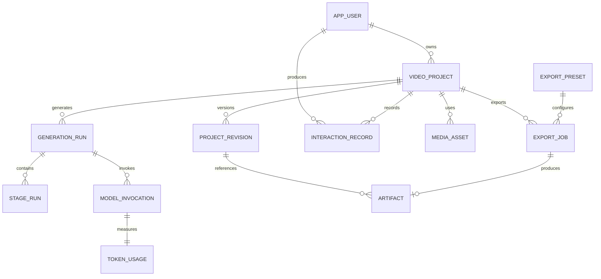

# GameNarrator 数据库设计

文档版本：2.0 草案  
更新时间：2026-07-28  
目标：支持多用户、完整输入输出留痕、参数版本、Token 统计、轻量工程保存和多规格按需导出。

## 1. 设计结论

当前 `video_tasks` 将任务、媒体信息、九阶段结果和最终视频路径集中在一张表中，适合单机原型，但不适合后续多用户、重复生成、Token 统计和多规格导出。

新版数据库采用以下原则：

1. 用户输入和系统输出按事件永久留痕，不被后续修改覆盖。
2. 任务配置使用不可变参数快照，能够还原任意一次生成。
3. 每次模型调用单独记录输入、输出、模型、Token、耗时和状态。
4. 数据库只保存元数据、文本、JSON 和文件索引，不保存大视频 BLOB。
5. 视频编辑结果优先保存为轻量工程包，不提前保存所有导出规格。
6. 导出是独立任务；用户选择格式后，由工程包和源素材重新渲染。
7. H2 继续用于本地开发，正式多用户版本迁移到 PostgreSQL。

## 2. 关键概念

### 2.1 项目与运行

- `project`：用户持续编辑的视频项目。
- `generation_run`：项目的一次完整或局部生成过程。
- `stage_run`：某次生成中的一个处理阶段执行记录。
- `project_revision`：用户参数、文案或时间线发生变化后形成的不可变版本。

项目可以存在多次生成。重新生成文案或配音时，不覆盖旧结果，而是创建新的运行和修订版本。

### 2.2 输入输出记录

所有用户输入和系统输出统一记录到 `interaction_record`：

- 用户表单参数。
- 用户上传文件。
- 用户修改后的文案和时间线。
- 模型提示词和模型响应。
- 系统生成摘要、错误和导出请求。

大体积文件不直接写入该表，只通过 `artifact_id` 引用文件索引。

### 2.3 轻量视频工程

系统不将每个生成版本都保存成 100 MB 以上的最终视频，而是保存：

- 源视频引用。
- 片段入点、出点和顺序。
- 字幕、文案和配音引用。
- 特效、转场和音效参数。
- 输出画布和时间基准。
- 所使用模型及参数版本。

这些内容组成 `project_revision.manifest_json`，并可额外打包成 `.gnproj` 文件。`.gnproj` 本质上是 ZIP 容器，包含清单 JSON 和必要的小型资源引用，不复制原始大视频。

网页预览只保留一个可清理的低码率代理视频；用户点击导出时才生成指定规格文件。

## 3. 总体关系



## 4. 表结构

### 4.1 `app_user` 用户

即使毕业设计首先以单用户运行，也必须创建默认本地用户，避免后续所有业务表再次迁移用户归属。

| 字段 | 类型 | 约束 | 说明 |
|---|---|---|---|
| id | UUID | PK | 用户 ID |
| username | VARCHAR(64) | UNIQUE, NOT NULL | 登录名或本地用户标识 |
| display_name | VARCHAR(100) | NOT NULL | 展示名称 |
| password_hash | VARCHAR(255) | NULL | 本地单用户模式可以为空 |
| role | VARCHAR(30) | NOT NULL | USER、ADMIN |
| status | VARCHAR(20) | NOT NULL | ACTIVE、DISABLED |
| created_at | TIMESTAMP | NOT NULL | 创建时间 |
| updated_at | TIMESTAMP | NOT NULL | 修改时间 |
| last_login_at | TIMESTAMP | NULL | 最近登录时间 |

默认数据：`local-user`。禁止将设备 ID、产品 ID 等硬件隐私作为用户主键。业务服务通过 `CurrentUserContext` 获取当前用户，不得再写入固定 UUID；当前单机实现为 `LocalUserContext`，未来可替换为已认证的请求上下文。

### 4.2 `video_project` 视频项目

只保存稳定的项目级信息，不再把所有阶段结果都堆积在该表。

| 字段 | 类型 | 约束 | 说明 |
|---|---|---|---|
| id | UUID | PK | 项目 ID |
| owner_id | UUID | FK app_user, NOT NULL | 所属用户 |
| name | VARCHAR(120) | NOT NULL | 项目名称 |
| description | VARCHAR(1000) | NULL | 项目描述 |
| game_category | VARCHAR(40) | NOT NULL | 内容类别 |
| commentary_style | VARCHAR(40) | NOT NULL | 通用创作风格 |
| status | VARCHAR(30) | NOT NULL | DRAFT、PROCESSING、READY、FAILED、ARCHIVED |
| current_revision_id | UUID | NULL | 当前工程修订版本 |
| latest_run_id | UUID | NULL | 最近生成运行 |
| created_at | TIMESTAMP | NOT NULL | 创建时间 |
| updated_at | TIMESTAMP | NOT NULL | 更新时间 |
| deleted_at | TIMESTAMP | NULL | 软删除时间 |
| version | BIGINT | NOT NULL | 乐观锁 |

索引：`(owner_id, updated_at DESC)`、`(owner_id, status)`。

### 4.3 `media_asset` 媒体素材

统一管理源视频、配音、图片、音效和字体。

| 字段 | 类型 | 约束 | 说明 |
|---|---|---|---|
| id | UUID | PK | 素材 ID |
| owner_id | UUID | FK, NOT NULL | 所属用户 |
| project_id | UUID | FK, NULL | 所属项目 |
| asset_type | VARCHAR(30) | NOT NULL | SOURCE_VIDEO、VOICE、IMAGE、SFX、FONT、PROXY |
| original_name | VARCHAR(255) | NULL | 原文件名 |
| storage_key | VARCHAR(500) | UNIQUE, NOT NULL | 相对存储键，不保存机器绝对路径 |
| sha256 | CHAR(64) | NOT NULL | 内容哈希，用于校验和去重 |
| mime_type | VARCHAR(100) | NOT NULL | MIME 类型 |
| size_bytes | BIGINT | NOT NULL | 文件大小 |
| duration_ms | BIGINT | NULL | 音视频时长 |
| width | INTEGER | NULL | 宽度 |
| height | INTEGER | NULL | 高度 |
| frame_rate | DECIMAL(10,4) | NULL | 帧率 |
| codec | VARCHAR(60) | NULL | 编码 |
| metadata_json | JSON/CLOB | NOT NULL | 其他媒体参数 |
| created_at | TIMESTAMP | NOT NULL | 创建时间 |
| deleted_at | TIMESTAMP | NULL | 软删除时间 |

文件通过 `storage_key` 相对于 `storage-root` 定位。API 不接受任意本地绝对路径。

### 4.4 `project_revision` 项目修订

保存能够还原成片的轻量工程状态。

| 字段 | 类型 | 约束 | 说明 |
|---|---|---|---|
| id | UUID | PK | 修订 ID |
| project_id | UUID | FK, NOT NULL | 项目 ID |
| revision_no | INTEGER | NOT NULL | 项目内递增版本号 |
| parent_revision_id | UUID | NULL | 来源版本 |
| created_by | UUID | FK app_user, NOT NULL | 创建者 |
| change_type | VARCHAR(40) | NOT NULL | INITIAL、AI_GENERATED、USER_EDIT、REGENERATED |
| change_summary | VARCHAR(500) | NULL | 修改摘要 |
| parameter_snapshot_json | JSON/CLOB | NOT NULL | 用户填写参数的完整快照 |
| manifest_json | JSON/CLOB | NOT NULL | 时间线、文案、字幕、配音、特效清单 |
| manifest_schema_version | INTEGER | NOT NULL | 工程格式版本 |
| manifest_sha256 | CHAR(64) | NOT NULL | 防止文件与数据库不一致 |
| created_at | TIMESTAMP | NOT NULL | 创建时间 |

唯一约束：`(project_id, revision_no)`。

`parameter_snapshot_json` 必须保留：

- 任务名称和创作要求。
- 游戏分类和解说风格。
- 目标时长。
- 所选模型、音色、语速和采样参数。
- 高光阈值、字幕模板、特效模板。
- 用户选择的其他所有表单字段。

### 4.5 `generation_run` 生成运行

| 字段 | 类型 | 约束 | 说明 |
|---|---|---|---|
| id | UUID | PK | 运行 ID |
| project_id | UUID | FK, NOT NULL | 项目 ID |
| user_id | UUID | FK, NOT NULL | 发起用户 |
| input_revision_id | UUID | FK, NOT NULL | 使用的参数版本 |
| output_revision_id | UUID | FK, NULL | 成功后生成的版本 |
| run_type | VARCHAR(30) | NOT NULL | FULL、SCRIPT_ONLY、VOICE_ONLY、TIMELINE_ONLY |
| status | VARCHAR(20) | NOT NULL | QUEUED、RUNNING、COMPLETED、FAILED、CANCELED |
| trigger_source | VARCHAR(20) | NOT NULL | USER、RECOVERY、SYSTEM |
| started_at | TIMESTAMP | NULL | 开始时间 |
| finished_at | TIMESTAMP | NULL | 完成时间 |
| elapsed_ms | BIGINT | NULL | 总耗时 |
| failure_code | VARCHAR(80) | NULL | 稳定错误码 |
| failure_message | VARCHAR(2000) | NULL | 用户可读错误 |
| trace_id | VARCHAR(80) | NULL | 日志追踪号 |
| created_at | TIMESTAMP | NOT NULL | 创建时间 |

索引：`(project_id, created_at DESC)`、`(user_id, created_at DESC)`、`(status, created_at)`。

### 4.6 `stage_run` 阶段执行

原 `processing_stages` 只保留当前状态，新表保留每次执行历史。

| 字段 | 类型 | 约束 | 说明 |
|---|---|---|---|
| id | UUID | PK | 阶段运行 ID |
| generation_run_id | UUID | FK, NOT NULL | 所属运行 |
| stage_type | VARCHAR(40) | NOT NULL | 九阶段类型 |
| attempt_no | INTEGER | NOT NULL | 重试次数 |
| status | VARCHAR(20) | NOT NULL | 状态 |
| progress | INTEGER | NOT NULL | 0–100 |
| input_snapshot_json | JSON/CLOB | NOT NULL | 阶段实际输入 |
| output_summary_json | JSON/CLOB | NULL | 输出摘要 |
| started_at | TIMESTAMP | NULL | 开始时间 |
| finished_at | TIMESTAMP | NULL | 完成时间 |
| elapsed_ms | BIGINT | NULL | 耗时 |
| error_code | VARCHAR(80) | NULL | 错误码 |
| error_message | VARCHAR(2000) | NULL | 错误信息 |

唯一约束：`(generation_run_id, stage_type, attempt_no)`。

### 4.7 `interaction_record` 输入输出留痕

这是满足“每个用户输入输出进行保留”的核心表，只追加，不原地覆盖。

| 字段 | 类型 | 约束 | 说明 |
|---|---|---|---|
| id | UUID | PK | 记录 ID |
| user_id | UUID | FK, NOT NULL | 用户 |
| project_id | UUID | FK, NULL | 项目 |
| generation_run_id | UUID | FK, NULL | 生成运行 |
| stage_run_id | UUID | FK, NULL | 具体阶段 |
| direction | VARCHAR(10) | NOT NULL | INPUT、OUTPUT |
| actor_type | VARCHAR(20) | NOT NULL | USER、SYSTEM、MODEL |
| interaction_type | VARCHAR(40) | NOT NULL | FORM、PROMPT、MODEL_RESPONSE、EDIT、ERROR、EXPORT_REQUEST |
| content_text | CLOB/TEXT | NULL | 可检索文本内容 |
| content_json | JSON/CLOB | NULL | 结构化内容 |
| artifact_id | UUID | FK artifact, NULL | 大文件引用 |
| content_sha256 | CHAR(64) | NOT NULL | 内容哈希 |
| contains_sensitive_data | BOOLEAN | NOT NULL | 是否包含敏感信息 |
| created_at | TIMESTAMP | NOT NULL | 发生时间 |

约束：`content_text`、`content_json`、`artifact_id` 至少一个非空。

保留模型提示词时不得包含图片 Base64，只记录模板、文本参数和图片素材 ID。

### 4.8 `model_invocation` 模型调用

每次 Ollama、Whisper 或 TTS 调用都应建记录。Token 只适用于能提供 Token 的模型；其他引擎保存对应计量单位。

| 字段 | 类型 | 约束 | 说明 |
|---|---|---|---|
| id | UUID | PK | 调用 ID |
| user_id | UUID | FK, NOT NULL | 计费/统计用户 |
| project_id | UUID | FK, NOT NULL | 项目 |
| generation_run_id | UUID | FK, NOT NULL | 运行 |
| stage_run_id | UUID | FK, NOT NULL | 阶段 |
| provider | VARCHAR(30) | NOT NULL | OLLAMA、WHISPER_CPP、PIPER |
| model_name | VARCHAR(120) | NOT NULL | 模型名 |
| model_digest | VARCHAR(128) | NULL | 模型版本或哈希 |
| operation | VARCHAR(40) | NOT NULL | VISION、CHAT、ASR、TTS |
| request_record_id | UUID | FK interaction_record | 输入记录 |
| response_record_id | UUID | FK interaction_record, NULL | 输出记录 |
| parameters_json | JSON/CLOB | NOT NULL | temperature、threads 等真实参数 |
| status | VARCHAR(20) | NOT NULL | RUNNING、SUCCEEDED、FAILED、CANCELED |
| started_at | TIMESTAMP | NOT NULL | 开始时间 |
| finished_at | TIMESTAMP | NULL | 结束时间 |
| elapsed_ms | BIGINT | NULL | 总耗时 |
| queue_ms | BIGINT | NULL | 排队耗时 |
| error_code | VARCHAR(80) | NULL | 错误码 |
| error_message | VARCHAR(2000) | NULL | 错误信息 |

### 4.9 `token_usage` Token 与资源统计

一条模型调用对应一条用量记录。使用 Ollama 时直接读取响应字段：

- `prompt_eval_count` → `input_tokens`
- `eval_count` → `output_tokens`
- 两者之和 → `total_tokens`
- `prompt_eval_duration`、`eval_duration` 用于速度实验

| 字段 | 类型 | 约束 | 说明 |
|---|---|---|---|
| id | UUID | PK | 用量 ID |
| invocation_id | UUID | UNIQUE FK, NOT NULL | 模型调用 |
| user_id | UUID | FK, NOT NULL | 用户，便于直接聚合 |
| project_id | UUID | FK, NOT NULL | 项目 |
| input_tokens | BIGINT | NOT NULL DEFAULT 0 | 输入 Token |
| output_tokens | BIGINT | NOT NULL DEFAULT 0 | 输出 Token |
| total_tokens | BIGINT | NOT NULL DEFAULT 0 | 总 Token |
| cached_tokens | BIGINT | NOT NULL DEFAULT 0 | 缓存 Token |
| image_count | INTEGER | NOT NULL DEFAULT 0 | VLM 图片数 |
| audio_seconds | DECIMAL(12,3) | NOT NULL DEFAULT 0 | ASR 音频秒数 |
| tts_characters | BIGINT | NOT NULL DEFAULT 0 | TTS 字符数 |
| prompt_eval_ms | BIGINT | NULL | 输入处理耗时 |
| generation_ms | BIGINT | NULL | 生成耗时 |
| tokens_per_second | DECIMAL(12,3) | NULL | 生成速度 |
| estimated_cost | DECIMAL(18,8) | NULL | 云模型预估费用，本地模型为 0 |
| currency | CHAR(3) | NULL | CNY、USD；本地可为空 |
| measured_at | TIMESTAMP | NOT NULL | 统计时间 |

`total_tokens` 必须由服务端计算，不能信任客户端提交。失败调用也要保存已产生的 Token。

常用统计：

```sql
-- 用户累计 Token
SELECT user_id,
       SUM(input_tokens) AS input_tokens,
       SUM(output_tokens) AS output_tokens,
       SUM(total_tokens) AS total_tokens
FROM token_usage
GROUP BY user_id;

-- 用户每日、按模型统计
SELECT t.user_id, CAST(t.measured_at AS DATE) AS usage_date,
       m.model_name, SUM(t.total_tokens) AS total_tokens
FROM token_usage t
JOIN model_invocation m ON m.id = t.invocation_id
GROUP BY t.user_id, CAST(t.measured_at AS DATE), m.model_name;
```

索引：`(user_id, measured_at)`、`(project_id, measured_at)`。

### 4.10 `artifact` 生成产物索引

| 字段 | 类型 | 约束 | 说明 |
|---|---|---|---|
| id | UUID | PK | 产物 ID |
| owner_id | UUID | FK, NOT NULL | 用户 |
| project_id | UUID | FK, NOT NULL | 项目 |
| revision_id | UUID | FK, NULL | 所属工程版本 |
| generation_run_id | UUID | FK, NULL | 来源运行 |
| artifact_type | VARCHAR(40) | NOT NULL | TRANSCRIPT、VISUAL_ANALYSIS、TIMELINE、VOICE、PROJECT_PACKAGE、PREVIEW、EXPORT |
| storage_key | VARCHAR(500) | UNIQUE, NOT NULL | 相对存储键 |
| mime_type | VARCHAR(100) | NOT NULL | MIME 类型 |
| size_bytes | BIGINT | NOT NULL | 大小 |
| sha256 | CHAR(64) | NOT NULL | 校验值 |
| schema_version | INTEGER | NULL | JSON/工程格式版本 |
| temporary | BOOLEAN | NOT NULL | 是否临时产物 |
| expires_at | TIMESTAMP | NULL | 自动清理时间 |
| created_at | TIMESTAMP | NOT NULL | 创建时间 |
| deleted_at | TIMESTAMP | NULL | 删除时间 |

### 4.11 `export_preset` 导出预设

导出选项参考 Premiere 类剪辑软件的常用概念，但只暴露当前 FFmpeg 能稳定支持的参数。

| 字段 | 类型 | 约束 | 说明 |
|---|---|---|---|
| id | UUID | PK | 预设 ID |
| owner_id | UUID | FK, NULL | 空表示系统预设 |
| name | VARCHAR(100) | NOT NULL | 预设名称 |
| description | VARCHAR(500) | NULL | 说明 |
| container | VARCHAR(20) | NOT NULL | MP4、MOV、WEBM |
| video_codec | VARCHAR(30) | NOT NULL | H264、HEVC、AV1、VP9、PRORES |
| audio_codec | VARCHAR(30) | NOT NULL | AAC、OPUS、PCM |
| width | INTEGER | NULL | 空表示跟随源/项目 |
| height | INTEGER | NULL | 空表示跟随源/项目 |
| frame_rate | DECIMAL(8,3) | NULL | 空表示跟随源 |
| rate_control | VARCHAR(20) | NOT NULL | CQ、VBR、CBR |
| quality_value | INTEGER | NULL | CQ/CRF 值 |
| target_bitrate_kbps | INTEGER | NULL | 目标码率 |
| max_bitrate_kbps | INTEGER | NULL | 最大码率 |
| hardware_encoder | VARCHAR(30) | NULL | H264_NVENC、HEVC_NVENC、LIBX264 等 |
| audio_bitrate_kbps | INTEGER | NULL | 音频码率 |
| audio_sample_rate | INTEGER | NOT NULL | 44100、48000 |
| subtitle_mode | VARCHAR(20) | NOT NULL | NONE、SOFT、BURN_IN、SEPARATE_SRT |
| color_space | VARCHAR(30) | NOT NULL | REC709、SRGB、SOURCE |
| extra_options_json | JSON/CLOB | NOT NULL | GOP、B 帧、像素格式等高级参数 |
| system_preset | BOOLEAN | NOT NULL | 是否内置 |
| created_at | TIMESTAMP | NOT NULL | 创建时间 |
| updated_at | TIMESTAMP | NOT NULL | 更新时间 |

系统首批预设：

| 预设 | 容器/编码 | 分辨率 | 帧率 | 字幕 | 用途 |
|---|---|---|---|---|---|
| 快速预览 | MP4/H.264 NVENC | 720p | 30 | 软字幕 | 网站快速查看 |
| 通用高清 | MP4/H.264 NVENC | 1080p | 跟随项目，最高 60 | 可选软/烧录 | B 站、普通播放器 |
| 高压缩高清 | MP4/HEVC NVENC | 1080p | 跟随项目 | 可选 | 更小文件 |
| 保持源画质 | MP4/H.264 或 HEVC | 跟随源 | 跟随源 | 可选 | 本地归档 |
| 后期编辑 | MOV/ProRes 422 + PCM | 跟随项目 | 跟随项目 | 单独 SRT | 导入 Premiere 等软件继续编辑 |
| Web 发布 | WEBM/VP9 或 AV1 | 1080p | 30/60 | WebVTT/无 | 网页传播 |
| 纯字幕 | SRT | 无视频 | 无 | 单独文件 | 字幕二次编辑 |
| 纯配音 | WAV | 无视频 | 无 | 无 | 音频二次编辑 |

1.0 页面建议只显示“格式、清晰度、帧率、质量、字幕”五个主要选项，高级参数折叠，避免普通用户误配。

### 4.12 `export_job` 导出任务

每点击一次导出都创建新记录，并冻结本次导出的真实参数。

| 字段 | 类型 | 约束 | 说明 |
|---|---|---|---|
| id | UUID | PK | 导出任务 ID |
| project_id | UUID | FK, NOT NULL | 项目 |
| revision_id | UUID | FK, NOT NULL | 要导出的工程版本 |
| requested_by | UUID | FK, NOT NULL | 用户 |
| preset_id | UUID | FK, NULL | 使用预设 |
| export_name | VARCHAR(200) | NOT NULL | 导出名称 |
| settings_snapshot_json | JSON/CLOB | NOT NULL | 最终生效设置，不能只引用可变预设 |
| status | VARCHAR(20) | NOT NULL | QUEUED、RENDERING、COMPLETED、FAILED、CANCELED、EXPIRED |
| progress | INTEGER | NOT NULL | 0–100 |
| output_artifact_id | UUID | FK artifact, NULL | 导出文件 |
| started_at | TIMESTAMP | NULL | 开始时间 |
| completed_at | TIMESTAMP | NULL | 完成时间 |
| expires_at | TIMESTAMP | NULL | 下载有效期 |
| downloaded_at | TIMESTAMP | NULL | 最近下载时间 |
| download_count | INTEGER | NOT NULL DEFAULT 0 | 下载次数 |
| error_code | VARCHAR(80) | NULL | 错误码 |
| error_message | VARCHAR(2000) | NULL | 错误信息 |
| created_at | TIMESTAMP | NOT NULL | 请求时间 |

索引：`(project_id, created_at DESC)`、`(requested_by, created_at DESC)`、`(status, created_at)`。

## 5. 轻量工程清单结构

数据库中的 `manifest_json` 建议使用以下结构：

```json
{
  "schemaVersion": 2,
  "projectId": "uuid",
  "timebase": 1000,
  "canvas": {"width": 1920, "height": 1080, "frameRate": 60},
  "sourceAssets": [{"assetId": "uuid", "role": "MAIN_VIDEO"}],
  "tracks": [
    {
      "type": "VIDEO",
      "clips": [
        {
          "sourceAssetId": "uuid",
          "sourceInMs": 55133,
          "sourceOutMs": 67133,
          "timelineInMs": 12000,
          "timelineOutMs": 24000,
          "effects": [{"type": "ZOOM", "params": {"from": 1.0, "to": 1.08}}]
        }
      ]
    },
    {
      "type": "VOICE",
      "clips": [{"assetId": "uuid", "timelineInMs": 12000, "gainDb": 0}]
    },
    {
      "type": "SUBTITLE",
      "items": [{"startMs": 12000, "endMs": 24000, "text": "字幕内容", "styleId": "anime-default"}]
    }
  ]
}
```

还原导出流程：

```text
export_job
  → 读取 project_revision.manifest_json
  → 校验源素材和小型产物哈希
  → 将工程清单编译为 FFmpeg 渲染计划
  → 按 settings_snapshot_json 编码
  → 创建 EXPORT artifact
  → 提供预览或下载
  → 到期后清理导出文件，但保留 export_job 记录
```

## 6. Token 统计业务规则

### 6.1 记录时机

1. 模型请求发送前创建 `model_invocation(RUNNING)` 和 INPUT 记录。
2. 收到完整响应后创建 OUTPUT 记录。
3. 从响应信封读取 Token 与耗时，写入 `token_usage`。
4. 在同一事务中把调用标记为 `SUCCEEDED`。
5. 请求失败时仍保存错误、已知 Token 和耗时。

### 6.2 统计口径

- 用户总消耗：按 `user_id` 聚合全部成功和失败调用。
- 项目消耗：按 `project_id` 聚合。
- 单次生成消耗：按 `generation_run_id` 聚合。
- 阶段消耗：按 `stage_run_id` 聚合。
- 模型对比：按 `model_name + model_digest` 聚合。
- 本地模型的 `estimated_cost` 为 0，但 Token 数和算力耗时必须保留。
- Whisper 统计音频秒数，Piper 统计字符数，不能伪造成 Token。

### 6.3 防重复

- `token_usage.invocation_id` 唯一。
- 模型调用生成客户端 `request_key`，重试请求不得重复计账。
- 恢复任务时先检查成功的 invocation 和产物哈希，再决定是否重新调用。

## 7. 用户输入输出保留策略

“保留”不代表无限复制大文件：

- 表单、提示词、模型文本响应、用户编辑：保存在数据库。
- 图片、视频、音频：保存为文件，数据库记录 `artifact/media_asset`。
- 图片不得以 Base64 形式长期保存在请求 JSON 中。
- 每次修改创建新 `project_revision` 和 `interaction_record`。
- 手动剪辑命令（分割、移动、修剪、轨道状态、关键帧和调色）将 `editorTimeline` 写入新的 `project_revision.manifest_json`。撤销将 `video_project.current_revision_id` 移到父版本，重做移到最新子版本；因此历史可跨页面刷新和进程重启保留。
- UI 显示“当前版本”，历史页可以查看此前版本和生成结果。
- 用户删除项目时先软删除；执行物理清理前检查其他版本是否引用同一素材。

建议默认保留：

| 数据 | 默认策略 |
|---|---|
| 项目、参数、文本输入输出、Token 记录 | 长期保留，用户明确删除后按策略清理 |
| 原始素材 | 项目存续期间保留 |
| 工程清单、文案、字幕、配音 | 项目存续期间保留 |
| 720p 预览代理 | 7–30 天无访问可重建 |
| 用户导出文件 | 7 天后自动清理，可重新导出 |
| render-work 中间文件 | 成功后 24 小时内清理 |
| 失败诊断文件 | 7 天后清理 |

## 8. 一致性与事务

- 数据库事务不能包住长时间 FFmpeg 或模型调用。
- 开始外部调用前提交 `RUNNING` 状态。
- 文件先写入 `.part` 临时路径，校验成功后原子改名，再提交产物记录。
- 阶段完成、产物记录和输出修订应在同一短事务中提交。
- 导出成功只有在文件存在、可读取且媒体探测通过后才能写 `COMPLETED`。
- 删除工程时使用引用计数或查询引用，禁止直接删除仍被历史版本使用的素材。
- `video_project.version` 使用 JPA `@Version`，防止用户编辑和后台生成互相覆盖。

## 9. H2 与 PostgreSQL 映射

| 逻辑类型 | H2 开发 | PostgreSQL 正式 |
|---|---|---|
| UUID | UUID | UUID |
| JSON | CLOB + 应用层校验 | JSONB |
| 长文本 | CLOB | TEXT |
| 时间 | TIMESTAMP WITH TIME ZONE | TIMESTAMPTZ |
| 乐观锁 | BIGINT | BIGINT |

正式迁移后应为常用 JSON 查询字段增加生成列或 JSONB GIN 索引，但第一阶段不要把所有业务字段都藏在 JSON 中。用户、项目、状态、时间、Token、导出格式等高频筛选字段必须使用普通列。

## 10. 数据迁移方案

### 阶段 A：在现有 H2 中增加审计和 Token 表

1. 创建 `app_user`，插入 `local-user`。
2. 为现有 `video_tasks` 增加 `owner_id`。
3. 新增 `generation_run`、`stage_run`、`interaction_record`、`model_invocation`、`token_usage`。
4. 新任务开始写新表，现有页面仍读取 `video_tasks`。

### 阶段 B：引入项目修订和产物索引

1. 创建 `video_project`、`project_revision`、`media_asset`、`artifact`。
2. 把现有任务的 JSON 文件转换为初始工程清单。
3. 相对化所有绝对文件路径为 `storage_key`。
4. 保留旧字段只读，验证稳定后再删除。

### 阶段 C：按需导出

1. 创建 `export_preset` 和 `export_job`。
2. 九阶段末尾生成低码率预览代理和工程包，不再默认生成全部质量成片。
3. 导出页面提交导出设置并轮询/SSE 查看进度。
4. 导出文件到期清理，工程清单继续保留。

### 阶段 D：PostgreSQL

1. 使用 Flyway 管理版本迁移，禁止继续依赖 `ddl-auto=update`。
2. 将 JSON CLOB 转换为 JSONB。
3. 增加用户认证、权限校验和数据隔离测试。
4. 完成 H2 到 PostgreSQL 数据迁移脚本和校验报告。

## 11. API 对数据库的要求

建议新增：

```text
GET  /api/users/me/usage                       当前用户 Token 汇总
GET  /api/projects/{id}/runs                   生成历史
GET  /api/projects/{id}/revisions              工程版本历史
POST /api/projects/{id}/revisions              保存用户修改
GET  /api/export-presets                       可用导出预设
POST /api/projects/{id}/exports                创建导出任务
GET  /api/exports/{id}                         查询导出进度
GET  /api/exports/{id}/download                下载导出文件
POST /api/exports/{id}/cancel                  取消导出
```

创建导出请求示例：

```json
{
  "revisionId": "uuid",
  "presetId": "system-h264-1080p",
  "overrides": {
    "frameRate": 60,
    "qualityValue": 23,
    "subtitleMode": "BURN_IN"
  }
}
```

服务端必须把预设和覆盖项合并为 `settings_snapshot_json`，后续即使预设被修改，本次导出仍可复现。

## 12. 数据安全

- 所有项目查询必须带 `owner_id` 条件，不能先按 ID 查询后再补权限判断。
- 下载接口通过 `artifact_id/export_job_id` 定位文件，不接受路径参数。
- `interaction_record` 可能包含用户原始输入，应支持敏感标记和删除审计。
- 密钥、密码、Authorization Header 不写入输入输出记录。
- 模型原始响应可长期保存文本，但图片 Base64 和视频二进制必须剥离。
- 文件下载使用短期授权或当前登录会话验证。

## 13. 首轮实施验收标准

1. 每个新任务都有明确 `owner_id`。
2. 创建任务时用户填写的全部参数形成不可变快照。
3. 每次视觉和文案模型请求均产生 INPUT、OUTPUT、invocation 和 usage 记录。
4. 页面能按用户、项目和单次运行展示输入、输出和总 Token。
5. 本地模型费用显示为 0，但 Token、耗时、图片数、音频秒数和 TTS 字符数准确。
6. 项目修改不会覆盖旧版本，可以选择历史版本重新导出。
7. 默认保存轻量工程清单和预览代理，不为每种导出规格永久保存完整视频。
8. 用户至少可以选择 H.264 1080p、HEVC 1080p、保持源画质、后期编辑 MOV、字幕模式和帧率。
9. 每次导出保存完整设置快照，并生成独立 `export_job`。
10. 清理导出文件后，仍能使用工程修订重新生成相同规格文件。

## 14. 实施优先级

1. Flyway 与数据库迁移基线。
2. `app_user`、项目归属和参数快照。
3. `generation_run/stage_run` 执行历史。
4. 模型调用输入输出与 Token 统计。
5. `media_asset/artifact` 相对存储键。
6. `project_revision` 轻量工程清单。
7. 导出预设、导出任务和多格式 FFmpeg 适配。
8. 导出文件过期清理和重新导出。
9. PostgreSQL 切换和权限隔离。

## 15. 当前迁移补充与回滚说明

- V20 为 `video_tasks` 增加独立的 `version BIGINT NOT NULL DEFAULT 0`。它用于任务状态与分镜编辑的 JPA 乐观锁；`video_project.version` 继续只保护项目元数据，两列互不替代。
- H2 回滚 V20 时，应先停止后台任务，再执行 `ALTER TABLE video_tasks DROP COLUMN version`。生产数据回滚前必须备份；Flyway 已执行的迁移文件不得修改。
- 外部进程并发、临时文件保留时间、SSE 刷新周期和缩略图 TTL 属于运行配置，不是数据库字段。
- 到期导出清理会删除物理文件，将 `artifact.deleted_at` 写为清理时间，并把 `export_job.status` 更新为 `EXPIRED`；任务和参数快照继续保留，可重新导出。
# 可解释事件数据

`game_events` 是视觉分析与文案生成之间的事实层。V23 在原有事件表上增加：

- `source_frame_index`、`anchor_seconds`：定位证据帧和事件锚点。
- `evidence_json`：结构化保存画面说明、OCR 和评分证据。
- `confirmation_status`：`AI_SUGGESTED`、`CONFIRMED` 或 `NEEDS_REVIEW`。
- `manually_edited`：区分模型初稿与用户修正结果，并阻止流水线静默覆盖人工判断。
- `knowledge_pack_code`：记录事件由哪个游戏知识包解释。

## `battle_narrative_plan`

- 每个任务最多保存一份当前五幕战局叙事计划。
- `plan_json` 保存铺垫、危机、转折、高潮、结果及其镜头、节奏、解说和音乐参数。
- `confirmed_event_fingerprint` 用于检测计划生成后人工确认事实是否发生变化。
- `applied`、`generated_at`、`applied_at` 记录计划生成与应用状态。

## `game_knowledge_packs` 与 `director_edit_decisions`

- `game_knowledge_packs` 保存知识包 code、格式版本、完整 JSON、内置/启用状态和导入时间；code 是稳定的导入导出标识。
- `director_edit_decisions` 保存任务、镜头、决策类型、AI/修改前 JSON、用户最终 JSON，以及镜头长度比例、文案密度比例和特效偏好。
- 删除任务时，其导演修改样本通过外键级联删除，避免保留无法追溯来源的训练偏好。
- 个人导演档案是对决策表的实时聚合视图，不重复保存可失效的派生快照。

## `source_media_storage`

- 每个视频任务保存一条源媒体存储登记，主键同时是 `video_tasks` 外键。
- `storage_mode` 区分受管文件与未来可能支持的外部引用；当前 Web 上传只产生 `MANAGED`。
- `storage_path`、`size_bytes`、`content_type`、`filesystem_key` 用于容量统计和后台核查，数据库不保存视频二进制内容。
- `last_verified_at` 记录最后一次确认文件存在和大小可读的时间。
- 任务删除后登记记录级联删除；实际文件仍由事务提交后的安全存储清理边界删除。
- `updated_at`：记录最近一次机器生成或人工确认时间。

删除视频任务时事件记录通过外键级联删除。事件按任务与时间建立索引，供分镜工作台和事实约束文案生成读取。
## `community_resource`、`creative_variant` 与 `editing_decision_report`

- `community_resource` 保存社区知识包和剪辑风格的元数据与 JSON 载荷，`resource_type + code` 唯一；作者、许可、标签、格式版本和安装次数用于分享与兼容性判断。
- `creative_variant` 关联原始任务，保存剧情、攻略、搞笑、复盘四种版本的独立策略和生成状态。`generated_task_id` 指向实际成片任务，而源视频通过存储引用复用，不复制大文件。
- `editing_decision_report` 保存版本化 JSON 报告和 Markdown 快照，确保后续剪辑变化后仍能追溯当时的决策说明。
